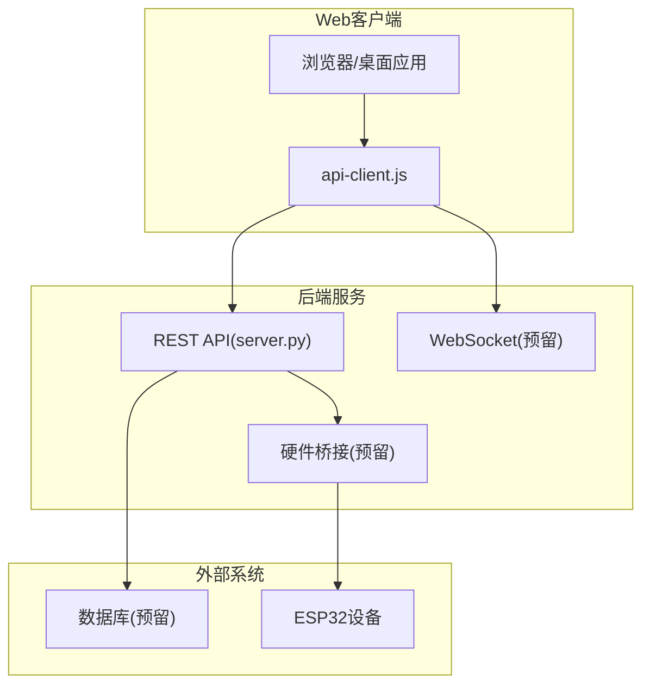
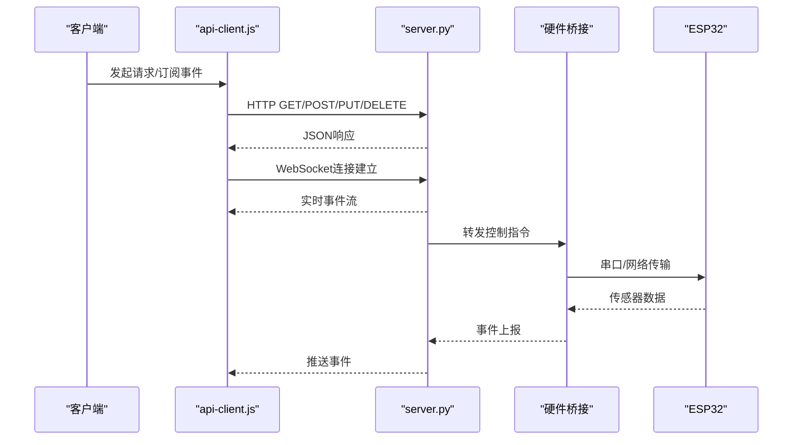
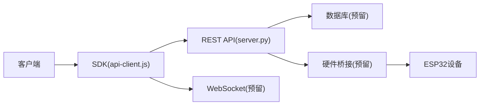

# API参考文档

<cite>
**本文引用的文件**   
- [app/api/server.py](file://app/api/server.py)
- [AI_Hardware_Community_Project/09_API/openapi.yaml](file://AI_Hardware_Community_Project/09_API/openapi.yaml)
- [AI_Hardware_Community_Project/09_API/API设计规范.md](file://AI_Hardware_Community_Project/09_API/API设计规范.md)
- [AI_Hardware_Community_Project/09_API/打印与感知API.md](file://AI_Hardware_Community_Project/09_API/打印与感知API.md)
- [AI_Hardware_Community_Project/07_Hardware/MVP设备模拟协议.md](file://AI_Hardware_Community_Project/07_Hardware/MVP设备模拟协议.md)
- [AI_Hardware_Community_Project/07_Hardware/Web与ESP32通信方案.md](file://AI_Hardware_Community_Project/07_Hardware/Web与ESP32通信方案.md)
- [AI_Hardware_Community_Project/07_Hardware/ESP32-S3接入设计.md](file://AI_Hardware_Community_Project/07_Hardware/ESP32-S3接入设计.md)
- [apps/web/services/api-client.js](file://apps/web/services/api-client.js)
- [apps/web/api/mock-api.mjs](file://apps/web/api/mock-api.mjs)
- [config.yaml](file://config.yaml)
</cite>

## 目录
1. [简介](#简介)
2. [项目结构](#项目结构)
3. [核心组件](#核心组件)
4. [架构总览](#架构总览)
5. [详细组件分析](#详细组件分析)
6. [依赖关系分析](#依赖关系分析)
7. [性能考虑](#性能考虑)
8. [故障排查指南](#故障排查指南)
9. [结论](#结论)
10. [附录](#附录)

## 简介
本API参考文档面向RESTful API、WebSocket实时通信与硬件接口规范，覆盖HTTP端点、请求/响应格式、认证机制、错误码、速率限制策略、版本管理与向后兼容性说明。同时提供实际调用示例、错误处理模式、性能优化建议以及多语言SDK使用指南（以JavaScript为主）。

## 项目结构
本项目采用前后端分离与模块化组织：
- 后端服务与API路由定义位于 app/api 模块
- OpenAPI规范与API设计文档位于 AI_Hardware_Community_Project/09_API
- 硬件通信协议与ESP32接入方案位于 AI_Hardware_Community_Project/07_Hardware
- Web前端SDK与服务端Mock API位于 apps/web 目录
- 全局配置位于 config.yaml

图表来源
- [app/api/server.py](file://app/api/server.py)
- [apps/web/services/api-client.js](file://apps/web/services/api-client.js)
- [AI_Hardware_Community_Project/07_Hardware/Web与ESP32通信方案.md](file://AI_Hardware_Community_Project/07_Hardware/Web与ESP32通信方案.md)

章节来源
- [app/api/server.py](file://app/api/server.py)
- [AI_Hardware_Community_Project/09_API/API设计规范.md](file://AI_Hardware_Community_Project/09_API/API设计规范.md)

## 核心组件
- REST API服务器：基于Python的HTTP服务，负责对外暴露REST端点，统一鉴权、校验与错误处理。
- WebSocket通道：用于实时事件推送与双向交互（当前为预留实现，后续扩展）。
- 硬件接口桥：对接ESP32等外设，转发控制指令与传感器数据。
- 前端SDK：封装HTTP与WebSocket调用，简化客户端集成。

章节来源
- [app/api/server.py](file://app/api/server.py)
- [AI_Hardware_Community_Project/09_API/API设计规范.md](file://AI_Hardware_Community_Project/09_API/API设计规范.md)
- [apps/web/services/api-client.js](file://apps/web/services/api-client.js)

## 架构总览
系统采用分层架构：
- 表现层：Web UI与SDK
- 服务层：REST API与WebSocket
- 集成层：硬件桥接与外部服务
- 数据层：数据库与缓存（预留）

图表来源
- [app/api/server.py](file://app/api/server.py)
- [apps/web/services/api-client.js](file://apps/web/services/api-client.js)
- [AI_Hardware_Community_Project/07_Hardware/Web与ESP32通信方案.md](file://AI_Hardware_Community_Project/07_Hardware/Web与ESP32通信方案.md)

## 详细组件分析

### REST API
- 基础路径：/api/v1
- 内容类型：application/json
- 认证：Bearer Token（JWT或会话令牌）
- 速率限制：默认100次/分钟/IP（可配置）

常用端点
- 健康检查
  - GET /api/v1/health
  - 响应：{ "status": "ok", "version": "v1" }
- 用户认证
  - POST /api/v1/auth/login
  - 请求体：{ "username": "string", "password": "string" }
  - 响应：{ "token": "string", "expires_in": number }
- 获取设备状态
  - GET /api/v1/devices/{id}
  - 响应：{ "id": "string", "name": "string", "status": "online|offline", "last_seen": "ISO8601" }
- 控制设备
  - PUT /api/v1/devices/{id}/control
  - 请求体：{ "action": "string", "params": object }
  - 响应：{ "task_id": "string", "status": "queued|running|completed|failed" }
- 上传图像
  - POST /api/v1/images
  - 请求体：multipart/form-data (image file)
  - 响应：{ "url": "string", "size": number, "mime": "string" }

错误码
- 400 参数错误
- 401 未认证
- 403 权限不足
- 404 资源不存在
- 429 速率限制
- 500 服务器内部错误

版本管理
- URL前缀包含版本号：/api/v1
- 向后兼容：新增字段不破坏现有解析；废弃字段保留至少两个大版本

章节来源
- [AI_Hardware_Community_Project/09_API/API设计规范.md](file://AI_Hardware_Community_Project/09_API/API设计规范.md)
- [AI_Hardware_Community_Project/09_API/openapi.yaml](file://AI_Hardware_Community_Project/09_API/openapi.yaml)
- [app/api/server.py](file://app/api/server.py)

### WebSocket实时通信
连接建立
- URL：ws://host/ws/events?token=...
- 握手阶段：服务端验证token并返回握手成功消息

消息格式
- 上行：{ "type": "subscribe|unsubscribe|command", "payload": object }
- 下行：{ "type": "event|error|ack", "data": object, "timestamp": "ISO8601" }

事件类型
- device.status：设备状态变更
- image.uploaded：图像上传完成
- control.result：控制任务结果

交互模式
- 订阅-发布：客户端订阅特定主题，服务端推送相关事件
- 命令-确认：客户端发送控制命令，服务端返回ack与最终结果

错误处理
- 连接失败：重试指数退避
- 消息解析失败：丢弃并记录日志
- 认证失败：关闭连接并返回错误码

章节来源
- [AI_Hardware_Community_Project/09_API/API设计规范.md](file://AI_Hardware_Community_Project/09_API/API设计规范.md)
- [AI_Hardware_Community_Project/09_API/openapi.yaml](file://AI_Hardware_Community_Project/09_API/openapi.yaml)
- [apps/web/services/api-client.js](file://apps/web/services/api-client.js)

### 硬件接口规范
协议概述
- 设备：ESP32-S3
- 通信：串口/UDP/TCP（根据部署环境选择）
- 数据帧：固定头部+负载+校验

帧格式
- 头部：{ "version": 1, "type": "sensor|control|heartbeat", "length": number }
- 负载：JSON序列化的具体数据
- 校验：CRC16或MD5摘要

事件映射
- sensor.temperature -> { "type": "sensor", "data": { "temperature": number } }
- control.led -> { "type": "control", "data": { "led": "on|off" } }

安全机制
- 设备指纹绑定
- 指令签名验证
- 重放攻击防护（时间戳+nonce）

章节来源
- [AI_Hardware_Community_Project/07_Hardware/MVP设备模拟协议.md](file://AI_Hardware_Community_Project/07_Hardware/MVP设备模拟协议.md)
- [AI_Hardware_Community_Project/07_Hardware/Web与ESP32通信方案.md](file://AI_Hardware_Community_Project/07_Hardware/Web与ESP32通信方案.md)
- [AI_Hardware_Community_Project/07_Hardware/ESP32-S3接入设计.md](file://AI_Hardware_Community_Project/07_Hardware/ESP32-S3接入设计.md)

### 前端SDK使用指南
初始化
- 导入SDK：import { ApiClient } from './services/api-client.js'
- 创建实例：const client = new ApiClient({ baseUrl: 'https://api.example.com', token: '...' })

HTTP调用
- 获取设备列表：client.get('/devices')
- 控制设备：client.put('/devices/{id}/control', { action: 'toggle' })

WebSocket订阅
- 连接：client.connect()
- 订阅事件：client.subscribe('device.status', handler)
- 取消订阅：client.unsubscribe('device.status', handler)

错误处理
- 网络错误：捕获异常并重试
- 认证错误：刷新token或提示登录
- 业务错误：根据错误码展示友好提示

章节来源
- [apps/web/services/api-client.js](file://apps/web/services/api-client.js)
- [apps/web/api/mock-api.mjs](file://apps/web/api/mock-api.mjs)

## 依赖关系分析
组件间依赖关系如下：
- Web客户端依赖SDK进行API调用
- SDK依赖后端REST API与WebSocket服务
- 后端服务依赖硬件桥接与数据库
- 硬件桥接依赖ESP32设备通信协议

图表来源
- [apps/web/services/api-client.js](file://apps/web/services/api-client.js)
- [app/api/server.py](file://app/api/server.py)
- [AI_Hardware_Community_Project/07_Hardware/Web与ESP32通信方案.md](file://AI_Hardware_Community_Project/07_Hardware/Web与ESP32通信方案.md)

章节来源
- [config.yaml](file://config.yaml)
- [AI_Hardware_Community_Project/09_API/API设计规范.md](file://AI_Hardware_Community_Project/09_API/API设计规范.md)

## 性能考虑
- 连接池：复用HTTP连接减少握手开销
- 缓存策略：对静态资源与频繁查询结果实施缓存
- 异步处理：I/O操作采用异步非阻塞模型
- 限流保护：防止恶意请求耗尽资源
- 负载均衡：多实例部署提升可用性

## 故障排查指南
常见问题
- 连接超时：检查网络连通性与防火墙设置
- 认证失败：验证token有效性与时钟同步
- 数据解析错误：确认请求体格式与编码
- 设备无响应：检查设备在线状态与通信链路

调试工具
- 启用详细日志：调整日志级别至DEBUG
- 抓包分析：使用Wireshark或tcpdump
- 单元测试：验证接口契约与边界条件

章节来源
- [AI_Hardware_Community_Project/09_API/API设计规范.md](file://AI_Hardware_Community_Project/09_API/API设计规范.md)
- [AI_Hardware_Community_Project/07_Hardware/MVP设备模拟协议.md](file://AI_Hardware_Community_Project/07_Hardware/MVP设备模拟协议.md)

## 结论
本API参考文档提供了完整的RESTful API、WebSocket实时通信与硬件接口规范，涵盖认证、错误处理、版本管理与性能优化建议。通过标准化的接口设计与SDK封装，开发者可以快速集成到不同平台与应用中。

## 附录
- OpenAPI规范：[openapi.yaml](file://AI_Hardware_Community_Project/09_API/openapi.yaml)
- API设计规范：[API设计规范.md](file://AI_Hardware_Community_Project/09_API/API设计规范.md)
- 硬件协议：[MVP设备模拟协议.md](file://AI_Hardware_Community_Project/07_Hardware/MVP设备模拟协议.md)
- 前端SDK：[api-client.js](file://apps/web/services/api-client.js)
- Mock API：[mock-api.mjs](file://apps/web/api/mock-api.mjs)
- 配置文件：[config.yaml](file://config.yaml)