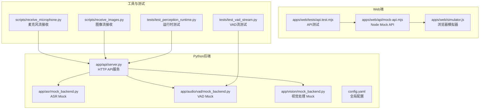
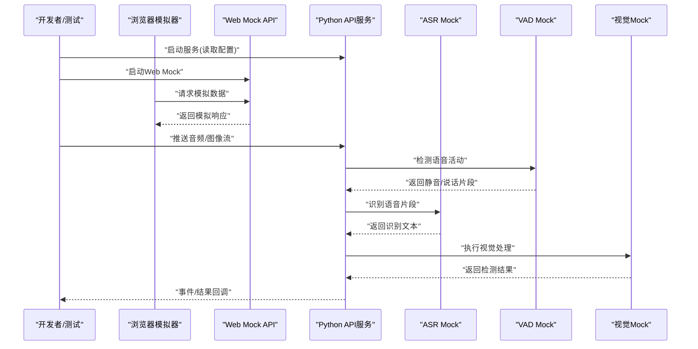
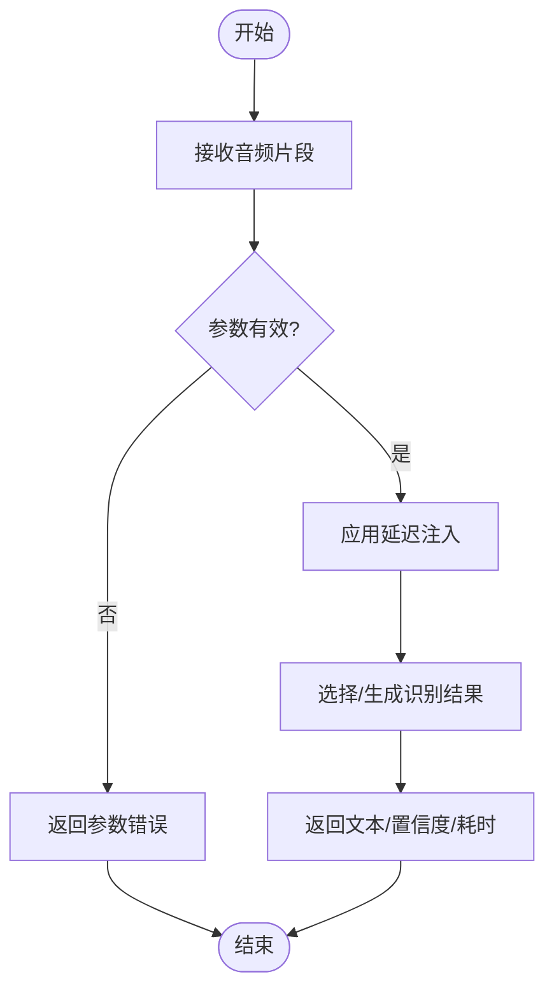
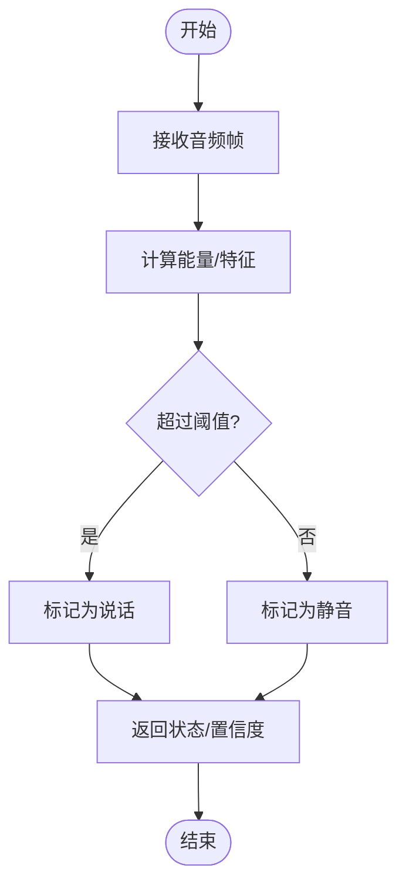
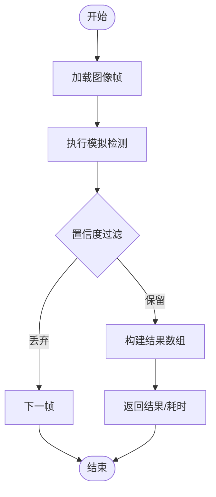
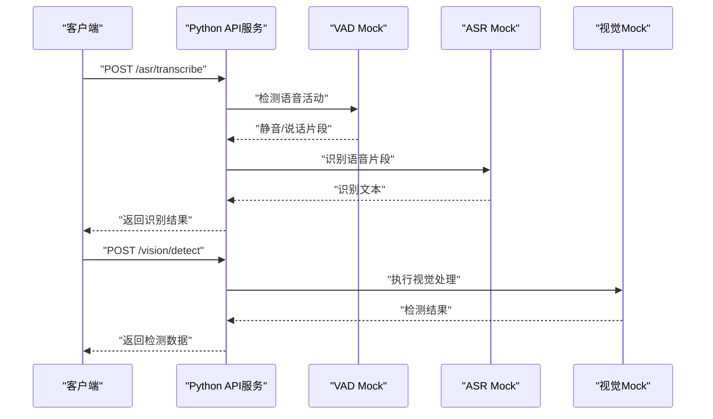
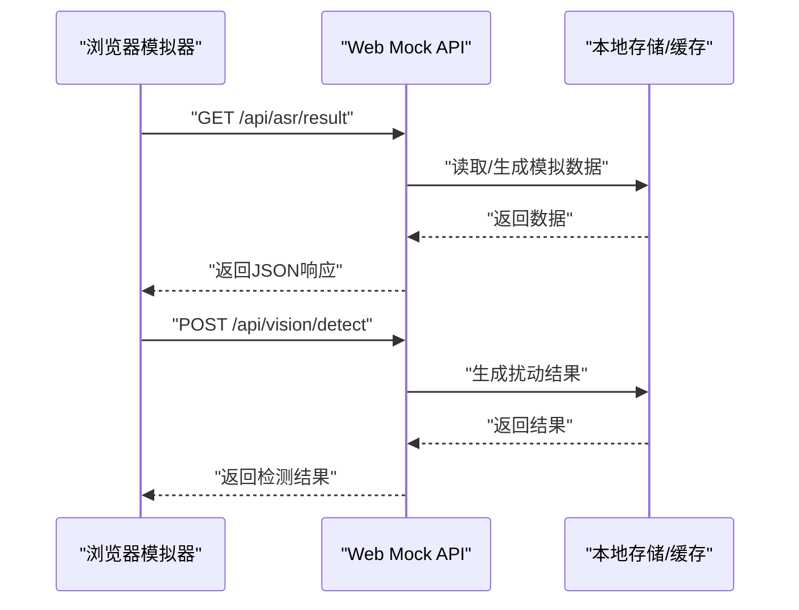
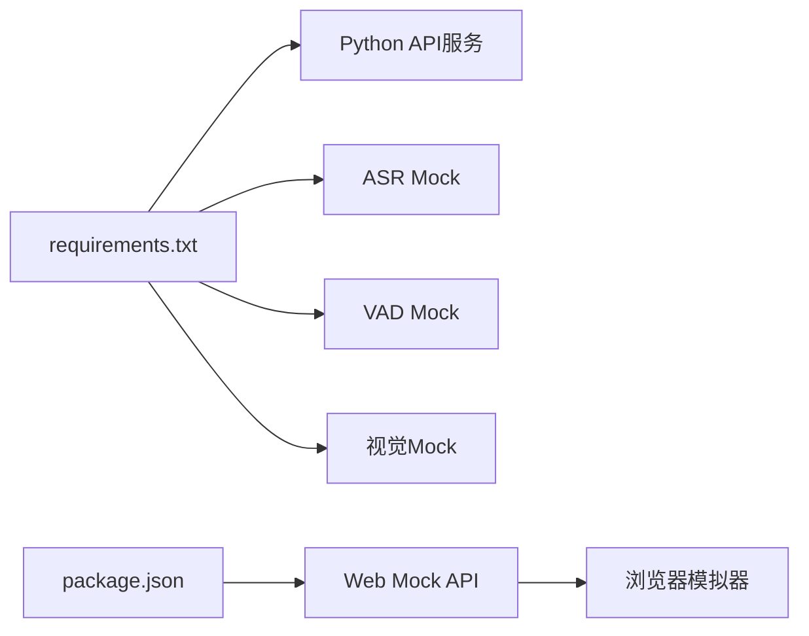

# Mock API服务

<cite>
**本文引用的文件**   
- [config.yaml](file://config.yaml)
- [app/asr/mock_backend.py](file://app/asr/mock_backend.py)
- [app/audio/vad/mock_backend.py](file://app/audio/vad/mock_backend.py)
- [app/vision/mock_backend.py](file://app/vision/mock_backend.py)
- [app/api/server.py](file://app/api/server.py)
- [apps/web/api/mock-api.mjs](file://apps/web/api/mock-api.mjs)
- [apps/web/simulator.js](file://apps/web/simulator.js)
- [apps/web/tests/api.test.mjs](file://apps/web/tests/api.test.mjs)
- [tests/test_perception_runtime.py](file://tests/test_perception_runtime.py)
- [tests/test_vad_stream.py](file://tests/test_vad_stream.py)
- [scripts/receive_microphone.py](file://scripts/receive_microphone.py)
- [scripts/receive_images.py](file://scripts/receive_images.py)
- [requirements.txt](file://requirements.txt)
</cite>

## 目录
1. [简介](#简介)
2. [项目结构](#项目结构)
3. [核心组件](#核心组件)
4. [架构总览](#架构总览)
5. [详细组件分析](#详细组件分析)
6. [依赖分析](#依赖分析)
7. [性能考虑](#性能考虑)
8. [故障排查指南](#故障排查指南)
9. [结论](#结论)
10. [附录](#附录)

## 简介
本文件面向开发与测试团队，系统化说明Mock API服务的启动配置、接口定义与数据结构，覆盖模拟的硬件接口、ASR（语音识别）服务与视觉处理接口的行为模式。文档同时给出模拟数据生成规则、随机性控制策略、测试场景设置方法，以及开发环境集成与自动化测试编写指南，并提供性能与负载测试的模拟数据准备方法。

## 项目结构
本项目采用多语言混合结构：
- Python后端提供感知运行时、ASR/VAD/视觉等模块的Mock实现，并通过API服务暴露能力。
- Web端提供独立的Mock API服务与模拟器，便于前端联调与端到端验证。
- 脚本与测试用例用于数据采集、流式输入与自动化验证。

图表来源
- [app/api/server.py](file://app/api/server.py)
- [app/asr/mock_backend.py](file://app/asr/mock_backend.py)
- [app/audio/vad/mock_backend.py](file://app/audio/vad/mock_backend.py)
- [app/vision/mock_backend.py](file://app/vision/mock_backend.py)
- [config.yaml](file://config.yaml)
- [apps/web/api/mock-api.mjs](file://apps/web/api/mock-api.mjs)
- [apps/web/simulator.js](file://apps/web/simulator.js)
- [apps/web/tests/api.test.mjs](file://apps/web/tests/api.test.mjs)
- [scripts/receive_microphone.py](file://scripts/receive_microphone.py)
- [scripts/receive_images.py](file://scripts/receive_images.py)
- [tests/test_perception_runtime.py](file://tests/test_perception_runtime.py)
- [tests/test_vad_stream.py](file://tests/test_vad_stream.py)

章节来源
- [config.yaml](file://config.yaml)
- [app/api/server.py](file://app/api/server.py)
- [apps/web/api/mock-api.mjs](file://apps/web/api/mock-api.mjs)

## 核心组件
- ASR Mock后端：提供离线语音识别的模拟结果，支持文本输出、延迟与错误注入，便于上层逻辑在无真实硬件或模型时的联调。
- VAD Mock后端：模拟语音活动检测，按时间片返回静音/说话状态，支持噪声与抖动注入。
- 视觉处理Mock：模拟手势/目标检测等视觉任务，返回结构化检测结果与置信度，支持帧率与延迟控制。
- API服务：统一对外暴露REST/WebSocket接口，聚合ASR、VAD、视觉等能力，并支持设备侧数据接入。
- Web Mock API：为前端提供独立于后端的Mock接口，便于UI与业务逻辑并行开发。

章节来源
- [app/asr/mock_backend.py](file://app/asr/mock_backend.py)
- [app/audio/vad/mock_backend.py](file://app/audio/vad/mock_backend.py)
- [app/vision/mock_backend.py](file://app/vision/mock_backend.py)
- [app/api/server.py](file://app/api/server.py)
- [apps/web/api/mock-api.mjs](file://apps/web/api/mock-api.mjs)

## 架构总览
下图展示Mock服务在开发环境中的整体交互：设备通过脚本或硬件源将音频/图像推送到Python后端；后端调用各模块的Mock实现进行模拟处理；前端通过Web Mock API获取模拟数据并进行UI渲染与交互。

图表来源
- [app/api/server.py](file://app/api/server.py)
- [app/asr/mock_backend.py](file://app/asr/mock_backend.py)
- [app/audio/vad/mock_backend.py](file://app/audio/vad/mock_backend.py)
- [app/vision/mock_backend.py](file://app/vision/mock_backend.py)
- [apps/web/api/mock-api.mjs](file://apps/web/api/mock-api.mjs)
- [apps/web/simulator.js](file://apps/web/simulator.js)

## 详细组件分析

### ASR Mock后端
- 功能要点
  - 模拟语音识别流程：输入音频片段，输出文本、置信度与耗时。
  - 支持延迟注入与错误注入，便于异常路径测试。
  - 可配置随机种子与结果集，保证可重复性与可控性。
- 数据结构
  - 输入：音频片段（字节或流）、采样率、通道数。
  - 输出：识别文本、置信度、耗时、可选元数据（如词级时间戳）。
- 行为模式
  - 正常路径：按配置延迟返回稳定结果集。
  - 异常路径：随机失败或超时，触发重试与降级逻辑。
- 配置项
  - 随机种子、结果映射表、延迟范围、错误概率、最大重试次数。

图表来源
- [app/asr/mock_backend.py](file://app/asr/mock_backend.py)

章节来源
- [app/asr/mock_backend.py](file://app/asr/mock_backend.py)

### VAD Mock后端
- 功能要点
  - 模拟语音活动检测：按时间片返回静音/说话状态。
  - 支持噪声注入、抖动与边界模糊，贴近真实环境。
- 数据结构
  - 输入：音频帧、帧长、采样率。
  - 输出：状态（静音/说话）、置信度、可选能量指标。
- 行为模式
  - 正常路径：基于配置的时间片切换状态。
  - 异常路径：随机噪声导致误检，支持阈值调整。
- 配置项
  - 时间片长度、静音/说话比例、噪声强度、抖动幅度、阈值。

图表来源
- [app/audio/vad/mock_backend.py](file://app/audio/vad/mock_backend.py)

章节来源
- [app/audio/vad/mock_backend.py](file://app/audio/vad/mock_backend.py)

### 视觉处理Mock
- 功能要点
  - 模拟手势/目标检测：输入图像帧，返回检测结果列表（类别、坐标、置信度）。
  - 支持帧率限制、延迟注入与结果扰动。
- 数据结构
  - 输入：图像帧（尺寸、格式）、处理选项。
  - 输出：检测结果数组、处理耗时、可选关键点。
- 行为模式
  - 正常路径：按配置生成稳定或扰动的检测结果。
  - 异常路径：随机丢帧或低置信度，触发下游容错。
- 配置项
  - 帧率上限、延迟范围、结果集合、扰动强度、最小置信度。

图表来源
- [app/vision/mock_backend.py](file://app/vision/mock_backend.py)

章节来源
- [app/vision/mock_backend.py](file://app/vision/mock_backend.py)

### API服务（Python）
- 功能要点
  - 统一HTTP接口：提供ASR、VAD、视觉处理的调用入口。
  - 支持流式输入（音频/图像）与事件回调。
  - 聚合各模块Mock实现，提供一致的响应格式。
- 接口设计
  - REST端点：上传音频/图像、查询处理结果、订阅事件。
  - WebSocket端点：实时推送识别结果与视觉检测。
- 错误处理
  - 参数校验失败、超时、模块不可用、数据格式错误等。
- 配置与环境变量
  - 端口、日志级别、模块开关、随机种子、速率限制。

图表来源
- [app/api/server.py](file://app/api/server.py)
- [app/asr/mock_backend.py](file://app/asr/mock_backend.py)
- [app/audio/vad/mock_backend.py](file://app/audio/vad/mock_backend.py)
- [app/vision/mock_backend.py](file://app/vision/mock_backend.py)

章节来源
- [app/api/server.py](file://app/api/server.py)

### Web Mock API
- 功能要点
  - 独立于Python后端的Mock服务，供前端直接调用。
  - 提供稳定的模拟数据与错误注入，便于UI与业务逻辑并行开发。
- 接口设计
  - REST端点：模拟ASR、VAD、视觉处理结果。
  - 事件推送：模拟设备事件与状态变化。
- 配置项
  - 端口、模拟数据集、随机种子、延迟范围、错误率。

图表来源
- [apps/web/api/mock-api.mjs](file://apps/web/api/mock-api.mjs)
- [apps/web/simulator.js](file://apps/web/simulator.js)

章节来源
- [apps/web/api/mock-api.mjs](file://apps/web/api/mock-api.mjs)
- [apps/web/simulator.js](file://apps/web/simulator.js)

### 脚本与测试
- 脚本
  - receive_microphone.py：从麦克风采集音频并推送到后端，用于ASR/VAD联调。
  - receive_images.py：从摄像头或文件读取图像并推送到后端，用于视觉处理联调。
- 测试
  - test_perception_runtime.py：验证感知运行时的Mock行为与事件流转。
  - test_vad_stream.py：验证VAD流式处理与状态切换。
  - api.test.mjs：对Web Mock API进行端到端测试。

章节来源
- [scripts/receive_microphone.py](file://scripts/receive_microphone.py)
- [scripts/receive_images.py](file://scripts/receive_images.py)
- [tests/test_perception_runtime.py](file://tests/test_perception_runtime.py)
- [tests/test_vad_stream.py](file://tests/test_vad_stream.py)
- [apps/web/tests/api.test.mjs](file://apps/web/tests/api.test.mjs)

## 依赖分析
- 外部依赖
  - Python依赖：由requirements.txt管理，包含Web框架、异步IO、音频/图像处理库等。
  - Node依赖：由package.json管理，用于Web Mock API与前端工具链。
- 模块耦合
  - API服务与各Mock后端松耦合，通过统一接口抽象。
  - Web Mock API与Python后端解耦，便于独立部署与测试。
- 潜在风险
  - 模块间版本兼容性需关注。
  - 随机性与延迟配置不当可能影响测试结果稳定性。

图表来源
- [requirements.txt](file://requirements.txt)
- [package.json](file://package.json)

章节来源
- [requirements.txt](file://requirements.txt)
- [package.json](file://package.json)

## 性能考虑
- 延迟与吞吐
  - 合理设置Mock延迟范围，避免过高延迟掩盖真实瓶颈。
  - 使用批量处理与异步IO提升吞吐。
- 内存与CPU
  - 控制音频/图像帧大小与数量，避免内存峰值。
  - 限制并发请求数，防止资源耗尽。
- 随机性与可重复性
  - 固定随机种子确保测试可重复。
  - 使用确定性数据集进行基准测试。

## 故障排查指南
- 常见问题
  - 端口冲突：检查配置文件中的端口占用。
  - 模块不可用：确认依赖安装与环境变量正确。
  - 数据格式错误：校验输入参数与JSON结构。
- 调试技巧
  - 启用详细日志，定位错误堆栈。
  - 使用脚本模拟输入，逐步验证链路。
  - 降低并发与延迟，隔离问题范围。

章节来源
- [config.yaml](file://config.yaml)
- [app/api/server.py](file://app/api/server.py)
- [tests/test_perception_runtime.py](file://tests/test_perception_runtime.py)

## 结论
Mock API服务为开发、测试与演示提供了稳定、可控的模拟环境。通过统一的接口设计与灵活的配置选项，团队可以快速联调ASR、VAD与视觉处理模块，并编写自动化测试与性能测试用例。建议在生产环境中逐步替换Mock为真实实现，保持接口一致性以确保平滑迁移。

## 附录
- 启动配置
  - 修改config.yaml中的端口、日志级别、模块开关与随机种子。
  - 环境变量：如数据库连接、第三方服务密钥（若后续集成）。
- 集成方法
  - 开发环境：分别启动Python API服务与Web Mock API，使用脚本推送数据。
  - 自动化测试：使用pytest与Mocha/Jest运行测试用例。
- 性能测试
  - 使用JMeter或k6生成负载，模拟高并发请求。
  - 准备大规模音频/图像数据集，验证吞吐与延迟。

章节来源
- [config.yaml](file://config.yaml)
- [requirements.txt](file://requirements.txt)
- [package.json](file://package.json)
- [apps/web/tests/api.test.mjs](file://apps/web/tests/api.test.mjs)
- [tests/test_perception_runtime.py](file://tests/test_perception_runtime.py)
- [tests/test_vad_stream.py](file://tests/test_vad_stream.py)