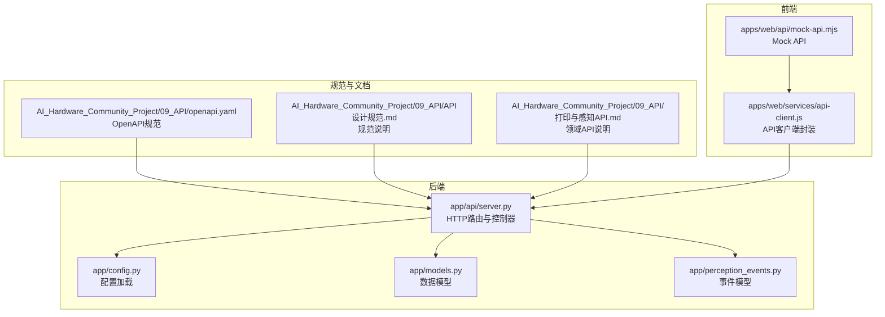
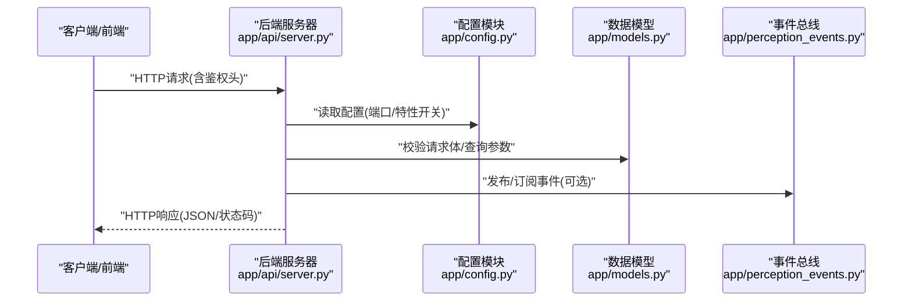
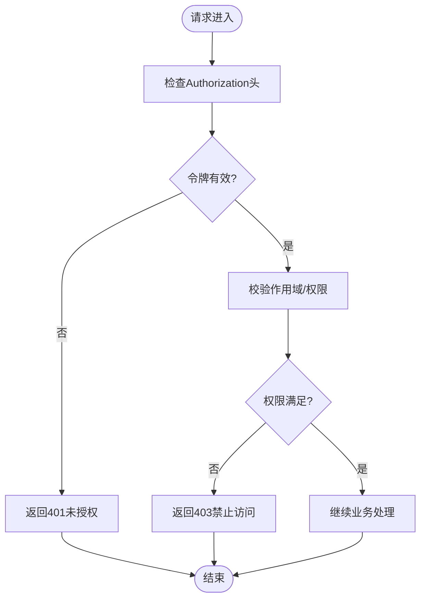
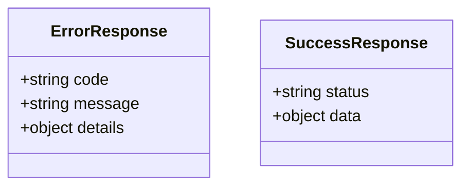
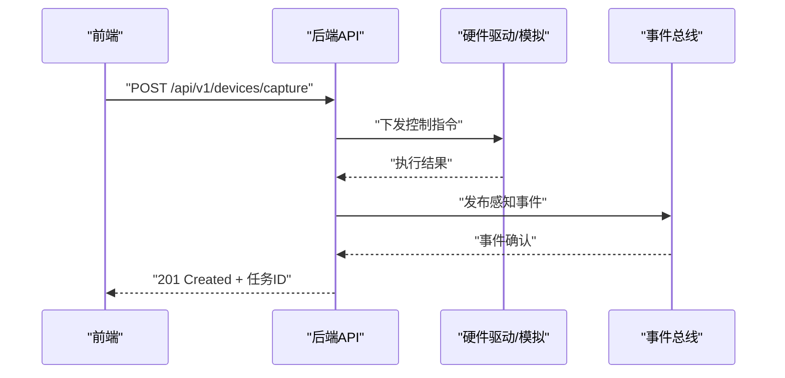
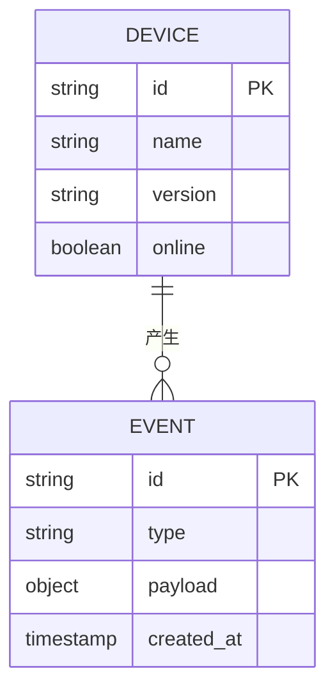
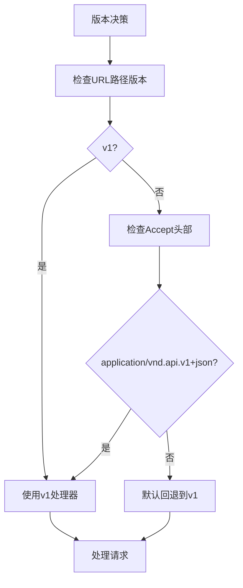
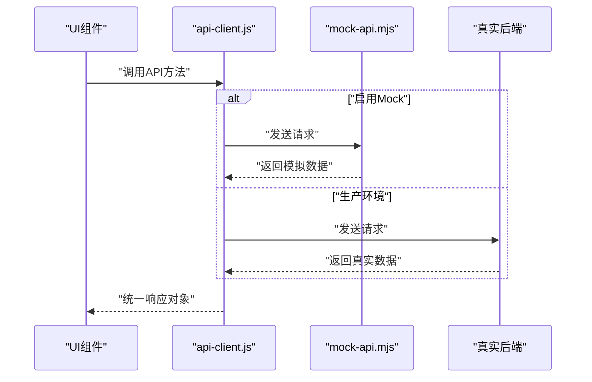
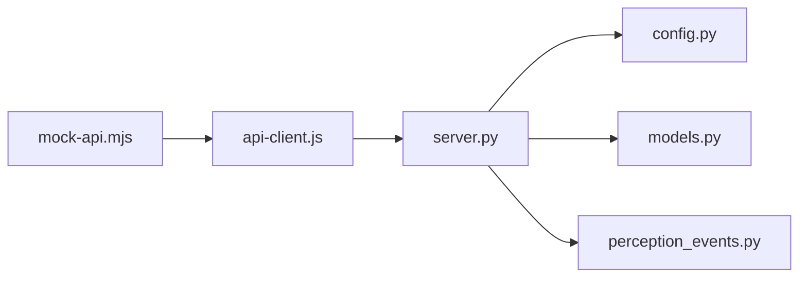

# RESTful API接口

<cite>
**本文引用的文件**   
- [app/api/server.py](file://app/api/server.py)
- [AI_Hardware_Community_Project/09_API/openapi.yaml](file://AI_Hardware_Community_Project/09_API/openapi.yaml)
- [AI_Hardware_Community_Project/09_API/API设计规范.md](file://AI_Hardware_Community_Project/09_API/API设计规范.md)
- [AI_Hardware_Community_Project/09_API/打印与感知API.md](file://AI_Hardware_Community_Project/09_API/打印与感知API.md)
- [config.yaml](file://config.yaml)
- [app/config.py](file://app/config.py)
- [app/models.py](file://app/models.py)
- [app/perception_events.py](file://app/perception_events.py)
- [apps/web/services/api-client.js](file://apps/web/services/api-client.js)
- [apps/web/api/mock-api.mjs](file://apps/web/api/mock-api.mjs)
</cite>

## 目录
1. [简介](#简介)
2. [项目结构](#项目结构)
3. [核心组件](#核心组件)
4. [架构总览](#架构总览)
5. [详细组件分析](#详细组件分析)
6. [依赖关系分析](#依赖关系分析)
7. [性能考虑](#性能考虑)
8. [故障排查指南](#故障排查指南)
9. [结论](#结论)
10. [附录](#附录)

## 简介
本文件基于仓库中的OpenAPI规范与后端实现，系统化文档化所有RESTful HTTP端点。内容覆盖：
- 所有HTTP方法（GET、POST、PUT、DELETE）的URL模式、请求参数、请求体结构与响应格式
- 认证机制、状态码定义与错误处理策略
- 完整请求/响应示例（成功与错误场景）
- 数据模型、字段验证规则与业务约束
- API版本管理与向后兼容性说明
- 实际调用示例与最佳实践建议

## 项目结构
本项目采用前后端分离与模块化设计：
- 后端服务位于 app/api/server.py，提供HTTP路由与控制器逻辑
- OpenAPI规范位于 AI_Hardware_Community_Project/09_API/openapi.yaml，作为API契约来源
- 配置集中在 config.yaml 与 app/config.py
- 数据模型与事件定义在 app/models.py 与 app/perception_events.py
- 前端Web服务与Mock API位于 apps/web 目录

**图表来源** 
- [app/api/server.py](file://app/api/server.py)
- [AI_Hardware_Community_Project/09_API/openapi.yaml](file://AI_Hardware_Community_Project/09_API/openapi.yaml)
- [AI_Hardware_Community_Project/09_API/API设计规范.md](file://AI_Hardware_Community_Project/09_API/API设计规范.md)
- [AI_Hardware_Community_Project/09_API/打印与感知API.md](file://AI_Hardware_Community_Project/09_API/打印与感知API.md)
- [app/config.py](file://app/config.py)
- [app/models.py](file://app/models.py)
- [app/perception_events.py](file://app/perception_events.py)
- [apps/web/services/api-client.js](file://apps/web/services/api-client.js)
- [apps/web/api/mock-api.mjs](file://apps/web/api/mock-api.mjs)

**章节来源**
- [app/api/server.py](file://app/api/server.py)
- [AI_Hardware_Community_Project/09_API/openapi.yaml](file://AI_Hardware_Community_Project/09_API/openapi.yaml)
- [AI_Hardware_Community_Project/09_API/API设计规范.md](file://AI_Hardware_Community_Project/09_API/API设计规范.md)
- [AI_Hardware_Community_Project/09_API/打印与感知API.md](file://AI_Hardware_Community_Project/09_API/打印与感知API.md)
- [config.yaml](file://config.yaml)
- [app/config.py](file://app/config.py)
- [app/models.py](file://app/models.py)
- [app/perception_events.py](file://app/perception_events.py)
- [apps/web/services/api-client.js](file://apps/web/services/api-client.js)
- [apps/web/api/mock-api.mjs](file://apps/web/api/mock-api.mjs)

## 核心组件
- 路由与服务层：负责HTTP请求解析、鉴权、参数校验、业务编排与响应序列化
- 配置中心：统一加载环境变量与配置文件，暴露服务端口、日志级别、功能开关等
- 数据模型：定义资源结构与字段约束，贯穿请求体与响应体
- 事件系统：用于异步事件发布/订阅，支撑感知与硬件交互
- 前端API客户端：封装HTTP调用、重试、错误处理与Mock切换

**章节来源**
- [app/api/server.py](file://app/api/server.py)
- [app/config.py](file://app/config.py)
- [app/models.py](file://app/models.py)
- [app/perception_events.py](file://app/perception_events.py)
- [apps/web/services/api-client.js](file://apps/web/services/api-client.js)

## 架构总览
后端以FastAPI/Flask风格的路由为中心，结合OpenAPI规范生成文档与校验；前端通过API客户端访问后端或Mock服务。配置与模型集中管理，确保一致性。

**图表来源** 
- [app/api/server.py](file://app/api/server.py)
- [app/config.py](file://app/config.py)
- [app/models.py](file://app/models.py)
- [app/perception_events.py](file://app/perception_events.py)

## 详细组件分析

### 认证与安全
- 认证方式：基于令牌（如JWT或自定义Token）的请求头认证
- 安全要求：HTTPS强制、敏感头过滤、最小权限原则
- 鉴权流程：服务端校验令牌有效性、过期时间与作用域

**图表来源** 
- [app/api/server.py](file://app/api/server.py)

**章节来源**
- [AI_Hardware_Community_Project/09_API/API设计规范.md](file://AI_Hardware_Community_Project/09_API/API设计规范.md)
- [AI_Hardware_Community_Project/09_API/openapi.yaml](file://AI_Hardware_Community_Project/09_API/openapi.yaml)

### 通用错误与状态码
- 成功状态码：200、201、204
- 客户端错误：400（参数错误）、401（未认证）、403（无权限）、404（资源不存在）、409（冲突）、422（校验失败）
- 服务端错误：500（内部错误）、502/503（网关/服务不可用）
- 错误响应体：包含code、message、details等字段，便于前端展示与定位问题

**图表来源** 
- [app/api/server.py](file://app/api/server.py)

**章节来源**
- [AI_Hardware_Community_Project/09_API/API设计规范.md](file://AI_Hardware_Community_Project/09_API/API设计规范.md)

### 设备与感知API
- 设备信息：获取设备能力、状态、固件版本等
- 感知事件：语音识别、视觉检测、手势识别等事件的发布与查询
- 控制指令：对设备进行控制（如拍照、打印、播放音频）

**图表来源** 
- [AI_Hardware_Community_Project/09_API/打印与感知API.md](file://AI_Hardware_Community_Project/09_API/打印与感知API.md)
- [app/perception_events.py](file://app/perception_events.py)

**章节来源**
- [AI_Hardware_Community_Project/09_API/打印与感知API.md](file://AI_Hardware_Community_Project/09_API/打印与感知API.md)
- [app/perception_events.py](file://app/perception_events.py)

### 数据模型与验证
- 模型定义：统一的JSON Schema描述资源结构
- 字段验证：必填、类型、长度、范围、枚举值等
- 业务约束：唯一性、关联完整性、状态机转换规则

**图表来源** 
- [app/models.py](file://app/models.py)
- [app/perception_events.py](file://app/perception_events.py)

**章节来源**
- [app/models.py](file://app/models.py)
- [app/perception_events.py](file://app/perception_events.py)

### 版本管理与兼容性
- 版本策略：URL路径前缀（/api/v1/）与Accept头部双轨支持
- 向后兼容：新增字段非破坏性变更，废弃字段保留至少两个大版本
- 迁移指引：提供迁移脚本与兼容性矩阵

**图表来源** 
- [AI_Hardware_Community_Project/09_API/openapi.yaml](file://AI_Hardware_Community_Project/09_API/openapi.yaml)

**章节来源**
- [AI_Hardware_Community_Project/09_API/openapi.yaml](file://AI_Hardware_Community_Project/09_API/openapi.yaml)

### 前端API客户端与Mock
- 客户端封装：统一请求拦截、重试、错误处理、Mock切换
- Mock服务：本地开发时替代真实后端，加速联调

**图表来源** 
- [apps/web/services/api-client.js](file://apps/web/services/api-client.js)
- [apps/web/api/mock-api.mjs](file://apps/web/api/mock-api.mjs)

**章节来源**
- [apps/web/services/api-client.js](file://apps/web/services/api-client.js)
- [apps/web/api/mock-api.mjs](file://apps/web/api/mock-api.mjs)

## 依赖关系分析
- 后端依赖配置模块加载运行时参数
- 路由层依赖数据模型进行请求/响应校验
- 事件系统解耦硬件交互与业务逻辑
- 前端客户端依赖OpenAPI生成的类型定义（可选）

**图表来源** 
- [app/api/server.py](file://app/api/server.py)
- [app/config.py](file://app/config.py)
- [app/models.py](file://app/models.py)
- [app/perception_events.py](file://app/perception_events.py)
- [apps/web/services/api-client.js](file://apps/web/services/api-client.js)
- [apps/web/api/mock-api.mjs](file://apps/web/api/mock-api.mjs)

**章节来源**
- [app/api/server.py](file://app/api/server.py)
- [app/config.py](file://app/config.py)
- [app/models.py](file://app/models.py)
- [app/perception_events.py](file://app/perception_events.py)
- [apps/web/services/api-client.js](file://apps/web/services/api-client.js)
- [apps/web/api/mock-api.mjs](file://apps/web/api/mock-api.mjs)

## 性能考虑
- 连接池与超时：合理设置数据库/外部服务连接池大小与超时时间
- 缓存策略：热点数据缓存（Redis/Memcached），减少重复计算
- 异步处理：长耗时任务放入消息队列，避免阻塞主线程
- 限流与熔断：防止突发流量导致服务雪崩

[本节为通用指导，不直接分析具体文件]

## 故障排查指南
- 常见问题：认证失败、参数校验错误、资源不存在、服务超时
- 日志收集：开启调试日志，记录请求ID与关键步骤
- 健康检查：提供/health端点监控服务状态
- 告警策略：错误率阈值触发告警

**章节来源**
- [AI_Hardware_Community_Project/09_API/API设计规范.md](file://AI_Hardware_Community_Project/09_API/API设计规范.md)

## 结论
本API文档基于OpenAPI规范与代码实现，提供了完整的接口契约、认证机制、错误处理与版本管理策略。建议团队遵循规范进行开发与测试，确保前后端一致性与可维护性。

[本节为总结性内容，不直接分析具体文件]

## 附录

### 常用端点速查表
- GET /api/v1/devices：获取设备列表
- POST /api/v1/devices/capture：触发拍照
- GET /api/v1/events：查询感知事件
- PUT /api/v1/devices/{id}/config：更新设备配置
- DELETE /api/v1/events/{id}：删除事件记录

**章节来源**
- [AI_Hardware_Community_Project/09_API/openapi.yaml](file://AI_Hardware_Community_Project/09_API/openapi.yaml)
- [AI_Hardware_Community_Project/09_API/打印与感知API.md](file://AI_Hardware_Community_Project/09_API/打印与感知API.md)

### 配置项参考
- 服务端口、日志级别、功能开关、第三方服务密钥等

**章节来源**
- [config.yaml](file://config.yaml)
- [app/config.py](file://app/config.py)