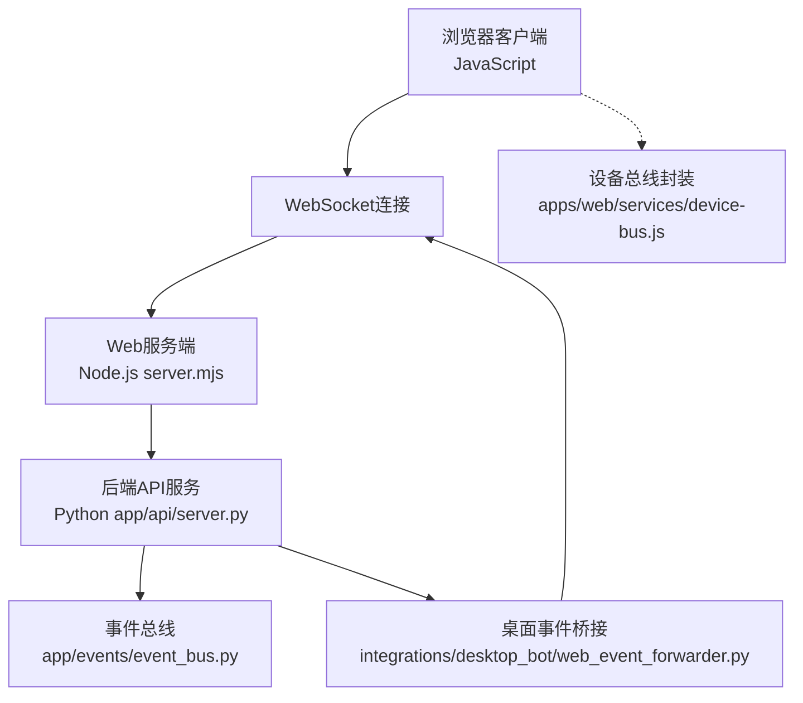
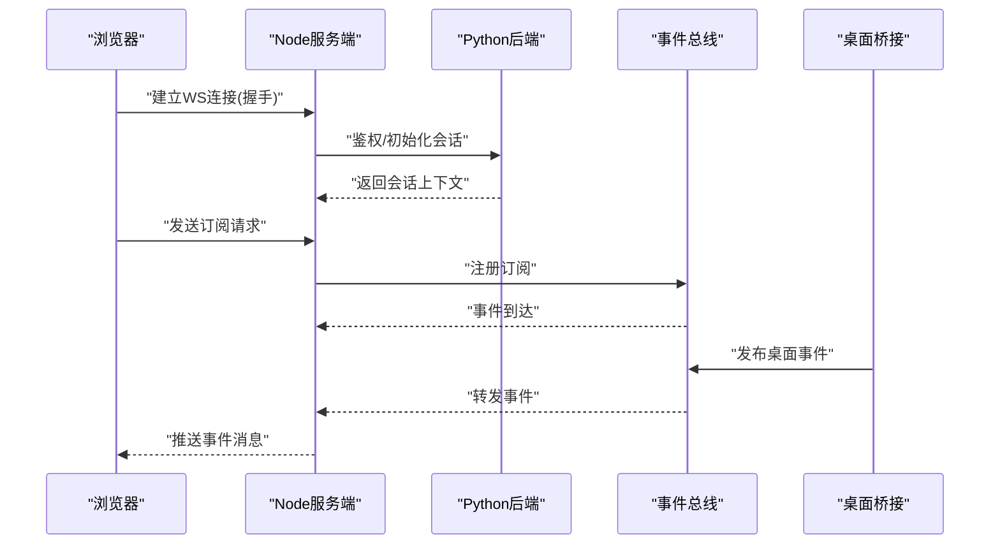
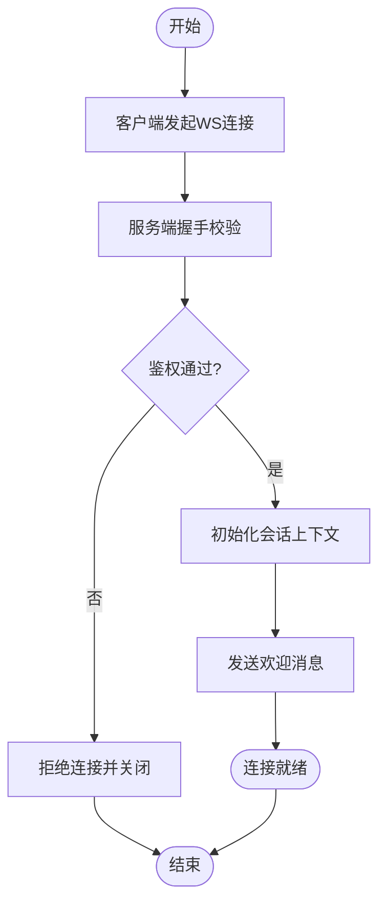
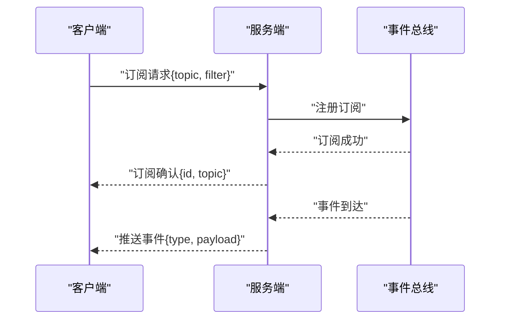
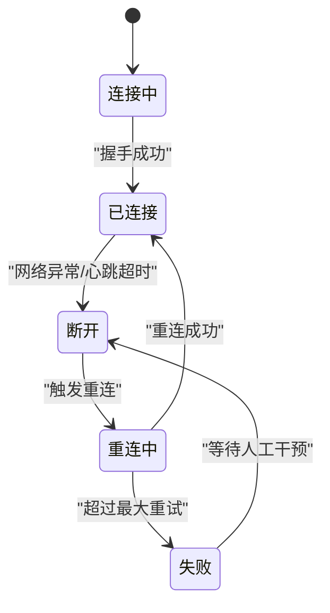
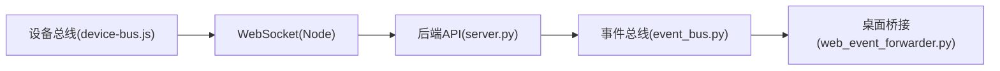

# WebSocket实时通信

<cite>
**本文引用的文件**   
- [app/api/server.py](file://app/api/server.py)
- [apps/web/server.mjs](file://apps/web/server.mjs)
- [apps/web/app.js](file://apps/web/app.js)
- [apps/web/services/device-bus.js](file://apps/web/services/device-bus.js)
- [integrations/desktop_bot/web_event_forwarder.py](file://integrations/desktop_bot/web_event_forwarder.py)
- [app/events/event_bus.py](file://app/events/event_bus.py)
- [config.yaml](file://config.yaml)
</cite>

## 目录
1. [简介](#简介)
2. [项目结构](#项目结构)
3. [核心组件](#核心组件)
4. [架构总览](#架构总览)
5. [详细组件分析](#详细组件分析)
6. [依赖关系分析](#依赖关系分析)
7. [性能考虑](#性能考虑)
8. [故障排查指南](#故障排查指南)
9. [结论](#结论)
10. [附录](#附录)

## 简介
本文件面向WebSocket实时通信，覆盖连接建立、握手协议、连接管理、消息格式、事件类型与数据传输协议、订阅/发布模式、双向通信机制、连接状态管理、重连策略与错误处理，并提供客户端实现示例、性能优化建议与调试方法。文档基于仓库中的后端API服务、Web服务端、设备总线集成以及事件总线模块进行梳理，确保读者能够理解并落地一套稳定可靠的WebSocket实时通信方案。

## 项目结构
本项目在以下位置涉及WebSocket相关能力：
- 后端API服务：提供HTTP接口与可能的WS端点（由server.py定义）
- Web服务端：Node.js侧的静态资源与API转发（由server.mjs定义）
- Web前端应用：浏览器端JS逻辑与设备总线封装（由app.js与device-bus.js定义）
- 桌面集成桥接：将桌面事件转发到Web层（由web_event_forwarder.py定义）
- 事件总线：内部事件分发与订阅（由event_bus.py定义）
- 配置：运行时参数（如端口、日志级别等）（由config.yaml定义）

图表来源
- [apps/web/server.mjs](file://apps/web/server.mjs)
- [app/api/server.py](file://app/api/server.py)
- [app/events/event_bus.py](file://app/events/event_bus.py)
- [integrations/desktop_bot/web_event_forwarder.py](file://integrations/desktop_bot/web_event_forwarder.py)
- [apps/web/services/device-bus.js](file://apps/web/services/device-bus.js)

章节来源
- [app/api/server.py](file://app/api/server.py)
- [apps/web/server.mjs](file://apps/web/server.mjs)
- [apps/web/app.js](file://apps/web/app.js)
- [apps/web/services/device-bus.js](file://apps/web/services/device-bus.js)
- [integrations/desktop_bot/web_event_forwarder.py](file://integrations/desktop_bot/web_event_forwarder.py)
- [app/events/event_bus.py](file://app/events/event_bus.py)
- [config.yaml](file://config.yaml)

## 核心组件
- WebSocket服务端（Node.js）：负责接收浏览器连接、鉴权与路由、消息转发至后端或事件总线、回推事件给客户端。
- 后端API服务（Python）：暴露REST/WS接口，聚合业务逻辑，通过事件总线统一分发事件。
- 事件总线：解耦生产者与消费者，支持按主题订阅与广播。
- 桌面事件桥接：将桌面端产生的事件转换为标准消息并通过WS推送。
- 设备总线（前端）：封装WS连接生命周期、心跳、重连、消息编解码与事件回调。

章节来源
- [apps/web/server.mjs](file://apps/web/server.mjs)
- [app/api/server.py](file://app/api/server.py)
- [app/events/event_bus.py](file://app/events/event_bus.py)
- [integrations/desktop_bot/web_event_forwarder.py](file://integrations/desktop_bot/web_event_forwarder.py)
- [apps/web/services/device-bus.js](file://apps/web/services/device-bus.js)

## 架构总览
整体采用“前端WS客户端—Node中间层—Python后端—事件总线—外部桥接”的分层架构。WS连接由浏览器发起，经Node层鉴权与路由后，进入Python后端处理；事件由后端或桥接产生，经事件总线分发，再由Node层推送给对应客户端。

图表来源
- [apps/web/server.mjs](file://apps/web/server.mjs)
- [app/api/server.py](file://app/api/server.py)
- [app/events/event_bus.py](file://app/events/event_bus.py)
- [integrations/desktop_bot/web_event_forwarder.py](file://integrations/desktop_bot/web_event_forwarder.py)

## 详细组件分析

### WebSocket连接建立与握手
- 客户端发起WS连接，携带必要的查询参数或头部用于鉴权与会话标识。
- Node服务端校验令牌、绑定用户/设备上下文，维护连接映射表。
- Python后端完成业务初始化（如权限检查、资源准备），返回握手结果。
- 握手成功后，服务端向客户端发送欢迎消息，包含会话ID、支持的版本与能力集。

图表来源
- [apps/web/server.mjs](file://apps/web/server.mjs)
- [app/api/server.py](file://app/api/server.py)

章节来源
- [apps/web/server.mjs](file://apps/web/server.mjs)
- [app/api/server.py](file://app/api/server.py)

### 消息格式与事件类型
- 传输协议：JSON文本帧为主，二进制帧用于大对象（如图片、音频片段）。
- 消息头字段：
  - type：消息类型（如 subscribe、publish、ack、error、ping、pong）
  - id：消息唯一标识（用于请求-响应匹配）
  - ts：时间戳（毫秒）
  - from/to：消息源与目标（用户/设备/主题）
  - payload：业务数据体
- 事件类型：
  - device：设备状态与遥测
  - perception：感知结果（语音识别、视觉检测等）
  - control：控制指令（播放、截图、移动等）
  - system：系统级事件（心跳、告警、配置变更）
- 订阅/发布：
  - 订阅：指定主题与过滤条件，服务端按规则推送
  - 发布：客户端或服务端向主题发布消息，触发订阅者回调

章节来源
- [apps/web/services/device-bus.js](file://apps/web/services/device-bus.js)
- [app/events/event_bus.py](file://app/events/event_bus.py)
- [integrations/desktop_bot/web_event_forwarder.py](file://integrations/desktop_bot/web_event_forwarder.py)

### 订阅与发布模式
- 订阅流程：客户端发送订阅请求，服务端注册订阅并返回确认；后续事件按规则推送。
- 发布流程：客户端或服务端发布消息，事件总线根据主题路由到所有订阅者。
- 过滤与限流：支持按设备ID、事件类别、时间窗口进行过滤；对高频事件进行采样或合并。

图表来源
- [apps/web/services/device-bus.js](file://apps/web/services/device-bus.js)
- [app/events/event_bus.py](file://app/events/event_bus.py)

章节来源
- [apps/web/services/device-bus.js](file://apps/web/services/device-bus.js)
- [app/events/event_bus.py](file://app/events/event_bus.py)

### 双向通信机制
- 上行消息：客户端发送控制指令、查询请求、心跳等。
- 下行消息：服务端推送事件、确认、错误、系统通知等。
- 请求-响应：通过id字段匹配请求与响应，超时未收到响应则重试或上报错误。
- 心跳保活：定时ping/pong，超时判定断线并触发重连。

章节来源
- [apps/web/services/device-bus.js](file://apps/web/services/device-bus.js)
- [apps/web/app.js](file://apps/web/app.js)

### 连接状态管理与重连策略
- 状态机：连接中、已连接、断开、重连中、失败。
- 重连策略：指数退避、最大重试次数、抖动随机化避免雪崩。
- 状态同步：重连后重新订阅主题，恢复会话上下文。
- 优雅降级：网络不可用时缓存本地事件，恢复后批量补发。

图表来源
- [apps/web/services/device-bus.js](file://apps/web/services/device-bus.js)

章节来源
- [apps/web/services/device-bus.js](file://apps/web/services/device-bus.js)

### 错误处理方案
- 连接错误：网络异常、鉴权失败、服务端过载。
- 消息错误：格式错误、签名无效、权限不足。
- 处理策略：记录错误码与上下文，客户端重试或提示用户；服务端限流与熔断保护。
- 监控告警：统计连接数、消息吞吐、错误率，设置阈值告警。

章节来源
- [apps/web/services/device-bus.js](file://apps/web/services/device-bus.js)
- [app/api/server.py](file://app/api/server.py)

### 实际客户端实现示例（JavaScript与其他语言）
- JavaScript（浏览器）：使用原生WebSocket或库封装，实现连接、订阅、心跳、重连与事件回调。
- Python：使用websocket-client或aiohttp进行异步通信，适合脚本与自动化场景。
- Go：使用gorilla/websocket或nhooyr.io/websocket，适合高并发服务。
- 示例要点：
  - 连接URL与鉴权参数
  - 订阅主题与过滤条件
  - 心跳间隔与超时配置
  - 错误码与重试策略
  - 事件回调与状态监听

章节来源
- [apps/web/services/device-bus.js](file://apps/web/services/device-bus.js)
- [apps/web/app.js](file://apps/web/app.js)

## 依赖关系分析
- Node服务端依赖Python后端提供的鉴权与会话接口。
- Python后端依赖事件总线进行事件分发。
- 桌面桥接依赖事件总线作为消息源。
- 前端设备总线依赖Node服务端的路由与鉴权。

图表来源
- [apps/web/services/device-bus.js](file://apps/web/services/device-bus.js)
- [apps/web/server.mjs](file://apps/web/server.mjs)
- [app/api/server.py](file://app/api/server.py)
- [app/events/event_bus.py](file://app/events/event_bus.py)
- [integrations/desktop_bot/web_event_forwarder.py](file://integrations/desktop_bot/web_event_forwarder.py)

章节来源
- [apps/web/services/device-bus.js](file://apps/web/services/device-bus.js)
- [apps/web/server.mjs](file://apps/web/server.mjs)
- [app/api/server.py](file://app/api/server.py)
- [app/events/event_bus.py](file://app/events/event_bus.py)
- [integrations/desktop_bot/web_event_forwarder.py](file://integrations/desktop_bot/web_event_forwarder.py)

## 性能考虑
- 连接复用与池化：减少频繁握手开销，保持长连接。
- 消息压缩：对文本消息启用gzip或自定义压缩。
- 批量与合并：高频事件合并为批次，降低带宽与CPU消耗。
- 背压与限流：对热点主题进行速率限制，防止雪崩。
- 水平扩展：多实例部署时，使用共享事件总线（如Redis Pub/Sub）进行跨进程广播。
- 监控指标：连接数、消息延迟、错误率、内存与CPU占用。

[本节为通用指导，不直接分析具体文件]

## 故障排查指南
- 连接问题：检查网络连通性、防火墙与代理设置；查看握手错误码。
- 鉴权失败：核对令牌有效期与权限范围；检查服务端日志。
- 消息丢失：确认订阅是否生效；检查事件总线路由与过滤条件。
- 心跳超时：调整心跳间隔与超时阈值；检查客户端与服务端时钟同步。
- 性能瓶颈：定位热点主题与高频事件；启用限流与合并策略。
- 工具推荐：浏览器开发者工具Network面板、Wireshark抓包、服务端日志与APM。

章节来源
- [apps/web/services/device-bus.js](file://apps/web/services/device-bus.js)
- [app/api/server.py](file://app/api/server.py)

## 结论
本WebSocket实时通信方案以分层架构与事件总线为核心，实现了稳定的连接管理、灵活的订阅/发布与健壮的错误处理。通过合理的重连策略、性能优化与完善的监控手段，可在复杂环境下保证实时性与可靠性。建议在生产环境完善鉴权、限流与审计，并结合APM持续优化。

[本节为总结性内容，不直接分析具体文件]

## 附录
- 配置项参考：端口、日志级别、心跳间隔、重连参数等（详见配置文件）
- 安全建议：TLS加密、令牌轮换、最小权限原则
- 兼容性说明：不同浏览器与Node/Python版本的差异与适配

章节来源
- [config.yaml](file://config.yaml)