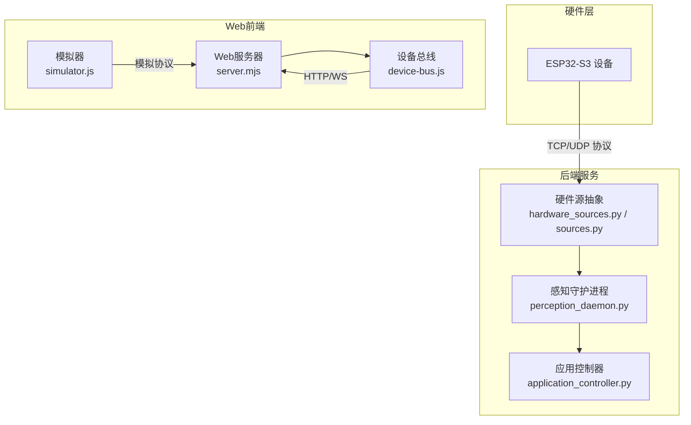
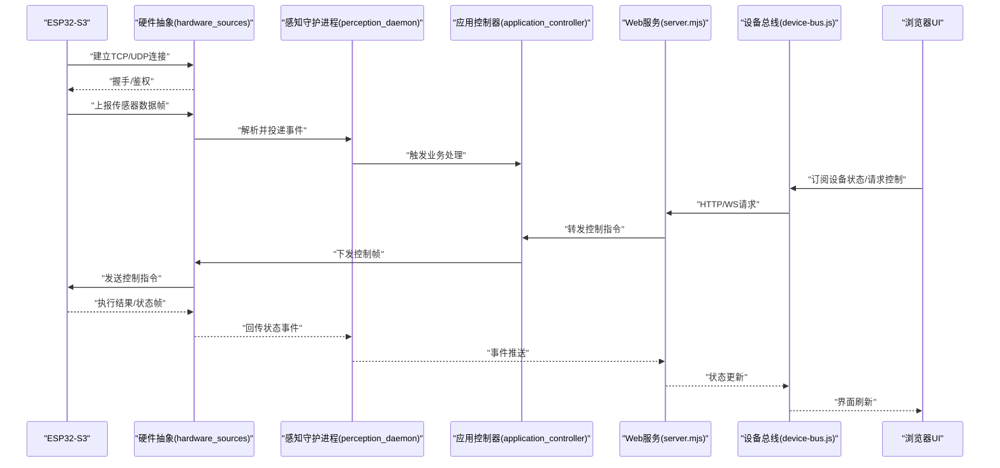
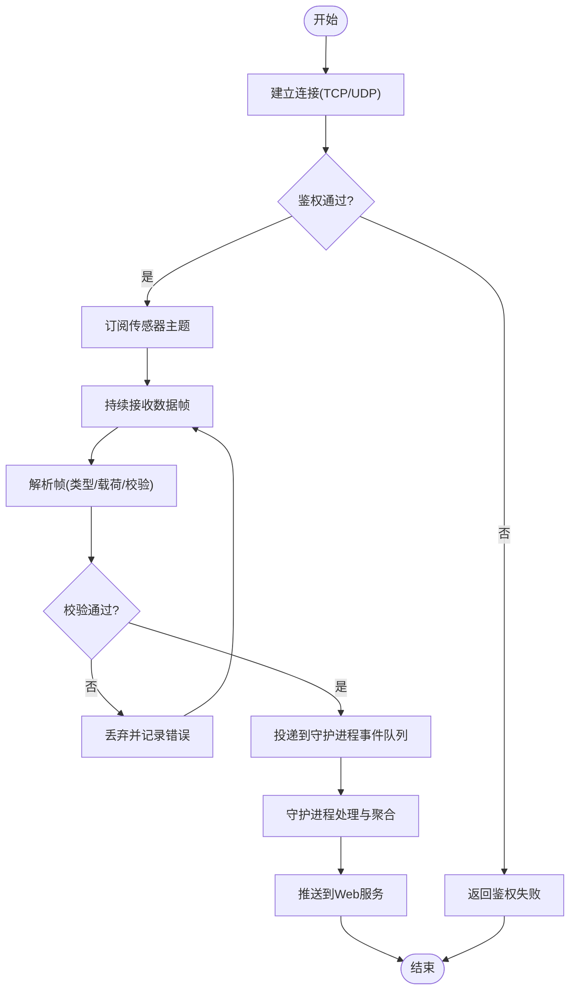
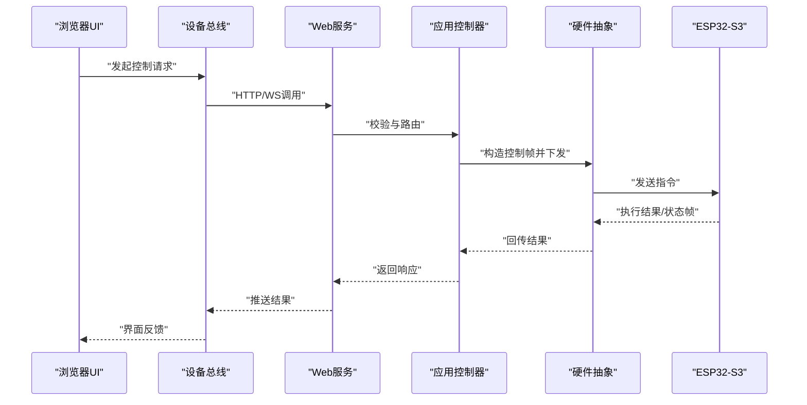
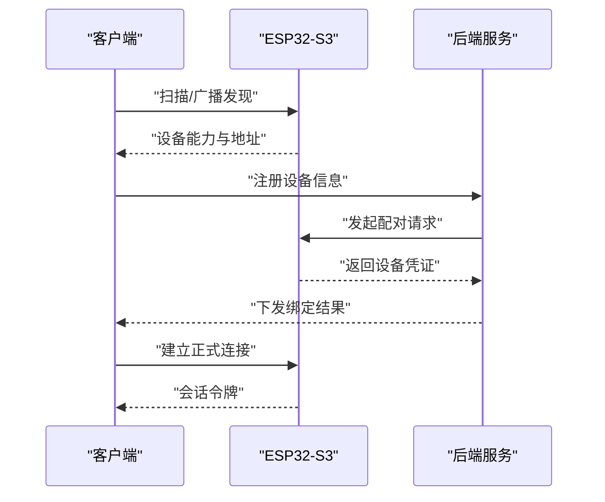
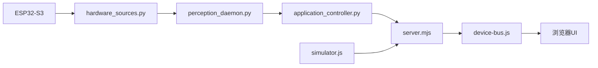

# 硬件接口规范

<cite>
**本文引用的文件**   
- [ESP32-S3接入设计.md](file://AI_Hardware_Community_Project/07_Hardware/ESP32-S3接入设计.md)
- [MVP设备模拟协议.md](file://AI_Hardware_Community_Project/07_Hardware/MVP设备模拟协议.md)
- [Web与ESP32通信方案.md](file://AI_Hardware_Community_Project/07_Hardware/Web与ESP32通信方案.md)
- [hardware_sources.py](file://app/transport/hardware_sources.py)
- [sources.py](file://app/transport/sources.py)
- [perception_daemon.py](file://app/runtime/perception_daemon.py)
- [application_controller.py](file://app/control/application_controller.py)
- [server.mjs](file://apps/web/server.mjs)
- [device-bus.js](file://apps/web/services/device-bus.js)
- [simulator.js](file://apps/web/simulator.js)
- [hardware-integration.test.mjs](file://apps/web/tests/hardware-integration.test.mjs)
</cite>

## 目录
1. [简介](#简介)
2. [项目结构](#项目结构)
3. [核心组件](#核心组件)
4. [架构总览](#架构总览)
5. [详细组件分析](#详细组件分析)
6. [依赖关系分析](#依赖关系分析)
7. [性能考虑](#性能考虑)
8. [故障排查指南](#故障排查指南)
9. [结论](#结论)
10. [附录](#附录)

## 简介
本规范面向ESP32-S3硬件设备与Web端的通信，定义统一的通信协议、数据帧格式与指令集，覆盖传感器数据读取、控制指令下发与设备状态查询的完整流程。文档同时给出TCP/UDP连接模型、数据传输协议、同步机制、设备发现与配对流程、故障恢复策略，并提供硬件接口的模拟实现与测试方法，以及多语言接入示例与SDK使用建议。

## 项目结构
本项目在“AI_Hardware_Community_Project”中提供硬件相关的总体设计与协议说明，并在应用层通过Python与JavaScript实现传输与运行时集成；Web端通过服务与设备总线与后端交互，模拟器用于本地联调。

图表来源
- [ESP32-S3接入设计.md](file://AI_Hardware_Community_Project/07_Hardware/ESP32-S3接入设计.md)
- [MVP设备模拟协议.md](file://AI_Hardware_Community_Project/07_Hardware/MVP设备模拟协议.md)
- [Web与ESP32通信方案.md](file://AI_Hardware_Community_Project/07_Hardware/Web与ESP32通信方案.md)
- [hardware_sources.py](file://app/transport/hardware_sources.py)
- [sources.py](file://app/transport/sources.py)
- [perception_daemon.py](file://app/runtime/perception_daemon.py)
- [application_controller.py](file://app/control/application_controller.py)
- [server.mjs](file://apps/web/server.mjs)
- [device-bus.js](file://apps/web/services/device-bus.js)
- [simulator.js](file://apps/web/simulator.js)

章节来源
- [ESP32-S3接入设计.md](file://AI_Hardware_Community_Project/07_Hardware/ESP32-S3接入设计.md)
- [MVP设备模拟协议.md](file://AI_Hardware_Community_Project/07_Hardware/MVP设备模拟协议.md)
- [Web与ESP32通信方案.md](file://AI_Hardware_Community_Project/07_Hardware/Web与ESP32通信方案.md)

## 核心组件
- 硬件抽象层（Python）：封装ESP32-S3的TCP/UDP连接、帧解析、心跳与重连、事件上报与命令下发。
- 感知守护进程（Python）：统一调度传感器采集、数据处理与事件分发，驱动上层功能。
- 应用控制器（Python）：对外暴露控制API，协调硬件与业务逻辑。
- Web服务与设备总线（JavaScript）：提供HTTP/WS接口给浏览器，管理设备会话、消息路由与状态同步。
- 模拟器（JavaScript）：按MVP协议模拟ESP32行为，便于前端与后端联调。

章节来源
- [hardware_sources.py](file://app/transport/hardware_sources.py)
- [sources.py](file://app/transport/sources.py)
- [perception_daemon.py](file://app/runtime/perception_daemon.py)
- [application_controller.py](file://app/control/application_controller.py)
- [server.mjs](file://apps/web/server.mjs)
- [device-bus.js](file://apps/web/services/device-bus.js)
- [simulator.js](file://apps/web/simulator.js)

## 架构总览
整体采用“硬件抽象 + 守护进程 + Web服务 + 设备总线”的分层架构。硬件侧通过TCP/UDP与后端交互，后端将设备事件标准化并推送至Web端；Web端通过设备总线进行状态同步与指令下发。

图表来源
- [ESP32-S3接入设计.md](file://AI_Hardware_Community_Project/07_Hardware/ESP32-S3接入设计.md)
- [MVP设备模拟协议.md](file://AI_Hardware_Community_Project/07_Hardware/MVP设备模拟协议.md)
- [Web与ESP32通信方案.md](file://AI_Hardware_Community_Project/07_Hardware/Web与ESP32通信方案.md)
- [hardware_sources.py](file://app/transport/hardware_sources.py)
- [perception_daemon.py](file://app/runtime/perception_daemon.py)
- [application_controller.py](file://app/control/application_controller.py)
- [server.mjs](file://apps/web/server.mjs)
- [device-bus.js](file://apps/web/services/device-bus.js)

## 详细组件分析

### 通信协议与数据帧格式
- 传输通道
  - TCP：适用于稳定流式数据与控制指令，支持长连接与断线重连。
  - UDP：适用于高频低延迟的传感器采样，需配合应用层确认与重传。
- 帧结构（通用）
  - 帧头：固定标识位，用于快速识别帧边界。
  - 版本：协议版本号，便于向后兼容。
  - 类型：数据类型（如传感器、控制、状态、心跳等）。
  - 长度：载荷字节数。
  - 载荷：具体数据内容（JSON或二进制）。
  - 校验：CRC或哈希，确保完整性。
- 序列号与时间戳
  - 序列号：用于去重与乱序处理。
  - 时间戳：设备侧生成，便于时序对齐与回放。
- 心跳与保活
  - 设备定时发送心跳帧，服务端检测超时即判定离线。
- 错误码
  - 定义统一的错误码表，涵盖参数错误、权限不足、资源忙等。

章节来源
- [MVP设备模拟协议.md](file://AI_Hardware_Community_Project/07_Hardware/MVP设备模拟协议.md)
- [ESP32-S3接入设计.md](file://AI_Hardware_Community_Project/07_Hardware/ESP32-S3接入设计.md)

### 指令集与操作语义
- 设备发现
  - 广播/扫描：设备周期性广播自身能力与地址。
  - 查询：客户端主动查询在线设备列表。
- 配对与鉴权
  - 绑定流程：首次连接后完成设备绑定与密钥交换。
  - 会话令牌：后续通信携带令牌进行鉴权。
- 控制指令
  - 设置类：配置参数、模式切换、阈值设定。
  - 动作类：拍照、播放、移动等一次性动作。
  - 查询类：获取当前状态、固件版本、传感器校准信息。
- 响应与回执
  - 成功/失败回执，附带错误码与诊断信息。
  - 批量操作的进度与最终结果。

章节来源
- [ESP32-S3接入设计.md](file://AI_Hardware_Community_Project/07_Hardware/ESP32-S3接入设计.md)
- [MVP设备模拟协议.md](file://AI_Hardware_Community_Project/07_Hardware/MVP设备模拟协议.md)

### 传感器数据读取流程

图表来源
- [hardware_sources.py](file://app/transport/hardware_sources.py)
- [perception_daemon.py](file://app/runtime/perception_daemon.py)

章节来源
- [hardware_sources.py](file://app/transport/hardware_sources.py)
- [perception_daemon.py](file://app/runtime/perception_daemon.py)

### 控制指令发送流程

图表来源
- [application_controller.py](file://app/control/application_controller.py)
- [hardware_sources.py](file://app/transport/hardware_sources.py)
- [server.mjs](file://apps/web/server.mjs)
- [device-bus.js](file://apps/web/services/device-bus.js)

章节来源
- [application_controller.py](file://app/control/application_controller.py)
- [hardware_sources.py](file://app/transport/hardware_sources.py)
- [server.mjs](file://apps/web/server.mjs)
- [device-bus.js](file://apps/web/services/device-bus.js)

### 设备状态查询流程
- 查询入口：Web端通过设备总线发起查询请求。
- 后端处理：应用控制器根据设备ID定位目标设备，向硬件抽象层请求当前状态。
- 硬件响应：设备返回状态帧，包含运行模式、电量、温度、传感器校准等。
- 前端展示：设备总线收到状态后更新UI。

章节来源
- [device-bus.js](file://apps/web/services/device-bus.js)
- [application_controller.py](file://app/control/application_controller.py)
- [hardware_sources.py](file://app/transport/hardware_sources.py)

### 设备发现与配对流程

图表来源
- [ESP32-S3接入设计.md](file://AI_Hardware_Community_Project/07_Hardware/ESP32-S3接入设计.md)
- [MVP设备模拟协议.md](file://AI_Hardware_Community_Project/07_Hardware/MVP设备模拟协议.md)

章节来源
- [ESP32-S3接入设计.md](file://AI_Hardware_Community_Project/07_Hardware/ESP32-S3接入设计.md)
- [MVP设备模拟协议.md](file://AI_Hardware_Community_Project/07_Hardware/MVP设备模拟协议.md)

### 故障恢复机制
- 连接异常
  - 心跳超时自动重连，指数退避策略。
  - 断线期间缓存关键事件，恢复后补发。
- 数据异常
  - 校验失败丢弃并告警，统计丢包率。
  - 乱序帧按序列号重组。
- 设备离线
  - 标记离线状态，前端提示不可用。
  - 支持远程唤醒与自检指令。
- 权限与鉴权
  - 令牌过期强制重新配对。
  - 非法访问拒绝并记录审计日志。

章节来源
- [MVP设备模拟协议.md](file://AI_Hardware_Community_Project/07_Hardware/MVP设备模拟协议.md)
- [ESP32-S3接入设计.md](file://AI_Hardware_Community_Project/07_Hardware/ESP32-S3接入设计.md)

### 硬件接口模拟与测试
- 模拟器
  - 基于MVP协议模拟ESP32行为，包括心跳、传感器数据上报、控制指令响应。
  - 支持注入异常场景（丢包、乱序、超时）。
- 测试用例
  - 端到端链路测试：从Web到硬件抽象再到模拟器。
  - 压力测试：高并发传感器数据流与指令下发。
  - 稳定性测试：长时间运行下的内存与连接稳定性。

章节来源
- [simulator.js](file://apps/web/simulator.js)
- [hardware-integration.test.mjs](file://apps/web/tests/hardware-integration.test.mjs)
- [MVP设备模拟协议.md](file://AI_Hardware_Community_Project/07_Hardware/MVP设备模拟协议.md)

### 多语言接入示例与SDK使用指南
- Python SDK
  - 封装TCP/UDP连接、帧编解码、心跳与重连。
  - 提供异步事件回调与阻塞式API。
  - 示例：初始化连接、订阅传感器、下发控制指令。
- JavaScript SDK
  - 浏览器端通过WebSocket与设备总线交互。
  - Node.js端可直接对接后端服务。
  - 示例：设备发现、状态订阅、控制调用。
- C/C++（ESP32侧）
  - 遵循MVP帧格式与指令集。
  - 使用LwIP进行网络通信，FreeRTOS任务处理数据收发。
  - 示例：传感器采集任务、心跳任务、指令处理任务。

章节来源
- [hardware_sources.py](file://app/transport/hardware_sources.py)
- [sources.py](file://app/transport/sources.py)
- [device-bus.js](file://apps/web/services/device-bus.js)
- [MVP设备模拟协议.md](file://AI_Hardware_Community_Project/07_Hardware/MVP设备模拟协议.md)

## 依赖关系分析

图表来源
- [hardware_sources.py](file://app/transport/hardware_sources.py)
- [perception_daemon.py](file://app/runtime/perception_daemon.py)
- [application_controller.py](file://app/control/application_controller.py)
- [server.mjs](file://apps/web/server.mjs)
- [device-bus.js](file://apps/web/services/device-bus.js)
- [simulator.js](file://apps/web/simulator.js)

章节来源
- [hardware_sources.py](file://app/transport/hardware_sources.py)
- [perception_daemon.py](file://app/runtime/perception_daemon.py)
- [application_controller.py](file://app/control/application_controller.py)
- [server.mjs](file://apps/web/server.mjs)
- [device-bus.js](file://apps/web/services/device-bus.js)
- [simulator.js](file://apps/web/simulator.js)

## 性能考虑
- 传输优化
  - 使用UDP时合并小包，减少头部开销。
  - TCP启用Nagle算法关闭以提升实时性。
- 内存与CPU
  - 帧解析采用零拷贝或缓冲池复用。
  - 守护进程使用生产者-消费者模型解耦。
- 并发与限流
  - 限制单设备上报频率，避免拥塞。
  - 全局背压机制，保护后端服务。
- 监控与可观测性
  - 指标：连接数、丢包率、平均延迟、错误率。
  - 日志：关键路径打点，便于问题定位。

[本节为通用指导，不直接分析具体文件]

## 故障排查指南
- 常见问题
  - 无法发现设备：检查广播/扫描配置与防火墙。
  - 鉴权失败：核对令牌有效期与权限策略。
  - 数据丢失：检查网络质量与重传策略。
  - 控制无响应：查看设备状态与指令回执。
- 调试工具
  - 模拟器注入异常，复现问题。
  - 抓包分析帧结构与序列号。
  - 后端日志与指标面板定位瓶颈。

章节来源
- [MVP设备模拟协议.md](file://AI_Hardware_Community_Project/07_Hardware/MVP设备模拟协议.md)
- [hardware-integration.test.mjs](file://apps/web/tests/hardware-integration.test.mjs)

## 结论
本规范定义了ESP32-S3与Web端的统一通信协议与指令集，明确了数据帧格式、同步机制与故障恢复策略。通过分层架构与模拟器，实现了从硬件到前端的端到端联调与测试。建议在生产环境完善监控与限流策略，持续提升系统稳定性与性能。

[本节为总结，不直接分析具体文件]

## 附录
- 术语表
  - 帧：一次完整的数据传输单元。
  - 心跳：保活信号，用于检测连接存活。
  - 序列号：用于去重与排序。
  - 鉴权：身份验证与授权过程。
- 参考链接
  - 协议设计文档与接入设计说明。
  - 模拟器与测试用例使用说明。

[本节为补充信息，不直接分析具体文件]