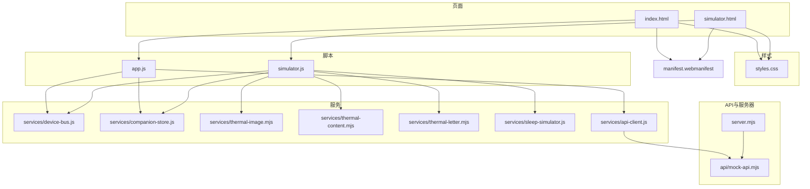
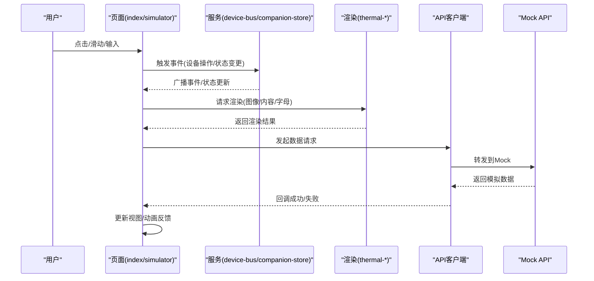
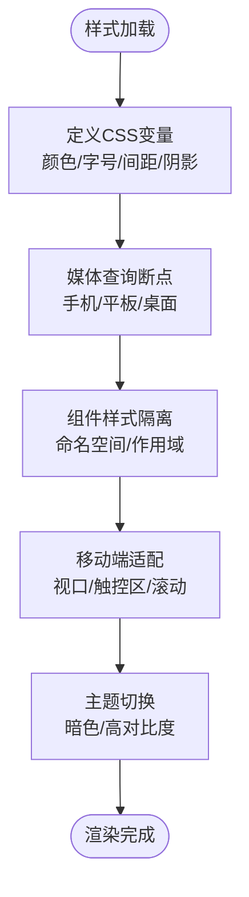
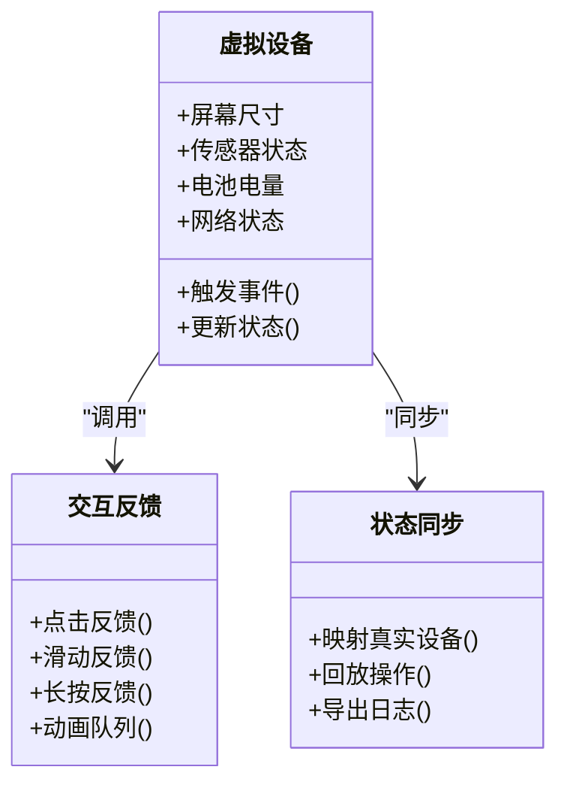
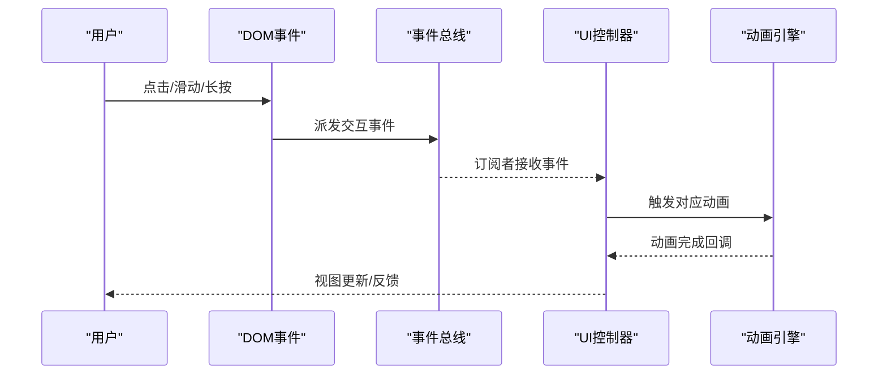
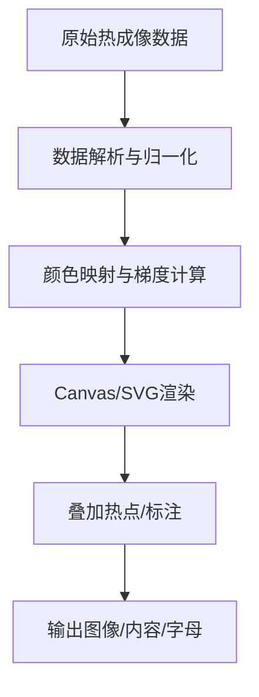
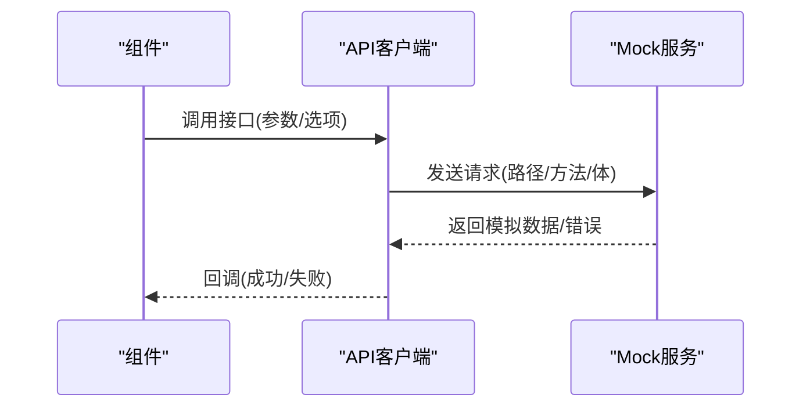
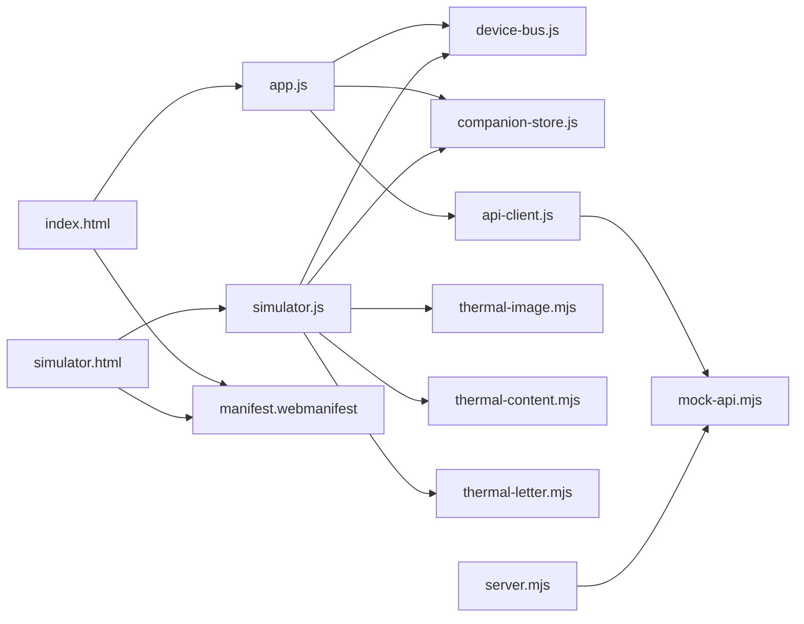

# UI组件系统

<cite>
**本文引用的文件**   
- [index.html](file://apps/web/index.html)
- [simulator.html](file://apps/web/simulator.html)
- [styles.css](file://apps/web/styles.css)
- [app.js](file://apps/web/app.js)
- [simulator.js](file://apps/web/simulator.js)
- [device-bus.js](file://apps/web/services/device-bus.js)
- [companion-store.js](file://apps/web/services/companion-store.js)
- [thermal-image.mjs](file://apps/web/services/thermal-image.mjs)
- [thermal-content.mjs](file://apps/web/services/thermal-content.mjs)
- [thermal-letter.mjs](file://apps/web/services/thermal-letter.mjs)
- [sleep-simulator.js](file://apps/web/services/sleep-simulator.js)
- [api-client.js](file://apps/web/services/api-client.js)
- [mock-api.mjs](file://apps/web/api/mock-api.mjs)
- [server.mjs](file://apps/web/server.mjs)
- [manifest.webmanifest](file://apps/web/manifest.webmanifest)
</cite>

## 目录
1. [简介](#简介)
2. [项目结构](#项目结构)
3. [核心组件](#核心组件)
4. [架构总览](#架构总览)
5. [详细组件分析](#详细组件分析)
6. [依赖关系分析](#依赖关系分析)
7. [性能考虑](#性能考虑)
8. [故障排查指南](#故障排查指南)
9. [结论](#结论)
10. [附录](#附录)

## 简介
本文件面向UI组件系统的实现与使用，围绕响应式界面设计、组件化架构、样式系统与主题定制、模拟器界面原理、用户交互模式、动画效果与可访问性支持、组件复用策略、样式隔离与性能优化、以及UI测试与兼容性验证进行系统化说明。目标读者包括前端开发者、产品与设计师、以及需要集成或扩展该UI系统的工程师。

## 项目结构
Web端位于 apps/web 目录，采用“页面 + 服务模块”的组织方式：
- 页面层：index.html（主应用）、simulator.html（模拟器）
- 样式层：styles.css（全局样式、主题变量、媒体查询）
- 脚本层：app.js（主应用逻辑）、simulator.js（模拟器逻辑）
- 服务层：services/*（设备总线、状态存储、热成像渲染、API客户端、模拟数据等）
- API与服务器：api/*、server.mjs（本地Mock与静态服务）
- PWA配置：manifest.webmanifest

图表来源
- [index.html:1-200](file://apps/web/index.html#L1-L200)
- [simulator.html:1-200](file://apps/web/simulator.html#L1-L200)
- [styles.css:1-200](file://apps/web/styles.css#L1-L200)
- [app.js:1-200](file://apps/web/app.js#L1-L200)
- [simulator.js:1-200](file://apps/web/simulator.js#L1-L200)
- [device-bus.js:1-200](file://apps/web/services/device-bus.js#L1-L200)
- [companion-store.js:1-200](file://apps/web/services/companion-store.js#L1-L200)
- [thermal-image.mjs:1-200](file://apps/web/services/thermal-image.mjs#L1-L200)
- [thermal-content.mjs:1-200](file://apps/web/services/thermal-content.mjs#L1-L200)
- [thermal-letter.mjs:1-200](file://apps/web/services/thermal-letter.mjs#L1-L200)
- [sleep-simulator.js:1-200](file://apps/web/services/sleep-simulator.js#L1-L200)
- [api-client.js:1-200](file://apps/web/services/api-client.js#L1-L200)
- [mock-api.mjs:1-200](file://apps/web/api/mock-api.mjs#L1-L200)
- [server.mjs:1-200](file://apps/web/server.mjs#L1-L200)
- [manifest.webmanifest:1-200](file://apps/web/manifest.webmanifest#L1-L200)

章节来源
- [index.html:1-200](file://apps/web/index.html#L1-L200)
- [simulator.html:1-200](file://apps/web/simulator.html#L1-L200)
- [styles.css:1-200](file://apps/web/styles.css#L1-L200)
- [app.js:1-200](file://apps/web/app.js#L1-L200)
- [simulator.js:1-200](file://apps/web/simulator.js#L1-L200)
- [device-bus.js:1-200](file://apps/web/services/device-bus.js#L1-L200)
- [companion-store.js:1-200](file://apps/web/services/companion-store.js#L1-L200)
- [thermal-image.mjs:1-200](file://apps/web/services/thermal-image.mjs#L1-L200)
- [thermal-content.mjs:1-200](file://apps/web/services/thermal-content.mjs#L1-L200)
- [thermal-letter.mjs:1-200](file://apps/web/services/thermal-letter.mjs#L1-L200)
- [sleep-simulator.js:1-200](file://apps/web/services/sleep-simulator.js#L1-L200)
- [api-client.js:1-200](file://apps/web/services/api-client.js#L1-L200)
- [mock-api.mjs:1-200](file://apps/web/api/mock-api.mjs#L1-L200)
- [server.mjs:1-200](file://apps/web/server.mjs#L1-L200)
- [manifest.webmanifest:1-200](file://apps/web/manifest.webmanifest#L1-L200)

## 核心组件
- 页面容器与布局
  - index.html 作为主应用入口，负责引入样式与脚本、挂载根节点与基础布局。
  - simulator.html 作为模拟器入口，提供虚拟设备视图与交互控件。
- 样式系统
  - styles.css 集中定义CSS变量（颜色、字号、间距、阴影等）、通用组件样式、媒体查询与移动端适配规则。
- 应用逻辑
  - app.js 管理主应用生命周期、事件绑定、与服务层通信、状态更新与视图渲染。
  - simulator.js 管理模拟器状态、虚拟设备模型、交互反馈与动画时序。
- 服务层
  - device-bus.js 提供跨模块事件总线，解耦组件间通信。
  - companion-store.js 维护应用级状态（如设备信息、会话、缓存）。
  - thermal-* 系列模块负责热成像数据的解析、渲染与内容生成。
  - api-client.js 封装HTTP请求，统一错误处理与重试策略。
  - mock-api.mjs 提供本地Mock接口，便于前端开发与联调。
  - server.mjs 启动本地静态服务，支持开发期热重载与代理。
- PWA能力
  - manifest.webmanifest 声明应用名称、图标、启动页与离线缓存策略。

章节来源
- [index.html:1-200](file://apps/web/index.html#L1-L200)
- [simulator.html:1-200](file://apps/web/simulator.html#L1-L200)
- [styles.css:1-200](file://apps/web/styles.css#L1-L200)
- [app.js:1-200](file://apps/web/app.js#L1-L200)
- [simulator.js:1-200](file://apps/web/simulator.js#L1-L200)
- [device-bus.js:1-200](file://apps/web/services/device-bus.js#L1-L200)
- [companion-store.js:1-200](file://apps/web/services/companion-store.js#L1-L200)
- [thermal-image.mjs:1-200](file://apps/web/services/thermal-image.mjs#L1-L200)
- [thermal-content.mjs:1-200](file://apps/web/services/thermal-content.mjs#L1-L200)
- [thermal-letter.mjs:1-200](file://apps/web/services/thermal-letter.mjs#L1-L200)
- [api-client.js:1-200](file://apps/web/services/api-client.js#L1-L200)
- [mock-api.mjs:1-200](file://apps/web/api/mock-api.mjs#L1-L200)
- [server.mjs:1-200](file://apps/web/server.mjs#L1-L200)
- [manifest.webmanifest:1-200](file://apps/web/manifest.webmanifest#L1-L200)

## 架构总览
整体采用“页面-服务-数据”的分层架构：
- 页面层仅负责DOM挂载与最小化渲染逻辑，避免业务耦合。
- 服务层通过事件总线与状态存储实现松耦合通信，保证组件可替换与可扩展。
- 数据层由API客户端与Mock服务组成，屏蔽网络细节并提供一致接口。

图表来源
- [app.js:1-200](file://apps/web/app.js#L1-L200)
- [simulator.js:1-200](file://apps/web/simulator.js#L1-L200)
- [device-bus.js:1-200](file://apps/web/services/device-bus.js#L1-L200)
- [companion-store.js:1-200](file://apps/web/services/companion-store.js#L1-L200)
- [thermal-image.mjs:1-200](file://apps/web/services/thermal-image.mjs#L1-L200)
- [thermal-content.mjs:1-200](file://apps/web/services/thermal-content.mjs#L1-L200)
- [thermal-letter.mjs:1-200](file://apps/web/services/thermal-letter.mjs#L1-L200)
- [api-client.js:1-200](file://apps/web/services/api-client.js#L1-L200)
- [mock-api.mjs:1-200](file://apps/web/api/mock-api.mjs#L1-L200)

## 详细组件分析

### 样式系统与主题定制
- CSS变量体系
  - 在样式文件中集中定义主题变量（颜色、字体、间距、圆角、阴影），通过类名或属性选择器注入到组件中，实现一键换肤与暗色模式切换。
- 媒体查询与响应式
  - 基于断点组织布局与排版，确保在手机、平板与桌面端的一致性体验；针对小屏设备优化触控区域与滚动行为。
- 组件样式隔离
  - 使用命名空间或作用域类名避免样式冲突；对复杂组件采用模块化样式文件并引入到主样式表。
- 移动端适配
  - 设置视口与缩放策略，禁用不必要的缩放；为触摸交互提供合适的命中区域与反馈。

章节来源
- [styles.css:1-200](file://apps/web/styles.css#L1-L200)

### 模拟器界面与虚拟设备
- 虚拟设备模型
  - 在模拟器中构建设备对象（屏幕尺寸、传感器、电池、网络状态），并通过事件总线对外暴露状态变化。
- 交互反馈
  - 对用户操作（点击、滑动、长按）提供即时视觉与触觉反馈；结合动画队列保证流畅性。
- 状态同步
  - 模拟器状态与真实设备状态保持映射，便于调试与回放。

章节来源
- [simulator.html:1-200](file://apps/web/simulator.html#L1-L200)
- [simulator.js:1-200](file://apps/web/simulator.js#L1-L200)
- [device-bus.js:1-200](file://apps/web/services/device-bus.js#L1-L200)

### 用户交互模式与动画效果
- 交互模式
  - 统一手势识别与事件分发，避免重复监听；对复杂场景提供组合手势与防抖节流。
- 动画效果
  - 使用CSS过渡与关键帧动画，必要时结合requestAnimationFrame提升性能；对长列表与大图渲染进行虚拟化。
- 可访问性支持
  - 为关键元素添加语义标签与ARIA属性；确保键盘导航与屏幕阅读器兼容；提供高对比度主题。

章节来源
- [app.js:1-200](file://apps/web/app.js#L1-L200)
- [simulator.js:1-200](file://apps/web/simulator.js#L1-L200)
- [device-bus.js:1-200](file://apps/web/services/device-bus.js#L1-L200)

### 组件复用策略与样式隔离
- 复用策略
  - 将通用UI抽象为独立组件（按钮、卡片、弹窗），通过props与插槽注入内容与行为；提供默认主题与覆盖接口。
- 样式隔离
  - 使用命名空间类名与作用域样式，避免全局污染；对第三方库样式进行二次封装与覆盖。
- 性能优化
  - 按需加载组件与样式；对大组件进行懒加载与分片渲染；减少重排重绘。

章节来源
- [styles.css:1-200](file://apps/web/styles.css#L1-L200)
- [app.js:1-200](file://apps/web/app.js#L1-L200)

### 热成像渲染与内容生成
- 热成像图像
  - 解析原始数据，映射颜色梯度，渲染到Canvas或SVG；支持缩放与热点标注。
- 热成像内容
  - 根据温度分布生成文本摘要与可视化图表；提供导出与分享功能。
- 热成像字母
  - 将温度数据转换为字母形状，用于创意展示与教学演示。

章节来源
- [thermal-image.mjs:1-200](file://apps/web/services/thermal-image.mjs#L1-L200)
- [thermal-content.mjs:1-200](file://apps/web/services/thermal-content.mjs#L1-L200)
- [thermal-letter.mjs:1-200](file://apps/web/services/thermal-letter.mjs#L1-L200)

### API客户端与Mock服务
- API客户端
  - 封装请求方法、错误处理、重试与超时；提供拦截器用于日志与鉴权。
- Mock服务
  - 模拟后端接口，支持参数校验与延迟；便于前端独立开发与测试。

章节来源
- [api-client.js:1-200](file://apps/web/services/api-client.js#L1-L200)
- [mock-api.mjs:1-200](file://apps/web/api/mock-api.mjs#L1-L200)

### 本地服务器与PWA配置
- 本地服务器
  - 提供静态资源服务、代理转发与热重载；支持开发期调试与联调。
- PWA配置
  - 声明应用元数据、图标与缓存策略；提升离线体验与安装能力。

章节来源
- [server.mjs:1-200](file://apps/web/server.mjs#L1-L200)
- [manifest.webmanifest:1-200](file://apps/web/manifest.webmanifest#L1-L200)

## 依赖关系分析
- 页面依赖样式与脚本，脚本依赖服务模块，服务模块之间通过事件总线解耦。
- API客户端依赖Mock服务，便于前后端分离开发。
- 热成像模块相互独立，按需提供渲染能力。

图表来源
- [index.html:1-200](file://apps/web/index.html#L1-L200)
- [simulator.html:1-200](file://apps/web/simulator.html#L1-L200)
- [app.js:1-200](file://apps/web/app.js#L1-L200)
- [simulator.js:1-200](file://apps/web/simulator.js#L1-L200)
- [device-bus.js:1-200](file://apps/web/services/device-bus.js#L1-L200)
- [companion-store.js:1-200](file://apps/web/services/companion-store.js#L1-L200)
- [thermal-image.mjs:1-200](file://apps/web/services/thermal-image.mjs#L1-L200)
- [thermal-content.mjs:1-200](file://apps/web/services/thermal-content.mjs#L1-L200)
- [thermal-letter.mjs:1-200](file://apps/web/services/thermal-letter.mjs#L1-L200)
- [api-client.js:1-200](file://apps/web/services/api-client.js#L1-L200)
- [mock-api.mjs:1-200](file://apps/web/api/mock-api.mjs#L1-L200)
- [server.mjs:1-200](file://apps/web/server.mjs#L1-L200)
- [manifest.webmanifest:1-200](file://apps/web/manifest.webmanifest#L1-L200)

章节来源
- [app.js:1-200](file://apps/web/app.js#L1-L200)
- [simulator.js:1-200](file://apps/web/simulator.js#L1-L200)
- [device-bus.js:1-200](file://apps/web/services/device-bus.js#L1-L200)
- [companion-store.js:1-200](file://apps/web/services/companion-store.js#L1-L200)
- [api-client.js:1-200](file://apps/web/services/api-client.js#L1-L200)
- [mock-api.mjs:1-200](file://apps/web/api/mock-api.mjs#L1-L200)
- [server.mjs:1-200](file://apps/web/server.mjs#L1-L200)
- [manifest.webmanifest:1-200](file://apps/web/manifest.webmanifest#L1-L200)

## 性能考虑
- 渲染优化
  - 使用虚拟列表与图片懒加载，减少首屏负载；对频繁更新的区域使用增量更新。
- 内存管理
  - 及时释放事件监听与定时器；避免闭包引用导致泄漏。
- 网络优化
  - 合并请求、启用缓存与压缩；对失败请求实施指数退避重试。
- 动画性能
  - 优先使用CSS动画与GPU加速；避免在动画循环中进行昂贵计算。

[本节为通用指导，不直接分析具体文件]

## 故障排查指南
- 常见问题
  - 样式未生效：检查CSS变量与作用域是否正确注入；确认媒体查询断点。
  - 交互无反馈：确认事件总线是否订阅与派发；检查动画队列是否阻塞。
  - 数据加载失败：查看API客户端错误处理与Mock服务返回；检查网络与代理配置。
- 调试技巧
  - 使用浏览器开发者工具监控事件流与网络请求；在关键路径添加日志。
  - 利用模拟器回放功能定位问题；导出状态快照进行分析。

章节来源
- [app.js:1-200](file://apps/web/app.js#L1-L200)
- [simulator.js:1-200](file://apps/web/simulator.js#L1-L200)
- [device-bus.js:1-200](file://apps/web/services/device-bus.js#L1-L200)
- [api-client.js:1-200](file://apps/web/services/api-client.js#L1-L200)
- [mock-api.mjs:1-200](file://apps/web/api/mock-api.mjs#L1-L200)

## 结论
本UI组件系统以清晰的层次结构与松耦合的服务模块为基础，提供了完善的样式系统、主题定制、响应式适配与模拟器能力。通过事件总线与状态存储实现组件间高效通信，结合Mock服务与本地服务器提升开发效率。遵循本文的复用策略、样式隔离与性能优化建议，可快速扩展与维护UI组件生态。

[本节为总结性内容，不直接分析具体文件]

## 附录
- 术语表
  - 事件总线：跨模块通信机制，解耦组件依赖。
  - 主题变量：CSS变量集合，用于统一风格与换肤。
  - 虚拟设备：模拟真实设备状态与行为的对象。
- 最佳实践
  - 组件职责单一、接口稳定；样式模块化与命名规范；异步操作统一错误处理。
- 兼容性验证
  - 主流浏览器与移动设备测试；PWA安装与离线能力验证；无障碍辅助功能测试。

[本节为补充信息，不直接分析具体文件]