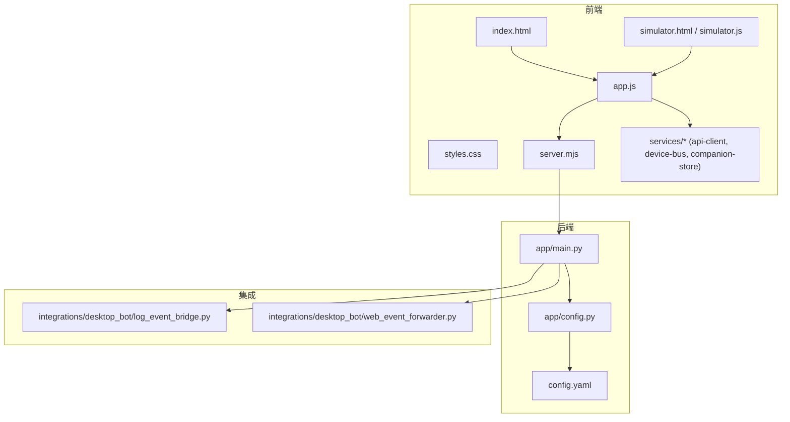
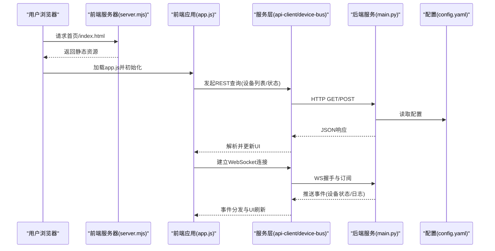
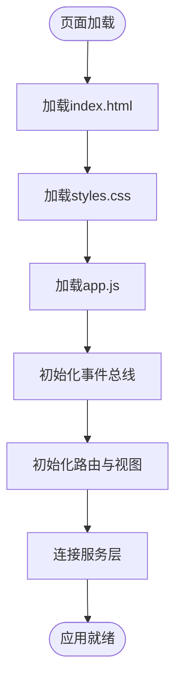
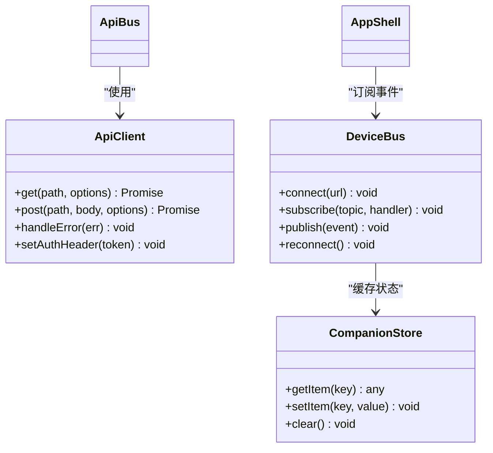
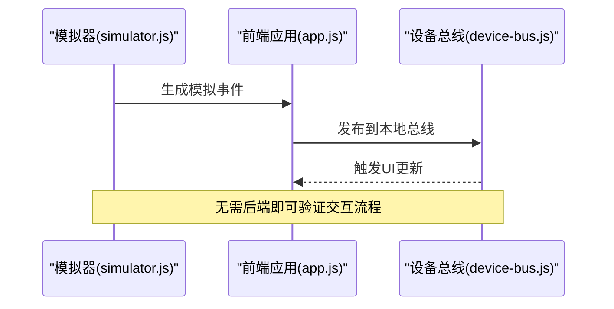
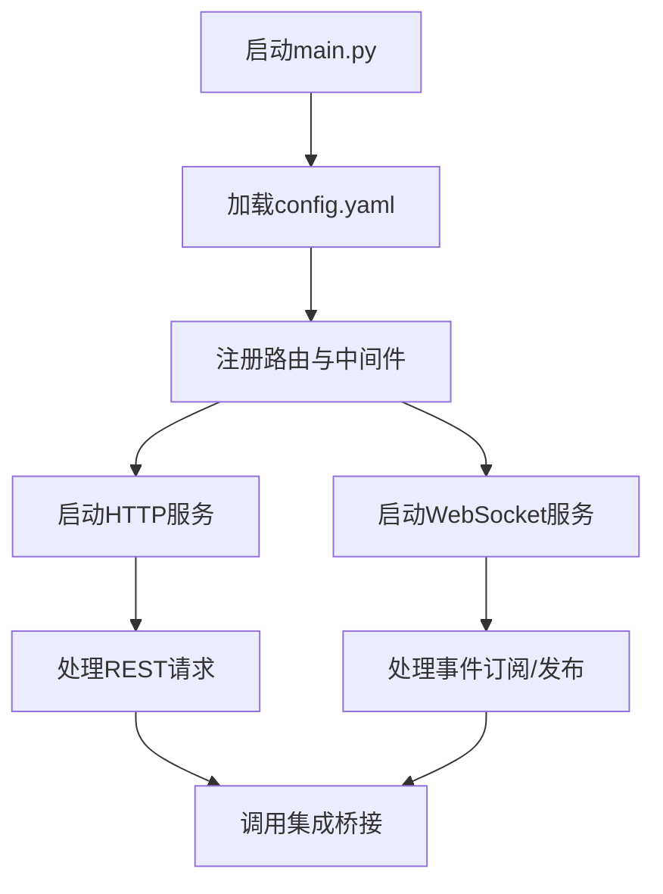
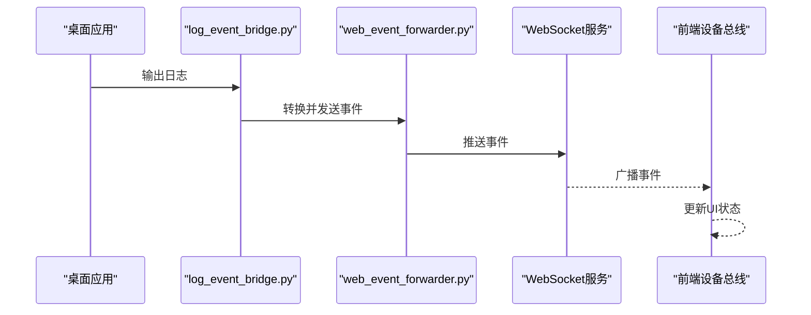
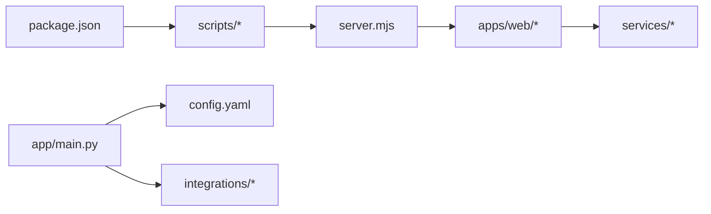

# Web应用概览

<cite>
**本文引用的文件**   
- [README.md](file://README.md)
- [package.json](file://package.json)
- [apps/web/README.md](file://apps/web/README.md)
- [apps/web/index.html](file://apps/web/index.html)
- [apps/web/app.js](file://apps/web/app.js)
- [apps/web/server.mjs](file://apps/web/server.mjs)
- [apps/web/styles.css](file://apps/web/styles.css)
- [apps/web/services/api-client.js](file://apps/web/services/api-client.js)
- [apps/web/services/device-bus.js](file://apps/web/services/device-bus.js)
- [apps/web/services/companion-store.js](file://apps/web/services/companion-store.js)
- [apps/web/simulator.html](file://apps/web/simulator.html)
- [apps/web/simulator.js](file://apps/web/simulator.js)
- [config.yaml](file://config.yaml)
- [app/main.py](file://app/main.py)
- [app/config.py](file://app/config.py)
- [integrations/desktop_bot/log_event_bridge.py](file://integrations/desktop_bot/log_event桥接.py)
- [integrations/desktop_bot/web_event_forwarder.py](file://integrations/desktop_bot/web_event_forwarder.py)
</cite>

## 目录
1. [简介](#简介)
2. [项目结构](#项目结构)
3. [核心组件](#核心组件)
4. [架构总览](#架构总览)
5. [详细组件分析](#详细组件分析)
6. [依赖关系分析](#依赖关系分析)
7. [性能考虑](#性能考虑)
8. [故障排查指南](#故障排查指南)
9. [结论](#结论)
10. [附录](#附录)

## 简介
本Web应用是一个面向智能设备的现代管理界面，采用前后端分离与事件驱动架构，提供设备状态监控、实时通信（WebSocket）、RESTful API调用、模拟运行与开发调试能力。前端基于原生HTML/CSS/JS构建，强调响应式设计与移动端适配；后端通过Python服务暴露API并转发事件，支持本地与桌面集成。文档将系统阐述应用的架构模式、核心功能模块、整体设计思路、与后端通信机制、启动流程、配置与环境要求、响应式实现原理与移动端策略，以及开发与使用示例。

## 项目结构
- 前端位于 apps/web 目录，包含入口页面、服务端渲染脚本、样式与服务层模块，并提供模拟器用于离线调试。
- 后端主入口在 app/main.py，配置文件为 config.yaml，提供运行时配置与能力开关。
- 集成层 integrations/desktop_bot 提供日志事件桥接与Web事件转发，便于桌面端与Web端联动。
- 顶层 package.json 定义Node脚本与依赖，README.md 提供项目说明与使用说明。

图表来源
- [apps/web/index.html](file://apps/web/index.html)
- [apps/web/app.js](file://apps/web/app.js)
- [apps/web/server.mjs](file://apps/web/server.mjs)
- [apps/web/services/api-client.js](file://apps/web/services/api-client.js)
- [apps/web/services/device-bus.js](file://apps/web/services/device-bus.js)
- [apps/web/services/companion-store.js](file://apps/web/services/companion-store.js)
- [apps/web/simulator.html](file://apps/web/simulator.html)
- [apps/web/simulator.js](file://apps/web/simulator.js)
- [app/main.py](file://app/main.py)
- [app/config.py](file://app/config.py)
- [config.yaml](file://config.yaml)
- [integrations/desktop_bot/log_event_bridge.py](file://integrations/desktop_bot/log_event桥接.py)
- [integrations/desktop_bot/web_event_forwarder.py](file://integrations/desktop_bot/web_event_forwarder.py)

章节来源
- [README.md](file://README.md)
- [package.json](file://package.json)
- [apps/web/README.md](file://apps/web/README.md)

## 核心组件
- 前端应用壳：负责页面初始化、路由与视图切换、事件总线接入、UI状态同步。
- 服务层：封装REST客户端、WebSocket连接、设备事件总线与持久化存储（如Companion Store）。
- 模拟器：提供离线仿真数据流，便于无硬件环境下的端到端验证。
- 后端服务：提供HTTP接口、WebSocket通道、事件转发与配置加载。
- 集成桥接：将桌面端日志事件桥接到Web通道，形成统一的事件分发。

章节来源
- [apps/web/app.js](file://apps/web/app.js)
- [apps/web/services/api-client.js](file://apps/web/services/api-client.js)
- [apps/web/services/device-bus.js](file://apps/web/services/device-bus.js)
- [apps/web/services/companion-store.js](file://apps/web/services/companion-store.js)
- [apps/web/simulator.js](file://apps/web/simulator.js)
- [app/main.py](file://app/main.py)
- [app/config.py](file://app/config.py)
- [integrations/desktop_bot/log_event_bridge.py](file://integrations/desktop_bot/log_event桥接.py)
- [integrations/desktop_bot/web_event_forwarder.py](file://integrations/desktop_bot/web_event_forwarder.py)

## 架构总览
应用采用“前端单页 + Node静态服务 + Python后端”的混合架构：
- 前端通过 server.mjs 提供静态资源与代理，降低部署复杂度。
- REST调用由 api-client.js 统一封装，WebSocket由 device-bus.js 维护长连接。
- 后端 main.py 暴露API与WS，并通过 config.py 读取 config.yaml 的配置。
- 集成层将桌面日志事件桥接至Web通道，使Web可订阅设备事件。

图表来源
- [apps/web/server.mjs](file://apps/web/server.mjs)
- [apps/web/app.js](file://apps/web/app.js)
- [apps/web/services/api-client.js](file://apps/web/services/api-client.js)
- [apps/web/services/device-bus.js](file://apps/web/services/device-bus.js)
- [app/main.py](file://app/main.py)
- [config.yaml](file://config.yaml)

## 详细组件分析

### 前端应用壳与页面初始化
- index.html 作为入口，引入样式与脚本，设置PWA清单以增强移动端体验。
- app.js 完成应用初始化：创建事件总线、注册路由、挂载视图、连接服务层。
- styles.css 提供响应式布局与主题变量，适配不同屏幕尺寸。

图表来源
- [apps/web/index.html](file://apps/web/index.html)
- [apps/web/app.js](file://apps/web/app.js)
- [apps/web/styles.css](file://apps/web/styles.css)

章节来源
- [apps/web/index.html](file://apps/web/index.html)
- [apps/web/app.js](file://apps/web/app.js)
- [apps/web/styles.css](file://apps/web/styles.css)

### 服务层：REST客户端与WebSocket设备总线
- api-client.js 封装HTTP请求，处理错误重试、超时与鉴权头注入。
- device-bus.js 维护WebSocket连接，实现事件订阅、重连与消息队列。
- companion-store.js 提供本地存储能力，缓存设备状态与用户偏好。

图表来源
- [apps/web/services/api-client.js](file://apps/web/services/api-client.js)
- [apps/web/services/device-bus.js](file://apps/web/services/device-bus.js)
- [apps/web/services/companion-store.js](file://apps/web/services/companion-store.js)

章节来源
- [apps/web/services/api-client.js](file://apps/web/services/api-client.js)
- [apps/web/services/device-bus.js](file://apps/web/services/device-bus.js)
- [apps/web/services/companion-store.js](file://apps/web/services/companion-store.js)

### 模拟器：离线仿真与端到端验证
- simulator.html 与 simulator.js 提供模拟设备数据流，包括传感器读数、日志与状态变更。
- 可与真实后端并行运行，用于前端联调与测试用例执行。

图表来源
- [apps/web/simulator.html](file://apps/web/simulator.html)
- [apps/web/simulator.js](file://apps/web/simulator.js)
- [apps/web/app.js](file://apps/web/app.js)
- [apps/web/services/device-bus.js](file://apps/web/services/device-bus.js)

章节来源
- [apps/web/simulator.html](file://apps/web/simulator.html)
- [apps/web/simulator.js](file://apps/web/simulator.js)

### 后端服务与配置
- app/main.py 提供HTTP与WebSocket服务，路由到具体处理器，转发事件到集成层。
- app/config.py 加载 config.yaml，提供类型化配置访问。
- config.yaml 定义端口、日志级别、特性开关等关键参数。

图表来源
- [app/main.py](file://app/main.py)
- [app/config.py](file://app/config.py)
- [config.yaml](file://config.yaml)

章节来源
- [app/main.py](file://app/main.py)
- [app/config.py](file://app/config.py)
- [config.yaml](file://config.yaml)

### 集成桥接：桌面日志到Web事件
- log_event_bridge.py 收集桌面端日志，转换为标准事件格式。
- web_event_forwarder.py 将事件推送到WebSocket通道，供前端订阅。

图表来源
- [integrations/desktop_bot/log_event_bridge.py](file://integrations/desktop_bot/log_event桥接.py)
- [integrations/desktop_bot/web_event_forwarder.py](file://integrations/desktop_bot/web_event_forwarder.py)

章节来源
- [integrations/desktop_bot/log_event_bridge.py](file://integrations/desktop_bot/log_event桥接.py)
- [integrations/desktop_bot/web_event_forwarder.py](file://integrations/desktop_bot/web_event_forwarder.py)

## 依赖关系分析
- 前端依赖Node脚本进行构建与运行，package.json 定义了脚本命令与依赖版本。
- 前端服务 server.mjs 提供静态资源与反向代理，减少跨域问题。
- 后端依赖Python环境与配置文件，确保运行时行为一致。

图表来源
- [package.json](file://package.json)
- [apps/web/server.mjs](file://apps/web/server.mjs)
- [app/main.py](file://app/main.py)
- [config.yaml](file://config.yaml)
- [apps/web/services/api-client.js](file://apps/web/services/api-client.js)
- [apps/web/services/device-bus.js](file://apps/web/services/device-bus.js)
- [apps/web/services/companion-store.js](file://apps/web/services/companion-store.js)

章节来源
- [package.json](file://package.json)
- [apps/web/server.mjs](file://apps/web/server.mjs)
- [app/main.py](file://app/main.py)
- [config.yaml](file://config.yaml)

## 性能考虑
- 前端采用事件总线与增量更新，避免全量重绘；合理使用本地存储减少重复请求。
- WebSocket连接保持长连接，具备自动重连与消息队列，提升实时性。
- 后端通过配置控制日志级别与特性开关，降低不必要的计算与IO。
- 模拟器可在无硬件环境下快速验证，缩短迭代周期。

[本节为通用指导，不直接分析具体文件]

## 故障排查指南
- 前端无法加载资源：检查 server.mjs 静态路径与CORS设置。
- WebSocket连接失败：确认后端WS端口开放、URL正确，查看 device-bus.js 的重连逻辑。
- 事件未更新：检查集成桥接是否正常运行，确认事件格式与订阅主题匹配。
- 配置未生效：核对 config.yaml 语法与 key 命名，确保 app/config.py 正确加载。

章节来源
- [apps/web/server.mjs](file://apps/web/server.mjs)
- [apps/web/services/device-bus.js](file://apps/web/services/device-bus.js)
- [integrations/desktop_bot/log_event_bridge.py](file://integrations/desktop_bot/log_event桥接.py)
- [integrations/desktop_bot/web_event_forwarder.py](file://integrations/desktop_bot/web_event_forwarder.py)
- [app/config.py](file://app/config.py)
- [config.yaml](file://config.yaml)

## 结论
该Web应用通过清晰的前后端分层与事件驱动设计，实现了智能设备的实时监控与管理。REST与WebSocket结合保证了数据的及时性与可靠性，模拟器与集成桥接提升了开发与联调效率。遵循本文档的架构与配置建议，可快速搭建环境并扩展新功能。

[本节为总结，不直接分析具体文件]

## 附录

### 启动流程与环境要求
- 环境要求：Node.js（用于前端服务与脚本）、Python（用于后端服务）、现代浏览器。
- 启动步骤：
  - 安装依赖：根据 package.json 与 requirements.txt 安装必要包。
  - 配置：编辑 config.yaml，设置端口、日志级别与特性开关。
  - 启动后端：运行 app/main.py，加载配置并启动HTTP与WS服务。
  - 启动前端：运行 apps/web/server.mjs，提供静态资源与代理。
  - 访问：在浏览器打开 http://localhost:端口，进入管理界面。

章节来源
- [package.json](file://package.json)
- [config.yaml](file://config.yaml)
- [app/main.py](file://app/main.py)
- [apps/web/server.mjs](file://apps/web/server.mjs)

### 基本使用示例
- 查看设备列表：通过REST接口获取设备信息，前端展示卡片视图。
- 订阅实时事件：建立WebSocket连接，订阅设备状态变化，动态刷新UI。
- 使用模拟器：在无硬件环境下运行 simulator.html，验证交互流程。

章节来源
- [apps/web/services/api-client.js](file://apps/web/services/api-client.js)
- [apps/web/services/device-bus.js](file://apps/web/services/device-bus.js)
- [apps/web/simulator.html](file://apps/web/simulator.html)
- [apps/web/simulator.js](file://apps/web/simulator.js)

### 响应式设计与移动端适配策略
- 使用CSS媒体查询与弹性布局，适配不同屏幕尺寸。
- 触控友好的交互元素与手势支持，提升移动端体验。
- PWA清单与缓存策略，增强离线可用性与加载速度。

章节来源
- [apps/web/styles.css](file://apps/web/styles.css)
- [apps/web/index.html](file://apps/web/index.html)
- [apps/web/manifest.webmanifest](file://apps/web/manifest.webmanifest)