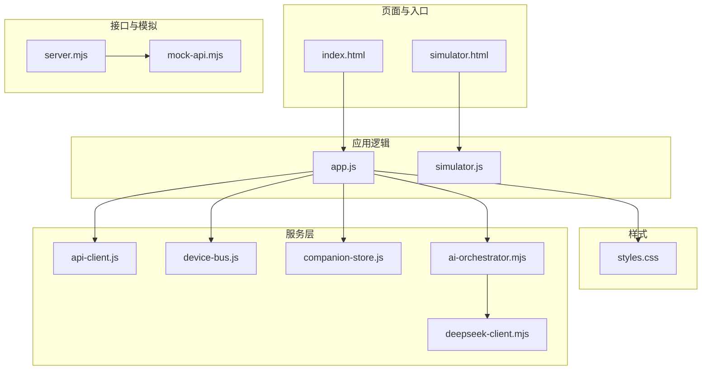
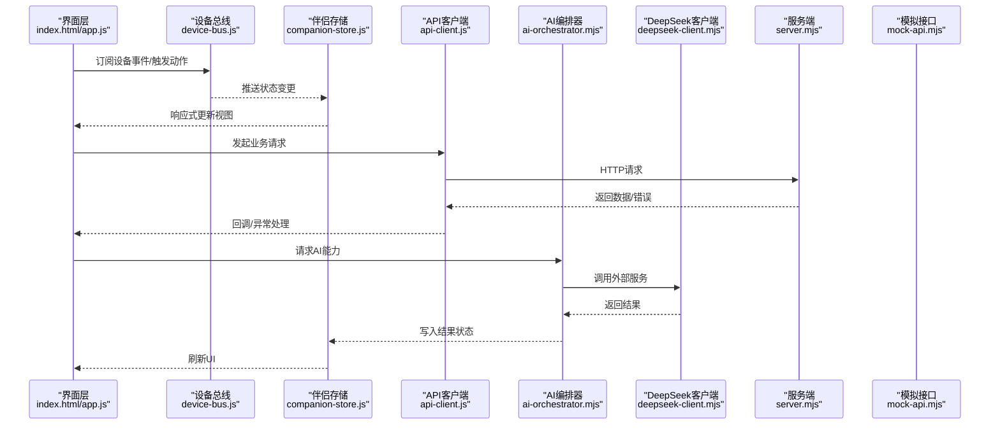
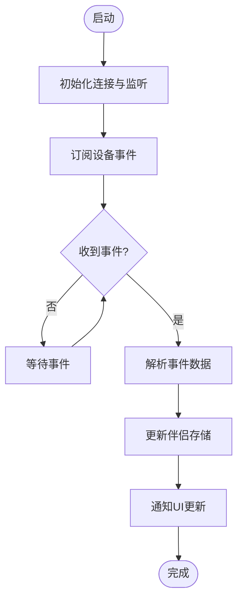
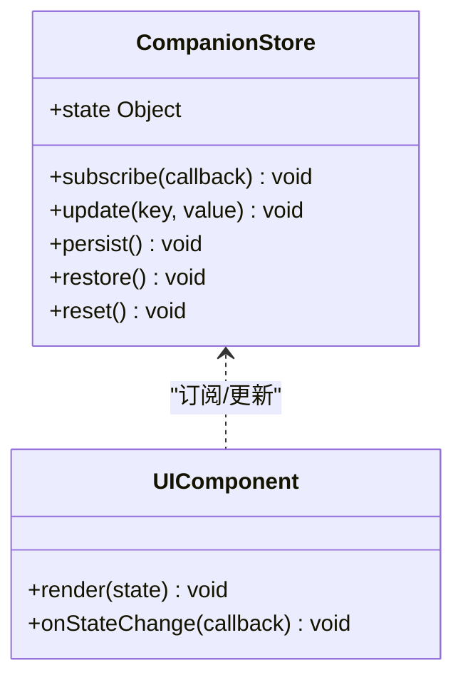
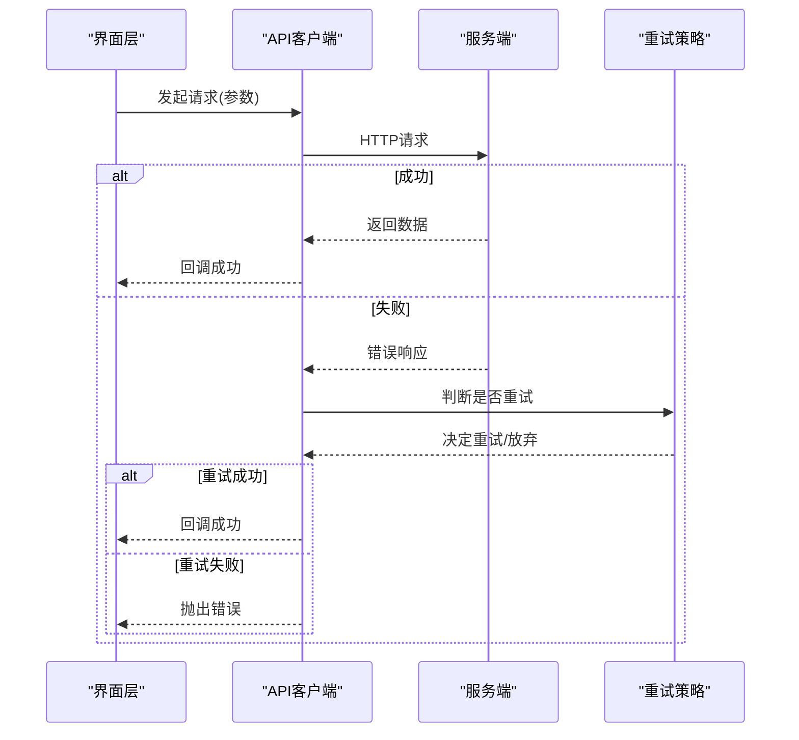
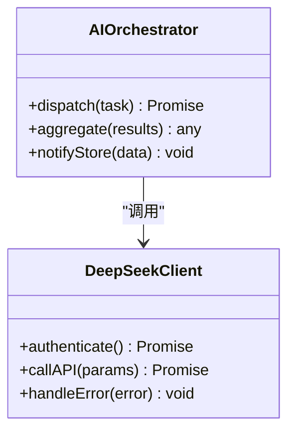
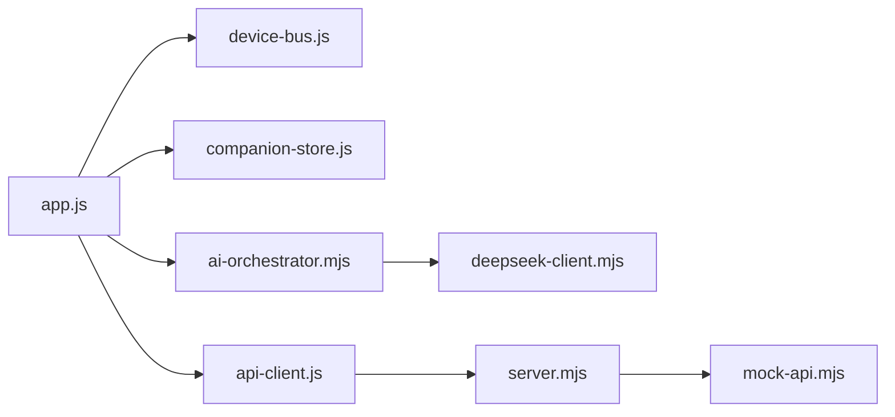

# 前端应用

<cite>
**本文引用的文件**   
- [index.html](file://apps/web/index.html)
- [app.js](file://apps/web/app.js)
- [styles.css](file://apps/web/styles.css)
- [server.mjs](file://apps/web/server.mjs)
- [api-client.js](file://apps/web/services/api-client.js)
- [device-bus.js](file://apps/web/services/device-bus.js)
- [companion-store.js](file://apps/web/services/companion-store.js)
- [ai-orchestrator.mjs](file://apps/web/services/ai-orchestrator.mjs)
- [deepseek-client.mjs](file://apps/web/services/deepseek-client.mjs)
- [mock-api.mjs](file://apps/web/api/mock-api.mjs)
- [simulator.html](file://apps/web/simulator.html)
- [simulator.js](file://apps/web/simulator.js)
- [README.md](file://apps/web/README.md)
</cite>

## 目录
1. [简介](#简介)
2. [项目结构](#项目结构)
3. [核心组件](#核心组件)
4. [架构总览](#架构总览)
5. [详细组件分析](#详细组件分析)
6. [依赖关系分析](#依赖关系分析)
7. [性能考虑](#性能考虑)
8. [故障排查指南](#故障排查指南)
9. [结论](#结论)
10. [附录](#附录)

## 简介
本文件面向基于Web技术的前端应用，重点说明设备总线（Device Bus）的通信机制、伴侣存储（Companion Store）的状态管理、响应式UI与移动端适配策略、服务层API客户端实现与错误重试、UI组件定制与主题配置、以及性能优化与调试工具使用。文档以仓库中的前端代码为依据，提供从架构到实现的系统性说明，帮助开发者快速理解并扩展该前端应用。

## 项目结构
前端应用位于 apps/web 目录，采用模块化组织：
- 入口与页面：index.html、simulator.html
- 应用脚本：app.js、simulator.js
- 样式：styles.css
- 服务端与模拟接口：server.mjs、api/mock-api.mjs
- 服务层：services 目录下包含 API 客户端、设备总线、伴侣存储、AI编排与第三方客户端等模块

**图表来源** 
- [index.html:1-200](file://apps/web/index.html#L1-L200)
- [app.js:1-200](file://apps/web/app.js#L1-L200)
- [styles.css:1-200](file://apps/web/styles.css#L1-L200)
- [server.mjs:1-200](file://apps/web/server.mjs#L1-L200)
- [api-client.js:1-200](file://apps/web/services/api-client.js#L1-L200)
- [device-bus.js:1-200](file://apps/web/services/device-bus.js#L1-L200)
- [companion-store.js:1-200](file://apps/web/services/companion-store.js#L1-L200)
- [ai-orchestrator.mjs:1-200](file://apps/web/services/ai-orchestrator.mjs#L1-L200)
- [deepseek-client.mjs:1-200](file://apps/web/services/deepseek-client.mjs#L1-L200)
- [mock-api.mjs:1-200](file://apps/web/api/mock-api.mjs#L1-L200)

**章节来源**
- [README.md:1-200](file://apps/web/README.md#L1-L200)

## 核心组件
- 设备总线（Device Bus）：负责设备事件发布/订阅、实时消息分发、状态同步与数据绑定，是前后端与硬件交互的核心通道。
- 伴侣存储（Companion Store）：集中管理应用状态，支持持久化与跨组件共享，提供响应式更新能力。
- API 客户端：封装HTTP请求、错误处理、重试机制与超时控制，统一对外暴露服务调用接口。
- AI 编排器：协调本地与远程AI能力，调度任务、聚合结果并回写至伴侣存储。
- DeepSeek 客户端：对接外部AI服务的专用客户端，处理鉴权、限流与错误恢复。

**章节来源**
- [device-bus.js:1-200](file://apps/web/services/device-bus.js#L1-L200)
- [companion-store.js:1-200](file://apps/web/services/companion-store.js#L1-L200)
- [api-client.js:1-200](file://apps/web/services/api-client.js#L1-L200)
- [ai-orchestrator.mjs:1-200](file://apps/web/services/ai-orchestrator.mjs#L1-L200)
- [deepseek-client.mjs:1-200](file://apps/web/services/deepseek-client.mjs#L1-L200)

## 架构总览
前端应用通过设备总线与后端服务或硬件进行通信，伴侣存储作为状态中心，API客户端统一访问后端接口，AI编排器整合本地与远程AI能力，最终驱动UI渲染与用户交互。

**图表来源** 
- [app.js:1-200](file://apps/web/app.js#L1-L200)
- [device-bus.js:1-200](file://apps/web/services/device-bus.js#L1-L200)
- [companion-store.js:1-200](file://apps/web/services/companion-store.js#L1-L200)
- [api-client.js:1-200](file://apps/web/services/api-client.js#L1-L200)
- [ai-orchestrator.mjs:1-200](file://apps/web/services/ai-orchestrator.mjs#L1-L200)
- [deepseek-client.mjs:1-200](file://apps/web/services/deepseek-client.mjs#L1-L200)
- [server.mjs:1-200](file://apps/web/server.mjs#L1-L200)
- [mock-api.mjs:1-200](file://apps/web/api/mock-api.mjs#L1-L200)

## 详细组件分析

### 设备总线（Device Bus）
设备总线提供事件发布/订阅、实时消息分发、状态同步与数据绑定能力。典型流程包括：
- 初始化连接与事件监听
- 订阅特定设备事件
- 接收并解析消息
- 将状态变更推送到伴侣存储
- 触发UI响应式更新

**图表来源** 
- [device-bus.js:1-200](file://apps/web/services/device-bus.js#L1-L200)
- [companion-store.js:1-200](file://apps/web/services/companion-store.js#L1-L200)

**章节来源**
- [device-bus.js:1-200](file://apps/web/services/device-bus.js#L1-L200)

### 伴侣存储（Companion Store）
伴侣存储作为状态管理中心，提供：
- 集中式状态对象
- 响应式订阅与更新
- 持久化存储（如localStorage/sessionStorage）
- 跨组件状态共享与一致性保证

**图表来源** 
- [companion-store.js:1-200](file://apps/web/services/companion-store.js#L1-L200)

**章节来源**
- [companion-store.js:1-200](file://apps/web/services/companion-store.js#L1-L200)

### API 客户端与服务层
API客户端封装HTTP请求，提供：
- 统一请求方法（GET/POST/PUT/DELETE）
- 错误处理与重试机制
- 超时与取消控制
- 与AI编排器的集成

**图表来源** 
- [api-client.js:1-200](file://apps/web/services/api-client.js#L1-L200)

**章节来源**
- [api-client.js:1-200](file://apps/web/services/api-client.js#L1-L200)

### AI 编排器与 DeepSeek 客户端
AI编排器协调本地与远程AI能力，DeepSeek客户端专门处理外部服务调用：
- 任务编排与结果聚合
- 鉴权与会话管理
- 限流与错误恢复
- 与伴侣存储的状态同步

**图表来源** 
- [ai-orchestrator.mjs:1-200](file://apps/web/services/ai-orchestrator.mjs#L1-L200)
- [deepseek-client.mjs:1-200](file://apps/web/services/deepseek-client.mjs#L1-L200)

**章节来源**
- [ai-orchestrator.mjs:1-200](file://apps/web/services/ai-orchestrator.mjs#L1-L200)
- [deepseek-client.mjs:1-200](file://apps/web/services/deepseek-client.mjs#L1-L200)

### 模拟环境与测试
模拟器提供离线开发与测试环境，模拟设备事件与API响应：
- 模拟设备事件生成
- 模拟API响应
- 与真实应用逻辑无缝切换

**章节来源**
- [simulator.html:1-200](file://apps/web/simulator.html#L1-L200)
- [simulator.js:1-200](file://apps/web/simulator.js#L1-L200)
- [mock-api.mjs:1-200](file://apps/web/api/mock-api.mjs#L1-L200)

## 依赖关系分析
前端模块间的依赖关系清晰，服务层模块相互独立且职责明确：

**图表来源** 
- [app.js:1-200](file://apps/web/app.js#L1-L200)
- [device-bus.js:1-200](file://apps/web/services/device-bus.js#L1-L200)
- [companion-store.js:1-200](file://apps/web/services/companion-store.js#L1-L200)
- [api-client.js:1-200](file://apps/web/services/api-client.js#L1-L200)
- [ai-orchestrator.mjs:1-200](file://apps/web/services/ai-orchestrator.mjs#L1-L200)
- [deepseek-client.mjs:1-200](file://apps/web/services/deepseek-client.mjs#L1-L200)
- [server.mjs:1-200](file://apps/web/server.mjs#L1-L200)
- [mock-api.mjs:1-200](file://apps/web/api/mock-api.mjs#L1-L200)

**章节来源**
- [app.js:1-200](file://apps/web/app.js#L1-L200)

## 性能考虑
- 事件去抖与节流：对高频设备事件进行优化，避免频繁状态更新
- 懒加载与按需加载：延迟加载非关键资源，提升首屏性能
- 缓存策略：合理使用浏览器缓存与内存缓存
- 虚拟滚动：大数据列表使用虚拟滚动减少DOM节点数量
- 图片优化：使用现代格式、压缩与懒加载
- 网络优化：请求合并、缓存与预取

## 故障排查指南
- 网络连接问题：检查API客户端的重试机制与超时设置
- 设备连接失败：验证设备总线连接状态与事件订阅
- 状态不同步：检查伴侣存储的持久化与更新逻辑
- AI服务异常：查看AI编排器的错误处理与降级策略
- 调试工具：使用浏览器开发者工具的网络面板、控制台日志与性能分析

**章节来源**
- [api-client.js:1-200](file://apps/web/services/api-client.js#L1-L200)
- [device-bus.js:1-200](file://apps/web/services/device-bus.js#L1-L200)
- [companion-store.js:1-200](file://apps/web/services/companion-store.js#L1-L200)

## 结论
本前端应用通过设备总线、伴侣存储、API客户端和AI编排器等核心组件，构建了完整的Web界面实现。设备总线确保实时通信，伴侣存储管理状态，API客户端统一服务调用，AI编排器整合智能能力。整体架构清晰、模块化程度高，便于扩展与维护。

## 附录
- 响应式UI设计原则：移动优先、弹性布局、触摸友好
- 移动端适配策略：视口设置、媒体查询、触摸事件处理
- UI组件定制指南：CSS变量、主题配置、组件插槽
- 主题配置方法：颜色变量、字体配置、布局模式切换