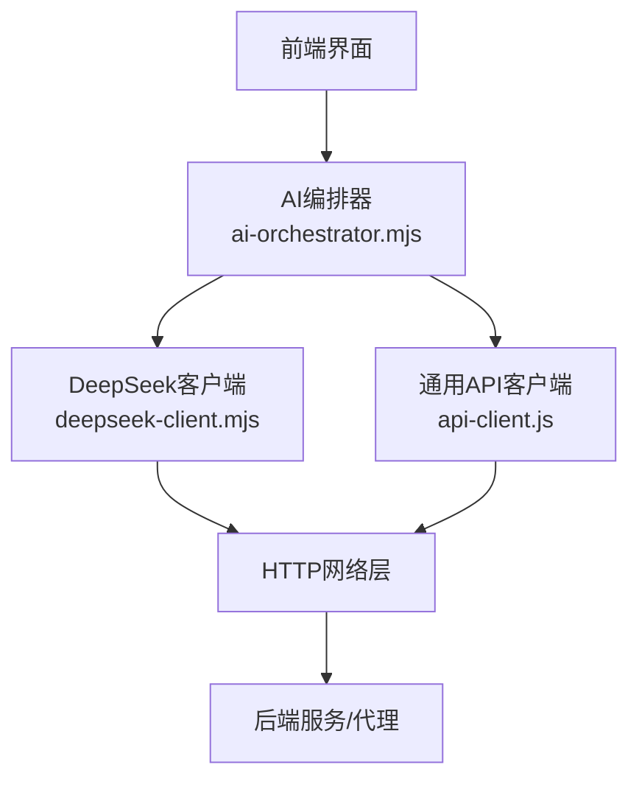
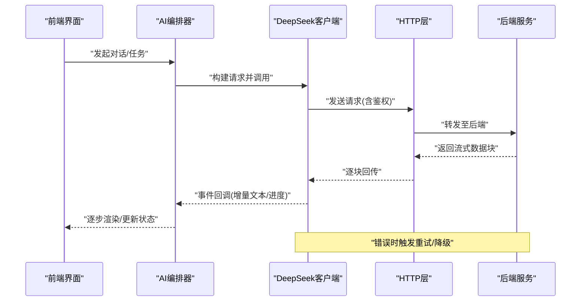
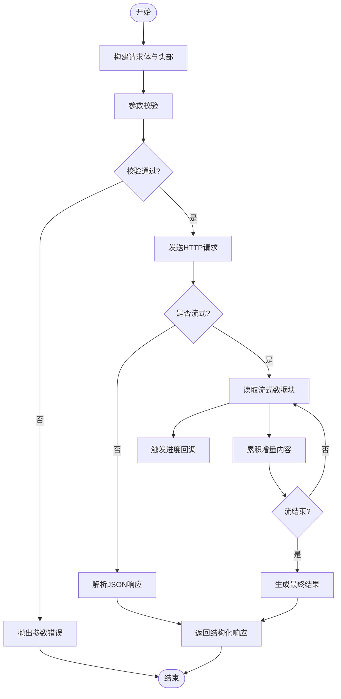
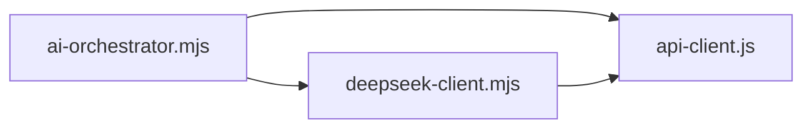

# DeepSeek AI客户端

<cite>
**本文档引用的文件**   
- [deepseek-client.mjs](file://apps/web/services/deepseek-client.mjs)
- [api-client.js](file://apps/web/services/api-client.js)
- [ai-orchestrator.mjs](file://apps/web/services/ai-orchestrator.mjs)
- [config.yaml](file://config.yaml)
- [requirements.txt](file://requirements.txt)
- [package.json](file://package.json)
</cite>

## 目录
1. [简介](#简介)
2. [项目结构](#项目结构)
3. [核心组件](#核心组件)
4. [架构总览](#架构总览)
5. [详细组件分析](#详细组件分析)
6. [依赖关系分析](#依赖关系分析)
7. [性能考虑](#性能考虑)
8. [故障排查指南](#故障排查指南)
9. [结论](#结论)
10. [附录](#附录)

## 简介
本文件面向DeepSeek AI客户端的集成与使用，聚焦以下目标：
- API调用封装机制：请求构建、参数验证、响应处理
- 流式响应处理：数据流管理、进度跟踪、错误恢复
- 认证与安全：API密钥管理与安全最佳实践
- 完整示例：初始化客户端、发送请求、处理不同类型响应
- 错误处理策略：重试机制、超时配置
- 后端集成：与后端服务的数据格式转换与对接方式

## 项目结构
本项目在Web端通过JavaScript模块提供DeepSeek AI客户端能力，并与AI编排器协作完成端到端流程。关键位置如下：
- apps/web/services/deepseek-client.mjs：DeepSeek客户端实现（请求构建、流式处理、重试与超时）
- apps/web/services/api-client.js：通用HTTP客户端封装（用于内部API或代理转发）
- apps/web/services/ai-orchestrator.mjs：AI编排器，协调语音、视觉与LLM调用
- config.yaml：应用配置（含可能的API密钥占位与运行时参数）
- package.json：Node.js依赖与脚本定义
- requirements.txt：Python依赖（与本客户端无直接耦合，但为整体系统参考）

图表来源
- [deepseek-client.mjs](file://apps/web/services/deepseek-client.mjs)
- [api-client.js](file://apps/web/services/api-client.js)
- [ai-orchestrator.mjs](file://apps/web/services/ai-orchestrator.mjs)

章节来源
- [deepseek-client.mjs](file://apps/web/services/deepseek-client.mjs)
- [api-client.js](file://apps/web/services/api-client.js)
- [ai-orchestrator.mjs](file://apps/web/services/ai-orchestrator.mjs)
- [config.yaml](file://config.yaml)
- [package.json](file://package.json)
- [requirements.txt](file://requirements.txt)

## 核心组件
- DeepSeek客户端（deepseek-client.mjs）
  - 职责：封装DeepSeek API调用，负责请求构建、参数校验、流式响应解析、错误处理与重试、超时控制
  - 关键点：统一错误模型、可插拔传输层、流式事件回调、进度追踪
- 通用API客户端（api-client.js）
  - 职责：封装HTTP请求、鉴权头注入、重试与超时、响应标准化
  - 关键点：拦截器模式、错误分类、日志与监控埋点
- AI编排器（ai-orchestrator.mjs）
  - 职责：协调多模态输入（语音、图像等），组织对话上下文，调度DeepSeek客户端与内部API
  - 关键点：上下文管理、任务队列、结果聚合

章节来源
- [deepseek-client.mjs](file://apps/web/services/deepseek-client.mjs)
- [api-client.js](file://apps/web/services/api-client.js)
- [ai-orchestrator.mjs](file://apps/web/services/ai-orchestrator.mjs)

## 架构总览
下图展示从前端到后端的调用链路，包括流式响应的数据流向与错误恢复路径。

图表来源
- [deepseek-client.mjs](file://apps/web/services/deepseek-client.mjs)
- [api-client.js](file://apps/web/services/api-client.js)
- [ai-orchestrator.mjs](file://apps/web/services/ai-orchestrator.mjs)

## 详细组件分析

### DeepSeek客户端（deepseek-client.mjs）
- 请求构建
  - 将用户输入、系统提示、模型参数组装为标准请求体
  - 自动附加鉴权头（如Authorization: Bearer <API_KEY>）
  - 支持可选参数：温度、最大令牌数、流式开关等
- 参数验证
  - 对必填字段进行类型与范围校验（如模型名、消息数组非空）
  - 对敏感字段进行脱敏与长度限制
- 响应处理
  - 普通响应：解析JSON，提取内容、元数据与使用统计
  - 流式响应：按块解析增量文本，触发进度回调，累积最终结果
- 错误处理与重试
  - 区分网络错误、服务端错误、限流错误
  - 指数退避重试，支持最大重试次数与超时时间
  - 失败降级：缓存最近成功结果或返回友好提示
- 流式数据处理
  - 基于ReadableStream或EventSource风格的事件流
  - 进度跟踪：字节数、token估算、延迟指标
  - 错误恢复：断线重连、部分数据合并、完整性校验

图表来源
- [deepseek-client.mjs](file://apps/web/services/deepseek-client.mjs)

章节来源
- [deepseek-client.mjs](file://apps/web/services/deepseek-client.mjs)

### 通用API客户端（api-client.js）
- 功能要点
  - 统一的请求/响应拦截器
  - 鉴权头注入与刷新逻辑
  - 重试与超时配置（全局与局部覆盖）
  - 错误分类与上报（网络、业务、超时、限流）
- 与DeepSeek客户端的关系
  - 作为底层传输抽象，被DeepSeek客户端复用
  - 提供可配置的HTTP适配器，便于切换后端代理或网关

章节来源
- [api-client.js](file://apps/web/services/api-client.js)

### AI编排器（ai-orchestrator.mjs）
- 功能要点
  - 上下文管理：维护会话历史、工具调用结果、多模态输入
  - 任务编排：串行/并行调度语音识别、图像理解、LLM推理
  - 结果聚合：合并各子任务输出，格式化为用户可读响应
- 与DeepSeek客户端的交互
  - 构造对话上下文与系统提示
  - 订阅流式事件，实时更新UI
  - 捕获异常并执行降级策略

章节来源
- [ai-orchestrator.mjs](file://apps/web/services/ai-orchestrator.mjs)

## 依赖关系分析
- 模块内聚与耦合
  - deepseek-client.mjs 依赖 api-client.js 作为HTTP抽象
  - ai-orchestrator.mjs 同时依赖 deepseek-client.mjs 与 api-client.js
- 外部依赖
  - Node.js环境下的HTTP库（如fetch或axios）
  - 可能依赖环境变量或配置文件加载模块
- 潜在循环依赖
  - 确保编排器不反向导入客户端实现细节，避免循环引用

图表来源
- [ai-orchestrator.mjs](file://apps/web/services/ai-orchestrator.mjs)
- [deepseek-client.mjs](file://apps/web/services/deepseek-client.mjs)
- [api-client.js](file://apps/web/services/api-client.js)

章节来源
- [ai-orchestrator.mjs](file://apps/web/services/ai-orchestrator.mjs)
- [deepseek-client.mjs](file://apps/web/services/deepseek-client.mjs)
- [api-client.js](file://apps/web/services/api-client.js)

## 性能考虑
- 流式传输
  - 优先使用流式接口减少首字延迟
  - 合理设置缓冲区大小与背压策略
- 重试与超时
  - 指数退避避免雪崩
  - 根据网络状况动态调整超时阈值
- 资源管理
  - 及时释放流式读取器与连接
  - 避免内存泄漏（大对象缓存需设置上限）
- 监控与度量
  - 记录QPS、P95/P99延迟、错误率
  - 采样日志避免过度写入

[本节为通用指导，不直接分析具体文件]

## 故障排查指南
- 常见问题
  - 鉴权失败：检查API密钥是否正确注入与有效期
  - 流式中断：确认网络稳定性与服务端是否支持SSE/WebSocket
  - 参数错误：核对必填字段与数据类型
- 定位步骤
  - 启用调试日志，观察请求头与响应体
  - 使用独立工具（如curl）复现问题
  - 检查重试与超时配置是否合理
- 恢复策略
  - 自动重试+人工干预阈值
  - 降级到缓存或默认回复
  - 告警通知与快速回滚

章节来源
- [deepseek-client.mjs](file://apps/web/services/deepseek-client.mjs)
- [api-client.js](file://apps/web/services/api-client.js)

## 结论
本客户端以模块化设计实现了DeepSeek API的稳定调用与流式处理能力，结合通用HTTP客户端与编排器，形成高内聚、低耦合的AI服务接入方案。通过完善的错误处理、重试与超时机制，以及清晰的鉴权与数据格式规范，可满足生产环境的可靠性要求。

[本节为总结性内容，不直接分析具体文件]

## 附录

### 认证与API密钥管理
- 推荐方式
  - 使用环境变量或安全配置中心注入API密钥
  - 禁止硬编码密钥到代码仓库
- 最佳实践
  - 定期轮换密钥
  - 最小权限原则，仅授予必要访问范围
  - 传输全程HTTPS，避免中间人攻击

章节来源
- [config.yaml](file://config.yaml)

### 完整使用示例（步骤说明）
- 初始化客户端
  - 加载配置（包含API密钥、基础URL、超时等）
  - 创建客户端实例并注册事件回调
- 发送请求
  - 构建消息体（角色、内容、工具调用等）
  - 选择响应模式（普通/流式）
- 处理响应
  - 普通响应：解析JSON并渲染
  - 流式响应：监听增量事件，累积并实时显示
- 错误处理
  - 捕获网络与业务错误
  - 触发重试或降级逻辑

章节来源
- [deepseek-client.mjs](file://apps/web/services/deepseek-client.mjs)
- [ai-orchestrator.mjs](file://apps/web/services/ai-orchestrator.mjs)

### 错误处理策略与重试机制
- 错误分类
  - 网络错误（DNS、连接、超时）
  - 服务端错误（5xx、限流429）
  - 业务错误（参数非法、权限不足）
- 重试策略
  - 指数退避，最大重试次数
  - 针对限流错误增加等待时间
- 超时配置
  - 连接超时、读超时、写超时分离
  - 流式场景下设置心跳检测

章节来源
- [api-client.js](file://apps/web/services/api-client.js)
- [deepseek-client.mjs](file://apps/web/services/deepseek-client.mjs)

### 与后端服务的集成与数据格式
- 集成方式
  - 直连DeepSeek官方API或通过内部网关代理
  - 统一鉴权与审计入口
- 数据格式
  - 请求体：标准OpenAI兼容格式（messages、model、stream等）
  - 响应体：普通JSON或流式事件（data: {...}）
- 转换规则
  - 输入侧：将多模态数据转为文本或附件描述
  - 输出侧：将结构化结果映射到UI模型

章节来源
- [ai-orchestrator.mjs](file://apps/web/services/ai-orchestrator.mjs)
- [deepseek-client.mjs](file://apps/web/services/deepseek-client.mjs)