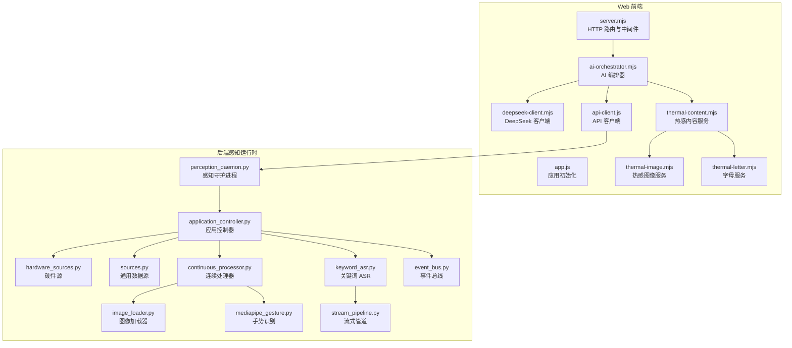
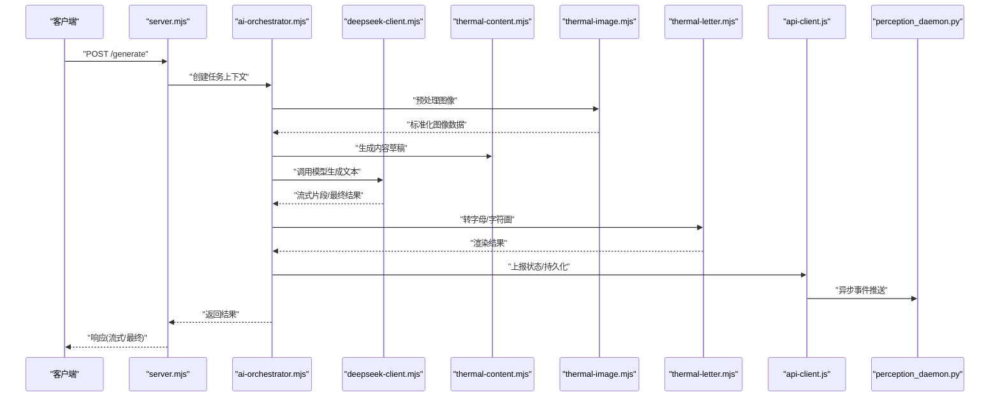
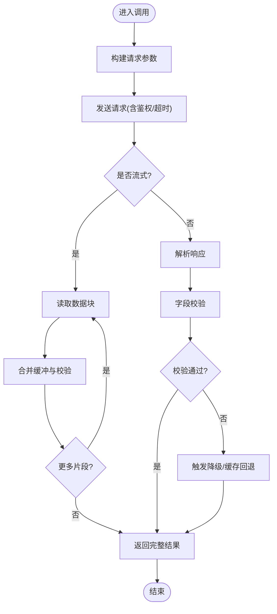
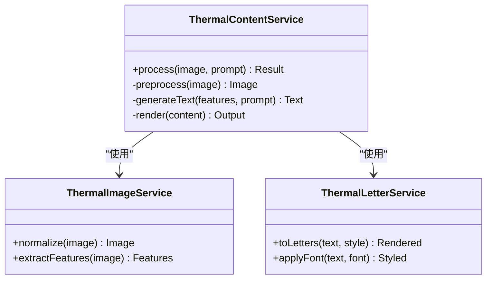
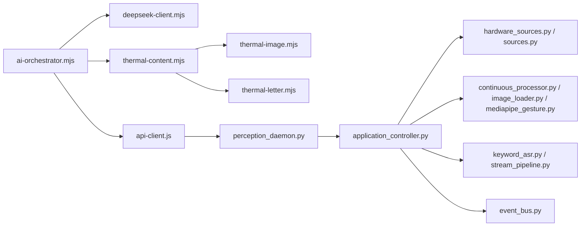

# 服务层架构

<cite>
**本文引用的文件**   
- [deepseek-client.mjs](file://apps/web/services/deepseek-client.mjs)
- [thermal-content.mjs](file://apps/web/services/thermal-content.mjs)
- [thermal-image.mjs](file://apps/web/services/thermal-image.mjs)
- [thermal-letter.mjs](file://apps/web/services/thermal-letter.mjs)
- [ai-orchestrator.mjs](file://apps/web/services/ai-orchestrator.mjs)
- [api-client.js](file://apps/web/services/api-client.js)
- [server.mjs](file://apps/web/server.mjs)
- [app.js](file://apps/web/app.js)
- [perception_daemon.py](file://app/runtime/perception_daemon.py)
- [application_controller.py](file://app/control/application_controller.py)
- [hardware_sources.py](file://app/transport/hardware_sources.py)
- [sources.py](file://app/transport/sources.py)
- [continuous_processor.py](file://app/vision/continuous_processor.py)
- [image_loader.py](file://app/vision/image_loader.py)
- [mediapipe_gesture.py](file://app/vision/mediapipe_gesture.py)
- [keyword_asr.py](file://app/audio/keyword_asr.py)
- [stream_pipeline.py](file://app/audio/stream_pipeline.py)
- [event_bus.py](file://app/events/event_bus.py)
- [config.yaml](file://config.yaml)
</cite>

## 目录
1. [简介](#简介)
2. [项目结构](#项目结构)
3. [核心组件](#核心组件)
4. [架构总览](#架构总览)
5. [详细组件分析](#详细组件分析)
6. [依赖关系分析](#依赖关系分析)
7. [性能考量](#性能考量)
8. [故障排查指南](#故障排查指南)
9. [结论](#结论)
10. [附录：扩展与模板](#附录扩展与模板)

## 简介
本文件面向“服务层架构”的文档目标，聚焦模块化服务设计与依赖注入模式，系统阐述 DeepSeek AI 客户端、热感内容服务（图像处理、文本生成、内容渲染）、热感图像服务与字母服务的业务逻辑。同时给出服务间通信协议、数据格式规范与接口契约，并提供扩展指南与自定义服务开发模板，帮助读者快速理解并扩展该系统的服务能力。

## 项目结构
本项目采用前后端分离与服务分层组织：
- 前端 Web 服务位于 apps/web，包含 API 客户端、AI 编排器、DeepSeek 客户端、热感内容相关服务以及服务器入口。
- 后端感知运行时位于 app，涵盖硬件源、视觉处理、音频处理、事件总线与控制器等模块。
- 配置集中于 config.yaml，用于统一参数管理。

图表来源
- [server.mjs:1-200](file://apps/web/server.mjs#L1-L200)
- [app.js:1-150](file://apps/web/app.js#L1-L150)
- [ai-orchestrator.mjs:1-200](file://apps/web/services/ai-orchestrator.mjs#L1-L200)
- [deepseek-client.mjs:1-200](file://apps/web/services/deepseek-client.mjs#L1-L200)
- [thermal-content.mjs:1-200](file://apps/web/services/thermal-content.mjs#L1-L200)
- [thermal-image.mjs:1-200](file://apps/web/services/thermal-image.mjs#L1-L200)
- [thermal-letter.mjs:1-200](file://apps/web/services/thermal-letter.mjs#L1-L200)
- [api-client.js:1-200](file://apps/web/services/api-client.js#L1-L200)
- [perception_daemon.py:1-200](file://app/runtime/perception_daemon.py#L1-L200)
- [application_controller.py:1-200](file://app/control/application_controller.py#L1-L200)
- [hardware_sources.py:1-200](file://app/transport/hardware_sources.py#L1-L200)
- [sources.py:1-200](file://app/transport/sources.py#L1-L200)
- [continuous_processor.py:1-200](file://app/vision/continuous_processor.py#L1-L200)
- [image_loader.py:1-200](file://app/vision/image_loader.py#L1-L200)
- [mediapipe_gesture.py:1-200](file://app/vision/mediapipe_gesture.py#L1-L200)
- [keyword_asr.py:1-200](file://app/audio/keyword_asr.py#L1-L200)
- [stream_pipeline.py:1-200](file://app/audio/stream_pipeline.py#L1-L200)
- [event_bus.py:1-200](file://app/events/event_bus.py#L1-L200)

章节来源
- [server.mjs:1-200](file://apps/web/server.mjs#L1-L200)
- [app.js:1-150](file://apps/web/app.js#L1-L150)
- [config.yaml:1-200](file://config.yaml#L1-L200)

## 核心组件
- DeepSeek AI 客户端：封装 HTTP/流式调用、重试与错误恢复、响应解析与缓存策略。
- 热感内容服务：协调图像处理、文本生成与内容渲染，提供统一的编排接口。
- 热感图像服务：负责图像预处理、特征提取、结果归一化与输出。
- 字母服务：将输入转换为字母序列或可视化字符画，支持多种字体与样式。
- AI 编排器：组合多个服务，定义执行顺序、并发策略与回退路径。
- API 客户端：统一对外暴露 REST/WS 接口，负责鉴权、限流与日志。
- 后端感知运行时：采集硬件数据、视觉与音频处理、事件分发与状态同步。

章节来源
- [deepseek-client.mjs:1-200](file://apps/web/services/deepseek-client.mjs#L1-L200)
- [thermal-content.mjs:1-200](file://apps/web/services/thermal-content.mjs#L1-L200)
- [thermal-image.mjs:1-200](file://apps/web/services/thermal-image.mjs#L1-L200)
- [thermal-letter.mjs:1-200](file://apps/web/services/thermal-letter.mjs#L1-L200)
- [ai-orchestrator.mjs:1-200](file://apps/web/services/ai-orchestrator.mjs#L1-L200)
- [api-client.js:1-200](file://apps/web/services/api-client.js#L1-L200)
- [perception_daemon.py:1-200](file://app/runtime/perception_daemon.py#L1-L200)

## 架构总览
整体架构遵循“编排器 + 领域服务 + 基础设施”的分层设计：
- 编排层：AI 编排器负责任务分解、调度与容错。
- 领域服务层：DeepSeek 客户端、热感内容服务、热感图像服务、字母服务各自专注单一职责。
- 基础设施层：API 客户端、事件总线、硬件源与数据处理管线。

图表来源
- [server.mjs:1-200](file://apps/web/server.mjs#L1-L200)
- [ai-orchestrator.mjs:1-200](file://apps/web/services/ai-orchestrator.mjs#L1-L200)
- [deepseek-client.mjs:1-200](file://apps/web/services/deepseek-client.mjs#L1-L200)
- [thermal-content.mjs:1-200](file://apps/web/services/thermal-content.mjs#L1-L200)
- [thermal-image.mjs:1-200](file://apps/web/services/thermal-image.mjs#L1-L200)
- [thermal-letter.mjs:1-200](file://apps/web/services/thermal-letter.mjs#L1-L200)
- [api-client.js:1-200](file://apps/web/services/api-client.js#L1-L200)
- [perception_daemon.py:1-200](file://app/runtime/perception_daemon.py#L1-L200)

## 详细组件分析

### DeepSeek AI 客户端
- 功能要点
  - API 调用封装：统一请求构建、鉴权头、超时控制。
  - 流式响应处理：按块消费、合并缓冲、进度回调。
  - 错误恢复：指数退避重试、熔断降级、失败回退到本地缓存或默认模板。
  - 数据校验：对响应字段进行类型检查与缺失处理。
- 关键流程
  - 构建请求 -> 发送请求 -> 接收流式片段 -> 合并与校验 -> 返回结果或抛出可恢复错误。
- 异常与边界
  - 网络抖动、服务端限流、空响应、字段缺失等场景均有兜底策略。

图表来源
- [deepseek-client.mjs:1-200](file://apps/web/services/deepseek-client.mjs#L1-L200)

章节来源
- [deepseek-client.mjs:1-200](file://apps/web/services/deepseek-client.mjs#L1-L200)

### 热感内容服务
- 功能要点
  - 图像处理：缩放、去噪、色彩映射、ROI 选择。
  - 文本生成：基于图像特征与提示词生成描述或故事。
  - 内容渲染：将文本与图像结合为最终展示内容（如字符画、卡片）。
- 编排策略
  - 串行阶段：预处理 -> 生成 -> 渲染。
  - 并行优化：在安全范围内并行执行独立步骤（如多尺度特征提取）。
- 错误处理
  - 各阶段失败时回退到上一阶段可用数据或默认模板。

图表来源
- [thermal-content.mjs:1-200](file://apps/web/services/thermal-content.mjs#L1-L200)
- [thermal-image.mjs:1-200](file://apps/web/services/thermal-image.mjs#L1-L200)
- [thermal-letter.mjs:1-200](file://apps/web/services/thermal-letter.mjs#L1-L200)

章节来源
- [thermal-content.mjs:1-200](file://apps/web/services/thermal-content.mjs#L1-L200)
- [thermal-image.mjs:1-200](file://apps/web/services/thermal-image.mjs#L1-L200)
- [thermal-letter.mjs:1-200](file://apps/web/services/thermal-letter.mjs#L1-L200)

### 热感图像服务
- 职责
  - 图像标准化：尺寸统一、通道对齐、像素值归一化。
  - 特征提取：边缘检测、热力图生成、关键点定位。
  - 输出约束：保证下游服务可消费的固定数据结构。
- 性能优化
  - 批处理与内存池复用，避免频繁分配。
  - 可选 GPU 加速路径（若可用）。

章节来源
- [thermal-image.mjs:1-200](file://apps/web/services/thermal-image.mjs#L1-L200)

### 字母服务
- 职责
  - 文本到字母序列转换：支持不同字体映射与样式。
  - 字符画渲染：根据分辨率与密度生成可视化输出。
- 扩展点
  - 新增字体库、调整密度算法、自定义渲染后端。

章节来源
- [thermal-letter.mjs:1-200](file://apps/web/services/thermal-letter.mjs#L1-L200)

### AI 编排器
- 职责
  - 任务上下文管理：输入验证、状态跟踪、结果聚合。
  - 服务编排：定义阶段、依赖、并发与回退策略。
  - 监控与日志：记录关键指标与错误堆栈。
- 典型流程
  - 接收请求 -> 构建上下文 -> 调用图像服务 -> 调用内容服务 -> 调用 DeepSeek -> 渲染输出 -> 返回结果。

章节来源
- [ai-orchestrator.mjs:1-200](file://apps/web/services/ai-orchestrator.mjs#L1-L200)

### API 客户端
- 职责
  - 统一 HTTP/WS 调用：封装鉴权、重试、限流。
  - 事件推送：向后端感知运行时推送状态与结果。
  - 错误透传：将底层错误包装为统一格式返回给上层。

章节来源
- [api-client.js:1-200](file://apps/web/services/api-client.js#L1-L200)

### 后端感知运行时
- 职责
  - 数据采集：从硬件源获取图像、音频与传感器数据。
  - 处理管线：视觉连续处理、ASR 关键词识别、流式管道。
  - 事件分发：通过事件总线广播状态变化与检测结果。
- 关键模块
  - 连续处理器、图像加载器、手势识别、关键词 ASR、流式管道、事件总线。

章节来源
- [perception_daemon.py:1-200](file://app/runtime/perception_daemon.py#L1-L200)
- [application_controller.py:1-200](file://app/control/application_controller.py#L1-L200)
- [hardware_sources.py:1-200](file://app/transport/hardware_sources.py#L1-L200)
- [sources.py:1-200](file://app/transport/sources.py#L1-L200)
- [continuous_processor.py:1-200](file://app/vision/continuous_processor.py#L1-L200)
- [image_loader.py:1-200](file://app/vision/image_loader.py#L1-L200)
- [mediapipe_gesture.py:1-200](file://app/vision/mediapipe_gesture.py#L1-L200)
- [keyword_asr.py:1-200](file://app/audio/keyword_asr.py#L1-L200)
- [stream_pipeline.py:1-200](file://app/audio/stream_pipeline.py#L1-L200)
- [event_bus.py:1-200](file://app/events/event_bus.py#L1-L200)

## 依赖关系分析
- 耦合度
  - 编排器与领域服务松耦合，通过接口契约交互。
  - DeepSeek 客户端与 API 客户端解耦，便于替换后端实现。
- 外部依赖
  - 硬件源与感知运行时依赖设备驱动与外设。
  - 视觉与音频模块依赖第三方库（如 MediaPipe、ASR 引擎）。
- 循环依赖
  - 通过事件总线与消息队列避免直接循环引用。

图表来源
- [ai-orchestrator.mjs:1-200](file://apps/web/services/ai-orchestrator.mjs#L1-L200)
- [deepseek-client.mjs:1-200](file://apps/web/services/deepseek-client.mjs#L1-L200)
- [thermal-content.mjs:1-200](file://apps/web/services/thermal-content.mjs#L1-L200)
- [thermal-image.mjs:1-200](file://apps/web/services/thermal-image.mjs#L1-L200)
- [thermal-letter.mjs:1-200](file://apps/web/services/thermal-letter.mjs#L1-L200)
- [api-client.js:1-200](file://apps/web/services/api-client.js#L1-L200)
- [perception_daemon.py:1-200](file://app/runtime/perception_daemon.py#L1-L200)
- [application_controller.py:1-200](file://app/control/application_controller.py#L1-L200)
- [hardware_sources.py:1-200](file://app/transport/hardware_sources.py#L1-L200)
- [sources.py:1-200](file://app/transport/sources.py#L1-L200)
- [continuous_processor.py:1-200](file://app/vision/continuous_processor.py#L1-L200)
- [image_loader.py:1-200](file://app/vision/image_loader.py#L1-L200)
- [mediapipe_gesture.py:1-200](file://app/vision/mediapipe_gesture.py#L1-L200)
- [keyword_asr.py:1-200](file://app/audio/keyword_asr.py#L1-L200)
- [stream_pipeline.py:1-200](file://app/audio/stream_pipeline.py#L1-L200)
- [event_bus.py:1-200](file://app/events/event_bus.py#L1-L200)

章节来源
- [ai-orchestrator.mjs:1-200](file://apps/web/services/ai-orchestrator.mjs#L1-L200)
- [perception_daemon.py:1-200](file://app/runtime/perception_daemon.py#L1-L200)

## 性能考量
- 流式处理：优先使用流式响应减少首字节延迟与内存峰值。
- 批处理与缓存：对重复计算的特征与结果进行缓存，降低重复开销。
- 资源隔离：为 CPU/GPU 密集型任务设置线程池或进程隔离。
- 背压与限流：在高负载下限制上游速率，防止雪崩。
- 监控与度量：收集延迟、吞吐、错误率等关键指标，辅助调优。

[本节为通用指导，不直接分析具体文件]

## 故障排查指南
- 常见问题
  - DeepSeek 调用失败：检查鉴权、网络连通性、限流与重试策略。
  - 图像预处理异常：确认输入格式、尺寸与通道一致性。
  - 文本生成质量低：调整提示词、采样参数与后处理规则。
  - 流式中断：检查网络稳定性与缓冲区大小。
- 诊断手段
  - 启用详细日志与追踪 ID，定位调用链。
  - 使用模拟数据与断点调试，复现问题。
  - 监控告警：对关键阈值（延迟、错误率）设置告警。

章节来源
- [deepseek-client.mjs:1-200](file://apps/web/services/deepseek-client.mjs#L1-L200)
- [thermal-content.mjs:1-200](file://apps/web/services/thermal-content.mjs#L1-L200)
- [thermal-image.mjs:1-200](file://apps/web/services/thermal-image.mjs#L1-L200)
- [thermal-letter.mjs:1-200](file://apps/web/services/thermal-letter.mjs#L1-L200)
- [api-client.js:1-200](file://apps/web/services/api-client.js#L1-L200)
- [perception_daemon.py:1-200](file://app/runtime/perception_daemon.py#L1-L200)

## 结论
本服务层架构以编排器为核心，结合领域服务与基础设施，实现了高内聚、低耦合的可扩展设计。DeepSeek 客户端提供稳定的 AI 能力接入，热感内容服务整合图像处理与文本生成，字母服务完成可视化渲染。通过统一的事件总线与 API 客户端，前后端协同高效。建议在生产环境完善监控、限流与降级策略，持续提升稳定性与性能。

[本节为总结，不直接分析具体文件]

## 附录：扩展与模板
- 自定义服务开发模板
  - 定义接口契约：明确输入输出、错误码与超时。
  - 实现服务类：遵循单一职责，提供单元测试。
  - 注册依赖注入：在服务容器或编排器中声明依赖。
  - 集成编排：在编排器中添加阶段与回退策略。
- 扩展点
  - 新增 AI 后端：实现与 DeepSeek 客户端相同的接口。
  - 新增图像处理算法：在热感图像服务中插入新管线。
  - 新增渲染后端：在字母服务中支持新字体或样式。
- 配置管理
  - 使用 config.yaml 统一管理参数，避免硬编码。
  - 环境变量覆盖敏感信息（密钥、URL）。

章节来源
- [config.yaml:1-200](file://config.yaml#L1-L200)
- [ai-orchestrator.mjs:1-200](file://apps/web/services/ai-orchestrator.mjs#L1-L200)
- [deepseek-client.mjs:1-200](file://apps/web/services/deepseek-client.mjs#L1-L200)
- [thermal-content.mjs:1-200](file://apps/web/services/thermal-content.mjs#L1-L200)
- [thermal-image.mjs:1-200](file://apps/web/services/thermal-image.mjs#L1-L200)
- [thermal-letter.mjs:1-200](file://apps/web/services/thermal-letter.mjs#L1-L200)