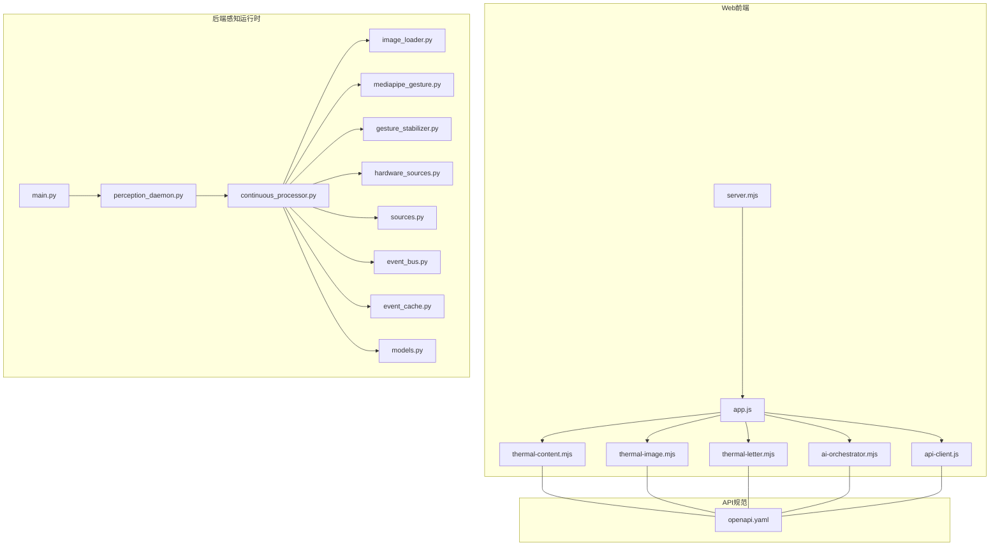
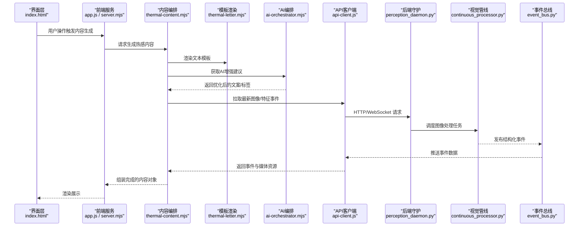
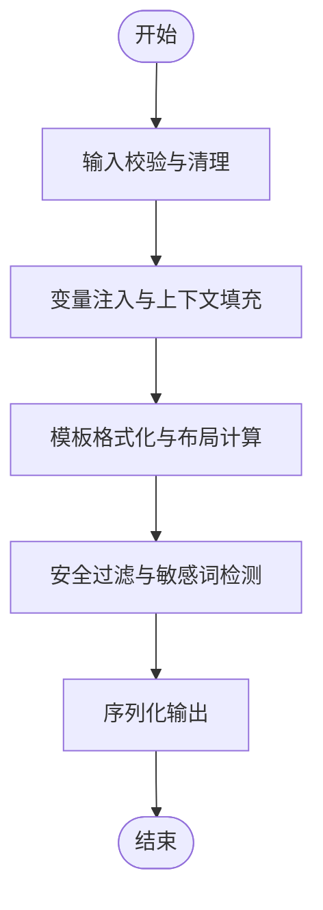
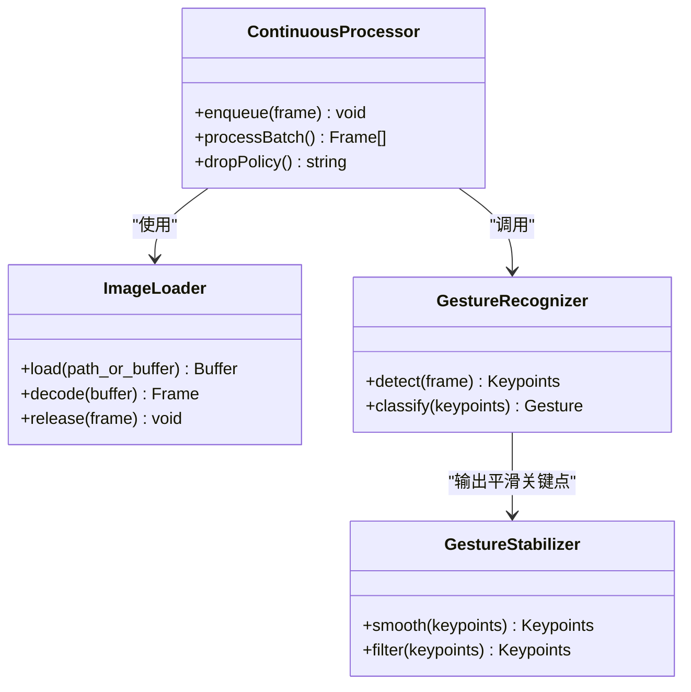
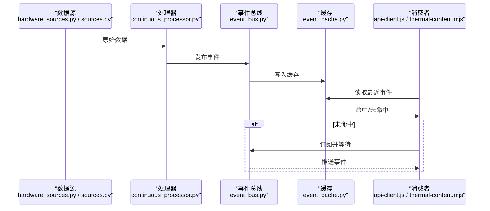
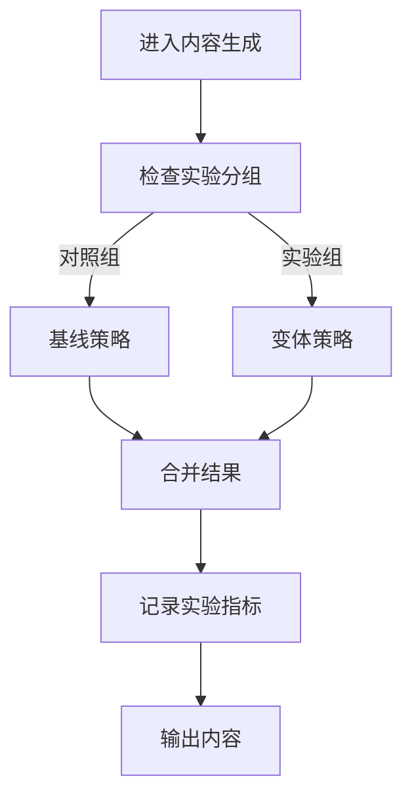
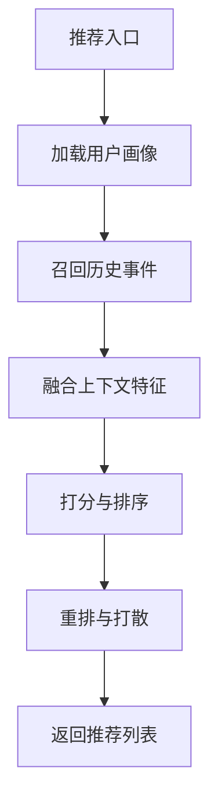
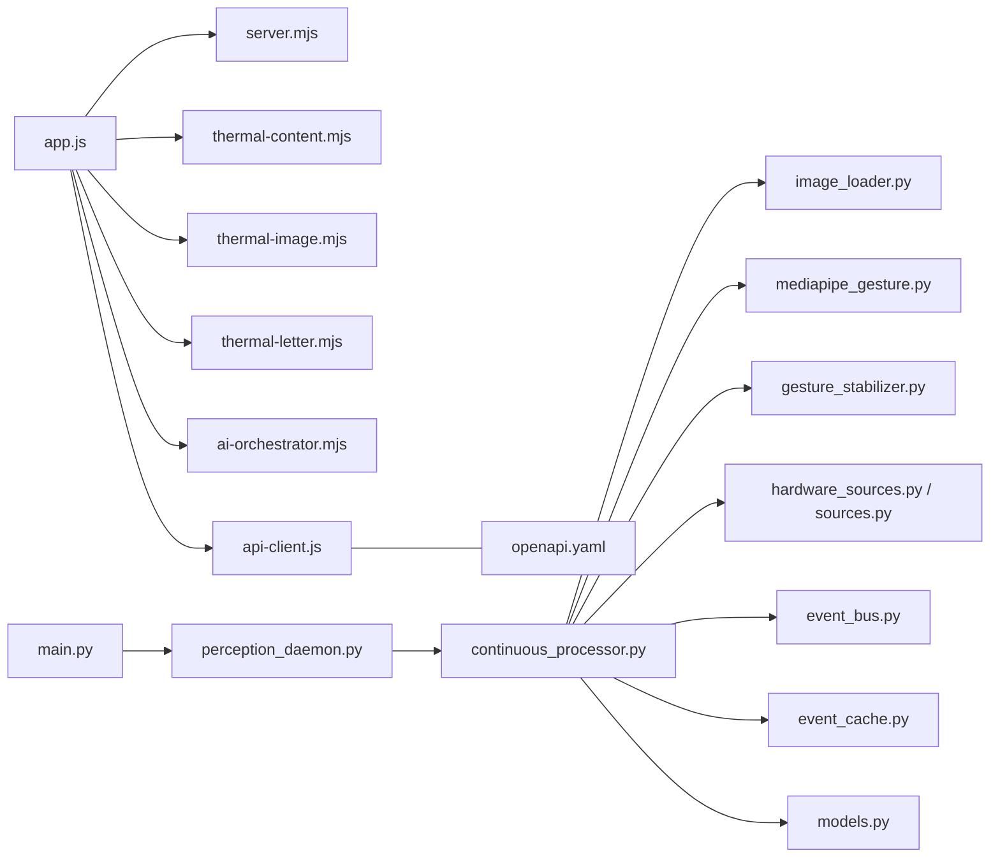

# 热感内容服务

<cite>
**本文引用的文件**   
- [thermal-content.mjs](file://apps/web/services/thermal-content.mjs)
- [thermal-image.mjs](file://apps/web/services/thermal-image.mjs)
- [thermal-letter.mjs](file://apps/web/services/thermal-letter.mjs)
- [ai-orchestrator.mjs](file://apps/web/services/ai-orchestrator.mjs)
- [api-client.js](file://apps/web/services/api-client.js)
- [server.mjs](file://apps/web/server.mjs)
- [app.js](file://apps/web/app.js)
- [index.html](file://apps/web/index.html)
- [config.yaml](file://config.yaml)
- [main.py](file://app/main.py)
- [perception_daemon.py](file://app/runtime/perception_daemon.py)
- [continuous_processor.py](file://app/vision/continuous_processor.py)
- [image_loader.py](file://app/vision/image_loader.py)
- [mediapipe_gesture.py](file://app/vision/mediapipe_gesture.py)
- [gesture_stabilizer.py](file://app/vision/gesture_stabilizer.py)
- [hardware_sources.py](file://app/transport/hardware_sources.py)
- [sources.py](file://app/transport/sources.py)
- [event_bus.py](file://app/events/event_bus.py)
- [event_cache.py](file://app/event_cache.py)
- [models.py](file://app/models.py)
- [openapi.yaml](file://AI_Hardware_Community_Project/09_API/openapi.yaml)
</cite>

## 目录
1. [简介](#简介)
2. [项目结构](#项目结构)
3. [核心组件](#核心组件)
4. [架构总览](#架构总览)
5. [详细组件分析](#详细组件分析)
6. [依赖关系分析](#依赖关系分析)
7. [性能与缓存策略](#性能与缓存策略)
8. [故障排查指南](#故障排查指南)
9. [结论](#结论)
10. [附录：使用示例与集成接口](#附录使用示例与集成接口)

## 简介
本文件面向“热感内容服务”，围绕内容生成引擎、图像处理管道、缓存与性能优化、版本控制与A/B测试、个性化推荐，以及跨端集成接口进行系统化说明。文档以仓库中Web前端服务与后端感知运行时为核心，结合API规范，提供从创建、处理到分发热感内容的完整路径与最佳实践。

## 项目结构
- Web前端服务（Node.js）
  - 服务入口与路由：server.mjs、app.js、index.html
  - 业务服务模块：thermal-content.mjs、thermal-image.mjs、thermal-letter.mjs、ai-orchestrator.mjs、api-client.js
- 后端感知运行时（Python）
  - 主程序与守护进程：main.py、runtime/perception_daemon.py
  - 视觉处理管线：vision/continuous_processor.py、vision/image_loader.py、vision/mediapipe_gesture.py、vision/gesture_stabilizer.py
  - 数据源与事件总线：transport/hardware_sources.py、transport/sources.py、events/event_bus.py、event_cache.py、models.py
- API规范
  - OpenAPI定义：AI_Hardware_Community_Project/09_API/openapi.yaml
- 配置
  - 全局配置：config.yaml

**图表来源** 
- [server.mjs](file://apps/web/server.mjs)
- [app.js](file://apps/web/app.js)
- [thermal-content.mjs](file://apps/web/services/thermal-content.mjs)
- [thermal-image.mjs](file://apps/web/services/thermal-image.mjs)
- [thermal-letter.mjs](file://apps/web/services/thermal-letter.mjs)
- [ai-orchestrator.mjs](file://apps/web/services/ai-orchestrator.mjs)
- [api-client.js](file://apps/web/services/api-client.js)
- [main.py](file://app/main.py)
- [perception_daemon.py](file://app/runtime/perception_daemon.py)
- [continuous_processor.py](file://app/vision/continuous_processor.py)
- [image_loader.py](file://app/vision/image_loader.py)
- [mediapipe_gesture.py](file://app/vision/mediapipe_gesture.py)
- [gesture_stabilizer.py](file://app/vision/gesture_stabilizer.py)
- [hardware_sources.py](file://app/transport/hardware_sources.py)
- [sources.py](file://app/transport/sources.py)
- [event_bus.py](file://app/events/event_bus.py)
- [event_cache.py](file://app/event_cache.py)
- [models.py](file://app/models.py)
- [openapi.yaml](file://AI_Hardware_Community_Project/09_API/openapi.yaml)

**章节来源**
- [server.mjs](file://apps/web/server.mjs)
- [app.js](file://apps/web/app.js)
- [index.html](file://apps/web/index.html)
- [config.yaml](file://config.yaml)
- [main.py](file://app/main.py)
- [perception_daemon.py](file://app/runtime/perception_daemon.py)
- [continuous_processor.py](file://app/vision/continuous_processor.py)
- [image_loader.py](file://app/vision/image_loader.py)
- [mediapipe_gesture.py](file://app/vision/mediapipe_gesture.py)
- [gesture_stabilizer.py](file://app/vision/gesture_stabilizer.py)
- [hardware_sources.py](file://app/transport/hardware_sources.py)
- [sources.py](file://app/transport/sources.py)
- [event_bus.py](file://app/events/event_bus.py)
- [event_cache.py](file://app/event_cache.py)
- [models.py](file://app/models.py)
- [openapi.yaml](file://AI_Hardware_Community_Project/09_API/openapi.yaml)

## 核心组件
- 内容生成引擎
  - 文本处理与模板渲染：由 thermal-letter.mjs 负责模板解析、变量注入与排版输出。
  - 内容编排：thermal-content.mjs 聚合文本、图像与元数据，形成最终的热感内容对象。
  - AI编排：ai-orchestrator.mjs 协调多模型调用与结果融合，支持A/B实验分流与回退策略。
- 图像处理管道
  - 图像加载与解码：image_loader.py 负责多格式加载与内存池管理。
  - 连续帧处理：continuous_processor.py 维护帧队列、去抖与批处理。
  - 手势识别与稳定：mediapipe_gesture.py 提取关键点，gesture_stabilizer.py 平滑轨迹并抑制抖动。
- 缓存与事件系统
  - 事件总线 event_bus.py 实现发布订阅，event_cache.py 提供短时缓存与过期策略。
  - 数据模型 models.py 统一事件与内容对象的字段定义。
- 传输与数据源
  - hardware_sources.py 与 sources.py 抽象硬件与模拟数据源，向上层提供统一接口。

**章节来源**
- [thermal-letter.mjs](file://apps/web/services/thermal-letter.mjs)
- [thermal-content.mjs](file://apps/web/services/thermal-content.mjs)
- [ai-orchestrator.mjs](file://apps/web/services/ai-orchestrator.mjs)
- [image_loader.py](file://app/vision/image_loader.py)
- [continuous_processor.py](file://app/vision/continuous_processor.py)
- [mediapipe_gesture.py](file://app/vision/mediapipe_gesture.py)
- [gesture_stabilizer.py](file://app/vision/gesture_stabilizer.py)
- [event_bus.py](file://app/events/event_bus.py)
- [event_cache.py](file://app/event_cache.py)
- [models.py](file://app/models.py)
- [hardware_sources.py](file://app/transport/hardware_sources.py)
- [sources.py](file://app/transport/sources.py)

## 架构总览
整体采用“前端编排 + 后端感知”的协作模式：
- 前端通过 api-client.js 调用后端能力，按 openapi.yaml 契约组织请求与响应。
- 后端感知守护进程持续拉取硬件或模拟数据源，经视觉处理管线产出结构化事件。
- 事件进入事件总线与缓存，供上层消费；内容生成引擎基于事件与模板生成热感内容。

**图表来源** 
- [index.html](file://apps/web/index.html)
- [app.js](file://apps/web/app.js)
- [server.mjs](file://apps/web/server.mjs)
- [thermal-content.mjs](file://apps/web/services/thermal-content.mjs)
- [thermal-letter.mjs](file://apps/web/services/thermal-letter.mjs)
- [ai-orchestrator.mjs](file://apps/web/services/ai-orchestrator.mjs)
- [api-client.js](file://apps/web/services/api-client.js)
- [perception_daemon.py](file://app/runtime/perception_daemon.py)
- [continuous_processor.py](file://app/vision/continuous_processor.py)
- [event_bus.py](file://app/events/event_bus.py)

## 详细组件分析

### 内容生成引擎
- 文本处理与模板渲染
  - 模板变量替换、条件分支与循环段落，支持多语言占位符与本地化键值映射。
  - 渲染流水线包含：输入校验 -> 变量注入 -> 格式化 -> 安全过滤 -> 输出序列化。
- 内容编排
  - 将文本、图像、元数据与上下文事件组合为统一内容对象，支持版本标记与实验分组。
  - 编排策略包括优先级排序、冲突合并与降级回退。
- AI编排
  - 协调多个AI子服务（如文案优化、标签生成、摘要），支持权重投票与置信度阈值。
  - 内置A/B测试分流：按用户ID或会话ID哈希选择实验组，记录曝光与转化指标。

**图表来源** 
- [thermal-letter.mjs](file://apps/web/services/thermal-letter.mjs)
- [thermal-content.mjs](file://apps/web/services/thermal-content.mjs)
- [ai-orchestrator.mjs](file://apps/web/services/ai-orchestrator.mjs)

**章节来源**
- [thermal-letter.mjs](file://apps/web/services/thermal-letter.mjs)
- [thermal-content.mjs](file://apps/web/services/thermal-content.mjs)
- [ai-orchestrator.mjs](file://apps/web/services/ai-orchestrator.mjs)

### 图像处理管道
- 图像加载与解码
  - 支持多种格式与尺寸，内部使用缓冲池减少GC压力，失败时自动重试与降级。
- 连续帧处理
  - 维护环形缓冲区与时间戳对齐，批量处理降低CPU峰值，丢帧策略保障实时性。
- 手势识别与稳定
  - 关键点检测后做轨迹平滑、噪声滤波与异常点剔除，输出稳定的手势状态机。
- 特征提取与增强
  - 提取亮度分布、边缘强度、色温等特征，用于内容主题匹配与视觉增强（对比度、锐化）。

**图表来源** 
- [image_loader.py](file://app/vision/image_loader.py)
- [continuous_processor.py](file://app/vision/continuous_processor.py)
- [mediapipe_gesture.py](file://app/vision/mediapipe_gesture.py)
- [gesture_stabilizer.py](file://app/vision/gesture_stabilizer.py)

**章节来源**
- [image_loader.py](file://app/vision/image_loader.py)
- [continuous_processor.py](file://app/vision/continuous_processor.py)
- [mediapipe_gesture.py](file://app/vision/mediapipe_gesture.py)
- [gesture_stabilizer.py](file://app/vision/gesture_stabilizer.py)

### 事件系统与缓存
- 事件总线
  - 发布/订阅模型，支持主题过滤、优先级与超时取消。
- 事件缓存
  - 基于时间窗口的LRU缓存，支持TTL与容量上限，避免重复计算与网络风暴。
- 数据模型
  - 统一事件结构与内容对象字段，确保前后端一致性与可演进性。

**图表来源** 
- [hardware_sources.py](file://app/transport/hardware_sources.py)
- [sources.py](file://app/transport/sources.py)
- [continuous_processor.py](file://app/vision/continuous_processor.py)
- [event_bus.py](file://app/events/event_bus.py)
- [event_cache.py](file://app/event_cache.py)
- [api-client.js](file://apps/web/services/api-client.js)
- [thermal-content.mjs](file://apps/web/services/thermal-content.mjs)

**章节来源**
- [event_bus.py](file://app/events/event_bus.py)
- [event_cache.py](file://app/event_cache.py)
- [models.py](file://app/models.py)
- [hardware_sources.py](file://app/transport/hardware_sources.py)
- [sources.py](file://app/transport/sources.py)

### 版本控制与A/B测试
- 版本控制
  - 内容对象携带版本号与变更摘要，支持灰度发布与快速回滚。
- A/B测试
  - 在AI编排层进行实验分流，记录曝光、点击与转化指标，支持在线切换与统计汇总。

**图表来源** 
- [ai-orchestrator.mjs](file://apps/web/services/ai-orchestrator.mjs)
- [thermal-content.mjs](file://apps/web/services/thermal-content.mjs)

**章节来源**
- [ai-orchestrator.mjs](file://apps/web/services/ai-orchestrator.mjs)
- [thermal-content.mjs](file://apps/web/services/thermal-content.mjs)

### 个性化推荐逻辑
- 基于用户画像与历史事件序列，计算兴趣相似度与衰减因子。
- 结合热点事件与上下文场景（时间、地点、设备状态）进行重排。
- 支持冷启动策略与多样性打散，避免信息茧房。

[该图为概念流程，不直接映射具体源码文件]

## 依赖关系分析
- 前端依赖
  - app.js 与 server.mjs 作为HTTP/WS服务入口，依赖各业务模块。
  - api-client.js 封装对外API调用，遵循 openapi.yaml 契约。
- 后端依赖
  - perception_daemon.py 驱动 continuous_processor.py，依赖 image_loader.py、mediapipe_gesture.py、gesture_stabilizer.py。
  - transport 层抽象硬件与模拟数据源，events 层提供事件总线与缓存。
- 外部依赖
  - OpenAPI 规范约束前后端交互，config.yaml 提供运行参数。

**图表来源** 
- [app.js](file://apps/web/app.js)
- [server.mjs](file://apps/web/server.mjs)
- [thermal-content.mjs](file://apps/web/services/thermal-content.mjs)
- [thermal-image.mjs](file://apps/web/services/thermal-image.mjs)
- [thermal-letter.mjs](file://apps/web/services/thermal-letter.mjs)
- [ai-orchestrator.mjs](file://apps/web/services/ai-orchestrator.mjs)
- [api-client.js](file://apps/web/services/api-client.js)
- [main.py](file://app/main.py)
- [perception_daemon.py](file://app/runtime/perception_daemon.py)
- [continuous_processor.py](file://app/vision/continuous_processor.py)
- [image_loader.py](file://app/vision/image_loader.py)
- [mediapipe_gesture.py](file://app/vision/mediapipe_gesture.py)
- [gesture_stabilizer.py](file://app/vision/gesture_stabilizer.py)
- [hardware_sources.py](file://app/transport/hardware_sources.py)
- [sources.py](file://app/transport/sources.py)
- [event_bus.py](file://app/events/event_bus.py)
- [event_cache.py](file://app/event_cache.py)
- [models.py](file://app/models.py)
- [openapi.yaml](file://AI_Hardware_Community_Project/09_API/openapi.yaml)

**章节来源**
- [app.js](file://apps/web/app.js)
- [server.mjs](file://apps/web/server.mjs)
- [api-client.js](file://apps/web/services/api-client.js)
- [openapi.yaml](file://AI_Hardware_Community_Project/09_API/openapi.yaml)
- [main.py](file://app/main.py)
- [perception_daemon.py](file://app/runtime/perception_daemon.py)
- [continuous_processor.py](file://app/vision/continuous_processor.py)
- [image_loader.py](file://app/vision/image_loader.py)
- [mediapipe_gesture.py](file://app/vision/mediapipe_gesture.py)
- [gesture_stabilizer.py](file://app/vision/gesture_stabilizer.py)
- [hardware_sources.py](file://app/transport/hardware_sources.py)
- [sources.py](file://app/transport/sources.py)
- [event_bus.py](file://app/events/event_bus.py)
- [event_cache.py](file://app/event_cache.py)
- [models.py](file://app/models.py)

## 性能与缓存策略
- 内存管理
  - 图像缓冲池复用，避免频繁分配与回收；大对象及时释放，防止内存泄漏。
  - 事件缓存设置容量上限与TTL，保证热点数据常驻，冷数据淘汰。
- 并发与吞吐
  - 连续帧批处理与异步I/O，降低锁竞争；关键路径无阻塞调用。
- 降级与容错
  - 模型调用失败时回退到规则策略；图像解码失败时跳过帧并告警。
- 监控与度量
  - 记录关键指标：延迟、吞吐、命中率、错误率，便于定位瓶颈。

[本节为通用指导，不直接分析具体文件]

## 故障排查指南
- 常见问题
  - 图像解码失败：检查输入格式与缓冲大小，确认解码器可用。
  - 事件丢失：检查事件总线订阅是否生效，缓存TTL是否过短。
  - AI调用超时：调整超时与重试策略，启用降级回退。
- 诊断步骤
  - 查看守护进程日志与事件流，定位异常节点。
  - 核对OpenAPI契约与请求参数，确保字段类型与必填项正确。
  - 逐步隔离问题：先验证数据源，再验证处理管线，最后验证内容生成。

**章节来源**
- [perception_daemon.py](file://app/runtime/perception_daemon.py)
- [continuous_processor.py](file://app/vision/continuous_processor.py)
- [event_bus.py](file://app/events/event_bus.py)
- [event_cache.py](file://app/event_cache.py)
- [openapi.yaml](file://AI_Hardware_Community_Project/09_API/openapi.yaml)

## 结论
热感内容服务以前端编排与后端感知协同为核心，构建了从数据采集、视觉处理到内容生成的完整链路。通过事件总线与缓存提升稳定性与性能，借助AI编排实现智能优化与A/B测试。遵循OpenAPI契约确保跨端一致性，配合完善的监控与降级策略，满足高可用与可扩展需求。

[本节为总结性内容，不直接分析具体文件]

## 附录：使用示例与集成接口
- 创建热感内容
  - 准备模板与变量，调用内容编排模块生成基础内容。
  - 拉取最新图像与事件，注入到内容对象中。
  - 通过AI编排进行文案优化与标签补充。
- 处理与分发
  - 将内容对象序列化并通过API客户端分发至前端或下游服务。
  - 根据用户偏好与上下文进行个性化重排。
- 集成接口
  - 参考 openapi.yaml 定义，确保请求方法与字段一致。
  - 使用 api-client.js 封装调用，处理成功与失败回调。

[本节为使用指引，不直接分析具体文件]