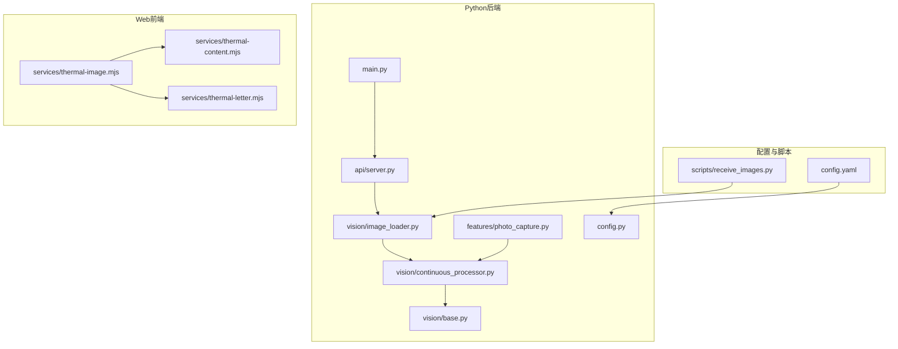
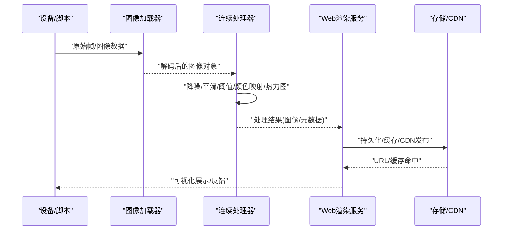
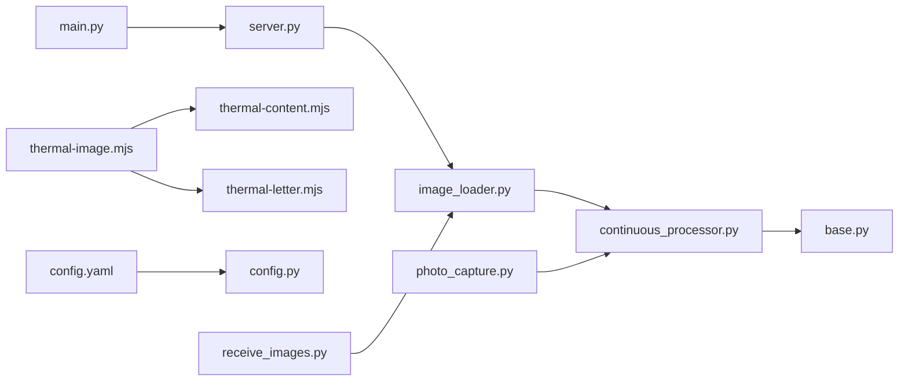
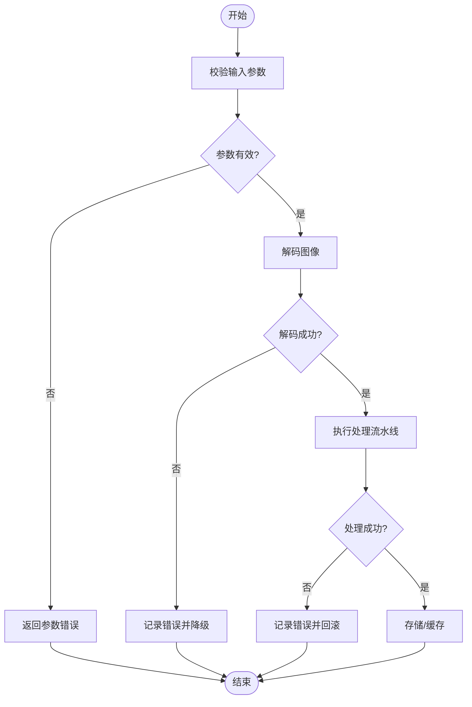

# 热感图像服务

<cite>
**本文引用的文件**   
- [app/vision/image_loader.py](file://app/vision/image_loader.py)
- [app/vision/continuous_processor.py](file://app/vision/continuous_processor.py)
- [app/vision/base.py](file://app/vision/base.py)
- [app/vision/__init__.py](file://app/vision/__init__.py)
- [app/features/photo_capture.py](file://app/features/photo_capture.py)
- [apps/web/services/thermal-image.mjs](file://apps/web/services/thermal-image.mjs)
- [apps/web/services/thermal-content.mjs](file://apps/web/services/thermal-content.mjs)
- [apps/web/services/thermal-letter.mjs](file://apps/web/services/thermal-letter.mjs)
- [config.yaml](file://config.yaml)
- [app/config.py](file://app/config.py)
- [app/main.py](file://app/main.py)
- [app/api/server.py](file://app/api/server.py)
- [scripts/receive_images.py](file://scripts/receive_images.py)
</cite>

## 目录
1. [简介](#简介)
2. [项目结构](#项目结构)
3. [核心组件](#核心组件)
4. [架构总览](#架构总览)
5. [详细组件分析](#详细组件分析)
6. [依赖关系分析](#依赖关系分析)
7. [性能考量](#性能考量)
8. [故障排查指南](#故障排查指南)
9. [结论](#结论)
10. [附录](#附录)

## 简介
本文件面向“热感图像服务”的技术文档，聚焦于图像处理算法实现、图像分析能力（颜色映射、热力图生成与特征识别）、存储策略与CDN集成、缓存机制、处理流水线设计（批量与异步队列）、API接口规范（上传、处理、下载），以及错误处理、日志记录与监控指标收集。内容基于仓库中的视觉处理模块、Web端热感图像服务脚本与配置进行系统化梳理，帮助读者快速理解并扩展该服务。

## 项目结构
本项目采用前后端分离的组织方式：
- Python后端提供视觉处理与流式处理能力，包含图像加载、连续处理、手势识别等模块。
- Web前端通过JavaScript服务封装热感图像的数据结构与渲染逻辑，并提供模拟与测试工具。
- 配置文件集中管理运行时参数，便于部署与环境切换。

图表来源
- [app/vision/image_loader.py](file://app/vision/image_loader.py)
- [app/vision/continuous_processor.py](file://app/vision/continuous_processor.py)
- [app/vision/base.py](file://app/vision/base.py)
- [app/features/photo_capture.py](file://app/features/photo_capture.py)
- [app/main.py](file://app/main.py)
- [app/api/server.py](file://app/api/server.py)
- [apps/web/services/thermal-image.mjs](file://apps/web/services/thermal-image.mjs)
- [apps/web/services/thermal-content.mjs](file://apps/web/services/thermal-content.mjs)
- [apps/web/services/thermal-letter.mjs](file://apps/web/services/thermal-letter.mjs)
- [config.yaml](file://config.yaml)
- [scripts/receive_images.py](file://scripts/receive_images.py)

章节来源
- [app/vision/image_loader.py](file://app/vision/image_loader.py)
- [app/vision/continuous_processor.py](file://app/vision/continuous_processor.py)
- [app/vision/base.py](file://app/vision/base.py)
- [app/features/photo_capture.py](file://app/features/photo_capture.py)
- [app/main.py](file://app/main.py)
- [app/api/server.py](file://app/api/server.py)
- [apps/web/services/thermal-image.mjs](file://apps/web/services/thermal-image.mjs)
- [apps/web/services/thermal-content.mjs](file://apps/web/services/thermal-content.mjs)
- [apps/web/services/thermal-letter.mjs](file://apps/web/services/thermal-letter.mjs)
- [config.yaml](file://config.yaml)
- [scripts/receive_images.py](file://scripts/receive_images.py)

## 核心组件
- 图像加载器：负责多格式图像读取与解码，支持常见热感图像格式，提供统一数据接口供后续处理使用。
- 连续处理器：对视频流或连续帧进行处理，包括降噪、平滑、阈值分割、颜色映射与热力图合成。
- 基础抽象：定义图像处理基类与通用接口，便于扩展新的处理算法与后端。
- 拍照特性：封装设备拍照流程，将原始帧转换为可处理的图像对象。
- Web热感服务：在浏览器端构建热感图像数据结构、内容渲染与字母可视化，用于演示与交互。

章节来源
- [app/vision/image_loader.py](file://app/vision/image_loader.py)
- [app/vision/continuous_processor.py](file://app/vision/continuous_processor.py)
- [app/vision/base.py](file://app/vision/base.py)
- [app/features/photo_capture.py](file://app/features/photo_capture.py)
- [apps/web/services/thermal-image.mjs](file://apps/web/services/thermal-image.mjs)
- [apps/web/services/thermal-content.mjs](file://apps/web/services/thermal-content.mjs)
- [apps/web/services/thermal-letter.mjs](file://apps/web/services/thermal-letter.mjs)

## 架构总览
系统由“采集—处理—渲染—存储/分发”四阶段构成：
- 采集：设备或脚本捕获原始热感图像帧。
- 处理：解码、格式转换、压缩优化、质量调整、颜色映射、热力图生成、特征识别。
- 渲染：前端根据处理结果生成可视化内容（热力图、字母映射等）。
- 存储与分发：本地或云端存储，结合CDN加速与缓存策略提升访问性能。

图表来源
- [app/vision/image_loader.py](file://app/vision/image_loader.py)
- [app/vision/continuous_processor.py](file://app/vision/continuous_processor.py)
- [apps/web/services/thermal-image.mjs](file://apps/web/services/thermal-image.mjs)
- [apps/web/services/thermal-content.mjs](file://apps/web/services/thermal-content.mjs)
- [apps/web/services/thermal-letter.mjs](file://apps/web/services/thermal-letter.mjs)

## 详细组件分析

### 图像加载器（image_loader）
- 职责：统一图像输入接口，支持多种格式解码，输出标准化图像对象。
- 关键点：
  - 格式转换：将不同编码的图像转为内部表示，便于后续处理。
  - 质量与压缩：提供质量参数控制，平衡体积与清晰度。
  - 错误处理：对损坏或不支持的格式进行异常捕获与降级。
- 复杂度：解码通常为O(N)，N为像素数量；压缩与重采样涉及额外开销。

章节来源
- [app/vision/image_loader.py](file://app/vision/image_loader.py)

### 连续处理器（continuous_processor）
- 职责：对连续帧执行实时处理，包括降噪、平滑、阈值分割、颜色映射与热力图合成。
- 关键点：
  - 流水线：按顺序应用多个处理步骤，支持参数化配置。
  - 性能：帧率优化、内存复用、避免重复计算。
  - 可扩展性：新增处理步骤需遵循基础接口。
- 复杂度：每帧处理时间取决于步骤数量与图像尺寸，建议限制分辨率与步数。

章节来源
- [app/vision/continuous_processor.py](file://app/vision/continuous_processor.py)

### 基础抽象（base）
- 职责：定义图像处理器的基类与通用方法，确保一致性与可替换性。
- 关键点：
  - 接口契约：统一的输入输出类型与错误约定。
  - 生命周期：初始化、处理、释放资源。
  - 扩展点：允许子类实现特定算法。

章节来源
- [app/vision/base.py](file://app/vision/base.py)

### 拍照特性（photo_capture）
- 职责：封装设备拍照流程，获取原始帧并转换为可用图像对象。
- 关键点：
  - 设备适配：兼容不同硬件或模拟源。
  - 事件驱动：与事件总线联动，触发后续处理。
  - 错误恢复：网络或设备异常时的重试与降级。

章节来源
- [app/features/photo_capture.py](file://app/features/photo_capture.py)

### Web热感图像服务（thermal-image / thermal-content / thermal-letter）
- 职责：在浏览器端构建热感图像数据结构、渲染内容与字母映射。
- 关键点：
  - 数据结构：温度值到颜色映射表、热力图矩阵。
  - 渲染：Canvas或SVG绘制热力图与字母可视化。
  - 交互：用户调节参数（如阈值、颜色方案）即时更新。

章节来源
- [apps/web/services/thermal-image.mjs](file://apps/web/services/thermal-image.mjs)
- [apps/web/services/thermal-content.mjs](file://apps/web/services/thermal-content.mjs)
- [apps/web/services/thermal-letter.mjs](file://apps/web/services/thermal-letter.mjs)

### 配置与入口（config / main / api）
- 配置：集中管理图像处理参数、存储路径、CDN设置等。
- 入口：应用启动、路由注册、中间件挂载。
- API：提供HTTP接口用于上传、处理、下载图像。

章节来源
- [config.yaml](file://config.yaml)
- [app/config.py](file://app/config.py)
- [app/main.py](file://app/main.py)
- [app/api/server.py](file://app/api/server.py)

### 接收脚本（receive_images）
- 职责：从设备或外部源接收图像数据，转发至处理流水线。
- 关键点：
  - 协议适配：支持多种传输协议（如HTTP、WebSocket）。
  - 批处理：聚合多帧后批量处理，提升吞吐。
  - 错误处理：丢包、超时与重试策略。

章节来源
- [scripts/receive_images.py](file://scripts/receive_images.py)

## 依赖关系分析
- 模块内聚：vision模块内各组件职责清晰，通过基类与接口解耦。
- 前后端协作：Web服务依赖后端提供的处理结果与资源URL。
- 配置驱动：运行时行为受配置文件影响，便于环境切换。
- 外部依赖：图像处理库、存储SDK、CDN客户端等。

图表来源
- [app/vision/image_loader.py](file://app/vision/image_loader.py)
- [app/vision/continuous_processor.py](file://app/vision/continuous_processor.py)
- [app/vision/base.py](file://app/vision/base.py)
- [app/features/photo_capture.py](file://app/features/photo_capture.py)
- [app/main.py](file://app/main.py)
- [app/api/server.py](file://app/api/server.py)
- [apps/web/services/thermal-image.mjs](file://apps/web/services/thermal-image.mjs)
- [apps/web/services/thermal-content.mjs](file://apps/web/services/thermal-content.mjs)
- [apps/web/services/thermal-letter.mjs](file://apps/web/services/thermal-letter.mjs)
- [config.yaml](file://config.yaml)
- [app/config.py](file://app/config.py)
- [scripts/receive_images.py](file://scripts/receive_images.py)

## 性能考量
- 解码与压缩：优先选择高效的编解码库，启用硬件加速（如GPU/CPU SIMD）。
- 流水线优化：减少不必要的拷贝与格式转换，复用缓冲区。
- 批处理与异步：使用队列与并发模型提升吞吐，避免阻塞主线程。
- 缓存策略：热点图像本地缓存，结合CDN边缘节点降低延迟。
- 质量与体积权衡：动态调整压缩质量与分辨率，满足带宽与清晰度需求。

[本节为通用指导，不直接分析具体文件]

## 故障排查指南
- 常见问题：
  - 图像解码失败：检查格式支持与损坏检测。
  - 处理超时：优化算法复杂度与资源配置。
  - CDN缓存未命中：验证缓存键与过期策略。
  - 前端渲染异常：确认数据结构与颜色映射表一致性。
- 日志与监控：
  - 关键路径打点：上传、处理、存储、下载的耗时与错误率。
  - 指标上报：QPS、延迟分布、内存占用、CPU利用率。
  - 告警规则：错误率阈值、延迟P99、资源耗尽。

章节来源
- [app/api/server.py](file://app/api/server.py)
- [app/main.py](file://app/main.py)
- [config.yaml](file://config.yaml)

## 结论
热感图像服务通过清晰的模块化设计与灵活的配置驱动，实现了从采集到渲染的完整流水线。结合批处理、异步队列与CDN缓存，可在高并发场景下保持稳定的性能与用户体验。建议在后续迭代中持续优化算法效率、完善错误恢复机制，并加强监控与可观测性建设。

[本节为总结性内容，不直接分析具体文件]

## 附录

### API接口规范（示例）
- 上传图像
  - 方法：POST
  - 路径：/api/images/upload
  - 请求体：multipart/form-data，字段image
  - 响应：{id, url}
- 处理图像
  - 方法：POST
  - 路径：/api/images/process
  - 请求体：{id, params: {quality, format, map}}
  - 响应：{result_url, metadata}
- 下载图像
  - 方法：GET
  - 路径：/api/images/{id}
  - 响应：二进制图像数据

[本节为概念性说明，不直接映射具体代码文件]

### 错误处理流程图

图表来源
- [app/api/server.py](file://app/api/server.py)
- [app/vision/image_loader.py](file://app/vision/image_loader.py)
- [app/vision/continuous_processor.py](file://app/vision/continuous_processor.py)