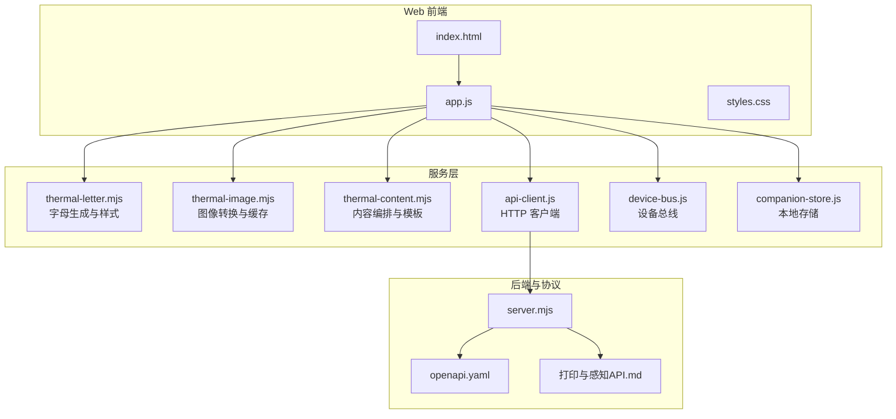
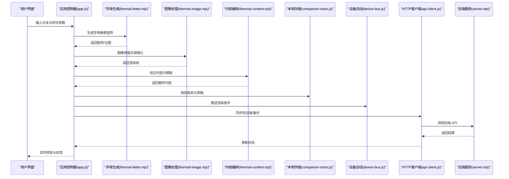
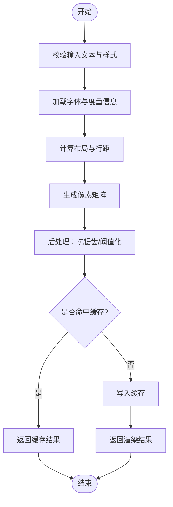
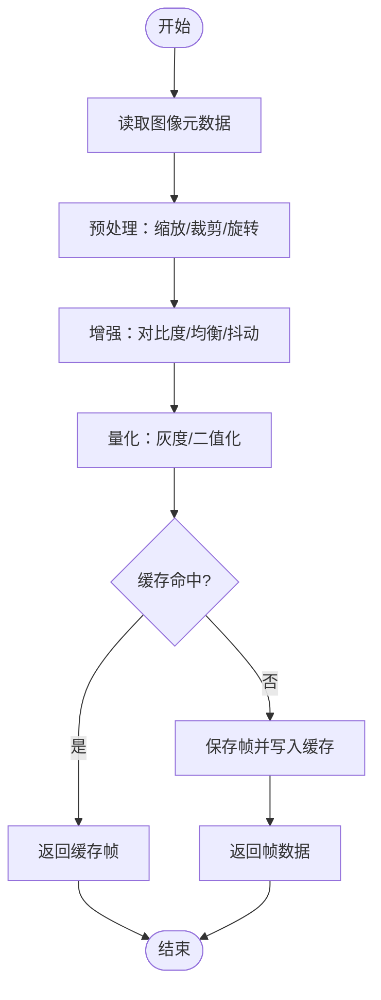
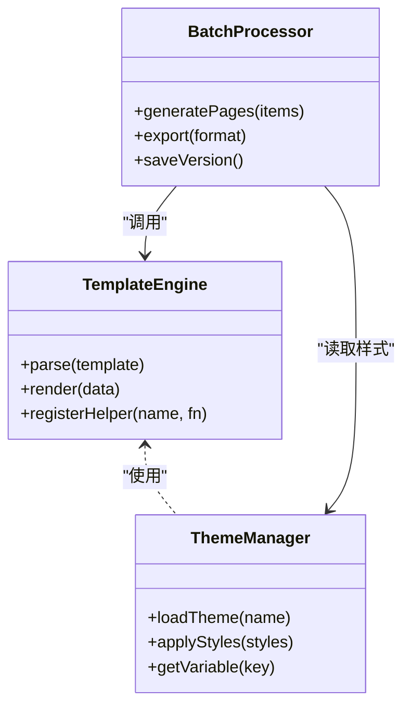
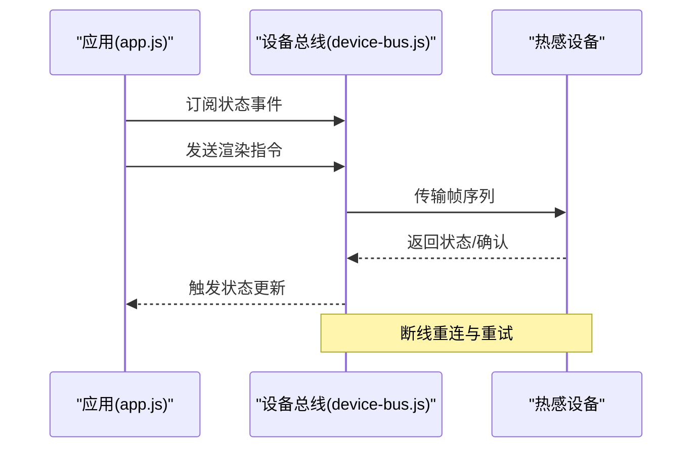
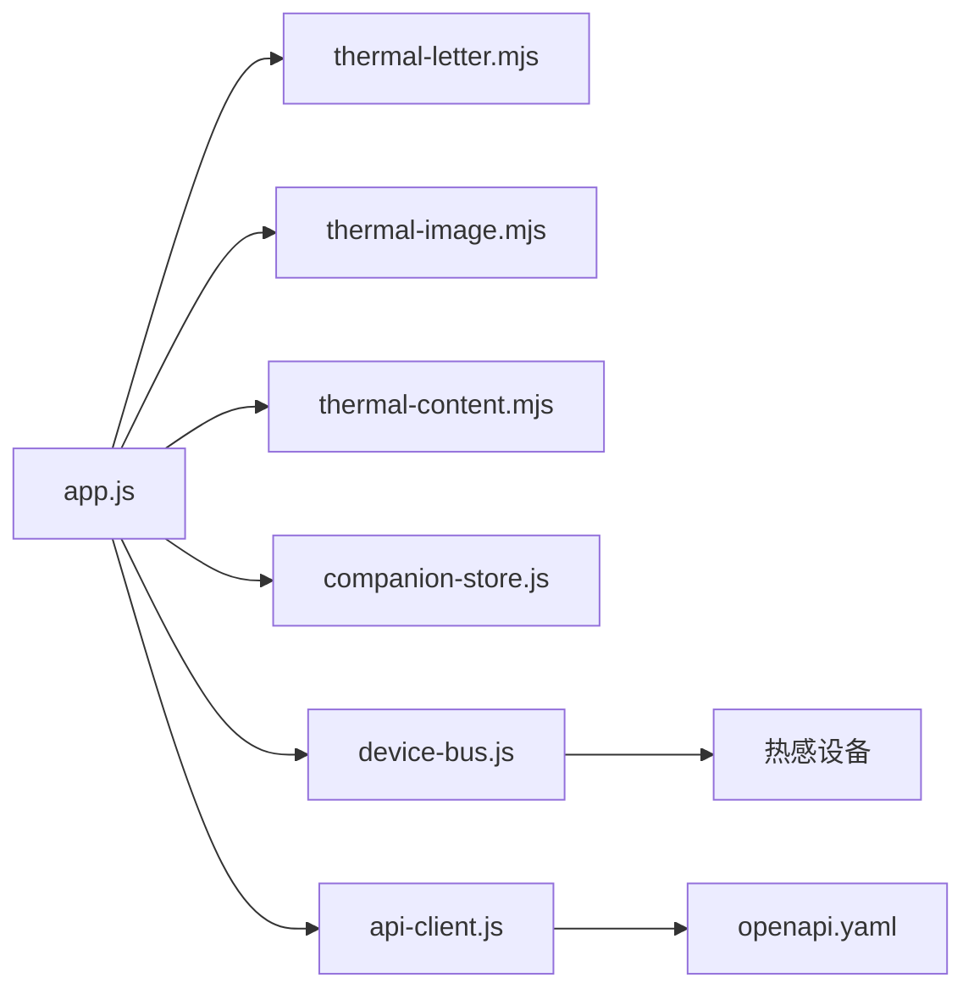

# 热感字母服务

<cite>
**本文引用的文件**   
- [thermal-letter.mjs](file://apps/web/services/thermal-letter.mjs)
- [thermal-image.mjs](file://apps/web/services/thermal-image.mjs)
- [thermal-content.mjs](file://apps/web/services/thermal-content.mjs)
- [index.html](file://apps/web/index.html)
- [app.js](file://apps/web/app.js)
- [styles.css](file://apps/web/styles.css)
- [server.mjs](file://apps/web/server.mjs)
- [api-client.js](file://apps/web/services/api-client.js)
- [device-bus.js](file://apps/web/services/device-bus.js)
- [companion-store.js](file://apps/web/services/companion-store.js)
- [openapi.yaml](file://AI_Hardware_Community_Project/09_API/openapi.yaml)
- [打印与感知API.md](file://AI_Hardware_Community_Project/09_API/打印与感知API.md)
- [系统架构设计.md](file://AI_Hardware_Community_Project/02_Architecture/系统架构设计.md)
</cite>

## 目录
1. [简介](#简介)
2. [项目结构](#项目结构)
3. [核心组件](#核心组件)
4. [架构总览](#架构总览)
5. [详细组件分析](#详细组件分析)
6. [依赖关系分析](#依赖关系分析)
7. [性能考量](#性能考量)
8. [故障排查指南](#故障排查指南)
9. [结论](#结论)
10. [附录](#附录)

## 简介
本文件面向“热感字母服务”的完整技术文档，覆盖以下目标：
- 字母生成算法实现：字体渲染、字符编码与排版优化
- 字母样式系统：主题切换、自定义字体与视觉效果
- 动画效果：字母动画、过渡动画与交互反馈
- 存储服务：版本管理与批量操作
- 使用示例：创建、编辑与导出热感字母
- 前端集成：实时预览与设备通信

该服务位于 Web 应用层（apps/web），通过服务模块组织字母生成、图像转换、内容编排与设备通信能力，并与后端 API 规范对齐。

## 项目结构
热感字母相关代码主要分布在 apps/web/services 下，包含字母生成、图像处理、内容编排等模块；UI 与交互由 index.html、app.js、styles.css 提供；服务端入口为 server.mjs；与后端 API 的契约由 openapi.yaml 和打印与感知API.md 定义。

图表来源
- [index.html](file://apps/web/index.html)
- [app.js](file://apps/web/app.js)
- [thermal-letter.mjs](file://apps/web/services/thermal-letter.mjs)
- [thermal-image.mjs](file://apps/web/services/thermal-image.mjs)
- [thermal-content.mjs](file://apps/web/services/thermal-content.mjs)
- [api-client.js](file://apps/web/services/api-client.js)
- [device-bus.js](file://apps/web/services/device-bus.js)
- [companion-store.js](file://apps/web/services/companion-store.js)
- [server.mjs](file://apps/web/server.mjs)
- [openapi.yaml](file://AI_Hardware_Community_Project/09_API/openapi.yaml)
- [打印与感知API.md](file://AI_Hardware_Community_Project/09_API/打印与感知API.md)

章节来源
- [系统架构设计.md](file://AI_Hardware_Community_Project/02_Architecture/系统架构设计.md)

## 核心组件
- 字母生成器（thermal-letter.mjs）
  - 负责将文本转换为热感图像所需的像素矩阵或位图数据
  - 支持多种字体与字号，处理字符编码（UTF-8）与字形度量
  - 提供排版优化：行距、字距、对齐方式、换行策略
  - 输出可被热感设备渲染的格式（灰度/二值化）
- 图像处理（thermal-image.mjs）
  - 负责图像缩放、裁剪、对比度增强、抖动与阈值化
  - 维护图像缓存以减少重复计算
  - 提供帧序列用于动画播放
- 内容编排（thermal-content.mjs）
  - 管理多页/多段内容布局，组合字母与图像元素
  - 支持模板与主题变量替换
  - 提供批量生成与导出接口
- 设备通信（device-bus.js）
  - 封装与硬件设备的消息通道，支持事件驱动
  - 提供发送渲染指令、查询状态、错误重试机制
- 本地存储（companion-store.js）
  - 持久化字母项目、版本历史与用户偏好
  - 支持导入/导出与冲突合并
- HTTP 客户端（api-client.js）
  - 统一封装对后端的请求，遵循 openapi.yaml 定义的接口
  - 提供鉴权、重试、超时与错误映射

章节来源
- [thermal-letter.mjs](file://apps/web/services/thermal-letter.mjs)
- [thermal-image.mjs](file://apps/web/services/thermal-image.mjs)
- [thermal-content.mjs](file://apps/web/services/thermal-content.mjs)
- [device-bus.js](file://apps/web/services/device-bus.js)
- [companion-store.js](file://apps/web/services/companion-store.js)
- [api-client.js](file://apps/web/services/api-client.js)

## 架构总览
热感字母服务采用分层架构：UI 层调用服务层进行字母生成与图像转换，服务层通过设备总线与本地存储完成交互，并通过 HTTP 客户端与后端 API 同步。整体流程如下：

图表来源
- [app.js](file://apps/web/app.js)
- [thermal-letter.mjs](file://apps/web/services/thermal-letter.mjs)
- [thermal-image.mjs](file://apps/web/services/thermal-image.mjs)
- [thermal-content.mjs](file://apps/web/services/thermal-content.mjs)
- [companion-store.js](file://apps/web/services/companion-store.js)
- [device-bus.js](file://apps/web/services/device-bus.js)
- [api-client.js](file://apps/web/services/api-client.js)
- [server.mjs](file://apps/web/server.mjs)

## 详细组件分析

### 字母生成器（thermal-letter.mjs）
- 功能要点
  - 字符编码处理：确保 UTF-8 输入正确解析，处理多语言字符集
  - 字体渲染：加载字体资源，计算字形边界框与基线，支持粗体/斜体变体
  - 排版优化：自动换行、行高调整、字距微调、居中对齐、两端对齐
  - 输出格式：灰度矩阵或二值位图，适配热感设备分辨率
- 关键流程
  - 输入校验与预处理
  - 字体度量与布局计算
  - 像素矩阵生成与后处理（抗锯齿、阈值化）
  - 缓存命中与增量更新

图表来源
- [thermal-letter.mjs](file://apps/web/services/thermal-letter.mjs)

章节来源
- [thermal-letter.mjs](file://apps/web/services/thermal-letter.mjs)

### 图像处理（thermal-image.mjs）
- 功能要点
  - 图像预处理：缩放、裁剪、旋转、色彩空间转换
  - 增强与量化：对比度拉伸、直方图均衡、抖动算法
  - 帧序列：支持 GIF/视频帧提取与顺序播放
  - 缓存策略：基于内容的哈希键，避免重复计算
- 关键流程
  - 输入图像校验与元数据读取
  - 预处理管线执行
  - 量化与阈值化
  - 缓存与回退逻辑

图表来源
- [thermal-image.mjs](file://apps/web/services/thermal-image.mjs)

章节来源
- [thermal-image.mjs](file://apps/web/services/thermal-image.mjs)

### 内容编排（thermal-content.mjs）
- 功能要点
  - 模板引擎：支持变量替换、条件渲染、循环段落
  - 主题系统：颜色、字体、边距、阴影等样式变量
  - 批量操作：多页生成、分页控制、导出格式选择
- 关键流程
  - 模板解析与变量注入
  - 页面布局与元素组合
  - 导出与版本记录

图表来源
- [thermal-content.mjs](file://apps/web/services/thermal-content.mjs)

章节来源
- [thermal-content.mjs](file://apps/web/services/thermal-content.mjs)

### 设备通信（device-bus.js）
- 功能要点
  - 事件总线：订阅/发布渲染指令、状态变更、错误事件
  - 连接管理：重连、心跳、超时处理
  - 指令队列：有序发送、失败重试、降级策略
- 关键流程
  - 建立连接与认证
  - 发送渲染帧序列
  - 接收设备状态与反馈

图表来源
- [device-bus.js](file://apps/web/services/device-bus.js)

章节来源
- [device-bus.js](file://apps/web/services/device-bus.js)

### 本地存储（companion-store.js）
- 功能要点
  - 项目持久化：保存字母项目、样式、版本历史
  - 导入/导出：JSON/ZIP 格式，支持迁移
  - 冲突解决：时间戳与差异合并
- 关键流程
  - 读写操作封装
  - 版本快照与回滚
  - 清理与压缩

章节来源
- [companion-store.js](file://apps/web/services/companion-store.js)

### HTTP 客户端（api-client.js）
- 功能要点
  - 接口封装：遵循 openapi.yaml 定义的路径、方法、参数
  - 鉴权与令牌刷新
  - 错误映射与重试策略
- 关键流程
  - 构建请求与序列化
  - 发送与响应处理
  - 错误捕获与上报

章节来源
- [api-client.js](file://apps/web/services/api-client.js)
- [openapi.yaml](file://AI_Hardware_Community_Project/09_API/openapi.yaml)

## 依赖关系分析
- 组件耦合
  - app.js 作为协调者，依赖 letter/image/content 服务，以及 device-bus、store、api-client
  - thermal-letter.mjs 依赖字体资源与度量库
  - thermal-image.mjs 依赖图像处理库与缓存
  - thermal-content.mjs 依赖模板引擎与主题管理器
- 外部依赖
  - 后端 API：通过 api-client.js 调用，遵循 openapi.yaml
  - 设备通信：通过 device-bus.js 抽象，屏蔽底层协议差异

图表来源
- [app.js](file://apps/web/app.js)
- [thermal-letter.mjs](file://apps/web/services/thermal-letter.mjs)
- [thermal-image.mjs](file://apps/web/services/thermal-image.mjs)
- [thermal-content.mjs](file://apps/web/services/thermal-content.mjs)
- [companion-store.js](file://apps/web/services/companion-store.js)
- [device-bus.js](file://apps/web/services/device-bus.js)
- [api-client.js](file://apps/web/services/api-client.js)
- [openapi.yaml](file://AI_Hardware_Community_Project/09_API/openapi.yaml)

章节来源
- [系统架构设计.md](file://AI_Hardware_Community_Project/02_Architecture/系统架构设计.md)

## 性能考量
- 渲染性能
  - 字体度量与布局计算应缓存，避免重复解析
  - 图像预处理采用流水线并行，减少主线程阻塞
  - 阈值化与抖动算法需平衡质量与速度
- 内存管理
  - 大图像分块处理，避免一次性加载
  - 缓存键基于内容哈希，及时释放无用帧
- 网络与设备
  - 批量导出时采用流式传输，降低峰值内存
  - 设备通信增加背压与限流，防止拥塞

[本节为通用指导，不直接分析具体文件]

## 故障排查指南
- 常见问题
  - 字体加载失败：检查字体路径与权限，确认编码正确
  - 图像失真：调整阈值与抖动参数，验证输入分辨率
  - 设备无响应：检查连接状态与心跳，查看错误日志
  - 版本冲突：比较时间戳与差异，手动合并或回滚
- 调试建议
  - 启用详细日志，记录关键步骤输入输出
  - 使用模拟器验证渲染效果，再下发至设备
  - 隔离问题模块，逐步定位根因

章节来源
- [打印与感知API.md](file://AI_Hardware_Community_Project/09_API/打印与感知API.md)

## 结论
热感字母服务通过清晰的分层与模块化设计，实现了从文本到热感图像的完整链路。字母生成、图像处理、内容编排、设备通信与本地存储各司其职，配合统一的 API 契约与主题系统，提供了可扩展、高性能且易用的解决方案。建议在生产环境中加强监控与错误上报，持续优化渲染性能与用户体验。

[本节为总结性内容，不直接分析具体文件]

## 附录
- 使用示例
  - 创建字母：在 UI 中输入文本，选择字体与样式，点击生成
  - 编辑字母：修改文本或样式，实时预览更新
  - 导出字母：选择导出格式（PNG/SVG/设备二进制），批量下载
  - 同步与备份：通过 API 客户端上传至云端，恢复历史版本
- 实时预览
  - 前端监听设备状态事件，动态更新预览画面
  - 支持缩放、滚动与逐帧播放
- 主题与样式
  - 内置主题：浅色/深色/高对比度
  - 自定义字体：上传字体文件，注册到主题管理器
  - 视觉效果：阴影、描边、渐变（受设备能力限制）

[本节为概念性说明，不直接分析具体文件]