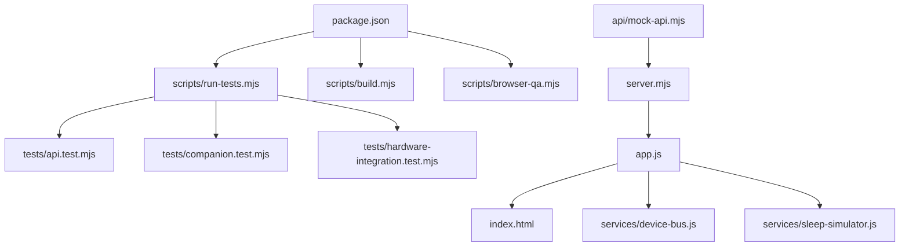
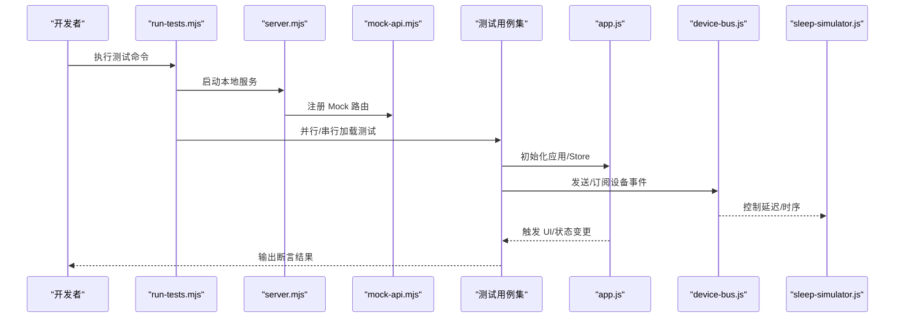
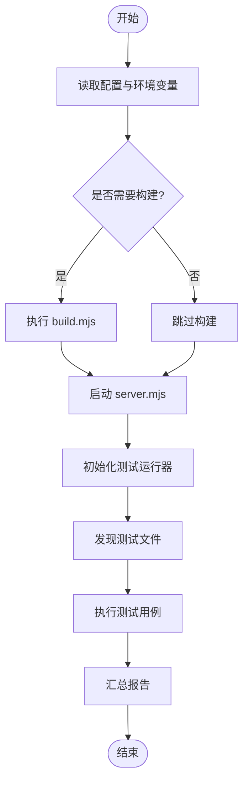
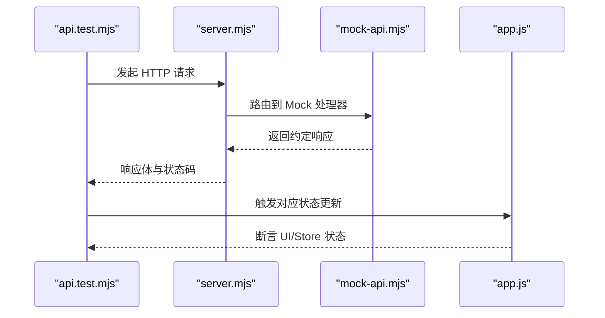
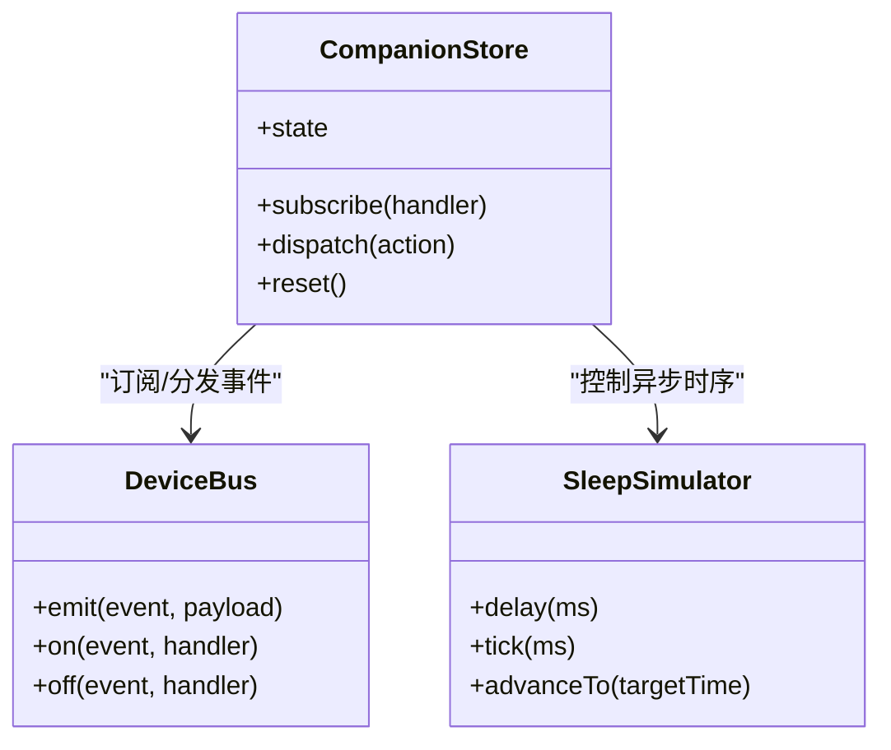
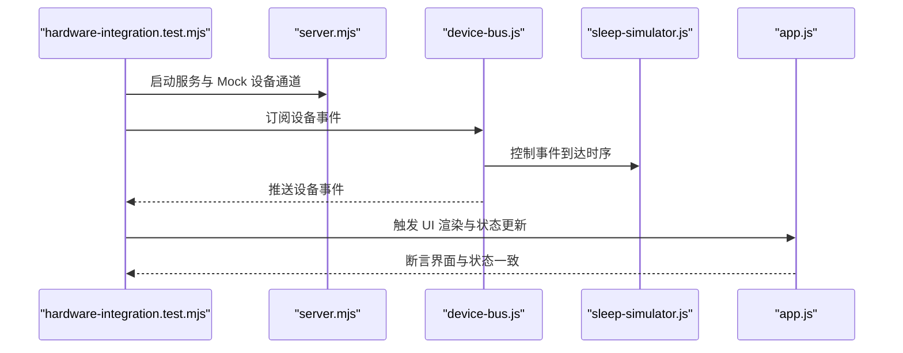
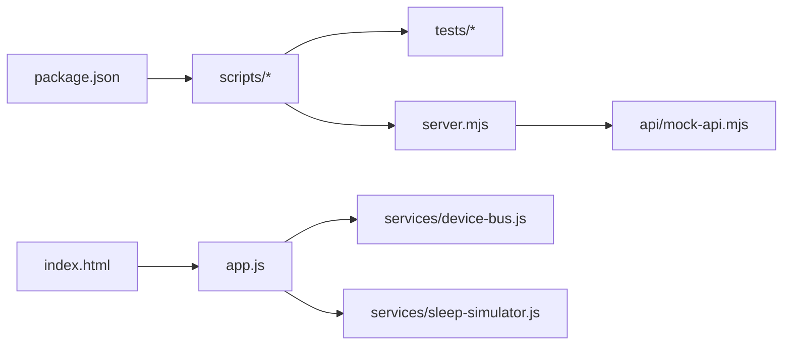

# 测试与调试

<cite>
**本文引用的文件**   
- [package.json](file://package.json)
- [apps/web/README.md](file://apps/web/README.md)
- [apps/web/scripts/run-tests.mjs](file://apps/web/scripts/run-tests.mjs)
- [apps/web/scripts/build.mjs](file://apps/web/scripts/build.mjs)
- [apps/web/scripts/browser-qa.mjs](file://apps/web/scripts/browser-qa.mjs)
- [apps/web/tests/api.test.mjs](file://apps/web/tests/api.test.mjs)
- [apps/web/tests/companion.test.mjs](file://apps/web/tests/companion.test.mjs)
- [apps/web/tests/hardware-integration.test.mjs](file://apps/web/tests/hardware-integration.test.mjs)
- [apps/web/api/mock-api.mjs](file://apps/web/api/mock-api.mjs)
- [apps/web/services/device-bus.js](file://apps/web/services/device-bus.js)
- [apps/web/services/sleep-simulator.js](file://apps/web/services/sleep-simulator.js)
- [apps/web/server.mjs](file://apps/web/server.mjs)
- [apps/web/app.js](file://apps/web/app.js)
- [apps/web/index.html](file://apps/web/index.html)
- [pytest.ini](file://pytest.ini)
- [tests/test_config.py](file://tests/test_config.py)
- [tests/test_perception_runtime.py](file://tests/test_perception_runtime.py)
- [tests/test_vad_stream.py](file://tests/test_vad_stream.py)
</cite>

## 目录
1. [简介](#简介)
2. [项目结构](#项目结构)
3. [核心组件](#核心组件)
4. [架构总览](#架构总览)
5. [详细组件分析](#详细组件分析)
6. [依赖分析](#依赖分析)
7. [性能考虑](#性能考虑)
8. [故障排查指南](#故障排查指南)
9. [结论](#结论)
10. [附录](#附录)

## 简介
本文件面向前端应用（位于 apps/web）的测试与调试，覆盖单元测试框架使用、API 测试、状态测试、硬件集成测试、测试脚本执行流程与自动化配置，以及浏览器开发者工具的高级用法（网络监控、性能分析、内存泄漏检测）。同时包含 Mock 数据生成、测试环境搭建与持续集成建议，并提供常见问题排查方法与性能优化建议。文档力求对非专业读者友好，通过分层说明与图示帮助快速上手。

## 项目结构
前端测试相关的关键位置：
- 测试用例：apps/web/tests/*.mjs
- 测试与构建脚本：apps/web/scripts/*.mjs
- Mock API：apps/web/api/mock-api.mjs
- Web 服务与入口：apps/web/server.mjs, apps/web/app.js, apps/web/index.html
- 设备总线与模拟器：apps/web/services/device-bus.js, apps/web/services/sleep-simulator.js
- 包管理与依赖：package.json

图表来源
- [package.json](file://package.json)
- [apps/web/scripts/run-tests.mjs](file://apps/web/scripts/run-tests.mjs)
- [apps/web/scripts/build.mjs](file://apps/web/scripts/build.mjs)
- [apps/web/scripts/browser-qa.mjs](file://apps/web/scripts/browser-qa.mjs)
- [apps/web/tests/api.test.mjs](file://apps/web/tests/api.test.mjs)
- [apps/web/tests/companion.test.mjs](file://apps/web/tests/companion.test.mjs)
- [apps/web/tests/hardware-integration.test.mjs](file://apps/web/tests/hardware-integration.test.mjs)
- [apps/web/api/mock-api.mjs](file://apps/web/api/mock-api.mjs)
- [apps/web/server.mjs](file://apps/web/server.mjs)
- [apps/web/app.js](file://apps/web/app.js)
- [apps/web/index.html](file://apps/web/index.html)
- [apps/web/services/device-bus.js](file://apps/web/services/device-bus.js)
- [apps/web/services/sleep-simulator.js](file://apps/web/services/sleep-simulator.js)

章节来源
- [apps/web/README.md](file://apps/web/README.md)
- [package.json](file://package.json)

## 核心组件
- 测试运行器与脚本
  - run-tests.mjs：统一触发测试套件，串联 API、状态与硬件集成测试。
  - build.mjs：构建产物与资源准备，供测试或 QA 使用。
  - browser-qa.mjs：在真实浏览器中执行质量检查（如 PWA、兼容性、交互）。
- 测试用例
  - api.test.mjs：针对后端接口契约与错误路径的断言。
  - companion.test.mjs：围绕 Companion Store 的状态流转与事件一致性。
  - hardware-integration.test.mjs：基于 DeviceBus 与模拟器的端到端场景。
- Mock 与模拟
  - mock-api.mjs：提供稳定的 API 响应与异常注入，用于隔离外部依赖。
  - sleep-simulator.js：时间/延迟模拟，稳定异步时序。
  - device-bus.js：设备通信抽象，便于替换为 Mock 实现进行单测。
- 服务与入口
  - server.mjs：本地开发服务器，挂载 Mock API 与静态资源。
  - app.js：前端主逻辑，订阅设备事件并驱动 UI。
  - index.html：页面入口，加载应用与调试面板。

章节来源
- [apps/web/scripts/run-tests.mjs](file://apps/web/scripts/run-tests.mjs)
- [apps/web/scripts/build.mjs](file://apps/web/scripts/build.mjs)
- [apps/web/scripts/browser-qa.mjs](file://apps/web/scripts/browser-qa.mjs)
- [apps/web/tests/api.test.mjs](file://apps/web/tests/api.test.mjs)
- [apps/web/tests/companion.test.mjs](file://apps/web/tests/companion.test.mjs)
- [apps/web/tests/hardware-integration.test.mjs](file://apps/web/tests/hardware-integration.test.mjs)
- [apps/web/api/mock-api.mjs](file://apps/web/api/mock-api.mjs)
- [apps/web/services/device-bus.js](file://apps/web/services/device-bus.js)
- [apps/web/services/sleep-simulator.js](file://apps/web/services/sleep-simulator.js)
- [apps/web/server.mjs](file://apps/web/server.mjs)
- [apps/web/app.js](file://apps/web/app.js)
- [apps/web/index.html](file://apps/web/index.html)

## 架构总览
前端测试与调试的整体流程如下：测试脚本启动本地服务（含 Mock API），加载页面或 Node 环境下的模块，驱动业务逻辑并通过断言验证结果；对于需要浏览器的场景，QA 脚本会打开真实浏览器执行交互与稳定性检查。

图表来源
- [apps/web/scripts/run-tests.mjs](file://apps/web/scripts/run-tests.mjs)
- [apps/web/server.mjs](file://apps/web/server.mjs)
- [apps/web/api/mock-api.mjs](file://apps/web/api/mock-api.mjs)
- [apps/web/tests/api.test.mjs](file://apps/web/tests/api.test.mjs)
- [apps/web/tests/companion.test.mjs](file://apps/web/tests/companion.test.mjs)
- [apps/web/tests/hardware-integration.test.mjs](file://apps/web/tests/hardware-integration.test.mjs)
- [apps/web/app.js](file://apps/web/app.js)
- [apps/web/services/device-bus.js](file://apps/web/services/device-bus.js)
- [apps/web/services/sleep-simulator.js](file://apps/web/services/sleep-simulator.js)

## 详细组件分析

### 测试运行与脚本
- run-tests.mjs
  - 负责发现并执行 tests 目录下的所有测试文件。
  - 支持并行/串行模式，可注入环境变量以切换 Mock/真实后端。
  - 聚合测试结果并输出报告，便于 CI 解析。
- build.mjs
  - 构建静态资源、打包产物与依赖校验。
  - 为测试与 QA 提供一致的产物基线。
- browser-qa.mjs
  - 在真实浏览器中运行交互性检查，如页面加载、PWA 安装提示、WebSocket 连接等。
  - 可结合截图与日志辅助定位问题。

图表来源
- [apps/web/scripts/run-tests.mjs](file://apps/web/scripts/run-tests.mjs)
- [apps/web/scripts/build.mjs](file://apps/web/scripts/build.mjs)
- [apps/web/server.mjs](file://apps/web/server.mjs)

章节来源
- [apps/web/scripts/run-tests.mjs](file://apps/web/scripts/run-tests.mjs)
- [apps/web/scripts/build.mjs](file://apps/web/scripts/build.mjs)
- [apps/web/scripts/browser-qa.mjs](file://apps/web/scripts/browser-qa.mjs)

### API 测试
- 目标
  - 验证接口契约（请求/响应结构、状态码、错误分支）。
  - 确保 Mock 数据覆盖边界条件（空值、超长、非法类型）。
- 关键实践
  - 使用 mock-api.mjs 提供稳定响应与可控错误注入。
  - 对并发请求、超时与重试策略进行断言。
  - 将 API 行为与前端状态变化解耦，聚焦契约正确性。

图表来源
- [apps/web/tests/api.test.mjs](file://apps/web/tests/api.test.mjs)
- [apps/web/server.mjs](file://apps/web/server.mjs)
- [apps/web/api/mock-api.mjs](file://apps/web/api/mock-api.mjs)
- [apps/web/app.js](file://apps/web/app.js)

章节来源
- [apps/web/tests/api.test.mjs](file://apps/web/tests/api.test.mjs)
- [apps/web/api/mock-api.mjs](file://apps/web/api/mock-api.mjs)

### 状态测试（Companion Store）
- 目标
  - 验证 Store 的状态机转换、事件订阅与副作用顺序。
  - 确保异步操作（如网络、I/O）不会导致竞态条件。
- 关键实践
  - 使用 sleep-simulator.js 精确控制时间推进，避免真实等待。
  - 通过 device-bus.js 注入事件，验证状态收敛与幂等性。
  - 对中间态快照进行断言，保证可观测性。

图表来源
- [apps/web/tests/companion.test.mjs](file://apps/web/tests/companion.test.mjs)
- [apps/web/services/device-bus.js](file://apps/web/services/device-bus.js)
- [apps/web/services/sleep-simulator.js](file://apps/web/services/sleep-simulator.js)

章节来源
- [apps/web/tests/companion.test.mjs](file://apps/web/tests/companion.test.mjs)
- [apps/web/services/device-bus.js](file://apps/web/services/device-bus.js)
- [apps/web/services/sleep-simulator.js](file://apps/web/services/sleep-simulator.js)

### 硬件集成测试
- 目标
  - 在接近真实环境的条件下，验证设备通信、事件流与 UI 联动。
  - 覆盖连接建立、消息丢失重连、异常恢复等场景。
- 关键实践
  - 使用 device-bus.js 作为设备抽象层，替换为 Mock 实现以稳定测试。
  - 借助 sleep-simulator.js 模拟网络抖动与设备延迟。
  - 通过 server.mjs 与 mock-api.mjs 模拟后端与设备网关。

图表来源
- [apps/web/tests/hardware-integration.test.mjs](file://apps/web/tests/hardware-integration.test.mjs)
- [apps/web/server.mjs](file://apps/web/server.mjs)
- [apps/web/services/device-bus.js](file://apps/web/services/device-bus.js)
- [apps/web/services/sleep-simulator.js](file://apps/web/services/sleep-simulator.js)
- [apps/web/app.js](file://apps/web/app.js)

章节来源
- [apps/web/tests/hardware-integration.test.mjs](file://apps/web/tests/hardware-integration.test.mjs)
- [apps/web/services/device-bus.js](file://apps/web/services/device-bus.js)
- [apps/web/services/sleep-simulator.js](file://apps/web/services/sleep-simulator.js)

### Mock 数据生成与测试环境搭建
- Mock API
  - 集中管理接口契约与示例数据，支持按参数返回不同响应。
  - 可注入错误码、延迟与随机抖动，提升测试鲁棒性。
- 测试环境
  - 通过 server.mjs 启动轻量服务，挂载静态资源与 Mock 路由。
  - 使用环境变量切换 Mock/真实后端，便于回归与联调。
- 页面入口
  - index.html 提供调试面板与日志开关，方便手动复现问题。

章节来源
- [apps/web/api/mock-api.mjs](file://apps/web/api/mock-api.mjs)
- [apps/web/server.mjs](file://apps/web/server.mjs)
- [apps/web/index.html](file://apps/web/index.html)

### 持续集成配置建议
- 推荐步骤
  - 安装依赖后执行构建（build.mjs），确保产物一致。
  - 运行 run-tests.mjs 执行全部测试，收集覆盖率与报告。
  - 可选：运行 browser-qa.mjs 进行浏览器端质量检查。
  - 上传测试报告与产物，设置失败阈值阻断合并。
- 注意事项
  - 固定 Node 版本与缓存依赖，提高稳定性。
  - 并行执行测试时注意端口冲突与资源竞争。
  - 对耗时较长的集成测试单独分组，缩短反馈周期。

章节来源
- [package.json](file://package.json)
- [apps/web/scripts/build.mjs](file://apps/web/scripts/build.mjs)
- [apps/web/scripts/run-tests.mjs](file://apps/web/scripts/run-tests.mjs)
- [apps/web/scripts/browser-qa.mjs](file://apps/web/scripts/browser-qa.mjs)

## 依赖分析
- 前端测试依赖
  - 测试运行器与断言库由 package.json 管理，确保版本锁定。
  - 测试脚本依赖 server.mjs 提供的本地服务与 mock-api.mjs 的接口契约。
- 运行时依赖
  - app.js 依赖 device-bus.js 进行事件通信，依赖 sleep-simulator.js 控制时序。
  - index.html 作为页面入口，加载应用与调试工具。

图表来源
- [package.json](file://package.json)
- [apps/web/scripts/run-tests.mjs](file://apps/web/scripts/run-tests.mjs)
- [apps/web/server.mjs](file://apps/web/server.mjs)
- [apps/web/api/mock-api.mjs](file://apps/web/api/mock-api.mjs)
- [apps/web/app.js](file://apps/web/app.js)
- [apps/web/services/device-bus.js](file://apps/web/services/device-bus.js)
- [apps/web/services/sleep-simulator.js](file://apps/web/services/sleep-simulator.js)
- [apps/web/index.html](file://apps/web/index.html)

章节来源
- [package.json](file://package.json)
- [apps/web/server.mjs](file://apps/web/server.mjs)
- [apps/web/app.js](file://apps/web/app.js)

## 性能考虑
- 测试性能
  - 合理拆分测试套件，避免长尾用例拖慢整体速度。
  - 使用 sleep-simulator.js 替代真实等待，减少 I/O 阻塞。
  - 对重复数据进行一次性构造与复用，降低内存压力。
- 浏览器性能
  - 使用性能面板记录关键路径，识别重排与重绘热点。
  - 监控内存分配与回收，关注长生命周期对象与闭包引用。
  - 对大列表与图片进行虚拟滚动与懒加载。
- 网络性能
  - 利用网络面板分析请求大小、缓存命中与重试策略。
  - 对高频小消息采用批处理与去抖，降低带宽占用。

[本节为通用指导，不直接分析具体文件]

## 故障排查指南
- 常见问题
  - 端口冲突：多个测试或服务同时启动导致端口占用。解决：动态分配端口或串行启动。
  - Mock 不一致：接口契约变更未同步至 mock-api.mjs。解决：引入契约校验与快照对比。
  - 异步竞态：事件到达顺序不确定导致断言失败。解决：使用 sleep-simulator.js 固定时序。
  - 内存泄漏：长时间运行后内存持续增长。解决：在性能面板中追踪堆快照，定位未释放引用。
- 调试技巧
  - 网络面板：过滤 WebSocket/HTTP，查看请求头与响应体，定位协议问题。
  - 性能面板：录制用户交互，分析主线程任务与布局开销。
  - 内存面板：比较快照差异，查找隐藏 DOM 与全局变量泄露。
  - 控制台日志：在关键路径添加结构化日志，便于回溯。

章节来源
- [apps/web/server.mjs](file://apps/web/server.mjs)
- [apps/web/api/mock-api.mjs](file://apps/web/api/mock-api.mjs)
- [apps/web/services/sleep-simulator.js](file://apps/web/services/sleep-simulator.js)
- [apps/web/index.html](file://apps/web/index.html)

## 结论
通过统一的测试脚本、完善的 Mock 体系与清晰的依赖关系，前端应用的测试与调试具备高可维护性与可扩展性。建议在 CI 中固化测试流程，结合浏览器开发者工具进行性能与内存分析，持续提升质量与稳定性。

[本节为总结，不直接分析具体文件]

## 附录
- Python 侧测试参考（与前端测试互补）
  - pytest.ini：定义测试环境与插件配置。
  - tests/test_config.py：配置项有效性校验。
  - tests/test_perception_runtime.py：感知运行时行为验证。
  - tests/test_vad_stream.py：语音活动检测流式处理测试。

章节来源
- [pytest.ini](file://pytest.ini)
- [tests/test_config.py](file://tests/test_config.py)
- [tests/test_perception_runtime.py](file://tests/test_perception_runtime.py)
- [tests/test_vad_stream.py](file://tests/test_vad_stream.py)