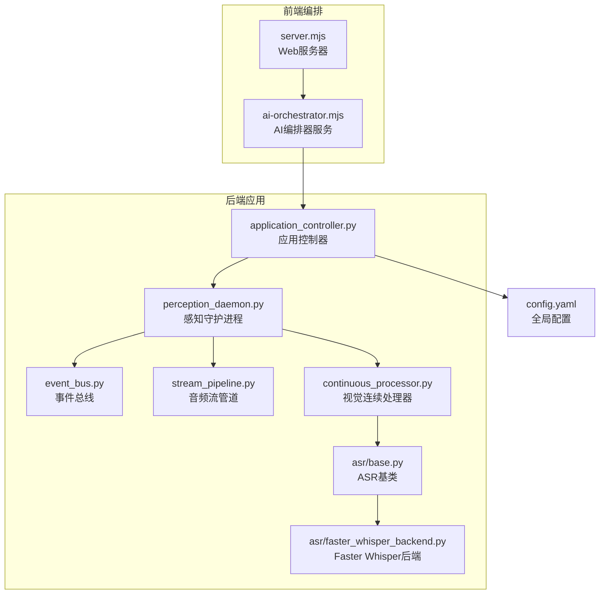
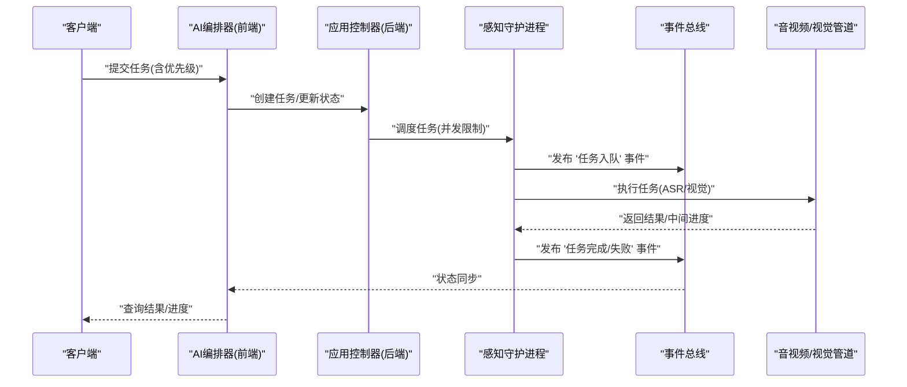
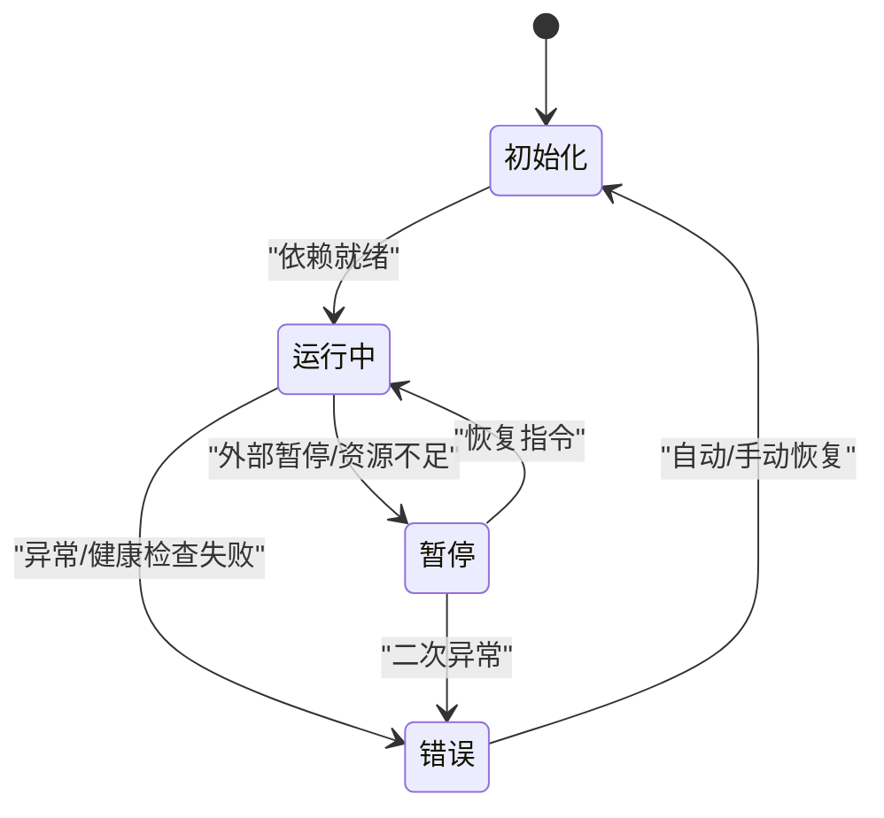
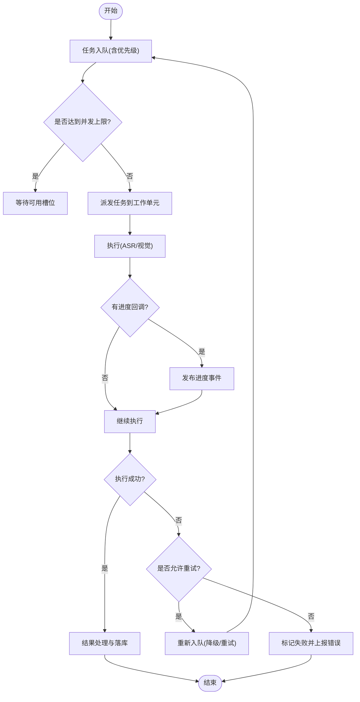
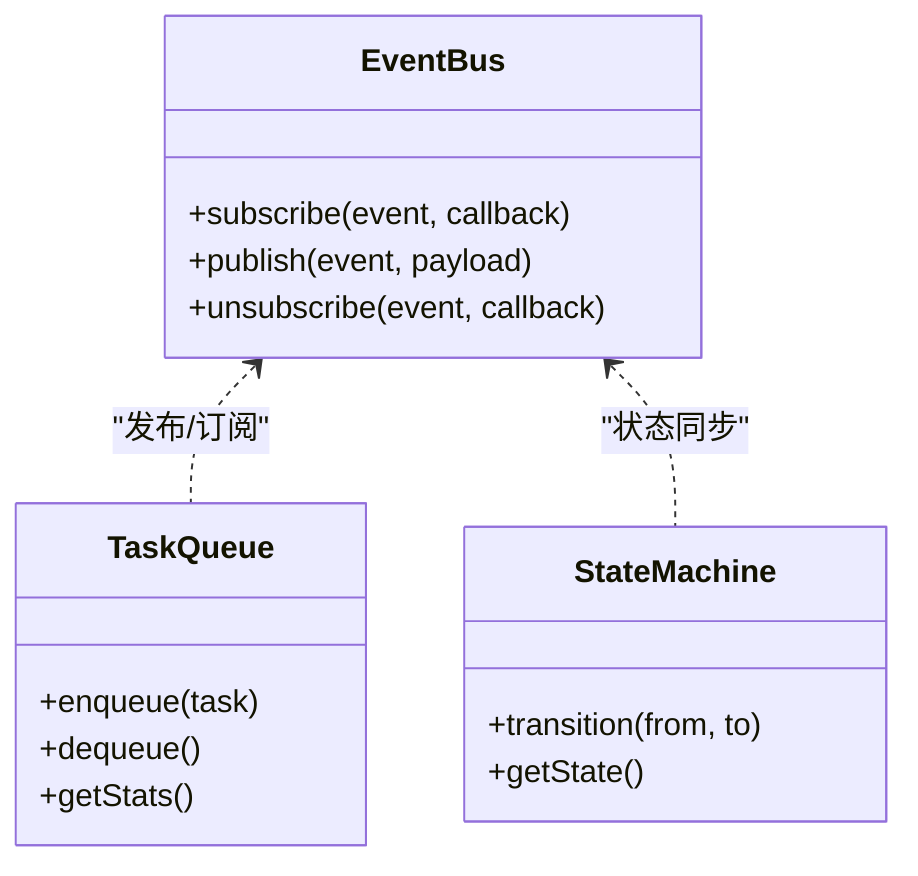
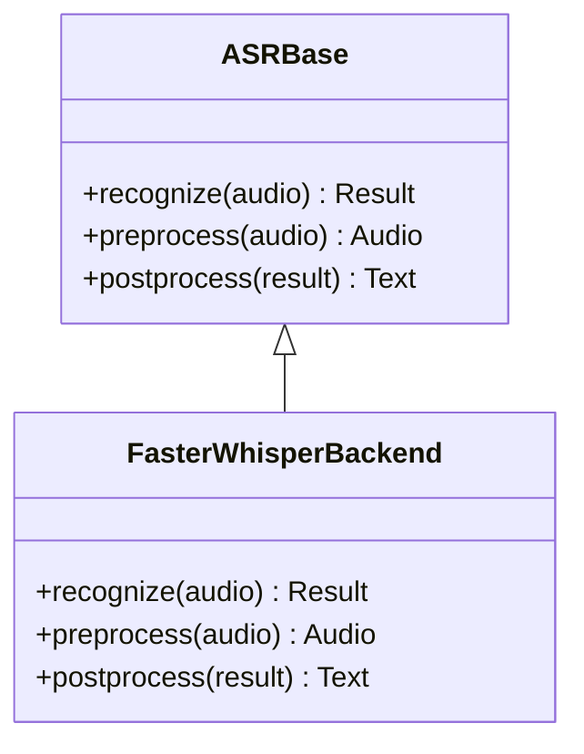
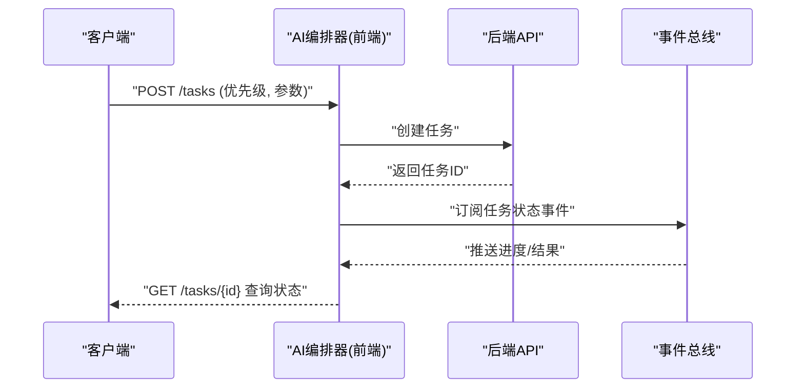
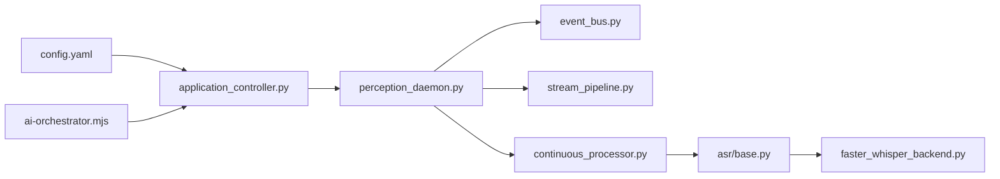

# AI编排器状态协调

<cite>
**本文引用的文件**   
- [app/main.py](file://app/main.py)
- [app/config.py](file://app/config.py)
- [app/factories.py](file://app/factories.py)
- [app/control/application_controller.py](file://app/control/application_controller.py)
- [app/runtime/perception_daemon.py](file://app/runtime/perception_daemon.py)
- [app/events/event_bus.py](file://app/events/event_bus.py)
- [app/asr/base.py](file://app/asr/base.py)
- [app/asr/faster_whisper_backend.py](file://app/asr/faster_whisper_backend.py)
- [app/audio/stream_pipeline.py](file://app/audio/stream_pipeline.py)
- [app/vision/continuous_processor.py](file://app/vision/continuous_processor.py)
- [apps/web/services/ai-orchestrator.mjs](file://apps/web/services/ai-orchestrator.mjs)
- [apps/web/server.mjs](file://apps/web/server.mjs)
- [config.yaml](file://config.yaml)
</cite>

## 目录
1. [简介](#简介)
2. [项目结构](#项目结构)
3. [核心组件](#核心组件)
4. [架构总览](#架构总览)
5. [详细组件分析](#详细组件分析)
6. [依赖关系分析](#依赖关系分析)
7. [性能考量](#性能考量)
8. [故障排查指南](#故障排查指南)
9. [结论](#结论)
10. [附录](#附录)

## 简介
本文件面向“AI编排器状态协调系统”，聚焦任务调度、优先级管理与并发控制的状态管理模式，系统化说明AI服务的生命周期状态（初始化、运行中、暂停、错误）与状态转换；同时文档化任务队列的状态管理（排队、执行监控、结果处理）、状态同步机制、冲突解决策略与错误恢复逻辑。文末提供任务状态查询、进度跟踪与调试方法，并给出基于仓库代码的示例路径，帮助读者快速落地实现。

## 项目结构
本项目采用前后端分离的组织方式：
- 后端（Python）负责感知运行时、ASR/Vision 管道、事件总线与应用控制器，承载服务生命周期与并发控制。
- 前端（Node.js/Web）提供编排器服务与Web服务器，用于任务编排、状态展示与交互。
- 配置集中管理于配置文件与YAML。

**图表来源** 
- [app/control/application_controller.py](file://app/control/application_controller.py)
- [app/runtime/perception_daemon.py](file://app/runtime/perception_daemon.py)
- [app/events/event_bus.py](file://app/events/event_bus.py)
- [app/audio/stream_pipeline.py](file://app/audio/stream_pipeline.py)
- [app/vision/continuous_processor.py](file://app/vision/continuous_processor.py)
- [app/asr/base.py](file://app/asr/base.py)
- [app/asr/faster_whisper_backend.py](file://app/asr/faster_whisper_backend.py)
- [apps/web/services/ai-orchestrator.mjs](file://apps/web/services/ai-orchestrator.mjs)
- [apps/web/server.mjs](file://apps/web/server.mjs)
- [config.yaml](file://config.yaml)

**章节来源**
- [app/main.py](file://app/main.py)
- [config.yaml](file://config.yaml)

## 核心组件
- 应用控制器：统一管理服务生命周期（启动、停止、重启），维护全局状态机，协调各子系统。
- 感知守护进程：驱动音频与视觉流水线，负责任务调度与并发控制，上报状态与事件。
- 事件总线：跨模块发布/订阅事件，保证状态同步与解耦通信。
- ASR/Vision 管道：封装具体算法后端，支持热插拔与降级。
- 前端编排器：对外暴露编排API，聚合任务队列、优先级与并发限制，驱动后端状态流转。

**章节来源**
- [app/control/application_controller.py](file://app/control/application_controller.py)
- [app/runtime/perception_daemon.py](file://app/runtime/perception_daemon.py)
- [app/events/event_bus.py](file://app/events/event_bus.py)
- [app/asr/base.py](file://app/asr/base.py)
- [app/asr/faster_whisper_backend.py](file://app/asr/faster_whisper_backend.py)
- [app/audio/stream_pipeline.py](file://app/audio/stream_pipeline.py)
- [app/vision/continuous_processor.py](file://app/vision/continuous_processor.py)
- [apps/web/services/ai-orchestrator.mjs](file://apps/web/services/ai-orchestrator.mjs)

## 架构总览
整体架构围绕“状态机 + 事件总线 + 任务队列”的模式构建：
- 状态机：定义AI服务生命周期（初始化、运行中、暂停、错误）及转换规则。
- 事件总线：作为状态同步中枢，所有组件通过事件广播状态变更。
- 任务队列：按优先级排序，受并发限制，支持执行监控与结果回传。
- 编排器：前端编排服务聚合任务与状态，提供查询与调试接口。

**图表来源** 
- [apps/web/services/ai-orchestrator.mjs](file://apps/web/services/ai-orchestrator.mjs)
- [app/control/application_controller.py](file://app/control/application_controller.py)
- [app/runtime/perception_daemon.py](file://app/runtime/perception_daemon.py)
- [app/events/event_bus.py](file://app/events/event_bus.py)
- [app/audio/stream_pipeline.py](file://app/audio/stream_pipeline.py)
- [app/vision/continuous_processor.py](file://app/vision/continuous_processor.py)

## 详细组件分析

### 应用控制器（生命周期与状态机）
- 职责：维护服务状态机（初始化→运行中→暂停→错误），响应外部命令进行状态切换；协调守护进程与事件总线。
- 关键行为：
  - 启动时进入“初始化”，加载配置与依赖，完成后转入“运行中”。
  - 运行中可被外部请求或内部异常触发“暂停”或“错误”。
  - 错误状态需具备自动恢复或人工干预流程。
- 并发控制：通过守护进程的调度器限制并行任务数，避免资源争用。

**图表来源** 
- [app/control/application_controller.py](file://app/control/application_controller.py)

**章节来源**
- [app/control/application_controller.py](file://app/control/application_controller.py)

### 感知守护进程（任务调度与并发控制）
- 职责：驱动音频与视觉流水线，负责任务队列的入队、出队、执行与结果处理；维护任务状态与进度。
- 关键行为：
  - 接收来自事件总线或控制器的任务，按优先级排序。
  - 根据并发限制分配工作线程/协程执行任务。
  - 实时上报任务进度与结果至事件总线。
- 错误恢复：对失败任务进行重试或降级到备用后端。

**图表来源** 
- [app/runtime/perception_daemon.py](file://app/runtime/perception_daemon.py)
- [app/audio/stream_pipeline.py](file://app/audio/stream_pipeline.py)
- [app/vision/continuous_processor.py](file://app/vision/continuous_processor.py)
- [app/events/event_bus.py](file://app/events/event_bus.py)

**章节来源**
- [app/runtime/perception_daemon.py](file://app/runtime/perception_daemon.py)
- [app/audio/stream_pipeline.py](file://app/audio/stream_pipeline.py)
- [app/vision/continuous_processor.py](file://app/vision/continuous_processor.py)
- [app/events/event_bus.py](file://app/events/event_bus.py)

### 事件总线（状态同步与解耦）
- 职责：提供发布/订阅机制，确保状态变更在模块间一致传播。
- 关键行为：
  - 订阅者注册回调，监听特定事件（如任务入队、完成、失败）。
  - 支持事件去重与顺序保证（可选）。
  - 错误隔离：单个订阅者异常不影响其他订阅者。

**图表来源** 
- [app/events/event_bus.py](file://app/events/event_bus.py)

**章节来源**
- [app/events/event_bus.py](file://app/events/event_bus.py)

### ASR/Vision 管道（后端抽象与降级）
- 职责：封装具体算法实现，提供统一接口；支持多后端与降级策略。
- 关键行为：
  - 基类定义标准接口（识别、预处理、后处理）。
  - 具体后端（如Faster Whisper）实现细节。
  - 失败时切换到Mock或其他轻量后端，保障可用性。

**图表来源** 
- [app/asr/base.py](file://app/asr/base.py)
- [app/asr/faster_whisper_backend.py](file://app/asr/faster_whisper_backend.py)

**章节来源**
- [app/asr/base.py](file://app/asr/base.py)
- [app/asr/faster_whisper_backend.py](file://app/asr/faster_whisper_backend.py)

### 前端编排器（任务编排与状态查询）
- 职责：聚合任务队列、优先级与并发限制，提供编排API；订阅后端事件以更新本地状态。
- 关键行为：
  - 接收客户端任务，设置优先级与超时。
  - 调用后端控制器创建任务，并监听状态变化。
  - 提供查询接口获取任务进度与结果。

**图表来源** 
- [apps/web/services/ai-orchestrator.mjs](file://apps/web/services/ai-orchestrator.mjs)
- [apps/web/server.mjs](file://apps/web/server.mjs)

**章节来源**
- [apps/web/services/ai-orchestrator.mjs](file://apps/web/services/ai-orchestrator.mjs)
- [apps/web/server.mjs](file://apps/web/server.mjs)

## 依赖关系分析
- 低耦合高内聚：事件总线将控制器、守护进程、管道解耦。
- 明确边界：ASR/Vision通过基类抽象，便于替换与测试。
- 配置驱动：通过配置文件动态调整并发、优先级策略与后端选择。

**图表来源** 
- [config.yaml](file://config.yaml)
- [app/control/application_controller.py](file://app/control/application_controller.py)
- [app/runtime/perception_daemon.py](file://app/runtime/perception_daemon.py)
- [app/events/event_bus.py](file://app/events/event_bus.py)
- [app/audio/stream_pipeline.py](file://app/audio/stream_pipeline.py)
- [app/vision/continuous_processor.py](file://app/vision/continuous_processor.py)
- [app/asr/base.py](file://app/asr/base.py)
- [app/asr/faster_whisper_backend.py](file://app/asr/faster_whisper_backend.py)
- [apps/web/services/ai-orchestrator.mjs](file://apps/web/services/ai-orchestrator.mjs)

**章节来源**
- [config.yaml](file://config.yaml)
- [app/factories.py](file://app/factories.py)

## 性能考量
- 并发限制：通过守护进程的工作池大小控制CPU/GPU占用，避免过载。
- 优先级队列：使用堆结构实现O(log n)插入与弹出，确保高优先级任务优先执行。
- 事件批处理：批量发布事件减少总线压力。
- 内存管理：流式处理音频/图像数据，避免一次性加载大对象。
- 缓存与复用：模型预热、特征缓存减少重复计算。

[本节为通用指导，不直接分析具体文件]

## 故障排查指南
- 状态不一致：检查事件总线订阅者是否全部成功处理事件；查看日志中的事件序列。
- 任务堆积：确认并发限制与消费者速度匹配；检查是否有阻塞的后端调用。
- 错误恢复：验证重试策略与降级逻辑是否生效；查看健康检查指标。
- 调试方法：
  - 启用详细日志级别，追踪任务生命周期。
  - 使用事件总线监控面板观察状态变更。
  - 模拟失败场景验证恢复流程。

**章节来源**
- [app/events/event_bus.py](file://app/events/event_bus.py)
- [app/runtime/perception_daemon.py](file://app/runtime/perception_daemon.py)

## 结论
本系统通过状态机、事件总线与任务队列的协同，实现了可靠的AI服务编排与状态协调。清晰的职责划分与模块化设计确保了可扩展性与可维护性。建议在生产环境中加强监控与告警，持续优化并发与优先级策略，以提升整体吞吐与稳定性。

[本节为总结，不直接分析具体文件]

## 附录
- 配置项参考：见配置文件，包含并发、优先级、后端选择等。
- 示例路径：
  - 应用控制器状态机：[app/control/application_controller.py](file://app/control/application_controller.py)
  - 守护进程调度逻辑：[app/runtime/perception_daemon.py](file://app/runtime/perception_daemon.py)
  - 事件总线实现：[app/events/event_bus.py](file://app/events/event_bus.py)
  - ASR基类与后端：[app/asr/base.py](file://app/asr/base.py), [app/asr/faster_whisper_backend.py](file://app/asr/faster_whisper_backend.py)
  - 前端编排器：[apps/web/services/ai-orchestrator.mjs](file://apps/web/services/ai-orchestrator.mjs)

**章节来源**
- [config.yaml](file://config.yaml)
- [app/control/application_controller.py](file://app/control/application_controller.py)
- [app/runtime/perception_daemon.py](file://app/runtime/perception_daemon.py)
- [app/events/event_bus.py](file://app/events/event_bus.py)
- [app/asr/base.py](file://app/asr/base.py)
- [app/asr/faster_whisper_backend.py](file://app/asr/faster_whisper_backend.py)
- [apps/web/services/ai-orchestrator.mjs](file://apps/web/services/ai-orchestrator.mjs)