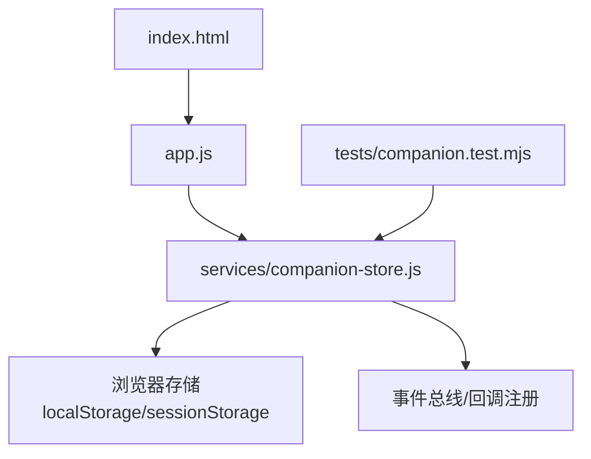
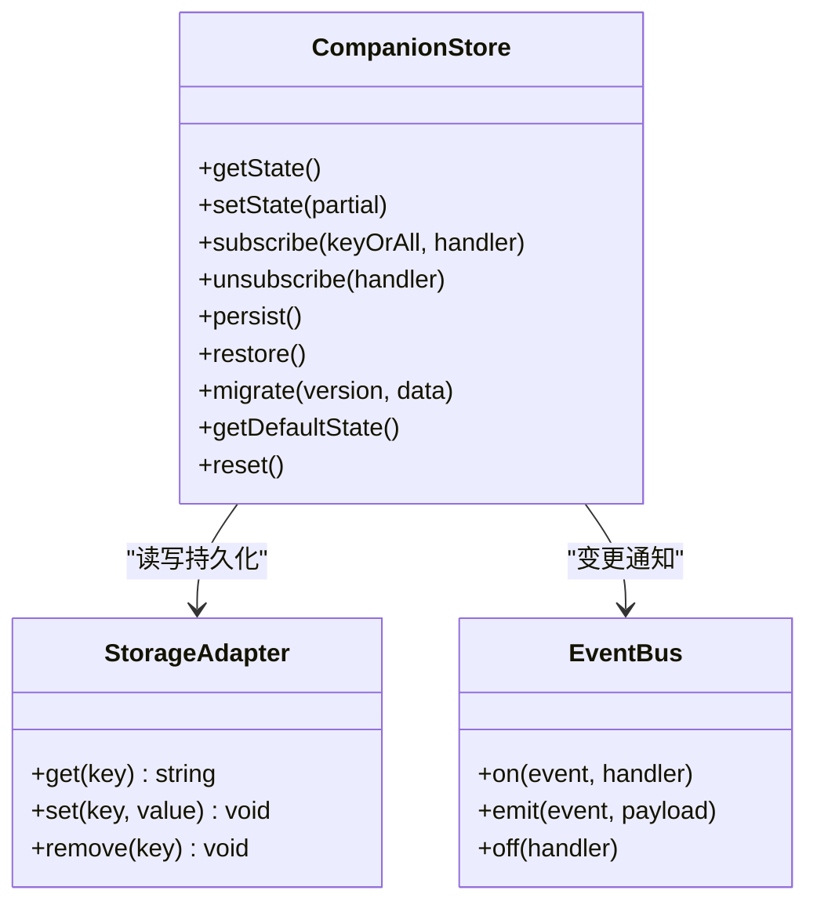
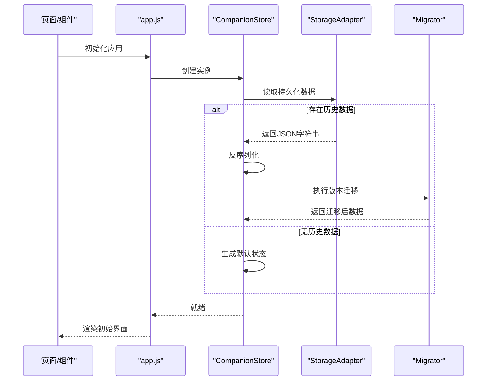
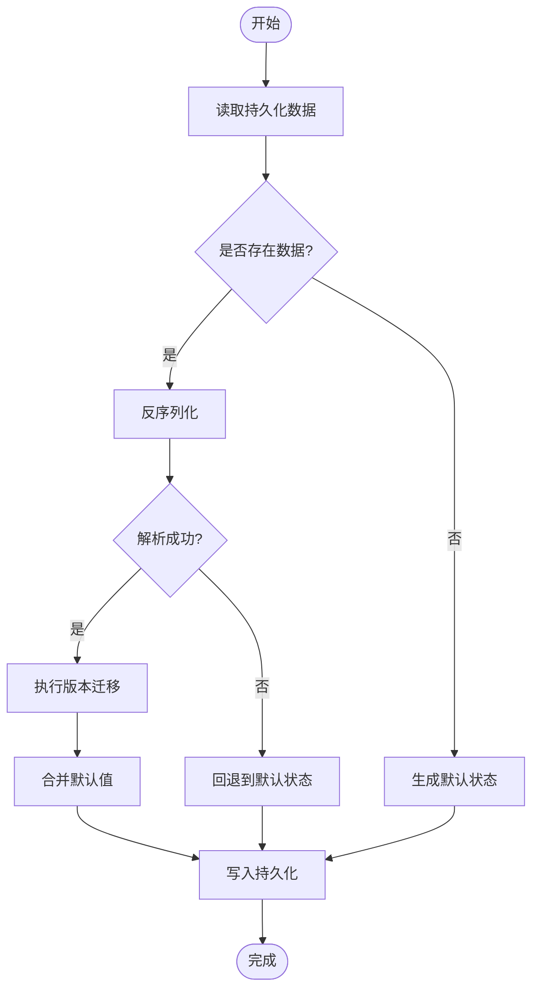
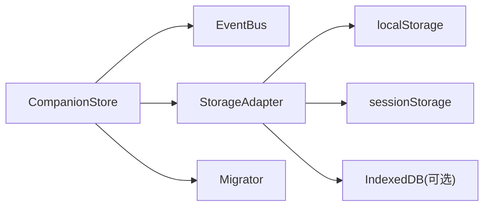

# Companion Store状态存储

<cite>
**本文引用的文件**   
- [companion-store.js](file://apps/web/services/companion-store.js)
- [companion.test.mjs](file://apps/web/tests/companion.test.mjs)
- [app.js](file://apps/web/app.js)
- [index.html](file://apps/web/index.html)
</cite>

## 目录
1. [简介](#简介)
2. [项目结构](#项目结构)
3. [核心组件](#核心组件)
4. [架构总览](#架构总览)
5. [详细组件分析](#详细组件分析)
6. [依赖关系分析](#依赖关系分析)
7. [性能考虑](#性能考虑)
8. [故障排查指南](#故障排查指南)
9. [结论](#结论)
10. [附录](#附录)

## 简介
本文件系统化阐述 Companion Store 的设计与实现，作为 Web 应用的核心状态管理器，它提供：
- 集中式状态容器与响应式更新
- 本地持久化（含序列化/反序列化、缓存策略）
- 版本迁移与默认值管理
- 订阅监听机制与数据同步策略
- 调试工具与性能优化建议

目标读者包括前端开发者、集成工程师与产品维护人员。文档从高层架构到代码级细节逐步展开，并辅以流程图与时序图帮助理解。

## 项目结构
Companion Store 位于 apps/web/services 目录下，测试用例位于 apps/web/tests，UI 入口在 apps/web/index.html，应用初始化逻辑在 apps/web/app.js。

图表来源
- [index.html](file://apps/web/index.html)
- [app.js](file://apps/web/app.js)
- [companion-store.js](file://apps/web/services/companion-store.js)

章节来源
- [index.html](file://apps/web/index.html)
- [app.js](file://apps/web/app.js)
- [companion-store.js](file://apps/web/services/companion-store.js)

## 核心组件
- 状态容器：集中保存应用状态对象，提供读取与写入接口
- 变更监听器：支持订阅特定键或全局变更，触发回调
- 持久化层：负责将状态序列化为字符串并落盘，启动时反序列化恢复
- 版本迁移器：根据 schema 版本对旧数据进行转换，确保兼容性
- 默认值工厂：为缺失字段提供安全默认值
- 缓存与同步：控制读写频率、批量更新与跨标签页同步

章节来源
- [companion-store.js](file://apps/web/services/companion-store.js)

## 架构总览
Companion Store 采用“单例状态 + 发布订阅”的架构模式，结合本地存储实现可靠的状态持久化与跨会话恢复。

图表来源
- [companion-store.js](file://apps/web/services/companion-store.js)

章节来源
- [companion-store.js](file://apps/web/services/companion-store.js)

## 详细组件分析

### 状态容器与生命周期
- 初始化流程
  - 加载默认状态
  - 尝试从持久化存储恢复
  - 执行版本迁移与合并默认值
  - 建立变更监听与自动持久化
- 默认值管理
  - 使用默认值工厂生成不可变默认结构
  - 对缺失字段进行深度合并，避免覆盖用户设置
- 重置与清理
  - 清空状态并回滚到默认值
  - 清理监听器与定时器

章节来源
- [companion-store.js](file://apps/web/services/companion-store.js)

### 持久化机制（本地存储、序列化/反序列化、缓存）
- 存储策略
  - 主状态：localStorage 持久化，跨会话保留
  - 临时状态：sessionStorage 用于会话内缓存
  - 可选：IndexedDB 用于大对象分片存储
- 序列化与反序列化
  - JSON 序列化为主，必要时自定义编码器处理特殊类型
  - 反序列化失败时降级到默认状态并记录错误
- 缓存与批处理
  - 写操作节流/防抖，减少频繁 IO
  - 批量更新合并多次 setState 调用
  - 脏标记与懒刷新，避免重复计算

章节来源
- [companion-store.js](file://apps/web/services/companion-store.js)

### 版本迁移与默认值
- 版本元数据
  - 存储当前 schema 版本
  - 迁移表定义每个版本的增量规则
- 迁移策略
  - 顺序执行迁移脚本，保证幂等性
  - 失败回滚与断点续迁
- 默认值合并
  - 新增字段自动填充默认值
  - 删除字段安全丢弃

章节来源
- [companion-store.js](file://apps/web/services/companion-store.js)

### 变更监听与响应式更新
- 订阅模型
  - 全局订阅：监听所有状态变更
  - 键级订阅：仅监听指定 key 的变化
- 触发时机
  - setState 后异步派发变更事件
  - 支持同步与异步两种派发模式
- 去重与节流
  - 相同值的变更不触发回调
  - 高频变更合并为一次通知

章节来源
- [companion-store.js](file://apps/web/services/companion-store.js)

### 数据同步策略
- 同标签页同步
  - 通过事件总线广播变更
- 跨标签页/窗口同步
  - 监听 storage 事件实现实时同步
- 服务端同步（可选）
  - 在关键状态变更后上报后端
  - 冲突解决策略：最后写入优先或合并策略

章节来源
- [companion-store.js](file://apps/web/services/companion-store.js)

### 状态初始化流程（时序图）

图表来源
- [app.js](file://apps/web/app.js)
- [companion-store.js](file://apps/web/services/companion-store.js)

章节来源
- [app.js](file://apps/web/app.js)
- [companion-store.js](file://apps/web/services/companion-store.js)

### 订阅与更新（示例路径）
- 订阅状态变化
  - 参考测试用例中的订阅与断言方式
- 触发状态更新
  - 通过 setState 传入部分状态对象
- 处理异步操作
  - 在异步回调中提交最终状态，避免中间态闪烁

章节来源
- [companion.test.mjs](file://apps/web/tests/companion.test.mjs)
- [companion-store.js](file://apps/web/services/companion-store.js)

### 复杂逻辑流程图（持久化与迁移）

图表来源
- [companion-store.js](file://apps/web/services/companion-store.js)

章节来源
- [companion-store.js](file://apps/web/services/companion-store.js)

## 依赖关系分析
- 内部依赖
  - 事件总线：用于解耦状态变更与消费者
  - 存储适配器：抽象 localStorage/sessionStorage/IndexedDB
  - 迁移器：按版本顺序执行迁移脚本
- 外部依赖
  - 浏览器 API：localStorage、storage 事件
  - 可选：网络请求模块用于与服务端同步

图表来源
- [companion-store.js](file://apps/web/services/companion-store.js)

章节来源
- [companion-store.js](file://apps/web/services/companion-store.js)

## 性能考虑
- 写操作优化
  - 节流/防抖：限制单位时间内的持久化次数
  - 批量更新：合并多次 setState 为一次持久化
- 读操作优化
  - 惰性加载：按需读取大对象
  - 内存缓存：热点状态驻留内存
- 变更通知优化
  - 值比较：浅/深比较避免无效回调
  - 订阅去重：同一处理器只注册一次
- 存储优化
  - 压缩与分片：大对象拆分为多个键
  - 异步写入：非阻塞 I/O 提升交互流畅度

[本节为通用指导，无需具体文件引用]

## 故障排查指南
- 常见问题
  - 持久化失败：检查存储空间配额与序列化异常
  - 迁移失败：确认迁移脚本幂等性与版本一致性
  - 监听器未触发：验证订阅键名与值比较策略
- 调试技巧
  - 启用日志：记录每次 setState、持久化与迁移步骤
  - 快照对比：导出前后状态差异定位问题
  - 模拟环境：使用测试用例快速复现场景

章节来源
- [companion-store.js](file://apps/web/services/companion-store.js)
- [companion.test.mjs](file://apps/web/tests/companion.test.mjs)

## 结论
Companion Store 以简洁清晰的架构实现了高可用的状态管理与持久化能力。通过版本迁移、默认值合并与高效的变更监听机制，既保证了数据的可靠性，也提升了用户体验。建议在扩展新功能时遵循现有模式，保持迁移脚本与默认值的一致性，持续优化性能与可观测性。

[本节为总结性内容，无需具体文件引用]

## 附录

### 使用示例（路径指引）
- 订阅状态变化
  - 参考测试用例中的订阅与断言方法
- 触发状态更新
  - 通过 setState 提交部分状态
- 处理异步操作
  - 在异步完成后提交最终状态，避免中间态

章节来源
- [companion.test.mjs](file://apps/web/tests/companion.test.mjs)
- [companion-store.js](file://apps/web/services/companion-store.js)

### 配置项说明（示例）
- 存储键名：区分不同应用或环境的存储命名空间
- 版本字段：标识当前 schema 版本
- 迁移表：定义各版本间的增量规则
- 默认值工厂：提供不可变的默认数据结构

章节来源
- [companion-store.js](file://apps/web/services/companion-store.js)