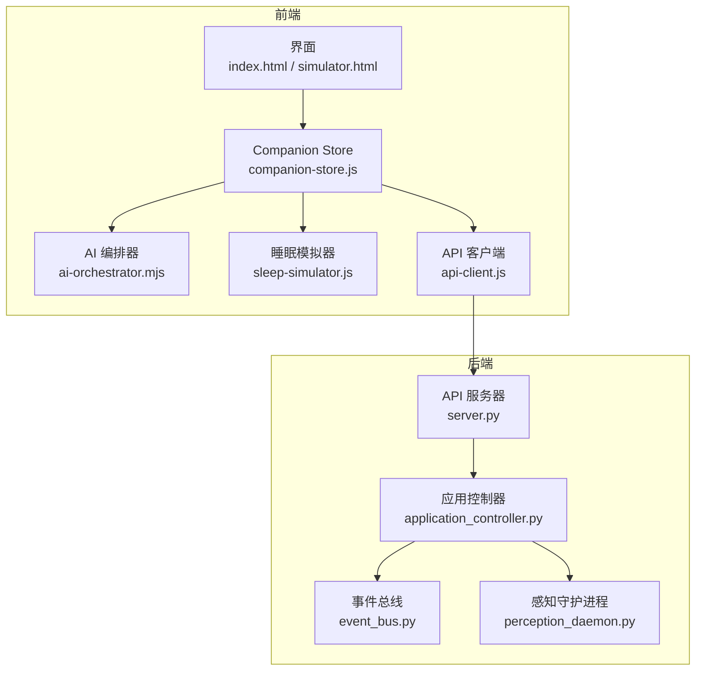
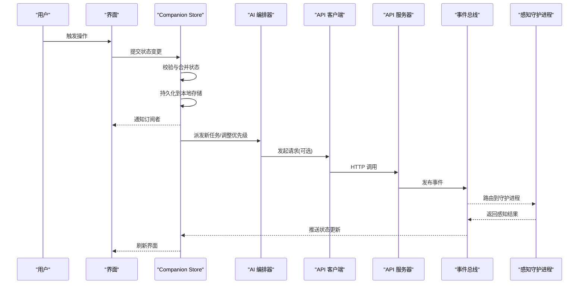
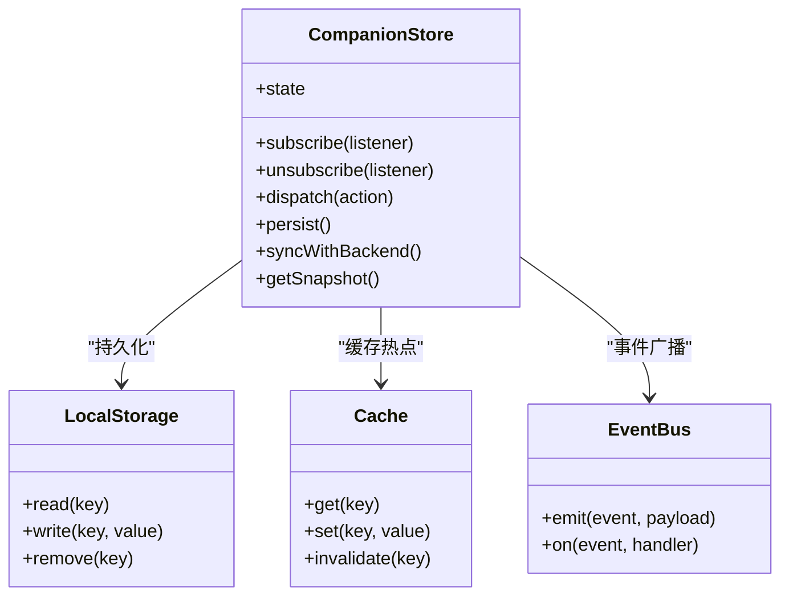
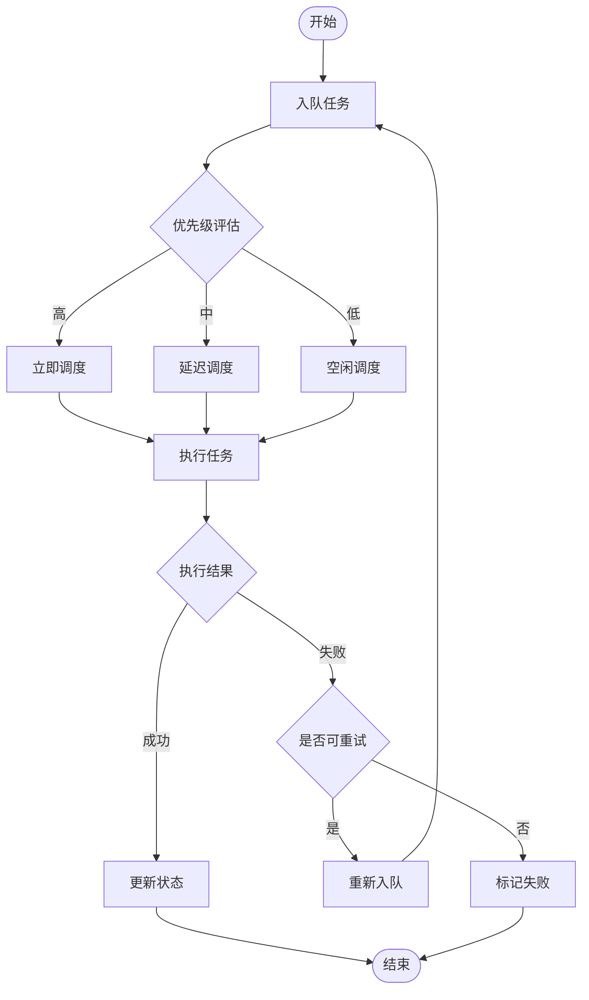
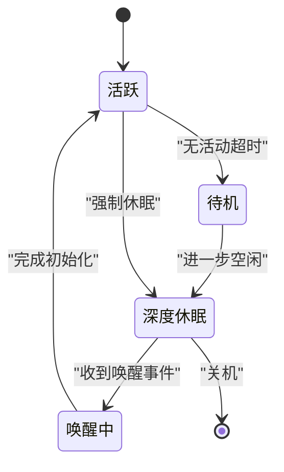
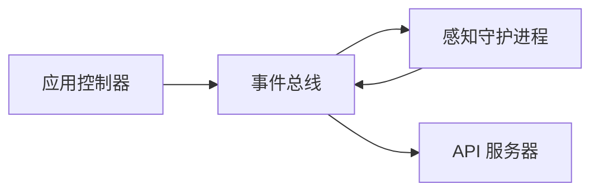
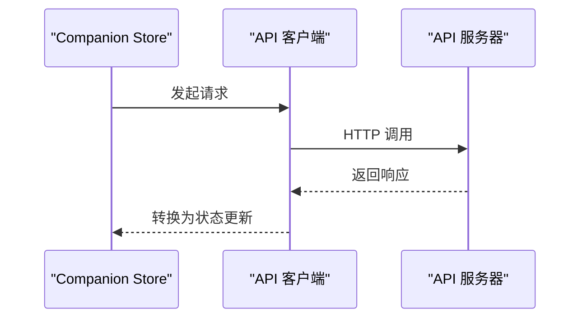
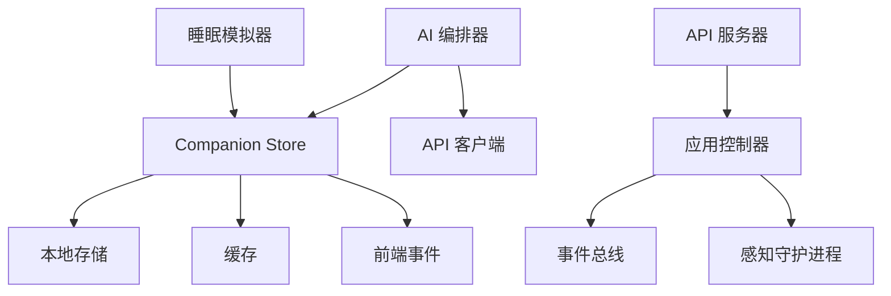

# 状态管理

<cite>
**本文引用的文件**   
- [companion-store.js](file://apps/web/services/companion-store.js)
- [ai-orchestrator.mjs](file://apps/web/services/ai-orchestrator.mjs)
- [sleep-simulator.js](file://apps/web/services/sleep-simulator.js)
- [event_bus.py](file://app/events/event_bus.py)
- [perception_daemon.py](file://app/runtime/perception_daemon.py)
- [application_controller.py](file://app/control/application_controller.py)
- [server.py](file://app/api/server.py)
- [main.py](file://app/main.py)
- [hardware_main.py](file://app/hardware_main.py)
- [config.yaml](file://config.yaml)
- [index.html](file://apps/web/index.html)
- [simulator.html](file://apps/web/simulator.html)
- [api-client.js](file://apps/web/services/api-client.js)
</cite>

## 目录
1. [简介](#简介)
2. [项目结构](#项目结构)
3. [核心组件](#核心组件)
4. [架构总览](#架构总览)
5. [详细组件分析](#详细组件分析)
6. [依赖关系分析](#依赖关系分析)
7. [性能考量](#性能考量)
8. [故障排查指南](#故障排查指南)
9. [结论](#结论)
10. [附录](#附录)

## 简介
本文件面向“状态管理系统”的设计与实现，重点围绕以下目标展开：
- Companion Store 的设计模式与实现原理
- 状态持久化机制（本地存储、缓存策略、数据同步）
- AI 编排器的状态协调逻辑（任务调度、优先级管理、并发控制）
- 睡眠模拟器的状态转换与生命周期管理
- 状态变更监听、副作用处理与性能优化技巧
- 状态调试工具与故障排查方法

本仓库采用前后端分离的架构：前端通过 Companion Store 维护应用状态并与后端交互；后端以事件总线与守护进程驱动感知与硬件能力；AI 编排器在前端协调多源输入与输出。

## 项目结构
与状态管理直接相关的代码主要分布在：
- 前端服务层：Companion Store、AI 编排器、睡眠模拟器、API 客户端
- 后端运行时：事件总线、感知守护进程、应用控制器、API 服务器
- 配置与入口：配置文件、Web 页面、主程序入口

**图表来源** 
- [index.html](file://apps/web/index.html)
- [simulator.html](file://apps/web/simulator.html)
- [companion-store.js](file://apps/web/services/companion-store.js)
- [ai-orchestrator.mjs](file://apps/web/services/ai-orchestrator.mjs)
- [sleep-simulator.js](file://apps/web/services/sleep-simulator.js)
- [api-client.js](file://apps/web/services/api-client.js)
- [server.py](file://app/api/server.py)
- [application_controller.py](file://app/control/application_controller.py)
- [event_bus.py](file://app/events/event_bus.py)
- [perception_daemon.py](file://app/runtime/perception_daemon.py)

**章节来源**
- [index.html](file://apps/web/index.html)
- [simulator.html](file://apps/web/simulator.html)
- [companion-store.js](file://apps/web/services/companion-store.js)
- [ai-orchestrator.mjs](file://apps/web/services/ai-orchestrator.mjs)
- [sleep-simulator.js](file://apps/web/services/sleep-simulator.js)
- [api-client.js](file://apps/web/services/api-client.js)
- [server.py](file://app/api/server.py)
- [application_controller.py](file://app/control/application_controller.py)
- [event_bus.py](file://app/events/event_bus.py)
- [perception_daemon.py](file://app/runtime/perception_daemon.py)

## 核心组件
- Companion Store：作为单一可信状态源，提供订阅/发布式状态更新、本地持久化、缓存与跨标签页同步。
- AI 编排器：负责任务队列、优先级与并发控制，协调语音、视觉、设备控制等子任务。
- 睡眠模拟器：模拟设备休眠/唤醒流程，驱动状态机切换并触发副作用。
- 事件总线与守护进程：后端统一事件通道，解耦模块间通信，支撑异步任务与硬件交互。
- API 客户端与服务端：封装 HTTP 调用，暴露状态查询与命令下发接口。

**章节来源**
- [companion-store.js](file://apps/web/services/companion-store.js)
- [ai-orchestrator.mjs](file://apps/web/services/ai-orchestrator.mjs)
- [sleep-simulator.js](file://apps/web/services/sleep-simulator.js)
- [event_bus.py](file://app/events/event_bus.py)
- [perception_daemon.py](file://app/runtime/perception_daemon.py)
- [server.py](file://app/api/server.py)

## 架构总览
状态管理的整体流程如下：
- 用户操作或外部事件触发状态变更
- Companion Store 接收变更，执行副作用（如持久化、广播）
- AI 编排器根据当前状态调度任务，必要时调用 API 与后端交互
- 睡眠模拟器在特定条件下进入休眠，暂停非关键任务并保留必要状态
- 后端通过事件总线分发感知结果与控制指令，形成闭环

**图表来源** 
- [companion-store.js](file://apps/web/services/companion-store.js)
- [ai-orchestrator.mjs](file://apps/web/services/ai-orchestrator.mjs)
- [api-client.js](file://apps/web/services/api-client.js)
- [server.py](file://app/api/server.py)
- [event_bus.py](file://app/events/event_bus.py)
- [perception_daemon.py](file://app/runtime/perception_daemon.py)

## 详细组件分析

### Companion Store：设计模式与实现原理
- 设计模式
  - 单例状态源：全局唯一状态对象，避免状态分散导致不一致
  - 观察者模式：订阅/发布机制，支持细粒度监听与批量更新
  - 中间件/副作用链：在状态变更前后执行持久化、日志、统计等
- 本地存储与缓存策略
  - 使用浏览器本地存储进行持久化，支持增量写入与版本控制
  - 内存缓存热点字段，减少重复计算与 I/O
  - 跨标签页同步通过 StorageEvent 或消息通道实现
- 数据同步
  - 与后端 API 双向同步：拉取初始状态，推送增量变更
  - 冲突解决策略：基于时间戳或版本号合并
- 性能优化
  - 防抖/节流批量更新
  - 懒加载与按需订阅
  - 序列化优化与压缩

**图表来源** 
- [companion-store.js](file://apps/web/services/companion-store.js)

**章节来源**
- [companion-store.js](file://apps/web/services/companion-store.js)

### AI 编排器：状态协调逻辑
- 任务调度
  - 基于优先级的任务队列，支持动态插入与重排
  - 任务生命周期：待执行、运行中、成功、失败、重试
- 优先级管理
  - 按业务规则分配权重（如用户意图 > 系统告警 > 后台任务）
  - 支持抢占式调度与公平队列
- 并发控制
  - 限制最大并行度，避免资源争用
  - 任务去重与幂等性保障
- 与状态系统的集成
  - 编排器读取 Store 中的上下文状态，决定调度策略
  - 将执行结果写回 Store，触发后续动作

**图表来源** 
- [ai-orchestrator.mjs](file://apps/web/services/ai-orchestrator.mjs)

**章节来源**
- [ai-orchestrator.mjs](file://apps/web/services/ai-orchestrator.mjs)

### 睡眠模拟器：状态转换与生命周期管理
- 状态机
  - 活跃、待机、深度休眠、唤醒中
  - 事件驱动的状态迁移（定时器、用户交互、系统事件）
- 生命周期
  - 初始化：加载配置与上次状态
  - 运行期：监控资源占用，触发休眠条件
  - 退出：保存状态，释放资源
- 副作用
  - 暂停非关键任务，保留心跳与必要监听
  - 唤醒时恢复上下文，重建连接

**图表来源** 
- [sleep-simulator.js](file://apps/web/services/sleep-simulator.js)

**章节来源**
- [sleep-simulator.js](file://apps/web/services/sleep-simulator.js)

### 后端事件总线与守护进程
- 事件总线
  - 统一的事件通道，支持发布/订阅与路由
  - 保证事件顺序与可靠性（可选持久化与重试）
- 感知守护进程
  - 长期运行的后台任务，采集传感器数据与识别结果
  - 与事件总线集成，将结果推送到 Store 或 API

**图表来源** 
- [event_bus.py](file://app/events/event_bus.py)
- [perception_daemon.py](file://app/runtime/perception_daemon.py)
- [application_controller.py](file://app/control/application_controller.py)
- [server.py](file://app/api/server.py)

**章节来源**
- [event_bus.py](file://app/events/event_bus.py)
- [perception_daemon.py](file://app/runtime/perception_daemon.py)
- [application_controller.py](file://app/control/application_controller.py)
- [server.py](file://app/api/server.py)

### 前端 API 客户端与服务端
- API 客户端
  - 封装 HTTP 请求，处理鉴权、重试与错误
  - 与 Companion Store 集成，将响应映射为状态变更
- 服务端
  - 暴露 RESTful 接口，处理状态查询与命令下发
  - 与事件总线对接，实现异步处理

**图表来源** 
- [api-client.js](file://apps/web/services/api-client.js)
- [server.py](file://app/api/server.py)

**章节来源**
- [api-client.js](file://apps/web/services/api-client.js)
- [server.py](file://app/api/server.py)

## 依赖关系分析
- 前端依赖
  - Companion Store 依赖本地存储、缓存与事件总线
  - AI 编排器依赖 Store 与 API 客户端
  - 睡眠模拟器依赖 Store 与定时器
- 后端依赖
  - 应用控制器依赖事件总线与守护进程
  - API 服务器依赖控制器与事件总线
- 配置与环境
  - 配置文件定义行为开关、超时、重试策略等

**图表来源** 
- [companion-store.js](file://apps/web/services/companion-store.js)
- [ai-orchestrator.mjs](file://apps/web/services/ai-orchestrator.mjs)
- [sleep-simulator.js](file://apps/web/services/sleep-simulator.js)
- [api-client.js](file://apps/web/services/api-client.js)
- [application_controller.py](file://app/control/application_controller.py)
- [event_bus.py](file://app/events/event_bus.py)
- [perception_daemon.py](file://app/runtime/perception_daemon.py)
- [server.py](file://app/api/server.py)

**章节来源**
- [companion-store.js](file://apps/web/services/companion-store.js)
- [ai-orchestrator.mjs](file://apps/web/services/ai-orchestrator.mjs)
- [sleep-simulator.js](file://apps/web/services/sleep-simulator.js)
- [api-client.js](file://apps/web/services/api-client.js)
- [application_controller.py](file://app/control/application_controller.py)
- [event_bus.py](file://app/events/event_bus.py)
- [perception_daemon.py](file://app/runtime/perception_daemon.py)
- [server.py](file://app/api/server.py)

## 性能考量
- 状态更新批处理
  - 合并多次变更，减少渲染与 I/O 开销
- 缓存与懒加载
  - 热点数据常驻内存，冷数据按需加载
- 并发与限流
  - 限制 API 并发度，避免雪崩
  - 任务队列背压与降级
- 序列化与传输优化
  - 使用高效格式，压缩大对象
- 监控与度量
  - 记录关键指标（延迟、吞吐、错误率）

[本节为通用指导，不直接分析具体文件]

## 故障排查指南
- 常见问题定位
  - 状态不同步：检查本地存储版本与后端一致性
  - 任务卡住：查看编排器队列与并发限制
  - 休眠异常：确认状态机事件与副作用清理
- 调试工具
  - 启用详细日志，追踪状态变更链路
  - 使用浏览器开发者工具观察网络与存储
  - 后端事件总线可视化订阅与路由
- 恢复策略
  - 重置局部状态，重新同步
  - 重启守护进程，重建连接

**章节来源**
- [companion-store.js](file://apps/web/services/companion-store.js)
- [ai-orchestrator.mjs](file://apps/web/services/ai-orchestrator.mjs)
- [sleep-simulator.js](file://apps/web/services/sleep-simulator.js)
- [event_bus.py](file://app/events/event_bus.py)
- [perception_daemon.py](file://app/runtime/perception_daemon.py)

## 结论
本状态管理系统以 Companion Store 为核心，结合 AI 编排器与睡眠模拟器，实现了前后端一致的状态模型与可靠的持久化、缓存与同步机制。通过事件总线与守护进程，后端能够稳定地驱动感知与硬件能力。建议在迭代中持续完善监控与调试工具，提升可观测性与可维护性。

[本节为总结性内容，不直接分析具体文件]

## 附录
- 配置项参考
  - 超时、重试、并发限制、缓存策略等可通过配置文件集中管理
- 入口与页面
  - Web 入口与模拟器页面用于验证状态流转与交互

**章节来源**
- [config.yaml](file://config.yaml)
- [main.py](file://app/main.py)
- [hardware_main.py](file://app/hardware_main.py)
- [index.html](file://apps/web/index.html)
- [simulator.html](file://apps/web/simulator.html)