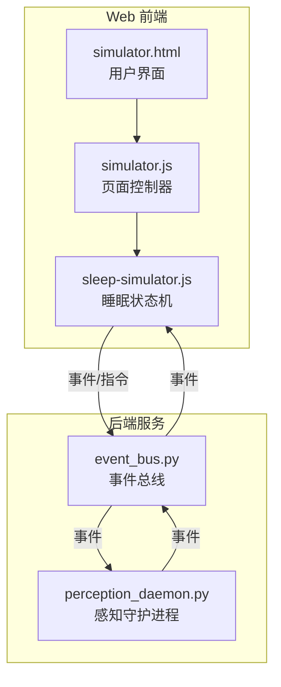
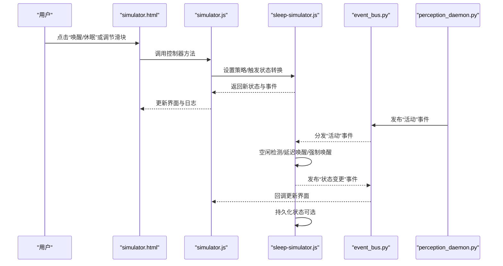
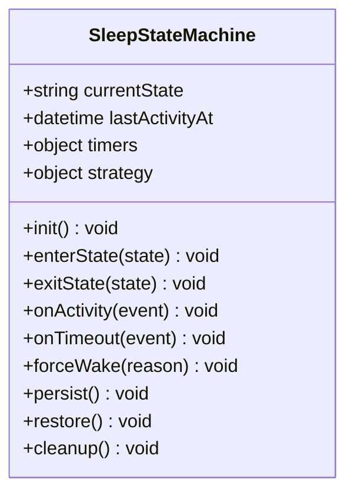
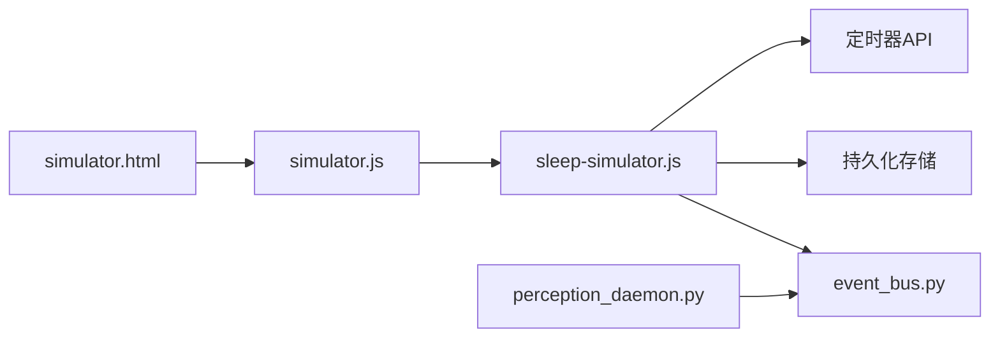
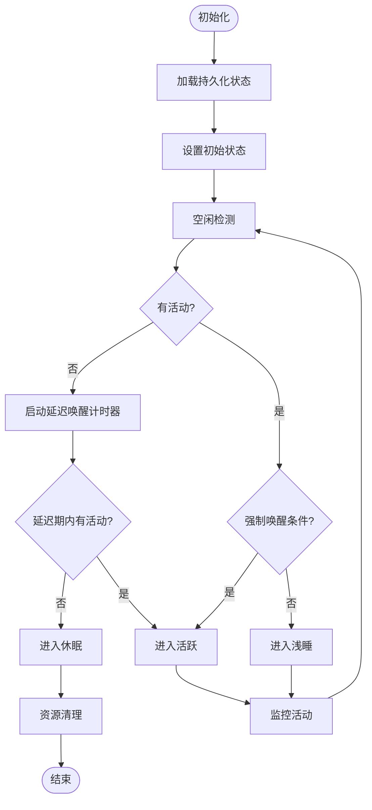

# 睡眠模拟器状态管理

<cite>
**本文引用的文件**   
- [sleep-simulator.js](file://apps/web/services/sleep-simulator.js)
- [simulator.js](file://apps/web/simulator.js)
- [simulator.html](file://apps/web/simulator.html)
- [perception_daemon.py](file://app/runtime/perception_daemon.py)
- [event_bus.py](file://app/events/event_bus.py)
- [config.yaml](file://config.yaml)
</cite>

## 目录
1. [简介](#简介)
2. [项目结构](#项目结构)
3. [核心组件](#核心组件)
4. [架构总览](#架构总览)
5. [详细组件分析](#详细组件分析)
6. [依赖关系分析](#依赖关系分析)
7. [性能考虑](#性能考虑)
8. [故障排查指南](#故障排查指南)
9. [结论](#结论)
10. [附录](#附录)

## 简介
本文件面向“睡眠模拟器”的状态管理，系统化说明设备休眠与唤醒的状态转换机制、生命周期管理（空闲检测、延迟唤醒、强制唤醒）、状态持久化策略（重启恢复）、事件处理、定时器管理与资源清理逻辑。同时提供状态监控工具与故障排查方法，并给出可操作的配置示例与异常处理流程，帮助开发者快速集成与排障。

## 项目结构
本项目在 Web 前端侧实现了睡眠模拟器的核心状态机与交互界面，后端通过感知守护进程与事件总线进行联动。关键文件如下：
- apps/web/services/sleep-simulator.js：睡眠状态机、策略与持久化的实现
- apps/web/simulator.js：页面控制器，负责 UI 与状态机的绑定
- apps/web/simulator.html：UI 模板与可视化面板
- app/runtime/perception_daemon.py：后端感知守护进程，驱动硬件/模拟源
- app/events/event_bus.py：事件总线，用于跨模块通信
- config.yaml：全局配置（含睡眠策略参数）

图表来源
- [simulator.html:1-200](file://apps/web/simulator.html#L1-L200)
- [simulator.js:1-200](file://apps/web/simulator.js#L1-L200)
- [sleep-simulator.js:1-200](file://apps/web/services/sleep-simulator.js#L1-L200)
- [perception_daemon.py:1-200](file://app/runtime/perception_daemon.py#L1-L200)
- [event_bus.py:1-200](file://app/events/event_bus.py#L1-L200)

章节来源
- [simulator.html:1-200](file://apps/web/simulator.html#L1-L200)
- [simulator.js:1-200](file://apps/web/simulator.js#L1-L200)
- [sleep-simulator.js:1-200](file://apps/web/services/sleep-simulator.js#L1-L200)
- [perception_daemon.py:1-200](file://app/runtime/perception_daemon.py#L1-L200)
- [event_bus.py:1-200](file://app/events/event_bus.py#L1-L200)

## 核心组件
- 睡眠状态机（sleep-simulator.js）
  - 定义状态集合：休眠、浅睡、活跃、待机、强制唤醒等
  - 维护当前状态、上次活动时间与定时器句柄
  - 提供进入/退出状态的钩子，支持事件订阅与发布
  - 实现空闲检测、延迟唤醒、强制唤醒策略
  - 提供持久化接口（读取/保存），确保重启后恢复
- 页面控制器（simulator.js）
  - 将 UI 控件（按钮、开关、滑块）与状态机方法绑定
  - 监听状态变更事件，更新界面显示与日志
  - 转发用户操作到状态机，触发相应策略
- 感知守护进程（perception_daemon.py）
  - 运行音频/视觉等感知管线，产生“活动”事件
  - 与事件总线集成，向状态机推送活动信号
- 事件总线（event_bus.py）
  - 统一的事件通道，解耦模块间通信
  - 支持订阅/发布、错误传播与重试
- 配置（config.yaml）
  - 定义空闲阈值、延迟唤醒时间、强制唤醒条件、持久化开关等

章节来源
- [sleep-simulator.js:1-200](file://apps/web/services/sleep-simulator.js#L1-L200)
- [simulator.js:1-200](file://apps/web/simulator.js#L1-L200)
- [perception_daemon.py:1-200](file://app/runtime/perception_daemon.py#L1-L200)
- [event_bus.py:1-200](file://app/events/event_bus.py#L1-L200)
- [config.yaml:1-200](file://config.yaml#L1-L200)

## 架构总览
下图展示从用户操作到状态机决策、再到后端事件回流的完整链路，以及持久化与监控的辅助路径。

图表来源
- [simulator.html:1-200](file://apps/web/simulator.html#L1-L200)
- [simulator.js:1-200](file://apps/web/simulator.js#L1-L200)
- [sleep-simulator.js:1-200](file://apps/web/services/sleep-simulator.js#L1-L200)
- [event_bus.py:1-200](file://app/events/event_bus.py#L1-L200)
- [perception_daemon.py:1-200](file://app/runtime/perception_daemon.py#L1-L200)

## 详细组件分析

### 睡眠状态机（sleep-simulator.js）
- 状态模型
  - 状态枚举：休眠、浅睡、活跃、待机、强制唤醒
  - 属性：当前状态、上次活动时间、定时器句柄、策略配置、持久化存储键
- 生命周期管理
  - 初始化：加载持久化状态，恢复定时器与策略
  - 进入状态：执行前置动作（如关闭非关键任务、释放资源）
  - 退出状态：执行后置动作（如记录日志、上报事件）
- 空闲检测
  - 基于“上次活动时间 + 空闲阈值”判定是否进入浅睡/休眠
  - 支持动态调整阈值与冷却时间，避免抖动
- 延迟唤醒
  - 当检测到活动但不足以保证完全唤醒时，进入浅睡并启动延迟计时器
  - 若延迟期间无更多活动，则退回休眠；否则转为活跃
- 强制唤醒
  - 外部高优先级事件（如按键、紧急通知）直接切换到活跃状态
  - 忽略空闲检测，立即重置定时器并记录原因
- 事件处理
  - 订阅“活动”、“定时到期”、“用户操作”等事件
  - 根据事件类型与当前状态决定转换目标
- 持久化
  - 每次状态变更后写入持久化存储（如 localStorage/IndexedDB）
  - 重启时读取并恢复状态、定时器与策略
- 资源清理
  - 进入休眠前停止感知管线、释放缓存、取消未决定时器
  - 异常捕获与兜底清理，防止资源泄漏

图表来源
- [sleep-simulator.js:1-200](file://apps/web/services/sleep-simulator.js#L1-L200)

章节来源
- [sleep-simulator.js:1-200](file://apps/web/services/sleep-simulator.js#L1-L200)

### 页面控制器（simulator.js）
- 职责
  - 绑定 UI 控件到状态机方法（如“进入休眠”、“强制唤醒”）
  - 监听状态变更事件，刷新界面元素（状态标签、指示灯、日志）
  - 收集用户输入（阈值、延迟时间）并更新策略配置
- 交互流程
  - 用户操作 -> 控制器校验 -> 调用状态机 -> 接收事件 -> 更新 UI
- 错误处理
  - 捕获无效操作与异常，提示用户并记录诊断信息

章节来源
- [simulator.js:1-200](file://apps/web/simulator.js#L1-L200)

### 感知守护进程（perception_daemon.py）
- 职责
  - 运行音频/视觉等感知管线，持续采集数据
  - 当检测到活动（语音、手势、图像变化）时，通过事件总线发布“活动”事件
- 与状态机协作
  - 不直接修改状态，仅作为上游事件源
  - 支持暂停/恢复以配合休眠策略

章节来源
- [perception_daemon.py:1-200](file://app/runtime/perception_daemon.py#L1-L200)

### 事件总线（event_bus.py）
- 职责
  - 提供统一的发布/订阅通道
  - 支持事件过滤、错误传播、重试与限流
- 与状态机协作
  - 状态机订阅“活动”、“定时到期”等事件
  - 状态机发布“状态变更”事件供 UI 与日志系统消费

章节来源
- [event_bus.py:1-200](file://app/events/event_bus.py#L1-L200)

### 配置（config.yaml）
- 关键项
  - 空闲阈值（秒）：超过该时间无活动则进入浅睡/休眠
  - 延迟唤醒时间（秒）：浅睡等待进一步活动的时长
  - 强制唤醒条件：如特定事件类型或优先级
  - 持久化开关：是否启用状态持久化
  - 资源清理策略：进入休眠时释放的资源清单

章节来源
- [config.yaml:1-200](file://config.yaml#L1-L200)

## 依赖关系分析
- 模块耦合
  - 页面控制器依赖状态机与事件总线
  - 状态机依赖事件总线与持久化存储
  - 感知守护进程依赖事件总线
- 外部依赖
  - 浏览器存储 API（localStorage/IndexedDB）用于持久化
  - 定时器 API（setTimeout/clearTimeout）用于延迟唤醒
- 潜在循环依赖
  - 通过事件总线解耦，避免直接相互引用

图表来源
- [simulator.html:1-200](file://apps/web/simulator.html#L1-L200)
- [simulator.js:1-200](file://apps/web/simulator.js#L1-L200)
- [sleep-simulator.js:1-200](file://apps/web/services/sleep-simulator.js#L1-L200)
- [event_bus.py:1-200](file://app/events/event_bus.py#L1-L200)
- [perception_daemon.py:1-200](file://app/runtime/perception_daemon.py#L1-L200)

章节来源
- [simulator.html:1-200](file://apps/web/simulator.html#L1-L200)
- [simulator.js:1-200](file://apps/web/simulator.js#L1-L200)
- [sleep-simulator.js:1-200](file://apps/web/services/sleep-simulator.js#L1-L200)
- [event_bus.py:1-200](file://app/events/event_bus.py#L1-L200)
- [perception_daemon.py:1-200](file://app/runtime/perception_daemon.py#L1-L200)

## 性能考虑
- 定时器优化
  - 使用高精度定时器与去抖策略，减少频繁切换
  - 合并相近事件，降低状态抖动
- 资源管理
  - 进入休眠前暂停感知管线，释放内存与 I/O
  - 限制日志输出频率，避免阻塞主线程
- 持久化开销
  - 批量写入与增量更新，避免每次状态变更都落盘
  - 异步持久化，防止影响响应性

[本节为通用指导，无需具体文件来源]

## 故障排查指南
- 常见问题
  - 状态无法恢复：检查持久化存储键值与版本兼容性
  - 延迟唤醒失效：确认定时器未被意外清除或页面不可见
  - 强制唤醒无效：验证事件优先级与状态机规则
  - 资源泄漏：检查休眠前的清理逻辑是否执行
- 诊断步骤
  - 查看状态变更事件日志，定位异常转换
  - 检查事件总线订阅是否正确注册
  - 验证配置项（空闲阈值、延迟时间）是否符合预期
  - 使用监控面板观察状态与定时器状态
- 监控工具
  - 在 UI 中增加“状态快照”按钮，导出当前状态、定时器与策略
  - 提供“重放事件”功能，复现问题场景

章节来源
- [sleep-simulator.js:1-200](file://apps/web/services/sleep-simulator.js#L1-L200)
- [simulator.js:1-200](file://apps/web/simulator.js#L1-L200)
- [event_bus.py:1-200](file://app/events/event_bus.py#L1-L200)

## 结论
睡眠模拟器状态管理通过清晰的状态机设计、稳健的事件驱动架构与完善的持久化机制，实现了可靠的设备休眠与唤醒控制。结合监控与故障排查工具，开发者可以快速定位与解决问题，确保系统在复杂场景下的稳定性与可维护性。

[本节为总结，无需具体文件来源]

## 附录

### 状态转换流程图（代码级映射）

图表来源
- [sleep-simulator.js:1-200](file://apps/web/services/sleep-simulator.js#L1-L200)

### 配置示例（路径参考）
- 空闲阈值：在配置文件中设置“空闲阈值（秒）”，例如 30 秒
- 延迟唤醒时间：设置“延迟唤醒时间（秒）”，例如 5 秒
- 强制唤醒条件：定义事件类型或优先级，如“紧急通知”
- 持久化开关：启用“持久化存储”，确保重启恢复

章节来源
- [config.yaml:1-200](file://config.yaml#L1-L200)

### 状态异常处理示例（路径参考）
- 捕获状态转换异常，记录原因并回滚到安全状态
- 对无效用户操作进行校验与提示
- 在资源清理失败时执行兜底清理，防止泄漏

章节来源
- [sleep-simulator.js:1-200](file://apps/web/services/sleep-simulator.js#L1-L200)
- [simulator.js:1-200](file://apps/web/simulator.js#L1-L200)