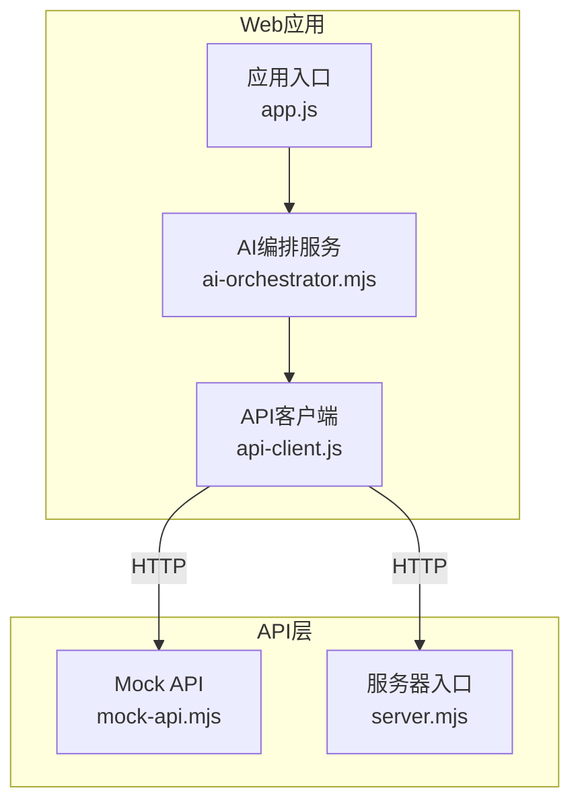
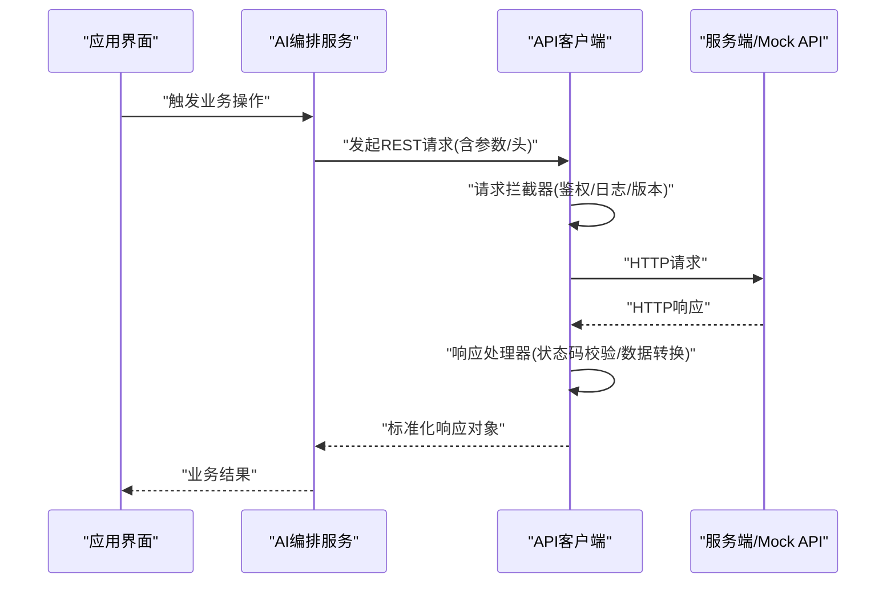
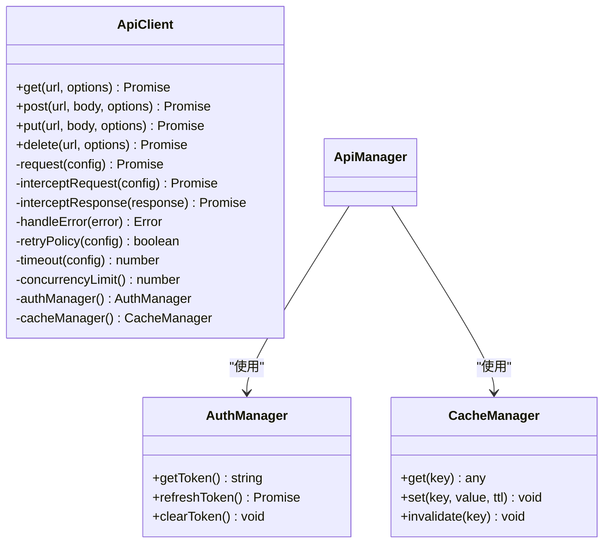
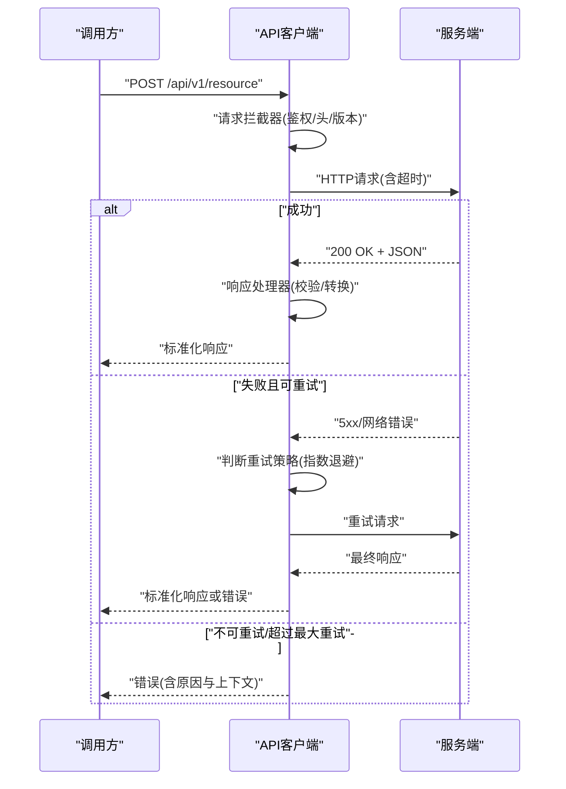
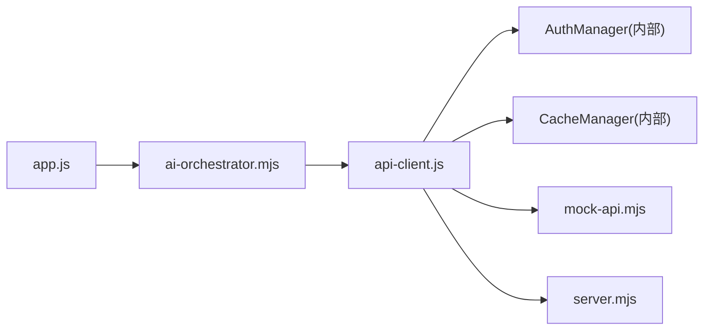

# API客户端封装

<cite>
**本文引用的文件**   
- [api-client.js](file://apps/web/services/api-client.js)
- [ai-orchestrator.mjs](file://apps/web/services/ai-orchestrator.mjs)
- [mock-api.mjs](file://apps/web/api/mock-api.mjs)
- [server.mjs](file://apps/web/server.mjs)
- [app.js](file://apps/web/app.js)
- [package.json](file://package.json)
</cite>

## 目录
1. [简介](#简介)
2. [项目结构](#项目结构)
3. [核心组件](#核心组件)
4. [架构总览](#架构总览)
5. [详细组件分析](#详细组件分析)
6. [依赖关系分析](#依赖关系分析)
7. [性能考虑](#性能考虑)
8. [故障排查指南](#故障排查指南)
9. [结论](#结论)
10. [附录](#附录)

## 简介
本文件面向API客户端封装，聚焦HTTP请求的封装实现与RESTful调用模式。文档覆盖请求拦截器、响应处理器、错误处理机制、自动重试策略、超时配置、并发控制、认证令牌管理、请求头设置、响应数据转换、API版本兼容、缓存策略与性能优化技巧，并提供完整的请求/响应示例与错误处理最佳实践。该文档基于仓库中的Web端服务与API客户端代码进行分析与总结，帮助读者快速理解并正确使用API客户端。

## 项目结构
本项目在Web端通过一个独立的API客户端模块封装HTTP通信，上层业务服务（如AI编排）通过该客户端发起RESTful请求。服务端提供Mock API用于本地开发与测试，同时存在真实服务器入口用于集成运行。

图表来源
- [app.js](file://apps/web/app.js)
- [api-client.js](file://apps/web/services/api-client.js)
- [ai-orchestrator.mjs](file://apps/web/services/ai-orchestrator.mjs)
- [mock-api.mjs](file://apps/web/api/mock-api.mjs)
- [server.mjs](file://apps/web/server.mjs)

章节来源
- [app.js](file://apps/web/app.js)
- [api-client.js](file://apps/web/services/api-client.js)
- [ai-orchestrator.mjs](file://apps/web/services/ai-orchestrator.mjs)
- [mock-api.mjs](file://apps/web/api/mock-api.mjs)
- [server.mjs](file://apps/web/server.mjs)

## 核心组件
- API客户端：统一封装HTTP请求，提供请求拦截器、响应处理器、错误处理、重试、超时、并发控制、认证令牌注入、请求头设置、响应数据转换、版本兼容与缓存等能力。
- AI编排服务：作为业务侧调用方，使用API客户端发起RESTful请求，处理业务逻辑与结果聚合。
- Mock API：提供本地开发可用的模拟接口，便于前端联调与测试。
- 服务器入口：承载真实后端服务或代理转发，供集成环境使用。

章节来源
- [api-client.js](file://apps/web/services/api-client.js)
- [ai-orchestrator.mjs](file://apps/web/services/ai-orchestrator.mjs)
- [mock-api.mjs](file://apps/web/api/mock-api.mjs)
- [server.mjs](file://apps/web/server.mjs)

## 架构总览
API客户端位于Web应用与服务端之间，承担网络通信的职责。它对外暴露简洁的RESTful方法（GET/POST/PUT/DELETE等），对内统一管理请求生命周期（拦截、发送、响应、转换、错误处理、重试、缓存）。

图表来源
- [api-client.js](file://apps/web/services/api-client.js)
- [ai-orchestrator.mjs](file://apps/web/services/ai-orchestrator.mjs)
- [mock-api.mjs](file://apps/web/api/mock-api.mjs)
- [server.mjs](file://apps/web/server.mjs)

## 详细组件分析

### API客户端（api-client.js）
职责与能力
- 请求拦截器：统一注入认证令牌、请求头、API版本、调试信息；支持请求体序列化与签名。
- 响应处理器：校验HTTP状态码，解析JSON/表单/流式响应，进行数据转换与规范化。
- 错误处理：区分网络错误、超时、服务端错误、业务错误；提供可重试错误分类与降级策略。
- 自动重试：对幂等请求（GET/HEAD/OPTIONS）或特定状态码（如5xx）进行指数退避重试；支持最大重试次数与间隔上限。
- 超时配置：全局与单请求级超时；支持读写超时与连接超时。
- 并发控制：限制并发请求数，避免雪崩；支持队列与优先级。
- 认证令牌管理：获取、刷新、缓存与失效处理；支持Bearer Token与自定义Header。
- 请求头设置：Content-Type、Accept、Authorization、X-API-Version等。
- 响应数据转换：统一包装为{code, data, message}结构，支持字段映射与类型校验。
- API版本兼容：通过路径前缀或Header传递版本；支持向后兼容与弃用提示。
- 缓存策略：按URL+参数生成缓存键；支持内存缓存与过期时间；可选Etag/Last-Modified协商。
- 性能优化：请求去重、压缩、连接复用、懒加载、按需重试。

关键流程（类图）

图表来源
- [api-client.js](file://apps/web/services/api-client.js)

关键流程（序列图：带重试与超时）

图表来源
- [api-client.js](file://apps/web/services/api-client.js)

章节来源
- [api-client.js](file://apps/web/services/api-client.js)

### AI编排服务（ai-orchestrator.mjs）
职责与能力
- 作为业务层调用API客户端，组织请求参数与响应结果。
- 处理业务异常与用户提示，必要时触发重试或降级。
- 维护会话上下文与资源清理。

章节来源
- [ai-orchestrator.mjs](file://apps/web/services/ai-orchestrator.mjs)

### Mock API（mock-api.mjs）
职责与能力
- 提供本地开发可用的模拟接口，返回固定或随机数据。
- 模拟延迟、错误与边界条件，便于测试API客户端的重试、超时与错误处理。

章节来源
- [mock-api.mjs](file://apps/web/api/mock-api.mjs)

### 服务器入口（server.mjs）
职责与能力
- 启动HTTP服务，路由到具体API处理器。
- 在生产环境中对接真实后端或代理转发。

章节来源
- [server.mjs](file://apps/web/server.mjs)

## 依赖关系分析
API客户端依赖认证管理器与缓存管理器；AI编排服务依赖API客户端；Mock API与服务器入口为外部依赖。

图表来源
- [app.js](file://apps/web/app.js)
- [ai-orchestrator.mjs](file://apps/web/services/ai-orchestrator.mjs)
- [api-client.js](file://apps/web/services/api-client.js)
- [mock-api.mjs](file://apps/web/api/mock-api.mjs)
- [server.mjs](file://apps/web/server.mjs)

章节来源
- [package.json](file://package.json)
- [app.js](file://apps/web/app.js)
- [ai-orchestrator.mjs](file://apps/web/services/ai-orchestrator.mjs)
- [api-client.js](file://apps/web/services/api-client.js)
- [mock-api.mjs](file://apps/web/api/mock-api.mjs)
- [server.mjs](file://apps/web/server.mjs)

## 性能考虑
- 请求去重：相同URL+参数的并发请求合并，减少重复网络开销。
- 连接复用：保持长连接，降低握手成本。
- 压缩传输：启用Gzip/Br压缩，减小响应体积。
- 缓存策略：合理使用内存缓存与协商缓存（Etag/Last-Modified），降低服务端压力。
- 并发控制：限制最大并发数，避免阻塞与OOM。
- 超时与重试：合理设置超时与重试策略，提升用户体验与系统稳定性。
- 懒加载与按需请求：仅在需要时发起请求，减少不必要流量。

[本节为通用指导，不直接分析具体文件]

## 故障排查指南
常见问题与定位步骤
- 网络错误：检查DNS、代理、防火墙；确认服务端可达性与端口开放。
- 超时错误：调整超时阈值；检查服务端响应时间与负载情况。
- 认证失败：确认令牌有效性与刷新逻辑；检查Authorization头是否正确注入。
- 版本不兼容：核对X-API-Version或路径前缀；查看服务端兼容性说明。
- 缓存问题：清除缓存键；验证TTL与失效策略；检查Etag协商。
- 重试风暴：降低重试频率与最大次数；增加退避间隔；引入熔断。

建议的错误处理最佳实践
- 区分错误类型：网络、超时、服务端、业务错误分别处理。
- 提供用户友好提示：将技术错误转换为可读消息。
- 记录上下文：包含URL、方法、状态码、耗时、重试次数等。
- 降级与兜底：在失败时返回默认值或离线数据。
- 监控与告警：上报关键错误指标，便于追踪与修复。

章节来源
- [api-client.js](file://apps/web/services/api-client.js)

## 结论
API客户端封装通过统一的请求拦截、响应处理、错误处理、重试、超时、并发控制、认证、缓存与版本兼容等能力，显著提升了Web应用与服务端交互的可靠性与可维护性。结合合理的性能优化与故障排查策略，可在复杂网络环境下提供稳定高效的RESTful调用体验。

[本节为总结，不直接分析具体文件]

## 附录

### RESTful调用模式与示例
- GET：查询资源，幂等，无副作用。
- POST：创建资源，非幂等。
- PUT：更新资源，幂等。
- DELETE：删除资源，幂等。

请求示例（路径参考）
- GET /api/v1/resources/{id}
- POST /api/v1/resources
- PUT /api/v1/resources/{id}
- DELETE /api/v1/resources/{id}

响应示例（标准化结构）
- 成功：{ code: 200, data: {...}, message: "ok" }
- 失败：{ code: 4xx/5xx, data: null, message: "错误描述" }

章节来源
- [api-client.js](file://apps/web/services/api-client.js)
- [ai-orchestrator.mjs](file://apps/web/services/ai-orchestrator.mjs)
- [mock-api.mjs](file://apps/web/api/mock-api.mjs)

### 配置项参考
- 超时：connectTimeout、readTimeout、writeTimeout
- 重试：maxRetries、backoffStrategy、retryableStatusCodes
- 并发：maxConcurrency、queueSize
- 缓存：enabled、ttl、useEtag
- 认证：tokenProvider、refreshOnExpiry
- 版本：apiVersion、headerName、pathPrefix

章节来源
- [api-client.js](file://apps/web/services/api-client.js)