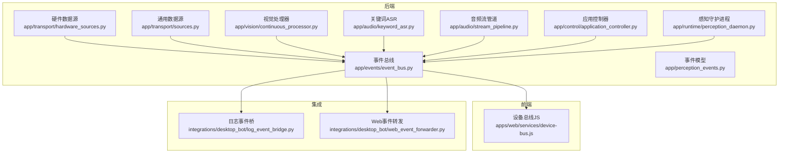
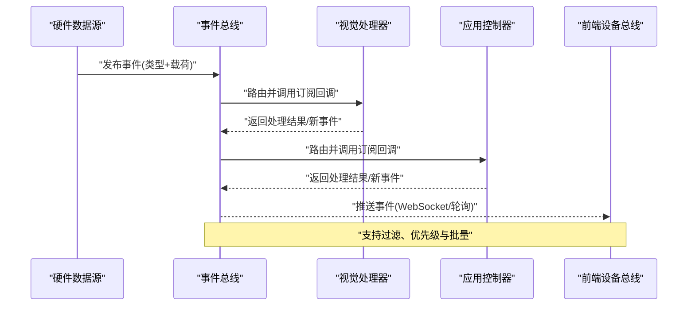
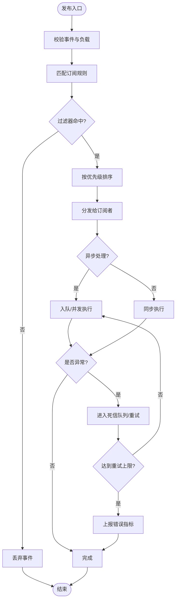
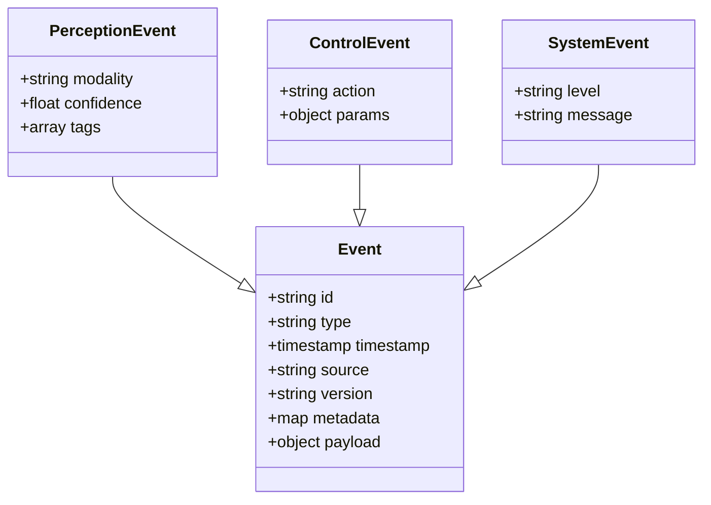
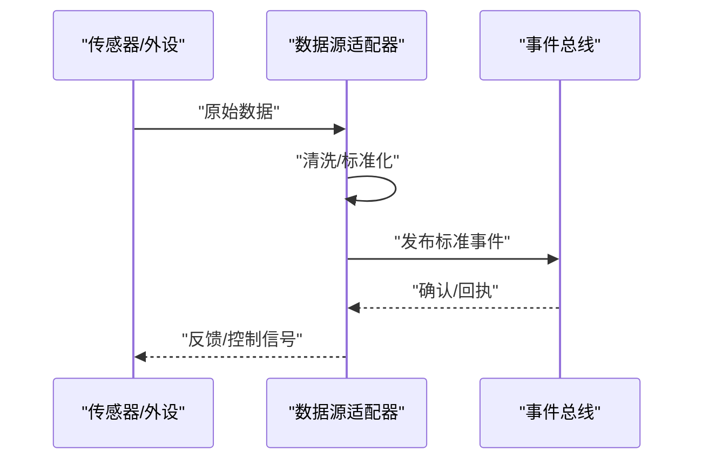
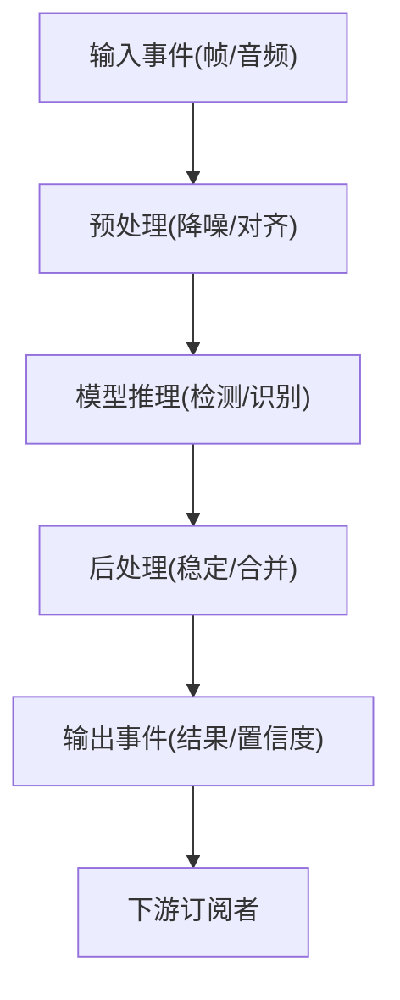
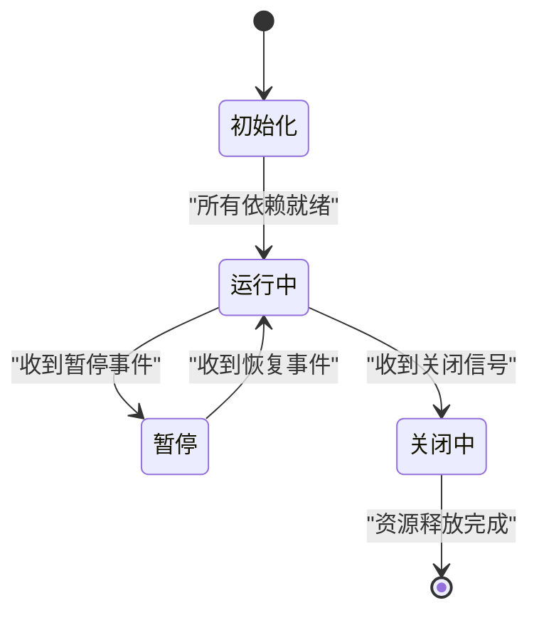
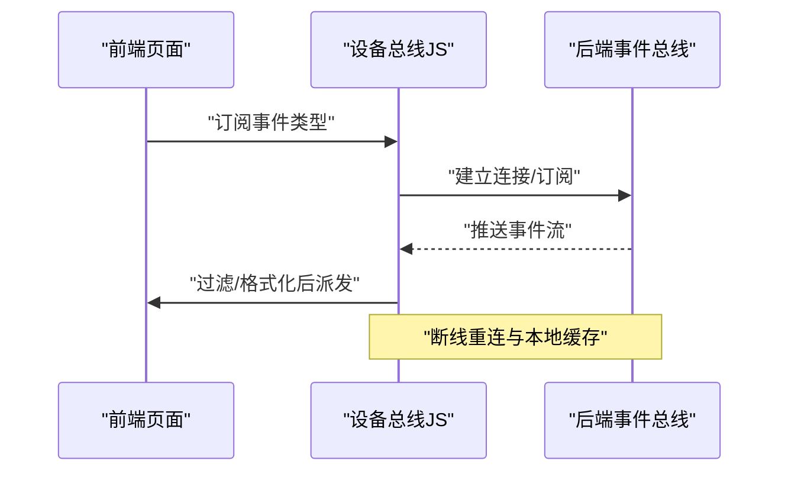
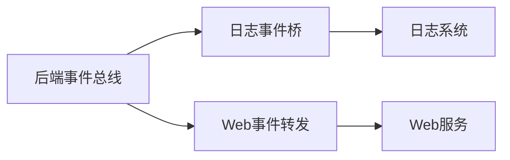
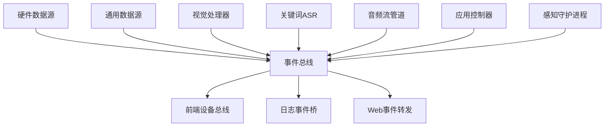

# 设备事件总线

<cite>
**本文引用的文件**   
- [event_bus.py](file://app/events/event_bus.py)
- [perception_events.py](file://app/perception_events.py)
- [hardware_sources.py](file://app/transport/hardware_sources.py)
- [sources.py](file://app/transport/sources.py)
- [continuous_processor.py](file://app/vision/continuous_processor.py)
- [keyword_asr.py](file://app/audio/keyword_asr.py)
- [stream_pipeline.py](file://app/audio/stream_pipeline.py)
- [application_controller.py](file://app/control/application_controller.py)
- [perception_daemon.py](file://app/runtime/perception_daemon.py)
- [device-bus.js](file://apps/web/services/device-bus.js)
- [log_event_bridge.py](file://integrations/desktop_bot/log_event_bridge.py)
- [web_event_forwarder.py](file://integrations/desktop_bot/web_event_forwarder.py)
</cite>

## 目录
1. [简介](#简介)
2. [项目结构](#项目结构)
3. [核心组件](#核心组件)
4. [架构总览](#架构总览)
5. [详细组件分析](#详细组件分析)
6. [依赖关系分析](#依赖关系分析)
7. [性能考量](#性能考量)
8. [故障排查指南](#故障排查指南)
9. [结论](#结论)
10. [附录](#附录)

## 简介
本文件围绕“设备事件总线”展开，系统化阐述其事件驱动架构的实现与使用。内容涵盖：
- 事件订阅、发布与路由机制
- 事件类型定义与消息格式规范
- 生命周期管理与异步处理模式
- 错误传播与恢复策略
- 性能优化（过滤、优先级、批量）
- 调试与监控方法
- 常见问题排查

该文档旨在帮助开发者快速理解并正确使用设备事件总线，同时为运维与排障提供可操作指引。

## 项目结构
设备事件总线位于后端 Python 应用与前端 Web 服务之间，贯穿感知、音频、视觉、控制与传输等子系统。关键位置如下：
- 后端事件总线核心：app/events/event_bus.py
- 事件模型与领域事件：app/perception_events.py
- 硬件数据源接入：app/transport/hardware_sources.py, app/transport/sources.py
- 感知与流式处理：app/vision/continuous_processor.py, app/audio/keyword_asr.py, app/audio/stream_pipeline.py
- 控制与运行时：app/control/application_controller.py, app/runtime/perception_daemon.py
- 前端设备总线：apps/web/services/device-bus.js
- 集成桥接：integrations/desktop_bot/log_event_bridge.py, integrations/desktop_bot/web_event_forwarder.py

**图示来源** 
- [event_bus.py](file://app/events/event_bus.py)
- [perception_events.py](file://app/perception_events.py)
- [hardware_sources.py](file://app/transport/hardware_sources.py)
- [sources.py](file://app/transport/sources.py)
- [continuous_processor.py](file://app/vision/continuous_processor.py)
- [keyword_asr.py](file://app/audio/keyword_asr.py)
- [stream_pipeline.py](file://app/audio/stream_pipeline.py)
- [application_controller.py](file://app/control/application_controller.py)
- [perception_daemon.py](file://app/runtime/perception_daemon.py)
- [device-bus.js](file://apps/web/services/device-bus.js)
- [log_event_bridge.py](file://integrations/desktop_bot/log_event_bridge.py)
- [web_event_forwarder.py](file://integrations/desktop_bot/web_event_forwarder.py)

**章节来源**
- [event_bus.py](file://app/events/event_bus.py)
- [perception_events.py](file://app/perception_events.py)
- [hardware_sources.py](file://app/transport/hardware_sources.py)
- [sources.py](file://app/transport/sources.py)
- [continuous_processor.py](file://app/vision/continuous_processor.py)
- [keyword_asr.py](file://app/audio/keyword_asr.py)
- [stream_pipeline.py](file://app/audio/stream_pipeline.py)
- [application_controller.py](file://app/control/application_controller.py)
- [perception_daemon.py](file://app/runtime/perception_daemon.py)
- [device-bus.js](file://apps/web/services/device-bus.js)
- [log_event_bridge.py](file://integrations/desktop_bot/log_event_bridge.py)
- [web_event_forwarder.py](file://integrations/desktop_bot/web_event_forwarder.py)

## 核心组件
- 事件总线（Event Bus）
  - 职责：统一的事件注册、分发、路由、过滤、优先级与批量处理；提供同步/异步回调支持；管理订阅者生命周期。
  - 关键点：线程安全、背压控制、错误隔离、可扩展的过滤器与中间件。
- 事件模型（Perception Events）
  - 职责：定义领域事件类型、字段规范、版本兼容与校验规则。
  - 关键点：强类型字段、默认值、扩展字段保留、序列化/反序列化。
- 数据源（Hardware/General Sources）
  - 职责：从硬件或通用通道采集原始数据，转换为标准事件并发布到总线。
  - 关键点：采样率适配、缓冲与去抖、异常上报。
- 处理器（Vision/ASR/Stream Pipeline）
  - 职责：消费事件进行计算与推理，产出新事件回写总线。
  - 关键点：流水线化、状态保持、失败重试与降级。
- 控制器与守护进程（Controller/Daemon）
  - 职责：编排子系统启动、事件流调度、资源管理与优雅关闭。
  - 关键点：生命周期钩子、健康检查、配置热更新。
- 前端设备总线（Device Bus JS）
  - 职责：浏览器端事件订阅、重连、本地缓存与UI联动。
  - 关键点：连接状态机、断线重连、消息去重与节流。
- 集成桥（Log/Web Forwarder）
  - 职责：将后端事件桥接到日志系统与Web层，便于观测与跨进程通信。
  - 关键点：幂等性、顺序保证、限流与熔断。

**章节来源**
- [event_bus.py](file://app/events/event_bus.py)
- [perception_events.py](file://app/perception_events.py)
- [hardware_sources.py](file://app/transport/hardware_sources.py)
- [sources.py](file://app/transport/sources.py)
- [continuous_processor.py](file://app/vision/continuous_processor.py)
- [keyword_asr.py](file://app/audio/keyword_asr.py)
- [stream_pipeline.py](file://app/audio/stream_pipeline.py)
- [application_controller.py](file://app/control/application_controller.py)
- [perception_daemon.py](file://app/runtime/perception_daemon.py)
- [device-bus.js](file://apps/web/services/device-bus.js)
- [log_event_bridge.py](file://integrations/desktop_bot/log_event_bridge.py)
- [web_event_forwarder.py](file://integrations/desktop_bot/web_event_forwarder.py)

## 架构总览
设备事件总线采用“生产者-消费者”解耦模式，通过统一的事件通道实现跨模块通信。典型流程包括：
- 生产者（硬件/传感器/算法）生成事件并发布到总线
- 总线根据订阅规则进行过滤、排序与路由
- 消费者（处理器/控制器/外部系统）异步消费事件并产生副作用
- 错误在消费者侧隔离，避免污染上游生产链路
- 前端通过设备总线订阅实时事件，驱动界面与交互

**图示来源** 
- [event_bus.py](file://app/events/event_bus.py)
- [hardware_sources.py](file://app/transport/hardware_sources.py)
- [continuous_processor.py](file://app/vision/continuous_processor.py)
- [application_controller.py](file://app/control/application_controller.py)
- [device-bus.js](file://apps/web/services/device-bus.js)

## 详细组件分析

### 事件总线（Event Bus）
- 订阅机制
  - 支持按事件类型精确订阅与通配符订阅
  - 支持基于元数据的过滤器（如来源、标签、时间窗口）
  - 支持优先级队列，高优先级先执行
- 发布机制
  - 同步与异步两种发布模式
  - 批量发布减少锁竞争与上下文切换
  - 支持幂等键，避免重复处理
- 路由与分发
  - 内部路由表维护订阅者与匹配规则
  - 分发时按优先级排序，确保关键路径优先
  - 支持拦截器/中间件用于审计、转换与限流
- 生命周期管理
  - 订阅者注册/注销、健康检查、优雅关闭
  - 事件过期与清理策略，防止内存泄漏
- 错误处理
  - 消费者异常隔离，不影响其他订阅者
  - 死信队列与重试策略（指数退避）
  - 错误指标上报与告警

**图示来源** 
- [event_bus.py](file://app/events/event_bus.py)

**章节来源**
- [event_bus.py](file://app/events/event_bus.py)

### 事件模型（Perception Events）
- 事件类型
  - 感知类：语音识别、关键词检测、图像帧、手势识别、温度/热成像等
  - 控制类：设备开关、模式切换、任务下发
  - 系统类：心跳、健康检查、错误上报
- 消息格式
  - 固定字段：事件ID、类型、时间戳、来源、版本
  - 载荷字段：业务相关数据，支持扩展
  - 元数据：标签、优先级、过滤键、批处理ID
- 校验与兼容
  - 必填字段校验、类型约束、范围限制
  - 向后兼容策略：新增可选字段、弃用标记
- 序列化
  - JSON/Protobuf等格式选择，考虑体积与解析性能

**图示来源** 
- [perception_events.py](file://app/perception_events.py)

**章节来源**
- [perception_events.py](file://app/perception_events.py)

### 数据源（Hardware/General Sources）
- 硬件数据源
  - 采集传感器/摄像头/麦克风数据，转换为标准事件
  - 支持采样率控制、去抖、丢包补偿
  - 异常上报与自动恢复
- 通用数据源
  - 从文件或网络读取数据，封装为标准事件
  - 支持分页、增量拉取与断点续传

**图示来源** 
- [hardware_sources.py](file://app/transport/hardware_sources.py)
- [sources.py](file://app/transport/sources.py)
- [event_bus.py](file://app/events/event_bus.py)

**章节来源**
- [hardware_sources.py](file://app/transport/hardware_sources.py)
- [sources.py](file://app/transport/sources.py)

### 处理器（Vision/ASR/Stream Pipeline）
- 视觉处理器
  - 订阅图像帧事件，执行目标检测/手势识别
  - 输出检测结果事件，附带置信度与边界框
  - 支持滑动窗口与稳定性滤波
- 关键词ASR
  - 订阅音频流事件，进行关键词检测
  - 输出关键词命中事件，附带时间戳与片段
- 音频流管道
  - 串联VAD、降噪、ASR等阶段
  - 支持背压与动态速率调整

**图示来源** 
- [continuous_processor.py](file://app/vision/continuous_processor.py)
- [keyword_asr.py](file://app/audio/keyword_asr.py)
- [stream_pipeline.py](file://app/audio/stream_pipeline.py)

**章节来源**
- [continuous_processor.py](file://app/vision/continuous_processor.py)
- [keyword_asr.py](file://app/audio/keyword_asr.py)
- [stream_pipeline.py](file://app/audio/stream_pipeline.py)

### 控制器与守护进程（Controller/Daemon）
- 应用控制器
  - 编排各子系统启动顺序与依赖
  - 监听关键事件，触发状态迁移
  - 提供配置热更新与功能开关
- 感知守护进程
  - 管理感知流水线生命周期
  - 监控资源占用与健康状态
  - 优雅关闭与数据持久化

**图示来源** 
- [application_controller.py](file://app/control/application_controller.py)
- [perception_daemon.py](file://app/runtime/perception_daemon.py)

**章节来源**
- [application_controller.py](file://app/control/application_controller.py)
- [perception_daemon.py](file://app/runtime/perception_daemon.py)

### 前端设备总线（Device Bus JS）
- 订阅与重连
  - 支持WebSocket/轮询，断线自动重连
  - 本地缓存未消费事件，恢复后补发
- 过滤与节流
  - 客户端侧过滤不必要事件
  - UI渲染节流与防抖
- 错误处理
  - 连接异常提示与降级显示
  - 重试与超时策略

**图示来源** 
- [device-bus.js](file://apps/web/services/device-bus.js)
- [event_bus.py](file://app/events/event_bus.py)

**章节来源**
- [device-bus.js](file://apps/web/services/device-bus.js)

### 集成桥（Log/Web Forwarder）
- 日志事件桥
  - 将后端事件写入结构化日志，便于检索与分析
  - 支持采样与脱敏
- Web事件转发
  - 将后端事件转发至Web层，供多端共享
  - 支持广播与点对点转发

**图示来源** 
- [log_event_bridge.py](file://integrations/desktop_bot/log_event_bridge.py)
- [web_event_forwarder.py](file://integrations/desktop_bot/web_event_forwarder.py)
- [event_bus.py](file://app/events/event_bus.py)

**章节来源**
- [log_event_bridge.py](file://integrations/desktop_bot/log_event_bridge.py)
- [web_event_forwarder.py](file://integrations/desktop_bot/web_event_forwarder.py)

## 依赖关系分析
- 松耦合设计
  - 事件总线作为中心枢纽，模块间仅依赖事件契约
  - 数据源与处理器通过事件解耦，便于替换与扩展
- 直接依赖
  - 数据源依赖事件总线发布接口
  - 处理器依赖事件总线订阅接口
  - 控制器依赖事件总线进行状态编排
- 间接依赖
  - 前端通过设备总线JS间接依赖后端事件模型
  - 集成桥通过事件总线间接依赖各子系统

**图示来源** 
- [event_bus.py](file://app/events/event_bus.py)
- [hardware_sources.py](file://app/transport/hardware_sources.py)
- [sources.py](file://app/transport/sources.py)
- [continuous_processor.py](file://app/vision/continuous_processor.py)
- [keyword_asr.py](file://app/audio/keyword_asr.py)
- [stream_pipeline.py](file://app/audio/stream_pipeline.py)
- [application_controller.py](file://app/control/application_controller.py)
- [perception_daemon.py](file://app/runtime/perception_daemon.py)
- [device-bus.js](file://apps/web/services/device-bus.js)
- [log_event_bridge.py](file://integrations/desktop_bot/log_event_bridge.py)
- [web_event_forwarder.py](file://integrations/desktop_bot/web_event_forwarder.py)

**章节来源**
- [event_bus.py](file://app/events/event_bus.py)
- [hardware_sources.py](file://app/transport/hardware_sources.py)
- [sources.py](file://app/transport/sources.py)
- [continuous_processor.py](file://app/vision/continuous_processor.py)
- [keyword_asr.py](file://app/audio/keyword_asr.py)
- [stream_pipeline.py](file://app/audio/stream_pipeline.py)
- [application_controller.py](file://app/control/application_controller.py)
- [perception_daemon.py](file://app/runtime/perception_daemon.py)
- [device-bus.js](file://apps/web/services/device-bus.js)
- [log_event_bridge.py](file://integrations/desktop_bot/log_event_bridge.py)
- [web_event_forwarder.py](file://integrations/desktop_bot/web_event_forwarder.py)

## 性能考量
- 事件过滤
  - 在服务端与客户端均实施过滤，减少无效传输与处理
  - 使用索引化的订阅规则，提升匹配效率
- 优先级处理
  - 关键事件（如错误、控制指令）优先处理
  - 非关键事件（如遥测）批量合并与延迟处理
- 批量操作
  - 聚合多个小事件为批次，降低锁竞争与序列化开销
  - 支持事务性提交，保证一致性
- 异步处理
  - 使用协程/线程池并行处理，提高吞吐
  - 背压控制，防止消费者过载
- 资源管理
  - 合理设置缓冲区大小与超时
  - 定期清理过期订阅与事件

[本节为通用指导，不直接分析具体文件]

## 故障排查指南
- 常见问题
  - 事件丢失：检查订阅规则、过滤器与死信队列
  - 事件重复：确认幂等键与去重逻辑
  - 处理延迟：观察消费者队列长度与CPU/IO瓶颈
  - 连接中断：检查前端重连策略与后端健康检查
- 诊断工具
  - 启用事件追踪ID，关联上下游处理链路
  - 收集关键指标：发布速率、消费速率、错误率、延迟分布
  - 导出事件样本，进行离线分析与回放
- 修复建议
  - 调整消费者并发与批大小
  - 优化过滤器与路由规则
  - 增加重试与熔断策略
  - 完善日志与告警阈值

**章节来源**
- [event_bus.py](file://app/events/event_bus.py)
- [device-bus.js](file://apps/web/services/device-bus.js)
- [log_event_bridge.py](file://integrations/desktop_bot/log_event_bridge.py)
- [web_event_forwarder.py](file://integrations/desktop_bot/web_event_forwarder.py)

## 结论
设备事件总线通过统一的事件契约与灵活的订阅路由，实现了模块间的松耦合与高内聚。结合事件模型、异步处理、错误隔离与性能优化策略，能够支撑复杂的设备交互场景。建议在开发过程中严格遵循事件规范，持续监控与调优，以确保系统的稳定性与可扩展性。

[本节为总结性内容，不直接分析具体文件]

## 附录
- 最佳实践
  - 明确事件语义与版本兼容性
  - 设计幂等与重试策略
  - 实施端到端的追踪与监控
- 参考实现
  - 后端事件总线：app/events/event_bus.py
  - 事件模型：app/perception_events.py
  - 前端设备总线：apps/web/services/device-bus.js
  - 集成桥：integrations/desktop_bot/log_event_bridge.py, integrations/desktop_bot/web_event_forwarder.py

[本节为补充信息，不直接分析具体文件]