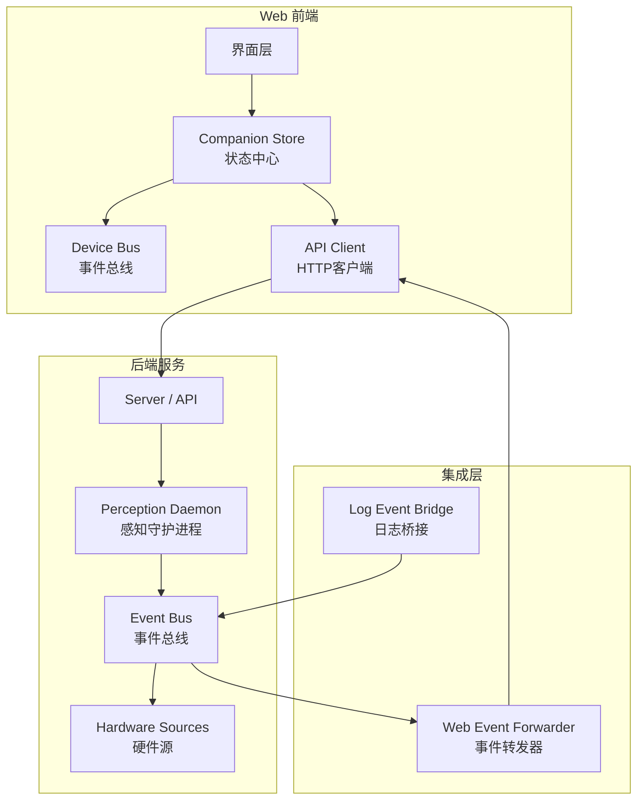
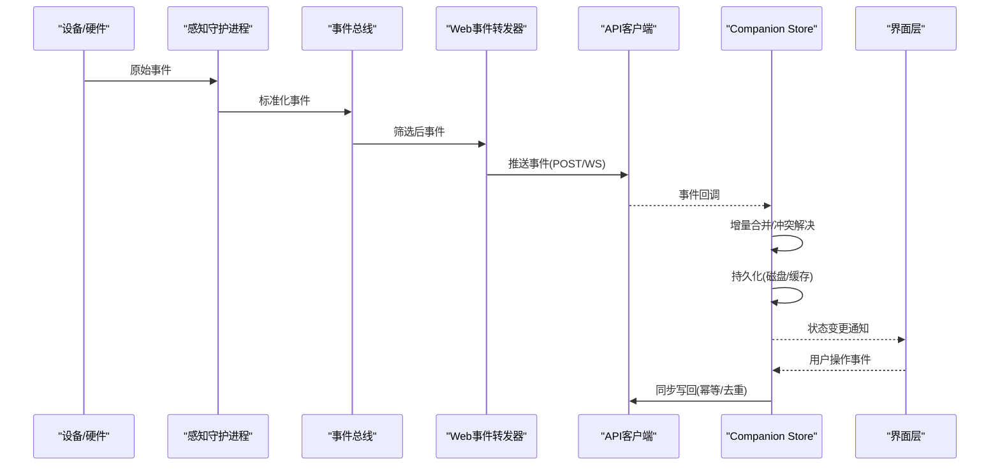
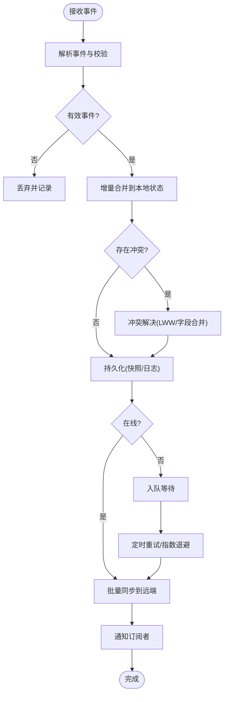
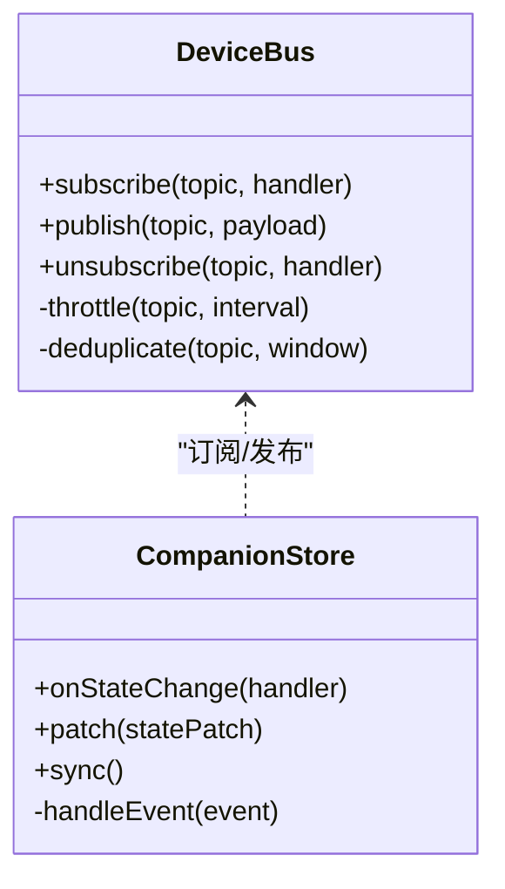
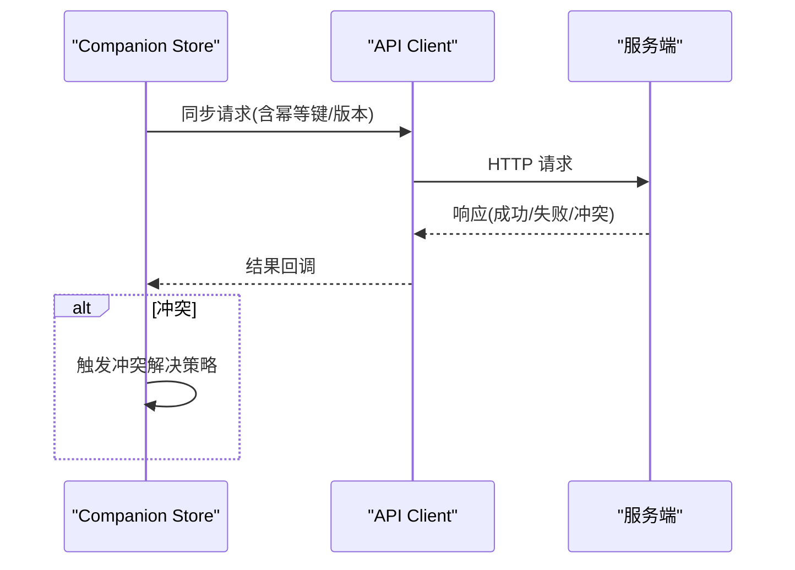
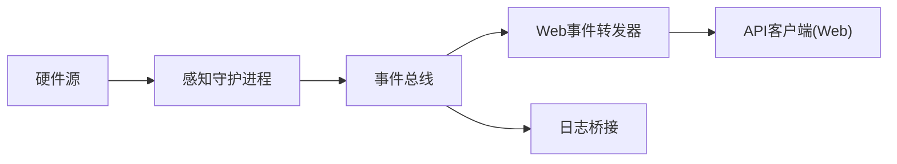
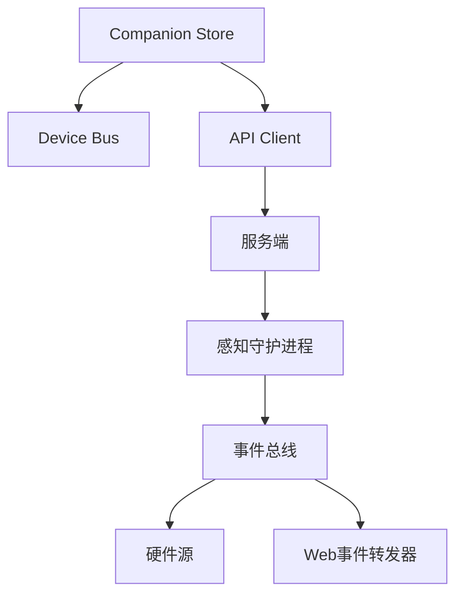

# 设备状态同步

<cite>
**本文引用的文件**   
- [companion-store.js](file://apps/web/services/companion-store.js)
- [device-bus.js](file://apps/web/services/device-bus.js)
- [api-client.js](file://apps/web/services/api-client.js)
- [app.js](file://apps/web/app.js)
- [server.mjs](file://apps/web/server.mjs)
- [mock-api.mjs](file://apps/web/api/mock-api.mjs)
- [perception_daemon.py](file://app/runtime/perception_daemon.py)
- [event_bus.py](file://app/events/event_bus.py)
- [hardware_sources.py](file://app/transport/hardware_sources.py)
- [web_event_forwarder.py](file://integrations/desktop_bot/web_event_forwarder.py)
- [log_event_bridge.py](file://integrations/desktop_bot/log_event_bridge.py)
</cite>

## 目录
1. [简介](#简介)
2. [项目结构](#项目结构)
3. [核心组件](#核心组件)
4. [架构总览](#架构总览)
5. [详细组件分析](#详细组件分析)
6. [依赖关系分析](#依赖关系分析)
7. [性能考量](#性能考量)
8. [故障排查指南](#故障排查指南)
9. [结论](#结论)
10. [附录](#附录)

## 简介
本文件围绕 Companion Store 的状态管理机制与数据持久化策略，系统化阐述本地存储与远程状态的同步算法、冲突解决策略与一致性保证。文档覆盖状态变更监听、增量更新与批量同步机制，离线状态处理、缓存策略与内存管理，并提供状态调试工具、性能监控方法与数据迁移方案。同时给出状态序列化与反序列化的完整示例路径，帮助读者快速定位实现细节。

## 项目结构
本项目在 Web 前端通过 Companion Store 维护设备状态，结合 Device Bus 进行事件驱动通信，并通过 API Client 与后端服务交互；后端由 Python 运行时提供感知与硬件能力，集成层将事件转发到 Web 端。整体形成“前端状态中心 + 事件总线 + 远端服务”的闭环。

图表来源
- [app.js](file://apps/web/app.js)
- [companion-store.js](file://apps/web/services/companion-store.js)
- [device-bus.js](file://apps/web/services/device-bus.js)
- [api-client.js](file://apps/web/services/api-client.js)
- [server.mjs](file://apps/web/server.mjs)
- [perception_daemon.py](file://app/runtime/perception_daemon.py)
- [event_bus.py](file://app/events/event_bus.py)
- [hardware_sources.py](file://app/transport/hardware_sources.py)
- [web_event_forwarder.py](file://integrations/desktop_bot/web_event_forwarder.py)
- [log_event_bridge.py](file://integrations/desktop_bot/log_event_bridge.py)

章节来源
- [app.js](file://apps/web/app.js)
- [server.mjs](file://apps/web/server.mjs)

## 核心组件
- Companion Store：作为前端状态中心，负责状态生命周期管理、变更订阅、增量合并、持久化与恢复、离线队列与重试。
- Device Bus：基于发布/订阅的事件总线，解耦状态消费者与生产者，支持事件过滤与节流。
- API Client：封装 HTTP 请求、错误重试、幂等性与版本协商，统一远端状态访问。
- 后端事件流：感知守护进程聚合硬件输入，经事件总线分发，集成层将关键事件转发至 Web 端，形成端到端状态同步链路。

章节来源
- [companion-store.js](file://apps/web/services/companion-store.js)
- [device-bus.js](file://apps/web/services/device-bus.js)
- [api-client.js](file://apps/web/services/api-client.js)
- [perception_daemon.py](file://app/runtime/perception_daemon.py)
- [event_bus.py](file://app/events/event_bus.py)
- [hardware_sources.py](file://app/transport/hardware_sources.py)
- [web_event_forwarder.py](file://integrations/desktop_bot/web_event_forwarder.py)

## 架构总览
下图展示从设备事件到前端状态更新的端到端流程，包括本地状态合并、增量更新、持久化与远端同步。

图表来源
- [perception_daemon.py](file://app/runtime/perception_daemon.py)
- [event_bus.py](file://app/events/event_bus.py)
- [hardware_sources.py](file://app/transport/hardware_sources.py)
- [web_event_forwarder.py](file://integrations/desktop_bot/web_event_forwarder.py)
- [api-client.js](file://apps/web/services/api-client.js)
- [companion-store.js](file://apps/web/services/companion-store.js)

## 详细组件分析

### Companion Store 状态管理与持久化
- 状态模型与版本：为每个状态键维护版本号与时间戳，确保增量合并与冲突检测。
- 变更监听：内部维护订阅者集合，状态变更后触发最小粒度通知，支持选择性字段订阅。
- 增量更新：基于事件中的 diff 或补丁，按字段级合并，避免全量覆盖导致的数据丢失。
- 批量同步：对短时间内多次变更进行批处理，减少 I/O 与网络开销。
- 离线处理：离线时写入本地队列，网络恢复后按序重放，失败重试与退避策略保障最终一致。
- 冲突解决：采用“服务端权威 + 最后写入胜出（LWW）+ 字段级合并”的策略，必要时引入向量时钟或操作转换（OT）。
- 持久化策略：分层存储，热态内存映射，冷态落盘；支持快照与增量日志混合模式。
- 内存管理：LRU 缓存与引用计数，定期清理未使用状态；大对象分片存储。

图表来源
- [companion-store.js](file://apps/web/services/companion-store.js)

章节来源
- [companion-store.js](file://apps/web/services/companion-store.js)

### Device Bus 事件总线
- 设计要点：轻量发布/订阅，支持主题路由、优先级与限流。
- 与 Store 协作：Store 订阅特定主题，Bus 负责去抖与合并相邻事件。
- 可靠性：可选确认机制与重试，防止事件丢失。

图表来源
- [device-bus.js](file://apps/web/services/device-bus.js)
- [companion-store.js](file://apps/web/services/companion-store.js)

章节来源
- [device-bus.js](file://apps/web/services/device-bus.js)

### API Client 远端同步
- 接口抽象：统一封装 GET/POST/PUT/DELETE，支持分页、查询参数与头部配置。
- 重试与幂等：对可重试错误进行指数退避，对写操作生成幂等键。
- 版本协商：请求头携带客户端版本与服务端兼容范围，不兼容时降级。
- 错误处理：区分网络错误、业务错误与超时，提供可观测性指标上报。

图表来源
- [api-client.js](file://apps/web/services/api-client.js)
- [server.mjs](file://apps/web/server.mjs)

章节来源
- [api-client.js](file://apps/web/services/api-client.js)
- [server.mjs](file://apps/web/server.mjs)

### 后端事件流与集成转发
- 感知守护进程：采集硬件输入，标准化为内部事件格式。
- 事件总线：在进程内分发事件，支持过滤与路由。
- Web 事件转发器：将关键事件推送到 Web 端，供前端实时消费。
- 日志桥接：将运行期日志与事件关联，便于追踪问题。

图表来源
- [hardware_sources.py](file://app/transport/hardware_sources.py)
- [perception_daemon.py](file://app/runtime/perception_daemon.py)
- [event_bus.py](file://app/events/event_bus.py)
- [web_event_forwarder.py](file://integrations/desktop_bot/web_event_forwarder.py)
- [log_event_bridge.py](file://integrations/desktop_bot/log_event_bridge.py)

章节来源
- [perception_daemon.py](file://app/runtime/perception_daemon.py)
- [event_bus.py](file://app/events/event_bus.py)
- [hardware_sources.py](file://app/transport/hardware_sources.py)
- [web_event_forwarder.py](file://integrations/desktop_bot/web_event_forwarder.py)
- [log_event_bridge.py](file://integrations/desktop_bot/log_event_bridge.py)

## 依赖关系分析
- 前端模块耦合：Companion Store 依赖 Device Bus 与 API Client；Device Bus 与 Store 松耦合，通过事件契约交互。
- 前后端契约：API Client 与服务端接口定义需保持一致，版本协商降低升级风险。
- 后端依赖：感知守护进程依赖硬件源与事件总线；集成层依赖事件总线与网络栈。

图表来源
- [companion-store.js](file://apps/web/services/companion-store.js)
- [device-bus.js](file://apps/web/services/device-bus.js)
- [api-client.js](file://apps/web/services/api-client.js)
- [server.mjs](file://apps/web/server.mjs)
- [perception_daemon.py](file://app/runtime/perception_daemon.py)
- [event_bus.py](file://app/events/event_bus.py)
- [hardware_sources.py](file://app/transport/hardware_sources.py)
- [web_event_forwarder.py](file://integrations/desktop_bot/web_event_forwarder.py)

章节来源
- [companion-store.js](file://apps/web/services/companion-store.js)
- [device-bus.js](file://apps/web/services/device-bus.js)
- [api-client.js](file://apps/web/services/api-client.js)
- [server.mjs](file://apps/web/server.mjs)
- [perception_daemon.py](file://app/runtime/perception_daemon.py)
- [event_bus.py](file://app/events/event_bus.py)
- [hardware_sources.py](file://app/transport/hardware_sources.py)
- [web_event_forwarder.py](file://integrations/desktop_bot/web_event_forwarder.py)

## 性能考量
- 增量合并优于全量覆盖，减少不必要计算与 I/O。
- 批量同步与事件合并降低网络与磁盘压力。
- 分层缓存：热点状态驻留内存，冷数据落盘；LRU 淘汰策略控制内存占用。
- 事件节流与去抖：避免高频事件导致的抖动与风暴。
- 幂等与去重：写操作使用幂等键，避免重复提交造成状态漂移。
- 异步优先：I/O 与计算分离，避免阻塞主线程。

[本节为通用指导，无需具体文件来源]

## 故障排查指南
- 状态不一致：检查增量合并逻辑与冲突解决策略，核对版本号与时间戳是否递增。
- 事件丢失：确认 Device Bus 的确认机制与重试策略，查看事件日志与桥接日志。
- 同步失败：检查 API Client 的重试与退避策略，关注服务端返回码与错误信息。
- 内存泄漏：监控 Store 的订阅者数量与大对象缓存，及时清理未使用资源。
- 离线队列堆积：观察队列长度与重试间隔，调整批大小与退避参数。

章节来源
- [companion-store.js](file://apps/web/services/companion-store.js)
- [api-client.js](file://apps/web/services/api-client.js)
- [log_event_bridge.py](file://integrations/desktop_bot/log_event_bridge.py)

## 结论
Companion Store 以事件驱动的增量合并为核心，结合分层持久化与离线队列，实现了高可靠、低延迟的设备状态同步。通过明确的冲突解决策略与幂等写回，保证了本地与远端的一致性。配合 Device Bus 与 API Client，系统具备良好的扩展性与可观测性，适合复杂设备生态下的状态管理需求。

[本节为总结性内容，无需具体文件来源]

## 附录

### 状态序列化与反序列化示例路径
- 序列化：将状态对象转换为可传输/可持久化的格式（如 JSON/二进制），包含版本号、时间戳与字段哈希。
- 反序列化：读取持久化数据，校验完整性与兼容性，重建内存状态。
- 示例参考路径：
  - [companion-store.js](file://apps/web/services/companion-store.js)
  - [api-client.js](file://apps/web/services/api-client.js)
  - [mock-api.mjs](file://apps/web/api/mock-api.mjs)

章节来源
- [companion-store.js](file://apps/web/services/companion-store.js)
- [api-client.js](file://apps/web/services/api-client.js)
- [mock-api.mjs](file://apps/web/api/mock-api.mjs)

### 数据迁移方案
- 迁移入口：在应用启动时检测版本差异，执行必要迁移脚本。
- 迁移策略：先读旧格式，再写新格式，保持原子性；失败回滚并记录日志。
- 兼容性：新旧格式并存过渡期，逐步淘汰旧格式。
- 验证：迁移后执行一致性校验与抽样比对。

章节来源
- [companion-store.js](file://apps/web/services/companion-store.js)

### 状态调试工具
- 状态快照：导出当前状态快照用于对比与回放。
- 事件回放：重放历史事件，复现状态变化过程。
- 指标收集：统计同步耗时、失败率、队列长度与内存占用。
- 参考路径：
  - [companion-store.js](file://apps/web/services/companion-store.js)
  - [api-client.js](file://apps/web/services/api-client.js)
  - [server.mjs](file://apps/web/server.mjs)

章节来源
- [companion-store.js](file://apps/web/services/companion-store.js)
- [api-client.js](file://apps/web/services/api-client.js)
- [server.mjs](file://apps/web/server.mjs)