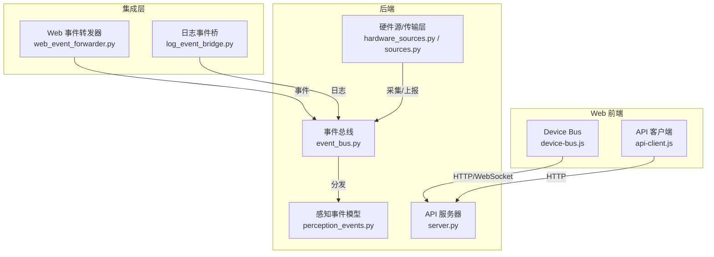
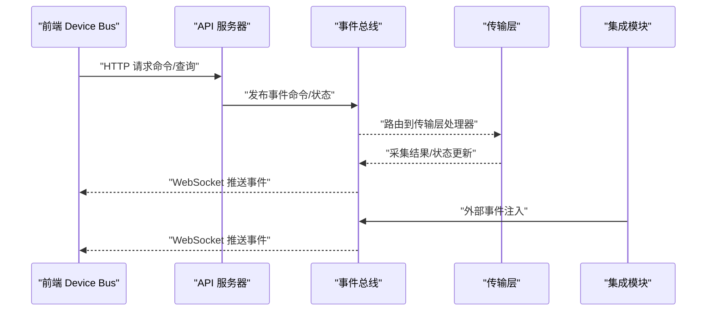
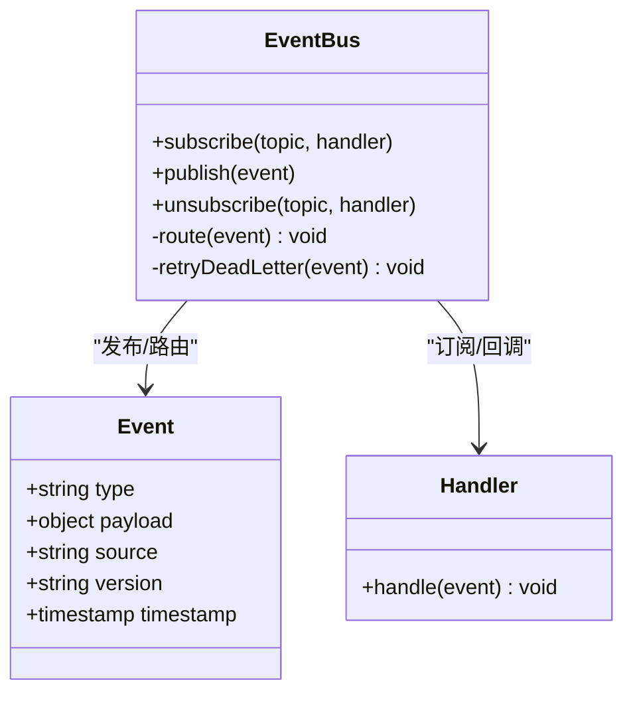
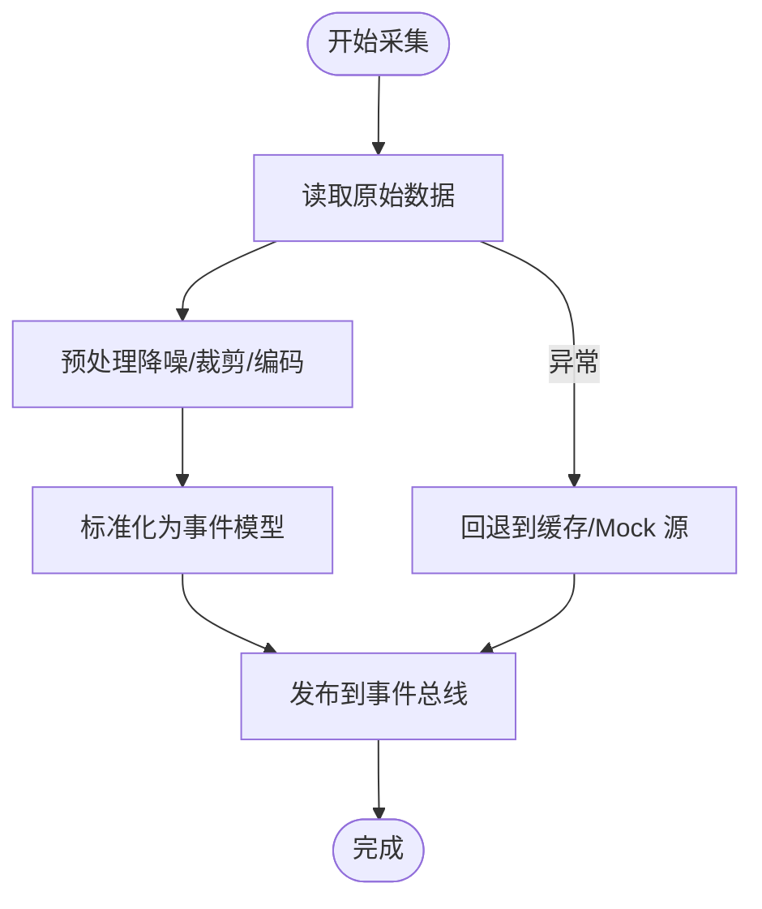
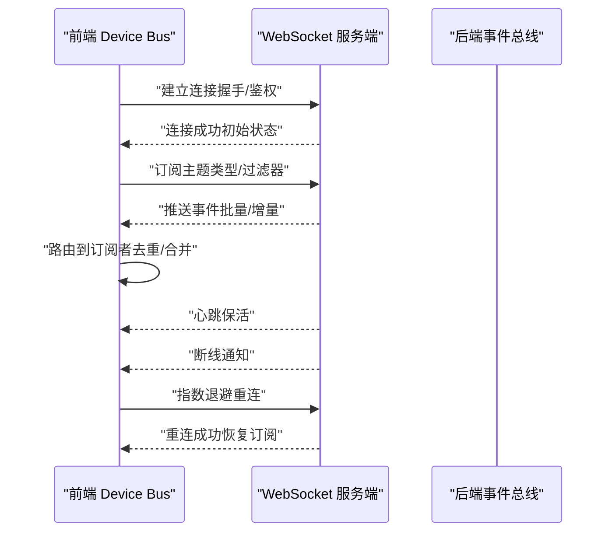
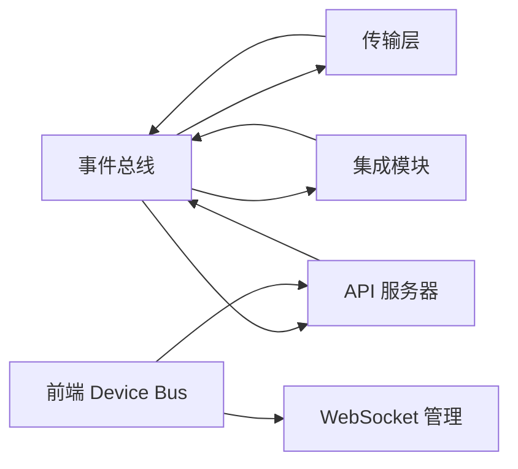

# 设备通信机制

<cite>
**本文引用的文件**   
- [app/events/event_bus.py](file://app/events/event_bus.py)
- [app/transport/hardware_sources.py](file://app/transport/hardware_sources.py)
- [app/transport/sources.py](file://app/transport/sources.py)
- [app/perception_events.py](file://app/perception_events.py)
- [apps/web/services/device-bus.js](file://apps/web/services/device-bus.js)
- [apps/web/services/api-client.js](file://apps/web/services/api-client.js)
- [app/api/server.py](file://app/api/server.py)
- [integrations/desktop_bot/web_event_forwarder.py](file://integrations/desktop_bot/web_event_forwarder.py)
- [integrations/desktop_bot/log_event_bridge.py](file://integrations/desktop_bot/log_event_bridge.py)
- [config.yaml](file://config.yaml)
</cite>

## 目录
1. [简介](#简介)
2. [项目结构](#项目结构)
3. [核心组件](#核心组件)
4. [架构总览](#架构总览)
5. [详细组件分析](#详细组件分析)
6. [依赖关系分析](#依赖关系分析)
7. [性能考虑](#性能考虑)
8. [故障排查指南](#故障排查指南)
9. [结论](#结论)
10. [附录](#附录)

## 简介
本文件面向设备通信机制，围绕 Device Bus 的事件驱动架构、实时事件处理（订阅/发布/路由）、API 客户端封装（HTTP 请求、错误与重试）、WebSocket 连接管理与断线重连策略进行系统化说明。同时给出消息格式规范、协议版本兼容性与数据序列化方案，并提供通信性能优化技巧与调试方法，帮助开发者快速理解并高效扩展设备通信能力。

## 项目结构
本项目采用前后端分离的架构：后端以 Python 为主，提供感知运行时、事件总线、传输层与 API 服务；前端以 JavaScript 为主，提供 Web 端 Device Bus、API 客户端与 WebSocket 管理。集成模块负责将桌面端日志与 Web 事件桥接至系统内部总线。

图表来源
- [app/events/event_bus.py](file://app/events/event_bus.py)
- [app/transport/hardware_sources.py](file://app/transport/hardware_sources.py)
- [app/transport/sources.py](file://app/transport/sources.py)
- [app/perception_events.py](file://app/perception_events.py)
- [app/api/server.py](file://app/api/server.py)
- [apps/web/services/device-bus.js](file://apps/web/services/device-bus.js)
- [apps/web/services/api-client.js](file://apps/web/services/api-client.js)
- [integrations/desktop_bot/web_event_forwarder.py](file://integrations/desktop_bot/web_event_forwarder.py)
- [integrations/desktop_bot/log_event_bridge.py](file://integrations/desktop_bot/log_event_bridge.py)

章节来源
- [app/events/event_bus.py](file://app/events/event_bus.py)
- [app/transport/hardware_sources.py](file://app/transport/hardware_sources.py)
- [app/transport/sources.py](file://app/transport/sources.py)
- [app/perception_events.py](file://app/perception_events.py)
- [app/api/server.py](file://app/api/server.py)
- [apps/web/services/device-bus.js](file://apps/web/services/device-bus.js)
- [apps/web/services/api-client.js](file://apps/web/services/api-client.js)
- [integrations/desktop_bot/web_event_forwarder.py](file://integrations/desktop_bot/web_event_forwarder.py)
- [integrations/desktop_bot/log_event_bridge.py](file://integrations/desktop_bot/log_event_bridge.py)

## 核心组件
- 事件总线（Event Bus）：实现事件订阅、发布与路由，支持多订阅者、主题隔离与优先级控制。
- 传输层（Transport）：抽象硬件数据采集与上报，屏蔽底层差异，统一接入事件总线。
- 感知事件模型（Perception Events）：定义感知相关事件的类型与字段，保证跨模块一致性。
- API 服务器（API Server）：对外暴露 RESTful 接口，承载配置查询、状态同步与命令下发。
- Web Device Bus：前端事件总线，封装 WebSocket 连接、消息路由与本地缓存。
- API 客户端（API Client）：封装 HTTP 请求、错误处理与重试策略，提供统一的调用入口。
- 集成模块（Integrations）：将外部日志与 Web 事件桥接到后端事件总线，形成闭环。

章节来源
- [app/events/event_bus.py](file://app/events/event_bus.py)
- [app/transport/hardware_sources.py](file://app/transport/hardware_sources.py)
- [app/transport/sources.py](file://app/transport/sources.py)
- [app/perception_events.py](file://app/perception_events.py)
- [app/api/server.py](file://app/api/server.py)
- [apps/web/services/device-bus.js](file://apps/web/services/device-bus.js)
- [apps/web/services/api-client.js](file://apps/web/services/api-client.js)
- [integrations/desktop_bot/web_event_forwarder.py](file://integrations/desktop_bot/web_event_forwarder.py)
- [integrations/desktop_bot/log_event_bridge.py](file://integrations/desktop_bot/log_event_bridge.py)

## 架构总览
整体通信架构基于“事件驱动 + 传输抽象 + 双向通道”的设计：
- 后端通过事件总线汇聚来自硬件源、集成模块与 API 的请求，按主题分发到订阅者。
- 前端通过 Device Bus 订阅后端事件，并通过 API 客户端发起命令或查询。
- WebSocket 作为实时通道，HTTP 作为可靠命令通道，二者互补。

图表来源
- [app/api/server.py](file://app/api/server.py)
- [app/events/event_bus.py](file://app/events/event_bus.py)
- [app/transport/hardware_sources.py](file://app/transport/hardware_sources.py)
- [apps/web/services/device-bus.js](file://apps/web/services/device-bus.js)
- [integrations/desktop_bot/web_event_forwarder.py](file://integrations/desktop_bot/web_event_forwarder.py)

## 详细组件分析

### 事件总线（Event Bus）
- 功能要点
  - 订阅/发布：支持按主题订阅，发布者向主题广播事件。
  - 路由策略：根据事件类型与元数据进行路由，支持优先级与过滤。
  - 可靠性：支持持久化队列与失败重试，确保关键事件不丢失。
  - 扩展性：插件式处理器注册，便于新增事件类型与处理逻辑。
- 数据结构
  - 事件对象：包含类型、时间戳、载荷、来源与版本等字段。
  - 订阅表：维护主题到处理器列表的映射，支持动态增删。
- 复杂度与性能
  - 发布为 O(n) 遍历订阅者，建议对高频事件使用批处理与节流。
  - 路由查找为 O(1) 主题索引，避免全量扫描。
- 错误处理
  - 处理器异常捕获与降级，记录错误日志并继续分发。
  - 死信队列用于不可恢复事件的分析与修复。

图表来源
- [app/events/event_bus.py](file://app/events/event_bus.py)
- [app/perception_events.py](file://app/perception_events.py)

章节来源
- [app/events/event_bus.py](file://app/events/event_bus.py)
- [app/perception_events.py](file://app/perception_events.py)

### 传输层（Hardware Sources / Sources）
- 功能要点
  - 抽象硬件采集：统一传感器、摄像头、麦克风等输入源的读取接口。
  - 事件上报：将采集到的原始数据转换为标准事件，提交到事件总线。
  - 背压与缓冲：在高频场景下使用环形缓冲与限流，避免阻塞主线程。
- 数据处理流程
  - 采集 -> 预处理（降噪/裁剪/编码）-> 标准化 -> 事件化 -> 发布。
- 错误与容错
  - 设备断开时自动回退到 Mock 源或缓存数据，保持系统可用性。
  - 采集超时与重试策略，避免长时间阻塞。

图表来源
- [app/transport/hardware_sources.py](file://app/transport/hardware_sources.py)
- [app/transport/sources.py](file://app/transport/sources.py)

章节来源
- [app/transport/hardware_sources.py](file://app/transport/hardware_sources.py)
- [app/transport/sources.py](file://app/transport/sources.py)

### 感知事件模型（Perception Events）
- 设计目标
  - 统一感知类事件的结构，包括视觉、语音、手势等。
  - 明确字段语义与约束，便于跨模块解析与校验。
- 版本兼容
  - 事件携带版本号，支持向前/向后兼容的解析策略。
  - 废弃字段标记与迁移路径，确保平滑升级。

章节来源
- [app/perception_events.py](file://app/perception_events.py)

### API 服务器（API Server）
- 职责
  - 暴露 RESTful 接口：配置查询、设备状态、命令下发。
  - 鉴权与限流：保护敏感接口，防止滥用。
  - 事件桥接：将 HTTP 请求转化为事件总线事件，触发下游处理。
- 错误响应
  - 统一错误码与消息体，便于前端处理与重试。
  - 超时与熔断策略，避免级联故障。

章节来源
- [app/api/server.py](file://app/api/server.py)

### Web Device Bus（前端）
- 功能要点
  - 事件订阅：按主题订阅后端推送的事件，支持去重与合并。
  - 消息路由：根据事件类型分发给对应业务模块。
  - 本地缓存：离线状态下缓存事件，网络恢复后补发。
- WebSocket 管理
  - 连接建立与心跳保活。
  - 断线重连策略：指数退避、最大重试次数与超时控制。
  - 消息确认与幂等：确保重复消息不会导致副作用。

图表来源
- [apps/web/services/device-bus.js](file://apps/web/services/device-bus.js)

章节来源
- [apps/web/services/device-bus.js](file://apps/web/services/device-bus.js)

### API 客户端（前端）
- 功能要点
  - HTTP 封装：统一请求头、参数序列化与响应反序列化。
  - 错误处理：区分网络错误、业务错误与超时，提供重试策略。
  - 重试机制：指数退避、最大重试次数与可配置的回退函数。
- 性能优化
  - 请求合并与取消：避免重复请求与无效响应。
  - 缓存策略：GET 请求短期缓存，减少服务器压力。

章节来源
- [apps/web/services/api-client.js](file://apps/web/services/api-client.js)

### 集成模块（Desktop Bot）
- Web 事件转发器
  - 将 Web 端事件转换为后端事件总线事件，实现跨进程通信。
- 日志事件桥
  - 将桌面端日志解析为标准事件，注入事件总线供其他模块消费。

章节来源
- [integrations/desktop_bot/web_event_forwarder.py](file://integrations/desktop_bot/web_event_forwarder.py)
- [integrations/desktop_bot/log_event_bridge.py](file://integrations/desktop_bot/log_event_bridge.py)

## 依赖关系分析
- 模块耦合
  - 事件总线为核心枢纽，传输层、API 服务器与集成模块均依赖其发布/订阅能力。
  - 前端 Device Bus 依赖 API 客户端与 WebSocket 管理，解耦业务逻辑。
- 外部依赖
  - HTTP 库、WebSocket 库、序列化库（JSON/Protobuf）。
  - 配置中心（YAML/环境变量）用于动态调整行为。

图表来源
- [app/events/event_bus.py](file://app/events/event_bus.py)
- [app/transport/hardware_sources.py](file://app/transport/hardware_sources.py)
- [app/api/server.py](file://app/api/server.py)
- [apps/web/services/device-bus.js](file://apps/web/services/device-bus.js)
- [integrations/desktop_bot/web_event_forwarder.py](file://integrations/desktop_bot/web_event_forwarder.py)

章节来源
- [app/events/event_bus.py](file://app/events/event_bus.py)
- [app/transport/hardware_sources.py](file://app/transport/hardware_sources.py)
- [app/api/server.py](file://app/api/server.py)
- [apps/web/services/device-bus.js](file://apps/web/services/device-bus.js)
- [integrations/desktop_bot/web_event_forwarder.py](file://integrations/desktop_bot/web_event_forwarder.py)

## 性能考虑
- 事件处理
  - 高频事件使用批处理与节流，降低 CPU 占用。
  - 异步处理与无锁队列，提升吞吐。
- 传输优化
  - 二进制序列化（如 Protobuf）替代 JSON，减小体积。
  - 压缩与分片传输，适应大消息场景。
- 连接管理
  - WebSocket 心跳与空闲检测，及时释放资源。
  - 连接池与复用，减少握手开销。
- 缓存策略
  - 前端本地缓存热点数据，后端 Redis 缓存状态。
  - 缓存失效与一致性校验，避免脏读。

[本节为通用指导，无需特定文件引用]

## 故障排查指南
- 常见问题
  - 事件丢失：检查死信队列与重试策略，确认处理器是否抛出异常。
  - 连接中断：查看心跳与重连日志，确认网络与防火墙设置。
  - 消息乱序：检查事件时间戳与序列号，必要时引入顺序保障。
- 调试方法
  - 启用详细日志与追踪 ID，定位问题链路。
  - 使用模拟源与回放工具，复现问题场景。
  - 监控指标：QPS、延迟、错误率、内存与 CPU 使用率。

章节来源
- [app/events/event_bus.py](file://app/events/event_bus.py)
- [apps/web/services/device-bus.js](file://apps/web/services/device-bus.js)
- [apps/web/services/api-client.js](file://apps/web/services/api-client.js)

## 结论
本通信机制以事件总线为核心，结合传输层抽象与双向通道（HTTP/WebSocket），实现了高内聚、低耦合的设备通信架构。通过标准化的事件模型、完善的错误处理与重试策略，以及灵活的订阅/发布模式，系统具备良好的可扩展性与稳定性。建议在后续迭代中持续优化序列化与传输效率，完善监控与诊断能力，进一步提升用户体验与系统可靠性。

[本节为总结性内容，无需特定文件引用]

## 附录

### 消息格式规范
- 事件对象
  - 类型（type）：字符串，标识事件类别。
  - 载荷（payload）：对象，承载业务数据。
  - 来源（source）：字符串，标识事件产生方。
  - 版本（version）：字符串，标识协议版本。
  - 时间戳（timestamp）：数字，毫秒级时间。
- 命令对象
  - 动作（action）：字符串，标识操作类型。
  - 参数（params）：对象，传递必要参数。
  - 请求 ID（requestId）：字符串，用于关联请求与响应。
- 响应对象
  - 状态（status）：数字，HTTP 或业务状态码。
  - 数据（data）：对象，返回的业务数据。
  - 错误（error）：对象，错误详情（可选）。

章节来源
- [app/perception_events.py](file://app/perception_events.py)
- [app/api/server.py](file://app/api/server.py)

### 协议版本兼容性
- 版本策略
  - 主版本不兼容变更，次版本向后兼容。
  - 客户端与服务端需协商最低共同版本。
- 迁移方案
  - 废弃字段标记与过渡期支持。
  - 灰度发布与特性开关，逐步切换。

章节来源
- [app/perception_events.py](file://app/perception_events.py)

### 数据序列化方案
- 文本格式（JSON）
  - 优点：易读、广泛支持。
  - 缺点：体积较大，解析开销较高。
- 二进制格式（Protobuf/MessagePack）
  - 优点：体积小、解析快。
  - 缺点：需要 Schema 管理，调试较复杂。
- 选择建议
  - 小消息与调试阶段使用 JSON。
  - 大消息与高性能场景使用二进制格式。

章节来源
- [config.yaml](file://config.yaml)

### 配置项参考
- 事件总线
  - 队列大小、重试次数、死信队列开关。
- 传输层
  - 采集频率、缓冲大小、回退策略。
- WebSocket
  - 心跳间隔、重连次数、超时时间。
- API 客户端
  - 超时、重试策略、缓存时长。

章节来源
- [config.yaml](file://config.yaml)