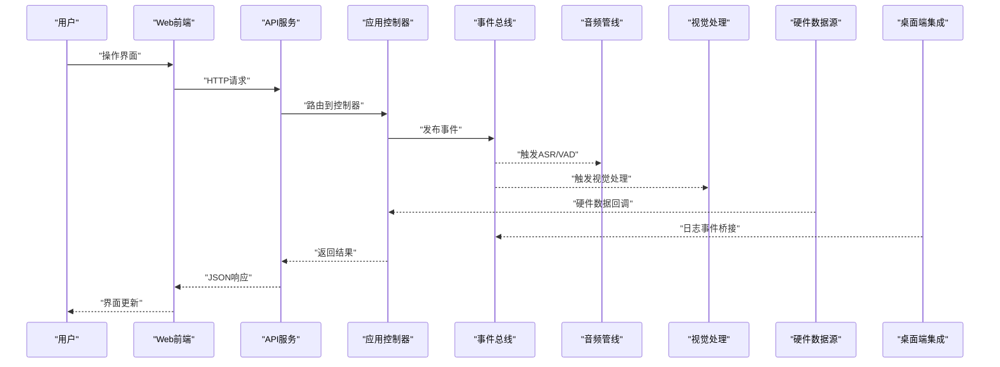
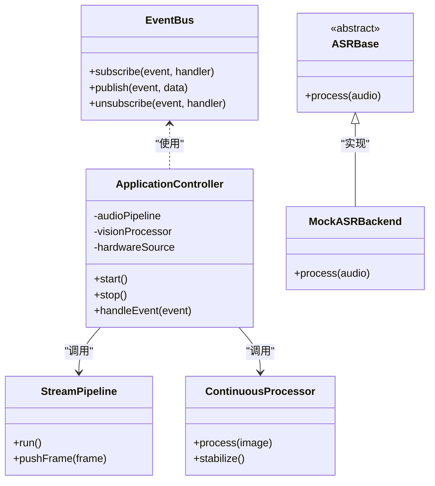
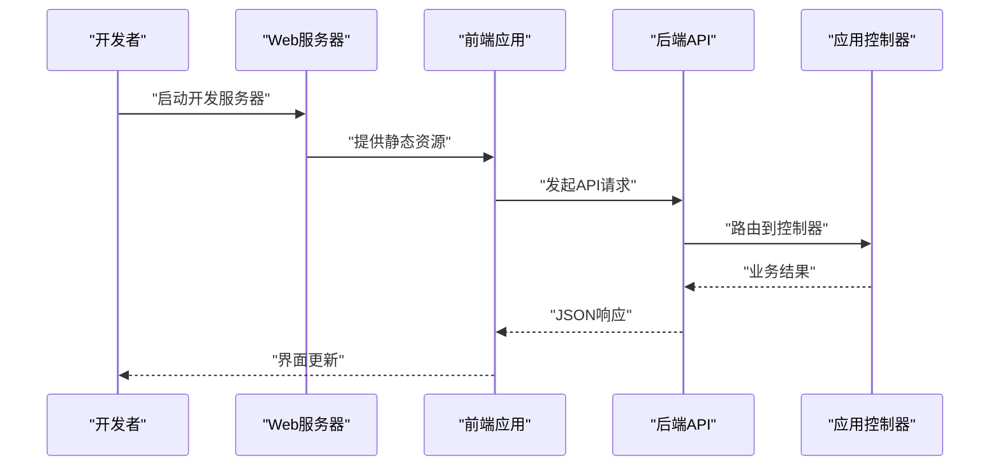
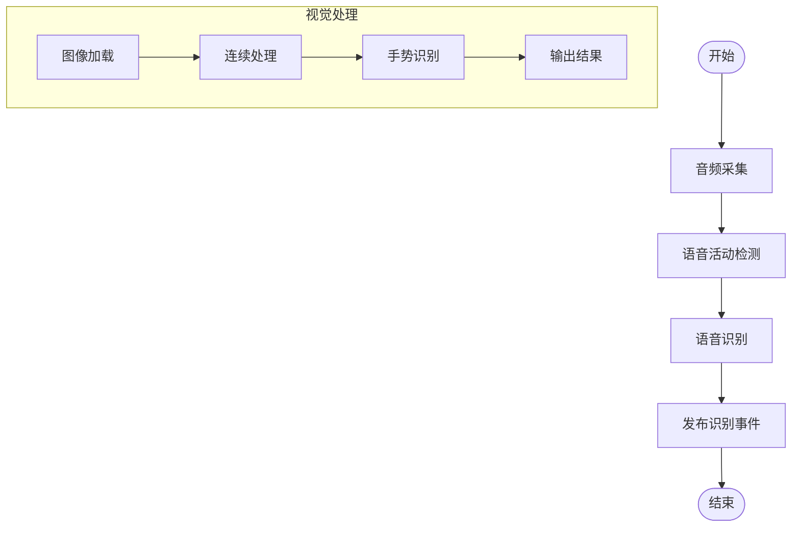
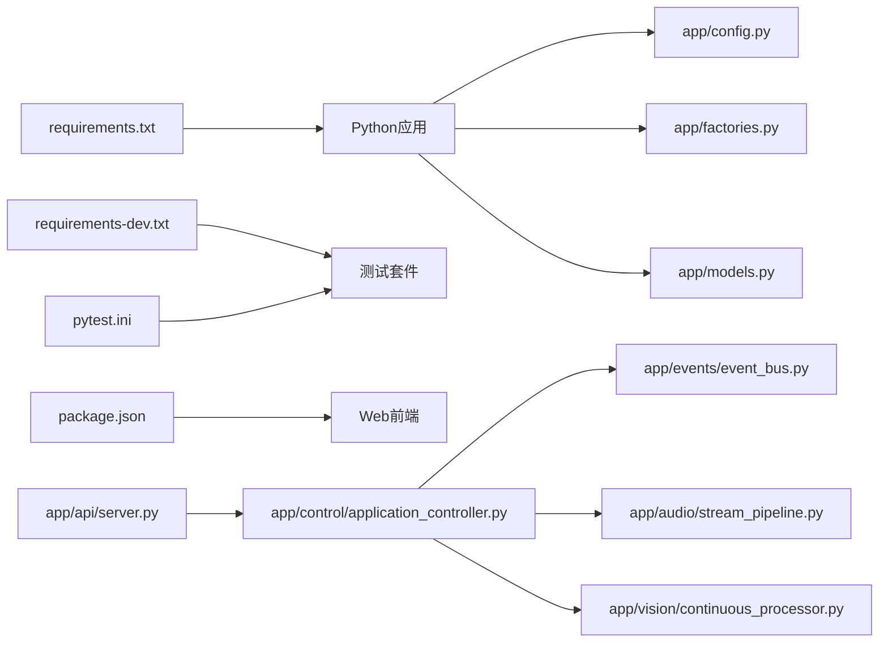

# 开发工作流

<cite>
**本文引用的文件**   
- [README.md](file://README.md)
- [config.yaml](file://config.yaml)
- [requirements.txt](file://requirements.txt)
- [requirements-dev.txt](file://requirements-dev.txt)
- [pytest.ini](file://pytest.ini)
- [package.json](file://package.json)
- [app/main.py](file://app/main.py)
- [app/__main__.py](file://app/__main__.py)
- [app/config.py](file://app/config.py)
- [app/factories.py](file://app/factories.py)
- [app/models.py](file://app/models.py)
- [app/perception_events.py](file://app/perception_events.py)
- [app/api/server.py](file://app/api/server.py)
- [app/asr/base.py](file://app/asr/base.py)
- [app/asr/mock_backend.py](file://app/asr/mock_backend.py)
- [app/audio/stream_pipeline.py](file://app/audio/stream_pipeline.py)
- [app/control/application_controller.py](file://app/control/application_controller.py)
- [app/detection/keywords.py](file://app/detection/keywords.py)
- [app/events/event_bus.py](file://app/events/event_bus.py)
- [app/features/photo_capture.py](file://app/features/photo_capture.py)
- [app/runtime/perception_daemon.py](file://app/runtime/perception_daemon.py)
- [app/transport/hardware_sources.py](file://app/transport/hardware_sources.py)
- [app/vision/continuous_processor.py](file://app/vision/continuous_processor.py)
- [apps/web/package.json](file://apps/web/package.json)
- [apps/web/scripts/build.mjs](file://apps/web/scripts/build.mjs)
- [apps/web/scripts/run-tests.mjs](file://apps/web/scripts/run-tests.mjs)
- [apps/web/server.mjs](file://apps/web/server.mjs)
- [apps/web/app.js](file://apps/web/app.js)
- [integrations/desktop_bot/log_event_bridge.py](file://integrations/desktop_bot/log_event_bridge.py)
- [integrations/desktop_bot/web_event_forwarder.py](file://integrations/desktop_bot/web_event_forwarder.py)
- [scripts/record.py](file://scripts/record.py)
- [scripts/vision_live.py](file://scripts/vision_live.py)
- [tests/test_config.py](file://tests/test_config.py)
- [tests/test_perception_runtime.py](file://tests/test_perception_runtime.py)
- [tests/test_vad_stream.py](file://tests/test_vad_stream.py)
</cite>

## 目录
1. [简介](#简介)
2. [项目结构](#项目结构)
3. [核心组件](#核心组件)
4. [架构总览](#架构总览)
5. [详细组件分析](#详细组件分析)
6. [依赖关系分析](#依赖关系分析)
7. [性能与构建优化](#性能与构建优化)
8. [故障排查指南](#故障排查指南)
9. [结论](#结论)
10. [附录：规范与流程](#附录：规范与流程)

## 简介
本指南面向AI硬件社区项目的开发与协作，覆盖代码组织结构、命名规范、编码标准、Git分支策略、提交规范、代码审查流程、自动化任务配置、构建脚本使用、部署流程、热重载与增量构建、缓存优化、团队协作规范、文档更新流程与版本发布策略。目标是让新成员快速上手，老成员高效协作，确保质量与交付一致性。

## 项目结构
仓库采用多语言混合结构：Python后端与工具脚本位于根目录，Web前端位于apps/web，集成层位于integrations，测试位于tests，脚本工具位于scripts，配置集中于根目录与子模块。

- Python应用入口
  - app/main.py：主进程启动与生命周期管理
  - app/__main__.py：命令行入口支持
  - app/config.py：配置加载与校验
  - app/factories.py：对象工厂与依赖注入
  - app/models.py：数据模型定义
  - app/perception_events.py：感知事件模型与常量
- 功能模块
  - app/api/server.py：HTTP API服务
  - app/asr/*：语音识别后端抽象与实现
  - app/audio/stream_pipeline.py：音频流处理管线
  - app/control/application_controller.py：应用控制器
  - app/detection/keywords.py：关键词检测
  - app/events/event_bus.py：事件总线
  - app/features/photo_capture.py：拍照特性
  - app/runtime/perception_daemon.py：感知守护进程
  - app/transport/hardware_sources.py：硬件数据源接入
  - app/vision/continuous_processor.py：视觉连续处理
- Web前端
  - apps/web/server.mjs：本地开发服务器
  - apps/web/app.js：前端应用逻辑
  - apps/web/scripts/*：构建与测试脚本
- 集成与工具
  - integrations/desktop_bot/*：桌面端事件桥接
  - scripts/*：录音、视觉演示等工具脚本
- 测试
  - tests/*：单元测试与集成测试
- 配置与依赖
  - config.yaml：运行时配置
  - requirements.txt / requirements-dev.txt：Python依赖
  - pytest.ini：测试框架配置
  - package.json：Node依赖与脚本

```mermaid
graph TB
subgraph "Python应用"
A["app/main.py"]
B["app/config.py"]
C["app/factories.py"]
D["app/models.py"]
E["app/perception_events.py"]
F["app/api/server.py"]
G["app/audio/stream_pipeline.py"]
H["app/control/application_controller.py"]
I["app/events/event_bus.py"]
J["app/runtime/perception_daemon.py"]
K["app/transport/hardware_sources.py"]
L["app/vision/continuous_processor.py"]
M["app/asr/*"]
N["app/detection/keywords.py"]
O["app/features/photo_capture.py"]
end
subgraph "Web前端"
W1["apps/web/server.mjs"]
W2["apps/web/app.js"]
W3["apps/web/scripts/build.mjs"]
W4["apps/web/scripts/run-tests.mjs"]
end
subgraph "集成与工具"
X1["integrations/desktop_bot/log_event_bridge.py"]
X2["integrations/desktop_bot/web_event_forwarder.py"]
Y1["scripts/record.py"]
Y2["scripts/vision_live.py"]
end
A --> F
A --> G
A --> H
A --> I
A --> J
A --> K
A --> L
A --> M
A --> N
A --> O
W1 --> W2
W3 --> W2
W4 --> W2
X1 --> I
X2 --> F
Y1 --> G
Y2 --> L
```

**图表来源** 
- [app/main.py](file://app/main.py)
- [app/config.py](file://app/config.py)
- [app/factories.py](file://app/factories.py)
- [app/models.py](file://app/models.py)
- [app/perception_events.py](file://app/perception_events.py)
- [app/api/server.py](file://app/api/server.py)
- [app/audio/stream_pipeline.py](file://app/audio/stream_pipeline.py)
- [app/control/application_controller.py](file://app/control/application_controller.py)
- [app/events/event_bus.py](file://app/events/event_bus.py)
- [app/runtime/perception_daemon.py](file://app/runtime/perception_daemon.py)
- [app/transport/hardware_sources.py](file://app/transport/hardware_sources.py)
- [app/vision/continuous_processor.py](file://app/vision/continuous_processor.py)
- [app/asr/base.py](file://app/asr/base.py)
- [app/asr/mock_backend.py](file://app/asr/mock_backend.py)
- [app/detection/keywords.py](file://app/detection/keywords.py)
- [app/features/photo_capture.py](file://app/features/photo_capture.py)
- [apps/web/server.mjs](file://apps/web/server.mjs)
- [apps/web/app.js](file://apps/web/app.js)
- [apps/web/scripts/build.mjs](file://apps/web/scripts/build.mjs)
- [apps/web/scripts/run-tests.mjs](file://apps/web/scripts/run-tests.mjs)
- [integrations/desktop_bot/log_event_bridge.py](file://integrations/desktop_bot/log_event_bridge.py)
- [integrations/desktop_bot/web_event_forwarder.py](file://integrations/desktop_bot/web_event_forwarder.py)
- [scripts/record.py](file://scripts/record.py)
- [scripts/vision_live.py](file://scripts/vision_live.py)

**章节来源**
- [README.md](file://README.md)
- [config.yaml](file://config.yaml)
- [requirements.txt](file://requirements.txt)
- [requirements-dev.txt](file://requirements-dev.txt)
- [pytest.ini](file://pytest.ini)
- [package.json](file://package.json)

## 核心组件
- 配置与启动
  - 配置加载与校验：集中式配置，环境变量覆盖，启动前校验关键项
  - 应用控制器：统一调度各子系统（ASR、VAD、视觉、事件总线）
  - 事件总线：解耦模块间通信，支持异步事件分发
- 感知与处理
  - 音频管线：采集、VAD、ASR流水线化
  - 视觉处理：连续帧处理、手势识别、图像加载
  - 关键词检测：热词唤醒与触发
- 外部集成
  - API服务：HTTP接口暴露控制与状态查询
  - 硬件数据源：设备接入与协议适配
  - 桌面端集成：日志事件桥接与Web事件转发

**章节来源**
- [app/config.py](file://app/config.py)
- [app/control/application_controller.py](file://app/control/application_controller.py)
- [app/events/event_bus.py](file://app/events/event_bus.py)
- [app/audio/stream_pipeline.py](file://app/audio/stream_pipeline.py)
- [app/vision/continuous_processor.py](file://app/vision/continuous_processor.py)
- [app/detection/keywords.py](file://app/detection/keywords.py)
- [app/api/server.py](file://app/api/server.py)
- [app/transport/hardware_sources.py](file://app/transport/hardware_sources.py)
- [integrations/desktop_bot/log_event_bridge.py](file://integrations/desktop_bot/log_event_bridge.py)
- [integrations/desktop_bot/web_event_forwarder.py](file://integrations/desktop_bot/web_event_forwarder.py)

## 架构总览
系统以“感知-处理-响应”为主线，通过事件总线串联各子系统，API与Web前端提供交互界面，硬件数据源与桌面端集成扩展输入输出能力。

**图表来源** 
- [app/api/server.py](file://app/api/server.py)
- [app/control/application_controller.py](file://app/control/application_controller.py)
- [app/events/event_bus.py](file://app/events/event_bus.py)
- [app/audio/stream_pipeline.py](file://app/audio/stream_pipeline.py)
- [app/vision/continuous_processor.py](file://app/vision/continuous_processor.py)
- [app/transport/hardware_sources.py](file://app/transport/hardware_sources.py)
- [integrations/desktop_bot/log_event_bridge.py](file://integrations/desktop_bot/log_event_bridge.py)
- [apps/web/server.mjs](file://apps/web/server.mjs)
- [apps/web/app.js](file://apps/web/app.js)

## 详细组件分析

### 组件A：事件总线与控制器
- 职责
  - 事件总线：订阅/发布机制，支持异步回调与错误隔离
  - 控制器：编排感知流程，协调ASR、VAD、视觉与硬件数据源
- 设计要点
  - 解耦：模块间通过事件通信，降低耦合度
  - 可扩展：新增处理器只需订阅相应事件
  - 容错：异常捕获与重试策略

**图表来源** 
- [app/events/event_bus.py](file://app/events/event_bus.py)
- [app/control/application_controller.py](file://app/control/application_controller.py)
- [app/asr/base.py](file://app/asr/base.py)
- [app/asr/mock_backend.py](file://app/asr/mock_backend.py)
- [app/audio/stream_pipeline.py](file://app/audio/stream_pipeline.py)
- [app/vision/continuous_processor.py](file://app/vision/continuous_processor.py)

**章节来源**
- [app/events/event_bus.py](file://app/events/event_bus.py)
- [app/control/application_controller.py](file://app/control/application_controller.py)
- [app/asr/base.py](file://app/asr/base.py)
- [app/asr/mock_backend.py](file://app/asr/mock_backend.py)
- [app/audio/stream_pipeline.py](file://app/audio/stream_pipeline.py)
- [app/vision/continuous_processor.py](file://app/vision/continuous_processor.py)

### 组件B：API服务与Web前端
- 职责
  - API服务：暴露RESTful接口，处理请求路由与响应格式化
  - Web前端：用户界面、状态展示、与后端交互
- 设计要点
  - 前后端分离：通过HTTP/JSON通信
  - 可测试性：Mock API用于前端独立开发
  - 热重载：开发时自动刷新

**图表来源** 
- [apps/web/server.mjs](file://apps/web/server.mjs)
- [apps/web/app.js](file://apps/web/app.js)
- [app/api/server.py](file://app/api/server.py)
- [app/control/application_controller.py](file://app/control/application_controller.py)

**章节来源**
- [apps/web/server.mjs](file://apps/web/server.mjs)
- [apps/web/app.js](file://apps/web/app.js)
- [app/api/server.py](file://app/api/server.py)

### 组件C：音频与视觉处理管线
- 职责
  - 音频管线：采集、VAD、ASR流水线化处理
  - 视觉处理：连续帧处理、手势识别、图像加载
- 设计要点
  - 流水线化：模块化处理单元，易于替换与扩展
  - 异步处理：提升吞吐与响应性
  - 资源管理：内存与计算资源优化

**图表来源** 
- [app/audio/stream_pipeline.py](file://app/audio/stream_pipeline.py)
- [app/vision/continuous_processor.py](file://app/vision/continuous_processor.py)

**章节来源**
- [app/audio/stream_pipeline.py](file://app/audio/stream_pipeline.py)
- [app/vision/continuous_processor.py](file://app/vision/continuous_processor.py)

## 依赖关系分析
- Python依赖
  - requirements.txt：生产环境依赖
  - requirements-dev.txt：开发环境依赖（测试、调试工具）
  - pytest.ini：测试框架配置
- Node依赖
  - package.json：前端构建、测试与运行脚本
- 模块依赖
  - 控制器依赖事件总线、音频管线、视觉处理器
  - API服务依赖控制器与配置模块
  - 集成模块依赖事件总线与API服务

**图表来源** 
- [requirements.txt](file://requirements.txt)
- [requirements-dev.txt](file://requirements-dev.txt)
- [pytest.ini](file://pytest.ini)
- [package.json](file://package.json)
- [app/config.py](file://app/config.py)
- [app/factories.py](file://app/factories.py)
- [app/models.py](file://app/models.py)
- [app/api/server.py](file://app/api/server.py)
- [app/control/application_controller.py](file://app/control/application_controller.py)
- [app/events/event_bus.py](file://app/events/event_bus.py)
- [app/audio/stream_pipeline.py](file://app/audio/stream_pipeline.py)
- [app/vision/continuous_processor.py](file://app/vision/continuous_processor.py)

**章节来源**
- [requirements.txt](file://requirements.txt)
- [requirements-dev.txt](file://requirements-dev.txt)
- [pytest.ini](file://pytest.ini)
- [package.json](file://package.json)

## 性能与构建优化
- 构建脚本
  - 前端构建：apps/web/scripts/build.mjs
  - 测试执行：apps/web/scripts/run-tests.mjs
  - Python测试：pytest命令（参考pytest.ini）
- 热重载
  - Web开发服务器：apps/web/server.mjs支持热重载
  - Python开发：建议使用uvicorn或Flask内置调试模式
- 增量构建
  - 前端：利用Webpack/Vite缓存与增量编译
  - Python：避免全量导入，按需加载模块
- 缓存优化
  - 模型缓存：ASR与视觉模型预加载
  - 数据缓存：事件缓存与最近结果缓存
  - 网络缓存：API响应缓存策略

**章节来源**
- [apps/web/scripts/build.mjs](file://apps/web/scripts/build.mjs)
- [apps/web/scripts/run-tests.mjs](file://apps/web/scripts/run-tests.mjs)
- [apps/web/server.mjs](file://apps/web/server.mjs)
- [pytest.ini](file://pytest.ini)
- [app/event_cache.py](file://app/event_cache.py)

## 故障排查指南
- 常见问题
  - 配置错误：检查config.yaml与环境变量
  - 依赖缺失：重新安装requirements与package.json依赖
  - 端口冲突：修改API服务端口
  - 硬件连接：检查设备权限与驱动
- 调试技巧
  - 启用详细日志：调整日志级别
  - 单元测试：运行tests目录下的测试用例
  - 模拟后端：使用mock ASR与VAD进行隔离测试
- 恢复步骤
  - 清理缓存：删除临时文件与构建产物
  - 重启服务：停止并重新启动API服务
  - 回滚版本：使用Git回滚到稳定版本

**章节来源**
- [app/config.py](file://app/config.py)
- [tests/test_config.py](file://tests/test_config.py)
- [tests/test_perception_runtime.py](file://tests/test_perception_runtime.py)
- [tests/test_vad_stream.py](file://tests/test_vad_stream.py)
- [app/asr/mock_backend.py](file://app/asr/mock_backend.py)

## 结论
本指南提供了从代码组织、命名规范、编码标准到Git流程、自动化构建、部署与优化的完整开发工作流。遵循这些规范将提升团队协作效率、代码质量与交付稳定性。建议团队定期回顾与更新规范，适应项目演进需求。

## 附录：规范与流程

### 代码组织结构
- 分层清晰：按功能模块划分目录，避免跨层依赖
- 命名规范：模块名小写+下划线，类名大驼峰，函数名小写+下划线
- 注释标准：公共API需docstring，复杂逻辑需行内注释

### Git分支策略
- main：生产分支，仅接受合并请求
- develop：开发分支，集成新功能
- feature/*：功能分支，从develop创建，合并回develop
- release/*：发布分支，从develop创建，合并回main与develop
- hotfix/*：紧急修复分支，从main创建，合并回main与develop

### 提交规范
- 格式：类型(范围): 描述
- 类型：feat、fix、docs、style、refactor、test、chore
- 示例：feat(api): 添加用户注册接口

### 代码审查流程
- 提交PR：关联Issue，填写变更说明
- 审查要求：至少一名维护者批准
- 自动化检查：CI通过后方可合并
- 合并后：更新CHANGELOG与文档

### 自动化任务配置
- Python测试：pytest -v --cov=app
- 前端测试：npm test
- 构建脚本：npm run build
- 代码风格：flake8、black、eslint

### 构建脚本使用
- 前端构建：node apps/web/scripts/build.mjs
- 运行测试：node apps/web/scripts/run-tests.mjs
- 本地开发：python -m app.main

### 部署流程
- 环境准备：安装依赖、配置环境变量
- 构建产物：前端静态资源与Python包
- 容器化：Docker镜像构建与推送
- 发布：滚动更新与灰度发布

### 热重载开发
- Web：使用开发服务器自动刷新
- Python：使用热重载库如watchdog
- 数据库：迁移脚本自动执行

### 增量构建与缓存优化
- 前端：Webpack/Vite缓存与分包
- Python：模块懒加载与结果缓存
- 模型：预加载与内存池

### 团队协作规范
- 沟通渠道：Slack/钉钉群组
- 文档更新：随代码变更同步更新
- 知识分享：定期技术分享与复盘

### 文档更新流程
- 变更识别：代码变更影响文档
- 更新内容：API文档、架构图、使用说明
- 审核发布：文档审查与版本标记

### 版本发布策略
- 语义化版本：主版本.次版本.修订号
- 发布计划：月度/季度发布
- 回滚策略：快速回滚与数据备份

**章节来源**
- [README.md](file://README.md)
- [config.yaml](file://config.yaml)
- [package.json](file://package.json)
- [pytest.ini](file://pytest.ini)
- [app/main.py](file://app/main.py)
- [apps/web/server.mjs](file://apps/web/server.mjs)
- [scripts/record.py](file://scripts/record.py)
- [scripts/vision_live.py](file://scripts/vision_live.py)