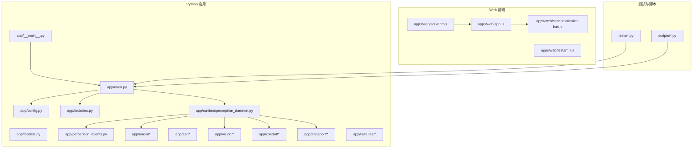
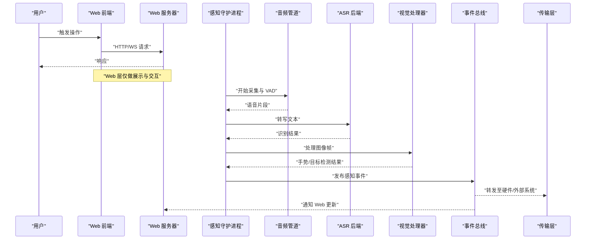
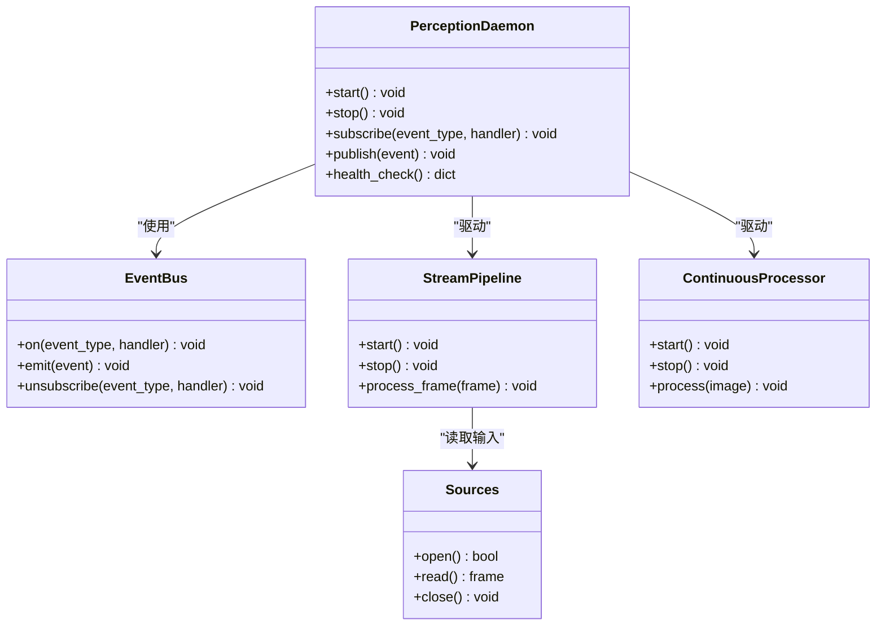
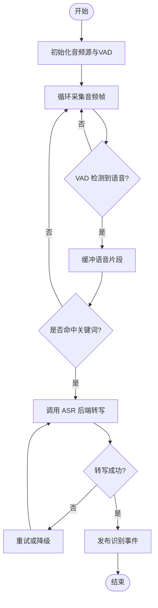
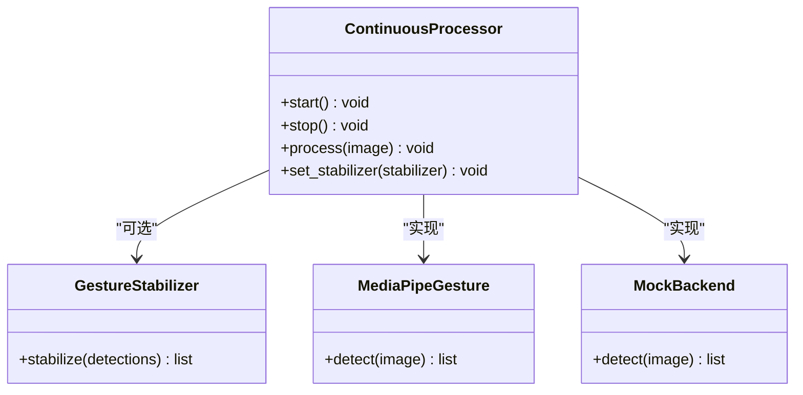
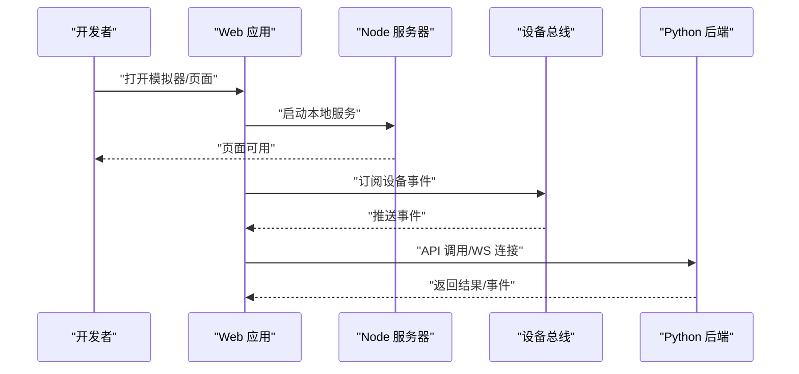
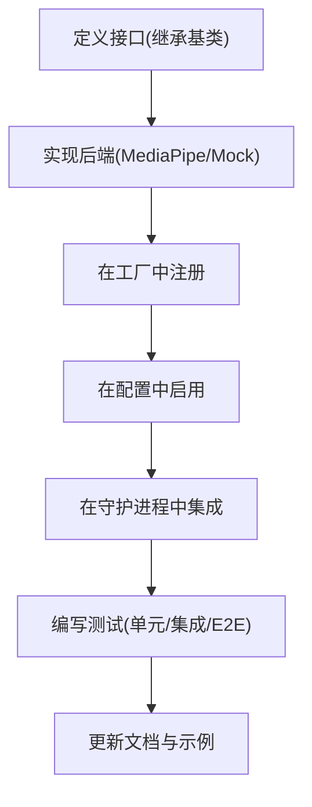
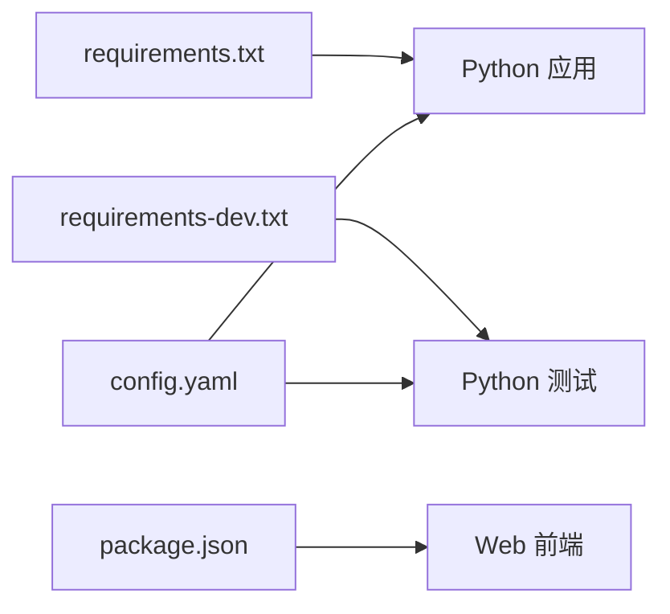

# 开发指南

<cite>
**本文档引用的文件**   
- [README.md](file://README.md)
- [config.yaml](file://config.yaml)
- [requirements.txt](file://requirements.txt)
- [requirements-dev.txt](file://requirements-dev.txt)
- [pytest.ini](file://pytest.ini)
- [package.json](file://package.json)
- [app/__main__.py](file://app/__main__.py)
- [app/main.py](file://app/main.py)
- [app/config.py](file://app/config.py)
- [app/factories.py](file://app/factories.py)
- [app/models.py](file://app/models.py)
- [app/perception_events.py](file://app/perception_events.py)
- [app/runtime/perception_daemon.py](file://app/runtime/perception_daemon.py)
- [app/audio/stream_pipeline.py](file://app/audio/stream_pipeline.py)
- [app/audio/keyword_asr.py](file://app/audio/keyword_asr.py)
- [app/asr/base.py](file://app/asr/base.py)
- [app/asr/faster_whisper_backend.py](file://app/asr/faster_whisper_backend.py)
- [app/vision/continuous_processor.py](file://app/vision/continuous_processor.py)
- [app/vision/base.py](file://app/vision/base.py)
- [app/vision/mediapipe_gesture.py](file://app/vision/mediapipe_gesture.py)
- [app/control/application_controller.py](file://app/control/application_controller.py)
- [app/events/event_bus.py](file://app/events/event_bus.py)
- [app/transport/sources.py](file://app/transport/sources.py)
- [app/transport/hardware_sources.py](file://app/transport/hardware_sources.py)
- [app/features/photo_capture.py](file://app/features/photo_capture.py)
- [apps/web/server.mjs](file://apps/web/server.mjs)
- [apps/web/app.js](file://apps/web/app.js)
- [apps/web/services/device-bus.js](file://apps/web/services/device-bus.js)
- [apps/web/tests/api.test.mjs](file://apps/web/tests/api.test.mjs)
- [apps/web/tests/companion.test.mjs](file://apps/web/tests/companion.test.mjs)
- [apps/web/tests/hardware-integration.test.mjs](file://apps/web/tests/hardware-integration.test.mjs)
- [scripts/record.py](file://scripts/record.py)
- [scripts/receive_microphone.py](file://scripts/receive_microphone.py)
- [scripts/receive_images.py](file://scripts/receive_images.py)
- [scripts/vision_live.py](file://scripts/vision_live.py)
- [tests/test_config.py](file://tests/test_config.py)
- [tests/test_perception_runtime.py](file://tests/test_perception_runtime.py)
- [tests/test_vad_stream.py](file://tests/test_vad_stream.py)
</cite>

## 目录
1. [简介](#简介)
2. [项目结构](#项目结构)
3. [核心组件](#核心组件)
4. [架构总览](#架构总览)
5. [详细组件分析](#详细组件分析)
6. [依赖关系分析](#依赖关系分析)
7. [性能考量](#性能考量)
8. [故障排查指南](#故障排查指南)
9. [结论](#结论)
10. [附录](#附录)

## 简介
本指南面向贡献者，提供从环境搭建到代码开发、测试、调试、性能分析与发布的全流程说明。内容覆盖：
- 代码组织结构与命名规范
- 单元测试、集成测试与端到端测试编写方法
- 调试技巧、日志分析与性能分析方法
- 代码审查流程、提交规范与版本管理策略
- 插件化扩展（感知模块）开发指南
- 常用开发脚本与自动化任务配置

## 项目结构
本项目采用“后端服务 + Web 前端 + 硬件交互”的混合架构，核心 Python 应用位于 app 目录，Web 应用位于 apps/web，测试在 tests 与 apps/web/tests，工具脚本在 scripts，配置与依赖在根目录。

图表来源
- [app/__main__.py](file://app/__main__.py)
- [app/main.py](file://app/main.py)
- [app/config.py](file://app/config.py)
- [app/factories.py](file://app/factories.py)
- [app/runtime/perception_daemon.py](file://app/runtime/perception_daemon.py)
- [app/audio/stream_pipeline.py](file://app/audio/stream_pipeline.py)
- [app/vision/continuous_processor.py](file://app/vision/continuous_processor.py)
- [apps/web/server.mjs](file://apps/web/server.mjs)
- [apps/web/app.js](file://apps/web/app.js)

章节来源
- [README.md](file://README.md)
- [package.json](file://package.json)
- [requirements.txt](file://requirements.txt)
- [requirements-dev.txt](file://requirements-dev.txt)

## 核心组件
- 应用入口与生命周期
  - 入口点负责加载配置、初始化工厂、启动运行时守护进程与事件总线。
  - 关键路径参考：[应用入口](file://app/__main__.py)、[主程序](file://app/main.py)。
- 配置管理
  - 集中式配置加载与校验，支持 YAML 与环境变量覆盖。
  - 关键路径参考：[配置模块](file://app/config.py)、[全局配置](file://config.yaml)。
- 工厂与模型
  - 工厂负责按配置创建 ASR/VAD/视觉等后端实例；模型定义事件与数据结构。
  - 关键路径参考：[工厂](file://app/factories.py)、[数据模型](file://app/models.py)、[感知事件](file://app/perception_events.py)。
- 运行时守护进程
  - 统一调度音频流、关键词识别、ASR、视觉处理与硬件传输。
  - 关键路径参考：[感知守护进程](file://app/runtime/perception_daemon.py)。
- 音频与 ASR
  - 音频采集、VAD 检测、关键词识别与 ASR 后端抽象。
  - 关键路径参考：[音频流管道](file://app/audio/stream_pipeline.py)、[关键词 ASR](file://app/audio/keyword_asr.py)、[ASR 基类](file://app/asr/base.py)、[Faster Whisper 后端](file://app/asr/faster_whisper_backend.py)。
- 视觉处理
  - 连续帧处理、手势识别与后端抽象。
  - 关键路径参考：[连续处理器](file://app/vision/continuous_processor.py)、[视觉基类](file://app/vision/base.py)、[MediaPipe 手势](file://app/vision/mediapipe_gesture.py)。
- 控制与应用控制器
  - 高层业务编排与状态管理。
  - 关键路径参考：[应用控制器](file://app/control/application_controller.py)。
- 事件总线
  - 异步事件分发与订阅，解耦各子系统。
  - 关键路径参考：[事件总线](file://app/events/event_bus.py)。
- 传输层
  - 设备与硬件源抽象，统一数据接入。
  - 关键路径参考：[传输源](file://app/transport/sources.py)、[硬件源](file://app/transport/hardware_sources.py)。
- 特性模块
  - 功能开关与能力扩展点（如拍照）。
  - 关键路径参考：[拍照特性](file://app/features/photo_capture.py)。

章节来源
- [app/__main__.py](file://app/__main__.py)
- [app/main.py](file://app/main.py)
- [app/config.py](file://app/config.py)
- [app/factories.py](file://app/factories.py)
- [app/models.py](file://app/models.py)
- [app/perception_events.py](file://app/perception_events.py)
- [app/runtime/perception_daemon.py](file://app/runtime/perception_daemon.py)
- [app/audio/stream_pipeline.py](file://app/audio/stream_pipeline.py)
- [app/audio/keyword_asr.py](file://app/audio/keyword_asr.py)
- [app/asr/base.py](file://app/asr/base.py)
- [app/asr/faster_whisper_backend.py](file://app/asr/faster_whisper_backend.py)
- [app/vision/continuous_processor.py](file://app/vision/continuous_processor.py)
- [app/vision/base.py](file://app/vision/base.py)
- [app/vision/mediapipe_gesture.py](file://app/vision/mediapipe_gesture.py)
- [app/control/application_controller.py](file://app/control/application_controller.py)
- [app/events/event_bus.py](file://app/events/event_bus.py)
- [app/transport/sources.py](file://app/transport/sources.py)
- [app/transport/hardware_sources.py](file://app/transport/hardware_sources.py)
- [app/features/photo_capture.py](file://app/features/photo_capture.py)

## 架构总览
系统以“感知守护进程”为核心，驱动音频与视觉流水线，通过事件总线将结果分发给上层应用控制器与传输层，Web 前端通过 API 与服务进行交互。

图表来源
- [app/runtime/perception_daemon.py](file://app/runtime/perception_daemon.py)
- [app/audio/stream_pipeline.py](file://app/audio/stream_pipeline.py)
- [app/asr/base.py](file://app/asr/base.py)
- [app/vision/continuous_processor.py](file://app/vision/continuous_processor.py)
- [app/events/event_bus.py](file://app/events/event_bus.py)
- [app/transport/sources.py](file://app/transport/sources.py)
- [apps/web/server.mjs](file://apps/web/server.mjs)
- [apps/web/app.js](file://apps/web/app.js)

## 详细组件分析

### 运行时守护进程（感知守护进程）
职责：
- 协调音频与视觉子系统的生命周期
- 管理事件总线订阅与发布
- 处理异常与重试逻辑
- 暴露健康检查与状态查询接口

图表来源
- [app/runtime/perception_daemon.py](file://app/runtime/perception_daemon.py)
- [app/events/event_bus.py](file://app/events/event_bus.py)
- [app/audio/stream_pipeline.py](file://app/audio/stream_pipeline.py)
- [app/vision/continuous_processor.py](file://app/vision/continuous_processor.py)
- [app/transport/sources.py](file://app/transport/sources.py)

章节来源
- [app/runtime/perception_daemon.py](file://app/runtime/perception_daemon.py)
- [app/events/event_bus.py](file://app/events/event_bus.py)

### 音频与 ASR 流水线
职责：
- 音频采集与 VAD 检测
- 关键词识别与 ASR 转写
- 后端可插拔（Mock/Faster Whisper）

图表来源
- [app/audio/stream_pipeline.py](file://app/audio/stream_pipeline.py)
- [app/audio/keyword_asr.py](file://app/audio/keyword_asr.py)
- [app/asr/base.py](file://app/asr/base.py)
- [app/asr/faster_whisper_backend.py](file://app/asr/faster_whisper_backend.py)

章节来源
- [app/audio/stream_pipeline.py](file://app/audio/stream_pipeline.py)
- [app/audio/keyword_asr.py](file://app/audio/keyword_asr.py)
- [app/asr/base.py](file://app/asr/base.py)
- [app/asr/faster_whisper_backend.py](file://app/asr/faster_whisper_backend.py)

### 视觉处理流水线
职责：
- 连续帧处理与稳定性增强
- 手势识别与后端抽象（MediaPipe/Mock）

图表来源
- [app/vision/continuous_processor.py](file://app/vision/continuous_processor.py)
- [app/vision/base.py](file://app/vision/base.py)
- [app/vision/mediapipe_gesture.py](file://app/vision/mediapipe_gesture.py)

章节来源
- [app/vision/continuous_processor.py](file://app/vision/continuous_processor.py)
- [app/vision/base.py](file://app/vision/base.py)
- [app/vision/mediapipe_gesture.py](file://app/vision/mediapipe_gesture.py)

### Web 前端与服务
职责：
- 提供 UI 与设备交互界面
- 通过设备总线与后端事件通信
- 模拟硬件与运行集成测试

图表来源
- [apps/web/server.mjs](file://apps/web/server.mjs)
- [apps/web/app.js](file://apps/web/app.js)
- [apps/web/services/device-bus.js](file://apps/web/services/device-bus.js)

章节来源
- [apps/web/server.mjs](file://apps/web/server.mjs)
- [apps/web/app.js](file://apps/web/app.js)
- [apps/web/services/device-bus.js](file://apps/web/services/device-bus.js)

### 插件化扩展（新增感知模块）
步骤：
- 定义新模块接口（继承基类）
- 实现具体后端（如 MediaPipe/Mock）
- 在工厂中注册并支持配置切换
- 在守护进程中启用流水线节点
- 添加事件类型与模型定义
- 补充测试用例（单元/集成/E2E）

图表来源
- [app/asr/base.py](file://app/asr/base.py)
- [app/vision/base.py](file://app/vision/base.py)
- [app/factories.py](file://app/factories.py)
- [app/runtime/perception_daemon.py](file://app/runtime/perception_daemon.py)
- [app/models.py](file://app/models.py)

章节来源
- [app/asr/base.py](file://app/asr/base.py)
- [app/vision/base.py](file://app/vision/base.py)
- [app/factories.py](file://app/factories.py)
- [app/runtime/perception_daemon.py](file://app/runtime/perception_daemon.py)
- [app/models.py](file://app/models.py)

## 依赖关系分析
- Python 依赖
  - 运行时依赖与开发依赖分离，便于最小化部署包与丰富本地开发体验。
  - 关键路径参考：[运行时依赖](file://requirements.txt)、[开发依赖](file://requirements-dev.txt)。
- Node 依赖
  - Web 前端与测试脚本依赖由 package.json 管理。
  - 关键路径参考：[前端依赖](file://package.json)。
- 配置依赖
  - 配置文件集中管理，支持多环境切换。
  - 关键路径参考：[全局配置](file://config.yaml)。

图表来源
- [requirements.txt](file://requirements.txt)
- [requirements-dev.txt](file://requirements-dev.txt)
- [package.json](file://package.json)
- [config.yaml](file://config.yaml)

章节来源
- [requirements.txt](file://requirements.txt)
- [requirements-dev.txt](file://requirements-dev.txt)
- [package.json](file://package.json)
- [config.yaml](file://config.yaml)

## 性能考量
- 音频与视觉流水线
  - 合理设置采样率、帧率与缓冲区大小，避免阻塞与内存泄漏。
  - 使用批处理与异步 I/O 提升吞吐。
- ASR 与视觉后端
  - 选择合适模型与量化策略，降低延迟与资源占用。
  - 对热点路径进行缓存与复用（如特征向量、中间结果）。
- 事件总线
  - 控制事件频率与批量发送，避免风暴。
- 监控与指标
  - 增加耗时统计、错误率与资源使用指标，便于定位瓶颈。

## 故障排查指南
- 常见问题
  - 音频设备不可用：检查权限与默认设备索引。
  - ASR 后端失败：确认模型路径、网络与依赖库安装。
  - 视觉处理卡顿：降低分辨率或帧率，检查 GPU/CPU 负载。
  - 事件丢失：检查事件总线队列长度与消费者速度。
- 调试技巧
  - 使用断点与日志输出关键路径参数与状态。
  - 启用详细日志级别，捕获异常堆栈与上下文。
  - 使用模拟后端快速验证逻辑分支。
- 日志分析
  - 关注错误码与时间戳，定位问题发生阶段。
  - 聚合日志以便趋势分析与告警。
- 性能分析
  - 使用性能剖析工具定位热点函数与锁竞争。
  - 结合系统监控（CPU/GPU/内存/IO）评估整体负载。

章节来源
- [tests/test_config.py](file://tests/test_config.py)
- [tests/test_perception_runtime.py](file://tests/test_perception_runtime.py)
- [tests/test_vad_stream.py](file://tests/test_vad_stream.py)

## 结论
本指南提供了从环境搭建到开发、测试、调试、性能优化与插件扩展的完整流程。建议贡献者在理解架构与组件职责的基础上，遵循命名规范与编码标准，完善测试与文档，确保代码质量与可维护性。

## 附录

### 开发环境与依赖安装
- Python 环境
  - 创建虚拟环境并安装依赖：参考 [运行时依赖](file://requirements.txt)、[开发依赖](file://requirements-dev.txt)。
- Node 环境
  - 安装前端依赖与脚本：参考 [前端依赖](file://package.json)。
- 配置
  - 编辑 [全局配置](file://config.yaml)，按需调整后端与行为选项。

章节来源
- [requirements.txt](file://requirements.txt)
- [requirements-dev.txt](file://requirements-dev.txt)
- [package.json](file://package.json)
- [config.yaml](file://config.yaml)

### 启动与运行
- 启动 Python 应用
  - 入口点参考：[应用入口](file://app/__main__.py)、[主程序](file://app/main.py)。
- 启动 Web 服务
  - 服务器参考：[Web 服务器](file://apps/web/server.mjs)、[应用](file://apps/web/app.js)。
- 常用脚本
  - 录音与回放：参考 [录音脚本](file://scripts/record.py)、[麦克风接收](file://scripts/receive_microphone.py)、[图像接收](file://scripts/receive_images.py)、[视觉直播](file://scripts/vision_live.py)。

章节来源
- [app/__main__.py](file://app/__main__.py)
- [app/main.py](file://app/main.py)
- [apps/web/server.mjs](file://apps/web/server.mjs)
- [apps/web/app.js](file://apps/web/app.js)
- [scripts/record.py](file://scripts/record.py)
- [scripts/receive_microphone.py](file://scripts/receive_microphone.py)
- [scripts/receive_images.py](file://scripts/receive_images.py)
- [scripts/vision_live.py](file://scripts/vision_live.py)

### 测试方法与执行
- Python 测试
  - 框架与配置参考：[pytest 配置](file://pytest.ini)。
  - 测试用例参考：[配置测试](file://tests/test_config.py)、[运行时测试](file://tests/test_perception_runtime.py)、[VAD 流测试](file://tests/test_vad_stream.py)。
- Web 测试
  - 接口与集成测试参考：[API 测试](file://apps/web/tests/api.test.mjs)、[伴侣测试](file://apps/web/tests/companion.test.mjs)、[硬件集成测试](file://apps/web/tests/hardware-integration.test.mjs)。

章节来源
- [pytest.ini](file://pytest.ini)
- [tests/test_config.py](file://tests/test_config.py)
- [tests/test_perception_runtime.py](file://tests/test_perception_runtime.py)
- [tests/test_vad_stream.py](file://tests/test_vad_stream.py)
- [apps/web/tests/api.test.mjs](file://apps/web/tests/api.test.mjs)
- [apps/web/tests/companion.test.mjs](file://apps/web/tests/companion.test.mjs)
- [apps/web/tests/hardware-integration.test.mjs](file://apps/web/tests/hardware-integration.test.mjs)

### 命名规范与编码标准
- 模块与包
  - 小写下划线命名，语义清晰，避免缩写歧义。
- 类与方法
  - 类名使用大驼峰，方法名小写下划线，动词开头描述行为。
- 常量与配置
  - 常量全大写，配置键名短小明确，避免嵌套过深。
- 事件与模型
  - 事件类型使用枚举或常量，模型字段保持幂等与可序列化。

### 代码审查流程与提交规范
- 代码审查
  - 提交前自检：格式、单测、文档更新。
  - 评审要点：可读性、性能、安全性、可测试性。
- 提交规范
  - 使用约定式提交信息，包含变更类型与范围。
  - 拆分提交，保持原子性与可回滚性。
- 版本管理
  - 分支策略：主干稳定，功能分支独立，合并前完成测试与评审。
  - 标签与发布：按语义化版本管理，记录变更日志。

### 插件开发与扩展点
- 扩展点
  - ASR/Vision 后端抽象，支持 Mock 与真实实现。
  - 工厂注册机制，按配置动态加载。
- 开发步骤
  - 定义接口、实现后端、注册工厂、集成守护进程、编写测试与文档。
- 示例参考
  - 现有后端实现与基类参考：[ASR 基类](file://app/asr/base.py)、[Faster Whisper 后端](file://app/asr/faster_whisper_backend.py)、[视觉基类](file://app/vision/base.py)、[MediaPipe 手势](file://app/vision/mediapipe_gesture.py)。

章节来源
- [app/asr/base.py](file://app/asr/base.py)
- [app/asr/faster_whisper_backend.py](file://app/asr/faster_whisper_backend.py)
- [app/vision/base.py](file://app/vision/base.py)
- [app/vision/mediapipe_gesture.py](file://app/vision/mediapipe_gesture.py)
- [app/factories.py](file://app/factories.py)
- [app/runtime/perception_daemon.py](file://app/runtime/perception_daemon.py)