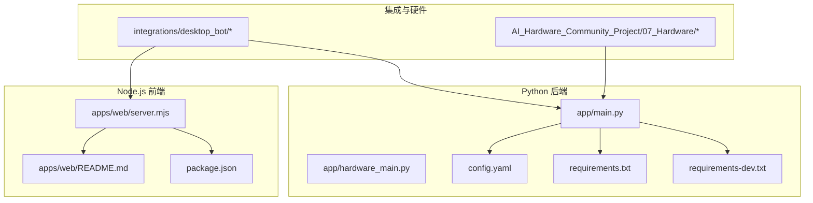
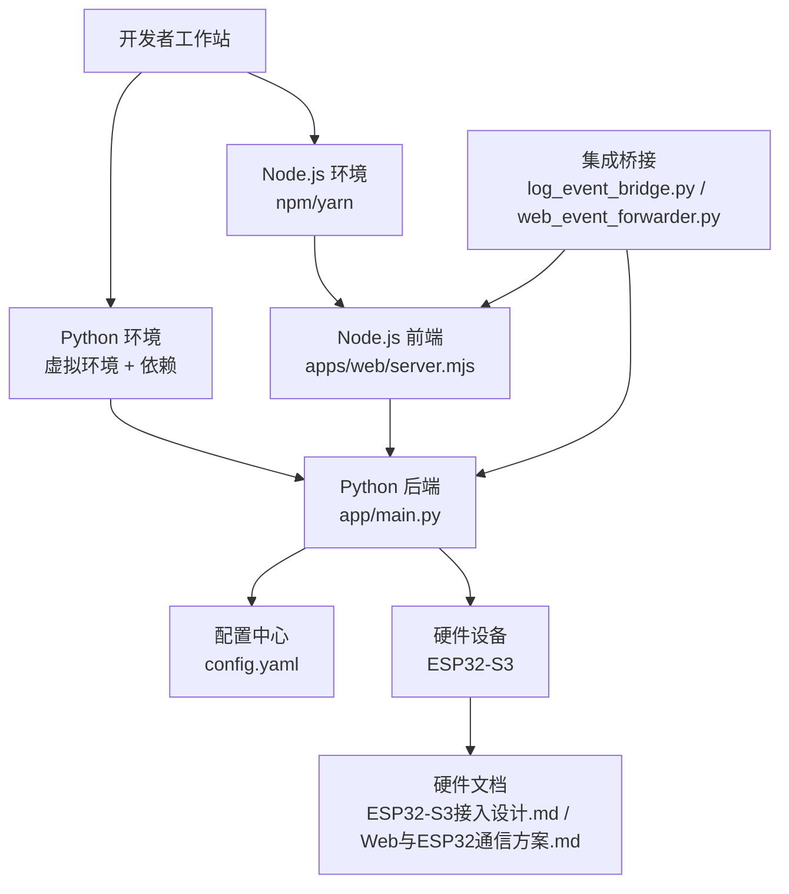
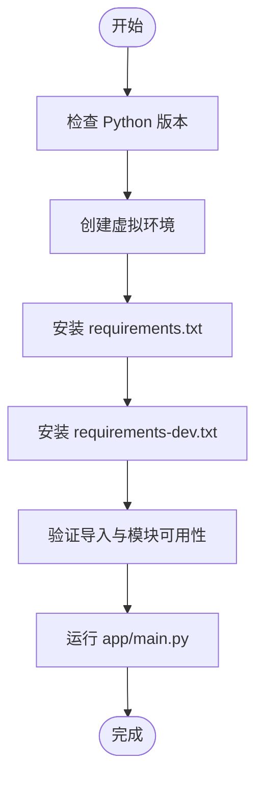
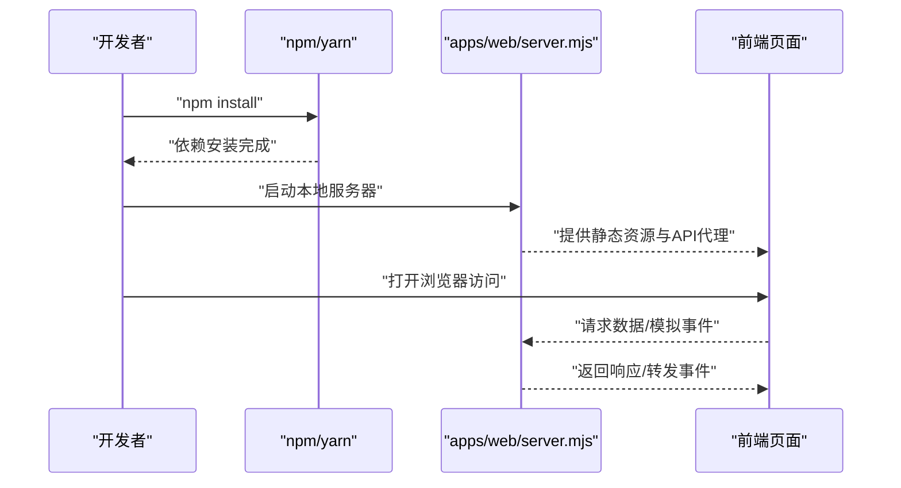
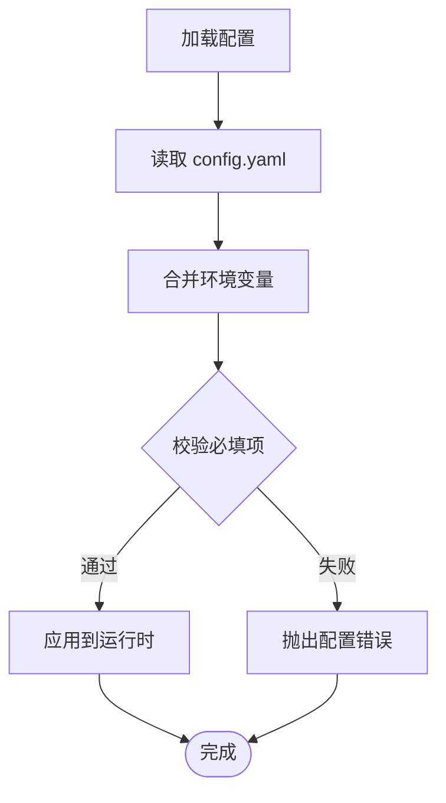
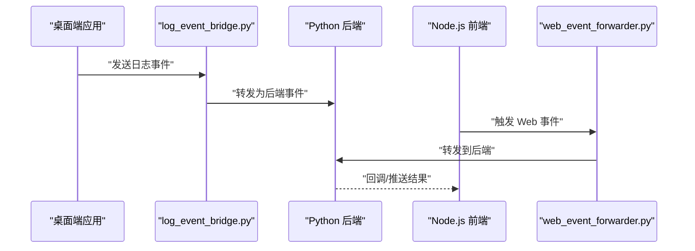
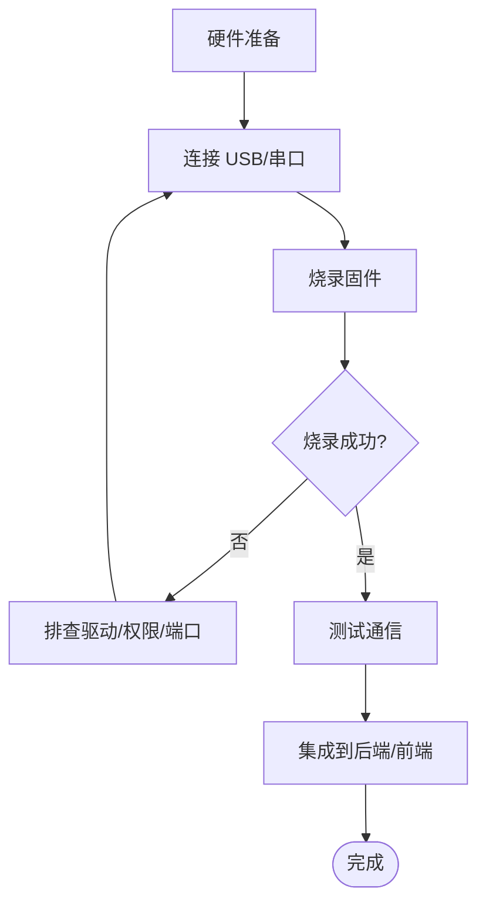
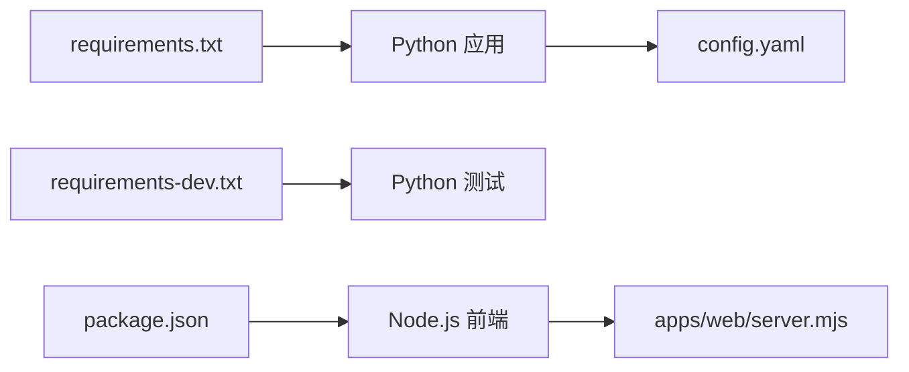

# 开发环境搭建

<cite>
**本文引用的文件**   
- [README.md](file://README.md)
- [requirements.txt](file://requirements.txt)
- [requirements-dev.txt](file://requirements-dev.txt)
- [config.yaml](file://config.yaml)
- [package.json](file://package.json)
- [app/main.py](file://app/main.py)
- [app/hardware_main.py](file://app/hardware_main.py)
- [apps/web/README.md](file://apps/web/README.md)
- [apps/web/server.mjs](file://apps/web/server.mjs)
- [integrations/desktop_bot/log_event_bridge.py](file://integrations/desktop_bot/log_event_bridge.py)
- [integrations/desktop_bot/web_event_forwarder.py](file://integrations/desktop_bot/web_event_forwarder.py)
- [AI_Hardware_Community_Project/07_Hardware/ESP32-S3接入设计.md](file://AI_Hardware_Community_Project/07_Hardware/ESP32-S3接入设计.md)
- [AI_Hardware_Community_Project/07_Hardware/Web与ESP32通信方案.md](file://AI_Hardware_Community_Project/07_Hardware/Web与ESP32通信方案.md)
- [pytest.ini](file://pytest.ini)
</cite>

## 目录
1. [简介](#简介)
2. [项目结构](#项目结构)
3. [核心组件](#核心组件)
4. [架构总览](#架构总览)
5. [详细组件分析](#详细组件分析)
6. [依赖关系分析](#依赖关系分析)
7. [性能考虑](#性能考虑)
8. [故障排查指南](#故障排查指南)
9. [结论](#结论)
10. [附录](#附录)

## 简介
本指南面向首次接触本项目的开发者，目标是帮助你从零开始搭建完整的本地开发环境。内容覆盖：
- Python 与 Node.js 环境准备、虚拟环境创建与管理
- 依赖包安装（Python 与 Node）
- 配置文件与环境变量设置
- IDE 与常用开发工具配置建议
- 硬件设备连接与 ESP32-S3 固件烧录、调试工具设置
- 常见问题定位与解决方案

通过本指南，你将能够顺利运行后端服务、前端 Web 应用，并在本地模拟或连接真实硬件进行端到端联调。

## 项目结构
本项目采用多模块组织方式，主要包含：
- app：Python 后端与感知运行时、API 服务、硬件交互等核心逻辑
- apps/web：Node.js 前端与本地模拟器、Web 服务脚本
- integrations：桌面端集成桥接与事件转发
- AI_Hardware_Community_Project：硬件接入设计与通信方案文档
- scripts：辅助脚本（录音、图像接收、视觉演示等）
- tests：单元测试与集成测试
- tools：辅助工具脚本
- config.yaml：全局配置
- requirements*.txt：Python 依赖
- package.json：Node 依赖与脚本

图表来源
- [app/main.py:1-200](file://app/main.py#L1-L200)
- [app/hardware_main.py:1-200](file://app/hardware_main.py#L1-L200)
- [config.yaml:1-200](file://config.yaml#L1-L200)
- [requirements.txt:1-200](file://requirements.txt#L1-L200)
- [requirements-dev.txt:1-200](file://requirements-dev.txt#L1-L200)
- [apps/web/server.mjs:1-200](file://apps/web/server.mjs#L1-L200)
- [apps/web/README.md:1-200](file://apps/web/README.md#L1-L200)
- [package.json:1-200](file://package.json#L1-L200)
- [integrations/desktop_bot/log_event_bridge.py:1-200](file://integrations/desktop_bot/log_event_bridge.py#L1-L200)
- [integrations/desktop_bot/web_event_forwarder.py:1-200](file://integrations/desktop_bot/web_event_forwarder.py#L1-L200)
- [AI_Hardware_Community_Project/07_Hardware/ESP32-S3接入设计.md:1-200](file://AI_Hardware_Community_Project/07_Hardware/ESP32-S3接入设计.md#L1-L200)
- [AI_Hardware_Community_Project/07_Hardware/Web与ESP32通信方案.md:1-200](file://AI_Hardware_Community_Project/07_Hardware/Web与ESP32通信方案.md#1-L200)

章节来源
- [README.md:1-200](file://README.md#L1-L200)
- [app/main.py:1-200](file://app/main.py#L1-L200)
- [app/hardware_main.py:1-200](file://app/hardware_main.py#L1-L200)
- [apps/web/README.md:1-200](file://apps/web/README.md#L1-L200)

## 核心组件
- Python 后端入口与服务启动
  - 主程序入口位于 app/main.py，负责初始化配置、加载模块、启动 API 服务与感知运行时。
  - 硬件模式入口位于 app/hardware_main.py，用于在硬件设备上运行简化版服务与传感器采集。
- 配置管理
  - 全局配置由 config.yaml 提供，涵盖端口、模型路径、日志级别、硬件接口等。
- Node.js 前端与模拟器
  - apps/web 提供 Web 界面、本地模拟器和轻量服务器，便于快速验证前后端交互。
- 集成桥接
  - integrations/desktop_bot 提供日志事件桥接与 Web 事件转发，打通桌面端与 Web/后端。

章节来源
- [app/main.py:1-200](file://app/main.py#L1-L200)
- [app/hardware_main.py:1-200](file://app/hardware_main.py#L1-L200)
- [config.yaml:1-200](file://config.yaml#L1-L200)
- [apps/web/README.md:1-200](file://apps/web/README.md#L1-L200)
- [integrations/desktop_bot/log_event_bridge.py:1-200](file://integrations/desktop_bot/log_event_bridge.py#L1-L200)
- [integrations/desktop_bot/web_event_forwarder.py:1-200](file://integrations/desktop_bot/web_event_forwarder.py#L1-L200)

## 架构总览
下图展示了开发环境中的关键组件与数据流：Python 后端提供 API 与感知能力，Node.js 前端提供可视化与模拟器，集成桥接将桌面端事件转发到后端，硬件侧通过串口/网络与后端通信。

图表来源
- [app/main.py:1-200](file://app/main.py#L1-L200)
- [apps/web/server.mjs:1-200](file://apps/web/server.mjs#L1-L200)
- [integrations/desktop_bot/log_event_bridge.py:1-200](file://integrations/desktop_bot/log_event_bridge.py#L1-L200)
- [integrations/desktop_bot/web_event_forwarder.py:1-200](file://integrations/desktop_bot/web_event_forwarder.py#L1-L200)
- [config.yaml:1-200](file://config.yaml#L1-L200)
- [AI_Hardware_Community_Project/07_Hardware/ESP32-S3接入设计.md:1-200](file://AI_Hardware_Community_Project/07_Hardware/ESP32-S3接入设计.md#L1-L200)
- [AI_Hardware_Community_Project/07_Hardware/Web与ESP32通信方案.md:1-200](file://AI_Hardware_Community_Project/07_Hardware/Web与ESP32通信方案.md#L1-L200)

## 详细组件分析

### Python 环境搭建与依赖安装
- 版本要求
  - 建议使用 Python 3.10+（根据依赖库兼容性选择具体小版本）。
- 虚拟环境
  - 推荐使用 venv 或 conda 创建隔离环境，避免系统级污染。
- 依赖安装
  - 使用 requirements.txt 安装运行时依赖；使用 requirements-dev.txt 安装开发与测试依赖。
- 启动方式
  - 通过 app/main.py 启动后端服务；如需硬件模式，使用 app/hardware_main.py。

章节来源
- [requirements.txt:1-200](file://requirements.txt#L1-L200)
- [requirements-dev.txt:1-200](file://requirements-dev.txt#L1-L200)
- [app/main.py:1-200](file://app/main.py#L1-L200)
- [app/hardware_main.py:1-200](file://app/hardware_main.py#L1-L200)

### Node.js 环境搭建与前端依赖
- 版本要求
  - 建议使用 Node.js LTS（如 18.x 或 20.x），确保 npm 脚本稳定运行。
- 依赖安装
  - 进入 apps/web 目录，使用 npm install 安装依赖。
- 启动与模拟
  - 参考 apps/web/README.md 的说明，使用提供的脚本启动本地服务器与模拟器。
- 构建与测试
  - 使用 package.json 中定义的脚本执行构建与测试任务。

图表来源
- [apps/web/server.mjs:1-200](file://apps/web/server.mjs#L1-L200)
- [apps/web/README.md:1-200](file://apps/web/README.md#L1-L200)
- [package.json:1-200](file://package.json#L1-L200)

章节来源
- [apps/web/README.md:1-200](file://apps/web/README.md#L1-L200)
- [package.json:1-200](file://package.json#L1-L200)

### 配置文件与环境变量
- 全局配置
  - 修改 config.yaml 以调整端口、模型路径、日志级别、硬件接口等参数。
- 环境变量
  - 某些敏感信息（如密钥、路径）可通过环境变量注入，建议在 .env 文件中管理并通过工具加载。
- 配置优先级
  - 通常环境变量优先于配置文件，具体以代码实现为准。

章节来源
- [config.yaml:1-200](file://config.yaml#L1-L200)

### 集成桥接与事件转发
- 日志事件桥接
  - integrations/desktop_bot/log_event_bridge.py 负责将桌面端日志事件转换为后端可消费的事件格式。
- Web 事件转发
  - integrations/desktop_bot/web_event_forwarder.py 将 Web 端事件转发至后端或前端服务，实现跨进程通信。

图表来源
- [integrations/desktop_bot/log_event_bridge.py:1-200](file://integrations/desktop_bot/log_event_bridge.py#L1-L200)
- [integrations/desktop_bot/web_event_forwarder.py:1-200](file://integrations/desktop_bot/web_event_forwarder.py#L1-L200)
- [app/main.py:1-200](file://app/main.py#L1-L200)
- [apps/web/server.mjs:1-200](file://apps/web/server.mjs#L1-L200)

章节来源
- [integrations/desktop_bot/log_event_bridge.py:1-200](file://integrations/desktop_bot/log_event_bridge.py#L1-L200)
- [integrations/desktop_bot/web_event_forwarder.py:1-200](file://integrations/desktop_bot/web_event_forwarder.py#L1-L200)

### 硬件设备连接与 ESP32-S3 固件烧录
- 硬件接入设计
  - 参考 AI_Hardware_Community_Project/07_Hardware/ESP32-S3接入设计.md，了解引脚定义、通信协议与电源要求。
- Web 与 ESP32 通信方案
  - 参考 AI_Hardware_Community_Project/07_Hardware/Web与ESP32通信方案.md，了解串口/HTTP/MQTT 等通信方式的选择与配置。
- 固件烧录与调试
  - 使用官方工具链（如 esptool、PlatformIO、Arduino IDE）进行固件编译与烧录。
  - 启用串口监视器查看日志，结合后端日志定位问题。

章节来源
- [AI_Hardware_Community_Project/07_Hardware/ESP32-S3接入设计.md:1-200](file://AI_Hardware_Community_Project/07_Hardware/ESP32-S3接入设计.md#L1-L200)
- [AI_Hardware_Community_Project/07_Hardware/Web与ESP32通信方案.md:1-200](file://AI_Hardware_Community_Project/07_Hardware/Web与ESP32通信方案.md#L1-L200)

### IDE 与开发工具建议
- Python
  - VS Code + Pylance/Black/Flake8/Ruff，配合 pytest 插件进行单测与覆盖率。
  - 使用 venv 或 conda 管理环境，配置解释器路径。
- Node.js
  - VS Code + ESLint/Prettier，配合 npm scripts 进行构建与测试。
- 通用
  - Git 钩子（pre-commit）统一代码风格；Docker（可选）用于容器化部署。

[本节为通用建议，不直接分析具体文件]

## 依赖关系分析
- Python 依赖
  - requirements.txt：运行时依赖（如 Web 框架、音频处理、视觉推理等）。
  - requirements-dev.txt：开发依赖（测试、格式化、类型检查等）。
- Node 依赖
  - package.json：前端依赖与脚本命令（构建、测试、模拟器等）。

图表来源
- [requirements.txt:1-200](file://requirements.txt#L1-L200)
- [requirements-dev.txt:1-200](file://requirements-dev.txt#L1-L200)
- [package.json:1-200](file://package.json#L1-L200)
- [config.yaml:1-200](file://config.yaml#L1-L200)
- [apps/web/server.mjs:1-200](file://apps/web/server.mjs#L1-L200)

章节来源
- [requirements.txt:1-200](file://requirements.txt#L1-L200)
- [requirements-dev.txt:1-200](file://requirements-dev.txt#L1-L200)
- [package.json:1-200](file://package.json#L1-L200)

## 性能考虑
- Python
  - 合理设置线程池与异步 IO，避免阻塞调用影响 API 响应。
  - 对大模型推理进行批处理与缓存，减少重复计算。
- Node.js
  - 使用流式处理与内存优化，避免大对象堆积。
  - 前端静态资源压缩与懒加载提升首屏速度。
- 硬件
  - 控制采样频率与传输频率，降低带宽与功耗。
  - 使用高效编码格式（如 JPEG/MP3）减少体积。

[本节为通用指导，不直接分析具体文件]

## 故障排查指南
- Python 环境问题
  - 症状：导入失败、模块缺失、版本冲突。
  - 解决：确认虚拟环境激活、重新安装依赖、检查 Python 版本。
- Node 环境问题
  - 症状：npm install 失败、脚本报错。
  - 解决：清理 node_modules 与锁文件后重试，检查 Node 版本与镜像源。
- 配置错误
  - 症状：服务启动失败、端口占用、路径不存在。
  - 解决：检查 config.yaml 与 .env，确保必填项正确且路径有效。
- 硬件连接问题
  - 症状：无法识别串口、烧录失败、通信无响应。
  - 解决：检查驱动与权限、更换 USB 线、确认波特率与端口号。
- 测试与断言
  - 使用 pytest 运行测试用例，定位回归问题。

章节来源
- [pytest.ini:1-200](file://pytest.ini#L1-L200)

## 结论
通过本指南，你已掌握从环境准备、依赖安装、配置管理到硬件联调的全流程。建议在实际开发中遵循统一的代码规范与测试策略，持续优化性能与稳定性。遇到问题时，优先检查配置与依赖，再逐步深入到模块与硬件层定位根因。

## 附录
- 常用命令速查
  - Python：python -m venv venv、source venv/bin/activate（Linux/macOS）、venv\Scripts\activate（Windows）、pip install -r requirements.txt、pip install -r requirements-dev.txt
  - Node：cd apps/web、npm install、npm run dev/build/test
- 参考文档
  - README.md：项目概览与使用说明
  - apps/web/README.md：前端使用说明与脚本说明
  - AI_Hardware_Community_Project/07_Hardware/*：硬件接入与通信方案

[本节为补充信息，不直接分析具体文件]