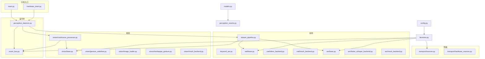
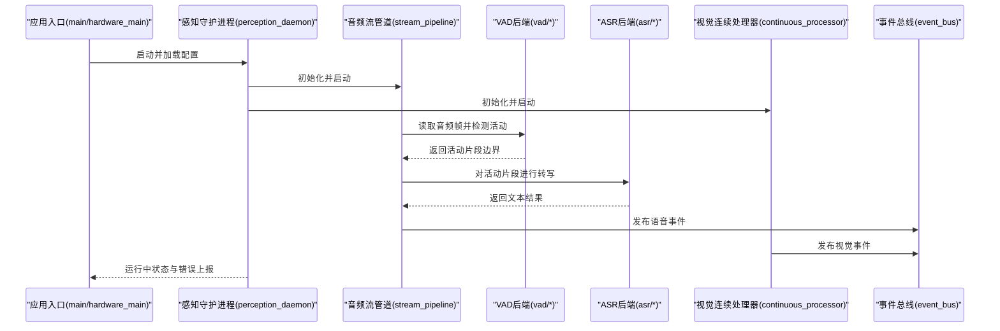
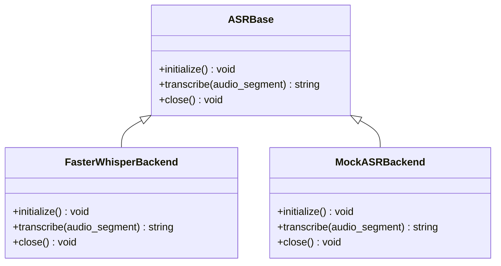
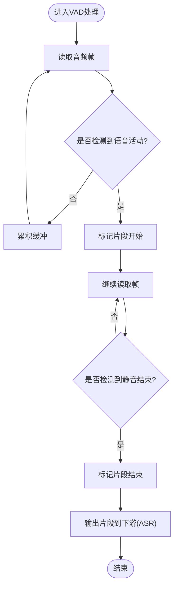
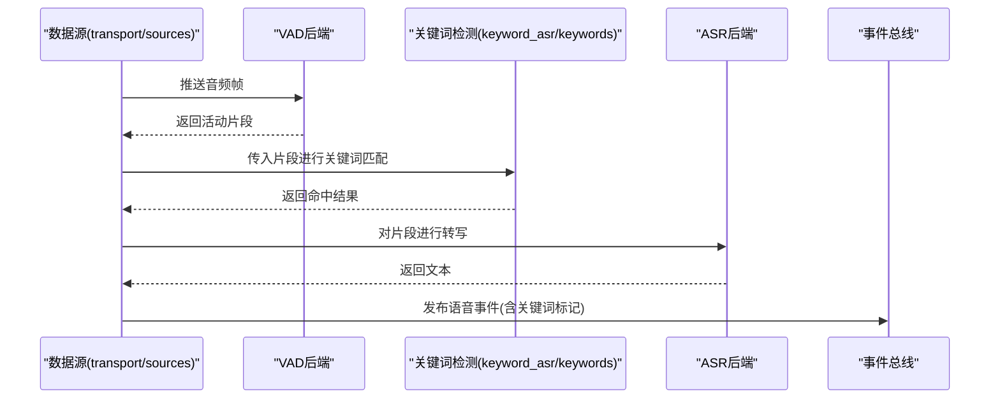
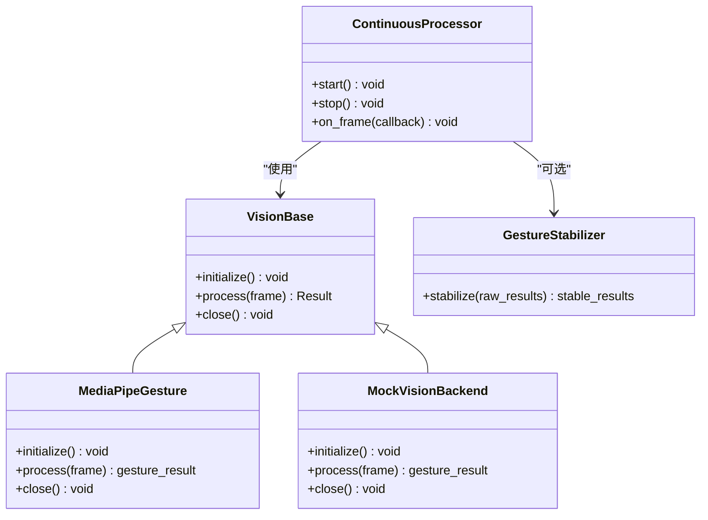
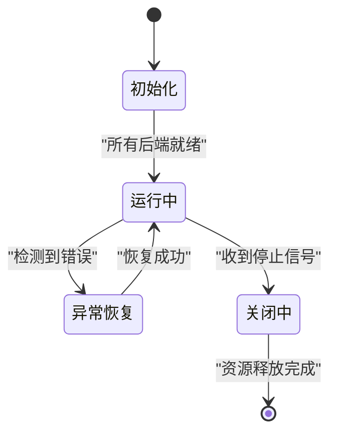
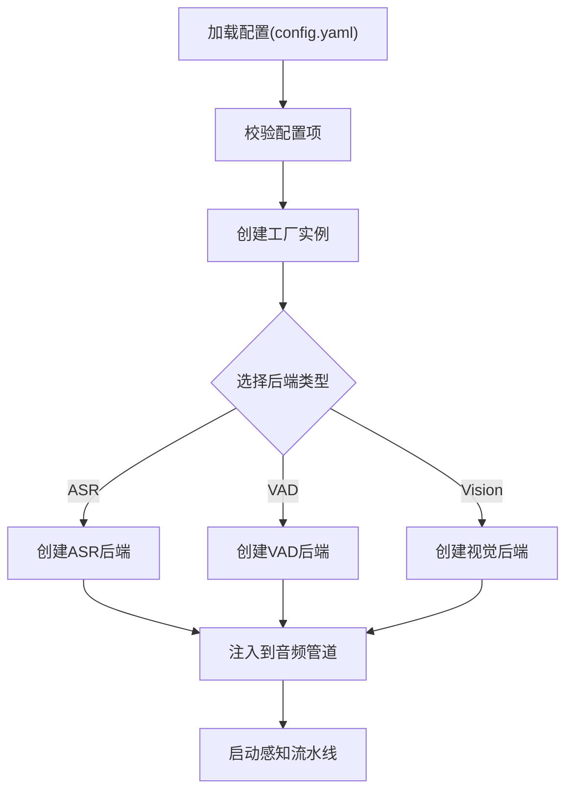
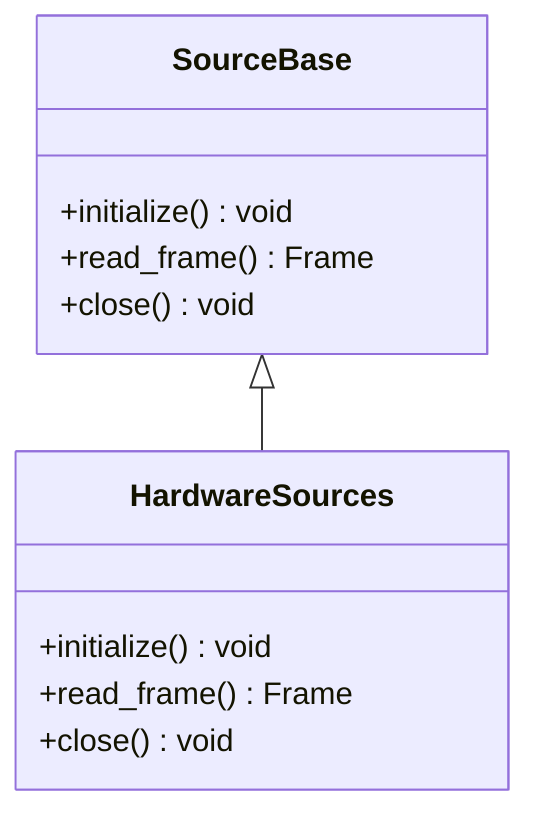
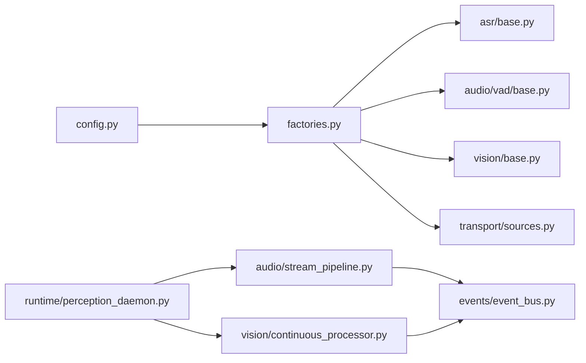

# 扩展开发

<cite>
**本文引用的文件**   
- [app/asr/base.py](file://app/asr/base.py)
- [app/asr/faster_whisper_backend.py](file://app/asr/faster_whisper_backend.py)
- [app/asr/mock_backend.py](file://app/asr/mock_backend.py)
- [app/audio/vad/base.py](file://app/audio/vad/base.py)
- [app/audio/vad/silero_backend.py](file://app/audio/vad/silero_backend.py)
- [app/audio/vad/mock_backend.py](file://app/audio/vad/mock_backend.py)
- [app/audio/stream_pipeline.py](file://app/audio/stream_pipeline.py)
- [app/audio/keyword_asr.py](file://app/audio/keyword_asr.py)
- [app/detection/keywords.py](file://app/detection/keywords.py)
- [app/vision/base.py](file://app/vision/base.py)
- [app/vision/continuous_processor.py](file://app/vision/continuous_processor.py)
- [app/vision/gesture_stabilizer.py](file://app/vision/gesture_stabilizer.py)
- [app/vision/image_loader.py](file://app/vision/image_loader.py)
- [app/vision/mediapipe_gesture.py](file://app/vision/mediapipe_gesture.py)
- [app/vision/mock_backend.py](file://app/vision/mock_backend.py)
- [app/runtime/perception_daemon.py](file://app/runtime/perception_daemon.py)
- [app/config.py](file://app/config.py)
- [app/factories.py](file://app/factories.py)
- [app/main.py](file://app/main.py)
- [app/hardware_main.py](file://app/hardware_main.py)
- [app/models.py](file://app/models.py)
- [app/perception_events.py](file://app/perception_events.py)
- [app/events/event_bus.py](file://app/events/event_bus.py)
- [app/transport/sources.py](file://app/transport/sources.py)
- [app/transport/hardware_sources.py](file://app/transport/hardware_sources.py)
- [config.yaml](file://config.yaml)
</cite>

## 目录
1. [简介](#简介)
2. [项目结构](#项目结构)
3. [核心组件](#核心组件)
4. [架构总览](#架构总览)
5. [详细组件分析](#详细组件分析)
6. [依赖关系分析](#依赖关系分析)
7. [性能考量](#性能考量)
8. [故障排查指南](#故障排查指南)
9. [结论](#结论)
10. [附录](#附录)

## 简介
本指南面向希望扩展现有感知能力与功能的开发者，重点覆盖：
- ASR（自动语音识别）后端接口实现与替换
- VAD（语音活动检测）算法集成与切换
- 视觉处理模块开发与手势识别接入
- 插件化架构、接口规范与生命周期管理
- 自定义关键词检测、手势识别算法集成与新硬件设备支持
- API 扩展、中间件开发与第三方服务集成的最佳实践

目标是在不破坏现有稳定性的前提下，通过清晰的抽象与工厂机制，快速接入新的感知后端与数据源，并以事件总线驱动跨模块协作。

## 项目结构
本项目采用分层与按功能域组织相结合的结构：
- app/asr：ASR 后端抽象与具体实现（如 Faster Whisper、Mock）
- app/audio：音频流管道、VAD 抽象与实现、关键词唤醒
- app/vision：视觉处理抽象、连续帧处理、手势识别与图像加载
- app/runtime：感知守护进程，统一调度各感知流水线
- app/transport：数据源抽象与硬件接入
- app/events：事件总线，用于模块间解耦通信
- app/config：配置加载与校验
- app/factories：工厂方法，负责根据配置创建具体后端实例
- app/main / app/hardware_main：应用入口（桌面端与硬件端）

图表来源
- [app/main.py](file://app/main.py)
- [app/hardware_main.py](file://app/hardware_main.py)
- [app/runtime/perception_daemon.py](file://app/runtime/perception_daemon.py)
- [app/audio/stream_pipeline.py](file://app/audio/stream_pipeline.py)
- [app/vision/continuous_processor.py](file://app/vision/continuous_processor.py)
- [app/audio/vad/base.py](file://app/audio/vad/base.py)
- [app/asr/base.py](file://app/asr/base.py)
- [app/vision/base.py](file://app/vision/base.py)
- [app/transport/sources.py](file://app/transport/sources.py)
- [app/config.py](file://app/config.py)
- [app/factories.py](file://app/factories.py)
- [app/models.py](file://app/models.py)
- [app/perception_events.py](file://app/perception_events.py)

章节来源
- [app/main.py](file://app/main.py)
- [app/hardware_main.py](file://app/hardware_main.py)
- [app/runtime/perception_daemon.py](file://app/runtime/perception_daemon.py)
- [app/config.py](file://app/config.py)
- [app/factories.py](file://app/factories.py)

## 核心组件
- ASR 后端抽象与实现：定义统一的转写接口，提供 Mock 与 Faster Whisper 两种实现，便于测试与生产部署。
- VAD 抽象与实现：定义语音活动检测接口，提供 Silero 与 Mock 实现，支持静音段切分与触发。
- 音频流管道：将输入源、VAD、ASR 串联成可配置的流水线，支持关键词唤醒与事件输出。
- 视觉处理抽象与实现：定义图像/视频帧处理接口，提供连续处理器、手势稳定器、MediaPipe 手势识别与 Mock。
- 运行时守护进程：统一启动、协调各感知流水线，管理生命周期与错误恢复。
- 事件总线：基于发布/订阅模式，解耦各模块，支持感知事件分发与消费。
- 工厂与配置：依据配置文件动态创建后端实例，屏蔽差异，简化扩展。

章节来源
- [app/asr/base.py](file://app/asr/base.py)
- [app/asr/faster_whisper_backend.py](file://app/asr/faster_whisper_backend.py)
- [app/asr/mock_backend.py](file://app/asr/mock_backend.py)
- [app/audio/vad/base.py](file://app/audio/vad/base.py)
- [app/audio/vad/silero_backend.py](file://app/audio/vad/silero_backend.py)
- [app/audio/vad/mock_backend.py](file://app/audio/vad/mock_backend.py)
- [app/audio/stream_pipeline.py](file://app/audio/stream_pipeline.py)
- [app/vision/base.py](file://app/vision/base.py)
- [app/vision/continuous_processor.py](file://app/vision/continuous_processor.py)
- [app/vision/mediapipe_gesture.py](file://app/vision/mediapipe_gesture.py)
- [app/runtime/perception_daemon.py](file://app/runtime/perception_daemon.py)
- [app/events/event_bus.py](file://app/events/event_bus.py)
- [app/factories.py](file://app/factories.py)
- [app/config.py](file://app/config.py)

## 架构总览
系统以“数据源 → 感知流水线（音频/视觉）→ 事件总线”为主线，由运行时守护进程统一编排。ASR/VAD/视觉后端均通过抽象接口与工厂注入，确保可插拔与可替换。

图表来源
- [app/main.py](file://app/main.py)
- [app/hardware_main.py](file://app/hardware_main.py)
- [app/runtime/perception_daemon.py](file://app/runtime/perception_daemon.py)
- [app/audio/stream_pipeline.py](file://app/audio/stream_pipeline.py)
- [app/audio/vad/base.py](file://app/audio/vad/base.py)
- [app/asr/base.py](file://app/asr/base.py)
- [app/vision/continuous_processor.py](file://app/vision/continuous_processor.py)
- [app/events/event_bus.py](file://app/events/event_bus.py)

## 详细组件分析

### ASR 后端接口与实现
- 抽象接口：定义统一的转写方法与生命周期钩子（初始化、关闭等），保证不同后端一致调用方式。
- Faster Whisper 后端：高性能离线推理，适合本地部署；需关注模型加载与显存占用。
- Mock 后端：用于单元测试与无硬件环境调试，返回固定或随机文本。

图表来源
- [app/asr/base.py](file://app/asr/base.py)
- [app/asr/faster_whisper_backend.py](file://app/asr/faster_whisper_backend.py)
- [app/asr/mock_backend.py](file://app/asr/mock_backend.py)

章节来源
- [app/asr/base.py](file://app/asr/base.py)
- [app/asr/faster_whisper_backend.py](file://app/asr/faster_whisper_backend.py)
- [app/asr/mock_backend.py](file://app/asr/mock_backend.py)

### VAD 算法集成
- 抽象接口：定义帧级检测与片段聚合策略，暴露活动开始/结束回调。
- Silero 后端：基于深度学习的高精度 VAD，适合实时流式处理。
- Mock 后端：模拟静音/说话段，便于端到端测试。

图表来源
- [app/audio/vad/base.py](file://app/audio/vad/base.py)
- [app/audio/vad/silero_backend.py](file://app/audio/vad/silero_backend.py)
- [app/audio/vad/mock_backend.py](file://app/audio/vad/mock_backend.py)

章节来源
- [app/audio/vad/base.py](file://app/audio/vad/base.py)
- [app/audio/vad/silero_backend.py](file://app/audio/vad/silero_backend.py)
- [app/audio/vad/mock_backend.py](file://app/audio/vad/mock_backend.py)

### 音频流管道与关键词检测
- 音频流管道：组合数据源、VAD、ASR，形成可配置的流水线；支持背压与错误重试。
- 关键词检测：在 VAD 前或后插入关键词匹配逻辑，触发特定行为（如唤醒）。
- 事件输出：将转写结果与关键词命中事件推送到事件总线。

图表来源
- [app/audio/stream_pipeline.py](file://app/audio/stream_pipeline.py)
- [app/audio/keyword_asr.py](file://app/audio/keyword_asr.py)
- [app/detection/keywords.py](file://app/detection/keywords.py)
- [app/transport/sources.py](file://app/transport/sources.py)
- [app/events/event_bus.py](file://app/events/event_bus.py)

章节来源
- [app/audio/stream_pipeline.py](file://app/audio/stream_pipeline.py)
- [app/audio/keyword_asr.py](file://app/audio/keyword_asr.py)
- [app/detection/keywords.py](file://app/detection/keywords.py)
- [app/transport/sources.py](file://app/transport/sources.py)
- [app/events/event_bus.py](file://app/events/event_bus.py)

### 视觉处理模块与手势识别
- 视觉抽象：定义图像/帧处理接口，支持批量与流式处理。
- 连续处理器：管理帧的持续读取、预处理与结果聚合。
- 手势稳定器：对原始手势检测结果进行平滑与去抖。
- MediaPipe 手势识别：接入通用手势模型，支持多手势分类与置信度过滤。
- Mock 后端：用于无硬件环境的端到端验证。

图表来源
- [app/vision/base.py](file://app/vision/base.py)
- [app/vision/continuous_processor.py](file://app/vision/continuous_processor.py)
- [app/vision/gesture_stabilizer.py](file://app/vision/gesture_stabilizer.py)
- [app/vision/mediapipe_gesture.py](file://app/vision/mediapipe_gesture.py)
- [app/vision/mock_backend.py](file://app/vision/mock_backend.py)

章节来源
- [app/vision/base.py](file://app/vision/base.py)
- [app/vision/continuous_processor.py](file://app/vision/continuous_processor.py)
- [app/vision/gesture_stabilizer.py](file://app/vision/gesture_stabilizer.py)
- [app/vision/mediapipe_gesture.py](file://app/vision/mediapipe_gesture.py)
- [app/vision/mock_backend.py](file://app/vision/mock_backend.py)

### 运行时守护进程与生命周期管理
- 守护进程职责：启动/停止各感知流水线，监控健康状态，处理异常与重启策略。
- 生命周期钩子：初始化阶段加载配置与后端，运行阶段调度任务，关闭阶段释放资源。
- 事件上报：将关键状态与错误事件发布至事件总线，供上层监控与日志记录。

图表来源
- [app/runtime/perception_daemon.py](file://app/runtime/perception_daemon.py)
- [app/events/event_bus.py](file://app/events/event_bus.py)

章节来源
- [app/runtime/perception_daemon.py](file://app/runtime/perception_daemon.py)
- [app/events/event_bus.py](file://app/events/event_bus.py)

### 工厂与配置驱动的插件化
- 工厂方法：根据配置项选择并创建具体的 ASR/VAD/视觉后端实例，屏蔽实现差异。
- 配置中心：集中管理后端参数、阈值、路径等，支持热更新与环境隔离。
- 扩展点：新增后端只需实现对应抽象并在工厂注册，即可无缝接入。

图表来源
- [app/config.py](file://app/config.py)
- [app/factories.py](file://app/factories.py)
- [config.yaml](file://config.yaml)

章节来源
- [app/config.py](file://app/config.py)
- [app/factories.py](file://app/factories.py)
- [config.yaml](file://config.yaml)

### 数据源与硬件接入
- 数据源抽象：定义统一的帧/音频读取接口，支持文件、摄像头、麦克风、硬件设备等。
- 硬件源实现：封装底层硬件驱动，提供稳定的数据流与错误处理。
- 扩展新硬件：实现数据源接口并通过工厂注册，即可被感知流水线消费。

图表来源
- [app/transport/sources.py](file://app/transport/sources.py)
- [app/transport/hardware_sources.py](file://app/transport/hardware_sources.py)

章节来源
- [app/transport/sources.py](file://app/transport/sources.py)
- [app/transport/hardware_sources.py](file://app/transport/hardware_sources.py)

## 依赖关系分析
- 低耦合高内聚：各感知后端通过抽象接口与工厂解耦，运行时守护进程仅依赖抽象，不关心具体实现。
- 事件驱动：模块间通过事件总线通信，降低直接调用带来的耦合。
- 配置驱动：通过配置文件控制后端选择与参数，避免硬编码。

图表来源
- [app/config.py](file://app/config.py)
- [app/factories.py](file://app/factories.py)
- [app/asr/base.py](file://app/asr/base.py)
- [app/audio/vad/base.py](file://app/audio/vad/base.py)
- [app/vision/base.py](file://app/vision/base.py)
- [app/transport/sources.py](file://app/transport/sources.py)
- [app/runtime/perception_daemon.py](file://app/runtime/perception_daemon.py)
- [app/audio/stream_pipeline.py](file://app/audio/stream_pipeline.py)
- [app/vision/continuous_processor.py](file://app/vision/continuous_processor.py)
- [app/events/event_bus.py](file://app/events/event_bus.py)

章节来源
- [app/config.py](file://app/config.py)
- [app/factories.py](file://app/factories.py)
- [app/runtime/perception_daemon.py](file://app/runtime/perception_daemon.py)
- [app/events/event_bus.py](file://app/events/event_bus.py)

## 性能考量
- 模型加载与缓存：ASR/VAD/视觉模型应在初始化阶段加载并缓存，避免重复加载导致延迟。
- 批处理与流水线并行：合理设置批次大小与并发度，平衡吞吐与内存占用。
- 资源释放：在关闭阶段及时释放 GPU/CPU 资源，防止泄漏。
- 错误恢复：对网络请求、硬件读取失败实施重试与降级策略，保障稳定性。
- 事件节流：在高频率事件场景下，对事件进行合并或限流，减轻下游压力。

[本节为通用指导，无需列出具体文件来源]

## 故障排查指南
- 常见问题定位：
  - 后端初始化失败：检查配置项是否正确，依赖库是否安装完整。
  - 音频无活动：调整 VAD 阈值与采样率，确认输入源正常。
  - 转写结果异常：检查 ASR 模型版本与语言包，确认音频质量。
  - 视觉识别不稳定：调整手势稳定器参数与置信度阈值。
- 日志与事件：
  - 启用详细日志，关注守护进程与健康检查事件。
  - 订阅事件总线的关键事件，建立告警规则。
- 回滚与降级：
  - 优先切换到 Mock 后端进行问题复现与隔离。
  - 保留历史配置快照，支持快速回滚。

章节来源
- [app/runtime/perception_daemon.py](file://app/runtime/perception_daemon.py)
- [app/events/event_bus.py](file://app/events/event_bus.py)
- [app/config.py](file://app/config.py)

## 结论
通过抽象接口、工厂方法与事件总线，本项目实现了高度可扩展的感知架构。开发者可以按需替换 ASR/VAD/视觉后端，快速接入新算法与新硬件，同时保持系统的稳定性与可维护性。建议遵循本文档的接口规范与最佳实践，确保扩展的一致性与可移植性。

[本节为总结性内容，无需列出具体文件来源]

## 附录
- 扩展清单与建议步骤：
  - 新增 ASR 后端：实现抽象接口，注册到工厂，更新配置。
  - 集成新 VAD 算法：实现抽象接口，调整阈值参数，加入流水线。
  - 开发视觉处理模块：实现抽象接口，接入连续处理器与稳定器。
  - 接入新硬件设备：实现数据源接口，通过工厂注册，验证端到端流程。
  - 中间件开发：基于事件总线订阅/发布，实现横切逻辑（如审计、统计）。
  - 第三方服务集成：通过事件总线桥接外部 API，注意超时与重试。

[本节为补充信息，无需列出具体文件来源]