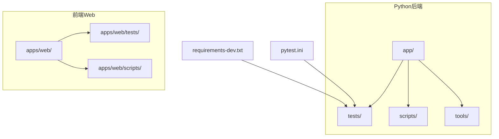
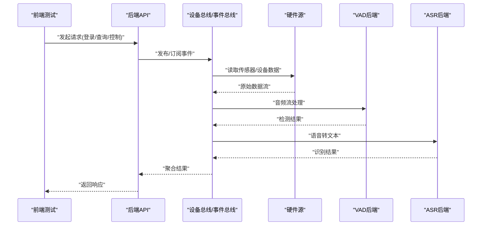
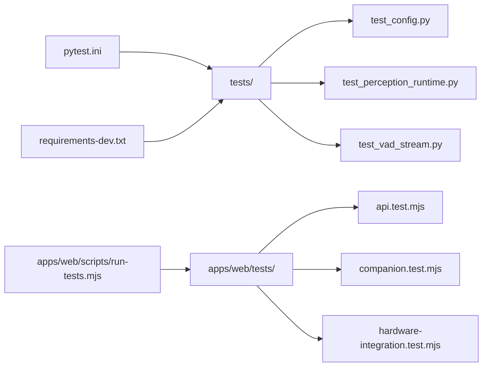

# 测试指南

<cite>
**本文引用的文件**   
- [pytest.ini](file://pytest.ini)
- [requirements-dev.txt](file://requirements-dev.txt)
- [tests/test_config.py](file://tests/test_config.py)
- [tests/test_perception_runtime.py](file://tests/test_perception_runtime.py)
- [tests/test_vad_stream.py](file://tests/test_vad_stream.py)
- [app/config.py](file://app/config.py)
- [app/runtime/perception_daemon.py](file://app/runtime/perception_daemon.py)
- [app/audio/vad/silero_backend.py](file://app/audio/vad/silero_backend.py)
- [app/audio/vad/mock_backend.py](file://app/audio/vad/mock_backend.py)
- [app/asr/base.py](file://app/asr/base.py)
- [app/asr/mock_backend.py](file://app/asr/mock_backend.py)
- [app/transport/hardware_sources.py](file://app/transport/hardware_sources.py)
- [app/transport/sources.py](file://app/transport/sources.py)
- [app/main.py](file://app/main.py)
- [app/__main__.py](file://app/__main__.py)
- [apps/web/tests/api.test.mjs](file://apps/web/tests/api.test.mjs)
- [apps/web/tests/companion.test.mjs](file://apps/web/tests/companion.test.mjs)
- [apps/web/tests/hardware-integration.test.mjs](file://apps/web/tests/hardware-integration.test.mjs)
- [apps/web/scripts/run-tests.mjs](file://apps/web/scripts/run-tests.mjs)
- [apps/web/services/device-bus.js](file://apps/web/services/device-bus.js)
- [apps/web/services/sleep-simulator.js](file://apps/web/services/sleep-simulator.js)
- [apps/web/server.mjs](file://apps/web/server.mjs)
- [scripts/printer_test.py](file://scripts/printer_test.py)
- [tools/printer_test.py](file://tools/printer_test.py)
</cite>

## 目录
1. [简介](#简介)
2. [项目结构](#项目结构)
3. [核心组件](#核心组件)
4. [架构总览](#架构总览)
5. [详细组件分析](#详细组件分析)
6. [依赖分析](#依赖分析)
7. [性能考虑](#性能考虑)
8. [故障排查指南](#故障排查指南)
9. [结论](#结论)
10. [附录](#附录)

## 简介
本指南面向AI桌面设备项目的测试实践，覆盖单元测试、集成测试与端到端测试的编写方法。重点包括：
- pytest框架的使用、用例组织与断言方法
- 前端测试框架配置、Mock对象使用与测试数据管理
- 硬件模拟测试、传感器数据模拟与异步测试最佳实践
- 测试覆盖率统计、持续集成配置与性能测试方法

目标是帮助开发者快速建立稳定、可维护且高效的测试体系，确保后端服务、前端交互与硬件集成的质量。

## 项目结构
本项目采用前后端分离与多模块设计，测试相关的关键位置如下：
- Python后端测试位于 tests/ 目录，使用 pytest 运行
- 前端测试位于 apps/web/tests/，通过 Node.js 脚本执行
- 工具与脚本包含一些辅助测试程序（如打印机测试）
- 配置文件 pytest.ini 定义 pytest 行为
- 开发依赖 requirements-dev.txt 包含测试相关库

图表来源
- [pytest.ini](file://pytest.ini)
- [requirements-dev.txt](file://requirements-dev.txt)
- [tests/test_config.py](file://tests/test_config.py)
- [apps/web/tests/api.test.mjs](file://apps/web/tests/api.test.mjs)

章节来源
- [pytest.ini](file://pytest.ini)
- [requirements-dev.txt](file://requirements-dev.txt)
- [tests/test_config.py](file://tests/test_config.py)
- [apps/web/tests/api.test.mjs](file://apps/web/tests/api.test.mjs)

## 核心组件
- 配置模块：用于加载与校验应用配置，便于在测试中注入不同环境参数
- 感知运行时：负责事件总线、流式处理与后台守护进程调度
- VAD与ASR后端：语音活动检测与自动语音识别，提供真实与Mock实现
- 传输层：硬件源与通用数据源抽象，支持模拟与真实设备接入
- 前端设备总线与服务：模拟设备通信、状态管理与API调用

章节来源
- [app/config.py](file://app/config.py)
- [app/runtime/perception_daemon.py](file://app/runtime/perception_daemon.py)
- [app/audio/vad/silero_backend.py](file://app/audio/vad/silero_backend.py)
- [app/audio/vad/mock_backend.py](file://app/audio/vad/mock_backend.py)
- [app/asr/base.py](file://app/asr/base.py)
- [app/asr/mock_backend.py](file://app/asr/mock_backend.py)
- [app/transport/hardware_sources.py](file://app/transport/hardware_sources.py)
- [app/transport/sources.py](file://app/transport/sources.py)
- [apps/web/services/device-bus.js](file://apps/web/services/device-bus.js)
- [apps/web/services/sleep-simulator.js](file://apps/web/services/sleep-simulator.js)

## 架构总览
下图展示从前端到后端的整体测试流程，包括API调用、设备总线、硬件源与VAD/ASR后端的交互。

图表来源
- [app/main.py](file://app/main.py)
- [app/__main__.py](file://app/__main__.py)
- [app/transport/hardware_sources.py](file://app/transport/hardware_sources.py)
- [app/audio/vad/silero_backend.py](file://app/audio/vad/silero_backend.py)
- [app/asr/base.py](file://app/asr/base.py)
- [apps/web/server.mjs](file://apps/web/server.mjs)
- [apps/web/services/device-bus.js](file://apps/web/services/device-bus.js)

## 详细组件分析

### 单元测试：pytest基础与用例组织
- 用例命名规范：以 test_ 开头，函数或类内方法均可
- 夹具（Fixture）：用于准备测试数据、替换外部依赖（如数据库、硬件）
- 参数化：使用 @pytest.mark.parametrize 进行多组输入输出验证
- 断言：优先使用标准 assert，必要时引入第三方断言库
- 隔离：通过Mock替换外部系统（网络、硬件、文件系统）

章节来源
- [tests/test_config.py](file://tests/test_config.py)
- [pytest.ini](file://pytest.ini)

### 集成测试：后端服务与硬件源
- 目标：验证多个模块协作（如传输层、VAD/ASR、事件总线）
- 策略：使用Mock后端替代真实硬件，保证可重复性
- 数据流：构造输入流，检查中间结果与最终输出
- 错误路径：模拟异常与超时，验证恢复逻辑

章节来源
- [app/transport/hardware_sources.py](file://app/transport/hardware_sources.py)
- [app/transport/sources.py](file://app/transport/sources.py)
- [app/audio/vad/mock_backend.py](file://app/audio/vad/mock_backend.py)
- [app/asr/mock_backend.py](file://app/asr/mock_backend.py)
- [tests/test_perception_runtime.py](file://tests/test_perception_runtime.py)
- [tests/test_vad_stream.py](file://tests/test_vad_stream.py)

### 端到端测试：前端与后端交互
- 目标：模拟用户操作，验证完整业务流程
- 工具：Node.js脚本驱动浏览器或HTTP客户端
- Mock：使用本地Mock API或服务模拟器
- 稳定性：避免依赖真实硬件，使用模拟器注入数据

章节来源
- [apps/web/tests/api.test.mjs](file://apps/web/tests/api.test.mjs)
- [apps/web/tests/companion.test.mjs](file://apps/web/tests/companion.test.mjs)
- [apps/web/tests/hardware-integration.test.mjs](file://apps/web/tests/hardware-integration.test.mjs)
- [apps/web/scripts/run-tests.mjs](file://apps/web/scripts/run-tests.mjs)
- [apps/web/server.mjs](file://apps/web/server.mjs)

### 硬件模拟测试与传感器数据模拟
- 硬件源抽象：通过接口统一访问真实与模拟设备
- 数据注入：构造时间序列、噪声、异常值等场景
- 同步与异步：使用事件总线协调数据流与处理阶段
- 回退策略：当硬件不可用时自动切换到Mock后端

章节来源
- [app/transport/hardware_sources.py](file://app/transport/hardware_sources.py)
- [app/transport/sources.py](file://app/transport/sources.py)
- [apps/web/services/sleep-simulator.js](file://apps/web/services/sleep-simulator.js)

### 异步测试最佳实践
- 使用异步夹具与异步上下文管理器管理资源
- 对协程进行超时保护，避免阻塞测试
- 验证事件顺序与并发安全性
- 使用Mock验证回调与事件触发

章节来源
- [app/runtime/perception_daemon.py](file://app/runtime/perception_daemon.py)
- [tests/test_perception_runtime.py](file://tests/test_perception_runtime.py)

### 前端测试框架配置与Mock对象使用
- 配置：通过脚本统一管理测试环境与依赖
- Mock：拦截API请求，返回固定响应或动态生成数据
- 状态管理：模拟设备状态变化，验证UI更新
- 调试：启用日志与可视化输出，定位问题

章节来源
- [apps/web/scripts/run-tests.mjs](file://apps/web/scripts/run-tests.mjs)
- [apps/web/services/device-bus.js](file://apps/web/services/device-bus.js)
- [apps/web/server.mjs](file://apps/web/server.mjs)

### 测试数据管理
- 固定数据集：JSON/YAML文件存储常用样本
- 动态生成：基于规则或随机种子生成多样化数据
- 清理策略：测试结束后自动清理临时文件与缓存
- 版本控制：将关键数据纳入版本管理，确保一致性

章节来源
- [tests/test_config.py](file://tests/test_config.py)
- [apps/web/tests/api.test.mjs](file://apps/web/tests/api.test.mjs)

### 覆盖率统计与持续集成
- 覆盖率：使用pytest-cov生成报告，设置阈值
- CI：在GitHub Actions或类似平台自动化运行测试
- 并行：利用多核加速测试执行
- 报告：归档HTML报告，便于回溯与分析

章节来源
- [pytest.ini](file://pytest.ini)
- [requirements-dev.txt](file://requirements-dev.txt)

### 性能测试方法
- 基准测试：测量关键函数耗时与内存占用
- 负载测试：模拟高并发请求，观察服务稳定性
- 瓶颈分析：结合Profiling工具定位热点代码
- 优化建议：缓存、批处理、异步化

章节来源
- [app/runtime/perception_daemon.py](file://app/runtime/perception_daemon.py)
- [app/audio/vad/silero_backend.py](file://app/audio/vad/silero_backend.py)

## 依赖分析
下图展示测试相关的依赖关系，包括pytest、前端测试脚本与Mock后端。

图表来源
- [pytest.ini](file://pytest.ini)
- [requirements-dev.txt](file://requirements-dev.txt)
- [tests/test_config.py](file://tests/test_config.py)
- [tests/test_perception_runtime.py](file://tests/test_perception_runtime.py)
- [tests/test_vad_stream.py](file://tests/test_vad_stream.py)
- [apps/web/scripts/run-tests.mjs](file://apps/web/scripts/run-tests.mjs)
- [apps/web/tests/api.test.mjs](file://apps/web/tests/api.test.mjs)
- [apps/web/tests/companion.test.mjs](file://apps/web/tests/companion.test.mjs)
- [apps/web/tests/hardware-integration.test.mjs](file://apps/web/tests/hardware-integration.test.mjs)

章节来源
- [pytest.ini](file://pytest.ini)
- [requirements-dev.txt](file://requirements-dev.txt)
- [tests/test_config.py](file://tests/test_config.py)
- [tests/test_perception_runtime.py](file://tests/test_perception_runtime.py)
- [tests/test_vad_stream.py](file://tests/test_vad_stream.py)
- [apps/web/scripts/run-tests.mjs](file://apps/web/scripts/run-tests.mjs)
- [apps/web/tests/api.test.mjs](file://apps/web/tests/api.test.mjs)
- [apps/web/tests/companion.test.mjs](file://apps/web/tests/companion.test.mjs)
- [apps/web/tests/hardware-integration.test.mjs](file://apps/web/tests/hardware-integration.test.mjs)

## 性能考虑
- 减少I/O：在单元测试中避免真实磁盘与网络访问
- 缓存策略：对昂贵计算结果进行缓存，提升测试速度
- 并行执行：合理拆分测试套件，充分利用CPU资源
- 监控指标：记录关键路径的延迟与资源消耗

[本节为通用指导，不直接分析具体文件]

## 故障排查指南
- 常见问题：
  - 测试环境缺失依赖：检查 requirements-dev.txt 与安装命令
  - Mock未生效：确认替换点与作用域
  - 异步超时：增加超时阈值或优化协程逻辑
  - 前端测试失败：检查服务器启动与端口占用
- 调试技巧：
  - 启用详细日志，定位错误堆栈
  - 使用交互式调试器逐步执行
  - 简化测试用例，逐步复现问题

章节来源
- [requirements-dev.txt](file://requirements-dev.txt)
- [tests/test_perception_runtime.py](file://tests/test_perception_runtime.py)
- [apps/web/server.mjs](file://apps/web/server.mjs)

## 结论
通过系统化构建单元测试、集成测试与端到端测试，结合Mock与模拟器，可以有效保障AI桌面设备的软件质量。pytest与前端测试脚本的配合，使得测试覆盖全面、执行高效。持续集成与性能测试进一步提升了交付可靠性与用户体验。

[本节为总结性内容，不直接分析具体文件]

## 附录
- 参考脚本：
  - 打印机测试：scripts/printer_test.py、tools/printer_test.py
  - 前端测试入口：apps/web/scripts/run-tests.mjs
- 配置文件：
  - pytest.ini：定义pytest行为与插件
  - requirements-dev.txt：列出开发依赖，包括测试库

章节来源
- [scripts/printer_test.py](file://scripts/printer_test.py)
- [tools/printer_test.py](file://tools/printer_test.py)
- [apps/web/scripts/run-tests.mjs](file://apps/web/scripts/run-tests.mjs)
- [pytest.ini](file://pytest.ini)
- [requirements-dev.txt](file://requirements-dev.txt)