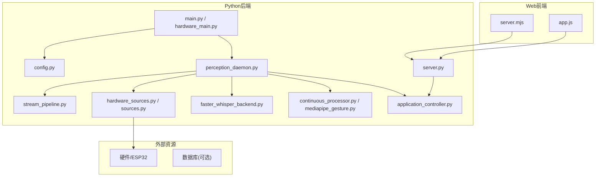
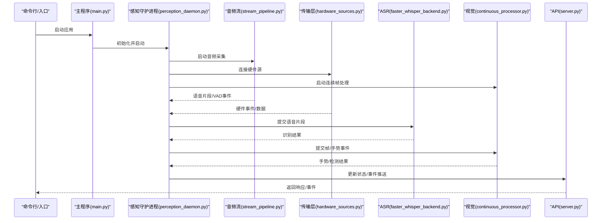
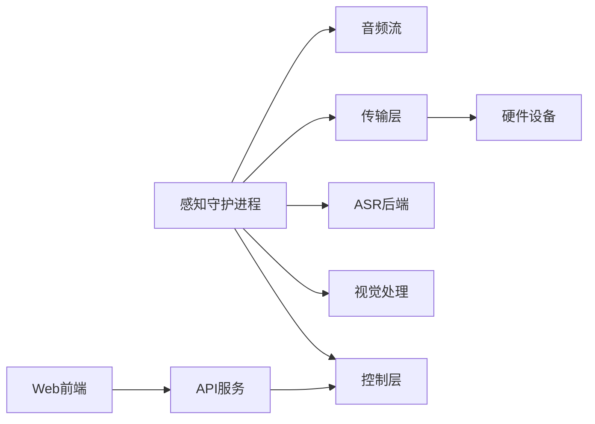
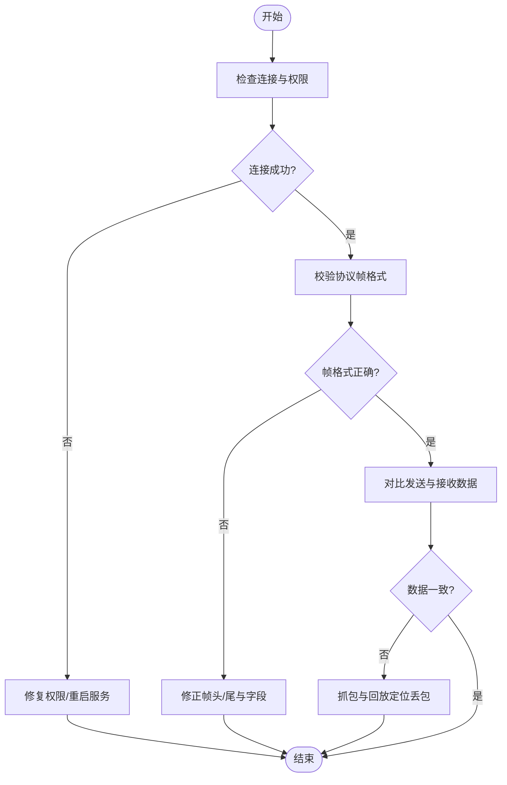

# 调试与故障排除

<cite>
**本文引用的文件**   
- [README.md](file://README.md)
- [config.yaml](file://config.yaml)
- [app/config.py](file://app/config.py)
- [app/main.py](file://app/main.py)
- [app/hardware_main.py](file://app/hardware_main.py)
- [app/runtime/perception_daemon.py](file://app/runtime/perception_daemon.py)
- [app/audio/stream_pipeline.py](file://app/audio/stream_pipeline.py)
- [app/transport/hardware_sources.py](file://app/transport/hardware_sources.py)
- [app/transport/sources.py](file://app/transport/sources.py)
- [app/asr/faster_whisper_backend.py](file://app/asr/faster_whisper_backend.py)
- [app/vision/continuous_processor.py](file://app/vision/continuous_processor.py)
- [app/vision/mediapipe_gesture.py](file://app/vision/mediapipe_gesture.py)
- [app/control/application_controller.py](file://app/control/application_controller.py)
- [app/api/server.py](file://app/api/server.py)
- [apps/web/server.mjs](file://apps/web/server.mjs)
- [apps/web/app.js](file://apps/web/app.js)
- [scripts/receive_images.py](file://scripts/receive_images.py)
- [scripts/receive_microphone.py](file://scripts/receive_microphone.py)
- [tests/test_perception_runtime.py](file://tests/test_perception_runtime.py)
- [pytest.ini](file://pytest.ini)
</cite>

## 目录
1. [简介](#简介)
2. [项目结构](#项目结构)
3. [核心组件](#核心组件)
4. [架构总览](#架构总览)
5. [详细组件分析](#详细组件分析)
6. [依赖关系分析](#依赖关系分析)
7. [性能考虑](#性能考虑)
8. [故障排除指南](#故障排除指南)
9. [结论](#结论)
10. [附录](#附录)

## 简介
本指南面向AI硬件社区项目的开发与运维人员，聚焦于日志记录配置、调试工具使用与性能分析方法。内容覆盖Python调试器、浏览器开发者工具、硬件通信排查、传感器数据验证与实时流处理调试，并提供常见问题诊断、错误代码解释与解决方案，帮助快速定位并修复问题。

## 项目结构
本项目采用前后端分离与多模块后端架构：
- Python后端位于 app/，包含音频、视觉、ASR、控制、运行时守护进程、传输层与API服务。
- Web前端位于 apps/web/，提供模拟与真实设备交互界面。
- 脚本位于 scripts/，用于图像与麦克风数据接收测试。
- 配置集中在 config.yaml 与 app/config.py。
- 测试位于 tests/，使用 pytest 框架。

图表来源
- [app/main.py:1-200](file://app/main.py#L1-L200)
- [app/hardware_main.py:1-200](file://app/hardware_main.py#L1-L200)
- [app/config.py:1-200](file://app/config.py#L1-L200)
- [app/runtime/perception_daemon.py:1-200](file://app/runtime/perception_daemon.py#L1-L200)
- [app/audio/stream_pipeline.py:1-200](file://app/audio/stream_pipeline.py#L1-L200)
- [app/transport/hardware_sources.py:1-200](file://app/transport/hardware_sources.py#L1-L200)
- [app/transport/sources.py:1-200](file://app/transport/sources.py#L1-L200)
- [app/asr/faster_whisper_backend.py:1-200](file://app/asr/faster_whisper_backend.py#L1-L200)
- [app/vision/continuous_processor.py:1-200](file://app/vision/continuous_processor.py#L1-L200)
- [app/vision/mediapipe_gesture.py:1-200](file://app/vision/mediapipe_gesture.py#L1-L200)
- [app/control/application_controller.py:1-200](file://app/control/application_controller.py#L1-L200)
- [app/api/server.py:1-200](file://app/api/server.py#L1-L200)
- [apps/web/server.mjs:1-200](file://apps/web/server.mjs#L1-L200)
- [apps/web/app.js:1-200](file://apps/web/app.js#L1-L200)

章节来源
- [README.md:1-200](file://README.md#L1-L200)

## 核心组件
- 配置管理：集中式配置加载与环境变量覆盖，支持不同运行模式（开发/生产）。
- 感知守护进程：统一调度音频、视觉、ASR等子系统的生命周期与事件总线。
- 音频流管道：采集、VAD、关键词检测与ASR后处理。
- 传输层：硬件源抽象与数据桥接，适配ESP32等设备。
- 视觉处理：连续帧处理与手势识别后端。
- 控制与应用控制器：命令路由与状态管理。
- API服务：HTTP接口暴露，供Web前端调用。

章节来源
- [app/config.py:1-200](file://app/config.py#L1-L200)
- [app/runtime/perception_daemon.py:1-200](file://app/runtime/perception_daemon.py#L1-L200)
- [app/audio/stream_pipeline.py:1-200](file://app/audio/stream_pipeline.py#L1-L200)
- [app/transport/hardware_sources.py:1-200](file://app/transport/hardware_sources.py#L1-L200)
- [app/vision/continuous_processor.py:1-200](file://app/vision/continuous_processor.py#L1-L200)
- [app/control/application_controller.py:1-200](file://app/control/application_controller.py#L1-L200)
- [app/api/server.py:1-200](file://app/api/server.py#L1-L200)

## 架构总览
系统以守护进程为核心，协调各子系统；Web前端通过API与服务端交互；硬件通过传输层接入。关键流程包括：
- 启动阶段：加载配置、初始化守护进程与各子系统、注册事件处理器。
- 数据采集：音频与视觉流持续采集，经VAD与关键词检测触发ASR或动作。
- 数据处理：ASR文本输出、手势识别结果进入控制层，驱动应用行为。
- 对外接口：API服务暴露查询与控制接口，供前端调用。

图表来源
- [app/main.py:1-200](file://app/main.py#L1-L200)
- [app/runtime/perception_daemon.py:1-200](file://app/runtime/perception_daemon.py#L1-L200)
- [app/audio/stream_pipeline.py:1-200](file://app/audio/stream_pipeline.py#L1-L200)
- [app/transport/hardware_sources.py:1-200](file://app/transport/hardware_sources.py#L1-L200)
- [app/asr/faster_whisper_backend.py:1-200](file://app/asr/faster_whisper_backend.py#L1-L200)
- [app/vision/continuous_processor.py:1-200](file://app/vision/continuous_processor.py#L1-L200)
- [app/api/server.py:1-200](file://app/api/server.py#L1-L200)

## 详细组件分析

### 日志记录配置与最佳实践
- 统一日志配置：在配置文件中定义日志级别、输出目标（控制台/文件）、格式模板与轮转策略。
- 运行时切换：通过环境变量或命令行参数动态调整日志级别，便于开发与生产环境差异化管理。
- 结构化日志：为关键路径（音频采集、ASR识别、手势检测、硬件通信）添加上下文字段（如设备ID、会话ID、时间戳）。
- 建议：避免在高频循环中打印过多日志；对异常堆栈进行分级记录，减少噪声。

章节来源
- [config.yaml:1-200](file://config.yaml#L1-L200)
- [app/config.py:1-200](file://app/config.py#L1-L200)

### Python调试器使用指南
- 断点调试：在关键函数入口设置断点，逐步执行观察变量变化。
- 条件断点：针对特定输入或状态触发，减少无效断点命中。
- 远程调试：在容器或远端服务器启用调试端口，IDE远程连接。
- 性能剖析：结合cProfile与line_profiler定位热点函数与内存占用。

章节来源
- [app/runtime/perception_daemon.py:1-200](file://app/runtime/perception_daemon.py#L1-L200)
- [app/audio/stream_pipeline.py:1-200](file://app/audio/stream_pipeline.py#L1-L200)
- [app/vision/continuous_processor.py:1-200](file://app/vision/continuous_processor.py#L1-L200)

### 浏览器开发者工具与网络调试
- 网络面板：查看请求/响应、WebSocket消息、缓存与带宽消耗。
- 性能面板：录制页面负载与交互过程，分析长任务与重排重绘。
- 内存面板：快照对比查找内存泄漏，检查未释放对象。
- 前端日志：使用console与自定义事件上报，配合后端日志关联问题。

章节来源
- [apps/web/server.mjs:1-200](file://apps/web/server.mjs#L1-L200)
- [apps/web/app.js:1-200](file://apps/web/app.js#L1-L200)

### 硬件通信问题排查
- 连接建立：检查串口/USB枚举、权限与波特率匹配。
- 协议校验：核对MVP设备模拟协议字段与顺序，确保帧头/尾正确。
- 数据一致性：对比发送与接收字节序列，定位丢包与乱码。
- 重试与超时：实现指数退避与超时回退，提升鲁棒性。

章节来源
- [app/transport/hardware_sources.py:1-200](file://app/transport/hardware_sources.py#L1-L200)
- [app/transport/sources.py:1-200](file://app/transport/sources.py#L1-L200)

### 传感器数据验证与实时流处理调试
- 采样率与延迟：测量端到端延迟，确认缓冲大小与线程池配置。
- VAD阈值调优：根据环境噪声调整阈值，减少误触发。
- 帧丢弃策略：在高负载下优先保留关键帧，保证流畅度。
- 可视化验证：使用脚本接收图像/音频数据进行离线回放与比对。

章节来源
- [app/audio/stream_pipeline.py:1-200](file://app/audio/stream_pipeline.py#L1-L200)
- [scripts/receive_images.py:1-200](file://scripts/receive_images.py#L1-L200)
- [scripts/receive_microphone.py:1-200](file://scripts/receive_microphone.py#L1-L200)

### ASR与视觉处理调试
- ASR后端：检查模型加载、显存占用与解码超时；对静音段做预处理。
- 视觉后端：MediaPipe配置优化，降低分辨率与帧率以提升吞吐。
- 结果融合：将ASR文本与手势结果合并为语义指令，避免歧义。

章节来源
- [app/asr/faster_whisper_backend.py:1-200](file://app/asr/faster_whisper_backend.py#L1-L200)
- [app/vision/mediapipe_gesture.py:1-200](file://app/vision/mediapipe_gesture.py#L1-L200)
- [app/vision/continuous_processor.py:1-200](file://app/vision/continuous_processor.py#L1-L200)

### API与前端集成调试
- 接口契约：遵循OpenAPI规范，确保请求/响应字段一致。
- 错误码：定义统一的错误码与消息，便于前端提示与后端追踪。
- 前端状态：维护设备连接状态、事件订阅与重试逻辑。

章节来源
- [app/api/server.py:1-200](file://app/api/server.py#L1-L200)
- [apps/web/server.mjs:1-200](file://apps/web/server.mjs#L1-L200)
- [apps/web/app.js:1-200](file://apps/web/app.js#L1-L200)

## 依赖关系分析
- 模块耦合：守护进程作为中枢，强依赖音频、传输、ASR、视觉与控制模块。
- 外部依赖：硬件设备、MediaPipe、ASR模型库、Web服务器。
- 潜在循环：避免模块间相互导入，使用事件总线解耦。

图表来源
- [app/runtime/perception_daemon.py:1-200](file://app/runtime/perception_daemon.py#L1-L200)
- [app/audio/stream_pipeline.py:1-200](file://app/audio/stream_pipeline.py#L1-L200)
- [app/transport/hardware_sources.py:1-200](file://app/transport/hardware_sources.py#L1-L200)
- [app/asr/faster_whisper_backend.py:1-200](file://app/asr/faster_whisper_backend.py#L1-L200)
- [app/vision/continuous_processor.py:1-200](file://app/vision/continuous_processor.py#L1-L200)
- [app/control/application_controller.py:1-200](file://app/control/application_controller.py#L1-L200)
- [app/api/server.py:1-200](file://app/api/server.py#L1-L200)
- [apps/web/server.mjs:1-200](file://apps/web/server.mjs#L1-L200)

章节来源
- [app/runtime/perception_daemon.py:1-200](file://app/runtime/perception_daemon.py#L1-L200)
- [app/api/server.py:1-200](file://app/api/server.py#L1-L200)

## 性能考虑
- 线程与队列：合理设置采集线程数与队列长度，避免阻塞与溢出。
- 批处理：对ASR与视觉推理进行批量处理，提高GPU利用率。
- 资源监控：定期采集CPU、内存、GPU与I/O指标，设置告警阈值。
- 降级策略：在资源紧张时降低分辨率、帧率与识别频率。

[本节为通用指导，不直接分析具体文件]

## 故障排除指南

### 常见问题诊断
- 无法启动：检查配置文件语法、环境变量与依赖安装。
- 无音频输入：确认麦克风权限、采样率与VAD阈值。
- 识别失败：检查ASR模型路径、显存与网络下载代理。
- 手势无响应：验证摄像头权限、分辨率与MediaPipe模型加载。
- 硬件无数据：检查串口权限、波特率与协议帧格式。

章节来源
- [app/config.py:1-200](file://app/config.py#L1-L200)
- [app/audio/stream_pipeline.py:1-200](file://app/audio/stream_pipeline.py#L1-L200)
- [app/asr/faster_whisper_backend.py:1-200](file://app/asr/faster_whisper_backend.py#L1-L200)
- [app/vision/mediapipe_gesture.py:1-200](file://app/vision/mediapipe_gesture.py#L1-L200)
- [app/transport/hardware_sources.py:1-200](file://app/transport/hardware_sources.py#L1-L200)

### 错误代码解释与解决方案
- 连接错误：硬件断开或权限不足，重启服务并检查设备管理器。
- 超时错误：网络或模型加载慢，增加超时与重试次数。
- 解析错误：协议字段缺失或类型不符，补充校验与默认值。
- 内存溢出：增大限制或优化数据结构，避免大对象常驻内存。

章节来源
- [app/transport/hardware_sources.py:1-200](file://app/transport/hardware_sources.py#L1-L200)
- [app/asr/faster_whisper_backend.py:1-200](file://app/asr/faster_whisper_backend.py#L1-L200)

### 内存泄漏检测
- 工具选择：tracemalloc、memory_profiler、Valgrind（C扩展）。
- 方法步骤：基线快照→操作→再次快照→对比差异→定位引用链。
- 常见原因：全局缓存过大、闭包持有引用、未关闭的文件/句柄。

章节来源
- [app/runtime/perception_daemon.py:1-200](file://app/runtime/perception_daemon.py#L1-L200)
- [app/vision/continuous_processor.py:1-200](file://app/vision/continuous_processor.py#L1-L200)

### CPU性能分析
- 热点定位：cProfile统计函数耗时，line_profiler逐行分析。
- 并行优化：GIL限制下的多线程/多进程权衡，IO密集型用异步。
- 算法优化：减少重复计算，使用向量化与缓存结果。

章节来源
- [app/audio/stream_pipeline.py:1-200](file://app/audio/stream_pipeline.py#L1-L200)
- [app/vision/continuous_processor.py:1-200](file://app/vision/continuous_processor.py#L1-L200)

### 网络请求调试
- 抓包工具：Wireshark、tcpdump、Charles/Fiddler。
- 前端监控：Performance API与自定义埋点。
- 后端日志：记录请求ID、URL、耗时与状态码。

章节来源
- [apps/web/server.mjs:1-200](file://apps/web/server.mjs#L1-L200)
- [app/api/server.py:1-200](file://app/api/server.py#L1-L200)

### 硬件通信问题排查流程图

图表来源
- [app/transport/hardware_sources.py:1-200](file://app/transport/hardware_sources.py#L1-L200)
- [scripts/receive_images.py:1-200](file://scripts/receive_images.py#L1-L200)
- [scripts/receive_microphone.py:1-200](file://scripts/receive_microphone.py#L1-L200)

### 单元测试与回归验证
- 用例设计：覆盖正常路径、边界条件与异常分支。
- 自动化：CI集成pytest，自动运行与报告生成。
- 数据驱动：使用固定种子与Mock数据保证可重复性。

章节来源
- [tests/test_perception_runtime.py:1-200](file://tests/test_perception_runtime.py#L1-L200)
- [pytest.ini:1-200](file://pytest.ini#L1-L200)

## 结论
通过系统化日志配置、完善的调试工具链与性能分析方法，结合硬件通信与实时流处理的专项排查，可显著提升问题定位效率与系统稳定性。建议在开发初期即建立监控与测试基线，持续优化关键路径与资源使用。

## 附录
- 常用命令：启动服务、运行测试、抓取日志、性能剖析。
- 参考文档：OpenAPI规范、MediaPipe文档、ASR模型说明。
- 联系方式：内部知识库与问题跟踪平台链接。

[本节为通用信息，不直接分析具体文件]