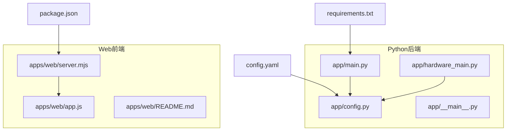
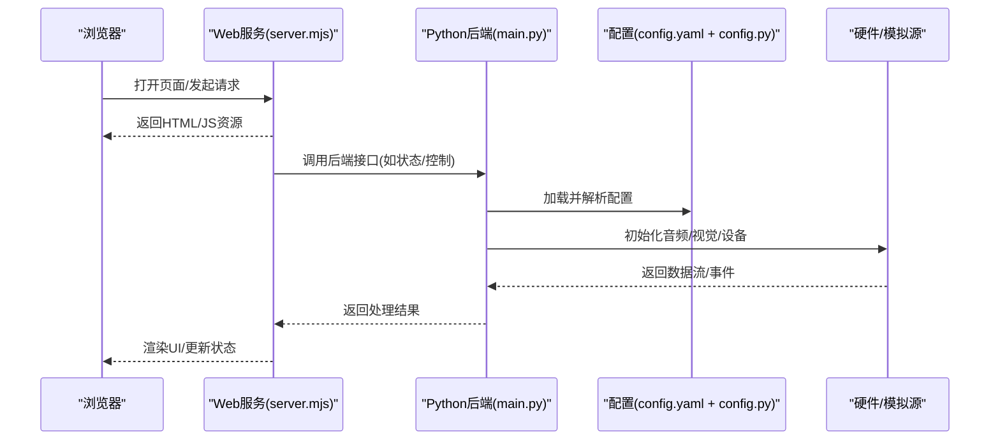
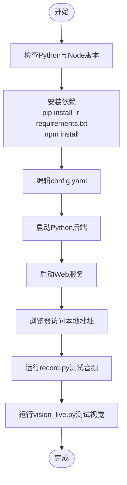
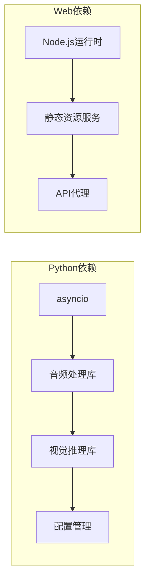

# 快速开始

<cite>
**本文引用的文件**   
- [README.md](file://README.md)
- [config.yaml](file://config.yaml)
- [requirements.txt](file://requirements.txt)
- [requirements-dev.txt](file://requirements-dev.txt)
- [package.json](file://package.json)
- [app/main.py](file://app/main.py)
- [app/hardware_main.py](file://app/hardware_main.py)
- [app/config.py](file://app/config.py)
- [app/__main__.py](file://app/__main__.py)
- [apps/web/README.md](file://apps/web/README.md)
- [apps/web/server.mjs](file://apps/web/server.mjs)
- [apps/web/app.js](file://apps/web/app.js)
- [scripts/record.py](file://scripts/record.py)
- [scripts/vision_live.py](file://scripts/vision_live.py)
- [tests/test_config.py](file://tests/test_config.py)
</cite>

## 目录
1. [简介](#简介)
2. [项目结构](#项目结构)
3. [核心组件](#核心组件)
4. [架构总览](#架构总览)
5. [详细组件分析](#详细组件分析)
6. [依赖分析](#依赖分析)
7. [性能注意事项](#性能注意事项)
8. [故障排除指南](#故障排除指南)
9. [结论](#结论)
10. [附录](#附录)

## 简介
本快速开始指南帮助你在5分钟内完成AI智能桌面设备应用的本地搭建与运行，涵盖环境准备、依赖安装、配置文件设置、基础启动流程以及跨平台（Windows、macOS、Linux）的特定说明。同时提供常见问题排查与验证方法，确保新手也能顺利运行基础功能。

## 项目结构
本项目采用前后端分离的组织方式：
- Python后端位于 app 目录，包含感知、音频、视觉、控制、事件总线等模块。
- Web前端位于 apps/web 目录，提供模拟与调试界面。
- 配置集中在根目录 config.yaml 与 app/config.py。
- 脚本与测试分别位于 scripts 和 tests 目录。

图表来源
- [app/main.py:1-200](file://app/main.py#L1-L200)
- [app/hardware_main.py:1-200](file://app/hardware_main.py#L1-L200)
- [app/config.py:1-200](file://app/config.py#L1-L200)
- [apps/web/server.mjs:1-200](file://apps/web/server.mjs#L1-L200)
- [apps/web/app.js:1-200](file://apps/web/app.js#L1-L200)
- [config.yaml:1-200](file://config.yaml#L1-L200)
- [requirements.txt:1-200](file://requirements.txt#L1-L200)
- [package.json:1-200](file://package.json#L1-L200)

章节来源
- [README.md:1-200](file://README.md#L1-L200)
- [config.yaml:1-200](file://config.yaml#L1-L200)
- [requirements.txt:1-200](file://requirements.txt#L1-L200)
- [requirements-dev.txt:1-200](file://requirements-dev.txt#L1-L200)
- [package.json:1-200](file://package.json#L1-L200)

## 核心组件
- 应用入口与主循环
  - Python后端通过 app/main.py 与 app/hardware_main.py 提供两种运行模式：通用模式与硬件直连模式。
  - __main__.py 提供命令行入口，便于直接以模块方式运行。
- 配置管理
  - app/config.py 负责加载并校验 config.yaml 的配置项，包括路径、端口、模型参数等。
- Web服务与前端
  - apps/web/server.mjs 启动本地HTTP服务，供浏览器访问。
  - apps/web/app.js 为前端逻辑，用于展示状态、交互与模拟数据。
- 辅助脚本
  - scripts/record.py 与 scripts/vision_live.py 用于录音与视觉演示，便于快速验证输入链路。

章节来源
- [app/main.py:1-200](file://app/main.py#L1-L200)
- [app/hardware_main.py:1-200](file://app/hardware_main.py#L1-L200)
- [app/__main__.py:1-200](file://app/__main__.py#L1-L200)
- [app/config.py:1-200](file://app/config.py#L1-L200)
- [apps/web/server.mjs:1-200](file://apps/web/server.mjs#L1-L200)
- [apps/web/app.js:1-200](file://apps/web/app.js#L1-L200)
- [scripts/record.py:1-200](file://scripts/record.py#L1-L200)
- [scripts/vision_live.py:1-200](file://scripts/vision_live.py#L1-L200)

## 架构总览
下图展示了从用户到后端的整体调用链：浏览器访问Web服务，Web服务与Python后端通信；Python后端读取配置，初始化感知与硬件模块，处理音频与视觉流，并将结果返回给前端展示或触发后续动作。

图表来源
- [apps/web/server.mjs:1-200](file://apps/web/server.mjs#L1-L200)
- [app/main.py:1-200](file://app/main.py#L1-L200)
- [app/config.py:1-200](file://app/config.py#L1-L200)
- [config.yaml:1-200](file://config.yaml#L1-L200)

## 详细组件分析

### 环境与依赖准备
- Python版本要求
  - 建议使用Python 3.10及以上版本，确保兼容项目中的异步与类型注解特性。
- Node.js版本要求
  - 建议使用Node.js 18+，以支持现代ES模块与构建脚本。
- 硬件要求
  - 麦克风：用于语音采集与ASR。
  - 摄像头：用于视觉识别与手势检测。
  - 可选：ESP32-S3或其他硬件设备，若需真实硬件接入。
- 依赖安装命令
  - Python依赖：在项目根目录执行 pip install -r requirements.txt。
  - 开发依赖（可选）：pip install -r requirements-dev.txt。
  - Web依赖：进入 apps/web 目录执行 npm install。

章节来源
- [requirements.txt:1-200](file://requirements.txt#L1-L200)
- [requirements-dev.txt:1-200](file://requirements-dev.txt#L1-L200)
- [package.json:1-200](file://package.json#L1-L200)

### 配置文件设置
- 配置文件位置
  - 根目录 config.yaml 为主配置，app/config.py 负责加载与校验。
- 关键配置项
  - 端口与地址：用于Web服务与后端监听。
  - 模型路径：ASR与视觉模型的本地路径或下载路径。
  - 设备选择：默认使用系统麦克风与摄像头，可切换至模拟后端。
  - 日志级别：建议开发阶段设置为DEBUG以便排查问题。
- 修改步骤
  - 复制示例配置（如有）为 config.yaml，按需调整端口、模型路径与设备选项。
  - 保存后重启应用生效。

章节来源
- [config.yaml:1-200](file://config.yaml#L1-L200)
- [app/config.py:1-200](file://app/config.py#L1-L200)

### 启动流程（5分钟）
- 启动Python后端
  - 在根目录执行 python -m app 或 python app/main.py。
  - 若需要硬件直连模式，执行 python app/hardware_main.py。
- 启动Web服务
  - 进入 apps/web 目录，执行 node server.mjs。
  - 浏览器访问 http://localhost:端口（根据配置）。
- 验证基础功能
  - 使用 scripts/record.py 录制一段音频，确认ASR链路可用。
  - 使用 scripts/vision_live.py 打开摄像头预览，确认视觉链路可用。

图表来源
- [app/main.py:1-200](file://app/main.py#L1-L200)
- [app/hardware_main.py:1-200](file://app/hardware_main.py#L1-L200)
- [apps/web/server.mjs:1-200](file://apps/web/server.mjs#L1-L200)
- [scripts/record.py:1-200](file://scripts/record.py#L1-L200)
- [scripts/vision_live.py:1-200](file://scripts/vision_live.py#L1-L200)

章节来源
- [app/__main__.py:1-200](file://app/__main__.py#L1-L200)
- [apps/web/README.md:1-200](file://apps/web/README.md#L1-L200)

### 跨平台安装说明
- Windows
  - 使用PowerShell或CMD执行安装命令。
  - 若遇到权限问题，以管理员身份运行终端。
  - 摄像头与麦克风权限需在“隐私设置”中允许浏览器与Python进程访问。
- macOS
  - 推荐使用Homebrew安装Python与Node.js。
  - 首次使用摄像头或麦克风时，需在“系统偏好设置-安全性与隐私”中授权。
- Linux
  - 使用包管理器安装Python与Node.js（如apt/yum）。
  - 确保用户属于audio与video组，以获得设备访问权限。

章节来源
- [README.md:1-200](file://README.md#L1-L200)

### 验证安装是否成功
- 后端健康检查
  - 启动后端后，查看控制台输出是否显示服务已监听指定端口。
- 前端页面加载
  - 浏览器访问本地地址，页面应正常渲染且无报错。
- 单元测试
  - 运行 pytest tests/test_config.py 验证配置加载是否正常。

章节来源
- [tests/test_config.py:1-200](file://tests/test_config.py#L1-L200)

## 依赖分析
- Python依赖
  - 核心库：异步框架、音频处理、视觉推理、配置管理等。
  - 开发依赖：pytest、类型检查、代码格式化等。
- Web依赖
  - Node.js运行时与ES模块支持，静态资源服务与API代理。

图表来源
- [requirements.txt:1-200](file://requirements.txt#L1-L200)
- [requirements-dev.txt:1-200](file://requirements-dev.txt#L1-L200)
- [package.json:1-200](file://package.json#L1-L200)

章节来源
- [requirements.txt:1-200](file://requirements.txt#L1-L200)
- [requirements-dev.txt:1-200](file://requirements-dev.txt#L1-L200)
- [package.json:1-200](file://package.json#L1-L200)

## 性能注意事项
- 模型加载优化
  - 将常用模型预下载到本地，避免首次运行时的网络延迟。
- 资源占用
  - 视觉处理与ASR可能占用较多CPU/GPU，建议在独立线程或进程中运行。
- 并发与缓冲
  - 合理设置音频与视频流的缓冲区大小，避免内存抖动。

[本节为通用指导，不直接分析具体文件]

## 故障排除指南
- 端口被占用
  - 现象：启动时报端口已被占用。
  - 解决：修改config.yaml中的端口号，或关闭占用该端口的进程。
- 设备权限不足
  - 现象：无法访问麦克风或摄像头。
  - 解决：在操作系统中授予相应权限，或将用户加入相关设备组（Linux）。
- 模型路径错误
  - 现象：启动时报找不到模型文件。
  - 解决：检查config.yaml中的模型路径是否正确，并确保文件存在。
- 依赖安装失败
  - 现象：pip或npm安装时报错。
  - 解决：升级pip与npm，检查网络代理设置，或使用国内镜像源。

章节来源
- [app/config.py:1-200](file://app/config.py#L1-L200)
- [config.yaml:1-200](file://config.yaml#L1-L200)

## 结论
通过以上步骤，你可以在5分钟内完成AI智能桌面设备应用的本地搭建与基础功能验证。建议后续根据实际需求扩展硬件接入、模型优化与前端交互。遇到问题时，优先检查配置与权限，再逐步定位依赖与环境问题。

[本节为总结性内容，不直接分析具体文件]

## 附录
- 常用命令速查
  - 启动后端：python -m app
  - 启动Web：cd apps/web && node server.mjs
  - 测试音频：python scripts/record.py
  - 测试视觉：python scripts/vision_live.py
  - 运行测试：pytest tests/test_config.py

[本节为补充信息，不直接分析具体文件]