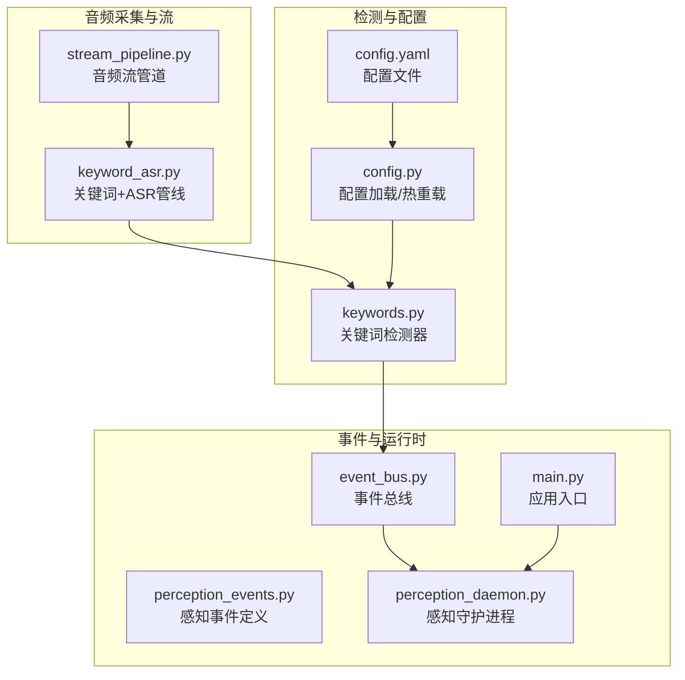
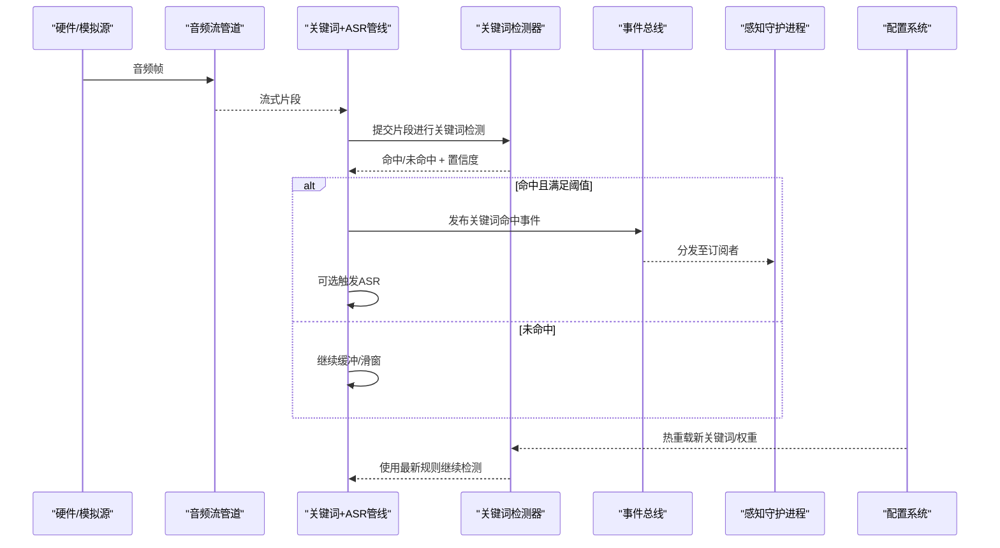
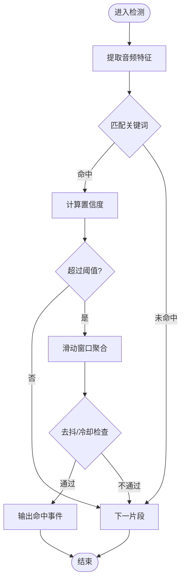
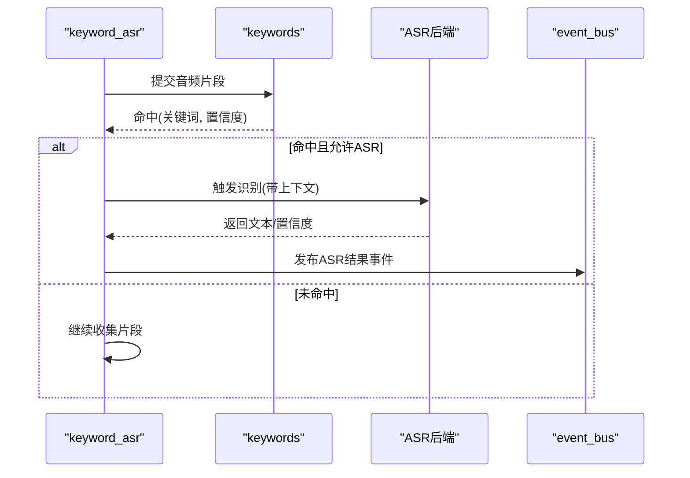
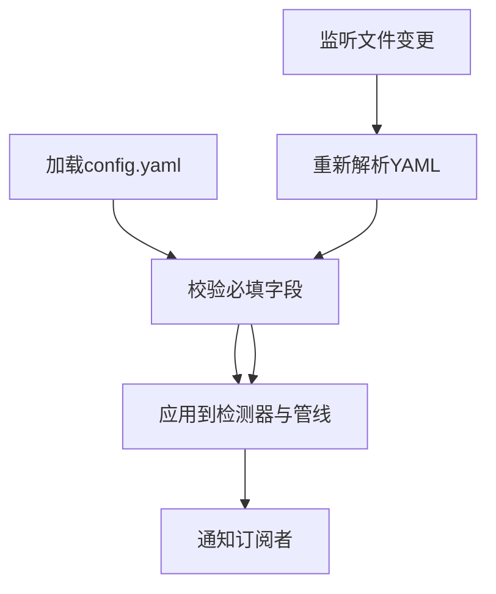
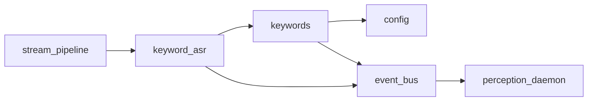

# 关键词检测系统

<cite>
**本文引用的文件**   
- [app/audio/keyword_asr.py](file://app/audio/keyword_asr.py)
- [app/detection/keywords.py](file://app/detection/keywords.py)
- [app/audio/stream_pipeline.py](file://app/audio/stream_pipeline.py)
- [app/config.py](file://app/config.py)
- [config.yaml](file://config.yaml)
- [app/events/event_bus.py](file://app/events/event_bus.py)
- [app/perception_events.py](file://app/perception_events.py)
- [app/runtime/perception_daemon.py](file://app/runtime/perception_daemon.py)
- [app/main.py](file://app/main.py)
- [tests/test_config.py](file://tests/test_config.py)
</cite>

## 目录
1. [简介](#简介)
2. [项目结构](#项目结构)
3. [核心组件](#核心组件)
4. [架构总览](#架构总览)
5. [详细组件分析](#详细组件分析)
6. [依赖关系分析](#依赖关系分析)
7. [性能考虑](#性能考虑)
8. [故障排查指南](#故障排查指南)
9. [结论](#结论)
10. [附录](#附录)

## 简介
本文件面向“关键词检测系统”的完整技术文档，覆盖以下目标：
- 关键词检测算法实现原理：音频特征提取、模型推理与结果过滤机制
- 关键词配置文件格式与语法，支持动态更新与热重载
- 与音频处理管道的集成方式：触发条件、响应动作与状态管理
- 关键词库扩展方法：自定义关键词与权重配置
- 检测精度优化、误报处理与性能监控的具体实现方案

## 项目结构
围绕关键词检测的相关代码主要分布在 audio、detection、events、runtime 等模块中，并通过统一的配置与事件总线进行协作。

图表来源
- [app/audio/stream_pipeline.py](file://app/audio/stream_pipeline.py)
- [app/audio/keyword_asr.py](file://app/audio/keyword_asr.py)
- [app/detection/keywords.py](file://app/detection/keywords.py)
- [app/config.py](file://app/config.py)
- [config.yaml](file://config.yaml)
- [app/events/event_bus.py](file://app/events/event_bus.py)
- [app/perception_events.py](file://app/perception_events.py)
- [app/runtime/perception_daemon.py](file://app/runtime/perception_daemon.py)
- [app/main.py](file://app/main.py)

章节来源
- [app/audio/stream_pipeline.py](file://app/audio/stream_pipeline.py)
- [app/audio/keyword_asr.py](file://app/audio/keyword_asr.py)
- [app/detection/keywords.py](file://app/detection/keywords.py)
- [app/config.py](file://app/config.py)
- [config.yaml](file://config.yaml)
- [app/events/event_bus.py](file://app/events/event_bus.py)
- [app/perception_events.py](file://app/perception_events.py)
- [app/runtime/perception_daemon.py](file://app/runtime/perception_daemon.py)
- [app/main.py](file://app/main.py)

## 核心组件
- 音频流管道（stream_pipeline）：负责从硬件或模拟源拉取音频帧，组织为连续流，并对外暴露统一接口供上层消费。
- 关键词+ASR管线（keyword_asr）：在音频流上串联关键词检测与语音识别，按策略决定何时触发 ASR。
- 关键词检测器（keywords）：基于配置的关键词库进行匹配，支持权重、阈值、滑动窗口与去抖逻辑。
- 配置系统（config）：加载 YAML 配置，提供热重载能力，监听配置变更并通知订阅者。
- 事件总线（event_bus）：解耦各模块的事件发布/订阅，承载关键词命中、ASR 结果、错误与状态事件。
- 感知事件（perception_events）：统一定义关键词命中、ASR 文本、置信度、时间戳等事件结构。
- 感知守护进程（perception_daemon）：协调音频、检测与事件生命周期，管理运行态与资源清理。
- 应用入口（main）：初始化配置、启动守护进程与事件循环，完成系统装配。

章节来源
- [app/audio/stream_pipeline.py](file://app/audio/stream_pipeline.py)
- [app/audio/keyword_asr.py](file://app/audio/keyword_asr.py)
- [app/detection/keywords.py](file://app/detection/keywords.py)
- [app/config.py](file://app/config.py)
- [app/events/event_bus.py](file://app/events/event_bus.py)
- [app/perception_events.py](file://app/perception_events.py)
- [app/runtime/perception_daemon.py](file://app/runtime/perception_daemon.py)
- [app/main.py](file://app/main.py)

## 架构总览
下图展示从音频输入到关键词命中的端到端流程，以及配置热重载对检测器的影响路径。

图表来源
- [app/audio/stream_pipeline.py](file://app/audio/stream_pipeline.py)
- [app/audio/keyword_asr.py](file://app/audio/keyword_asr.py)
- [app/detection/keywords.py](file://app/detection/keywords.py)
- [app/events/event_bus.py](file://app/events/event_bus.py)
- [app/runtime/perception_daemon.py](file://app/runtime/perception_daemon.py)
- [app/config.py](file://app/config.py)

## 详细组件分析

### 关键词检测器（keywords）
- 功能要点
  - 维护关键词库，包含词项、权重、正则/子串匹配模式、最小置信度阈值等
  - 对输入音频片段计算特征（如短时能量、过零率、MFCC 等），结合轻量级分类器或规则引擎进行判定
  - 滑动窗口聚合多次检测结果，降低瞬时噪声导致的误报
  - 支持去抖与冷却时间，避免短时间内重复触发
- 数据流
  - 输入：音频片段、采样率、通道数、时间戳
  - 输出：命中结果（关键词、置信度、时间戳、窗口统计）
- 配置驱动
  - 通过 config.yaml 加载关键词列表、权重、阈值、窗口大小、去抖参数
  - 监听配置变更，动态替换内部关键词索引与阈值

图表来源
- [app/detection/keywords.py](file://app/detection/keywords.py)
- [app/config.py](file://app/config.py)

章节来源
- [app/detection/keywords.py](file://app/detection/keywords.py)
- [app/config.py](file://app/config.py)

### 关键词+ASR管线（keyword_asr）
- 功能要点
  - 将关键词检测与 ASR 串联：仅在关键词命中时触发 ASR，减少不必要的识别开销
  - 维护上下文缓冲，确保关键词前后语义片段可用于 ASR 输入
  - 根据配置决定是否启用 ASR、ASR 后端选择、超时与重试策略
- 与事件总线交互
  - 发布“关键词命中”、“ASR开始”、“ASR结果”、“错误”等事件
- 状态管理
  - 空闲、等待关键词、ASR进行中、结果返回等状态转换

图表来源
- [app/audio/keyword_asr.py](file://app/audio/keyword_asr.py)
- [app/detection/keywords.py](file://app/detection/keywords.py)
- [app/events/event_bus.py](file://app/events/event_bus.py)

章节来源
- [app/audio/keyword_asr.py](file://app/audio/keyword_asr.py)
- [app/events/event_bus.py](file://app/events/event_bus.py)

### 音频流管道（stream_pipeline）
- 功能要点
  - 封装底层音频采集（硬件或模拟），以固定帧长和采样率输出连续流
  - 提供背压控制、丢帧策略与缓冲上限，保证实时性
  - 与 keyword_asr 对接，按需推送片段
- 集成点
  - 与 transport/sources 层交互获取原始音频
  - 向 keyword_asr 暴露统一的迭代器或回调接口

章节来源
- [app/audio/stream_pipeline.py](file://app/audio/stream_pipeline.py)

### 配置系统与热重载（config）
- 功能要点
  - 读取 config.yaml，解析关键词库、阈值、窗口、去抖、ASR 开关等
  - 监听配置文件变化，增量更新关键词索引与阈值，无需重启服务
  - 提供订阅机制，让检测器与管线在配置变更后立即生效
- 数据结构建议
  - keywords: 列表，每项包含 name、weight、threshold、pattern、enabled
  - pipeline: window_size、cooldown、debounce_ms、asr_enabled、asr_backend
  - monitoring: metrics_interval、log_level、trace_on_hit

图表来源
- [app/config.py](file://app/config.py)
- [config.yaml](file://config.yaml)

章节来源
- [app/config.py](file://app/config.py)
- [config.yaml](file://config.yaml)
- [tests/test_config.py](file://tests/test_config.py)

### 事件总线与感知事件（event_bus / perception_events）
- 事件类型
  - 关键词命中：包含关键词名、置信度、时间戳、来源片段长度
  - ASR 结果：包含识别文本、置信度、耗时
  - 错误：包含错误码、消息、上下文
  - 状态：包含运行状态、资源占用、队列长度
- 行为
  - 异步发布/订阅，支持优先级与限流
  - 持久化关键事件用于离线分析与调优

章节来源
- [app/events/event_bus.py](file://app/events/event_bus.py)
- [app/perception_events.py](file://app/perception_events.py)

### 感知守护进程与应用入口（perception_daemon / main）
- 职责
  - 初始化配置、创建事件总线、启动音频流与检测管线
  - 管理生命周期：启动、停止、优雅退出与资源释放
  - 暴露健康检查与指标上报接口

章节来源
- [app/runtime/perception_daemon.py](file://app/runtime/perception_daemon.py)
- [app/main.py](file://app/main.py)

## 依赖关系分析
- 模块耦合
  - stream_pipeline 仅依赖传输层与基础音频工具
  - keyword_asr 依赖 keywords 与 event_bus，可选依赖 ASR 后端
  - keywords 依赖 config 与事件总线（用于上报）
  - config 独立于业务模块，通过订阅机制向外广播
- 外部依赖
  - ASR 后端（可插拔）
  - 音频采集设备（硬件或模拟）
  - 文件系统（YAML 配置）

图表来源
- [app/audio/stream_pipeline.py](file://app/audio/stream_pipeline.py)
- [app/audio/keyword_asr.py](file://app/audio/keyword_asr.py)
- [app/detection/keywords.py](file://app/detection/keywords.py)
- [app/config.py](file://app/config.py)
- [app/events/event_bus.py](file://app/events/event_bus.py)
- [app/runtime/perception_daemon.py](file://app/runtime/perception_daemon.py)

章节来源
- [app/audio/stream_pipeline.py](file://app/audio/stream_pipeline.py)
- [app/audio/keyword_asr.py](file://app/audio/keyword_asr.py)
- [app/detection/keywords.py](file://app/detection/keywords.py)
- [app/config.py](file://app/config.py)
- [app/events/event_bus.py](file://app/events/event_bus.py)
- [app/runtime/perception_daemon.py](file://app/runtime/perception_daemon.py)

## 性能考虑
- 特征提取
  - 使用固定帧长与重叠比例，平衡时域分辨率与计算量
  - 优先采用轻量特征（如短时能量、过零率、少量 MFCC 维度）
- 模型推理
  - 量化与缓存：对常用关键词的特征模板进行缓存
  - 批处理：在滑动窗口内合并多次检测，降低调用开销
- 结果过滤
  - 滑动窗口投票、冷却时间与去抖，显著降低误报
  - 置信度阈值自适应：根据环境噪声水平动态调整
- 资源管理
  - 限制缓冲区大小，避免内存增长
  - 非阻塞事件发布，防止阻塞音频线程
- 监控
  - 记录命中率、平均延迟、CPU/内存占用、ASR 调用次数
  - 定期导出指标，便于容量规划与问题定位

[本节为通用指导，不直接分析具体文件]

## 故障排查指南
- 常见问题
  - 关键词未命中：检查阈值、窗口大小、去抖参数与环境噪声
  - 频繁误报：提高阈值、增加窗口长度、引入冷却时间
  - ASR 未触发：确认关键词命中事件已发布、ASR 开关与后端可用
  - 配置未生效：确认热重载监听正常、订阅者收到更新事件
- 诊断步骤
  - 开启详细日志与 trace_on_hit，观察特征与中间结果
  - 通过事件总线订阅所有事件，验证链路完整性
  - 使用测试用例回放音频片段，复现问题并回归验证

章节来源
- [app/events/event_bus.py](file://app/events/event_bus.py)
- [app/config.py](file://app/config.py)
- [tests/test_config.py](file://tests/test_config.py)

## 结论
本系统以配置驱动的关键词检测为核心，结合轻量特征与滑动窗口过滤，在保证低延迟的同时有效抑制误报。通过事件总线与守护进程实现松耦合与可扩展，配合热重载与监控能力，便于在生产环境中持续优化与运维。

[本节为总结性内容，不直接分析具体文件]

## 附录

### 配置文件格式与语法（config.yaml）
- 顶层键
  - keywords: 数组，元素包含
    - name: 字符串，关键词名称
    - weight: 数值，权重（越大越易命中）
    - threshold: 数值，最小置信度阈值
    - pattern: 字符串，正则或子串匹配模式
    - enabled: 布尔，是否启用
  - pipeline: 对象
    - window_size: 整数，滑动窗口长度
    - cooldown: 数值，冷却秒数
    - debounce_ms: 整数，去抖毫秒
    - asr_enabled: 布尔，是否启用 ASR
    - asr_backend: 字符串，ASR 后端标识
  - monitoring: 对象
    - metrics_interval: 数值，指标上报间隔
    - log_level: 字符串，日志级别
    - trace_on_hit: 布尔，命中时追踪
- 示例说明
  - 新增关键词只需在 keywords 中添加条目，保存后自动热重载生效
  - 调整阈值与窗口可快速平衡召回与误报

章节来源
- [config.yaml](file://config.yaml)
- [app/config.py](file://app/config.py)

### 关键词库扩展方法
- 自定义关键词
  - 在 config.yaml 的 keywords 列表中新增条目，设置 name、pattern、weight、threshold、enabled
  - 若需复杂匹配，可使用 pattern 的正则表达式
- 权重与阈值策略
  - 高权重关键词可降低 threshold 以提升召回
  - 对低频关键词适当提高 threshold 以降低误报
- 分组与命名规范
  - 建议使用前缀区分场景（如 device_、wake_、action_）
  - 保持命名一致性与可读性，便于后续审计与分析

章节来源
- [config.yaml](file://config.yaml)
- [app/config.py](file://app/config.py)

### 与音频处理管道的集成方式
- 触发条件
  - 关键词命中且置信度超过阈值
  - 滑动窗口内多次命中达到投票门槛
  - 去抖与冷却通过后
- 响应动作
  - 发布关键词命中事件，触发下游动作（如唤醒、记录、ASR）
  - 可选触发 ASR 并回传识别结果
- 状态管理
  - 空闲、等待关键词、ASR进行中、结果返回
  - 异常恢复：网络失败、设备断开、资源不足时的降级策略

章节来源
- [app/audio/keyword_asr.py](file://app/audio/keyword_asr.py)
- [app/events/event_bus.py](file://app/events/event_bus.py)
- [app/runtime/perception_daemon.py](file://app/runtime/perception_daemon.py)

### 检测精度优化与误报处理
- 特征层面
  - 多特征融合（能量、过零率、频谱质心、MFCC 主成分）
  - 环境噪声估计与自适应阈值
- 推理层面
  - 滑动窗口投票、指数移动平均平滑
  - 置信度校准与早停策略
- 误报处理
  - 冷却时间、去抖、上下文一致性校验
  - 黑名单关键词与白名单优先策略

章节来源
- [app/detection/keywords.py](file://app/detection/keywords.py)
- [app/config.py](file://app/config.py)

### 性能监控与度量
- 指标项
  - 命中率、误报率、平均延迟、P95/P99 延迟
  - CPU/内存占用、队列长度、ASR 调用成功率
- 采集与上报
  - 周期性采集、事件级埋点、错误计数
  - 导出到日志或监控系统，支持告警

章节来源
- [app/events/event_bus.py](file://app/events/event_bus.py)
- [app/config.py](file://app/config.py)