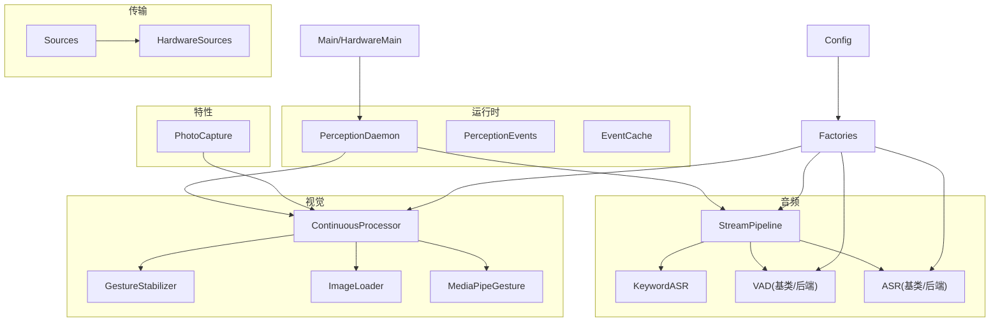
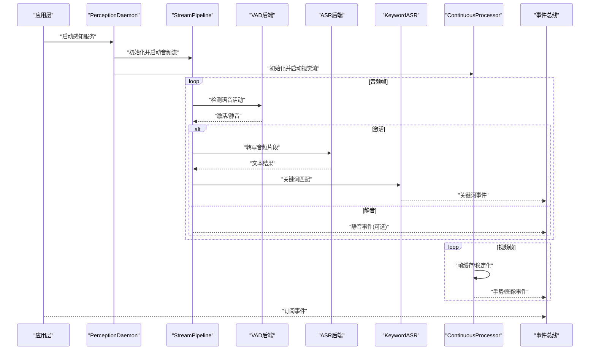
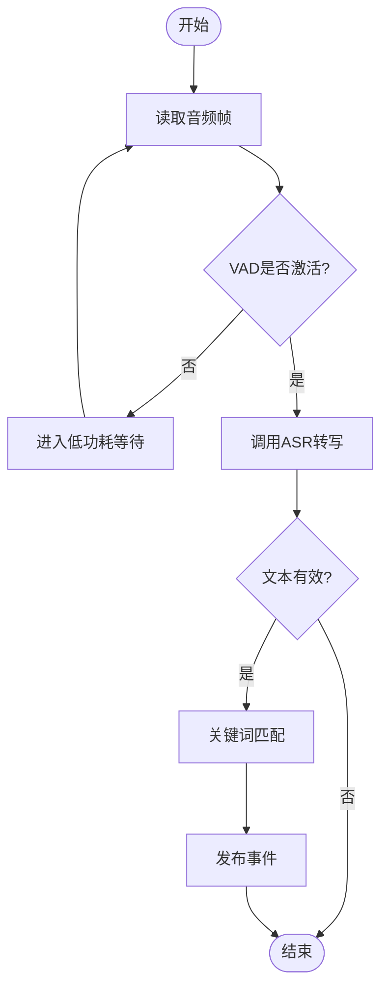
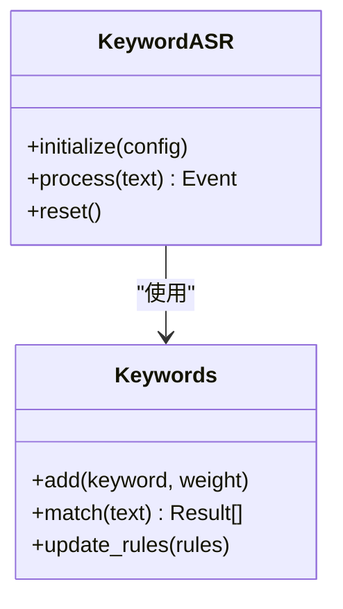
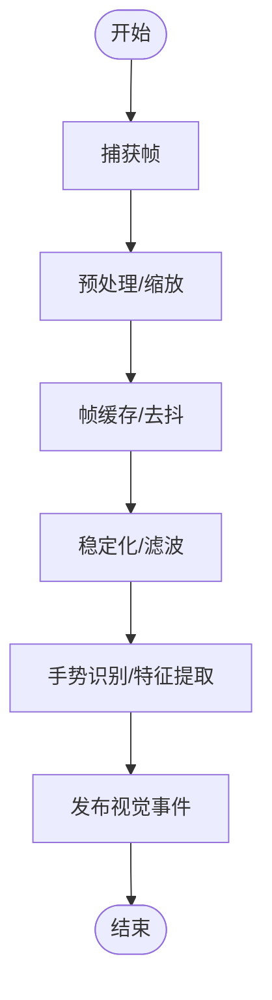
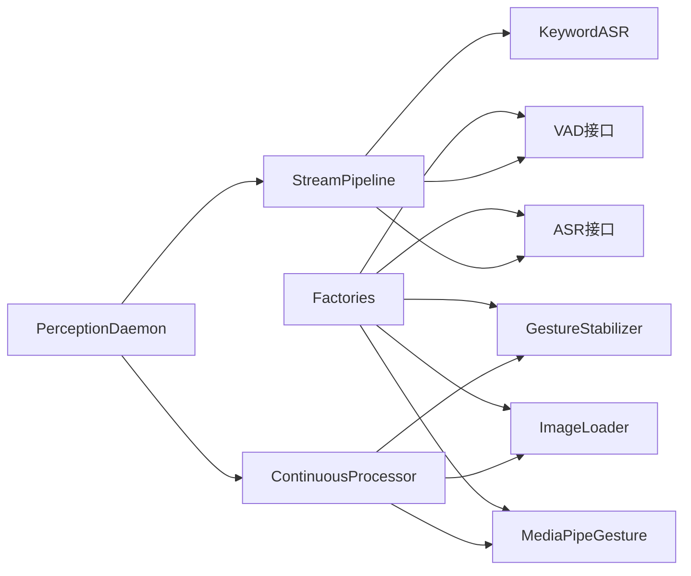

# 感知系统

<cite>
**本文引用的文件**   
- [app/main.py](file://app/main.py)
- [app/hardware_main.py](file://app/hardware_main.py)
- [app/config.py](file://app/config.py)
- [app/factories.py](file://app/factories.py)
- [app/perception_events.py](file://app/perception_events.py)
- [app/event_cache.py](file://app/event_cache.py)
- [app/runtime/perception_daemon.py](file://app/runtime/perception_daemon.py)
- [app/audio/stream_pipeline.py](file://app/audio/stream_pipeline.py)
- [app/audio/keyword_asr.py](file://app/audio/keyword_asr.py)
- [app/audio/vad/base.py](file://app/audio/vad/base.py)
- [app/audio/vad/silero_backend.py](file://app/audio/vad/silero_backend.py)
- [app/audio/vad/mock_backend.py](file://app/audio/vad/mock_backend.py)
- [app/asr/base.py](file://app/asr/base.py)
- [app/asr/faster_whisper_backend.py](file://app/asr/faster_whisper_backend.py)
- [app/asr/mock_backend.py](file://app/asr/mock_backend.py)
- [app/detection/keywords.py](file://app/detection/keywords.py)
- [app/vision/continuous_processor.py](file://app/vision/continuous_processor.py)
- [app/vision/gesture_stabilizer.py](file://app/vision/gesture_stabilizer.py)
- [app/vision/image_loader.py](file://app/vision/image_loader.py)
- [app/vision/mediapipe_gesture.py](file://app/vision/mediapipe_gesture.py)
- [app/vision/mock_backend.py](file://app/vision/mock_backend.py)
- [app/features/photo_capture.py](file://app/features/photo_capture.py)
- [app/transport/sources.py](file://app/transport/sources.py)
- [app/transport/hardware_sources.py](file://app/transport/hardware_sources.py)
- [config.yaml](file://config.yaml)
- [tests/test_perception_runtime.py](file://tests/test_perception_runtime.py)
- [tests/test_vad_stream.py](file://tests/test_vad_stream.py)
</cite>

## 目录
1. [简介](#简介)
2. [项目结构](#项目结构)
3. [核心组件](#核心组件)
4. [架构总览](#架构总览)
5. [详细组件分析](#详细组件分析)
6. [依赖关系分析](#依赖关系分析)
7. [性能考虑](#性能考虑)
8. [故障排查指南](#故障排查指南)
9. [结论](#结论)
10. [附录](#附录)

## 简介
本文件面向“感知系统”的音频处理、视觉处理与关键词检测能力，提供从架构到实现细节的系统化文档。重点覆盖：
- 音频流管道：VAD（语音活动检测）、ASR（自动语音识别）与关键词唤醒的协同流程
- 视觉处理流水线：连续图像处理、手势识别与图像采集
- 关键词检测算法原理与配置方法
- 各模块接口定义、参数配置与使用示例
- 性能优化建议与调试工具使用方法

## 项目结构
感知系统采用模块化分层设计，按功能域划分：
- 运行时与事件总线：perception_daemon、perception_events、event_cache
- 音频子模块：stream_pipeline、keyword_asr、vad、asr
- 视觉子模块：continuous_processor、gesture_stabilizer、image_loader、mediapipe_gesture
- 特性层：photo_capture
- 传输层：sources、hardware_sources
- 配置与工厂：config、factories
- 入口：main、hardware_main

图表来源
- [app/runtime/perception_daemon.py](file://app/runtime/perception_daemon.py)
- [app/audio/stream_pipeline.py](file://app/audio/stream_pipeline.py)
- [app/vision/continuous_processor.py](file://app/vision/continuous_processor.py)
- [app/config.py](file://app/config.py)
- [app/factories.py](file://app/factories.py)

章节来源
- [app/main.py](file://app/main.py)
- [app/hardware_main.py](file://app/hardware_main.py)
- [app/config.py](file://app/config.py)
- [app/factories.py](file://app/factories.py)

## 核心组件
- PerceptionDaemon：统一调度音频与视觉流水线，管理生命周期与事件分发
- StreamPipeline：音频输入→VAD→ASR→关键词检测→事件输出
- ContinuousProcessor：视频帧缓冲、去抖、稳定化与结果发布
- GestureStabilizer：手势轨迹平滑与状态机
- KeywordASR：结合VAD与ASR进行关键词触发
- VAD/ASR后端：可插拔实现（Silero、Faster Whisper、Mock）
- PhotoCapture：按需拍照并回传事件
- Sources/HardwareSources：设备抽象（麦克风、摄像头）
- Factories：基于配置的组件实例化
- Config：全局配置加载与校验

章节来源
- [app/runtime/perception_daemon.py](file://app/runtime/perception_daemon.py)
- [app/audio/stream_pipeline.py](file://app/audio/stream_pipeline.py)
- [app/vision/continuous_processor.py](file://app/vision/continuous_processor.py)
- [app/vision/gesture_stabilizer.py](file://app/vision/gesture_stabilizer.py)
- [app/audio/keyword_asr.py](file://app/audio/keyword_asr.py)
- [app/audio/vad/base.py](file://app/audio/vad/base.py)
- [app/audio/vad/silero_backend.py](file://app/audio/vad/silero_backend.py)
- [app/asr/base.py](file://app/asr/base.py)
- [app/asr/faster_whisper_backend.py](file://app/asr/faster_whisper_backend.py)
- [app/features/photo_capture.py](file://app/features/photo_capture.py)
- [app/transport/sources.py](file://app/transport/sources.py)
- [app/transport/hardware_sources.py](file://app/transport/hardware_sources.py)
- [app/factories.py](file://app/factories.py)
- [app/config.py](file://app/config.py)

## 架构总览
感知系统以“事件驱动+插件化后端”为核心思想。运行时守护进程负责启动/停止各流水线，并通过事件总线将音频与视觉结果广播给上层应用。

图表来源
- [app/runtime/perception_daemon.py](file://app/runtime/perception_daemon.py)
- [app/audio/stream_pipeline.py](file://app/audio/stream_pipeline.py)
- [app/vision/continuous_processor.py](file://app/vision/continuous_processor.py)
- [app/perception_events.py](file://app/perception_events.py)

## 详细组件分析

### 音频流管道（StreamPipeline）
职责：
- 接入音频源（硬件或模拟）
- 调用VAD进行语音活动检测
- 在激活窗口内调用ASR进行转写
- 对ASR结果进行关键词检测
- 通过事件总线发布音频事件

关键流程：
- 帧读取→VAD判断→ASR转写→关键词匹配→事件发布
- 支持静音段跳过与缓冲区管理

图表来源
- [app/audio/stream_pipeline.py](file://app/audio/stream_pipeline.py)
- [app/audio/vad/base.py](file://app/audio/vad/base.py)
- [app/asr/base.py](file://app/asr/base.py)
- [app/detection/keywords.py](file://app/detection/keywords.py)

章节来源
- [app/audio/stream_pipeline.py](file://app/audio/stream_pipeline.py)
- [app/audio/vad/base.py](file://app/audio/vad/base.py)
- [app/asr/base.py](file://app/asr/base.py)
- [app/detection/keywords.py](file://app/detection/keywords.py)

### VAD（语音活动检测）
- 基类定义统一接口：初始化、处理帧、释放资源
- Silero后端：基于预训练模型进行实时语音活动检测
- Mock后端：用于测试与仿真

接口要点：
- 设置阈值与滑动窗口
- 返回激活状态与置信度
- 支持批量/流式处理

章节来源
- [app/audio/vad/base.py](file://app/audio/vad/base.py)
- [app/audio/vad/silero_backend.py](file://app/audio/vad/silero_backend.py)
- [app/audio/vad/mock_backend.py](file://app/audio/vad/mock_backend.py)

### ASR（自动语音识别）
- 基类定义统一接口：初始化、转写、释放资源
- Faster Whisper后端：高性能离线转写
- Mock后端：用于测试与仿真

接口要点：
- 采样率与格式适配
- 超时与重试策略
- 结果结构化（文本、时间戳、置信度）

章节来源
- [app/asr/base.py](file://app/asr/base.py)
- [app/asr/faster_whisper_backend.py](file://app/asr/faster_whisper_backend.py)
- [app/asr/mock_backend.py](file://app/asr/mock_backend.py)

### 关键词检测（KeywordASR与Keywords）
- KeywordASR：在VAD激活窗口内对ASR文本进行关键词匹配
- Keywords：规则或模型驱动的关键词库与匹配器

实现要点：
- 支持多关键词与优先级
- 防抖与去重机制
- 可配置的热词表与权重

图表来源
- [app/audio/keyword_asr.py](file://app/audio/keyword_asr.py)
- [app/detection/keywords.py](file://app/detection/keywords.py)

章节来源
- [app/audio/keyword_asr.py](file://app/audio/keyword_asr.py)
- [app/detection/keywords.py](file://app/detection/keywords.py)

### 视觉处理流水线（ContinuousProcessor）
职责：
- 持续读取摄像头帧
- 帧缓存与去抖
- 调用手势识别与图像加载
- 发布稳定化的视觉事件

关键流程：
- 帧获取→预处理→稳定化→识别→事件发布

图表来源
- [app/vision/continuous_processor.py](file://app/vision/continuous_processor.py)
- [app/vision/gesture_stabilizer.py](file://app/vision/gesture_stabilizer.py)
- [app/vision/image_loader.py](file://app/vision/image_loader.py)
- [app/vision/mediapipe_gesture.py](file://app/vision/mediapipe_gesture.py)

章节来源
- [app/vision/continuous_processor.py](file://app/vision/continuous_processor.py)
- [app/vision/gesture_stabilizer.py](file://app/vision/gesture_stabilizer.py)
- [app/vision/image_loader.py](file://app/vision/image_loader.py)
- [app/vision/mediapipe_gesture.py](file://app/vision/mediapipe_gesture.py)

### 手势识别（MediaPipeGesture与GestureStabilizer）
- MediaPipeGesture：基于MediaPipe的手势关键点检测与分类
- GestureStabilizer：对关键点序列进行平滑与状态机管理

接口要点：
- 关键点坐标与置信度
- 手势类别与动作阶段
- 稳定性阈值与滞后参数

章节来源
- [app/vision/mediapipe_gesture.py](file://app/vision/mediapipe_gesture.py)
- [app/vision/gesture_stabilizer.py](file://app/vision/gesture_stabilizer.py)
- [app/vision/mock_backend.py](file://app/vision/mock_backend.py)

### 图像采集（PhotoCapture）
- 按需触发拍照
- 压缩与编码
- 事件回传（路径或字节流）

章节来源
- [app/features/photo_capture.py](file://app/features/photo_capture.py)

### 传输层（Sources与HardwareSources）
- Sources：抽象数据源接口（音频/视频）
- HardwareSources：具体硬件实现（麦克风、摄像头）

章节来源
- [app/transport/sources.py](file://app/transport/sources.py)
- [app/transport/hardware_sources.py](file://app/transport/hardware_sources.py)

### 运行时与事件（PerceptionDaemon、PerceptionEvents、EventCache）
- PerceptionDaemon：生命周期管理、任务调度、错误恢复
- PerceptionEvents：事件类型定义与序列化
- EventCache：事件缓存与回放

章节来源
- [app/runtime/perception_daemon.py](file://app/runtime/perception_daemon.py)
- [app/perception_events.py](file://app/perception_events.py)
- [app/event_cache.py](file://app/event_cache.py)

### 配置与工厂（Config与Factories）
- Config：加载YAML配置，校验必填项，提供默认值
- Factories：根据配置创建VAD/ASR/视觉等后端实例

章节来源
- [app/config.py](file://app/config.py)
- [app/factories.py](file://app/factories.py)
- [config.yaml](file://config.yaml)

## 依赖关系分析
组件间耦合遵循“接口优先、后端可替换”的原则：
- StreamPipeline依赖VAD与ASR接口，不绑定具体实现
- ContinuousProcessor依赖手势识别与图像加载接口
- Factories集中管理实例化逻辑，降低耦合
- PerceptionDaemon通过事件总线解耦生产者与消费者

图表来源
- [app/audio/stream_pipeline.py](file://app/audio/stream_pipeline.py)
- [app/vision/continuous_processor.py](file://app/vision/continuous_processor.py)
- [app/factories.py](file://app/factories.py)
- [app/runtime/perception_daemon.py](file://app/runtime/perception_daemon.py)

章节来源
- [app/factories.py](file://app/factories.py)
- [app/audio/stream_pipeline.py](file://app/audio/stream_pipeline.py)
- [app/vision/continuous_processor.py](file://app/vision/continuous_processor.py)
- [app/runtime/perception_daemon.py](file://app/runtime/perception_daemon.py)

## 性能考虑
- 音频端
  - VAD阈值与滑动窗口长度需平衡灵敏度与误报
  - ASR批处理与缓存可减少重复计算
  - 关键词匹配采用前缀树或哈希索引提升检索速度
- 视觉端
  - 帧分辨率与FPS权衡；必要时降采样
  - 稳定化滤波器参数影响延迟与抖动抑制
  - 模型推理使用GPU加速（如可用）
- 运行时
  - 事件队列背压控制与丢弃策略
  - 线程池与异步IO避免阻塞
  - 资源回收与异常恢复机制

[本节为通用指导，无需特定文件引用]

## 故障排查指南
常见问题与定位步骤：
- 音频无响应
  - 检查VAD后端初始化与阈值配置
  - 验证ASR后端连接与模型加载
  - 查看事件总线是否订阅成功
- 视觉卡顿或丢帧
  - 调整帧缓存大小与稳定化参数
  - 确认摄像头权限与设备占用
  - 监控CPU/GPU占用与内存泄漏
- 关键词误触发
  - 调整关键词权重与匹配阈值
  - 增加上下文窗口与去重策略
- 调试工具
  - 启用日志级别与事件追踪
  - 使用Mock后端隔离问题
  - 单元测试覆盖关键路径

章节来源
- [tests/test_perception_runtime.py](file://tests/test_perception_runtime.py)
- [tests/test_vad_stream.py](file://tests/test_vad_stream.py)

## 结论
感知系统通过模块化与插件化设计，实现了音频与视觉能力的灵活组合与扩展。VAD与ASR后端的可替换性、视觉流水线的稳定化处理以及关键词检测的可配置性，使其适用于多种场景。建议在部署时根据硬件条件调优参数，并结合日志与测试工具进行持续优化。

[本节为总结，无需特定文件引用]

## 附录

### 接口定义摘要
- VAD接口
  - 初始化：配置阈值、窗口大小
  - 处理帧：返回激活状态与置信度
  - 释放资源：清理模型与缓存
- ASR接口
  - 初始化：采样率、语言、模型路径
  - 转写：输入音频片段，返回文本与元信息
  - 释放资源：关闭模型会话
- 视觉接口
  - 帧处理：预处理、关键点检测、分类
  - 稳定化：滤波与状态机
  - 事件发布：结构化结果

章节来源
- [app/audio/vad/base.py](file://app/audio/vad/base.py)
- [app/asr/base.py](file://app/asr/base.py)
- [app/vision/mediapipe_gesture.py](file://app/vision/mediapipe_gesture.py)
- [app/vision/gesture_stabilizer.py](file://app/vision/gesture_stabilizer.py)

### 配置方法（config.yaml）
- 音频
  - vad：后端类型、阈值、窗口
  - asr：后端类型、模型路径、语言
  - keyword：关键词列表、权重、匹配策略
- 视觉
  - continuous：帧率、分辨率、缓存大小
  - gesture：稳定化参数、分类阈值
  - capture：压缩格式、质量
- 运行时
  - daemon：线程数、事件队列大小、超时

章节来源
- [config.yaml](file://config.yaml)
- [app/config.py](file://app/config.py)

### 使用示例（概念性）
- 启动感知服务
  - 加载配置→创建工厂→初始化VAD/ASR/视觉→启动Daemon
- 订阅事件
  - 注册回调→接收音频/视觉/关键词事件
- 触发拍照
  - 调用PhotoCapture→获取图片路径或字节流

[本节为概念性说明，无需特定文件引用]