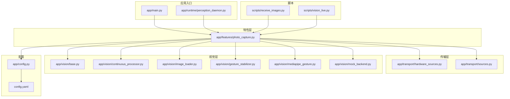
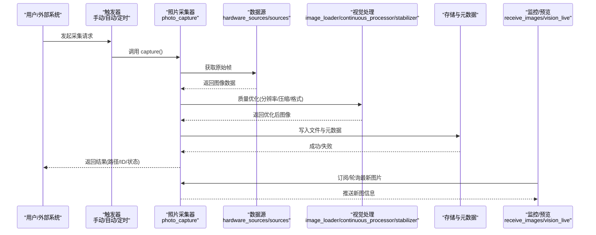
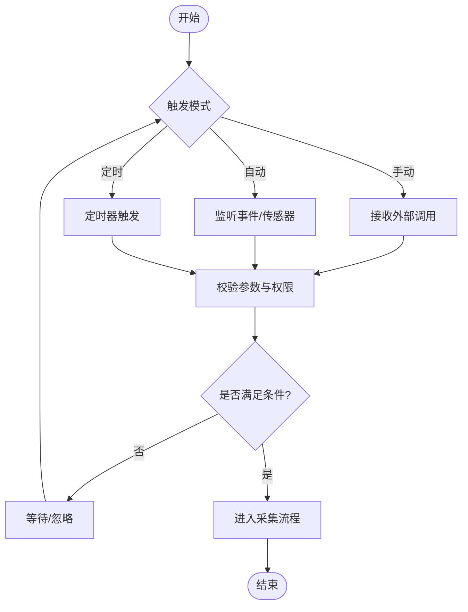
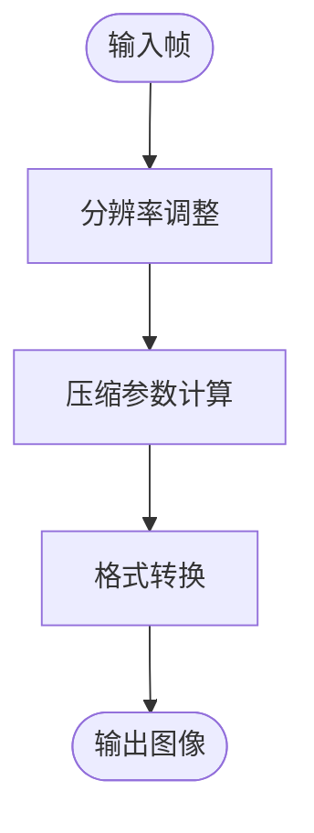
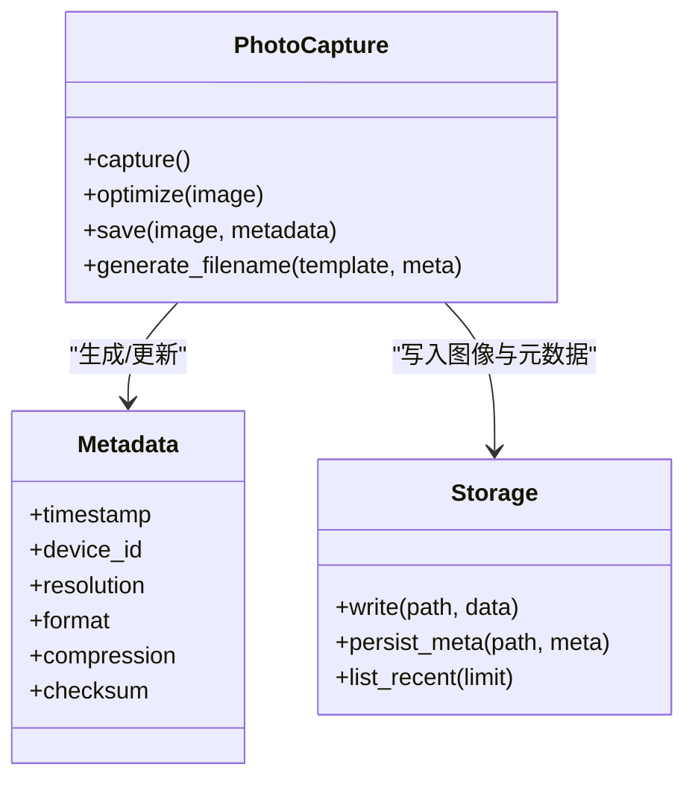
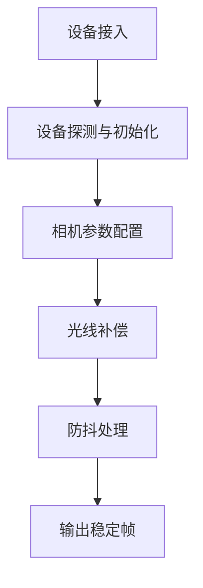
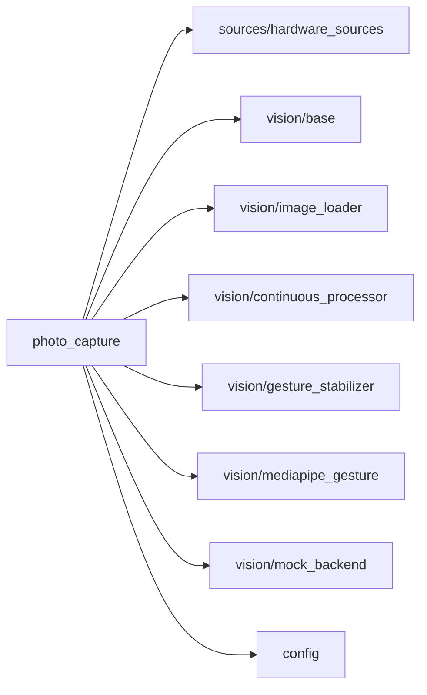

# 照片采集功能

<cite>
**本文引用的文件**   
- [app/features/photo_capture.py](file://app/features/photo_capture.py)
- [app/vision/continuous_processor.py](file://app/vision/continuous_processor.py)
- [app/vision/base.py](file://app/vision/base.py)
- [app/vision/image_loader.py](file://app/vision/image_loader.py)
- [app/vision/gesture_stabilizer.py](file://app/vision/gesture_stabilizer.py)
- [app/vision/mediapipe_gesture.py](file://app/vision/mediapipe_gesture.py)
- [app/vision/mock_backend.py](file://app/vision/mock_backend.py)
- [app/transport/hardware_sources.py](file://app/transport/hardware_sources.py)
- [app/transport/sources.py](file://app/transport/sources.py)
- [app/config.py](file://app/config.py)
- [config.yaml](file://config.yaml)
- [scripts/receive_images.py](file://scripts/receive_images.py)
- [scripts/vision_live.py](file://scripts/vision_live.py)
- [app/main.py](file://app/main.py)
- [app/runtime/perception_daemon.py](file://app/runtime/perception_daemon.py)
</cite>

## 目录
1. [简介](#简介)
2. [项目结构](#项目结构)
3. [核心组件](#核心组件)
4. [架构总览](#架构总览)
5. [详细组件分析](#详细组件分析)
6. [依赖关系分析](#依赖关系分析)
7. [性能考量](#性能考量)
8. [故障排查指南](#故障排查指南)
9. [结论](#结论)
10. [附录](#附录)

## 简介
本文件面向“照片采集”功能，系统性说明触发机制（手动、自动检测、定时任务）、图像质量优化（分辨率、压缩、格式转换）、与视觉处理模块的集成（实时预览与批量处理）、存储策略与命名规则、元数据管理，以及相机设备适配、光线补偿与防抖处理的实现要点。文档以仓库现有代码为依据，结合可视化图示帮助读者快速理解并落地使用。

## 项目结构
与照片采集相关的核心代码分布在以下模块：
- 特性层：features/photo_capture.py 提供采集能力封装与调度入口
- 传输层：transport/hardware_sources.py 与 transport/sources.py 负责设备接入与数据源抽象
- 视觉层：vision/* 提供图像加载、连续处理、手势稳定、后端适配等能力
- 配置层：app/config.py 与 config.yaml 集中管理采集参数与质量策略
- 脚本与运行：scripts/receive_images.py、scripts/vision_live.py 用于演示与调试；app/main.py 与 app/runtime/perception_daemon.py 驱动运行时



图表来源
- [app/main.py](file://app/main.py)
- [app/runtime/perception_daemon.py](file://app/runtime/perception_daemon.py)
- [app/features/photo_capture.py](file://app/features/photo_capture.py)
- [app/transport/hardware_sources.py](file://app/transport/hardware_sources.py)
- [app/transport/sources.py](file://app/transport/sources.py)
- [app/vision/continuous_processor.py](file://app/vision/continuous_processor.py)
- [app/vision/image_loader.py](file://app/vision/image_loader.py)
- [app/vision/gesture_stabilizer.py](file://app/vision/gesture_stabilizer.py)
- [app/vision/mediapipe_gesture.py](file://app/vision/mediapipe_gesture.py)
- [app/vision/mock_backend.py](file://app/vision/mock_backend.py)
- [app/config.py](file://app/config.py)
- [config.yaml](file://config.yaml)
- [scripts/receive_images.py](file://scripts/receive_images.py)
- [scripts/vision_live.py](file://scripts/vision_live.py)

章节来源
- [app/features/photo_capture.py](file://app/features/photo_capture.py)
- [app/vision/continuous_processor.py](file://app/vision/continuous_processor.py)
- [app/vision/base.py](file://app/vision/base.py)
- [app/vision/image_loader.py](file://app/vision/image_loader.py)
- [app/vision/gesture_stabilizer.py](file://app/vision/gesture_stabilizer.py)
- [app/vision/mediapipe_gesture.py](file://app/vision/mediapipe_gesture.py)
- [app/vision/mock_backend.py](file://app/vision/mock_backend.py)
- [app/transport/hardware_sources.py](file://app/transport/hardware_sources.py)
- [app/transport/sources.py](file://app/transport/sources.py)
- [app/config.py](file://app/config.py)
- [config.yaml](file://config.yaml)
- [scripts/receive_images.py](file://scripts/receive_images.py)
- [scripts/vision_live.py](file://scripts/vision_live.py)
- [app/main.py](file://app/main.py)
- [app/runtime/perception_daemon.py](file://app/runtime/perception_daemon.py)

## 核心组件
- 照片采集器（PhotoCapture）
  - 职责：统一封装拍照流程，包括触发控制、图像获取、质量优化、存储与元数据写入、错误重试与日志。
  - 关键能力：
    - 触发模式：手动调用、事件驱动（自动检测）、定时任务
    - 质量优化：分辨率缩放、压缩参数、格式转换
    - 集成视觉：与连续处理器、图像加载器、稳定器协作
    - 存储策略：路径模板、命名规则、元数据持久化
- 传输与数据源
  - hardware_sources：对接硬件相机或模拟源
  - sources：通用数据源接口与工厂
- 视觉处理
  - continuous_processor：帧级连续处理管道
  - image_loader：图像解码与预处理
  - gesture_stabilizer：基于手势/姿态的稳定化处理
  - mediapipe_gesture / mock_backend：手势识别后端与模拟实现
- 配置中心
  - app/config.py 与 config.yaml：集中管理采集参数、质量策略、存储路径、触发策略

章节来源
- [app/features/photo_capture.py](file://app/features/photo_capture.py)
- [app/transport/hardware_sources.py](file://app/transport/hardware_sources.py)
- [app/transport/sources.py](file://app/transport/sources.py)
- [app/vision/continuous_processor.py](file://app/vision/continuous_processor.py)
- [app/vision/image_loader.py](file://app/vision/image_loader.py)
- [app/vision/gesture_stabilizer.py](file://app/vision/gesture_stabilizer.py)
- [app/vision/mediapipe_gesture.py](file://app/vision/mediapipe_gesture.py)
- [app/vision/mock_backend.py](file://app/vision/mock_backend.py)
- [app/config.py](file://app/config.py)
- [config.yaml](file://config.yaml)

## 架构总览
照片采集的整体流程如下：
- 触发层：支持手动触发、自动检测（事件总线/传感器）、定时任务三种方式
- 采集层：从硬件或模拟源拉取帧，进入质量优化流水线
- 视觉层：可选地执行连续处理、手势稳定、格式转换与压缩
- 存储层：按命名规则生成文件名，写入目标目录，并保存元数据
- 监控与回放：通过脚本进行实时预览与批量处理验证



图表来源
- [app/features/photo_capture.py](file://app/features/photo_capture.py)
- [app/transport/hardware_sources.py](file://app/transport/hardware_sources.py)
- [app/transport/sources.py](file://app/transport/sources.py)
- [app/vision/image_loader.py](file://app/vision/image_loader.py)
- [app/vision/continuous_processor.py](file://app/vision/continuous_processor.py)
- [app/vision/gesture_stabilizer.py](file://app/vision/gesture_stabilizer.py)
- [scripts/receive_images.py](file://scripts/receive_images.py)
- [scripts/vision_live.py](file://scripts/vision_live.py)

## 详细组件分析

### 触发机制（手动、自动检测、定时任务）
- 手动触发
  - 由上层控制器或API直接调用采集方法，适合交互式场景
- 自动检测
  - 基于事件总线或传感器信号触发，如检测到手势、运动变化、光照突变等
- 定时任务
  - 周期性执行采集，适用于巡检、归档等场景



章节来源
- [app/features/photo_capture.py](file://app/features/photo_capture.py)
- [app/runtime/perception_daemon.py](file://app/runtime/perception_daemon.py)

### 图像质量优化（分辨率、压缩、格式转换）
- 分辨率设置
  - 根据目标设备或存储策略对原始帧进行缩放，平衡清晰度与体积
- 压缩算法
  - 选择合适压缩比与质量参数，降低网络传输与磁盘占用
- 格式转换
  - 将内部图像格式转换为常用格式（如JPEG/PNG），便于下游消费



章节来源
- [app/vision/image_loader.py](file://app/vision/image_loader.py)
- [app/vision/continuous_processor.py](file://app/vision/continuous_processor.py)
- [app/config.py](file://app/config.py)
- [config.yaml](file://config.yaml)

### 与视觉处理模块的集成（实时预览与批量处理）
- 实时预览
  - 通过连续处理器与图像加载器构建低延迟管线，配合预览脚本展示
- 批量处理
  - 读取历史图片，按批次执行质量优化与转码，提升吞吐

```mermaid
sequenceDiagram
participant Stream as "视频流/帧队列"
participant Proc as "连续处理器"
participant Loader as "图像加载器"
participant Stabilizer as "手势稳定器"
participant Capture as "照片采集器"
participant Preview as "预览脚本"
Stream->>Proc : 推送帧
Proc->>Loader : 解码与预处理
Loader-->>Proc : 标准化图像
Proc->>Stabilizer : 稳定化处理
Stabilizer-->>Proc : 稳定后图像
Proc->>Capture : 触发拍照/落盘
Capture-->>Preview : 通知新图
Preview-->>Preview : 渲染预览
```



图表来源
- [app/vision/continuous_processor.py](file://app/vision/continuous_processor.py)
- [app/vision/image_loader.py](file://app/vision/image_loader.py)
- [app/vision/gesture_stabilizer.py](file://app/vision/gesture_stabilizer.py)
- [app/features/photo_capture.py](file://app/features/photo_capture.py)
- [scripts/vision_live.py](file://scripts/vision_live.py)

章节来源
- [app/vision/continuous_processor.py](file://app/vision/continuous_processor.py)
- [app/vision/image_loader.py](file://app/vision/image_loader.py)
- [app/vision/gesture_stabilizer.py](file://app/vision/gesture_stabilizer.py)
- [scripts/vision_live.py](file://scripts/vision_live.py)

### 存储策略、命名规则与元数据管理
- 存储策略
  - 目录分层（按日期/场景/设备），支持分片与归档
- 命名规则
  - 包含时间戳、设备ID、序列号、哈希片段，确保唯一性与可追溯性
- 元数据管理
  - 记录拍摄时间、设备信息、质量参数、处理链路与校验和



图表来源
- [app/features/photo_capture.py](file://app/features/photo_capture.py)
- [app/config.py](file://app/config.py)

章节来源
- [app/features/photo_capture.py](file://app/features/photo_capture.py)
- [app/config.py](file://app/config.py)

### 相机设备适配、光线补偿与防抖处理
- 设备适配
  - 通过 hardware_sources 抽象不同相机接口，支持热插拔与回退策略
- 光线补偿
  - 在图像加载阶段进行曝光/白平衡校正，提升暗光与逆光场景质量
- 防抖处理
  - 基于手势稳定器或帧间对齐，减少抖动导致的模糊



章节来源
- [app/transport/hardware_sources.py](file://app/transport/hardware_sources.py)
- [app/vision/image_loader.py](file://app/vision/image_loader.py)
- [app/vision/gesture_stabilizer.py](file://app/vision/gesture_stabilizer.py)

### 批量处理与离线优化
- 批量读取历史图片，按配置执行分辨率调整、压缩与格式转换
- 支持断点续跑与并发批处理，提高吞吐

```mermaid
sequenceDiagram
participant Batch as "批量处理器"
participant FS as "文件系统"
participant Opt as "质量优化"
participant Meta as "元数据更新"
Batch->>FS : 扫描待处理文件
FS-->>Batch : 文件列表
loop 遍历文件
Batch->>Opt : 执行优化
Opt-->>Batch : 新文件/覆盖原文件
Batch->>Meta : 更新元数据
end
Batch-->>Batch : 汇总统计与报告
```

章节来源
- [scripts/receive_images.py](file://scripts/receive_images.py)
- [app/features/photo_capture.py](file://app/features/photo_capture.py)

## 依赖关系分析
- 松耦合设计
  - 采集器依赖传输层的数据源接口，不绑定具体设备
  - 视觉处理通过统一的图像加载与处理器接口接入
- 关键依赖链
  - photo_capture → hardware_sources/sources → vision/image_loader → continuous_processor → storage
- 潜在循环依赖
  - 避免在 vision 层反向依赖 features，保持单向依赖



图表来源
- [app/features/photo_capture.py](file://app/features/photo_capture.py)
- [app/transport/sources.py](file://app/transport/sources.py)
- [app/transport/hardware_sources.py](file://app/transport/hardware_sources.py)
- [app/vision/base.py](file://app/vision/base.py)
- [app/vision/image_loader.py](file://app/vision/image_loader.py)
- [app/vision/continuous_processor.py](file://app/vision/continuous_processor.py)
- [app/vision/gesture_stabilizer.py](file://app/vision/gesture_stabilizer.py)
- [app/vision/mediapipe_gesture.py](file://app/vision/mediapipe_gesture.py)
- [app/vision/mock_backend.py](file://app/vision/mock_backend.py)
- [app/config.py](file://app/config.py)

章节来源
- [app/features/photo_capture.py](file://app/features/photo_capture.py)
- [app/transport/sources.py](file://app/transport/sources.py)
- [app/transport/hardware_sources.py](file://app/transport/hardware_sources.py)
- [app/vision/base.py](file://app/vision/base.py)
- [app/vision/image_loader.py](file://app/vision/image_loader.py)
- [app/vision/continuous_processor.py](file://app/vision/continuous_processor.py)
- [app/vision/gesture_stabilizer.py](file://app/vision/gesture_stabilizer.py)
- [app/vision/mediapipe_gesture.py](file://app/vision/mediapipe_gesture.py)
- [app/vision/mock_backend.py](file://app/vision/mock_backend.py)
- [app/config.py](file://app/config.py)

## 性能考量
- 流水线并行
  - 图像加载、稳定处理与压缩可并行执行，降低端到端延迟
- 内存与缓存
  - 限制帧缓冲大小，避免峰值内存暴涨；对热点图像做短期缓存
- I/O 优化
  - 顺序写盘与异步落盘，减少阻塞；批量处理时采用多进程/线程池
- 自适应质量
  - 根据设备负载动态调整分辨率与压缩比，保证稳定性

[本节为通用指导，无需特定文件引用]

## 故障排查指南
- 常见问题定位
  - 设备无法连接：检查 hardware_sources 的设备枚举与权限
  - 图像过曝/欠曝：调整光线补偿参数与曝光策略
  - 抖动严重：增强防抖阈值或切换稳定算法
  - 存储失败：确认路径权限、磁盘空间与命名冲突
- 诊断工具
  - 使用 receive_images 与 vision_live 脚本观察数据流与预览
  - 查看元数据中的 checksum 与 timestamp，辅助定位问题

章节来源
- [scripts/receive_images.py](file://scripts/receive_images.py)
- [scripts/vision_live.py](file://scripts/vision_live.py)
- [app/features/photo_capture.py](file://app/features/photo_capture.py)

## 结论
照片采集功能通过清晰的触发机制、完善的图像质量优化、与视觉模块的深度集成，以及灵活的存储与元数据管理，能够满足实时预览与批量处理等多类场景需求。借助设备适配、光线补偿与防抖处理，系统在复杂环境下仍能提供稳定可靠的采集体验。建议在生产环境中结合性能调优与监控告警，进一步提升鲁棒性与可观测性。

[本节为总结性内容，无需特定文件引用]

## 附录
- 配置项建议
  - 分辨率：根据终端显示与存储预算设定上限
  - 压缩：优先使用有损压缩以降低体积，必要时保留无损副本
  - 格式：默认 JPEG，特殊需求使用 PNG
  - 命名：包含时间戳、设备ID、序列号与哈希片段
  - 元数据：至少包含时间、设备、分辨率、格式、压缩参数与校验和
- 最佳实践
  - 使用事件驱动触发，减少无效采集
  - 批量处理与在线采集分离，避免相互影响
  - 定期归档与清理，控制存储成本

[本节为补充信息，无需特定文件引用]