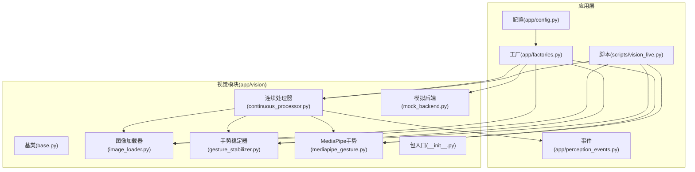
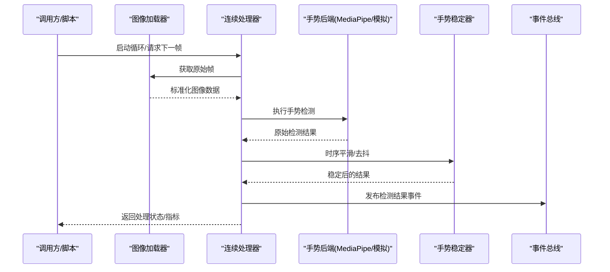
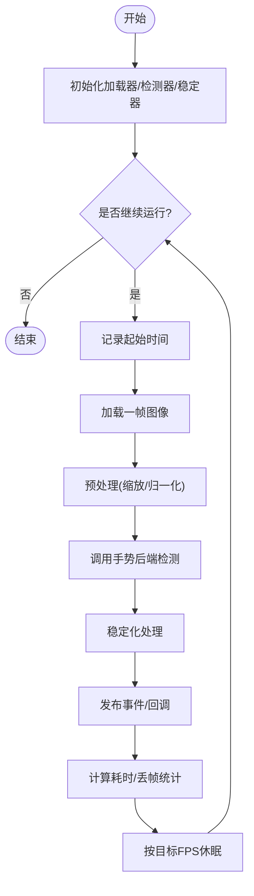
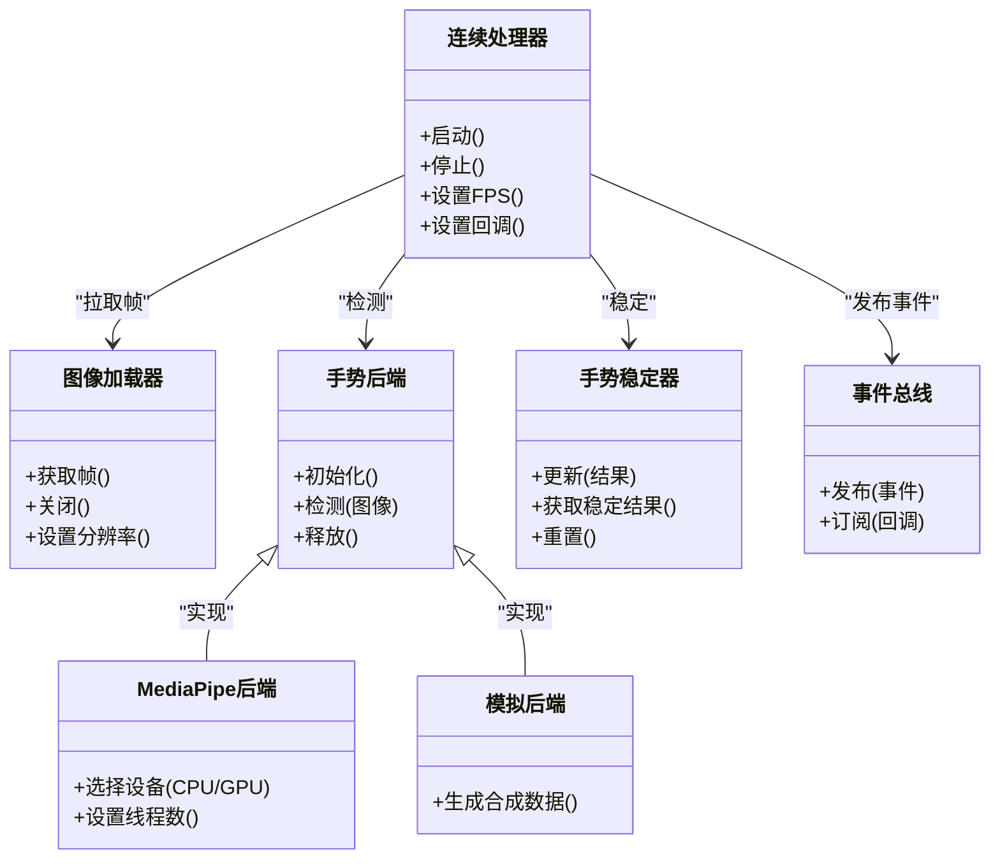

# 视觉处理模块

<cite>
**本文引用的文件**   
- [app/vision/__init__.py](file://app/vision/__init__.py)
- [app/vision/base.py](file://app/vision/base.py)
- [app/vision/continuous_processor.py](file://app/vision/continuous_processor.py)
- [app/vision/gesture_stabilizer.py](file://app/vision/gesture_stabilizer.py)
- [app/vision/image_loader.py](file://app/vision/image_loader.py)
- [app/vision/mediapipe_gesture.py](file://app/vision/mediapipe_gesture.py)
- [app/vision/mock_backend.py](file://app/vision/mock_backend.py)
- [app/config.py](file://app/config.py)
- [app/factories.py](file://app/factories.py)
- [app/perception_events.py](file://app/perception_events.py)
- [scripts/vision_live.py](file://scripts/vision_live.py)
</cite>

## 目录
1. [简介](#简介)
2. [项目结构](#项目结构)
3. [核心组件](#核心组件)
4. [架构总览](#架构总览)
5. [详细组件分析](#详细组件分析)
6. [依赖关系分析](#依赖关系分析)
7. [性能考量](#性能考量)
8. [故障排查指南](#故障排查指南)
9. [结论](#结论)
10. [附录](#附录)

## 简介
本模块面向实时视觉处理与手势识别，提供连续图像处理器、图像加载器、手势稳定器以及基于 MediaPipe 的手势识别后端。文档聚焦以下目标：
- 连续图像处理器的工作流程：帧率控制、内存管理与性能优化策略
- 手势识别系统实现：MediaPipe 集成、检测流程与稳定性处理算法
- 图像加载器的设计模式：多源支持与格式转换
- 视觉处理管道配置选项、GPU 加速设置与调试工具使用方法
- 手势识别的自定义扩展指南与性能调优最佳实践

## 项目结构
视觉处理相关代码位于 app/vision 目录，配合应用配置与工厂方法完成实例化与装配。脚本层提供可视化与调试入口。

图表来源
- [app/vision/__init__.py](file://app/vision/__init__.py)
- [app/vision/base.py](file://app/vision/base.py)
- [app/vision/continuous_processor.py](file://app/vision/continuous_processor.py)
- [app/vision/image_loader.py](file://app/vision/image_loader.py)
- [app/vision/gesture_stabilizer.py](file://app/vision/gesture_stabilizer.py)
- [app/vision/mediapipe_gesture.py](file://app/vision/mediapipe_gesture.py)
- [app/vision/mock_backend.py](file://app/vision/mock_backend.py)
- [app/config.py](file://app/config.py)
- [app/factories.py](file://app/factories.py)
- [app/perception_events.py](file://app/perception_events.py)
- [scripts/vision_live.py](file://scripts/vision_live.py)

章节来源
- [app/vision/__init__.py](file://app/vision/__init__.py)
- [app/vision/base.py](file://app/vision/base.py)
- [app/vision/continuous_processor.py](file://app/vision/continuous_processor.py)
- [app/vision/image_loader.py](file://app/vision/image_loader.py)
- [app/vision/gesture_stabilizer.py](file://app/vision/gesture_stabilizer.py)
- [app/vision/mediapipe_gesture.py](file://app/vision/mediapipe_gesture.py)
- [app/vision/mock_backend.py](file://app/vision/mock_backend.py)
- [app/config.py](file://app/config.py)
- [app/factories.py](file://app/factories.py)
- [app/perception_events.py](file://app/perception_events.py)
- [scripts/vision_live.py](file://scripts/vision_live.py)

## 核心组件
- 连续图像处理器：负责从图像加载器拉取帧、进行预处理、调用手势识别后端、输出检测结果并驱动事件总线。内置帧率控制与内存管理。
- 图像加载器：抽象多种图像源（摄像头、文件、流），统一输出为模型可用的张量或数组格式，支持尺寸缩放与色彩空间转换。
- 手势稳定器：对原始检测结果做时序平滑与去抖，提升稳定性与可读性。
- MediaPipe 手势后端：封装 MediaPipe Hands 接口，提供手部关键点检测与手势分类能力，支持 CPU/GPU 选择与线程参数调优。
- 模拟后端：用于离线测试与无硬件环境下的快速验证。
- 基类与包入口：定义统一接口与导出符号，便于工厂装配与外部使用。

章节来源
- [app/vision/base.py](file://app/vision/base.py)
- [app/vision/continuous_processor.py](file://app/vision/continuous_processor.py)
- [app/vision/image_loader.py](file://app/vision/image_loader.py)
- [app/vision/gesture_stabilizer.py](file://app/vision/gesture_stabilizer.py)
- [app/vision/mediapipe_gesture.py](file://app/vision/mediapipe_gesture.py)
- [app/vision/mock_backend.py](file://app/vision/mock_backend.py)
- [app/vision/__init__.py](file://app/vision/__init__.py)

## 架构总览
视觉处理管道由“加载→预处理→检测→稳定→事件”构成，连续处理器作为调度中枢，协调各组件协同工作。

图表来源
- [app/vision/continuous_processor.py](file://app/vision/continuous_processor.py)
- [app/vision/image_loader.py](file://app/vision/image_loader.py)
- [app/vision/mediapipe_gesture.py](file://app/vision/mediapipe_gesture.py)
- [app/vision/gesture_stabilizer.py](file://app/vision/gesture_stabilizer.py)
- [app/perception_events.py](file://app/perception_events.py)

## 详细组件分析

### 连续图像处理器
职责
- 帧率控制：通过时间片与目标 FPS 限制吞吐，避免过载
- 内存管理：复用缓冲区、及时释放中间对象，防止泄漏
- 流水线编排：顺序调用加载器、检测器、稳定器，并上报事件
- 异常恢复：捕获底层错误，降级到模拟后端或暂停采集

关键流程

图表来源
- [app/vision/continuous_processor.py](file://app/vision/continuous_processor.py)

章节来源
- [app/vision/continuous_processor.py](file://app/vision/continuous_processor.py)

### 图像加载器
设计要点
- 多源适配：摄像头设备、本地文件、网络流等统一接口
- 格式转换：将不同输入转换为模型期望的张量/数组格式（如 RGB、归一化）
- 尺寸控制：按需缩放至目标分辨率，减少后续计算压力
- 资源管理：自动关闭句柄、释放缓存，避免资源泄露

典型路径
- 摄像头源：打开设备、读取帧、校验有效性
- 文件源：批量读取、随机访问、边界检查
- 流式源：分块读取、缓冲合并、断线重连

章节来源
- [app/vision/image_loader.py](file://app/vision/image_loader.py)

### 手势稳定器
算法思路
- 滑动窗口平均：对关键点坐标或类别置信度做时间平滑
- 阈值过滤：置信度低于阈值时丢弃或保持上一帧
- 抖动抑制：变化幅度小于阈值时不更新，降低闪烁
- 状态机：区分“稳定/过渡/失效”状态，提高鲁棒性

章节来源
- [app/vision/gesture_stabilizer.py](file://app/vision/gesture_stabilizer.py)

### MediaPipe 手势后端
集成要点
- 初始化：选择 GPU/CPU、设置线程数、模型路径
- 输入：将图像转为 MediaPipe 所需格式（如 BGR/RGB、尺寸）
- 推理：调用 Hands 模型，提取关键点与手势类别
- 输出：结构化结果（关键点、置信度、手势标签）

章节来源
- [app/vision/mediapipe_gesture.py](file://app/vision/mediapipe_gesture.py)

### 模拟后端
用途
- 在无硬件或离线环境下生成合成数据
- 快速回归测试与性能基准
- 与真实后端一致的接口，便于替换

章节来源
- [app/vision/mock_backend.py](file://app/vision/mock_backend.py)

### 基类与包入口
- 基类：定义统一的加载/检测/稳定接口，约束实现规范
- 包入口：集中导出常用类与工厂函数，简化上层导入

章节来源
- [app/vision/base.py](file://app/vision/base.py)
- [app/vision/__init__.py](file://app/vision/__init__.py)

## 依赖关系分析

图表来源
- [app/vision/continuous_processor.py](file://app/vision/continuous_processor.py)
- [app/vision/image_loader.py](file://app/vision/image_loader.py)
- [app/vision/gesture_stabilizer.py](file://app/vision/gesture_stabilizer.py)
- [app/vision/mediapipe_gesture.py](file://app/vision/mediapipe_gesture.py)
- [app/vision/mock_backend.py](file://app/vision/mock_backend.py)
- [app/perception_events.py](file://app/perception_events.py)

章节来源
- [app/vision/continuous_processor.py](file://app/vision/continuous_processor.py)
- [app/vision/image_loader.py](file://app/vision/image_loader.py)
- [app/vision/gesture_stabilizer.py](file://app/vision/gesture_stabilizer.py)
- [app/vision/mediapipe_gesture.py](file://app/vision/mediapipe_gesture.py)
- [app/vision/mock_backend.py](file://app/vision/mock_backend.py)
- [app/perception_events.py](file://app/perception_events.py)

## 性能考量
- 帧率控制
  - 目标 FPS 与自适应降频：根据负载动态调整休眠时长
  - 批处理与流水线并行：分离 I/O、推理与后处理的线程
- 内存管理
  - 帧缓冲复用：避免频繁分配/释放大对象
  - 中间结果及时释放：减少峰值内存占用
- 推理优化
  - 选择合适的输入分辨率与颜色空间
  - GPU 加速：启用 CUDA/OpenCL 并合理设置线程数
  - 模型预热与缓存：减少冷启动延迟
- 稳定性与质量
  - 滑动窗口长度与阈值平衡：过短不稳定，过长有延迟
  - 置信度门限与状态机：抑制误检与抖动

[本节为通用指导，不直接分析具体文件]

## 故障排查指南
常见问题与定位
- 无法打开摄像头/视频源
  - 检查设备索引、权限与路径
  - 切换至模拟后端验证链路
- 帧率过低或卡顿
  - 降低输入分辨率、关闭不必要的预处理
  - 调整目标 FPS 与线程数
- 检测结果抖动严重
  - 增大稳定器窗口长度或提高阈值
  - 检查输入一致性（缩放、色彩空间）
- GPU 未生效
  - 确认驱动与依赖库版本
  - 检查后端初始化日志与设备枚举

章节来源
- [app/vision/continuous_processor.py](file://app/vision/continuous_processor.py)
- [app/vision/mediapipe_gesture.py](file://app/vision/mediapipe_gesture.py)
- [app/vision/image_loader.py](file://app/vision/image_loader.py)
- [app/vision/gesture_stabilizer.py](file://app/vision/gesture_stabilizer.py)

## 结论
本视觉处理模块以清晰的组件划分与统一的接口设计，实现了高内聚、低耦合的实时图像处理与手势识别管线。通过合理的帧率控制、内存管理与稳定性算法，能够在多平台与多硬件条件下稳定运行。结合配置与工厂机制，可灵活切换后端与参数，满足从开发调试到生产部署的不同需求。

[本节为总结，不直接分析具体文件]

## 附录

### 配置选项与工厂装配
- 配置项建议
  - 视觉管道：目标 FPS、输入分辨率、颜色空间、预处理开关
  - 检测后端：设备类型（CPU/GPU）、线程数、模型路径、置信度阈值
  - 稳定器：窗口长度、平滑系数、抖动阈值、状态机参数
  - 事件：事件名、回调函数、采样频率
- 工厂装配
  - 通过工厂方法创建加载器、检测器、稳定器与处理器实例
  - 注入配置对象，统一参数来源

章节来源
- [app/config.py](file://app/config.py)
- [app/factories.py](file://app/factories.py)

### 调试工具与可视化
- 脚本入口
  - 使用脚本启动实时预览与指标打印
  - 支持切换后端、调节参数、保存样本帧
- 指标收集
  - 帧耗时、丢帧率、GPU/CPU 利用率
  - 检测结果统计与回放

章节来源
- [scripts/vision_live.py](file://scripts/vision_live.py)

### 手势识别扩展指南
- 自定义后端
  - 实现统一检测接口，注册到工厂
  - 提供初始化、检测、释放方法
- 自定义稳定器
  - 实现更新与获取接口，接入处理器
- 插件化策略
  - 通过配置文件选择后端与稳定器
  - 支持热插拔与运行时切换

章节来源
- [app/vision/base.py](file://app/vision/base.py)
- [app/vision/mediapipe_gesture.py](file://app/vision/mediapipe_gesture.py)
- [app/vision/gesture_stabilizer.py](file://app/vision/gesture_stabilizer.py)
- [app/factories.py](file://app/factories.py)

### 性能调优最佳实践
- 输入端
  - 优先在传感器侧下采样，减少传输带宽
  - 固定分辨率与色彩空间，避免运行时转换
- 推理端
  - 使用量化/剪枝模型，缩短推理时间
  - 合理设置线程与批大小，避免上下文切换开销
- 后处理端
  - 精简稳定器计算，必要时采用近似算法
  - 事件发布节流，避免下游拥塞

[本节为通用指导，不直接分析具体文件]