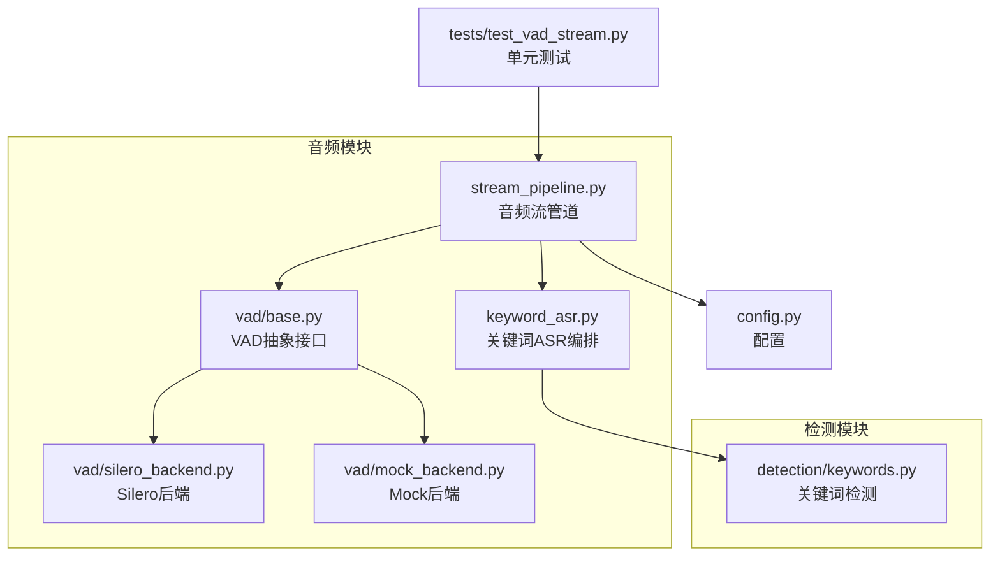
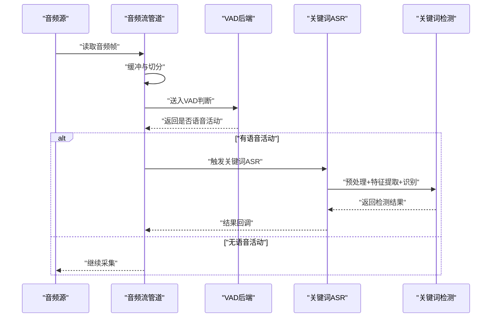
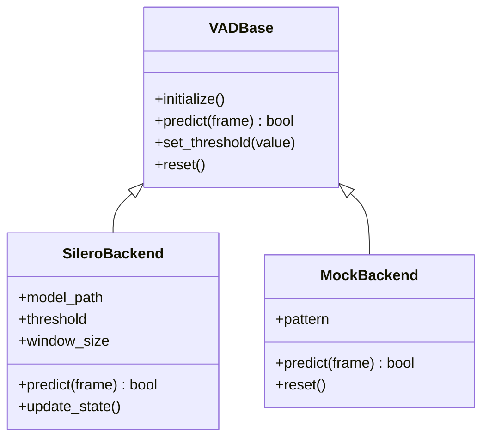
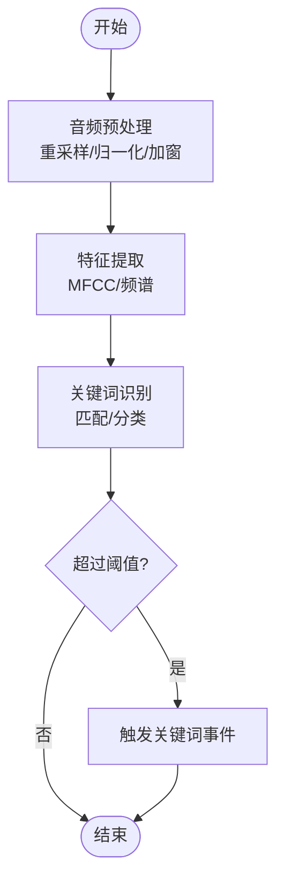
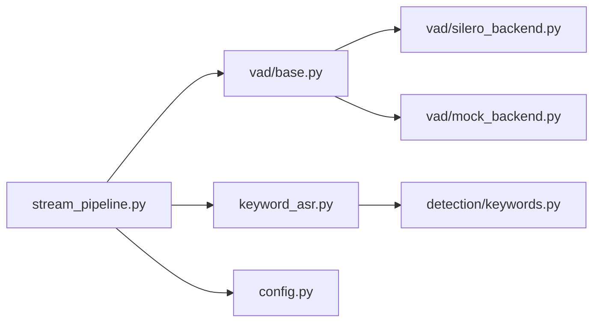

# 音频处理模块

<cite>
**本文引用的文件**   
- [app/audio/stream_pipeline.py](file://app/audio/stream_pipeline.py)
- [app/audio/keyword_asr.py](file://app/audio/keyword_asr.py)
- [app/audio/vad/base.py](file://app/audio/vad/base.py)
- [app/audio/vad/silero_backend.py](file://app/audio/vad/silero_backend.py)
- [app/audio/vad/mock_backend.py](file://app/audio/vad/mock_backend.py)
- [app/detection/keywords.py](file://app/detection/keywords.py)
- [app/config.py](file://app/config.py)
- [tests/test_vad_stream.py](file://tests/test_vad_stream.py)
</cite>

## 目录
1. [简介](#简介)
2. [项目结构](#项目结构)
3. [核心组件](#核心组件)
4. [架构总览](#架构总览)
5. [详细组件分析](#详细组件分析)
6. [依赖关系分析](#依赖关系分析)
7. [性能考虑](#性能考虑)
8. [故障排查指南](#故障排查指南)
9. [结论](#结论)
10. [附录](#附录)

## 简介
本模块聚焦于音频采集、VAD（语音活动检测）、关键词唤醒与ASR（自动语音识别）的端到端处理管道。文档围绕以下目标展开：
- 解释音频流管道的架构设计，包括数据流向、缓冲区管理与错误处理机制
- 文档化 VAD 的实现原理，包括 Silero 后端与 Mock 后端的配置和使用方法
- 说明关键词唤醒功能的实现细节，涵盖音频预处理、特征提取与识别算法
- 提供音频设备配置、采样率设置与实时处理优化建议
- 给出集成不同音频后端与处理管道的具体示例路径（以源码位置标注代替代码片段）

## 项目结构
音频相关代码主要位于 app/audio 与 app/detection 两个子模块中，配合测试与配置完成整体功能：
- app/audio：音频流管道、VAD 抽象与后端、关键词 ASR 流程编排
- app/detection：关键词检测逻辑
- tests：针对 VAD 与流式处理的单元测试
- config：全局配置项（如采样率、设备参数等）

图表来源
- [app/audio/stream_pipeline.py](file://app/audio/stream_pipeline.py)
- [app/audio/keyword_asr.py](file://app/audio/keyword_asr.py)
- [app/audio/vad/base.py](file://app/audio/vad/base.py)
- [app/audio/vad/silero_backend.py](file://app/audio/vad/silero_backend.py)
- [app/audio/vad/mock_backend.py](file://app/audio/vad/mock_backend.py)
- [app/detection/keywords.py](file://app/detection/keywords.py)
- [app/config.py](file://app/config.py)
- [tests/test_vad_stream.py](file://tests/test_vad_stream.py)

章节来源
- [app/audio/stream_pipeline.py](file://app/audio/stream_pipeline.py)
- [app/audio/keyword_asr.py](file://app/audio/keyword_asr.py)
- [app/audio/vad/base.py](file://app/audio/vad/base.py)
- [app/audio/vad/silero_backend.py](file://app/audio/vad/silero_backend.py)
- [app/audio/vad/mock_backend.py](file://app/audio/vad/mock_backend.py)
- [app/detection/keywords.py](file://app/detection/keywords.py)
- [app/config.py](file://app/config.py)
- [tests/test_vad_stream.py](file://tests/test_vad_stream.py)

## 核心组件
- 音频流管道（stream_pipeline）：负责从输入源读取音频帧，进行缓冲与切分，驱动 VAD 判断，并在检测到语音活动时触发后续处理（如关键词唤醒或 ASR）。
- VAD 抽象与后端（vad/base + silero_backend + mock_backend）：定义统一的 VAD 接口，支持多种后端实现；Silero 用于真实场景检测，Mock 用于测试与调试。
- 关键词 ASR（keyword_asr）：在检测到语音活动后，执行关键词检测流程，包含音频预处理、特征提取与识别决策。
- 关键词检测（detection/keywords）：封装关键词匹配与阈值判定逻辑。
- 配置（config）：集中管理采样率、设备索引、VAD 阈值、模型路径等关键参数。

章节来源
- [app/audio/stream_pipeline.py](file://app/audio/stream_pipeline.py)
- [app/audio/vad/base.py](file://app/audio/vad/base.py)
- [app/audio/vad/silero_backend.py](file://app/audio/vad/silero_backend.py)
- [app/audio/vad/mock_backend.py](file://app/audio/vad/mock_backend.py)
- [app/audio/keyword_asr.py](file://app/audio/keyword_asr.py)
- [app/detection/keywords.py](file://app/detection/keywords.py)
- [app/config.py](file://app/config.py)

## 架构总览
音频处理采用“采集—缓冲—VAD—关键词/ASR”的分层流水线设计，确保低延迟与高鲁棒性。

图表来源
- [app/audio/stream_pipeline.py](file://app/audio/stream_pipeline.py)
- [app/audio/vad/base.py](file://app/audio/vad/base.py)
- [app/audio/vad/silero_backend.py](file://app/audio/vad/silero_backend.py)
- [app/audio/vad/mock_backend.py](file://app/audio/vad/mock_backend.py)
- [app/audio/keyword_asr.py](file://app/audio/keyword_asr.py)
- [app/detection/keywords.py](file://app/detection/keywords.py)

## 详细组件分析

### 音频流管道（stream_pipeline）
- 职责
  - 从输入源持续读取音频帧
  - 维护环形/滑动缓冲区，按固定窗口切分
  - 调用 VAD 进行语音活动检测
  - 在检测到语音活动时，将片段传递给关键词 ASR 或下游处理
- 数据流向
  - 输入源 → 缓冲器 → 切片器 → VAD → 决策分支（关键词/ASR）
- 缓冲区管理
  - 使用固定大小窗口与步长控制，避免内存增长
  - 对丢帧与延迟进行监控与补偿
- 错误处理
  - 捕获输入异常并降级为静音或重试
  - 记录日志与指标，便于定位问题

章节来源
- [app/audio/stream_pipeline.py](file://app/audio/stream_pipeline.py)

### VAD 抽象与后端（vad/base, silero_backend, mock_backend）
- 抽象接口（base）
  - 定义统一的初始化、预测与状态管理接口
  - 暴露阈值、窗口长度、平滑策略等可调参数
- Silero 后端（silero_backend）
  - 基于预训练模型进行实时语音活动检测
  - 支持批量推理与增量更新，降低 CPU/GPU 占用
  - 可配置置信度阈值与最小激活时长
- Mock 后端（mock_backend）
  - 用于单元测试与快速验证
  - 模拟语音活动事件序列，便于回归测试

图表来源
- [app/audio/vad/base.py](file://app/audio/vad/base.py)
- [app/audio/vad/silero_backend.py](file://app/audio/vad/silero_backend.py)
- [app/audio/vad/mock_backend.py](file://app/audio/vad/mock_backend.py)

章节来源
- [app/audio/vad/base.py](file://app/audio/vad/base.py)
- [app/audio/vad/silero_backend.py](file://app/audio/vad/silero_backend.py)
- [app/audio/vad/mock_backend.py](file://app/audio/vad/mock_backend.py)

### 关键词唤醒（keyword_asr 与 detection/keywords）
- 流程概述
  - 接收来自流管道的语音片段
  - 预处理：重采样、归一化、加窗
  - 特征提取：MFCC/频谱特征等
  - 识别：关键词匹配或轻量分类模型
  - 输出：布尔结果与置信度
- 关键点
  - 预处理需与特征提取保持一致，保证在线一致性
  - 特征维度与模型输入对齐
  - 阈值策略与滑动平均抑制误报

图表来源
- [app/audio/keyword_asr.py](file://app/audio/keyword_asr.py)
- [app/detection/keywords.py](file://app/detection/keywords.py)

章节来源
- [app/audio/keyword_asr.py](file://app/audio/keyword_asr.py)
- [app/detection/keywords.py](file://app/detection/keywords.py)

### 配置与设备参数（config）
- 常见配置项
  - 采样率（如 16kHz/48kHz）
  - 设备索引与通道数
  - VAD 阈值与窗口长度
  - 关键词模型路径与阈值
- 最佳实践
  - 根据硬件能力选择合适采样率
  - 通过离线测试校准 VAD 阈值
  - 将模型路径与环境变量分离，便于部署

章节来源
- [app/config.py](file://app/config.py)

## 依赖关系分析
- 组件耦合
  - stream_pipeline 依赖 vad 抽象与 keyword_asr
  - keyword_asr 依赖 detection/keywords
  - 各后端实现均遵循 vad/base 接口，松耦合替换
- 外部依赖
  - Silero 后端依赖推理框架（如 PyTorch/TensorFlow），需确保环境一致
  - 音频输入依赖系统音频库（如 PortAudio/PyAudio）

图表来源
- [app/audio/stream_pipeline.py](file://app/audio/stream_pipeline.py)
- [app/audio/vad/base.py](file://app/audio/vad/base.py)
- [app/audio/vad/silero_backend.py](file://app/audio/vad/silero_backend.py)
- [app/audio/vad/mock_backend.py](file://app/audio/vad/mock_backend.py)
- [app/audio/keyword_asr.py](file://app/audio/keyword_asr.py)
- [app/detection/keywords.py](file://app/detection/keywords.py)
- [app/config.py](file://app/config.py)

章节来源
- [app/audio/stream_pipeline.py](file://app/audio/stream_pipeline.py)
- [app/audio/vad/base.py](file://app/audio/vad/base.py)
- [app/audio/vad/silero_backend.py](file://app/audio/vad/silero_backend.py)
- [app/audio/vad/mock_backend.py](file://app/audio/vad/mock_backend.py)
- [app/audio/keyword_asr.py](file://app/audio/keyword_asr.py)
- [app/detection/keywords.py](file://app/detection/keywords.py)
- [app/config.py](file://app/config.py)

## 性能考虑
- 采样率与窗口大小
  - 较低采样率可降低计算量，但可能影响识别精度
  - 窗口大小需平衡延迟与稳定性
- 批处理与缓存
  - 合理批大小提升吞吐，避免抖动
  - 复用特征与中间结果减少重复计算
- 资源隔离
  - 将音频采集、VAD、识别分配到不同线程/进程
  - 限制 GPU/CPU 使用，避免阻塞主循环
- 错误恢复
  - 输入异常时回退到静音模式
  - 定期重置状态，防止累积误差

[本节为通用指导，不直接分析具体文件]

## 故障排查指南
- 常见问题
  - 无语音活动：检查 VAD 阈值与窗口长度
  - 误触发频繁：调整阈值与最小激活时长
  - 延迟过高：减小窗口、优化批处理
  - 设备不可用：检查设备索引与权限
- 诊断手段
  - 启用日志与指标收集
  - 使用 Mock 后端复现问题
  - 回放录音片段进行离线验证

章节来源
- [tests/test_vad_stream.py](file://tests/test_vad_stream.py)

## 结论
本模块通过清晰的流水线设计与可插拔的 VAD 后端，实现了稳定高效的音频处理与关键词唤醒。合理的配置与优化策略可在不同硬件环境下取得良好效果。建议在部署前进行充分的阈值校准与压力测试。

[本节为总结性内容，不直接分析具体文件]

## 附录
- 集成示例（以源码位置标注代替代码片段）
  - 使用 Silero 后端进行 VAD：参考 [app/audio/vad/silero_backend.py](file://app/audio/vad/silero_backend.py)
  - 使用 Mock 后端进行测试：参考 [app/audio/vad/mock_backend.py](file://app/audio/vad/mock_backend.py)
  - 构建音频流管道并接入 VAD：参考 [app/audio/stream_pipeline.py](file://app/audio/stream_pipeline.py)
  - 关键词唤醒流程编排：参考 [app/audio/keyword_asr.py](file://app/audio/keyword_asr.py)
  - 关键词检测逻辑：参考 [app/detection/keywords.py](file://app/detection/keywords.py)
  - 配置采样率与设备参数：参考 [app/config.py](file://app/config.py)
  - 单元测试与回归用例：参考 [tests/test_vad_stream.py](file://tests/test_vad_stream.py)

[本节为指引性内容，不直接分析具体文件]