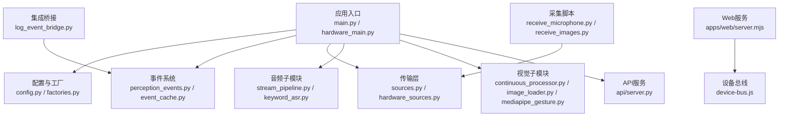
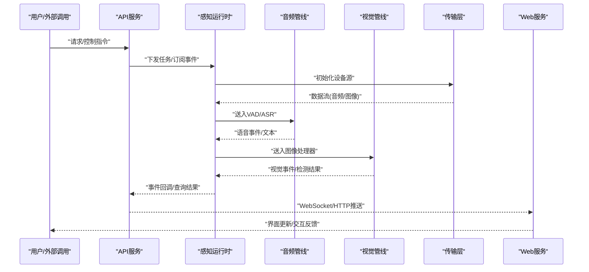
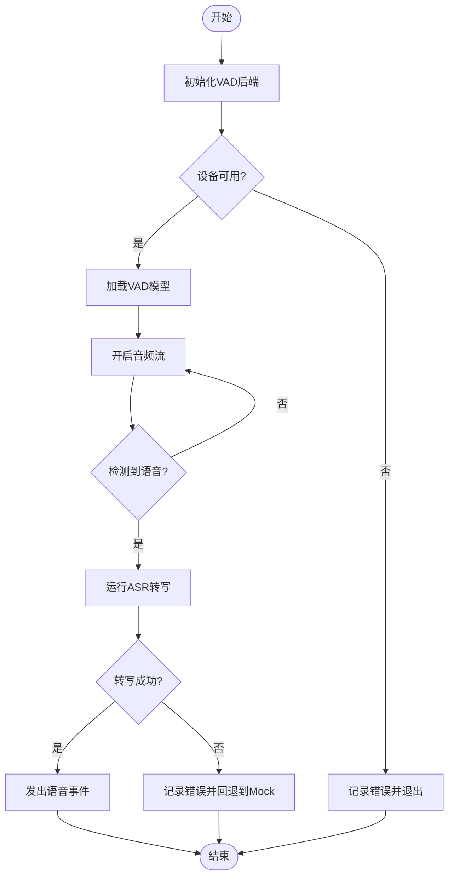
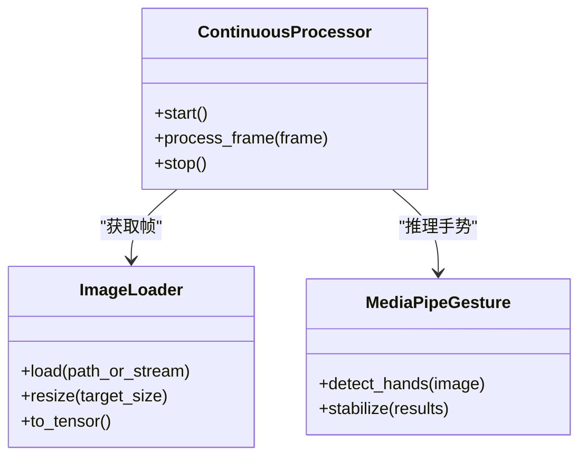
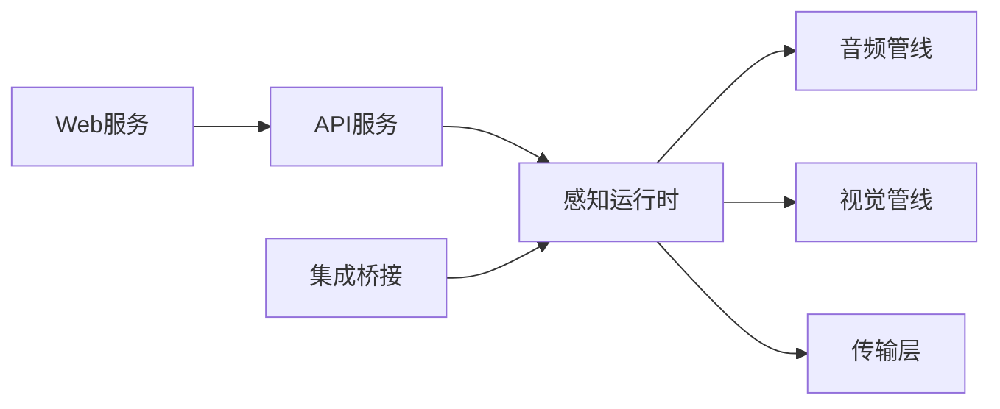

# 故障排除

<cite>
**本文引用的文件**   
- [README.md](file://README.md)
- [config.yaml](file://config.yaml)
- [app/main.py](file://app/main.py)
- [app/hardware_main.py](file://app/hardware_main.py)
- [app/config.py](file://app/config.py)
- [app/factories.py](file://app/factories.py)
- [app/perception_events.py](file://app/perception_events.py)
- [app/event_cache.py](file://app/event_cache.py)
- [app/api/server.py](file://app/api/server.py)
- [app/audio/stream_pipeline.py](file://app/audio/stream_pipeline.py)
- [app/audio/keyword_asr.py](file://app/audio/keyword_asr.py)
- [app/asr/base.py](file://app/asr/base.py)
- [app/asr/faster_whisper_backend.py](file://app/asr/faster_whisper_backend.py)
- [app/asr/mock_backend.py](file://app/asr/mock_backend.py)
- [app/audio/vad/silero_backend.py](file://app/audio/vad/silero_backend.py)
- [app/audio/vad/mock_backend.py](file://app/audio/vad/mock_backend.py)
- [app/transport/sources.py](file://app/transport/sources.py)
- [app/transport/hardware_sources.py](file://app/transport/hardware_sources.py)
- [app/vision/continuous_processor.py](file://app/vision/continuous_processor.py)
- [app/vision/image_loader.py](file://app/vision/image_loader.py)
- [app/vision/mediapipe_gesture.py](file://app/vision/mediapipe_gesture.py)
- [app/vision/mock_backend.py](file://app/vision/mock_backend.py)
- [apps/web/server.mjs](file://apps/web/server.mjs)
- [apps/web/services/device-bus.js](file://apps/web/services/device-bus.js)
- [integrations/desktop_bot/log_event_bridge.py](file://integrations/desktop_bot/log_event桥接.py)
- [scripts/receive_microphone.py](file://scripts/receive_microphone.py)
- [scripts/receive_images.py](file://scripts/receive_images.py)
- [tests/test_perception_runtime.py](file://tests/test_perception_runtime.py)
- [tests/test_vad_stream.py](file://tests/test_vad_stream.py)
</cite>

## 目录
1. [简介](#简介)
2. [项目结构](#项目结构)
3. [核心组件](#核心组件)
4. [架构总览](#架构总览)
5. [详细组件分析](#详细组件分析)
6. [依赖关系分析](#依赖关系分析)
7. [性能注意事项](#性能注意事项)
8. [故障排除指南](#故障排除指南)
9. [结论](#结论)
10. [附录](#附录)

## 简介
本指南面向开发者与运维人员，聚焦AI桌面设备的常见故障定位与修复。内容覆盖硬件连接、音频处理、视觉识别、网络通信等典型问题；提供日志分析方法、调试工具使用建议、性能瓶颈识别与优化策略；并给出多平台环境下的差异化排查步骤，以及问题反馈与解决的闭环流程。

## 项目结构
本项目采用模块化分层设计：
- 应用入口与运行时：主进程、硬件模式入口、事件总线与缓存
- 感知子系统：音频（VAD+ASR）、视觉（图像加载、手势识别）
- 传输层：设备源抽象与硬件源实现
- API与服务：HTTP服务、Web前端服务
- 集成与脚本：桌面端事件桥接、采集脚本
- 配置与测试：统一配置、单元测试

图表来源
- [app/main.py](file://app/main.py)
- [app/hardware_main.py](file://app/hardware_main.py)
- [app/config.py](file://app/config.py)
- [app/factories.py](file://app/factories.py)
- [app/perception_events.py](file://app/perception_events.py)
- [app/event_cache.py](file://app/event_cache.py)
- [app/transport/sources.py](file://app/transport/sources.py)
- [app/transport/hardware_sources.py](file://app/transport/hardware_sources.py)
- [app/audio/stream_pipeline.py](file://app/audio/stream_pipeline.py)
- [app/audio/keyword_asr.py](file://app/audio/keyword_asr.py)
- [app/vision/continuous_processor.py](file://app/vision/continuous_processor.py)
- [app/vision/image_loader.py](file://app/vision/image_loader.py)
- [app/vision/mediapipe_gesture.py](file://app/vision/mediapipe_gesture.py)
- [app/api/server.py](file://app/api/server.py)
- [apps/web/server.mjs](file://apps/web/server.mjs)
- [apps/web/services/device-bus.js](file://apps/web/services/device-bus.js)
- [integrations/desktop_bot/log_event_bridge.py](file://integrations/desktop_bot/log_event桥接.py)
- [scripts/receive_microphone.py](file://scripts/receive_microphone.py)
- [scripts/receive_images.py](file://scripts/receive_images.py)

章节来源
- [README.md](file://README.md)

## 核心组件
- 应用入口与生命周期管理：负责启动感知运行时、注册事件、拉起服务
- 配置中心：集中读取配置项，校验默认值，暴露给各模块
- 事件总线与缓存：跨模块事件分发、去重与短时缓存
- 传输层：抽象设备输入源（麦克风、摄像头），提供硬件适配
- 音频管线：VAD检测、关键词唤醒、ASR转写
- 视觉管线：连续帧处理、图像加载、手势识别
- API与Web服务：对外接口与前端交互

章节来源
- [app/main.py](file://app/main.py)
- [app/hardware_main.py](file://app/hardware_main.py)
- [app/config.py](file://app/config.py)
- [app/factories.py](file://app/factories.py)
- [app/perception_events.py](file://app/perception_events.py)
- [app/event_cache.py](file://app/event_cache.py)
- [app/transport/sources.py](file://app/transport/sources.py)
- [app/transport/hardware_sources.py](file://app/transport/hardware_sources.py)
- [app/audio/stream_pipeline.py](file://app/audio/stream_pipeline.py)
- [app/audio/keyword_asr.py](file://app/audio/keyword_asr.py)
- [app/asr/base.py](file://app/asr/base.py)
- [app/asr/faster_whisper_backend.py](file://app/asr/faster_whisper_backend.py)
- [app/asr/mock_backend.py](file://app/asr/mock_backend.py)
- [app/audio/vad/silero_backend.py](file://app/audio/vad/silero_backend.py)
- [app/audio/vad/mock_backend.py](file://app/audio/vad/mock_backend.py)
- [app/vision/continuous_processor.py](file://app/vision/continuous_processor.py)
- [app/vision/image_loader.py](file://app/vision/image_loader.py)
- [app/vision/mediapipe_gesture.py](file://app/vision/mediapipe_gesture.py)
- [app/vision/mock_backend.py](file://app/vision/mock_backend.py)
- [app/api/server.py](file://app/api/server.py)
- [apps/web/server.mjs](file://apps/web/server.mjs)
- [apps/web/services/device-bus.js](file://apps/web/services/device-bus.js)

## 架构总览
系统以“感知运行时”为核心，驱动音频与视觉流水线，通过事件总线将结果广播至API与Web前端，同时支持硬件直连模式。

图表来源
- [app/api/server.py](file://app/api/server.py)
- [app/main.py](file://app/main.py)
- [app/transport/sources.py](file://app/transport/sources.py)
- [app/audio/stream_pipeline.py](file://app/audio/stream_pipeline.py)
- [app/vision/continuous_processor.py](file://app/vision/continuous_processor.py)
- [apps/web/server.mjs](file://apps/web/server.mjs)
- [apps/web/services/device-bus.js](file://apps/web/services/device-bus.js)

## 详细组件分析

### 音频子系统（VAD + ASR）
- 症状
  - 无唤醒或唤醒延迟大
  - 转写结果为空或乱码
  - 高CPU占用导致卡顿
- 原因分析
  - VAD阈值设置不当或模型未正确加载
  - ASR后端初始化失败（权重缺失、解码器参数错误）
  - 输入采样率不匹配或缓冲区过小
- 解决方案
  - 检查VAD后端配置与模型路径，确认可用设备索引
  - 验证ASR后端依赖与模型下载完整性
  - 调整分块大小与线程池，避免阻塞
- 关键文件
  - [app/audio/stream_pipeline.py](file://app/audio/stream_pipeline.py)
  - [app/audio/keyword_asr.py](file://app/audio/keyword_asr.py)
  - [app/asr/base.py](file://app/asr/base.py)
  - [app/asr/faster_whisper_backend.py](file://app/asr/faster_whisper_backend.py)
  - [app/asr/mock_backend.py](file://app/asr/mock_backend.py)
  - [app/audio/vad/silero_backend.py](file://app/audio/vad/silero_backend.py)
  - [app/audio/vad/mock_backend.py](file://app/audio/vad/mock_backend.py)

图表来源
- [app/audio/stream_pipeline.py](file://app/audio/stream_pipeline.py)
- [app/audio/vad/silero_backend.py](file://app/audio/vad/silero_backend.py)
- [app/asr/faster_whisper_backend.py](file://app/asr/faster_whisper_backend.py)

章节来源
- [app/audio/stream_pipeline.py](file://app/audio/stream_pipeline.py)
- [app/audio/keyword_asr.py](file://app/audio/keyword_asr.py)
- [app/asr/base.py](file://app/asr/base.py)
- [app/asr/faster_whisper_backend.py](file://app/asr/faster_whisper_backend.py)
- [app/asr/mock_backend.py](file://app/asr/mock_backend.py)
- [app/audio/vad/silero_backend.py](file://app/audio/vad/silero_backend.py)
- [app/audio/vad/mock_backend.py](file://app/audio/vad/mock_backend.py)

### 视觉子系统（图像加载 + 手势识别）
- 症状
  - 画面黑屏或帧率为0
  - 手势识别不稳定或误检
  - 内存增长导致崩溃
- 原因分析
  - 图像源不可用或分辨率过高
  - 模型推理耗时过长且未批处理
  - 帧缓冲未释放造成泄漏
- 解决方案
  - 校验摄像头/视频源可用性，限制分辨率与帧率
  - 启用批处理与异步推理，降低主线程阻塞
  - 确保每帧处理后释放中间对象
- 关键文件
  - [app/vision/continuous_processor.py](file://app/vision/continuous_processor.py)
  - [app/vision/image_loader.py](file://app/vision/image_loader.py)
  - [app/vision/mediapipe_gesture.py](file://app/vision/mediapipe_gesture.py)
  - [app/vision/mock_backend.py](file://app/vision/mock_backend.py)

图表来源
- [app/vision/continuous_processor.py](file://app/vision/continuous_processor.py)
- [app/vision/image_loader.py](file://app/vision/image_loader.py)
- [app/vision/mediapipe_gesture.py](file://app/vision/mediapipe_gesture.py)

章节来源
- [app/vision/continuous_processor.py](file://app/vision/continuous_processor.py)
- [app/vision/image_loader.py](file://app/vision/image_loader.py)
- [app/vision/mediapipe_gesture.py](file://app/vision/mediapipe_gesture.py)
- [app/vision/mock_backend.py](file://app/vision/mock_backend.py)

### 传输层（设备源抽象与硬件适配）
- 症状
  - 无法枚举设备或打开失败
  - 数据流中断或丢帧严重
  - 不同平台行为不一致
- 原因分析
  - 权限不足或设备被占用
  - 缓冲区与线程数配置不当
  - 平台差异（Windows/Mac/Linux）未兼容
- 解决方案
  - 检查设备权限与独占访问，关闭冲突程序
  - 调优缓冲区大小与并发度
  - 针对平台差异增加降级策略与重试机制
- 关键文件
  - [app/transport/sources.py](file://app/transport/sources.py)
  - [app/transport/hardware_sources.py](file://app/transport/hardware_sources.py)

章节来源
- [app/transport/sources.py](file://app/transport/sources.py)
- [app/transport/hardware_sources.py](file://app/transport/hardware_sources.py)

### API与Web服务
- 症状
  - 接口返回错误或超时
  - Web端收不到事件或频繁断开
- 原因分析
  - 端口占用或防火墙拦截
  - WebSocket握手失败或心跳丢失
  - 事件队列积压
- 解决方案
  - 检查端口占用与网络策略
  - 增加重连与心跳保活
  - 限流与背压，避免队列膨胀
- 关键文件
  - [app/api/server.py](file://app/api/server.py)
  - [apps/web/server.mjs](file://apps/web/server.mjs)
  - [apps/web/services/device-bus.js](file://apps/web/services/device-bus.js)

章节来源
- [app/api/server.py](file://app/api/server.py)
- [apps/web/server.mjs](file://apps/web/server.mjs)
- [apps/web/services/device-bus.js](file://apps/web/services/device-bus.js)

## 依赖关系分析
- 模块耦合
  - 感知运行时依赖传输层、音频与视觉子模块
  - API与Web服务通过事件总线解耦
- 外部依赖
  - 音频VAD/ASR模型与库
  - 视觉推理框架（如MediaPipe）
  - 网络库（HTTP/WebSocket）
- 潜在循环依赖
  - 事件总线与运行时之间需单向依赖，避免循环

图表来源
- [app/main.py](file://app/main.py)
- [app/perception_events.py](file://app/perception_events.py)
- [app/api/server.py](file://app/api/server.py)
- [apps/web/server.mjs](file://apps/web/server.mjs)
- [integrations/desktop_bot/log_event_bridge.py](file://integrations/desktop_bot/log_event桥接.py)

章节来源
- [app/main.py](file://app/main.py)
- [app/perception_events.py](file://app/perception_events.py)
- [app/api/server.py](file://app/api/server.py)
- [apps/web/server.mjs](file://apps/web/server.mjs)
- [integrations/desktop_bot/log_event_bridge.py](file://integrations/desktop_bot/log_event桥接.py)

## 性能注意事项
- 音频
  - 合理设置VAD阈值与ASR分块大小，避免频繁上下文切换
  - 使用多线程/异步IO减少阻塞
- 视觉
  - 限制分辨率与帧率，启用批处理与GPU加速（若可用）
  - 及时释放中间张量与图像对象
- 传输
  - 增大缓冲区与并发度，监控丢帧率
- API/Web
  - 引入限流与队列长度上限，避免雪崩
  - 使用连接池与持久化连接

[本节为通用指导，无需引用具体文件]

## 故障排除指南

### 硬件连接问题
- 症状
  - 设备枚举失败、无法打开麦克风/摄像头
  - 数据流中断、频繁重连
- 诊断步骤
  - 检查设备权限与独占状态，关闭冲突应用
  - 验证设备索引与采样率/分辨率配置
  - 使用采集脚本验证数据通路
- 解决方案
  - 修正配置项，重启服务
  - 升级驱动或更换设备
- 参考文件
  - [scripts/receive_microphone.py](file://scripts/receive_microphone.py)
  - [scripts/receive_images.py](file://scripts/receive_images.py)
  - [app/transport/sources.py](file://app/transport/sources.py)
  - [app/transport/hardware_sources.py](file://app/transport/hardware_sources.py)

章节来源
- [scripts/receive_microphone.py](file://scripts/receive_microphone.py)
- [scripts/receive_images.py](file://scripts/receive_images.py)
- [app/transport/sources.py](file://app/transport/sources.py)
- [app/transport/hardware_sources.py](file://app/transport/hardware_sources.py)

### 音频处理异常
- 症状
  - 无唤醒、唤醒延迟大、转写为空或乱码
- 诊断步骤
  - 检查VAD后端模型路径与设备索引
  - 验证ASR后端依赖与模型完整性
  - 查看音频流是否持续输出有效数据
- 解决方案
  - 重新下载模型或修正路径
  - 调整分块大小与线程池
  - 切换到Mock后端进行隔离验证
- 参考文件
  - [app/audio/stream_pipeline.py](file://app/audio/stream_pipeline.py)
  - [app/audio/keyword_asr.py](file://app/audio/keyword_asr.py)
  - [app/asr/base.py](file://app/asr/base.py)
  - [app/asr/faster_whisper_backend.py](file://app/asr/faster_whisper_backend.py)
  - [app/asr/mock_backend.py](file://app/asr/mock_backend.py)
  - [app/audio/vad/silero_backend.py](file://app/audio/vad/silero_backend.py)
  - [app/audio/vad/mock_backend.py](file://app/audio/vad/mock_backend.py)

章节来源
- [app/audio/stream_pipeline.py](file://app/audio/stream_pipeline.py)
- [app/audio/keyword_asr.py](file://app/audio/keyword_asr.py)
- [app/asr/base.py](file://app/asr/base.py)
- [app/asr/faster_whisper_backend.py](file://app/asr/faster_whisper_backend.py)
- [app/asr/mock_backend.py](file://app/asr/mock_backend.py)
- [app/audio/vad/silero_backend.py](file://app/audio/vad/silero_backend.py)
- [app/audio/vad/mock_backend.py](file://app/audio/vad/mock_backend.py)

### 视觉识别失败
- 症状
  - 黑屏、帧率为0、手势识别不稳定
- 诊断步骤
  - 检查图像源可用性与分辨率设置
  - 验证推理模型与依赖库版本
  - 监控内存与CPU占用
- 解决方案
  - 降低分辨率与帧率，启用批处理
  - 释放中间对象，避免内存泄漏
  - 切换到Mock后端验证逻辑链路
- 参考文件
  - [app/vision/continuous_processor.py](file://app/vision/continuous_processor.py)
  - [app/vision/image_loader.py](file://app/vision/image_loader.py)
  - [app/vision/mediapipe_gesture.py](file://app/vision/mediapipe_gesture.py)
  - [app/vision/mock_backend.py](file://app/vision/mock_backend.py)

章节来源
- [app/vision/continuous_processor.py](file://app/vision/continuous_processor.py)
- [app/vision/image_loader.py](file://app/vision/image_loader.py)
- [app/vision/mediapipe_gesture.py](file://app/vision/mediapipe_gesture.py)
- [app/vision/mock_backend.py](file://app/vision/mock_backend.py)

### 网络通信中断
- 症状
  - API超时、Web端断连、事件未到达
- 诊断步骤
  - 检查端口占用与防火墙规则
  - 验证WebSocket握手与心跳
  - 查看事件队列长度与背压情况
- 解决方案
  - 开放端口与调整网络策略
  - 增加重连与心跳保活
  - 限流与队列上限保护
- 参考文件
  - [app/api/server.py](file://app/api/server.py)
  - [apps/web/server.mjs](file://apps/web/server.mjs)
  - [apps/web/services/device-bus.js](file://apps/web/services/device-bus.js)

章节来源
- [app/api/server.py](file://app/api/server.py)
- [apps/web/server.mjs](file://apps/web/server.mjs)
- [apps/web/services/device-bus.js](file://apps/web/services/device-bus.js)

### 日志分析与调试技巧
- 日志位置
  - 应用日志目录与标准输出
  - Web服务访问日志
- 关键日志点
  - 设备初始化、模型加载、事件发布/消费
  - 错误堆栈与重试次数
- 调试工具
  - 使用采集脚本验证数据通路
  - 在关键节点插入断点与指标收集
- 参考文件
  - [integrations/desktop_bot/log_event_bridge.py](file://integrations/desktop_bot/log_event桥接.py)
  - [scripts/receive_microphone.py](file://scripts/receive_microphone.py)
  - [scripts/receive_images.py](file://scripts/receive_images.py)

章节来源
- [integrations/desktop_bot/log_event_bridge.py](file://integrations/desktop_bot/log_event桥接.py)
- [scripts/receive_microphone.py](file://scripts/receive_microphone.py)
- [scripts/receive_images.py](file://scripts/receive_images.py)

### 性能瓶颈识别与优化
- 识别方法
  - 监控CPU/GPU/内存与I/O
  - 统计端到端时延与吞吐
- 优化建议
  - 音频：调整分块与线程池，减少上下文切换
  - 视觉：批处理、降分辨率、启用GPU
  - 传输：增大缓冲与并发，监控丢帧
  - API/Web：限流、背压、连接池
- 参考文件
  - [app/audio/stream_pipeline.py](file://app/audio/stream_pipeline.py)
  - [app/vision/continuous_processor.py](file://app/vision/continuous_processor.py)
  - [app/transport/sources.py](file://app/transport/sources.py)
  - [app/api/server.py](file://app/api/server.py)

章节来源
- [app/audio/stream_pipeline.py](file://app/audio/stream_pipeline.py)
- [app/vision/continuous_processor.py](file://app/vision/continuous_processor.py)
- [app/transport/sources.py](file://app/transport/sources.py)
- [app/api/server.py](file://app/api/server.py)

### 多平台与环境差异
- Windows
  - 注意设备独占与权限，检查驱动兼容性
- macOS
  - 注意沙盒权限与隐私设置
- Linux
  - 检查udev规则与用户组权限
- 通用
  - 使用Mock后端隔离问题，逐步替换真实后端

[本节为通用指导，无需引用具体文件]

### 问题反馈与解决闭环
- 收集信息
  - 复现步骤、环境信息、日志片段、配置快照
- 定位问题
  - 使用采集脚本与Mock后端隔离
  - 逐步缩小范围至模块级
- 修复与验证
  - 最小化补丁，回归测试
  - 补充单测与集成测试用例
- 复盘与沉淀
  - 更新故障手册与知识库
  - 完善监控与告警

[本节为通用指导，无需引用具体文件]

## 结论
通过系统化地梳理音频、视觉、传输与网络等关键子系统，结合日志分析与调试工具，能够快速定位并解决常见问题。建议在开发阶段即建立完善的监控、测试与文档体系，形成问题发现—定位—修复—验证—沉淀的闭环流程，持续提升稳定性与用户体验。

[本节为总结性内容，无需引用具体文件]

## 附录
- 常用命令与脚本
  - 音频采集：[scripts/receive_microphone.py](file://scripts/receive_microphone.py)
  - 图像采集：[scripts/receive_images.py](file://scripts/receive_images.py)
- 测试用例
  - 感知运行时测试：[tests/test_perception_runtime.py](file://tests/test_perception_runtime.py)
  - VAD流测试：[tests/test_vad_stream.py](file://tests/test_vad_stream.py)

章节来源
- [scripts/receive_microphone.py](file://scripts/receive_microphone.py)
- [scripts/receive_images.py](file://scripts/receive_images.py)
- [tests/test_perception_runtime.py](file://tests/test_perception_runtime.py)
- [tests/test_vad_stream.py](file://tests/test_vad_stream.py)