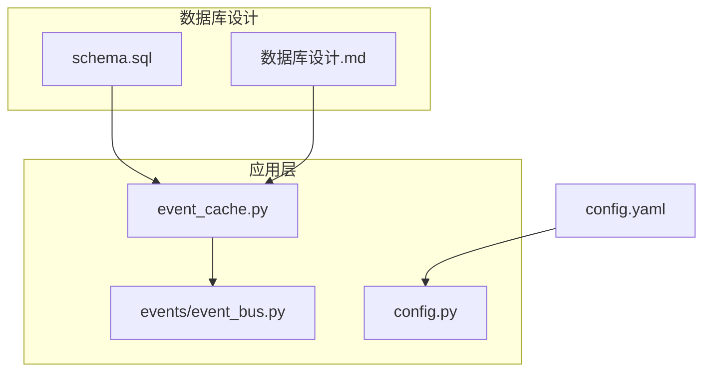
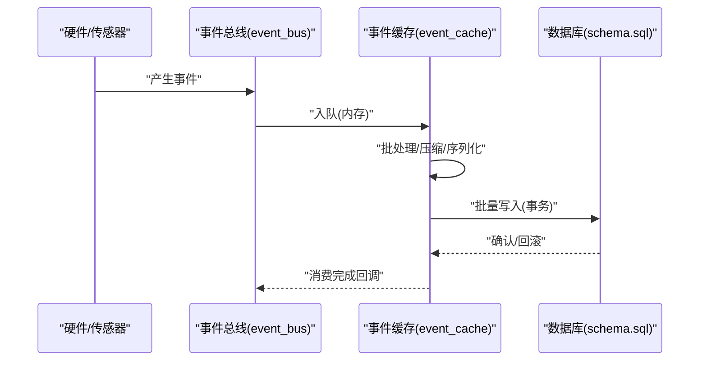
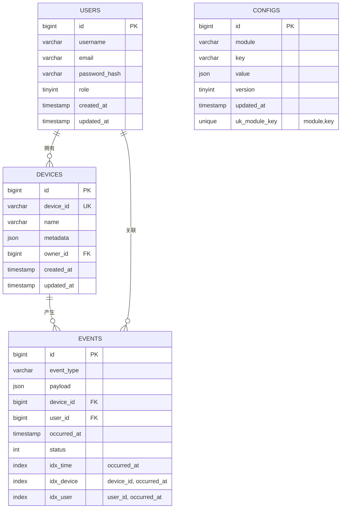
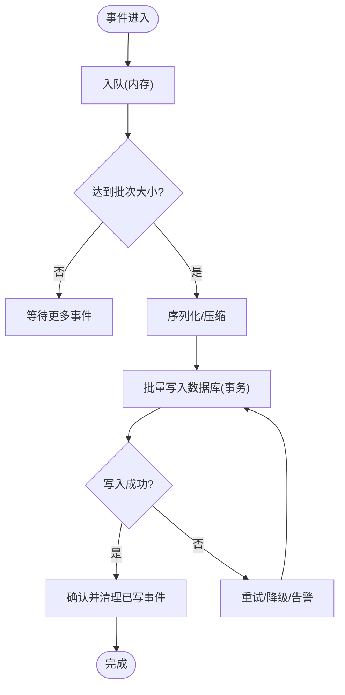
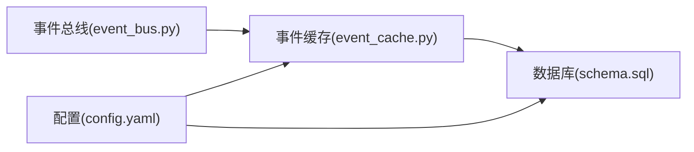

# 数据库设计

<cite>
**本文引用的文件**   
- [AI_Hardware_Community_Project/05_Database/schema.sql](file://AI_Hardware_Community_Project/05_Database/schema.sql)
- [AI_Hardware_Community_Project/05_Database/数据库设计.md](file://AI_Hardware_Community_Project/05_Database/数据库设计.md)
- [app/event_cache.py](file://app/event_cache.py)
- [app/events/event_bus.py](file://app/events/event_bus.py)
- [config.yaml](file://config.yaml)
</cite>

## 目录
1. [简介](#简介)
2. [项目结构](#项目结构)
3. [核心组件](#核心组件)
4. [架构总览](#架构总览)
5. [详细组件分析](#详细组件分析)
6. [依赖关系分析](#依赖关系分析)
7. [性能考虑](#性能考虑)
8. [故障排查指南](#故障排查指南)
9. [结论](#结论)
10. [附录](#附录)

## 简介
本文件面向事件存储、用户数据与系统配置的数据库设计与实现，目标包括：
- 明确实体关系模型（ER）与表结构设计、字段定义和数据类型
- 规范主键/外键约束、索引策略与查询优化方案
- 解释事件缓存机制（内存缓存与持久化存储协同）的实现原理
- 给出数据迁移策略、备份恢复方案与性能调优建议
- 总结数据访问模式的最佳实践与常见问题解决方案

## 项目结构
本项目在文档与代码层面分别提供了数据库相关的设计与实现：
- 数据库设计文档与建库脚本位于 AI_Hardware_Community_Project/05_Database
- 运行时事件缓存与事件总线位于 app 目录
- 系统配置通过 YAML 管理

图表来源
- [AI_Hardware_Community_Project/05_Database/schema.sql](file://AI_Hardware_Community_Project/05_Database/schema.sql)
- [AI_Hardware_Community_Project/05_Database/数据库设计.md](file://AI_Hardware_Community_Project/05_Database/数据库设计.md)
- [app/event_cache.py](file://app/event_cache.py)
- [app/events/event_bus.py](file://app/events/event_bus.py)
- [config.yaml](file://config.yaml)

章节来源
- [AI_Hardware_Community_Project/05_Database/schema.sql](file://AI_Hardware_Community_Project/05_Database/schema.sql)
- [AI_Hardware_Community_Project/05_Database/数据库设计.md](file://AI_Hardware_Community_Project/05_Database/数据库设计.md)
- [app/event_cache.py](file://app/event_cache.py)
- [app/events/event_bus.py](file://app/events/event_bus.py)
- [config.yaml](file://config.yaml)

## 核心组件
- 事件存储：用于记录感知、控制与硬件交互等事件，支持高吞吐写入与时间序列查询
- 用户数据：用户账户、角色权限、设备绑定与偏好设置
- 系统配置：全局开关、模块参数、阈值与路由规则
- 事件缓存：内存队列 + 持久化落盘，保障事件不丢失且削峰填谷

章节来源
- [AI_Hardware_Community_Project/05_Database/数据库设计.md](file://AI_Hardware_Community_Project/05_Database/数据库设计.md)
- [app/event_cache.py](file://app/event_cache.py)
- [app/events/event_bus.py](file://app/events/event_bus.py)

## 架构总览
下图展示事件从采集到持久化的整体流程，以及内存缓存与数据库的协作方式。

图表来源
- [app/events/event_bus.py](file://app/events/event_bus.py)
- [app/event_cache.py](file://app/event_cache.py)
- [AI_Hardware_Community_Project/05_Database/schema.sql](file://AI_Hardware_Community_Project/05_Database/schema.sql)

## 详细组件分析

### 实体关系模型（ER）
- 用户与设备：一个用户可绑定多个设备，设备归属单一用户
- 事件与用户：事件由设备触发，关联用户上下文
- 配置与模块：配置项按模块分组，提供运行时开关与参数

图表来源
- [AI_Hardware_Community_Project/05_Database/schema.sql](file://AI_Hardware_Community_Project/05_Database/schema.sql)

章节来源
- [AI_Hardware_Community_Project/05_Database/schema.sql](file://AI_Hardware_Community_Project/05_Database/schema.sql)

### 表结构与字段说明
- users
  - 主键：id（自增或雪花ID）
  - 唯一键：username、email
  - 字段：role（枚举：admin/user）、created_at、updated_at
- devices
  - 主键：id
  - 唯一键：device_id
  - 外键：owner_id -> users.id
  - 字段：name、metadata（JSON，扩展属性）
- events
  - 主键：id
  - 外键：device_id -> devices.id；user_id -> users.id
  - 索引：occurred_at、device_id+occurred_at、user_id+occurred_at
  - 字段：event_type、payload（JSON）、status（枚举：pending/sent/failed）
- configs
  - 主键：id
  - 唯一键：module,key
  - 字段：value（JSON）、version（乐观锁）、updated_at

章节来源
- [AI_Hardware_Community_Project/05_Database/schema.sql](file://AI_Hardware_Community_Project/05_Database/schema.sql)

### 主键与外键约束
- 主键策略：使用自增或分布式ID生成器，保证全局唯一与顺序性
- 外键约束：
  - devices.owner_id 引用 users.id，确保设备归属有效
  - events.device_id 引用 devices.id，events.user_id 引用 users.id，确保事件溯源
- 唯一约束：
  - users.username/email 唯一
  - devices.device_id 唯一
  - configs.module/key 唯一

章节来源
- [AI_Hardware_Community_Project/05_Database/schema.sql](file://AI_Hardware_Community_Project/05_Database/schema.sql)

### 索引策略与查询优化
- 事件表
  - 单列索引：occurred_at（时间范围查询）
  - 复合索引：device_id + occurred_at（按设备时间线查询）
  - 复合索引：user_id + occurred_at（按用户时间线查询）
- 用户与设备
  - 基于唯一键的查找（username/email/device_id）
- 配置
  - 基于 module,key 的唯一索引快速定位配置项
- 查询优化建议
  - 优先使用覆盖索引减少回表
  - 大表分区：按时间（月/周）对 events 进行分区
  - 冷热分离：历史事件归档至冷存储

章节来源
- [AI_Hardware_Community_Project/05_Database/schema.sql](file://AI_Hardware_Community_Project/05_Database/schema.sql)

### 事件缓存机制（内存与持久化协同）
- 内存缓存
  - 采用环形缓冲或队列，支持高吞吐写入与批处理
  - 支持压缩与序列化，降低内存占用与网络开销
- 持久化落盘
  - 定时或达到阈值时批量写入数据库，保证事务一致性
  - 失败重试与幂等写入，避免重复事件
- 背压与限流
  - 当数据库写入慢时，内存队列增长触发背压，限制上游生产速率
- 监控与告警
  - 暴露队列长度、写入延迟、失败率等指标

图表来源
- [app/event_cache.py](file://app/event_cache.py)
- [app/events/event_bus.py](file://app/events/event_bus.py)

章节来源
- [app/event_cache.py](file://app/event_cache.py)
- [app/events/event_bus.py](file://app/events/event_bus.py)

### 数据迁移策略
- 版本化管理
  - 每个 schema 变更对应一个迁移脚本，包含 up/down
- 灰度发布
  - 先向后兼容新增字段，再逐步淘汰旧字段
- 回滚策略
  - 保留反向迁移脚本，确保可回滚
- 校验与测试
  - 在预发环境执行迁移演练，验证数据一致性与性能

章节来源
- [AI_Hardware_Community_Project/05_Database/schema.sql](file://AI_Hardware_Community_Project/05_Database/schema.sql)

### 备份恢复方案
- 全量备份
  - 定期快照（如每日），保留多份历史副本
- 增量备份
  - 基于 WAL/Binlog 的增量备份，缩短恢复时间
- 恢复演练
  - 定期演练恢复流程，验证 RTO/RPO 目标
- 异地容灾
  - 跨机房/云区域复制，提升可用性

章节来源
- [AI_Hardware_Community_Project/05_Database/schema.sql](file://AI_Hardware_Community_Project/05_Database/schema.sql)

### 性能调优建议
- 连接池
  - 合理设置最大连接数与超时，避免连接风暴
- 批量写入
  - 合并小事务为批量操作，降低锁竞争
- 读写分离
  - 读多写少场景下引入只读副本
- 缓存热点
  - 配置与字典类数据使用本地缓存或 Redis
- 监控与诊断
  - 关注慢查询、锁等待、IO 峰值

章节来源
- [AI_Hardware_Community_Project/05_Database/schema.sql](file://AI_Hardware_Community_Project/05_Database/schema.sql)

### 数据访问模式最佳实践
- 统一数据访问层
  - 封装 CRUD、事务边界与错误码
- 参数化查询
  - 防止 SQL 注入，提高计划重用
- 分页与游标
  - 大数据集查询使用分页或游标
- 幂等写入
  - 使用业务主键或去重表避免重复
- 审计与追踪
  - 记录关键操作的审计日志

章节来源
- [AI_Hardware_Community_Project/05_Database/schema.sql](file://AI_Hardware_Community_Project/05_Database/schema.sql)

### 常见问题与解决方案
- 事件丢失
  - 启用持久化落盘与重试机制，检查消费者消费位点
- 写入延迟
  - 调整批大小与并发度，优化索引与分区
- 死锁
  - 统一事务顺序，缩小事务范围
- 配置不一致
  - 使用版本号与灰度发布，强制客户端拉取最新配置

章节来源
- [app/event_cache.py](file://app/event_cache.py)
- [app/events/event_bus.py](file://app/events/event_bus.py)

## 依赖关系分析
- 事件总线负责事件分发，事件缓存负责缓冲与落盘，数据库负责持久化
- 配置通过 YAML 加载，影响事件缓存与数据库连接参数

图表来源
- [app/events/event_bus.py](file://app/events/event_bus.py)
- [app/event_cache.py](file://app/event_cache.py)
- [AI_Hardware_Community_Project/05_Database/schema.sql](file://AI_Hardware_Community_Project/05_Database/schema.sql)
- [config.yaml](file://config.yaml)

章节来源
- [app/events/event_bus.py](file://app/events/event_bus.py)
- [app/event_cache.py](file://app/event_cache.py)
- [AI_Hardware_Community_Project/05_Database/schema.sql](file://AI_Hardware_Community_Project/05_Database/schema.sql)
- [config.yaml](file://config.yaml)

## 性能考虑
- 事件写入路径应优先保证低延迟与高吞吐
- 数据库侧通过索引与分区优化时间序列查询
- 配置读取走缓存，降低数据库压力
- 监控关键指标：队列长度、写入延迟、失败率、慢查询

[本节为通用指导，无需特定文件引用]

## 故障排查指南
- 事件未入库
  - 检查事件缓存队列是否积压，查看写入失败日志
- 事件重复
  - 检查幂等键与去重逻辑，核对消费者位点
- 配置未生效
  - 确认配置版本与加载顺序，检查热更新机制
- 数据库慢查询
  - 使用 EXPLAIN 分析执行计划，补充或调整索引

章节来源
- [app/event_cache.py](file://app/event_cache.py)
- [app/events/event_bus.py](file://app/events/event_bus.py)

## 结论
本设计围绕事件、用户与配置三大核心域，构建了可扩展、可维护的数据库架构。通过合理的 ER 模型、索引策略与事件缓存机制，兼顾了高吞吐写入与高效查询。配合完善的迁移、备份与监控体系，可在生产环境中稳定运行。

[本节为总结性内容，无需特定文件引用]

## 附录
- 术语表
  - 事件：系统内发生的可观测行为或状态变化
  - 事件总线：事件的生产与分发中枢
  - 事件缓存：内存队列与持久化落盘的协同缓冲层
- 参考
  - 数据库设计文档与建库脚本
  - 事件缓存与事件总线实现

[本节为补充信息，无需特定文件引用]