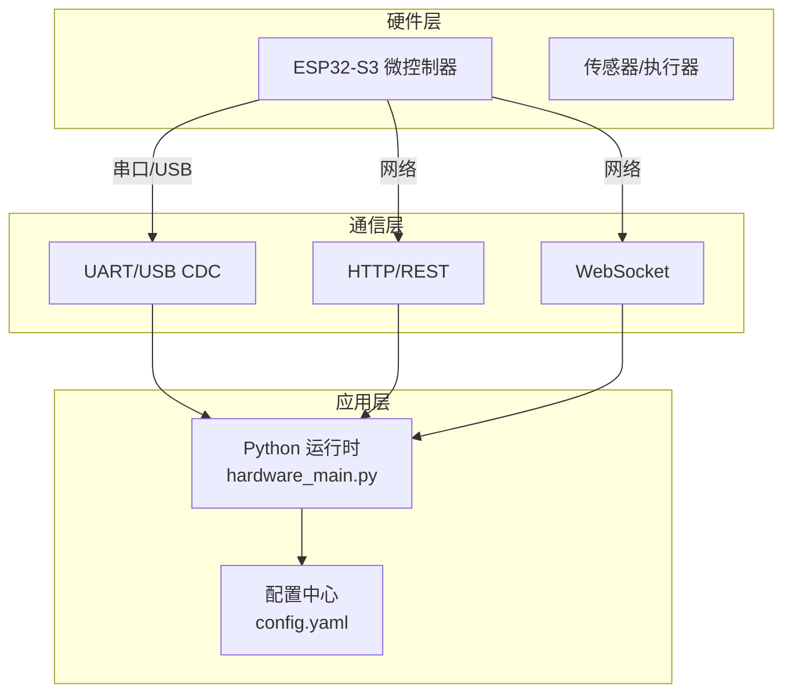
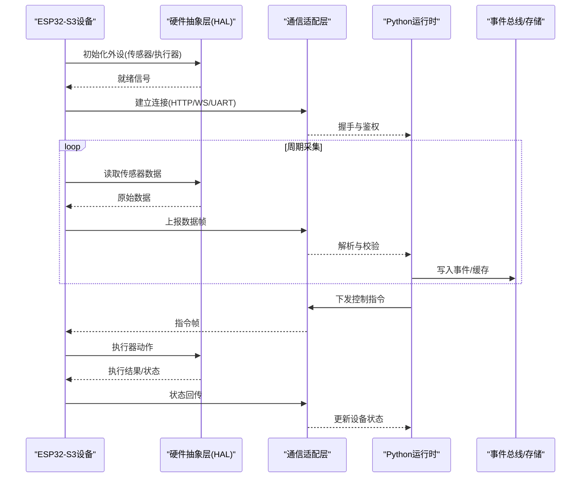
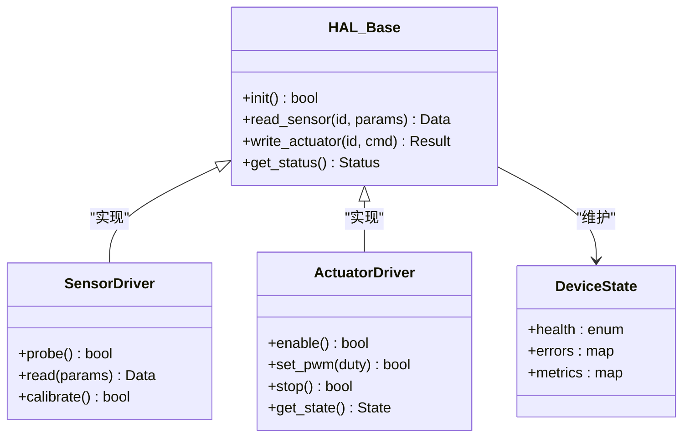
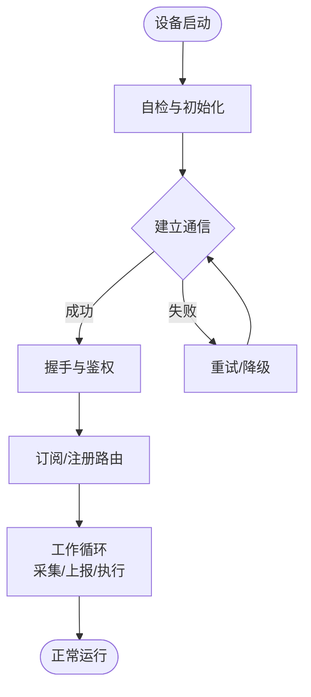
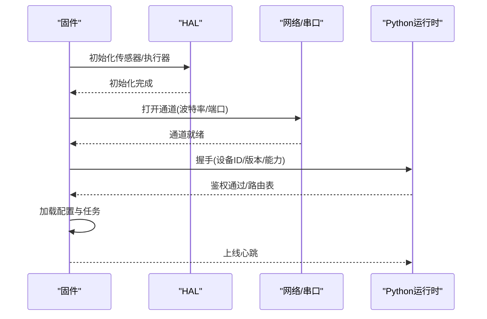
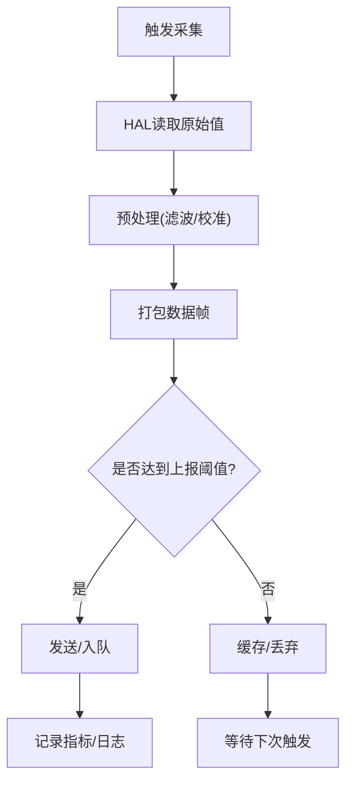
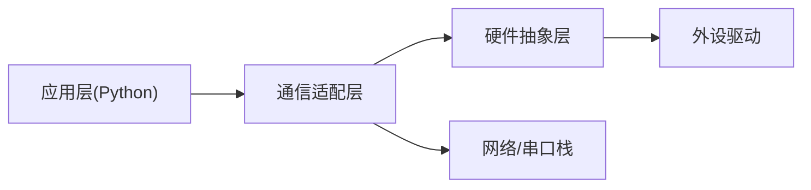

# ESP32-S3接入设计

<cite>
**本文引用的文件**   
- [ESP32-S3接入设计.md](file://AI_Hardware_Community_Project/07_Hardware/ESP32-S3接入设计.md)
- [MVP设备模拟协议.md](file://AI_Hardware_Community_Project/07_Hardware/MVP设备模拟协议.md)
- [Web与ESP32通信方案.md](file://AI_Hardware_Community_Project/07_Hardware/Web与ESP32通信方案.md)
- [系统架构设计.md](file://AI_Hardware_Community_Project/02_Architecture/系统架构设计.md)
- [hardware_main.py](file://app/hardware_main.py)
- [config.yaml](file://config.yaml)
</cite>

## 目录
1. [引言](#引言)
2. [项目结构](#项目结构)
3. [核心组件](#核心组件)
4. [架构总览](#架构总览)
5. [详细组件分析](#详细组件分析)
6. [依赖关系分析](#依赖关系分析)
7. [性能考虑](#性能考虑)
8. [故障排查指南](#故障排查指南)
9. [结论](#结论)
10. [附录](#附录)

## 引言
本文件面向将ESP32-S3作为硬件边缘节点接入系统的工程实践，覆盖硬件特性、引脚配置、通信接口选择、设备初始化流程、固件烧录步骤、连接建立过程，以及硬件抽象层（HAL）的设计模式。文档同时给出资源分配、内存管理与性能优化建议，并总结常见兼容性问题与调试技巧，帮助读者快速完成从硬件到软件的全链路集成。

## 项目结构
本项目在“AI_Hardware_Community_Project/07_Hardware”中提供ESP32-S3接入设计与通信方案，同时在应用侧通过Python运行时进行桥接与事件分发。关键文件包括：
- 硬件接入设计文档：定义ESP32-S3的硬件选型、引脚与接口策略
- 设备模拟协议：定义MVP阶段设备与上位机之间的消息格式与交互时序
- Web与ESP32通信方案：明确HTTP/WebSocket等传输方式及数据流
- 系统架构设计：描述整体分层与模块职责
- 应用侧硬件入口：Python进程启动与硬件通道初始化
- 配置文件：集中管理端口、超时、重试等运行参数

图表来源
- [ESP32-S3接入设计.md](file://AI_Hardware_Community_Project/07_Hardware/ESP32-S3接入设计.md)
- [Web与ESP32通信方案.md](file://AI_Hardware_Community_Project/07_Hardware/Web与ESP32通信方案.md)
- [system_architecture.md](file://AI_Hardware_Community_Project/02_Architecture/系统架构设计.md)

章节来源
- [ESP32-S3接入设计.md](file://AI_Hardware_Community_Project/07_Hardware/ESP32-S3接入设计.md)
- [系统架构设计.md](file://AI_Hardware_Community_Project/02_Architecture/系统架构设计.md)

## 核心组件
- 硬件抽象层（HAL）
  - 传感器读取：统一I2C/SPI/ADC接口封装，屏蔽底层驱动差异
  - 执行器控制：PWM/GPIO/串口命令封装，提供安全阈值与状态回读
  - 状态管理：设备健康、任务队列、错误码与告警上报
- 通信适配层
  - 上行：传感器数据、事件、诊断信息
  - 下行：控制指令、OTA升级包、配置下发
- 运行时桥接
  - Python侧负责协议解析、事件总线转发、持久化与对外API暴露

章节来源
- [ESP32-S3接入设计.md](file://AI_Hardware_Community_Project/07_Hardware/ESP32-S3接入设计.md)
- [MVP设备模拟协议.md](file://AI_Hardware_Community_Project/07_Hardware/MVP设备模拟协议.md)
- [Web与ESP32通信方案.md](file://AI_Hardware_Community_Project/07_Hardware/Web与ESP32通信方案.md)

## 架构总览
下图展示从ESP32-S3到Python运行时的端到端数据与控制流，强调HAL与通信适配层的解耦。

图表来源
- [MVP设备模拟协议.md](file://AI_Hardware_Community_Project/07_Hardware/MVP设备模拟协议.md)
- [Web与ESP32通信方案.md](file://AI_Hardware_Community_Project/07_Hardware/Web与ESP32通信方案.md)
- [hardware_main.py](file://app/hardware_main.py)

## 详细组件分析

### 硬件抽象层（HAL）设计
- 设计目标
  - 统一接口：为不同传感器/执行器提供一致的读写方法
  - 可插拔：按设备类型动态加载驱动
  - 健壮性：内置超时、重试、错误码与降级策略
- 关键模块
  - 传感器读取：I2C/SPI/ADC封装，支持批量采样与滤波
  - 执行器控制：GPIO/PWM/串口命令封装，带权限与安全限幅
  - 状态管理：心跳、看门狗、异常计数、告警阈值
- 数据结构与复杂度
  - 数据帧采用固定头部+可变载荷，解析O(n)，n为载荷长度
  - 采样缓冲采用环形队列，避免频繁分配，降低碎片
- 错误处理
  - 分级错误码：通信/驱动/业务三层
  - 自动重试与退避，失败时上报诊断帧

图表来源
- [ESP32-S3接入设计.md](file://AI_Hardware_Community_Project/07_Hardware/ESP32-S3接入设计.md)

章节来源
- [ESP32-S3接入设计.md](file://AI_Hardware_Community_Project/07_Hardware/ESP32-S3接入设计.md)

### 通信适配层与协议
- 传输选择
  - 开发调试：UART/USB CDC低延迟直连
  - 生产部署：HTTP/REST用于配置与批量数据；WebSocket用于实时事件
- 消息模型
  - 统一帧头+类型+长度+载荷+校验
  - 命令/响应/事件三类消息，支持幂等与去重
- 连接建立流程
  - 设备端上电自检→建立通信→握手鉴权→订阅主题/路由→进入工作循环

图表来源
- [MVP设备模拟协议.md](file://AI_Hardware_Community_Project/07_Hardware/MVP设备模拟协议.md)
- [Web与ESP32通信方案.md](file://AI_Hardware_Community_Project/07_Hardware/Web与ESP32通信方案.md)

章节来源
- [MVP设备模拟协议.md](file://AI_Hardware_Community_Project/07_Hardware/MVP设备模拟协议.md)
- [Web与ESP32通信方案.md](file://AI_Hardware_Community_Project/07_Hardware/Web与ESP32通信方案.md)

### 设备初始化与固件烧录
- 初始化流程
  - 电源与时钟稳定→外设枚举→HAL初始化→通信栈初始化→配置加载→进入主循环
- 固件烧录
  - 使用官方工具链或IDE进行分区表校验、镜像签名与下载
  - 首次烧录后执行出厂自检与版本上报
- 连接建立
  - 根据配置选择UART/HTTP/WS，完成鉴权与主题订阅

图表来源
- [hardware_main.py](file://app/hardware_main.py)
- [ESP32-S3接入设计.md](file://AI_Hardware_Community_Project/07_Hardware/ESP32-S3接入设计.md)

章节来源
- [hardware_main.py](file://app/hardware_main.py)
- [ESP32-S3接入设计.md](file://AI_Hardware_Community_Project/07_Hardware/ESP32-S3接入设计.md)

### 传感器数据读取与执行器控制
- 传感器读取
  - 统一采样接口，支持单次/周期/触发模式
  - 数据预处理：去噪、单位换算、时间戳对齐
- 执行器控制
  - 安全限幅与互斥锁，防止冲突操作
  - 异步回调与状态回读，确保可控可观测
- 状态管理
  - 设备健康度、错误计数、告警阈值与上报频率

图表来源
- [ESP32-S3接入设计.md](file://AI_Hardware_Community_Project/07_Hardware/ESP32-S3接入设计.md)

章节来源
- [ESP32-S3接入设计.md](file://AI_Hardware_Community_Project/07_Hardware/ESP32-S3接入设计.md)

### 代码集成示例（路径指引）
- 设备入口与生命周期管理
  - 参考：[hardware_main.py](file://app/hardware_main.py)
- 配置项（端口、超时、重试、采样间隔等）
  - 参考：[config.yaml](file://config.yaml)
- 协议与通信细节
  - 参考：[MVP设备模拟协议.md](file://AI_Hardware_Community_Project/07_Hardware/MVP设备模拟协议.md)
  - 参考：[Web与ESP32通信方案.md](file://AI_Hardware_Community_Project/07_Hardware/Web与ESP32通信方案.md)

章节来源
- [hardware_main.py](file://app/hardware_main.py)
- [config.yaml](file://config.yaml)
- [MVP设备模拟协议.md](file://AI_Hardware_Community_Project/07_Hardware/MVP设备模拟协议.md)
- [Web与ESP32通信方案.md](file://AI_Hardware_Community_Project/07_Hardware/Web与ESP32通信方案.md)

## 依赖关系分析
- 模块耦合
  - HAL与具体驱动松耦合，通过接口抽象替换
  - 通信适配层对上层透明，支持多传输并行
- 外部依赖
  - 操作系统/RTOS、网络栈、加密库（如需TLS）
  - 外设驱动库（I2C/SPI/ADC/PWM）
- 潜在环路
  - 避免HAL与通信层互相调用，应通过事件或回调解耦

图表来源
- [系统架构设计.md](file://AI_Hardware_Community_Project/02_Architecture/系统架构设计.md)

章节来源
- [系统架构设计.md](file://AI_Hardware_Community_Project/02_Architecture/系统架构设计.md)

## 性能考虑
- 内存管理
  - 使用静态缓冲与环形队列减少堆分配
  - 大对象池化复用，避免频繁malloc/free
- 任务调度
  - 高优先级中断仅做最小化处理，耗时任务放入后台任务
  - 合理设置采样周期与批大小，平衡延迟与吞吐
- 通信优化
  - 压缩与合并上报，减少小包风暴
  - 断线重连指数退避，避免雪崩
- 功耗与热管理
  - 空闲降频/休眠，按需唤醒
  - 温度监控与限功率策略

## 故障排查指南
- 常见问题
  - 无法建立通信：检查端口/波特率/权限与防火墙
  - 数据异常：校验和失败、时间戳错位、单位不一致
  - 执行器无响应：权限不足、互斥锁占用、安全限幅触发
- 调试技巧
  - 启用详细日志与抓包（串口/网络）
  - 注入Mock驱动验证上层逻辑
  - 分阶段隔离：先HAL自测，再通信联调，最后端到端
- 恢复策略
  - 自动重启与回滚到稳定版本
  - 降级模式：关闭非关键功能保活

章节来源
- [MVP设备模拟协议.md](file://AI_Hardware_Community_Project/07_Hardware/MVP设备模拟协议.md)
- [Web与ESP32通信方案.md](file://AI_Hardware_Community_Project/07_Hardware/Web与ESP32通信方案.md)

## 结论
通过清晰的HAL抽象、稳定的通信适配与完善的运行时桥接，ESP32-S3能够以低成本、低功耗的方式可靠接入系统。遵循本文的资源分配、内存管理与性能优化建议，并结合协议与调试实践，可显著缩短从原型到量产的周期。

## 附录
- 术语
  - HAL：硬件抽象层
  - OTA：空中升级
  - CDC：通信设备类（USB转串口）
- 参考
  - 系统架构设计文档
  - 设备模拟协议与通信方案