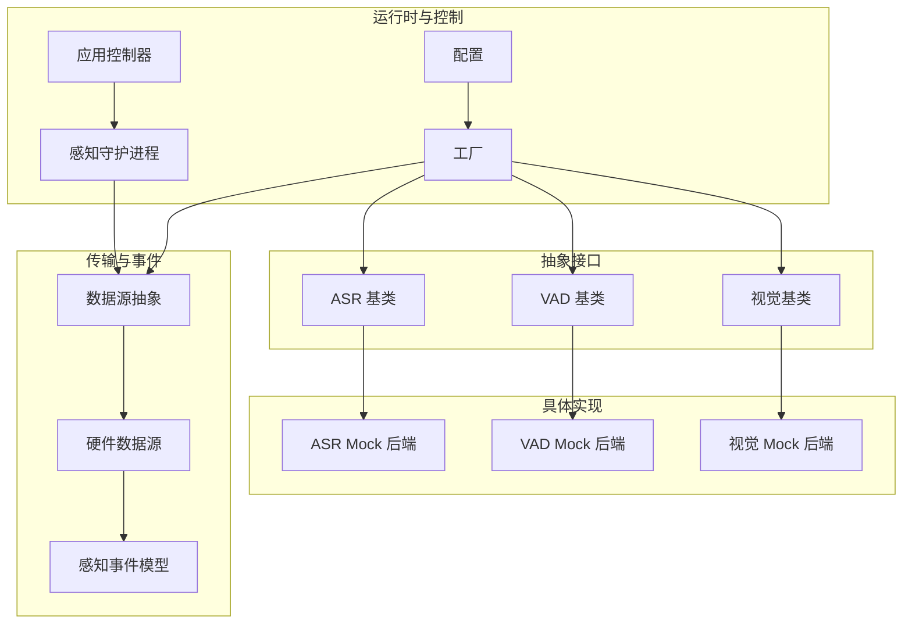
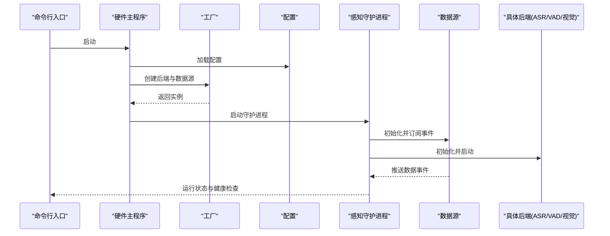
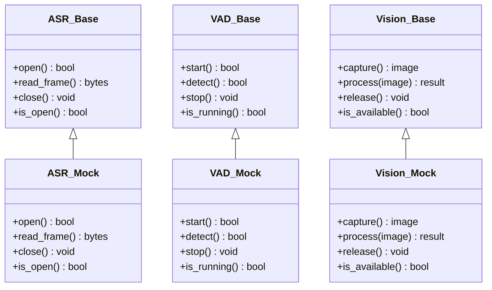
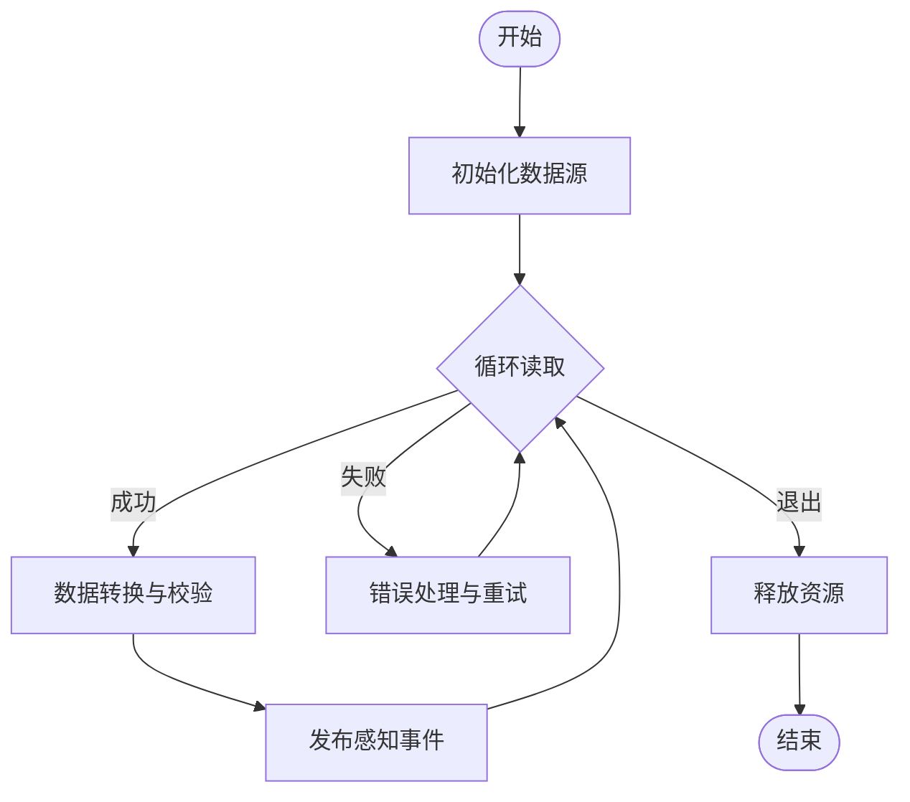
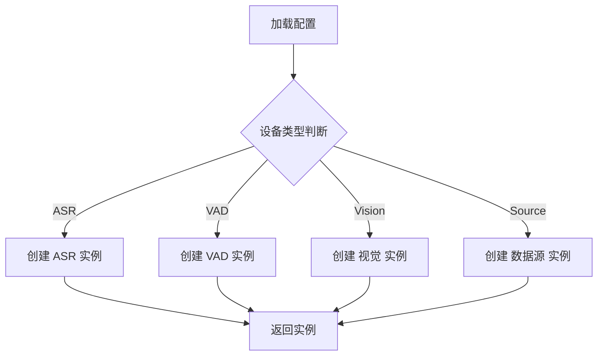
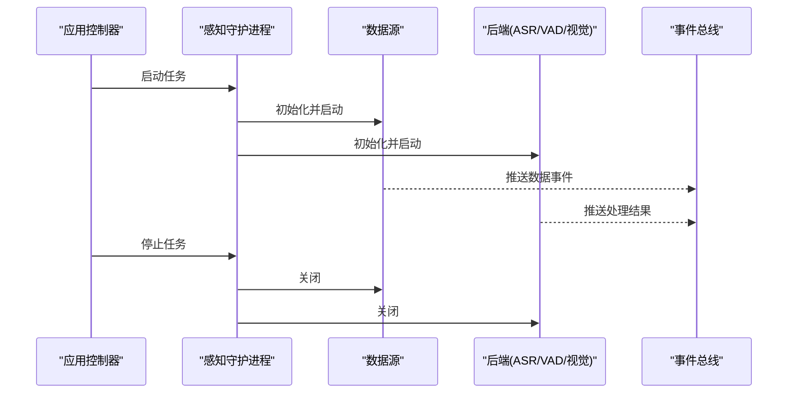
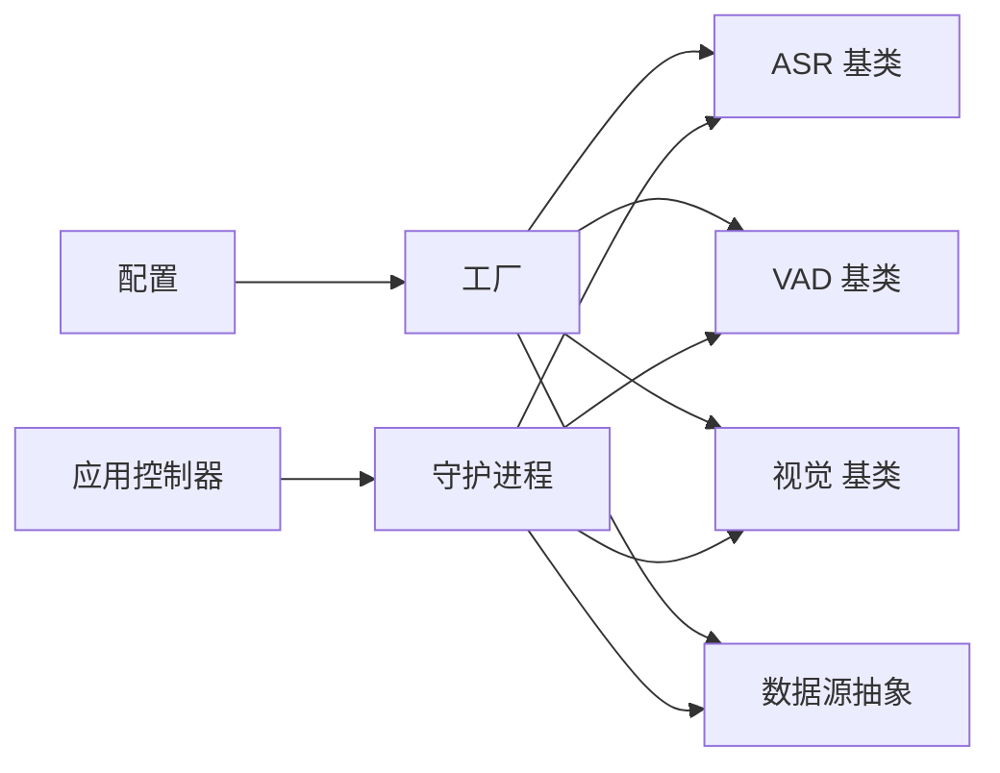

# 硬件抽象层

<cite>
**本文档引用的文件**   
- [app/hardware_main.py](file://app/hardware_main.py)
- [app/factories.py](file://app/factories.py)
- [app/transport/sources.py](file://app/transport/sources.py)
- [app/transport/hardware_sources.py](file://app/transport/hardware_sources.py)
- [app/asr/base.py](file://app/asr/base.py)
- [app/asr/mock_backend.py](file://app/asr/mock_backend.py)
- [app/audio/vad/base.py](file://app/audio/vad/base.py)
- [app/audio/vad/mock_backend.py](file://app/audio/vad/mock_backend.py)
- [app/vision/base.py](file://app/vision/base.py)
- [app/vision/mock_backend.py](file://app/vision/mock_backend.py)
- [app/config.py](file://app/config.py)
- [config.yaml](file://config.yaml)
- [app/perception_events.py](file://app/perception_events.py)
- [app/runtime/perception_daemon.py](file://app/runtime/perception_daemon.py)
- [app/control/application_controller.py](file://app/control/application_controller.py)
- [tests/test_perception_runtime.py](file://tests/test_perception_runtime.py)
</cite>

## 目录
1. [简介](#简介)
2. [项目结构](#项目结构)
3. [核心组件](#核心组件)
4. [架构总览](#架构总览)
5. [详细组件分析](#详细组件分析)
6. [依赖关系分析](#依赖关系分析)
7. [性能考量](#性能考量)
8. [故障排查指南](#故障排查指南)
9. [结论](#结论)
10. [附录](#附录)

## 简介
本技术文档围绕“硬件抽象层（HAL）”的设计与实现，系统化阐述接口定义、继承体系、工厂模式与生命周期管理。重点覆盖传感器、执行器与通信模块的统一访问方式，设备发现与初始化流程，以及自定义硬件设备的集成规范与测试要求。同时给出资源管理、错误处理与异常恢复的最佳实践，帮助开发者快速扩展并稳定运行多源异构硬件系统。

## 项目结构
本项目采用分层与按功能域组织相结合的结构：
- 抽象基类位于各功能域（如 asr、audio/vad、vision），提供统一接口契约
- 具体后端以“Mock/真实实现”成对出现，便于开发与测试
- transport 层负责数据源接入与事件桥接
- runtime 层提供守护进程与事件总线驱动
- control 层协调应用控制流
- factories 提供统一的实例化入口
- config 与配置文件集中管理运行时参数

**图示来源** 
- [app/asr/base.py](file://app/asr/base.py)
- [app/asr/mock_backend.py](file://app/asr/mock_backend.py)
- [app/audio/vad/base.py](file://app/audio/vad/base.py)
- [app/audio/vad/mock_backend.py](file://app/audio/vad/mock_backend.py)
- [app/vision/base.py](file://app/vision/base.py)
- [app/vision/mock_backend.py](file://app/vision/mock_backend.py)
- [app/transport/sources.py](file://app/transport/sources.py)
- [app/transport/hardware_sources.py](file://app/transport/hardware_sources.py)
- [app/perception_events.py](file://app/perception_events.py)
- [app/runtime/perception_daemon.py](file://app/runtime/perception_daemon.py)
- [app/control/application_controller.py](file://app/control/application_controller.py)
- [app/factories.py](file://app/factories.py)
- [app/config.py](file://app/config.py)

**章节来源**
- [app/hardware_main.py](file://app/hardware_main.py)
- [app/factories.py](file://app/factories.py)
- [app/transport/sources.py](file://app/transport/sources.py)
- [app/transport/hardware_sources.py](file://app/transport/hardware_sources.py)
- [app/asr/base.py](file://app/asr/base.py)
- [app/asr/mock_backend.py](file://app/asr/mock_backend.py)
- [app/audio/vad/base.py](file://app/audio/vad/base.py)
- [app/audio/vad/mock_backend.py](file://app/audio/vad/mock_backend.py)
- [app/vision/base.py](file://app/vision/base.py)
- [app/vision/mock_backend.py](file://app/vision/mock_backend.py)
- [app/config.py](file://app/config.py)
- [config.yaml](file://config.yaml)

## 核心组件
- 抽象基类与统一接口
  - ASR 抽象：语音识别后端统一接口，定义打开、读取帧、关闭等能力
  - VAD 抽象：语音活动检测后端统一接口，定义开启、检测、停止等能力
  - 视觉抽象：图像/视频流处理后端统一接口，定义采集、处理、释放等能力
- 数据源与传输
  - 数据源抽象：统一的数据读取与事件发布接口
  - 硬件数据源：对接具体硬件或模拟源的实现
- 运行时与控制
  - 感知守护进程：启动、调度、监控各后端与数据源的生命周期
  - 应用控制器：对外暴露控制命令，协调感知任务
- 工厂与配置
  - 工厂：根据配置创建具体后端与数据源实例
  - 配置：集中管理设备类型、路径、超时、重试策略等

**章节来源**
- [app/asr/base.py](file://app/asr/base.py)
- [app/audio/vad/base.py](file://app/audio/vad/base.py)
- [app/vision/base.py](file://app/vision/base.py)
- [app/transport/sources.py](file://app/transport/sources.py)
- [app/transport/hardware_sources.py](file://app/transport/hardware_sources.py)
- [app/runtime/perception_daemon.py](file://app/runtime/perception_daemon.py)
- [app/control/application_controller.py](file://app/control/application_controller.py)
- [app/factories.py](file://app/factories.py)
- [app/config.py](file://app/config.py)

## 架构总览
硬件抽象层通过“接口+实现+工厂+运行时”的分层设计，将不同硬件设备（传感器、执行器、通信模块）统一为一致的 API。运行时守护进程负责任务编排与生命周期管理，事件模型贯穿数据流与控制流。

**图示来源** 
- [app/hardware_main.py](file://app/hardware_main.py)
- [app/factories.py](file://app/factories.py)
- [app/config.py](file://app/config.py)
- [app/runtime/perception_daemon.py](file://app/runtime/perception_daemon.py)
- [app/transport/sources.py](file://app/transport/sources.py)
- [app/asr/base.py](file://app/asr/base.py)
- [app/audio/vad/base.py](file://app/audio/vad/base.py)
- [app/vision/base.py](file://app/vision/base.py)

## 详细组件分析

### 抽象接口与继承体系
- ASR 抽象与实现
  - 基类定义统一方法：打开、读取帧、关闭、状态查询
  - Mock 后端用于无硬件环境下的开发调试
- VAD 抽象与实现
  - 基类定义统一方法：开启、检测静音/语音、停止
  - Mock 后端模拟音频活动检测结果
- 视觉抽象与实现
  - 基类定义统一方法：采集帧、图像处理、释放资源
  - Mock 后端生成模拟图像数据

**图示来源** 
- [app/asr/base.py](file://app/asr/base.py)
- [app/asr/mock_backend.py](file://app/asr/mock_backend.py)
- [app/audio/vad/base.py](file://app/audio/vad/base.py)
- [app/audio/vad/mock_backend.py](file://app/audio/vad/mock_backend.py)
- [app/vision/base.py](file://app/vision/base.py)
- [app/vision/mock_backend.py](file://app/vision/mock_backend.py)

**章节来源**
- [app/asr/base.py](file://app/asr/base.py)
- [app/asr/mock_backend.py](file://app/asr/mock_backend.py)
- [app/audio/vad/base.py](file://app/audio/vad/base.py)
- [app/audio/vad/mock_backend.py](file://app/audio/vad/mock_backend.py)
- [app/vision/base.py](file://app/vision/base.py)
- [app/vision/mock_backend.py](file://app/vision/mock_backend.py)

### 数据源与传输
- 数据源抽象：定义读取数据、发布事件、生命周期管理接口
- 硬件数据源：封装具体硬件的读取逻辑，转换为统一事件格式
- 事件模型：标准化感知事件结构，便于下游消费

**图示来源** 
- [app/transport/sources.py](file://app/transport/sources.py)
- [app/transport/hardware_sources.py](file://app/transport/hardware_sources.py)
- [app/perception_events.py](file://app/perception_events.py)

**章节来源**
- [app/transport/sources.py](file://app/transport/sources.py)
- [app/transport/hardware_sources.py](file://app/transport/hardware_sources.py)
- [app/perception_events.py](file://app/perception_events.py)

### 工厂模式与配置
- 工厂职责：依据配置选择并创建具体后端与数据源实例
- 配置项：设备类型、路径、超时、重试次数、采样率等
- 扩展点：新增设备类型时仅需在工厂注册映射与配置项

**图示来源** 
- [app/factories.py](file://app/factories.py)
- [app/config.py](file://app/config.py)
- [config.yaml](file://config.yaml)

**章节来源**
- [app/factories.py](file://app/factories.py)
- [app/config.py](file://app/config.py)
- [config.yaml](file://config.yaml)

### 运行时守护进程与应用控制
- 守护进程：负责后端与数据源的启动、监控、健康检查与优雅关闭
- 应用控制器：接收外部控制指令，触发感知任务或调整运行参数
- 事件总线：贯穿数据流与控制流，解耦生产者与消费者

**图示来源** 
- [app/runtime/perception_daemon.py](file://app/runtime/perception_daemon.py)
- [app/control/application_controller.py](file://app/control/application_controller.py)
- [app/transport/sources.py](file://app/transport/sources.py)
- [app/asr/base.py](file://app/asr/base.py)
- [app/audio/vad/base.py](file://app/audio/vad/base.py)
- [app/vision/base.py](file://app/vision/base.py)

**章节来源**
- [app/runtime/perception_daemon.py](file://app/runtime/perception_daemon.py)
- [app/control/application_controller.py](file://app/control/application_controller.py)

## 依赖关系分析
- 低耦合：抽象基类隔离了具体实现细节，工厂负责装配
- 高内聚：每个功能域（ASR、VAD、视觉）内部接口与实现紧密相关
- 运行时依赖：守护进程依赖数据源与后端，事件模型贯穿全链路
- 配置驱动：所有实例化行为由配置决定，便于动态切换与扩展

**图示来源** 
- [app/config.py](file://app/config.py)
- [app/factories.py](file://app/factories.py)
- [app/asr/base.py](file://app/asr/base.py)
- [app/audio/vad/base.py](file://app/audio/vad/base.py)
- [app/vision/base.py](file://app/vision/base.py)
- [app/transport/sources.py](file://app/transport/sources.py)
- [app/runtime/perception_daemon.py](file://app/runtime/perception_daemon.py)
- [app/control/application_controller.py](file://app/control/application_controller.py)

**章节来源**
- [app/config.py](file://app/config.py)
- [app/factories.py](file://app/factories.py)
- [app/asr/base.py](file://app/asr/base.py)
- [app/audio/vad/base.py](file://app/audio/vad/base.py)
- [app/vision/base.py](file://app/vision/base.py)
- [app/transport/sources.py](file://app/transport/sources.py)
- [app/runtime/perception_daemon.py](file://app/runtime/perception_daemon.py)
- [app/control/application_controller.py](file://app/control/application_controller.py)

## 性能考量
- 异步与并发：数据读取与事件发布应尽可能非阻塞，避免阻塞守护进程主循环
- 缓冲与批处理：合理设置缓冲区大小与批处理粒度，平衡延迟与吞吐
- 资源复用：后端与数据源对象生命周期管理，减少频繁创建销毁开销
- 降级与回退：当硬件不可用时自动切换到 Mock 或缓存数据，保障服务可用性
- 监控与指标：关键路径添加耗时统计与错误计数，便于定位瓶颈

[本节为通用指导，不直接分析具体文件]

## 故障排查指南
- 常见问题
  - 设备无法打开：检查配置路径与权限，确认硬件在线
  - 数据为空或异常：验证数据源读取逻辑与事件格式
  - 后端崩溃：查看日志堆栈，启用 Mock 后端隔离问题
- 诊断步骤
  - 使用单元测试验证后端与数据源基本能力
  - 逐步替换真实硬件为 Mock，定位问题范围
  - 增加日志级别与断点，跟踪事件流转
- 恢复策略
  - 自动重试与指数退避
  - 健康检查与自愈重启
  - 安全降级与告警通知

**章节来源**
- [tests/test_perception_runtime.py](file://tests/test_perception_runtime.py)

## 结论
本硬件抽象层通过清晰的接口契约、继承体系与工厂装配，实现了传感器、执行器与通信模块的统一访问。运行时守护进程与事件模型保障了系统的可扩展性与稳定性。遵循本文档的集成规范与最佳实践，可高效扩展新硬件设备并提升整体可靠性。

[本节为总结性内容，不直接分析具体文件]

## 附录
- 自定义硬件设备集成指南
  - 定义接口：继承对应基类，实现必要方法
  - 注册工厂：在工厂中新增类型映射与创建逻辑
  - 配置项：在配置文件中声明设备类型与参数
  - 测试要求：编写单元测试覆盖打开、读取、关闭与异常场景
- 资源管理与错误处理最佳实践
  - 显式释放资源，避免泄漏
  - 捕获并分类异常，记录上下文信息
  - 设计幂等操作，支持重复调用与恢复
- 参考文件
  - 抽象基类与实现：asr、audio/vad、vision
  - 数据源与事件：transport、perception_events
  - 运行时与控制：runtime、control
  - 工厂与配置：factories、config、config.yaml

**章节来源**
- [app/asr/base.py](file://app/asr/base.py)
- [app/asr/mock_backend.py](file://app/asr/mock_backend.py)
- [app/audio/vad/base.py](file://app/audio/vad/base.py)
- [app/audio/vad/mock_backend.py](file://app/audio/vad/mock_backend.py)
- [app/vision/base.py](file://app/vision/base.py)
- [app/vision/mock_backend.py](file://app/vision/mock_backend.py)
- [app/transport/sources.py](file://app/transport/sources.py)
- [app/transport/hardware_sources.py](file://app/transport/hardware_sources.py)
- [app/perception_events.py](file://app/perception_events.py)
- [app/runtime/perception_daemon.py](file://app/runtime/perception_daemon.py)
- [app/control/application_controller.py](file://app/control/application_controller.py)
- [app/factories.py](file://app/factories.py)
- [app/config.py](file://app/config.py)
- [config.yaml](file://config.yaml)
- [tests/test_perception_runtime.py](file://tests/test_perception_runtime.py)