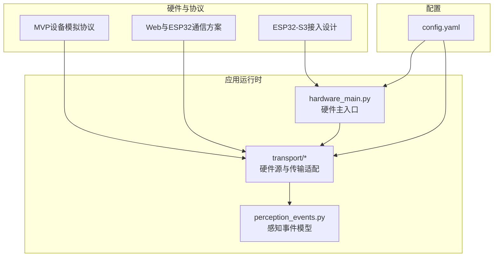
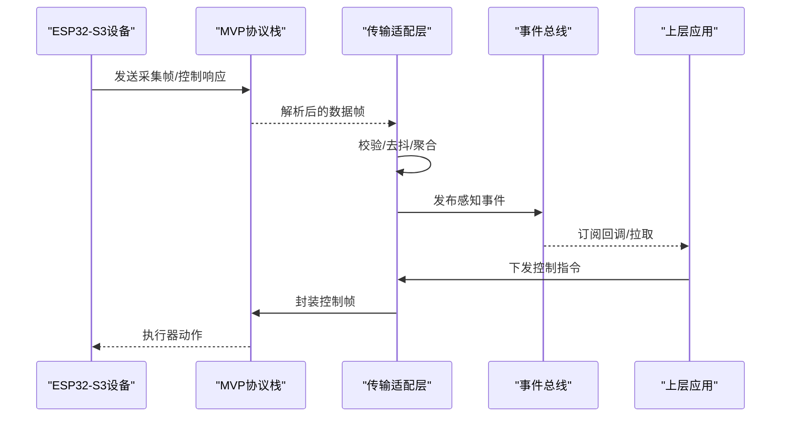
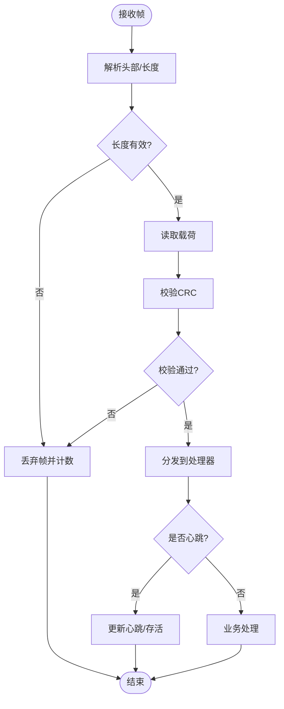
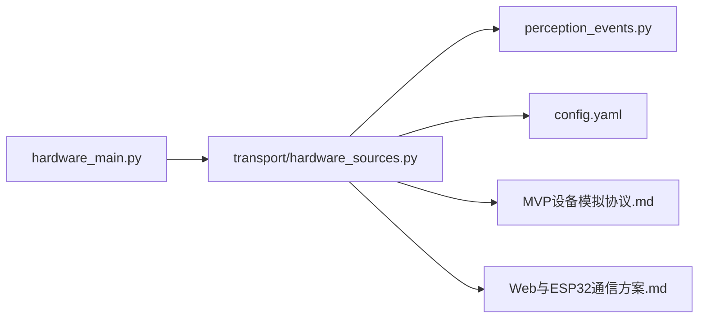

# 硬件集成

<cite>
**本文引用的文件**   
- [ESP32-S3接入设计.md](file://AI_Hardware_Community_Project/07_Hardware/ESP32-S3接入设计.md)
- [MVP设备模拟协议.md](file://AI_Hardware_Community_Project/07_Hardware/MVP设备模拟协议.md)
- [Web与ESP32通信方案.md](file://AI_Hardware_Community_Project/07_Hardware/Web与ESP32通信方案.md)
- [系统架构设计.md](file://AI_Hardware_Community_Project/02_Architecture/系统架构设计.md)
- [hardware_main.py](file://app/hardware_main.py)
- [transport/__init__.py](file://app/transport/__init__.py)
- [transport/hardware_sources.py](file://app/transport/hardware_sources.py)
- [transport/sources.py](file://app/transport/sources.py)
- [perception_events.py](file://app/perception_events.py)
- [config.yaml](file://config.yaml)
</cite>

## 目录
1. [简介](#简介)
2. [项目结构](#项目结构)
3. [核心组件](#核心组件)
4. [架构总览](#架构总览)
5. [详细组件分析](#详细组件分析)
6. [依赖关系分析](#依赖关系分析)
7. [性能考虑](#性能考虑)
8. [故障排除指南](#故障排除指南)
9. [结论](#结论)
10. [附录](#附录)

## 简介
本文件面向硬件集成与ESP32-S3微控制器的接入方案，系统性说明硬件抽象层（HAL）设计、传感器数据采集、执行器控制与实时通信机制。文档同时覆盖MVP设备模拟协议的实现细节（数据传输格式、错误处理与重连机制），并提供硬件连接指南、固件烧录步骤、调试方法以及资源管理、电源管理与性能监控的最佳实践。最后给出常见兼容性问题与排障流程，帮助快速定位并解决问题。

## 项目结构
本项目围绕“硬件抽象层 + 传输通道 + 事件总线”的架构组织代码与文档：
- 硬件设计与协议文档位于 AI_Hardware_Community_Project/07_Hardware
- 后端运行时与硬件接入入口位于 app 目录
- 传输模块负责将硬件数据接入到统一的事件流中
- 配置通过 YAML 统一管理

图表来源
- [ESP32-S3接入设计.md](file://AI_Hardware_Community_Project/07_Hardware/ESP32-S3接入设计.md)
- [MVP设备模拟协议.md](file://AI_Hardware_Community_Project/07_Hardware/MVP设备模拟协议.md)
- [Web与ESP32通信方案.md](file://AI_Hardware_Community_Project/07_Hardware/Web与ESP32通信方案.md)
- [hardware_main.py](file://app/hardware_main.py)
- [transport/hardware_sources.py](file://app/transport/hardware_sources.py)
- [perception_events.py](file://app/perception_events.py)
- [config.yaml](file://config.yaml)

章节来源
- [ESP32-S3接入设计.md](file://AI_Hardware_Community_Project/07_Hardware/ESP32-S3接入设计.md)
- [MVP设备模拟协议.md](file://AI_Hardware_Community_Project/07_Hardware/MVP设备模拟协议.md)
- [Web与ESP32通信方案.md](file://AI_Hardware_Community_Project/07_Hardware/Web与ESP32通信方案.md)
- [hardware_main.py](file://app/hardware_main.py)
- [transport/hardware_sources.py](file://app/transport/hardware_sources.py)
- [perception_events.py](file://app/perception_events.py)
- [config.yaml](file://config.yaml)

## 核心组件
- 硬件抽象层（HAL）
  - 职责：屏蔽不同传感器/执行器差异，提供统一接口；封装采集、控制与状态上报逻辑。
  - 关键能力：设备枚举、初始化、周期性采样、命令下发、异常恢复。
- 传输适配层
  - 职责：对接MVP协议或Web通信方案，完成帧解析、校验、重连与缓冲。
  - 关键能力：帧头/尾识别、CRC校验、断线检测、自动重连、背压控制。
- 事件总线与模型
  - 职责：将硬件事件标准化为感知事件，供上层消费。
  - 关键能力：事件类型定义、时间戳对齐、去抖与合并、发布/订阅。
- 配置中心
  - 职责：集中管理端口、速率、超时、重试策略等参数。
  - 关键能力：YAML加载、热更新、默认值回退。

章节来源
- [transport/hardware_sources.py](file://app/transport/hardware_sources.py)
- [perception_events.py](file://app/perception_events.py)
- [config.yaml](file://config.yaml)

## 架构总览
整体采用分层解耦：硬件端通过MVP协议或Web通道将数据送入传输适配层，再转换为标准事件进入感知事件总线，最终由上层业务消费。

图表来源
- [MVP设备模拟协议.md](file://AI_Hardware_Community_Project/07_Hardware/MVP设备模拟协议.md)
- [Web与ESP32通信方案.md](file://AI_Hardware_Community_Project/07_Hardware/Web与ESP32通信方案.md)
- [transport/hardware_sources.py](file://app/transport/hardware_sources.py)
- [perception_events.py](file://app/perception_events.py)

## 详细组件分析

### 硬件抽象层（HAL）设计
- 设计原则
  - 接口稳定：对外暴露统一的采集与控制API，内部可替换具体驱动。
  - 容错优先：对I/O异常进行隔离与恢复，避免影响全局。
  - 可观测性：输出结构化日志与指标，便于定位问题。
- 典型流程
  - 初始化：枚举设备、建立连接、加载配置。
  - 采集循环：定时触发、批量读取、边界检查、异常捕获。
  - 控制路径：命令校验、序列化、发送、确认与重试。
- 数据结构
  - 设备描述：类型、ID、能力位、采样率、量程。
  - 采集样本：时间戳、原始值、单位、质量标志。
  - 控制命令：目标ID、动作码、参数、序列号。

章节来源
- [transport/hardware_sources.py](file://app/transport/hardware_sources.py)
- [perception_events.py](file://app/perception_events.py)

### 传感器数据采集
- 采集模式
  - 周期采样：固定间隔触发，适合温度、加速度等。
  - 事件触发：阈值变化或中断触发，适合按键、接近传感器。
- 数据处理
  - 滤波与校准：滑动平均、一阶低通、线性校正。
  - 质量评估：信号强度、噪声估计、一致性校验。
- 资源管理
  - 功耗优化：休眠唤醒、按需采样、动态采样率。
  - 内存管理：环形缓冲、零拷贝传递、背压控制。

章节来源
- [transport/hardware_sources.py](file://app/transport/hardware_sources.py)

### 执行器控制
- 控制语义
  - 幂等性：重复命令不产生副作用。
  - 原子性：复合动作以事务形式提交。
- 安全约束
  - 范围限制：角度、速度、电流等上限保护。
  - 互斥锁：冲突动作串行化执行。
- 反馈闭环
  - 状态回读：控制后读取实际位置/状态。
  - 误差收敛：PID或简单阈值判定。

章节来源
- [perception_events.py](file://app/perception_events.py)

### 实时通信机制
- 传输通道
  - 串口直连：低延迟、高吞吐，适合近距离。
  - Web通道：跨平台、易调试，适合远程或浏览器集成。
- 可靠性
  - 心跳保活：双向心跳，超时即断链。
  - 重连策略：指数退避、最大重试次数、抖动随机化。
- 同步与顺序
  - 序列号：保证请求-响应匹配。
  - 时间戳：端到端时延估算与乱序处理。

章节来源
- [MVP设备模拟协议.md](file://AI_Hardware_Community_Project/07_Hardware/MVP设备模拟协议.md)
- [Web与ESP32通信方案.md](file://AI_Hardware_Community_Project/07_Hardware/Web与ESP32通信方案.md)
- [transport/hardware_sources.py](file://app/transport/hardware_sources.py)

### MVP设备模拟协议实现细节
- 帧格式
  - 头部：魔数、版本、长度、类型。
  - 载荷：设备ID、数据字段、扩展信息。
  - 尾部：CRC校验、结束符。
- 错误处理
  - 校验失败：丢弃帧并计数。
  - 超时未应答：标记设备离线并重试。
  - 协议不兼容：降级或告警。
- 重连机制
  - 断线检测：心跳丢失或I/O异常。
  - 重连策略：指数退避+随机抖动，上限控制。
  - 状态恢复：清空半包、重置序列号、重新握手。

图表来源
- [MVP设备模拟协议.md](file://AI_Hardware_Community_Project/07_Hardware/MVP设备模拟协议.md)
- [transport/hardware_sources.py](file://app/transport/hardware_sources.py)

章节来源
- [MVP设备模拟协议.md](file://AI_Hardware_Community_Project/07_Hardware/MVP设备模拟协议.md)
- [transport/hardware_sources.py](file://app/transport/hardware_sources.py)

### Web与ESP32通信方案
- 通道选择
  - WebSocket：双向、低延迟、适合实时控制。
  - HTTP长轮询：简单但延迟较高，适合低频控制。
- 消息路由
  - 主题/设备ID路由，支持多设备并发。
  - QoS等级：至少一次、至多一次。
- 调试与可视化
  - 浏览器控制台打印、抓包工具、回放功能。

章节来源
- [Web与ESP32通信方案.md](file://AI_Hardware_Community_Project/07_Hardware/Web与ESP32通信方案.md)

### 硬件主入口与生命周期
- 启动流程
  - 加载配置、初始化传输、注册事件处理器、启动采集循环。
- 运行期
  - 健康检查、指标上报、优雅关闭。
- 异常处理
  - 子任务隔离、崩溃恢复、日志归档。

章节来源
- [hardware_main.py](file://app/hardware_main.py)
- [transport/__init__.py](file://app/transport/__init__.py)

## 依赖关系分析
- 模块耦合
  - hardware_main 依赖 transport 与 perception_events。
  - transport 依赖协议文档定义的帧格式与校验规则。
- 外部依赖
  - 串口库、网络库、加密库（如需）。
- 潜在环路
  - 确保事件总线单向流动，避免反向依赖。

图表来源
- [hardware_main.py](file://app/hardware_main.py)
- [transport/hardware_sources.py](file://app/transport/hardware_sources.py)
- [perception_events.py](file://app/perception_events.py)
- [config.yaml](file://config.yaml)
- [MVP设备模拟协议.md](file://AI_Hardware_Community_Project/07_Hardware/MVP设备模拟协议.md)
- [Web与ESP32通信方案.md](file://AI_Hardware_Community_Project/07_Hardware/Web与ESP32通信方案.md)

章节来源
- [system architecture design](file://AI_Hardware_Community_Project/02_Architecture/系统架构设计.md)
- [hardware_main.py](file://app/hardware_main.py)
- [transport/hardware_sources.py](file://app/transport/hardware_sources.py)

## 性能考虑
- 采集与处理
  - 使用环形缓冲减少拷贝，批处理降低上下文切换。
  - 自适应采样率：根据负载与电量调整。
- 传输优化
  - 压缩与合并：小帧合并、增量更新。
  - 背压与限流：防止上游过载。
- 资源与功耗
  - CPU频率调节、外设时钟门控、深度睡眠。
  - DMA与中断优先级的合理设置。
- 监控与诊断
  - 指标：丢帧率、时延、CPU占用、内存峰值。
  - 日志分级与采样，避免IO瓶颈。

[本节为通用指导，无需特定文件引用]

## 故障排除指南
- 常见问题
  - 无法连接：检查端口、权限、波特率与物理连线。
  - 频繁掉线：检查供电稳定性、干扰与心跳超时配置。
  - 数据异常：核对帧格式、CRC、字节序与单位换算。
  - 控制无响应：确认权限、互斥锁与执行器状态。
- 排查步骤
  - 启用详细日志与抓包，定位断点。
  - 最小化复现：断开其他设备，仅保留单链路。
  - 逐步验证：先连通、再数据、后控制。
- 恢复策略
  - 自动重连与降级模式。
  - 安全复位与出厂配置恢复。

章节来源
- [MVP设备模拟协议.md](file://AI_Hardware_Community_Project/07_Hardware/MVP设备模拟协议.md)
- [Web与ESP32通信方案.md](file://AI_Hardware_Community_Project/07_Hardware/Web与ESP32通信方案.md)
- [transport/hardware_sources.py](file://app/transport/hardware_sources.py)

## 结论
通过清晰的HAL抽象、健壮的传输适配与标准化的事件模型，本方案实现了ESP32-S3与上层应用的松耦合集成。MVP协议提供了可靠的帧级保障，Web通道增强了可移植性与调试体验。结合资源管理、电源管理与性能监控最佳实践，可在复杂环境中稳定运行。建议在生产环境完善指标采集与自动化测试，持续提升可靠性与可维护性。

[本节为总结性内容，无需特定文件引用]

## 附录
- 硬件连接指南
  - 引脚分配：参考ESP32-S3接入设计文档中的引脚表。
  - 电源要求：稳定5V/3.3V供电，注意纹波与地线回路。
  - 线缆与屏蔽：短距离双绞线，必要时加屏蔽层。
- 固件烧录步骤
  - 准备工具：官方烧录工具或第三方CLI。
  - 下载镜像：从构建产物获取最新固件。
  - 烧录流程：进入下载模式、擦除分区、写入镜像、重启验证。
- 调试方法
  - 串口日志：开启INFO级别，过滤关键字。
  - 抓包分析：Wireshark或浏览器开发者工具。
  - 单元测试：模拟设备与协议桩，回归测试。
- 资源与电源管理
  - 动态调频、外设按需上电、中断合并。
  - 低功耗模式：空闲降频、深睡唤醒、看门狗配置。
- 兼容性清单
  - 传感器型号白名单与已知问题。
  - 操作系统与驱动版本矩阵。

章节来源
- [ESP32-S3接入设计.md](file://AI_Hardware_Community_Project/07_Hardware/ESP32-S3接入设计.md)
- [MVP设备模拟协议.md](file://AI_Hardware_Community_Project/07_Hardware/MVP设备模拟协议.md)
- [Web与ESP32通信方案.md](file://AI_Hardware_Community_Project/07_Hardware/Web与ESP32通信方案.md)