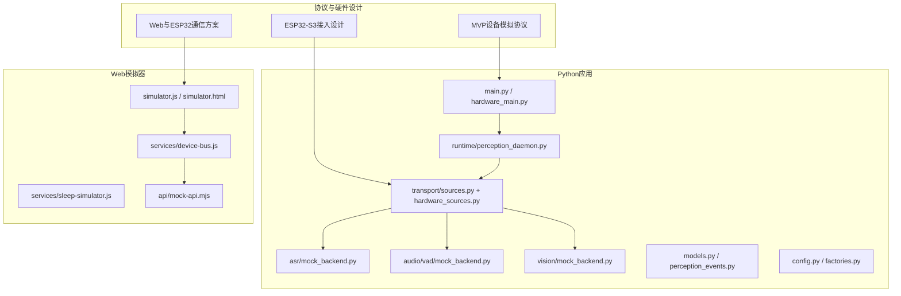
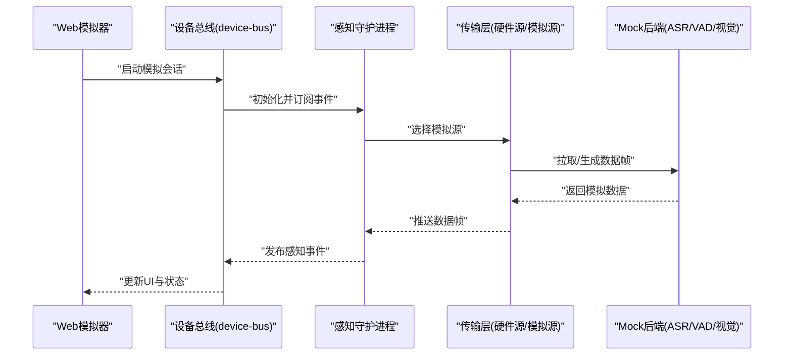
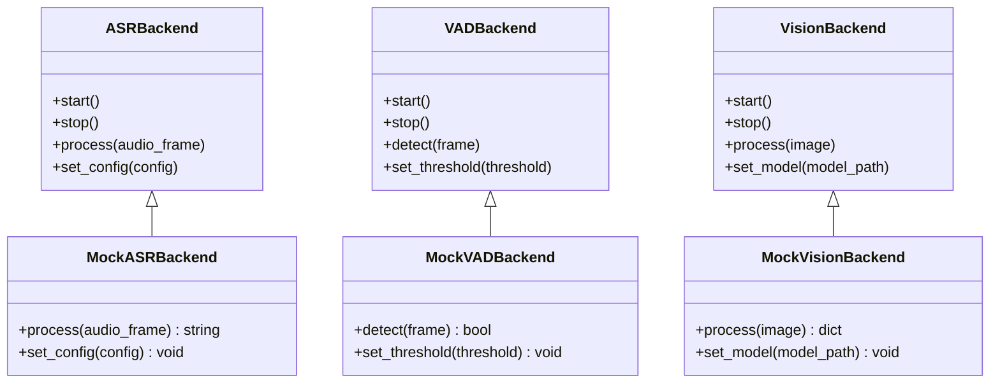
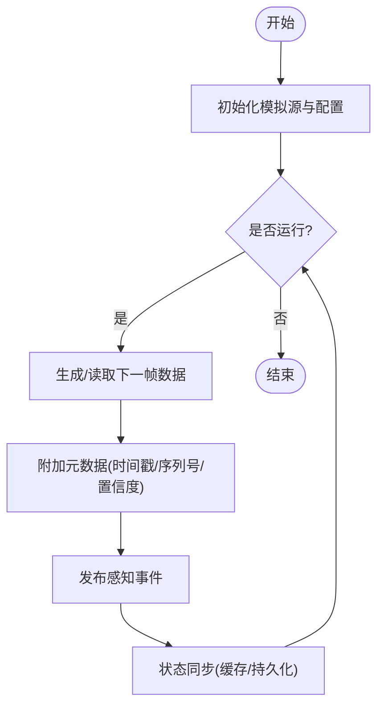
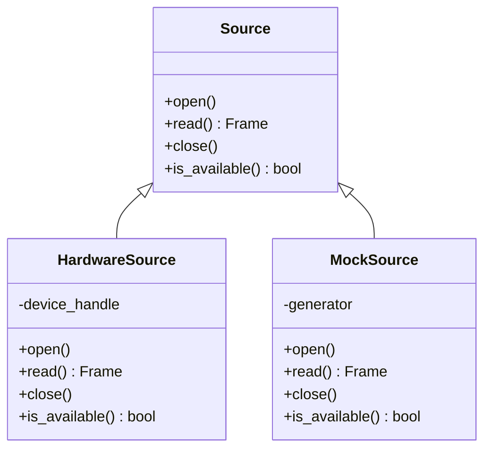
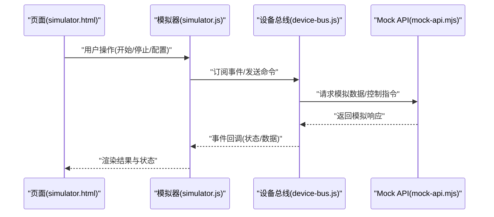
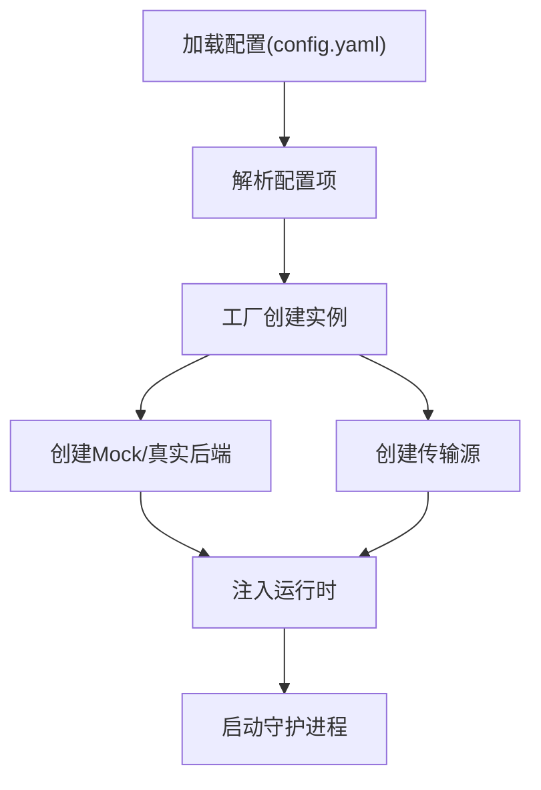
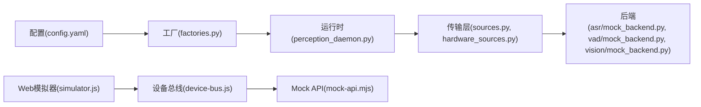

# 设备模拟系统

<cite>
**本文档引用的文件**   
- [MVP设备模拟协议.md](file://AI_Hardware_Community_Project/07_Hardware/MVP设备模拟协议.md)
- [ESP32-S3接入设计.md](file://AI_Hardware_Community_Project/07_Hardware/ESP32-S3接入设计.md)
- [Web与ESP32通信方案.md](file://AI_Hardware_Community_Project/07_Hardware/Web与ESP32通信方案.md)
- [app/main.py](file://app/main.py)
- [app/hardware_main.py](file://app/hardware_main.py)
- [app/config.py](file://app/config.py)
- [app/factories.py](file://app/factories.py)
- [app/models.py](file://app/models.py)
- [app/perception_events.py](file://app/perception_events.py)
- [app/runtime/perception_daemon.py](file://app/runtime/perception_daemon.py)
- [app/transport/sources.py](file://app/transport/sources.py)
- [app/transport/hardware_sources.py](file://app/transport/hardware_sources.py)
- [app/asr/mock_backend.py](file://app/asr/mock_backend.py)
- [app/audio/vad/mock_backend.py](file://app/audio/vad/mock_backend.py)
- [app/vision/mock_backend.py](file://app/vision/mock_backend.py)
- [apps/web/simulator.js](file://apps/web/simulator.js)
- [apps/web/simulator.html](file://apps/web/simulator.html)
- [apps/web/services/device-bus.js](file://apps/web/services/device-bus.js)
- [apps/web/services/sleep-simulator.js](file://apps/web/services/sleep-simulator.js)
- [apps/web/api/mock-api.mjs](file://apps/web/api/mock-api.mjs)
- [config.yaml](file://config.yaml)
- [tests/test_perception_runtime.py](file://tests/test_perception_runtime.py)
- [tests/test_vad_stream.py](file://tests/test_vad_stream.py)
</cite>

## 目录
1. [简介](#简介)
2. [项目结构](#项目结构)
3. [核心组件](#核心组件)
4. [架构总览](#架构总览)
5. [详细组件分析](#详细组件分析)
6. [依赖关系分析](#依赖关系分析)
7. [性能考量](#性能考量)
8. [故障排除指南](#故障排除指南)
9. [结论](#结论)
10. [附录](#附录)

## 简介
本文件面向“MVP设备模拟器”的系统设计与实现，目标是构建一套与真实硬件设备在API与行为上保持一致的虚拟设备模型。文档覆盖以下关键主题：
- 虚拟设备模型、数据生成算法与状态同步机制
- 与真实设备的兼容性设计（统一接口、一致语义）
- 模拟数据生成策略（随机数据、历史回放、场景模拟）
- 配置选项、参数调优与性能监控
- 单元测试与集成测试编写指南
- 常见问题排查方法

## 项目结构
仓库采用分层与按功能域组织的方式：
- 协议与硬件设计文档位于 AI_Hardware_Community_Project/07_Hardware，定义MVP设备模拟协议、ESP32接入与Web通信方案
- Python应用位于 app/，包含运行时、传输层、感知后端、事件总线等
- Web端模拟器位于 apps/web/，提供浏览器端的模拟与交互
- 配置与测试分别位于根目录 config.yaml 与 tests/

图表来源
- [MVP设备模拟协议.md](file://AI_Hardware_Community_Project/07_Hardware/MVP设备模拟协议.md)
- [ESP32-S3接入设计.md](file://AI_Hardware_Community_Project/07_Hardware/ESP32-S3接入设计.md)
- [Web与ESP32通信方案.md](file://AI_Hardware_Community_Project/07_Hardware/Web与ESP32通信方案.md)
- [app/main.py](file://app/main.py)
- [app/hardware_main.py](file://app/hardware_main.py)
- [app/runtime/perception_daemon.py](file://app/runtime/perception_daemon.py)
- [app/transport/sources.py](file://app/transport/sources.py)
- [app/transport/hardware_sources.py](file://app/transport/hardware_sources.py)
- [app/asr/mock_backend.py](file://app/asr/mock_backend.py)
- [app/audio/vad/mock_backend.py](file://app/audio/vad/mock_backend.py)
- [app/vision/mock_backend.py](file://app/vision/mock_backend.py)
- [apps/web/simulator.js](file://apps/web/simulator.js)
- [apps/web/simulator.html](file://apps/web/simulator.html)
- [apps/web/services/device-bus.js](file://apps/web/services/device-bus.js)
- [apps/web/services/sleep-simulator.js](file://apps/web/services/sleep-simulator.js)
- [apps/web/api/mock-api.mjs](file://apps/web/api/mock-api.mjs)

章节来源
- [MVP设备模拟协议.md](file://AI_Hardware_Community_Project/07_Hardware/MVP设备模拟协议.md)
- [ESP32-S3接入设计.md](file://AI_Hardware_Community_Project/07_Hardware/ESP32-S3接入设计.md)
- [Web与ESP32通信方案.md](file://AI_Hardware_Community_Project/07_Hardware/Web与ESP32通信方案.md)
- [app/main.py](file://app/main.py)
- [app/hardware_main.py](file://app/hardware_main.py)
- [app/config.py](file://app/config.py)
- [app/factories.py](file://app/factories.py)
- [app/models.py](file://app/models.py)
- [app/perception_events.py](file://app/perception_events.py)
- [app/runtime/perception_daemon.py](file://app/runtime/perception_daemon.py)
- [app/transport/sources.py](file://app/transport/sources.py)
- [app/transport/hardware_sources.py](file://app/transport/hardware_sources.py)
- [apps/web/simulator.js](file://apps/web/simulator.js)
- [apps/web/simulator.html](file://apps/web/simulator.html)
- [apps/web/services/device-bus.js](file://apps/web/services/device-bus.js)
- [apps/web/services/sleep-simulator.js](file://apps/web/services/sleep-simulator.js)
- [apps/web/api/mock-api.mjs](file://apps/web/api/mock-api.mjs)

## 核心组件
- 虚拟设备模型：通过统一的抽象接口描述设备能力（ASR、VAD、视觉处理等），并在Mock后端中实现一致的语义
- 数据生成算法：支持随机数据、历史回放与场景驱动的数据流，确保时序与噪声特性贴近真实设备
- 状态同步机制：基于事件总线与感知守护进程，将模拟状态与上层服务保持同步
- 传输层适配：抽象硬件源与模拟源，使调用方无需关心具体后端
- Web模拟器：提供浏览器端可视化与交互，用于端到端验证

章节来源
- [app/models.py](file://app/models.py)
- [app/perception_events.py](file://app/perception_events.py)
- [app/asr/mock_backend.py](file://app/asr/mock_backend.py)
- [app/audio/vad/mock_backend.py](file://app/audio/vad/mock_backend.py)
- [app/vision/mock_backend.py](file://app/vision/mock_backend.py)
- [app/transport/sources.py](file://app/transport/sources.py)
- [app/transport/hardware_sources.py](file://app/transport/hardware_sources.py)
- [apps/web/simulator.js](file://apps/web/simulator.js)

## 架构总览
整体架构围绕“协议—运行时—传输—后端—前端”五层展开：
- 协议层：定义MVP设备模拟协议，明确消息格式、生命周期与错误码
- 运行时：感知守护进程负责调度采集、处理与事件发布
- 传输层：抽象硬件源与模拟源，屏蔽差异
- 后端：ASR/VAD/视觉等Mock后端提供可插拔的模拟能力
- 前端：Web模拟器提供UI与交互，驱动模拟流程

图表来源
- [apps/web/simulator.js](file://apps/web/simulator.js)
- [apps/web/services/device-bus.js](file://apps/web/services/device-bus.js)
- [app/runtime/perception_daemon.py](file://app/runtime/perception_daemon.py)
- [app/transport/sources.py](file://app/transport/sources.py)
- [app/asr/mock_backend.py](file://app/asr/mock_backend.py)
- [app/audio/vad/mock_backend.py](file://app/audio/vad/mock_backend.py)
- [app/vision/mock_backend.py](file://app/vision/mock_backend.py)

## 详细组件分析

### 虚拟设备模型与Mock后端
- 抽象接口：为ASR、VAD、视觉等模块定义统一接口，便于替换真实或模拟实现
- Mock实现：提供随机数据、延迟注入、错误注入与回放能力
- 状态管理：维护设备状态（在线/离线、采样率、置信度阈值等），并通过事件上报

图表来源
- [app/asr/mock_backend.py](file://app/asr/mock_backend.py)
- [app/audio/vad/mock_backend.py](file://app/audio/vad/mock_backend.py)
- [app/vision/mock_backend.py](file://app/vision/mock_backend.py)

章节来源
- [app/asr/mock_backend.py](file://app/asr/mock_backend.py)
- [app/audio/vad/mock_backend.py](file://app/audio/vad/mock_backend.py)
- [app/vision/mock_backend.py](file://app/vision/mock_backend.py)
- [app/models.py](file://app/models.py)

### 数据生成算法与状态同步
- 数据生成：支持随机噪声、周期性波形、历史片段回放与场景脚本驱动
- 状态同步：守护进程以固定周期拉取数据，封装为事件并发布到事件总线；消费者订阅后更新状态
- 一致性保障：通过时间戳、序列号与重试策略保证顺序与可靠性

图表来源
- [app/runtime/perception_daemon.py](file://app/runtime/perception_daemon.py)
- [app/transport/sources.py](file://app/transport/sources.py)
- [app/perception_events.py](file://app/perception_events.py)

章节来源
- [app/runtime/perception_daemon.py](file://app/runtime/perception_daemon.py)
- [app/transport/sources.py](file://app/transport/sources.py)
- [app/perception_events.py](file://app/perception_events.py)

### 传输层与硬件兼容
- 抽象源：定义统一的Source接口，区分HardwareSource与MockSource
- 切换策略：根据配置动态选择真实硬件或模拟源，保证API一致
- 错误处理：网络抖动、IO异常与超时均有回退与告警

图表来源
- [app/transport/sources.py](file://app/transport/sources.py)
- [app/transport/hardware_sources.py](file://app/transport/hardware_sources.py)

章节来源
- [app/transport/sources.py](file://app/transport/sources.py)
- [app/transport/hardware_sources.py](file://app/transport/hardware_sources.py)

### Web模拟器与设备总线
- 设备总线：封装事件订阅/发布、重连与状态缓存
- 睡眠模拟：模拟设备休眠/唤醒，触发相应事件
- Mock API：提供REST接口供前端调用，返回模拟结果

图表来源
- [apps/web/simulator.html](file://apps/web/simulator.html)
- [apps/web/simulator.js](file://apps/web/simulator.js)
- [apps/web/services/device-bus.js](file://apps/web/services/device-bus.js)
- [apps/web/api/mock-api.mjs](file://apps/web/api/mock-api.mjs)

章节来源
- [apps/web/simulator.html](file://apps/web/simulator.html)
- [apps/web/simulator.js](file://apps/web/simulator.js)
- [apps/web/services/device-bus.js](file://apps/web/services/device-bus.js)
- [apps/web/api/mock-api.mjs](file://apps/web/api/mock-api.mjs)

### 配置与工厂
- 配置文件：集中管理模拟模式、数据源、阈值与日志级别
- 工厂类：根据配置创建对应的后端与传输源，支持热切换

图表来源
- [config.yaml](file://config.yaml)
- [app/config.py](file://app/config.py)
- [app/factories.py](file://app/factories.py)

章节来源
- [config.yaml](file://config.yaml)
- [app/config.py](file://app/config.py)
- [app/factories.py](file://app/factories.py)

## 依赖关系分析
- 模块耦合：运行时依赖传输层与后端；Web端依赖设备总线与Mock API
- 外部依赖：协议文档约束消息格式；硬件接入设计约束底层IO
- 循环依赖规避：通过抽象接口与工厂解耦

图表来源
- [config.yaml](file://config.yaml)
- [app/factories.py](file://app/factories.py)
- [app/runtime/perception_daemon.py](file://app/runtime/perception_daemon.py)
- [app/transport/sources.py](file://app/transport/sources.py)
- [app/transport/hardware_sources.py](file://app/transport/hardware_sources.py)
- [app/asr/mock_backend.py](file://app/asr/mock_backend.py)
- [app/audio/vad/mock_backend.py](file://app/audio/vad/mock_backend.py)
- [app/vision/mock_backend.py](file://app/vision/mock_backend.py)
- [apps/web/simulator.js](file://apps/web/simulator.js)
- [apps/web/services/device-bus.js](file://apps/web/services/device-bus.js)
- [apps/web/api/mock-api.mjs](file://apps/web/api/mock-api.mjs)

章节来源
- [app/factories.py](file://app/factories.py)
- [app/runtime/perception_daemon.py](file://app/runtime/perception_daemon.py)
- [app/transport/sources.py](file://app/transport/sources.py)
- [app/transport/hardware_sources.py](file://app/transport/hardware_sources.py)
- [apps/web/services/device-bus.js](file://apps/web/services/device-bus.js)
- [apps/web/api/mock-api.mjs](file://apps/web/api/mock-api.mjs)

## 性能考量
- 数据生成速率：合理设置帧率与批大小，避免阻塞主线程
- 内存占用：限制缓冲队列长度，及时释放中间帧
- 事件吞吐：使用异步发布/订阅，减少锁竞争
- 监控指标：记录延迟、丢帧率、CPU/内存占用与错误率
- 降级策略：当资源紧张时自动降低采样率或启用轻量模型

[本节为通用指导，不直接分析具体文件]

## 故障排除指南
- 连接失败：检查传输源可用性、端口与权限；查看日志中的错误码
- 数据不同步：确认时间戳与序列号连续性；检查事件总线订阅是否生效
- 模拟失真：调整噪声强度、回放片段与场景脚本参数
- 性能瓶颈：定位高CPU模块，优化批处理与I/O路径
- 前端无响应：检查Mock API可达性与跨域配置；确认设备总线重连逻辑

章节来源
- [app/transport/hardware_sources.py](file://app/transport/hardware_sources.py)
- [apps/web/api/mock-api.mjs](file://apps/web/api/mock-api.mjs)
- [apps/web/services/device-bus.js](file://apps/web/services/device-bus.js)

## 结论
本设备模拟系统通过清晰的协议定义、可插拔的后端与传输层抽象，以及完善的Web模拟器，实现了与真实设备一致的API与行为表现。借助灵活的模拟数据生成策略与状态同步机制，开发者可在无硬件环境下高效完成联调与验证。建议在生产部署前完善监控与告警，并持续优化数据生成与事件处理性能。

[本节为总结性内容，不直接分析具体文件]

## 附录

### 单元测试与集成测试编写指南
- 单元测试：针对各Mock后端与工具函数，断言输入输出与边界条件
- 集成测试：串联运行时、传输层与事件总线，验证端到端数据流
- 用例设计：覆盖正常路径、异常路径与性能回归
- 参考用例：参见现有测试文件结构与命名约定

章节来源
- [tests/test_perception_runtime.py](file://tests/test_perception_runtime.py)
- [tests/test_vad_stream.py](file://tests/test_vad_stream.py)

### 常见配置项说明
- 模拟模式：选择随机/回放/场景驱动
- 数据源：指定音频、视觉与传感器源
- 阈值与噪声：设置VAD阈值、噪声强度与置信度
- 日志级别：调试、信息、警告与错误
- 性能参数：帧率、批大小、缓冲长度

章节来源
- [config.yaml](file://config.yaml)
- [app/config.py](file://app/config.py)