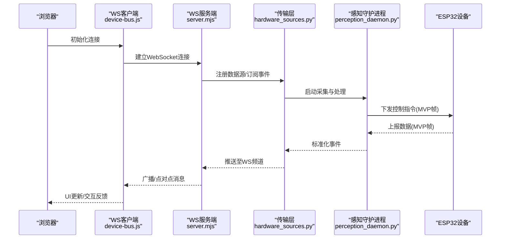
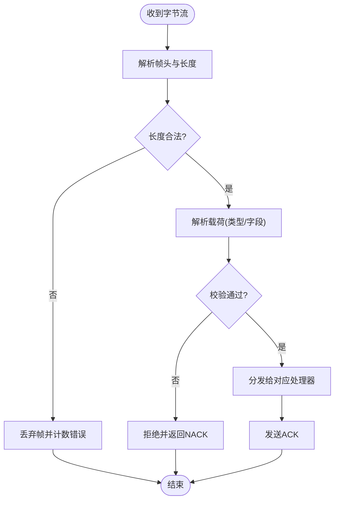
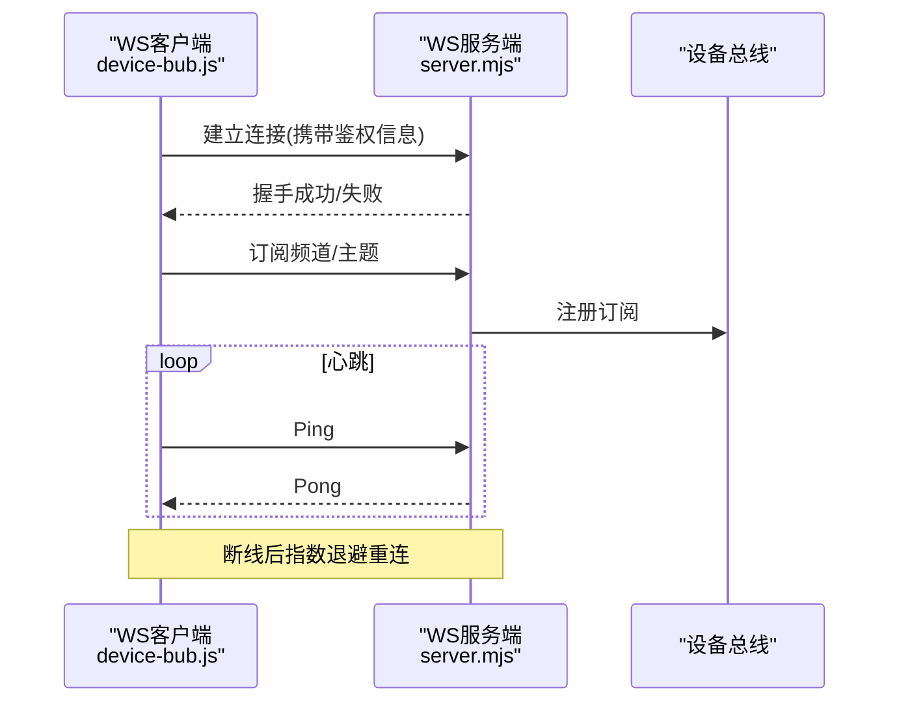
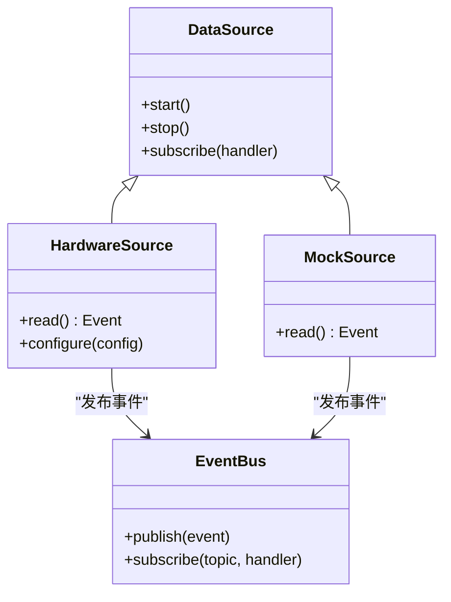
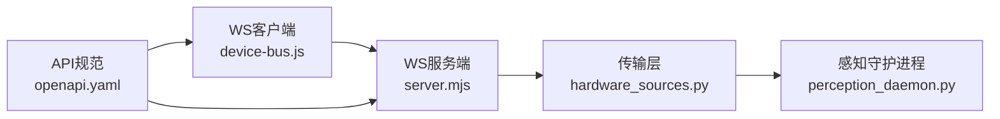

# 设备通信协议

<cite>
**本文引用的文件**   
- [MVP设备模拟协议.md](file://AI_Hardware_Community_Project/07_Hardware/MVP设备模拟协议.md)
- [Web与ESP32通信方案.md](file://AI_Hardware_Community_Project/07_Hardware/Web与ESP32通信方案.md)
- [ESP32-S3接入设计.md](file://AI_Hardware_Community_Project/07_Hardware/ESP32-S3接入设计.md)
- [device-bus.js](file://apps/web/services/device-bus.js)
- [simulator.js](file://apps/web/simulator.js)
- [server.mjs](file://apps/web/server.mjs)
- [hardware_sources.py](file://app/transport/hardware_sources.py)
- [sources.py](file://app/transport/sources.py)
- [perception_daemon.py](file://app/runtime/perception_daemon.py)
- [openapi.yaml](file://AI_Hardware_Community_Project/09_API/openapi.yaml)
</cite>

## 目录
1. [简介](#简介)
2. [项目结构](#项目结构)
3. [核心组件](#核心组件)
4. [架构总览](#架构总览)
5. [详细组件分析](#详细组件分析)
6. [依赖关系分析](#依赖关系分析)
7. [性能考虑](#性能考虑)
8. [故障排查指南](#故障排查指南)
9. [结论](#结论)
10. [附录](#附录)

## 简介
本文件面向“设备通信协议”的完整说明，聚焦于MVP设备模拟协议的帧格式、消息类型与数据编码方式；阐述Web端与ESP32之间的通信机制（WebSocket连接、数据传输协议、错误处理策略）；文档化消息序列化/反序列化的实现要点；提供协议版本兼容性与迁移指南；并给出网络延迟优化、数据包压缩与传输安全的实践建议。同时包含协议测试工具与调试方法的使用说明，帮助开发者快速定位问题并提升稳定性。

## 项目结构
本项目围绕硬件通信与Web交互展开，关键位置如下：
- 硬件协议与设计文档：位于 AI_Hardware_Community_Project/07_Hardware，包含MVP协议、ESP32接入设计与Web与ESP32通信方案。
- Web端服务与模拟器：位于 apps/web，包含前端应用、模拟器、WebSocket服务端与设备总线。
- Python运行时与传输层：位于 app/transport 与 app/runtime，负责设备数据源抽象、感知守护进程与事件分发。
- API规范：位于 AI_Hardware_Community_Project/09_API，定义对外接口契约。

```mermaid
graph TB
subgraph "Web端"
WUI["浏览器界面"]
WSClient["WebSocket客户端<br/>device-bus.js"]
Simulator["模拟器<br/>simulator.js"]
WSServer["WS服务端<br/>server.mjs"]
end
subgraph "Python运行时"
Daemon["感知守护进程<br/>perception_daemon.py"]
Transport["传输层<br/>hardware_sources.py / sources.py"]
end
subgraph "硬件"
ESP32["ESP32设备"]
end
WUI --> WSClient
WSClient < --> WSServer
Simulator --> WSServer
WSServer --> Transport
Transport --> Daemon
Daemon --> ESP32
```

图表来源 
- [device-bus.js](file://apps/web/services/device-bus.js)
- [simulator.js](file://apps/web/simulator.js)
- [server.mjs](file://apps/web/server.mjs)
- [hardware_sources.py](file://app/transport/hardware_sources.py)
- [sources.py](file://app/transport/sources.py)
- [perception_daemon.py](file://app/runtime/perception_daemon.py)

章节来源
- [MVP设备模拟协议.md](file://AI_Hardware_Community_Project/07_Hardware/MVP设备模拟协议.md)
- [Web与ESP32通信方案.md](file://AI_Hardware_Community_Project/07_Hardware/Web与ESP32通信方案.md)
- [ESP32-S3接入设计.md](file://AI_Hardware_Community_Project/07_Hardware/ESP32-S3接入设计.md)

## 核心组件
- MVP设备模拟协议：定义帧结构、消息类型与编码规则，作为Web与ESP32之间事实上的“最小可行协议”。
- WebSocket通道：Web端通过WS与服务端建立长连接，用于双向实时传输。
- 传输层抽象：将不同数据源（传感器、摄像头、音频等）统一为事件流，供上层消费。
- 感知守护进程：协调采集、处理与转发，保证低延迟与高吞吐。
- 模拟器：在缺少真实硬件时，模拟设备行为以驱动端到端联调。

章节来源
- [MVP设备模拟协议.md](file://AI_Hardware_Community_Project/07_Hardware/MVP设备模拟协议.md)
- [Web与ESP32通信方案.md](file://AI_Hardware_Community_Project/07_Hardware/Web与ESP32通信方案.md)
- [hardware_sources.py](file://app/transport/hardware_sources.py)
- [sources.py](file://app/transport/sources.py)
- [perception_daemon.py](file://app/runtime/perception_daemon.py)

## 架构总览
整体通信链路遵循“Web → WS服务端 → Python传输层 → 感知守护进程 → ESP32设备”，并在反向路径上回传事件与数据。



图表来源 
- [server.mjs](file://apps/web/server.mjs)
- [device-bus.js](file://apps/web/services/device-bus.js)
- [hardware_sources.py](file://app/transport/hardware_sources.py)
- [perception_daemon.py](file://app/runtime/perception_daemon.py)
- [MVP设备模拟协议.md](file://AI_Hardware_Community_Project/07_Hardware/MVP设备模拟协议.md)

## 详细组件分析

### MVP设备模拟协议
- 帧格式：采用固定头部+长度字段+载荷+校验的结构，便于解析与容错。
- 消息类型：包括设备状态、传感器读数、控制指令、媒体流元数据等。
- 数据编码：数值采用小端或大端约定，字符串使用UTF-8，二进制载荷按Base64或原始字节传输。
- 同步与确认：对关键指令采用ACK/NACK机制，保障可靠性。
- 错误码：定义通用错误码与扩展位，便于定位问题。



图表来源 
- [MVP设备模拟协议.md](file://AI_Hardware_Community_Project/07_Hardware/MVP设备模拟协议.md)

章节来源
- [MVP设备模拟协议.md](file://AI_Hardware_Community_Project/07_Hardware/MVP设备模拟协议.md)

### Web与ESP32通信机制（WebSocket）
- 连接建立：浏览器通过WS客户端发起连接，服务端鉴权与会话管理。
- 消息路由：基于频道/主题进行多路复用，支持点对点与广播。
- 心跳保活：定时Ping/Pong维持连接存活，异常自动重连。
- 背压与限流：服务端根据客户端能力与网络状况动态调整推送频率。
- 错误处理：断线重连、降级策略、错误上报与重试退避。



图表来源 
- [device-bus.js](file://apps/web/services/device-bus.js)
- [server.mjs](file://apps/web/server.mjs)

章节来源
- [Web与ESP32通信方案.md](file://AI_Hardware_Community_Project/07_Hardware/Web与ESP32通信方案.md)
- [device-bus.js](file://apps/web/services/device-bus.js)
- [server.mjs](file://apps/web/server.mjs)

### 传输层与数据源抽象
- 数据源接口：统一抽象传感器、摄像头、音频等输入，输出标准化事件。
- 适配器模式：针对不同硬件后端提供适配实现，屏蔽差异。
- 事件总线：内部解耦生产与消费，支持过滤、聚合与回放。
- 资源管理：生命周期管理、并发安全与内存回收。



图表来源 
- [hardware_sources.py](file://app/transport/hardware_sources.py)
- [sources.py](file://app/transport/sources.py)

章节来源
- [hardware_sources.py](file://app/transport/hardware_sources.py)
- [sources.py](file://app/transport/sources.py)

### 感知守护进程
- 职责：协调采集、处理、缓存与转发，确保低延迟与一致性。
- 调度：基于事件驱动的流水线，支持并行与批处理。
- 监控：指标收集、健康检查与告警。
- 容错：异常隔离、重试与熔断。

章节来源
- [perception_daemon.py](file://app/runtime/perception_daemon.py)

### 模拟器
- 作用：在无真实硬件情况下模拟设备行为，生成可控的数据流。
- 能力：可配置参数、随机噪声注入、时序控制与回放。
- 集成：通过WS与服务端对接，参与端到端测试。

章节来源
- [simulator.js](file://apps/web/simulator.js)

## 依赖关系分析
- Web端依赖WS客户端库与服务端API契约。
- 服务端依赖传输层与事件总线。
- 传输层依赖具体硬件后端与守护进程。
- 外部依赖：OpenAPI规范约束API边界，便于前后端协同。



图表来源 
- [device-bus.js](file://apps/web/services/device-bus.js)
- [server.mjs](file://apps/web/server.mjs)
- [hardware_sources.py](file://app/transport/hardware_sources.py)
- [perception_daemon.py](file://app/runtime/perception_daemon.py)
- [openapi.yaml](file://AI_Hardware_Community_Project/09_API/openapi.yaml)

章节来源
- [openapi.yaml](file://AI_Hardware_Community_Project/09_API/openapi.yaml)

## 性能考虑
- 网络延迟优化
  - 合理设置心跳间隔与超时阈值，避免频繁重连。
  - 使用批量推送与合并上报，减少小包开销。
  - 针对移动端与弱网环境启用自适应码率与降采样。
- 数据包压缩
  - 文本类消息使用JSON并开启gzip/deflate压缩。
  - 二进制载荷按需压缩，权衡CPU与带宽。
- 传输安全
  - 使用WSS加密传输，证书管理与轮换。
  - 鉴权与会话管理，防重放攻击。
  - 敏感字段脱敏与最小权限原则。

[本节为通用指导，不直接分析具体文件]

## 故障排查指南
- 常见问题
  - 连接不稳定：检查心跳、防火墙与代理配置。
  - 消息丢失：核对帧校验、ACK/NACK与重传策略。
  - 性能瓶颈：观察CPU/内存占用、队列积压与GC停顿。
- 调试方法
  - 启用详细日志与追踪ID，关联上下游调用链。
  - 使用模拟器复现问题，逐步缩小范围。
  - 抓包分析WS流量，验证帧结构与编码。
- 恢复策略
  - 自动重连与指数退避。
  - 降级到只读模式或静态数据。
  - 快速回滚与热修复流程。

章节来源
- [Web与ESP32通信方案.md](file://AI_Hardware_Community_Project/07_Hardware/Web与ESP32通信方案.md)
- [MVP设备模拟协议.md](file://AI_Hardware_Community_Project/07_Hardware/MVP设备模拟协议.md)

## 结论
本协议以MVP为核心，结合WebSocket与传输层抽象，构建了从Web到ESP32的稳定通信链路。通过明确的帧格式、消息类型与编码规则，配合完善的错误处理与性能优化策略，能够满足早期产品迭代与联调需求。后续可在安全性、压缩与可扩展性方面持续演进。

[本节为总结性内容，不直接分析具体文件]

## 附录
- 协议版本兼容性
  - 版本号嵌入帧头，支持向前/向后兼容策略。
  - 废弃字段标记与过渡期双写。
- 迁移指南
  - 增量升级：先部署服务端与传输层，再升级设备固件。
  - 灰度发布：按设备分组逐步切换。
  - 回滚预案：保留旧版本解析器与路由。
- 测试工具与调试
  - 使用模拟器构造场景用例，覆盖正常与异常路径。
  - 编写自动化测试脚本，验证帧解析与业务逻辑。
  - 在线调试面板：查看消息流、指标与日志。

章节来源
- [MVP设备模拟协议.md](file://AI_Hardware_Community_Project/07_Hardware/MVP设备模拟协议.md)
- [Web与ESP32通信方案.md](file://AI_Hardware_Community_Project/07_Hardware/Web与ESP32通信方案.md)
- [simulator.js](file://apps/web/simulator.js)