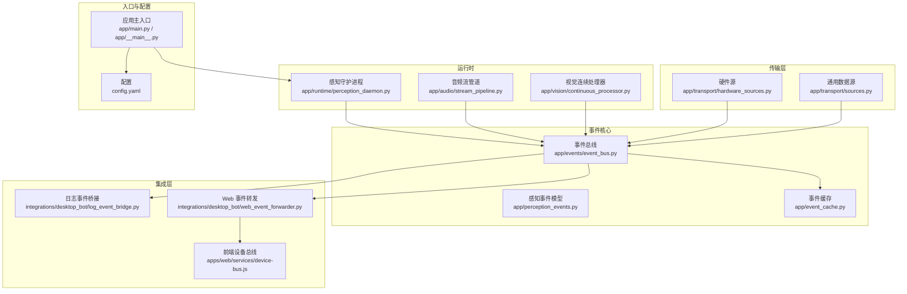
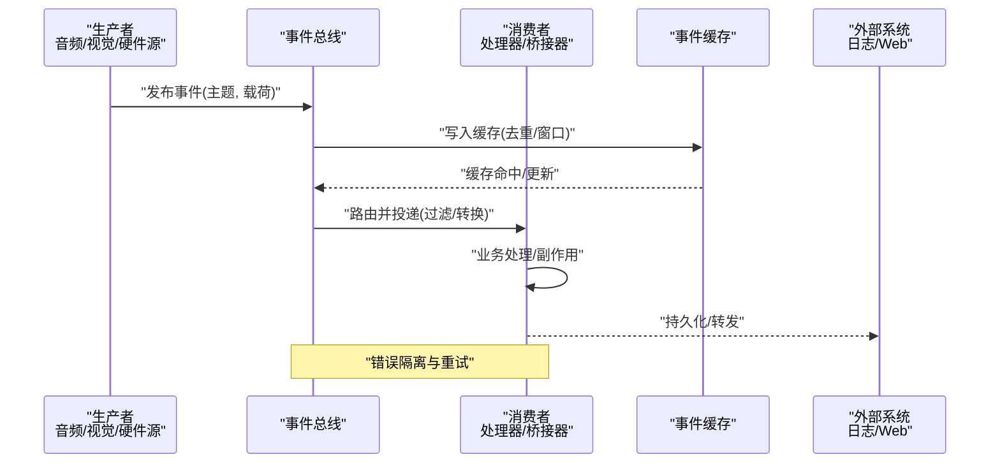
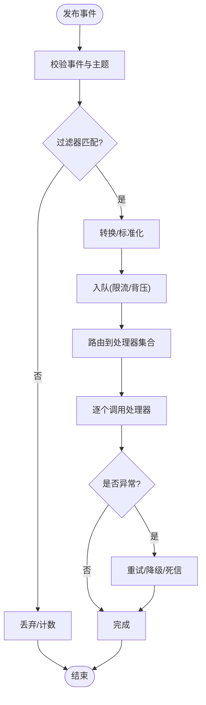
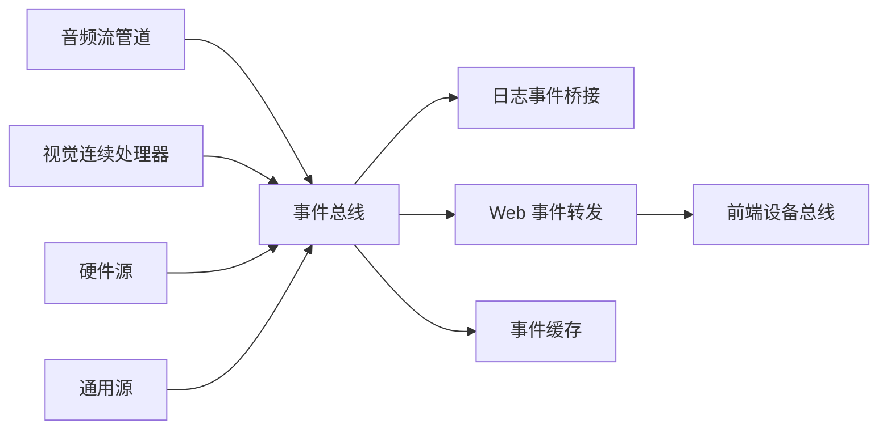

# 事件驱动架构

<cite>
**本文引用的文件**   
- [event_bus.py](file://app/events/event_bus.py)
- [perception_events.py](file://app/perception_events.py)
- [event_cache.py](file://app/event_cache.py)
- [perception_daemon.py](file://app/runtime/perception_daemon.py)
- [stream_pipeline.py](file://app/audio/stream_pipeline.py)
- [continuous_processor.py](file://app/vision/continuous_processor.py)
- [hardware_sources.py](file://app/transport/hardware_sources.py)
- [sources.py](file://app/transport/sources.py)
- [log_event_bridge.py](file://integrations/desktop_bot/log_event_bridge.py)
- [web_event_forwarder.py](file://integrations/desktop_bot/web_event_forwarder.py)
- [device-bus.js](file://apps/web/services/device-bus.js)
- [main.py](file://app/main.py)
- [__main__.py](file://app/__main__.py)
- [config.yaml](file://config.yaml)
</cite>

## 目录
1. [引言](#引言)
2. [项目结构](#项目结构)
3. [核心组件](#核心组件)
4. [架构总览](#架构总览)
5. [详细组件分析](#详细组件分析)
6. [依赖关系分析](#依赖关系分析)
7. [性能考虑](#性能考虑)
8. [故障排查指南](#故障排查指南)
9. [结论](#结论)
10. [附录](#附录)

## 引言
本文件围绕事件驱动架构展开，系统性阐述事件总线（Event Bus）的实现原理、消息路由机制与订阅发布模式；定义感知事件的语义与生命周期；给出缓存策略与持久化方案；解释跨进程事件通信、事件过滤与转换机制；说明事件处理器的注册方式、错误处理模式与性能调优建议；并提供事件调试工具与监控指标的集成方法。文档面向不同技术背景的读者，既提供高层概览，也包含代码级分析与图示。

## 项目结构
本项目采用按功能域组织的事件驱动架构：
- 事件核心：事件总线、事件模型、事件缓存
- 运行时：感知守护进程、音视频流管道、视觉连续处理器
- 传输层：硬件源与通用数据源
- 集成层：桌面端日志桥接、Web 事件转发、前端设备总线
- 入口与配置：应用主入口、配置文件

图表来源
- [event_bus.py](file://app/events/event_bus.py)
- [perception_events.py](file://app/perception_events.py)
- [event_cache.py](file://app/event_cache.py)
- [perception_daemon.py](file://app/runtime/perception_daemon.py)
- [stream_pipeline.py](file://app/audio/stream_pipeline.py)
- [continuous_processor.py](file://app/vision/continuous_processor.py)
- [hardware_sources.py](file://app/transport/hardware_sources.py)
- [sources.py](file://app/transport/sources.py)
- [log_event_bridge.py](file://integrations/desktop_bot/log_event_bridge.py)
- [web_event_forwarder.py](file://integrations/desktop_bot/web_event_forwarder.py)
- [device-bus.js](file://apps/web/services/device-bus.js)
- [main.py](file://app/main.py)
- [__main__.py](file://app/__main__.py)
- [config.yaml](file://config.yaml)

章节来源
- [main.py](file://app/main.py)
- [__main__.py](file://app/__main__.py)
- [config.yaml](file://config.yaml)

## 核心组件
- 事件总线（Event Bus）
  - 职责：统一事件分发、订阅管理、路由与过滤、背压与限流、错误隔离与重试
  - 关键能力：按主题订阅、通配符匹配、优先级队列、异步处理、幂等投递
- 感知事件模型（Perception Events）
  - 职责：定义事件类型、字段规范、版本兼容、序列化格式
  - 关键能力：强类型约束、校验规则、扩展字段兼容
- 事件缓存（Event Cache）
  - 职责：短期缓存最近事件、去重、窗口聚合、过期清理
  - 关键能力：LRU/TTL、内存上限、快照导出
- 运行时守护进程（Perception Daemon）
  - 职责：启动/协调各子系统、生命周期管理、健康检查、优雅关闭
- 数据源与处理器
  - 音频流管道：VAD、关键词识别、ASR 后端接入
  - 视觉连续处理器：图像加载、手势稳定、MediaPipe/Mock 后端
  - 硬件源与通用源：设备采集、模拟数据注入

章节来源
- [event_bus.py](file://app/events/event_bus.py)
- [perception_events.py](file://app/perception_events.py)
- [event_cache.py](file://app/event_cache.py)
- [perception_daemon.py](file://app/runtime/perception_daemon.py)
- [stream_pipeline.py](file://app/audio/stream_pipeline.py)
- [continuous_processor.py](file://app/vision/continuous_processor.py)
- [hardware_sources.py](file://app/transport/hardware_sources.py)
- [sources.py](file://app/transport/sources.py)

## 架构总览
事件驱动架构以“事件总线”为中心，生产者将感知结果、控制指令、系统状态等封装为事件并投递到总线；消费者通过订阅主题接收事件并进行处理。跨进程场景通过日志桥接与 Web 转发实现解耦。

图表来源
- [event_bus.py](file://app/events/event_bus.py)
- [event_cache.py](file://app/event_cache.py)
- [log_event_bridge.py](file://integrations/desktop_bot/log_event_bridge.py)
- [web_event_forwarder.py](file://integrations/desktop_bot/web_event_forwarder.py)

## 详细组件分析

### 事件总线（Event Bus）
- 设计要点
  - 订阅-发布：支持精确主题与通配符匹配，允许优先级与多消费者
  - 路由与过滤：基于事件字段或元数据进行过滤与转换
  - 背压与限流：队列容量限制、丢弃策略、退避重试
  - 错误隔离：每个处理器异常不影响其他处理器，记录上下文
  - 可观测性：指标上报（吞吐、延迟、失败率）、追踪ID
- 典型流程
  - 注册处理器：绑定主题与回调
  - 发布事件：入队、过滤、转换、投递
  - 消费处理：顺序或并行执行，失败重试与死信队列
  - 缓存与持久化：短期缓存、批量落盘、断点续传

图表来源
- [event_bus.py](file://app/events/event_bus.py)

章节来源
- [event_bus.py](file://app/events/event_bus.py)

### 感知事件模型（Perception Events）
- 事件类型
  - 语音相关：VAD 检测、关键词命中、ASR 文本
  - 视觉相关：人脸/手势检测、图像帧、稳定性指标
  - 控制相关：设备动作、权限变更、系统状态
- 字段规范
  - 必需字段：事件类型、时间戳、来源、负载
  - 可选字段：上下文、追踪ID、版本、签名
- 版本兼容
  - 向后兼容的扩展字段
  - 弃用字段标记与迁移策略

章节来源
- [perception_events.py](file://app/perception_events.py)

### 事件缓存（Event Cache）
- 策略
  - 短期缓存：最近 N 条事件、TTL 过期
  - 去重：基于事件键（如类型+内容指纹）
  - 窗口聚合：滑动窗口统计、阈值触发
- 存储
  - 内存为主，必要时落盘快照
  - 容量上限与淘汰策略（LRU/LFU）

章节来源
- [event_cache.py](file://app/event_cache.py)

### 运行时守护进程（Perception Daemon）
- 职责
  - 初始化事件总线、缓存、数据源与处理器
  - 启动/停止生命周期管理
  - 健康检查与优雅关闭
- 协调
  - 按依赖顺序启动子系统
  - 监控资源使用与告警

章节来源
- [perception_daemon.py](file://app/runtime/perception_daemon.py)

### 音频流管道（Stream Pipeline）
- 模块
  - VAD 后端（Silero/Mock）
  - 关键词识别
  - ASR 后端（Faster-Whisper/Mock）
- 事件流
  - 音频帧 -> VAD 检测 -> 关键词匹配 -> ASR 文本 -> 发布语音事件

章节来源
- [stream_pipeline.py](file://app/audio/stream_pipeline.py)
- [base.py](file://app/asr/base.py)
- [faster_whisper_backend.py](file://app/asr/faster_whisper_backend.py)
- [mock_backend.py](file://app/asr/mock_backend.py)
- [base.py](file://app/audio/vad/base.py)
- [silero_backend.py](file://app/audio/vad/silero_backend.py)
- [mock_backend.py](file://app/audio/vad/mock_backend.py)

### 视觉连续处理器（Continuous Processor）
- 模块
  - 图像加载、手势稳定、MediaPipe/Mock 后端
- 事件流
  - 图像帧 -> 预处理 -> 特征提取 -> 手势/姿态判定 -> 发布视觉事件

章节来源
- [continuous_processor.py](file://app/vision/continuous_processor.py)
- [image_loader.py](file://app/vision/image_loader.py)
- [gesture_stabilizer.py](file://app/vision/gesture_stabilizer.py)
- [mediapipe_gesture.py](file://app/vision/mediapipe_gesture.py)
- [mock_backend.py](file://app/vision/mock_backend.py)

### 传输层（硬件源与通用源）
- 硬件源
  - 设备采集、协议适配、采样率/分辨率对齐
- 通用源
  - 模拟数据注入、回放、测试桩

章节来源
- [hardware_sources.py](file://app/transport/hardware_sources.py)
- [sources.py](file://app/transport/sources.py)

### 跨进程事件通信（日志桥接与 Web 转发）
- 日志事件桥接
  - 将本地事件写入结构化日志，供外部采集
- Web 事件转发
  - 通过 HTTP/WebSocket 推送至前端设备总线
- 前端设备总线
  - 订阅/发布、重连、去抖、合并

章节来源
- [log_event_bridge.py](file://integrations/desktop_bot/log_event_bridge.py)
- [web_event_forwarder.py](file://integrations/desktop_bot/web_event_forwarder.py)
- [device-bus.js](file://apps/web/services/device-bus.js)

## 依赖关系分析
- 松耦合
  - 数据源与处理器通过事件总线解耦，便于替换与扩展
- 内聚性
  - 各子系统内部职责清晰，事件边界明确
- 外部依赖
  - ASR/VAD/视觉后端可插拔，Mock 用于测试
  - 前端通过 Web 转发与设备总线交互

图表来源
- [stream_pipeline.py](file://app/audio/stream_pipeline.py)
- [continuous_processor.py](file://app/vision/continuous_processor.py)
- [hardware_sources.py](file://app/transport/hardware_sources.py)
- [sources.py](file://app/transport/sources.py)
- [event_bus.py](file://app/events/event_bus.py)
- [log_event_bridge.py](file://integrations/desktop_bot/log_event_bridge.py)
- [web_event_forwarder.py](file://integrations/desktop_bot/web_event_forwarder.py)
- [device-bus.js](file://apps/web/services/device-bus.js)
- [event_cache.py](file://app/event_cache.py)

章节来源
- [event_bus.py](file://app/events/event_bus.py)
- [perception_events.py](file://app/perception_events.py)
- [event_cache.py](file://app/event_cache.py)

## 性能考虑
- 事件总线
  - 队列长度与批处理：合理设置容量与批次大小，降低上下文切换
  - 并发策略：处理器并行度与背压控制，避免阻塞上游
  - 过滤与转换：在入队前进行轻量过滤，减少无效处理
- 缓存
  - TTL 与窗口大小：根据业务峰值调整，避免内存溢出
  - 去重键设计：平衡准确性与计算开销
- I/O 与后端
  - ASR/VAD/视觉后端异步化，超时与重试策略
  - 网络转发批量发送与压缩
- 可观测性
  - 指标：吞吐、延迟、失败率、队列深度、缓存命中率
  - 追踪：事件 ID 贯穿全链路，定位瓶颈

[本节为通用指导，不直接分析具体文件]

## 故障排查指南
- 常见问题
  - 事件丢失：检查队列容量、丢弃策略、重试与死信队列
  - 处理器异常：查看隔离与重试逻辑，确认错误上下文
  - 跨进程通信失败：检查日志桥接与 Web 转发连接状态
  - 缓存膨胀：监控内存占用，调整 TTL 与容量上限
- 诊断步骤
  - 启用详细日志与追踪ID
  - 观察指标面板（吞吐、延迟、失败率）
  - 回放事件序列，复现场景
  - 逐步禁用处理器定位问题

章节来源
- [event_bus.py](file://app/events/event_bus.py)
- [log_event_bridge.py](file://integrations/desktop_bot/log_event_bridge.py)
- [web_event_forwarder.py](file://integrations/desktop_bot/web_event_forwarder.py)
- [event_cache.py](file://app/event_cache.py)

## 结论
本事件驱动架构以事件总线为核心，结合感知事件模型、缓存与运行时守护进程，实现了高内聚、低耦合的模块化设计。通过跨进程桥接与前端设备总线，达成端到端的解耦通信。建议在部署中强化可观测性与性能调优，确保系统在复杂环境下稳定运行。

[本节为总结性内容，不直接分析具体文件]

## 附录
- 事件生命周期
  - 创建 -> 校验 -> 过滤 -> 转换 -> 入队 -> 路由 -> 处理 -> 持久化/转发 -> 归档
- 处理器注册方式
  - 按主题订阅、优先级设置、条件过滤、转换器链
- 错误处理模式
  - 重试、退避、降级、死信队列、补偿事务
- 监控指标
  - 事件吞吐、平均/分位延迟、失败率、队列深度、缓存命中率、处理器耗时分布

[本节为概念性内容，不直接分析具体文件]