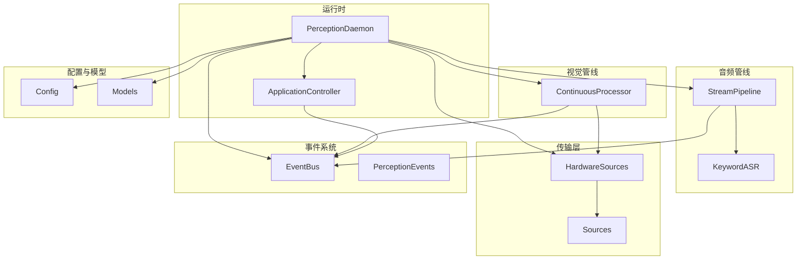
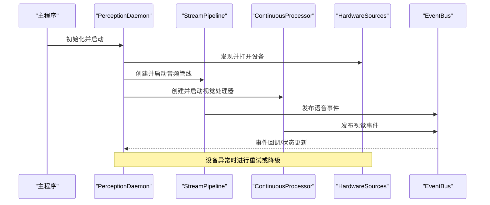
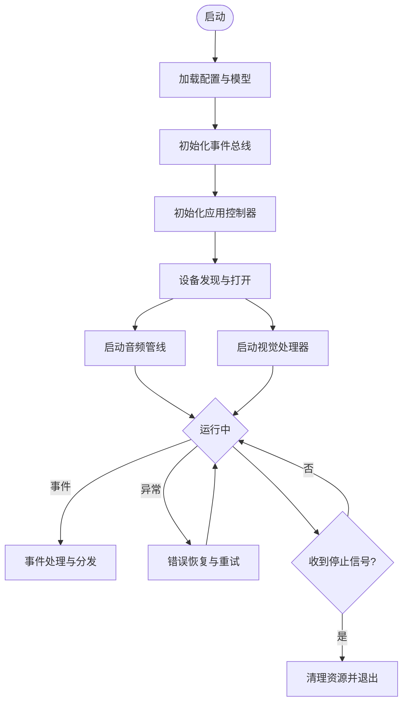
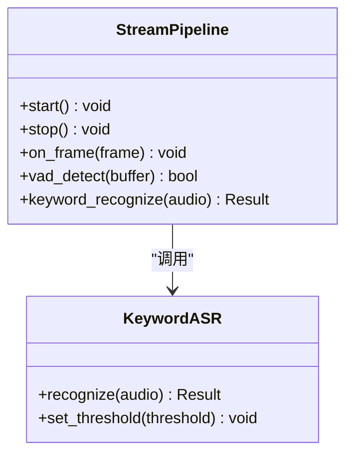
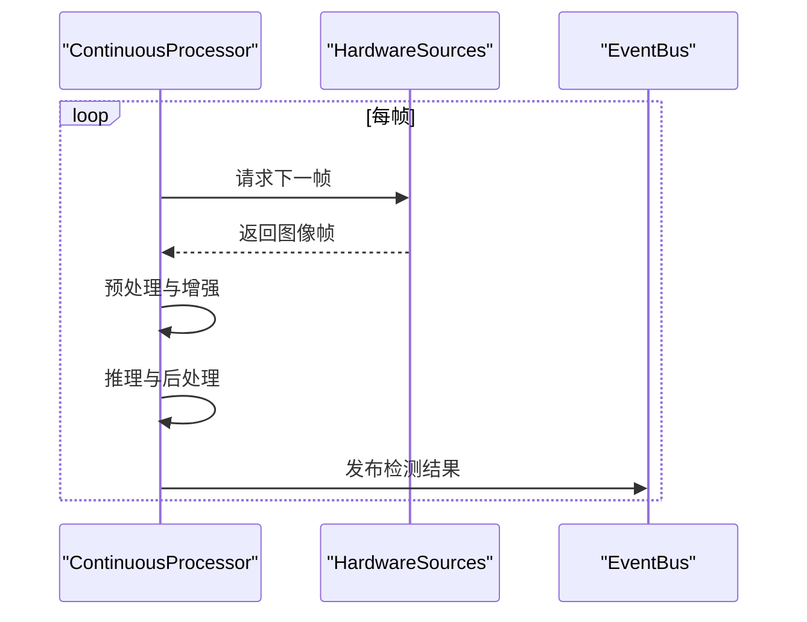
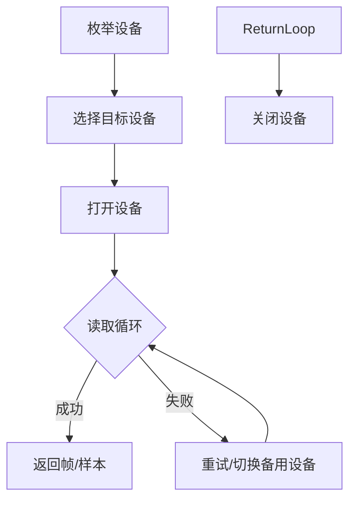
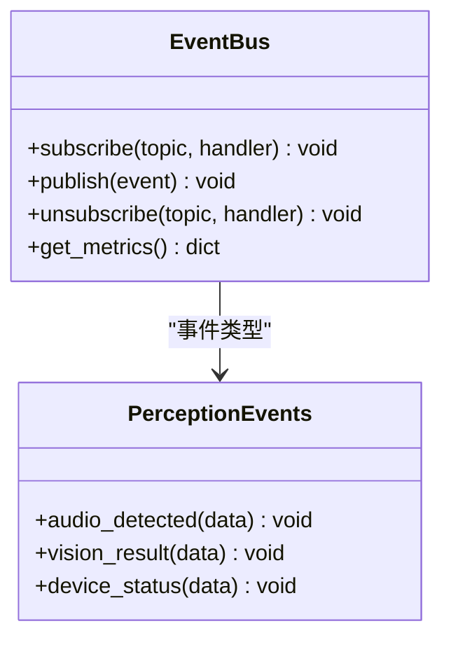
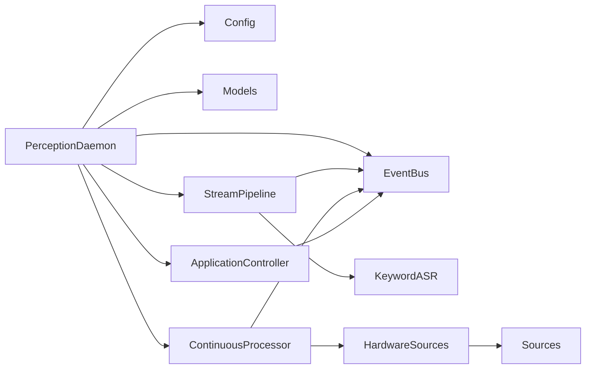

# 感知运行时架构

<cite>
**本文引用的文件**   
- [perception_daemon.py](file://app/runtime/perception_daemon.py)
- [__main__.py](file://app/__main__.py)
- [main.py](file://app/main.py)
- [config.py](file://app/config.py)
- [factories.py](file://app/factories.py)
- [event_bus.py](file://app/events/event_bus.py)
- [stream_pipeline.py](file://app/audio/stream_pipeline.py)
- [keyword_asr.py](file://app/audio/keyword_asr.py)
- [continuous_processor.py](file://app/vision/continuous_processor.py)
- [hardware_sources.py](file://app/transport/hardware_sources.py)
- [sources.py](file://app/transport/sources.py)
- [perception_events.py](file://app/perception_events.py)
- [application_controller.py](file://app/control/application_controller.py)
- [models.py](file://app/models.py)
- [app-pipeline.md](file://docs/app-pipeline.md)
- [perception-runtime.md](file://docs/perception-runtime.md)
</cite>

## 目录
1. [简介](#简介)
2. [项目结构](#项目结构)
3. [核心组件](#核心组件)
4. [架构总览](#架构总览)
5. [详细组件分析](#详细组件分析)
6. [依赖关系分析](#依赖关系分析)
7. [性能考量](#性能考量)
8. [故障排查指南](#故障排查指南)
9. [结论](#结论)
10. [附录](#附录)

## 简介
本文件面向“感知运行时”（Perception Runtime）的架构与实现，重点阐述 Perception Daemon 的设计原理、生命周期管理、资源调度机制，以及运行时环境初始化流程、模块加载策略、错误处理与恢复机制。文档还涵盖进程间通信模式、内存管理与性能优化策略，提供运行时配置选项、监控指标与调试工具使用方法，并解释与硬件抽象层的交互方式和设备发现机制。目标是帮助开发者快速理解并扩展该运行时系统。

## 项目结构
感知运行时位于 app 目录下，采用按功能域划分的模块化组织：
- runtime：守护进程入口与生命周期编排
- audio：语音采集、VAD、关键词识别与流式处理
- vision：视觉连续处理、手势识别与图像加载
- transport：硬件源抽象与数据源适配
- events：事件总线与跨模块通信
- control：应用控制器与外部控制接口
- config：配置加载与校验
- models：数据结构定义
- docs：运行时与流水线设计文档

图表来源
- [perception_daemon.py:1-200](file://app/runtime/perception_daemon.py#L1-L200)
- [application_controller.py:1-150](file://app/control/application_controller.py#L1-L150)
- [stream_pipeline.py:1-200](file://app/audio/stream_pipeline.py#L1-L200)
- [continuous_processor.py:1-200](file://app/vision/continuous_processor.py#L1-L200)
- [hardware_sources.py:1-150](file://app/transport/hardware_sources.py#L1-L150)
- [sources.py:1-150](file://app/transport/sources.py#L1-L150)
- [event_bus.py:1-150](file://app/events/event_bus.py#L1-L150)
- [perception_events.py:1-100](file://app/perception_events.py#L1-L100)
- [config.py:1-150](file://app/config.py#L1-L150)
- [models.py:1-150](file://app/models.py#L1-L150)

章节来源
- [perception_daemon.py:1-200](file://app/runtime/perception_daemon.py#L1-L200)
- [app-pipeline.md:1-200](file://docs/app-pipeline.md#L1-L200)
- [perception-runtime.md:1-200](file://docs/perception-runtime.md#L1-L200)

## 核心组件
- PerceptionDaemon：运行时守护进程，负责启动、协调各子系统、生命周期管理与资源调度。
- StreamPipeline：音频流式处理管道，包含采集、VAD、关键词识别等阶段。
- ContinuousProcessor：视觉连续处理器，持续消费图像帧并进行检测/识别。
- HardwareSources：硬件抽象层，封装设备发现、打开、读取与关闭。
- EventBus：进程内事件总线，用于模块间解耦通信。
- ApplicationController：应用控制器，对外暴露控制接口与状态管理。
- Config：配置加载与校验，支持多来源合并与环境变量覆盖。
- Models：统一的数据结构与消息类型定义。

章节来源
- [perception_daemon.py:1-200](file://app/runtime/perception_daemon.py#L1-L200)
- [stream_pipeline.py:1-200](file://app/audio/stream_pipeline.py#L1-L200)
- [continuous_processor.py:1-200](file://app/vision/continuous_processor.py#L1-L200)
- [hardware_sources.py:1-150](file://app/transport/hardware_sources.py#L1-L150)
- [event_bus.py:1-150](file://app/events/event_bus.py#L1-L150)
- [application_controller.py:1-150](file://app/control/application_controller.py#L1-L150)
- [config.py:1-150](file://app/config.py#L1-L150)
- [models.py:1-150](file://app/models.py#L1-L150)

## 架构总览
感知运行时以守护进程为中心，通过事件总线与异步管线驱动音频与视觉处理。硬件抽象层屏蔽具体设备差异，提供统一的设备发现与访问接口。配置与模型在启动时加载，为各模块提供参数与数据结构。

图表来源
- [perception_daemon.py:1-200](file://app/runtime/perception_daemon.py#L1-L200)
- [stream_pipeline.py:1-200](file://app/audio/stream_pipeline.py#L1-L200)
- [continuous_processor.py:1-200](file://app/vision/continuous_processor.py#L1-L200)
- [hardware_sources.py:1-150](file://app/transport/hardware_sources.py#L1-L150)
- [event_bus.py:1-150](file://app/events/event_bus.py#L1-L150)

## 详细组件分析

### PerceptionDaemon：守护进程与生命周期管理
- 职责：
  - 加载配置与模型
  - 初始化事件总线与应用控制器
  - 启动音频与视觉管线
  - 处理设备生命周期与错误恢复
  - 提供健康检查与监控指标
- 关键流程：
  - 启动阶段：解析配置、验证依赖、初始化子系统
  - 运行阶段：监听事件、调度任务、维护资源池
  - 关闭阶段：优雅停止管线、释放设备、持久化状态

图表来源
- [perception_daemon.py:1-200](file://app/runtime/perception_daemon.py#L1-L200)

章节来源
- [perception_daemon.py:1-200](file://app/runtime/perception_daemon.py#L1-L200)

### StreamPipeline：音频流式处理
- 职责：
  - 从硬件源获取音频帧
  - VAD 检测语音活动
  - 关键词识别与触发
  - 将结果通过事件总线发布
- 关键特性：
  - 背压与缓冲控制，避免阻塞
  - 可插拔后端（如 Silero、Mock）
  - 错误隔离与自动重连

图表来源
- [stream_pipeline.py:1-200](file://app/audio/stream_pipeline.py#L1-L200)
- [keyword_asr.py:1-150](file://app/audio/keyword_asr.py#L1-L150)

章节来源
- [stream_pipeline.py:1-200](file://app/audio/stream_pipeline.py#L1-L200)
- [keyword_asr.py:1-150](file://app/audio/keyword_asr.py#L1-L150)

### ContinuousProcessor：视觉连续处理
- 职责：
  - 持续消费图像帧
  - 执行手势识别与稳定化处理
  - 发布检测结果与中间状态
- 关键特性：
  - 帧率自适应与丢帧策略
  - 批处理与并行推理
  - 与硬件源解耦

图表来源
- [continuous_processor.py:1-200](file://app/vision/continuous_processor.py#L1-L200)
- [hardware_sources.py:1-150](file://app/transport/hardware_sources.py#L1-L150)
- [event_bus.py:1-150](file://app/events/event_bus.py#L1-L150)

章节来源
- [continuous_processor.py:1-200](file://app/vision/continuous_processor.py#L1-L200)

### HardwareSources：硬件抽象与设备发现
- 职责：
  - 枚举可用设备（摄像头、麦克风等）
  - 打开设备并建立数据通道
  - 提供统一的读取接口与错误码
- 关键特性：
  - 设备热插拔支持
  - 失败重试与降级策略
  - 资源占用统计

图表来源
- [hardware_sources.py:1-150](file://app/transport/hardware_sources.py#L1-L150)
- [sources.py:1-150](file://app/transport/sources.py#L1-L150)

章节来源
- [hardware_sources.py:1-150](file://app/transport/hardware_sources.py#L1-L150)
- [sources.py:1-150](file://app/transport/sources.py#L1-L150)

### EventBus：事件总线与进程内通信
- 职责：
  - 订阅/发布事件
  - 事件路由与过滤
  - 保证顺序性与幂等性
- 关键特性：
  - 线程安全队列
  - 死信队列与重试
  - 监控指标上报

图表来源
- [event_bus.py:1-150](file://app/events/event_bus.py#L1-L150)
- [perception_events.py:1-100](file://app/perception_events.py#L1-L100)

章节来源
- [event_bus.py:1-150](file://app/events/event_bus.py#L1-L150)
- [perception_events.py:1-100](file://app/perception_events.py#L1-L100)

### ApplicationController：应用控制器
- 职责：
  - 对外暴露控制接口（启动/停止/查询状态）
  - 管理子系统生命周期
  - 聚合监控指标与健康检查
- 关键特性：
  - 权限与鉴权（可选）
  - 配置热更新（可选）
  - 日志与审计

章节来源
- [application_controller.py:1-150](file://app/control/application_controller.py#L1-L150)

### Config：配置加载与校验
- 职责：
  - 加载 YAML/环境变量/默认值
  - 校验必填字段与取值范围
  - 提供只读配置视图
- 关键特性：
  - 多来源合并优先级
  - 动态重载（可选）
  - 敏感信息脱敏

章节来源
- [config.py:1-150](file://app/config.py#L1-L150)

### Models：数据结构定义
- 职责：
  - 统一定义事件、帧、检测结果等数据结构
  - 提供序列化/反序列化工具
- 关键特性：
  - 类型提示与校验
  - 向后兼容字段

章节来源
- [models.py:1-150](file://app/models.py#L1-L150)

## 依赖关系分析
感知运行时各模块之间通过事件总线与抽象接口解耦，降低耦合度并提升可测试性。

图表来源
- [perception_daemon.py:1-200](file://app/runtime/perception_daemon.py#L1-L200)
- [stream_pipeline.py:1-200](file://app/audio/stream_pipeline.py#L1-L200)
- [continuous_processor.py:1-200](file://app/vision/continuous_processor.py#L1-L200)
- [hardware_sources.py:1-150](file://app/transport/hardware_sources.py#L1-L150)
- [sources.py:1-150](file://app/transport/sources.py#L1-L150)
- [event_bus.py:1-150](file://app/events/event_bus.py#L1-L150)
- [application_controller.py:1-150](file://app/control/application_controller.py#L1-L150)
- [config.py:1-150](file://app/config.py#L1-L150)
- [models.py:1-150](file://app/models.py#L1-L150)

章节来源
- [perception_daemon.py:1-200](file://app/runtime/perception_daemon.py#L1-L200)
- [event_bus.py:1-150](file://app/events/event_bus.py#L1-L150)

## 性能考量
- 背压与缓冲：音频与视觉管线使用有界队列与丢弃策略，防止内存膨胀。
- 批处理与并行：视觉推理采用批处理与多线程/进程并行，提高吞吐。
- 帧率自适应：根据负载动态调整采样率与推理频率。
- 资源池化：设备句柄与模型权重复用，减少重复初始化开销。
- 零拷贝：尽量使用共享内存或内存映射，降低拷贝成本。
- 监控指标：CPU/内存/GPU利用率、延迟分布、丢帧率、错误率等。

[本节为通用指导，不直接分析具体文件]

## 故障排查指南
- 常见问题：
  - 设备无法打开：检查权限、路径、驱动；查看设备枚举日志。
  - 音频无输入：确认采样率、声道数、VAD阈值；回放测试。
  - 视觉推理卡顿：降低分辨率、帧率或模型复杂度；检查GPU占用。
  - 事件丢失：检查事件队列长度与消费者速度；启用死信队列。
- 诊断步骤：
  - 启用详细日志与指标导出
  - 使用模拟源替换真实设备定位问题
  - 逐步禁用模块隔离故障点
- 恢复策略：
  - 自动重试与回退到备用设备
  - 健康检查与自愈重启
  - 配置热更新与动态降级

章节来源
- [perception_daemon.py:1-200](file://app/runtime/perception_daemon.py#L1-L200)
- [hardware_sources.py:1-150](file://app/transport/hardware_sources.py#L1-L150)
- [event_bus.py:1-150](file://app/events/event_bus.py#L1-L150)

## 结论
感知运行时以守护进程为核心，结合事件总线与异步管线，实现了高内聚、低耦合的模块化架构。通过硬件抽象层屏蔽设备差异，提升了系统的可移植性与稳定性。合理的资源调度、错误恢复与监控指标，保障了系统在复杂环境下的可靠运行。建议在生产环境中启用完整的监控与日志体系，并结合业务需求定制模块与策略。

[本节为总结，不直接分析具体文件]

## 附录
- 启动入口：
  - 主程序入口与命令行参数解析
  - 守护进程启动与后台运行
- 配置示例：
  - 设备参数、模型路径、事件主题
  - 性能调优参数与阈值
- 监控与调试：
  - 指标导出格式与采集间隔
  - 日志级别与输出位置
  - 常用调试命令与脚本

章节来源
- [__main__.py:1-150](file://app/__main__.py#L1-L150)
- [main.py:1-150](file://app/main.py#L1-L150)
- [config.py:1-150](file://app/config.py#L1-L150)
- [app-pipeline.md:1-200](file://docs/app-pipeline.md#L1-L200)
- [perception-runtime.md:1-200](file://docs/perception-runtime.md#L1-L200)