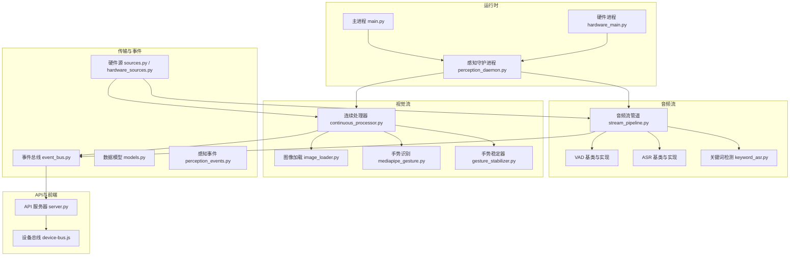
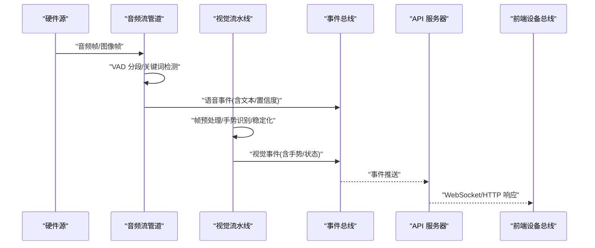
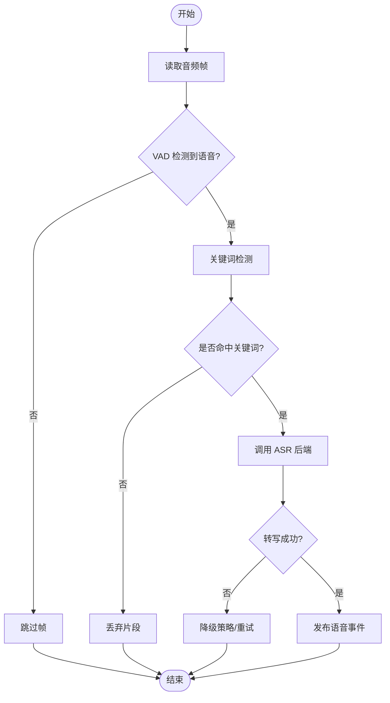
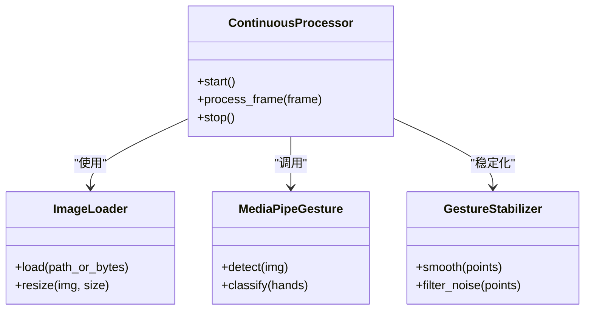
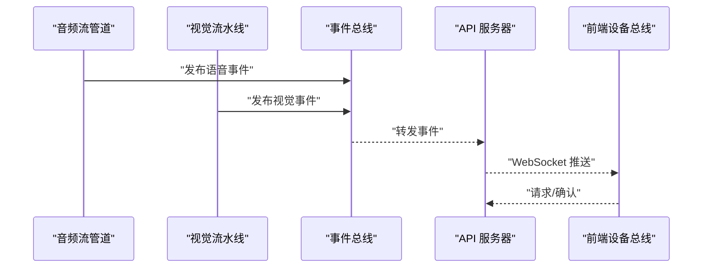
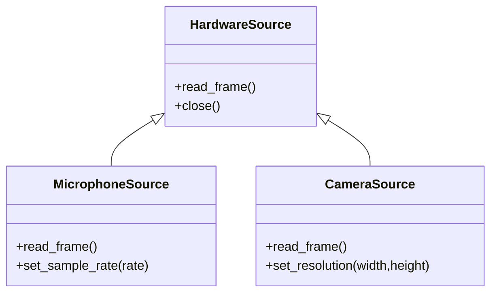
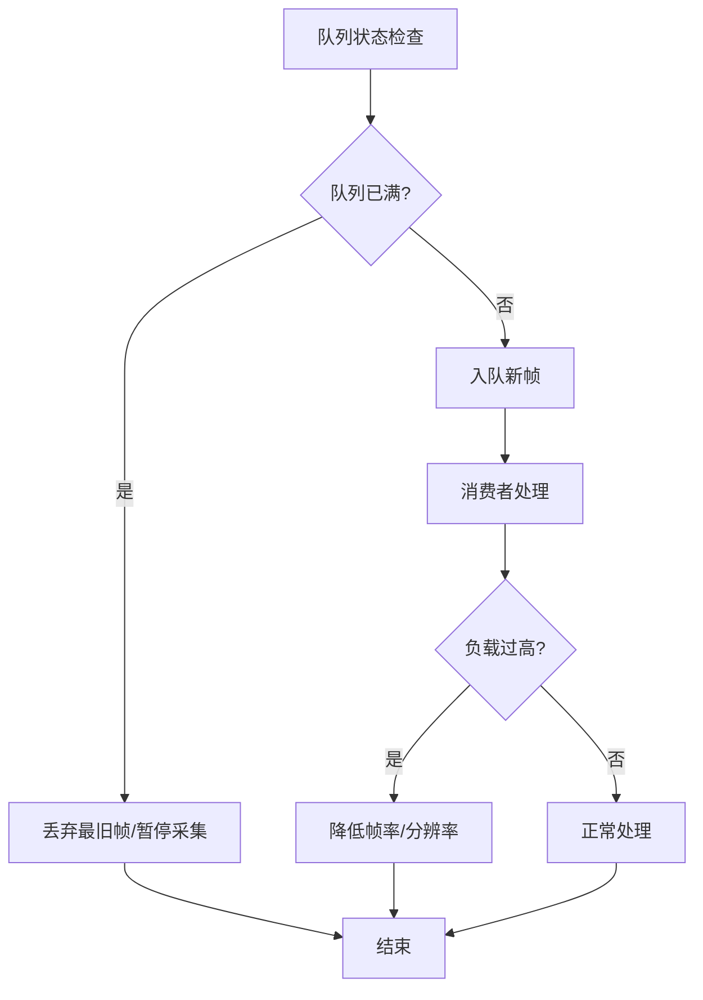
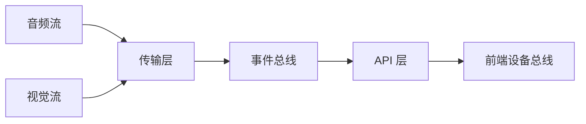

# 数据流架构

<cite>
**本文引用的文件**   
- [app/main.py](file://app/main.py)
- [app/hardware_main.py](file://app/hardware_main.py)
- [app/config.py](file://app/config.py)
- [app/factories.py](file://app/factories.py)
- [app/runtime/perception_daemon.py](file://app/runtime/perception_daemon.py)
- [app/audio/stream_pipeline.py](file://app/audio/stream_pipeline.py)
- [app/audio/keyword_asr.py](file://app/audio/keyword_asr.py)
- [app/asr/base.py](file://app/asr/base.py)
- [app/asr/faster_whisper_backend.py](file://app/asr/faster_whisper_backend.py)
- [app/asr/mock_backend.py](file://app/asr/mock_backend.py)
- [app/audio/vad/base.py](file://app/audio/vad/base.py)
- [app/audio/vad/silero_backend.py](file://app/audio/vad/silero_backend.py)
- [app/audio/vad/mock_backend.py](file://app/audio/vad/mock_backend.py)
- [app/transport/sources.py](file://app/transport/sources.py)
- [app/transport/hardware_sources.py](file://app/transport/hardware_sources.py)
- [app/vision/continuous_processor.py](file://app/vision/continuous_processor.py)
- [app/vision/image_loader.py](file://app/vision/image_loader.py)
- [app/vision/mediapipe_gesture.py](file://app/vision/mediapipe_gesture.py)
- [app/vision/gesture_stabilizer.py](file://app/vision/gesture_stabilizer.py)
- [app/vision/mock_backend.py](file://app/vision/mock_backend.py)
- [app/events/event_bus.py](file://app/events/event_bus.py)
- [app/models.py](file://app/models.py)
- [app/perception_events.py](file://app/perception_events.py)
- [app/api/server.py](file://app/api/server.py)
- [apps/web/services/device-bus.js](file://apps/web/services/device-bus.js)
- [scripts/receive_microphone.py](file://scripts/receive_microphone.py)
- [scripts/receive_images.py](file://scripts/receive_images.py)
- [scripts/vision_live.py](file://scripts/vision_live.py)
- [config.yaml](file://config.yaml)
</cite>

## 目录
1. [简介](#简介)
2. [项目结构](#项目结构)
3. [核心组件](#核心组件)
4. [架构总览](#架构总览)
5. [详细组件分析](#详细组件分析)
6. [依赖关系分析](#依赖关系分析)
7. [性能考量](#性能考量)
8. [故障排查指南](#故障排查指南)
9. [结论](#结论)
10. [附录](#附录)（如有需要）

## 简介
本文件面向“数据流架构”的综合文档，聚焦音频与视频流处理管道、数据传输协议、缓冲区与背压机制、硬件数据源抽象、网络传输层、数据序列化格式、流质量控制、错误恢复与性能监控，并提供调试工具、流量分析与优化建议。内容基于仓库中的 Python 应用与前端 Web 服务进行梳理，兼顾工程实践与可维护性。

## 项目结构
整体采用分层模块化设计：
- 运行时与入口：主进程与硬件进程分离，统一由感知守护进程协调。
- 音频子系统：VAD、关键词检测、ASR 后端抽象与实现。
- 视觉子系统：连续帧处理、手势识别、图像加载与稳定化。
- 传输层：硬件源抽象与具体实现，事件总线用于跨模块通信。
- API 与前端：REST/WebSocket 接口与设备总线交互。
- 配置与模型：集中式配置与数据模型定义。

**图表来源** 
- [app/main.py](file://app/main.py)
- [app/hardware_main.py](file://app/hardware_main.py)
- [app/runtime/perception_daemon.py](file://app/runtime/perception_daemon.py)
- [app/audio/stream_pipeline.py](file://app/audio/stream_pipeline.py)
- [app/vision/continuous_processor.py](file://app/vision/continuous_processor.py)
- [app/transport/sources.py](file://app/transport/sources.py)
- [app/transport/hardware_sources.py](file://app/transport/hardware_sources.py)
- [app/events/event_bus.py](file://app/events/event_bus.py)
- [app/api/server.py](file://app/api/server.py)
- [apps/web/services/device-bus.js](file://apps/web/services/device-bus.js)

**章节来源**
- [app/main.py](file://app/main.py)
- [app/hardware_main.py](file://app/hardware_main.py)
- [app/runtime/perception_daemon.py](file://app/runtime/perception_daemon.py)

## 核心组件
- 音频流管道：负责采集、VAD 分段、关键词检测、ASR 转写与结果分发。
- 视觉流水线：负责连续帧读取、预处理、手势识别与稳定化输出。
- 传输层：封装硬件数据源（麦克风、摄像头），提供统一的读取接口。
- 事件总线：解耦生产者与消费者，支持异步消息传递与订阅发布。
- API 层：对外暴露 REST/WebSocket 接口，供前端或外部系统消费。
- 配置与模型：集中管理运行参数与数据结构定义。

**章节来源**
- [app/audio/stream_pipeline.py](file://app/audio/stream_pipeline.py)
- [app/vision/continuous_processor.py](file://app/vision/continuous_processor.py)
- [app/transport/sources.py](file://app/transport/sources.py)
- [app/transport/hardware_sources.py](file://app/transport/hardware_sources.py)
- [app/events/event_bus.py](file://app/events/event_bus.py)
- [app/api/server.py](file://app/api/server.py)
- [app/config.py](file://app/config.py)
- [app/models.py](file://app/models.py)

## 架构总览
数据流从硬件源进入，经音频/视觉子系统进行实时处理，通过事件总线分发到下游消费者（如 API、前端、日志）。守护进程统一管理生命周期与资源调度，确保背压与缓冲控制。

**图表来源** 
- [app/audio/stream_pipeline.py](file://app/audio/stream_pipeline.py)
- [app/vision/continuous_processor.py](file://app/vision/continuous_processor.py)
- [app/events/event_bus.py](file://app/events/event_bus.py)
- [app/api/server.py](file://app/api/server.py)
- [apps/web/services/device-bus.js](file://apps/web/services/device-bus.js)

## 详细组件分析

### 音频流处理管道
- 功能职责：采集音频帧、VAD 静音检测、关键词触发、ASR 转写、结果聚合与事件发布。
- 关键流程：
  - 输入：来自硬件源的音频帧。
  - 处理：VAD 切分有效片段；关键词检测过滤噪声；ASR 后端转写为文本。
  - 输出：结构化语音事件（文本、置信度、时间戳等）发布至事件总线。
- 背压与缓冲：
  - 使用队列缓冲音频帧，限制最大长度避免内存膨胀。
  - 当消费者处理慢时，生产者应丢弃旧帧或降采样，保证低延迟。
- 错误恢复：
  - VAD/ASR 失败时回退到默认策略（如短超时重试、降级为关键词模式）。
  - 异常捕获并上报事件，便于监控与诊断。

**图表来源** 
- [app/audio/stream_pipeline.py](file://app/audio/stream_pipeline.py)
- [app/audio/vad/base.py](file://app/audio/vad/base.py)
- [app/audio/vad/silero_backend.py](file://app/audio/vad/silero_backend.py)
- [app/asr/base.py](file://app/asr/base.py)
- [app/asr/faster_whisper_backend.py](file://app/asr/faster_whisper_backend.py)

**章节来源**
- [app/audio/stream_pipeline.py](file://app/audio/stream_pipeline.py)
- [app/audio/vad/base.py](file://app/audio/vad/base.py)
- [app/audio/vad/silero_backend.py](file://app/audio/vad/silero_backend.py)
- [app/asr/base.py](file://app/asr/base.py)
- [app/asr/faster_whisper_backend.py](file://app/asr/faster_whisper_backend.py)
- [app/asr/mock_backend.py](file://app/asr/mock_backend.py)

### 视觉流处理流水线
- 功能职责：连续帧读取、图像预处理、手势识别、稳定化输出与事件发布。
- 关键流程：
  - 输入：来自硬件源的图像帧。
  - 处理：图像加载与缩放；手势识别模型推理；稳定化算法平滑抖动。
  - 输出：结构化视觉事件（手势类型、置信度、坐标等）发布至事件总线。
- 背压与缓冲：
  - 帧队列限长，结合丢帧策略维持实时性。
  - 对高开销推理步骤进行批处理或降频。
- 错误恢复：
  - 模型加载失败时回退到轻量级规则或 Mock 后端。
  - 解码失败时跳过帧并记录统计。

**图表来源** 
- [app/vision/continuous_processor.py](file://app/vision/continuous_processor.py)
- [app/vision/image_loader.py](file://app/vision/image_loader.py)
- [app/vision/mediapipe_gesture.py](file://app/vision/mediapipe_gesture.py)
- [app/vision/gesture_stabilizer.py](file://app/vision/gesture_stabilizer.py)

**章节来源**
- [app/vision/continuous_processor.py](file://app/vision/continuous_processor.py)
- [app/vision/image_loader.py](file://app/vision/image_loader.py)
- [app/vision/mediapipe_gesture.py](file://app/vision/mediapipe_gesture.py)
- [app/vision/gesture_stabilizer.py](file://app/vision/gesture_stabilizer.py)
- [app/vision/mock_backend.py](file://app/vision/mock_backend.py)

### 数据传输协议与网络层
- 协议选择：
  - 内部事件：事件总线基于内存队列与回调，适合进程内通信。
  - 外部传输：API 层提供 REST/WebSocket 接口，前端通过设备总线订阅。
- 数据序列化：
  - 事件对象遵循统一模型（时间戳、类型、载荷），便于前后端一致解析。
- 可靠性：
  - 连接断开重连、消息去重、顺序保证（必要时序列号）。
- 安全：
  - 鉴权与访问控制（可选），敏感字段脱敏。

**图表来源** 
- [app/events/event_bus.py](file://app/events/event_bus.py)
- [app/api/server.py](file://app/api/server.py)
- [apps/web/services/device-bus.js](file://apps/web/services/device-bus.js)

**章节来源**
- [app/events/event_bus.py](file://app/events/event_bus.py)
- [app/api/server.py](file://app/api/server.py)
- [apps/web/services/device-bus.js](file://apps/web/services/device-bus.js)
- [app/models.py](file://app/models.py)
- [app/perception_events.py](file://app/perception_events.py)

### 硬件数据源抽象
- 抽象设计：
  - 统一接口定义读取方法（音频帧、图像帧），屏蔽底层差异。
- 具体实现：
  - 麦克风与摄像头驱动封装，支持多设备枚举与选择。
- 错误处理：
  - 设备不可用时的回退策略（Mock 源、本地文件回放）。
- 性能优化：
  - 零拷贝缓冲、批量读取、线程池管理。

**图表来源** 
- [app/transport/sources.py](file://app/transport/sources.py)
- [app/transport/hardware_sources.py](file://app/transport/hardware_sources.py)

**章节来源**
- [app/transport/sources.py](file://app/transport/sources.py)
- [app/transport/hardware_sources.py](file://app/transport/hardware_sources.py)

### 流质量控制与背压机制
- 背压策略：
  - 生产者-消费者队列设置上限，满队时丢弃最旧帧或暂停采集。
  - 动态调整采样率与分辨率以匹配处理能力。
- 质量指标：
  - 端到端延迟、丢帧率、CPU/GPU 占用、模型推理耗时。
- 自适应控制：
  - 根据负载自动切换高质量/低质量路径（如降低帧率、简化模型）。

[此图为概念流程图，不直接映射具体源码]

### 错误恢复与监控
- 错误分类：
  - 硬件异常（设备断开）、模型异常（推理失败）、网络异常（连接中断）。
- 恢复策略：
  - 重试与回退（Mock 后端、本地缓存）、熔断与降级。
- 监控指标：
  - 事件吞吐、错误率、延迟分布、资源使用率。
- 诊断工具：
  - 日志分级、事件追踪、性能剖析脚本。

**章节来源**
- [app/runtime/perception_daemon.py](file://app/runtime/perception_daemon.py)
- [app/events/event_bus.py](file://app/events/event_bus.py)

## 依赖关系分析
- 模块耦合：
  - 音频/视觉子系统依赖传输层与事件总线，API 层依赖事件总线。
- 外部依赖：
  - ASR/VAD/手势识别模型库，媒体采集库，Web 框架。
- 潜在循环依赖：
  - 通过事件总线解耦，避免直接导入造成的循环。

**图表来源** 
- [app/audio/stream_pipeline.py](file://app/audio/stream_pipeline.py)
- [app/vision/continuous_processor.py](file://app/vision/continuous_processor.py)
- [app/transport/sources.py](file://app/transport/sources.py)
- [app/events/event_bus.py](file://app/events/event_bus.py)
- [app/api/server.py](file://app/api/server.py)
- [apps/web/services/device-bus.js](file://apps/web/services/device-bus.js)

**章节来源**
- [app/audio/stream_pipeline.py](file://app/audio/stream_pipeline.py)
- [app/vision/continuous_processor.py](file://app/vision/continuous_processor.py)
- [app/transport/sources.py](file://app/transport/sources.py)
- [app/events/event_bus.py](file://app/events/event_bus.py)
- [app/api/server.py](file://app/api/server.py)
- [apps/web/services/device-bus.js](file://apps/web/services/device-bus.js)

## 性能考量
- 计算密集型任务（ASR、手势识别）应使用异步与批处理，减少上下文切换。
- 内存管理：避免大对象长期驻留，及时释放帧缓冲。
- I/O 优化：批量读取、零拷贝、合理线程池大小。
- 模型优化：量化、剪枝、GPU 加速（如可用）。
- 监控与调优：引入性能剖析与告警，持续跟踪瓶颈。

[本节为通用指导，无需特定文件引用]

## 故障排查指南
- 常见问题：
  - 音频无输入：检查设备权限与采样率配置。
  - 视频卡顿：降低分辨率或帧率，检查 GPU/CPU 占用。
  - 事件丢失：查看事件总线队列长度与消费者处理速度。
- 诊断步骤：
  - 启用详细日志，定位异常堆栈。
  - 使用脚本模拟输入（麦克风/图像）验证链路。
  - 前端设备总线监听消息，确认网络传输。

**章节来源**
- [scripts/receive_microphone.py](file://scripts/receive_microphone.py)
- [scripts/receive_images.py](file://scripts/receive_images.py)
- [scripts/vision_live.py](file://scripts/vision_live.py)
- [app/events/event_bus.py](file://app/events/event_bus.py)

## 结论
本数据流架构通过分层设计与事件驱动，实现了音频与视频流的实时处理与可靠传输。背压与缓冲策略保障了系统稳定性，错误恢复与监控提升了鲁棒性。未来可进一步优化模型性能与网络传输效率，增强自适应控制能力。

[本节为总结，无需特定文件引用]

## 附录
- 配置项说明：
  - 音频采样率、VAD 阈值、ASR 后端选择。
  - 视频分辨率、帧率、模型路径。
  - 事件总线队列大小、API 端口与鉴权。
- 调试工具：
  - 本地回放脚本、可视化界面、性能剖析报告。

**章节来源**
- [config.yaml](file://config.yaml)
- [app/config.py](file://app/config.py)
- [scripts/receive_microphone.py](file://scripts/receive_microphone.py)
- [scripts/receive_images.py](file://scripts/receive_images.py)
- [scripts/vision_live.py](file://scripts/vision_live.py)