# 模块化组件设计

<cite>
**本文引用的文件**   
- [app/factories.py](file://app/factories.py)
- [app/config.py](file://app/config.py)
- [app/main.py](file://app/main.py)
- [app/hardware_main.py](file://app/hardware_main.py)
- [app/control/application_controller.py](file://app/control/application_controller.py)
- [app/runtime/perception_daemon.py](file://app/runtime/perception_daemon.py)
- [app/events/event_bus.py](file://app/events/event_bus.py)
- [app/asr/base.py](file://app/asr/base.py)
- [app/asr/faster_whisper_backend.py](file://app/asr/faster_whisper_backend.py)
- [app/asr/mock_backend.py](file://app/asr/mock_backend.py)
- [app/audio/stream_pipeline.py](file://app/audio/stream_pipeline.py)
- [app/audio/keyword_asr.py](file://app/audio/keyword_asr.py)
- [app/vision/base.py](file://app/vision/base.py)
- [app/vision/continuous_processor.py](file://app/vision/continuous_processor.py)
- [app/vision/mediapipe_gesture.py](file://app/vision/mediapipe_gesture.py)
- [app/vision/mock_backend.py](file://app/vision/mock_backend.py)
- [app/transport/sources.py](file://app/transport/sources.py)
- [app/transport/hardware_sources.py](file://app/transport/hardware_sources.py)
- [config.yaml](file://config.yaml)
- [tests/test_config.py](file://tests/test_config.py)
</cite>

## 目录
1. [简介](#简介)
2. [项目结构](#项目结构)
3. [核心组件](#核心组件)
4. [架构总览](#架构总览)
5. [详细组件分析](#详细组件分析)
6. [依赖关系分析](#依赖关系分析)
7. [性能考量](#性能考量)
8. [故障排查指南](#故障排查指南)
9. [结论](#结论)
10. [附录](#附录)

## 简介
本文件面向“模块化组件设计”目标，系统化阐述工厂模式、组件注册机制、依赖注入框架、基类与接口规范、插件化架构、配置系统层次与环境变量管理、动态配置加载、组件生命周期与状态同步、热重载支持，以及自定义组件开发指南、测试策略与部署注意事项。文档以代码仓库中的实际实现为依据，辅以架构图与流程图帮助读者快速理解并扩展系统。

## 项目结构
整体采用按功能域划分的模块组织方式：
- app 为核心应用层，包含运行时、控制流、事件总线、感知管线（音频/视觉）、传输层、工厂与配置等
- apps/web 为前端服务与模拟器
- integrations 为外部集成桥接
- tests 为单元测试与集成测试
- config.yaml 为全局配置入口

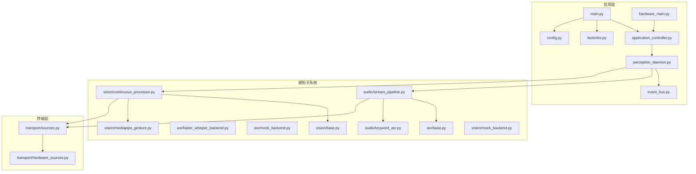

图表来源
- [app/main.py](file://app/main.py)
- [app/hardware_main.py](file://app/hardware_main.py)
- [app/control/application_controller.py](file://app/control/application_controller.py)
- [app/runtime/perception_daemon.py](file://app/runtime/perception_daemon.py)
- [app/events/event_bus.py](file://app/events/event_bus.py)
- [app/factories.py](file://app/factories.py)
- [app/config.py](file://app/config.py)
- [app/audio/stream_pipeline.py](file://app/audio/stream_pipeline.py)
- [app/audio/keyword_asr.py](file://app/audio/keyword_asr.py)
- [app/vision/continuous_processor.py](file://app/vision/continuous_processor.py)
- [app/vision/mediapipe_gesture.py](file://app/vision/mediapipe_gesture.py)
- [app/transport/sources.py](file://app/transport/sources.py)
- [app/transport/hardware_sources.py](file://app/transport/hardware_sources.py)

章节来源
- [app/main.py](file://app/main.py)
- [app/hardware_main.py](file://app/hardware_main.py)
- [config.yaml](file://config.yaml)

## 核心组件
- 工厂与依赖注入
  - 通过集中式工厂进行组件实例化与装配，统一对外暴露获取接口，屏蔽具体实现差异
  - 结合配置文件与运行时参数完成按需创建与替换
- 组件注册机制
  - 基于命名空间或类型标识的注册表，支持插件式扩展与热插拔
- 基类与接口规范
  - 为 ASR、VAD、视觉处理、数据源等定义抽象基类与最小方法集，确保多实现可互换
- 事件总线
  - 提供发布/订阅模型，解耦生产者与消费者，支撑跨模块通信
- 运行时守护进程
  - 管理感知子系统的生命周期、调度与资源清理

章节来源
- [app/factories.py](file://app/factories.py)
- [app/events/event_bus.py](file://app/events/event_bus.py)
- [app/runtime/perception_daemon.py](file://app/runtime/perception_daemon.py)
- [app/asr/base.py](file://app/asr/base.py)
- [app/vision/base.py](file://app/vision/base.py)

## 架构总览
系统围绕“感知-传输-控制-事件”的主干链路构建，工厂负责装配，运行时守护进程编排生命周期，事件总线贯穿各阶段。

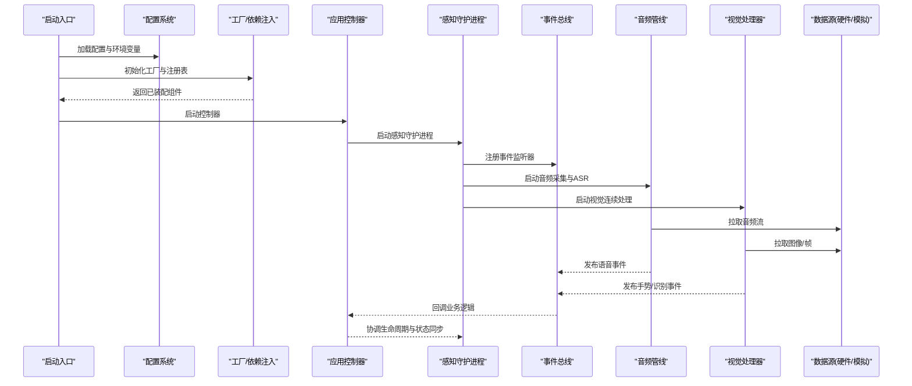

图表来源
- [app/main.py](file://app/main.py)
- [app/config.py](file://app/config.py)
- [app/factories.py](file://app/factories.py)
- [app/control/application_controller.py](file://app/control/application_controller.py)
- [app/runtime/perception_daemon.py](file://app/runtime/perception_daemon.py)
- [app/events/event_bus.py](file://app/events/event_bus.py)
- [app/audio/stream_pipeline.py](file://app/audio/stream_pipeline.py)
- [app/vision/continuous_processor.py](file://app/vision/continuous_processor.py)
- [app/transport/sources.py](file://app/transport/sources.py)

## 详细组件分析

### 工厂模式与依赖注入
- 职责
  - 集中管理组件创建、装配与替换
  - 根据配置选择后端实现（如 ASR 引擎、视觉后端）
  - 维护组件注册表，支持插件发现与动态加载
- 关键行为
  - 注册：将实现类映射到唯一标识
  - 解析：从配置读取所需实现标识
  - 构造：按需实例化并注入依赖
  - 生命周期：在守护进程启动/停止时触发工厂的生命周期钩子

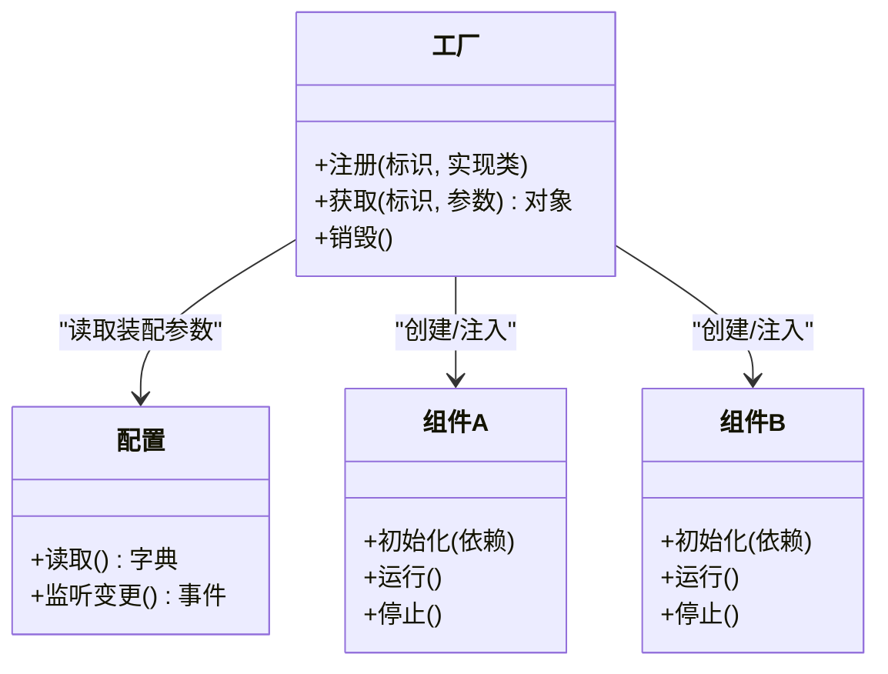

图表来源
- [app/factories.py](file://app/factories.py)
- [app/config.py](file://app/config.py)

章节来源
- [app/factories.py](file://app/factories.py)
- [app/config.py](file://app/config.py)

### 组件注册机制与插件架构
- 注册表
  - 使用命名空间隔离不同能力域（如 asr、vision、sources）
  - 支持覆盖默认实现，便于测试与切换
- 插件发现
  - 扫描指定目录或包，自动注册符合规范的实现
  - 通过元数据（版本、兼容性）过滤不兼容插件
- 热插拔
  - 运行时卸载/加载插件，更新注册表并通知依赖方

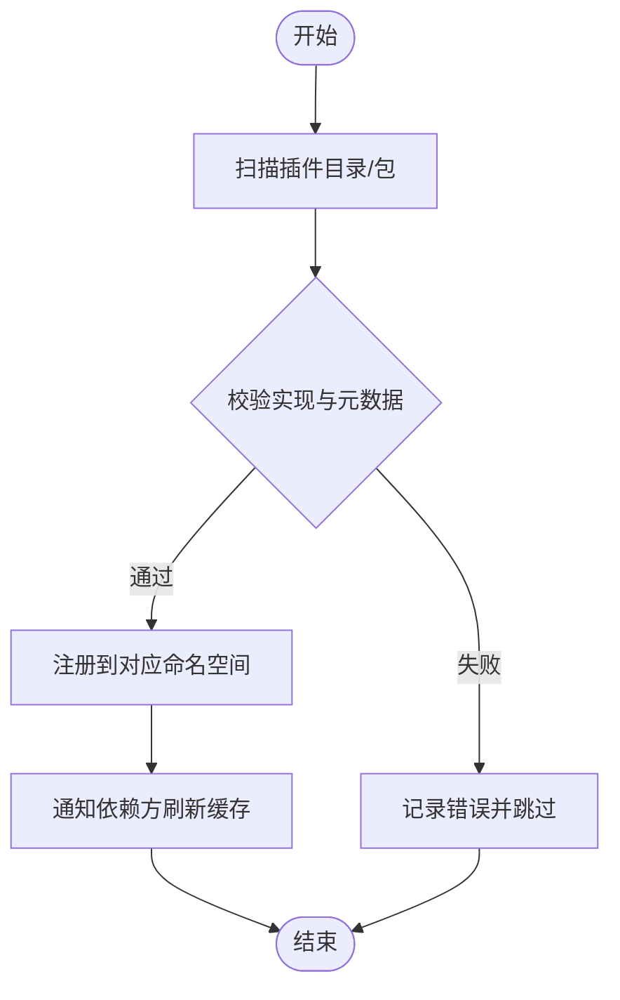

图表来源
- [app/factories.py](file://app/factories.py)

章节来源
- [app/factories.py](file://app/factories.py)

### 基类设计与接口规范
- ASR 基类
  - 定义统一的输入输出格式、采样率、语言设置、热词等接口
  - 提供通用预处理/后处理模板方法
- 视觉基类
  - 定义帧输入、检测/识别结果、置信度阈值、ROI 裁剪等接口
  - 提供批量处理与增量更新的抽象
- 数据源基类
  - 定义打开/关闭、读取帧/块、元数据获取、异常恢复等接口

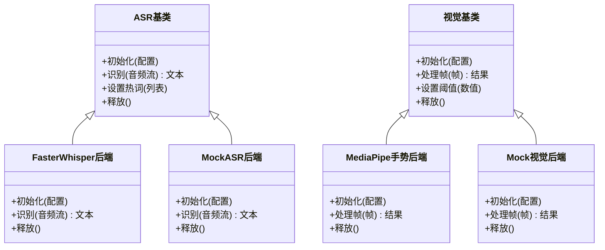

图表来源
- [app/asr/base.py](file://app/asr/base.py)
- [app/asr/faster_whisper_backend.py](file://app/asr/faster_whisper_backend.py)
- [app/asr/mock_backend.py](file://app/asr/mock_backend.py)
- [app/vision/base.py](file://app/vision/base.py)
- [app/vision/mediapipe_gesture.py](file://app/vision/mediapipe_gesture.py)
- [app/vision/mock_backend.py](file://app/vision/mock_backend.py)

章节来源
- [app/asr/base.py](file://app/asr/base.py)
- [app/asr/faster_whisper_backend.py](file://app/asr/faster_whisper_backend.py)
- [app/asr/mock_backend.py](file://app/asr/mock_backend.py)
- [app/vision/base.py](file://app/vision/base.py)
- [app/vision/mediapipe_gesture.py](file://app/vision/mediapipe_gesture.py)
- [app/vision/mock_backend.py](file://app/vision/mock_backend.py)

### 事件总线与状态同步
- 事件总线
  - 支持主题订阅、优先级队列、异步分发
  - 提供重试与死信通道，保证可靠性
- 状态同步
  - 守护进程维护全局状态机，事件驱动状态迁移
  - 组件间通过事件广播最新状态，避免轮询

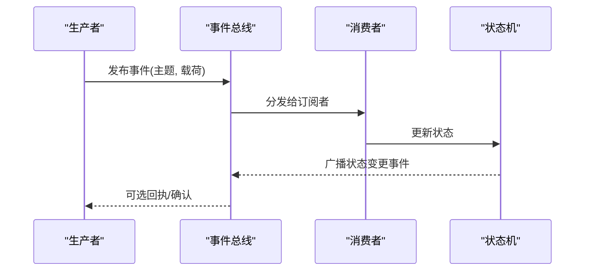

图表来源
- [app/events/event_bus.py](file://app/events/event_bus.py)
- [app/runtime/perception_daemon.py](file://app/runtime/perception_daemon.py)

章节来源
- [app/events/event_bus.py](file://app/events/event_bus.py)
- [app/runtime/perception_daemon.py](file://app/runtime/perception_daemon.py)

### 音频管线与关键词唤醒
- 音频管线
  - 采集 -> VAD -> ASR -> 关键词匹配 -> 事件发布
  - 支持流式处理与缓冲策略
- 关键词 ASR
  - 轻量级关键词检测，降低全量 ASR 调用成本

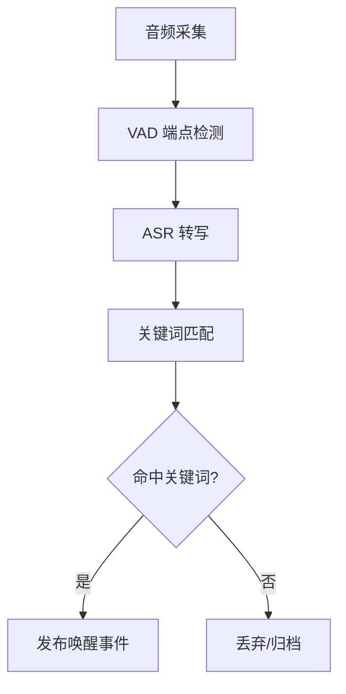

图表来源
- [app/audio/stream_pipeline.py](file://app/audio/stream_pipeline.py)
- [app/audio/keyword_asr.py](file://app/audio/keyword_asr.py)

章节来源
- [app/audio/stream_pipeline.py](file://app/audio/stream_pipeline.py)
- [app/audio/keyword_asr.py](file://app/audio/keyword_asr.py)

### 视觉连续处理与手势识别
- 连续处理
  - 帧抽取 -> 预处理 -> 模型推理 -> 后处理 -> 事件发布
  - 支持 ROI 裁剪、帧率自适应、丢帧策略
- 手势识别
  - 基于 MediaPipe 的手势关键点提取与分类

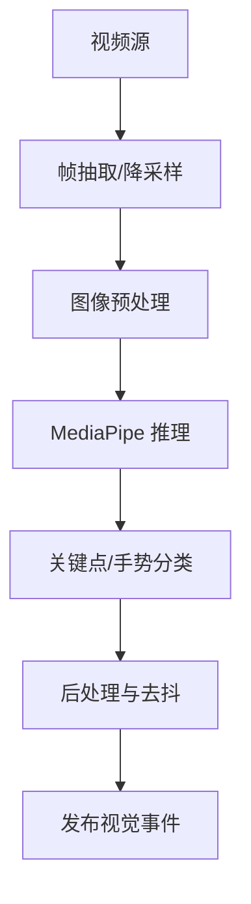

图表来源
- [app/vision/continuous_processor.py](file://app/vision/continuous_processor.py)
- [app/vision/mediapipe_gesture.py](file://app/vision/mediapipe_gesture.py)

章节来源
- [app/vision/continuous_processor.py](file://app/vision/continuous_processor.py)
- [app/vision/mediapipe_gesture.py](file://app/vision/mediapipe_gesture.py)

### 传输层与硬件源
- 数据源抽象
  - 统一打开/读取/关闭接口，屏蔽摄像头、麦克风、模拟器等差异
- 硬件源
  - 封装底层设备访问，提供错误恢复与降级策略

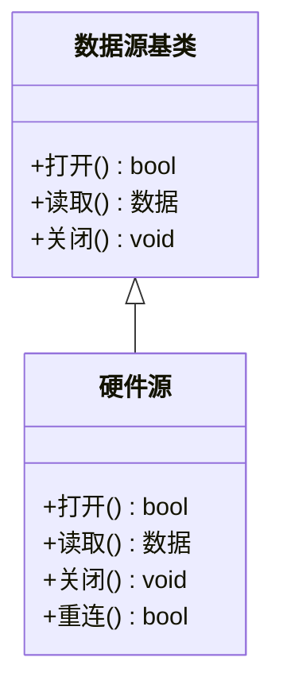

图表来源
- [app/transport/sources.py](file://app/transport/sources.py)
- [app/transport/hardware_sources.py](file://app/transport/hardware_sources.py)

章节来源
- [app/transport/sources.py](file://app/transport/sources.py)
- [app/transport/hardware_sources.py](file://app/transport/hardware_sources.py)

### 配置系统与动态加载
- 层次结构
  - 默认配置 -> 环境覆盖 -> 运行时配置 -> 插件配置
- 环境变量管理
  - 敏感信息通过环境变量注入，运行时合并到配置树
- 动态配置加载
  - 监听配置文件变更，热更新相关组件参数（如阈值、模型路径）

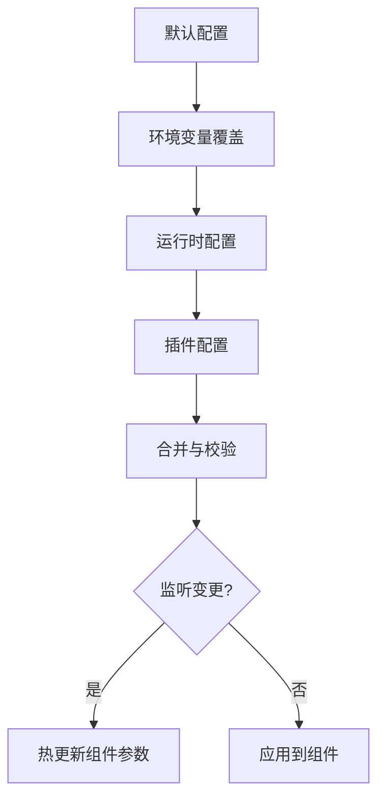

图表来源
- [app/config.py](file://app/config.py)
- [config.yaml](file://config.yaml)

章节来源
- [app/config.py](file://app/config.py)
- [config.yaml](file://config.yaml)

### 组件生命周期管理与状态同步
- 生命周期
  - 初始化 -> 启动 -> 运行 -> 暂停/恢复 -> 停止 -> 销毁
- 状态同步
  - 守护进程维护全局状态，事件驱动迁移；组件内部维护局部状态并通过事件广播

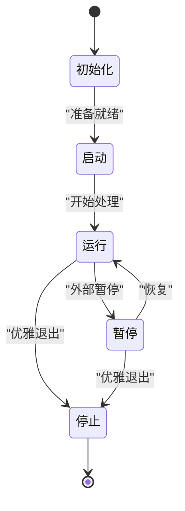

图表来源
- [app/runtime/perception_daemon.py](file://app/runtime/perception_daemon.py)
- [app/control/application_controller.py](file://app/control/application_controller.py)

章节来源
- [app/runtime/perception_daemon.py](file://app/runtime/perception_daemon.py)
- [app/control/application_controller.py](file://app/control/application_controller.py)

### 热重载支持
- 配置热重载
  - 监听配置文件变化，增量更新参数并通知组件
- 插件热插拔
  - 运行时卸载旧实现、加载新实现，更新注册表并重建依赖
- 回滚策略
  - 新版本不可用时自动回滚至上一稳定版本

章节来源
- [app/config.py](file://app/config.py)
- [app/factories.py](file://app/factories.py)

### 自定义组件开发指南
- 步骤
  - 定义实现类并继承对应基类
  - 在工厂中注册实现标识与构造参数
  - 在配置文件中声明启用该实现
  - 编写单元测试验证接口契约
- 最佳实践
  - 保持接口稳定，向后兼容
  - 合理拆分职责，避免单点膨胀
  - 提供 mock 实现以便测试

章节来源
- [app/asr/base.py](file://app/asr/base.py)
- [app/vision/base.py](file://app/vision/base.py)
- [app/factories.py](file://app/factories.py)

### 测试策略
- 单元与集成测试
  - 针对基类契约、工厂装配、事件分发、生命周期编排进行测试
- 模拟与桩
  - 使用 mock 后端替代真实硬件与重型模型
- 回归与冒烟
  - 关键路径自动化用例，保障每次变更稳定性

章节来源
- [tests/test_config.py](file://tests/test_config.py)

### 部署注意事项
- 环境与依赖
  - 明确 Python 版本、第三方库与硬件驱动要求
- 配置安全
  - 敏感项通过环境变量注入，禁止硬编码
- 监控与日志
  - 关键指标上报，结构化日志便于排障
- 灰度与回滚
  - 支持渐进式发布与快速回滚

[本节为通用指导，不直接分析具体文件]

## 依赖关系分析
组件间的耦合通过工厂与事件总线解耦，基类约束接口，传输层抽象硬件差异。

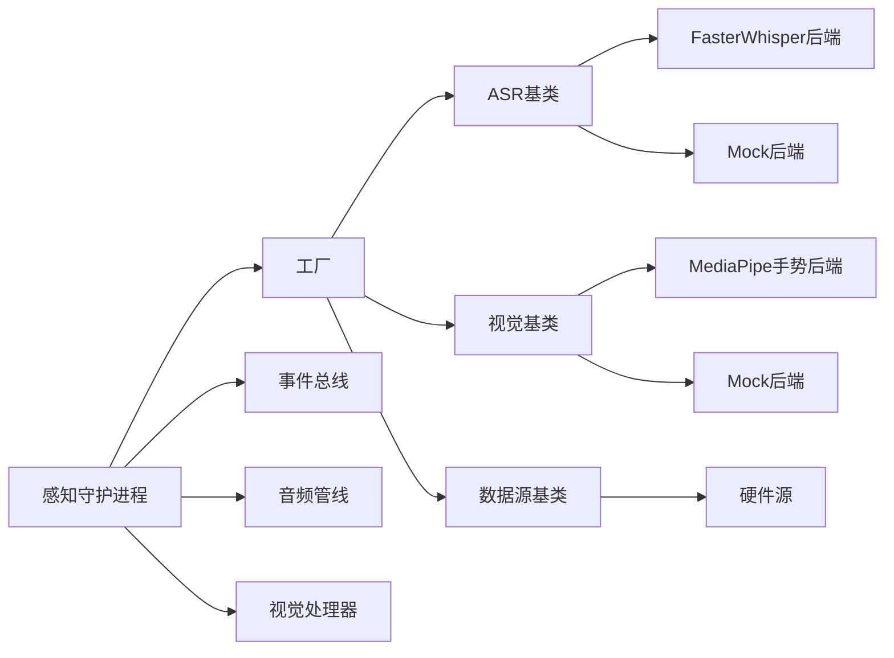

图表来源
- [app/factories.py](file://app/factories.py)
- [app/asr/base.py](file://app/asr/base.py)
- [app/asr/faster_whisper_backend.py](file://app/asr/faster_whisper_backend.py)
- [app/asr/mock_backend.py](file://app/asr/mock_backend.py)
- [app/vision/base.py](file://app/vision/base.py)
- [app/vision/mediapipe_gesture.py](file://app/vision/mediapipe_gesture.py)
- [app/vision/mock_backend.py](file://app/vision/mock_backend.py)
- [app/transport/sources.py](file://app/transport/sources.py)
- [app/transport/hardware_sources.py](file://app/transport/hardware_sources.py)
- [app/runtime/perception_daemon.py](file://app/runtime/perception_daemon.py)
- [app/events/event_bus.py](file://app/events/event_bus.py)
- [app/audio/stream_pipeline.py](file://app/audio/stream_pipeline.py)
- [app/vision/continuous_processor.py](file://app/vision/continuous_processor.py)

章节来源
- [app/factories.py](file://app/factories.py)
- [app/runtime/perception_daemon.py](file://app/runtime/perception_daemon.py)
- [app/events/event_bus.py](file://app/events/event_bus.py)

## 性能考量
- 流式处理
  - 音频与视频均采用流式管道，减少内存峰值与延迟
- 模型与推理
  - 按需加载模型，批处理与缓存中间结果
- 资源管理
  - 显存/内存上限控制，超时与降级策略
- 并发与调度
  - 合理分配线程/进程，避免阻塞 I/O

[本节为通用指导，不直接分析具体文件]

## 故障排查指南
- 常见问题
  - 配置加载失败：检查环境变量与 YAML 语法
  - 插件未生效：确认注册表与标识一致
  - 设备无法打开：检查权限与驱动
  - 事件丢失：查看总线队列与重试策略
- 定位手段
  - 开启调试日志，打印关键状态与事件
  - 使用 mock 后端隔离问题域
  - 逐步禁用组件定位根因

章节来源
- [app/config.py](file://app/config.py)
- [app/factories.py](file://app/factories.py)
- [app/events/event_bus.py](file://app/events/event_bus.py)

## 结论
本设计通过工厂与基类抽象实现了高内聚、低耦合的模块化架构；借助事件总线与守护进程完成生命周期编排与状态同步；配置系统支持多层次与环境变量注入，具备动态加载与热重载能力。遵循本文档的接口规范与开发指南，可高效扩展新组件并保持系统稳定演进。

## 附录
- 术语
  - 工厂：负责组件创建与装配的中心化模块
  - 基类：定义组件最小接口与通用行为的抽象
  - 事件总线：发布/订阅的消息中枢
  - 守护进程：管理子系统生命周期的后台任务
- 参考
  - 配置文件示例与键说明见配置文件
  - 测试用例覆盖关键路径与边界条件

[本节为补充信息，不直接分析具体文件]