# 系统架构设计

<cite>
**本文引用的文件**   
- [app/main.py](file://app/main.py)
- [app/hardware_main.py](file://app/hardware_main.py)
- [app/__main__.py](file://app/__main__.py)
- [app/config.py](file://app/config.py)
- [app/factories.py](file://app/factories.py)
- [app/models.py](file://app/models.py)
- [app/perception_events.py](file://app/perception_events.py)
- [app/event_cache.py](file://app/event_cache.py)
- [app/runtime/perception_daemon.py](file://app/runtime/perception_daemon.py)
- [app/events/event_bus.py](file://app/events/event_bus.py)
- [app/transport/sources.py](file://app/transport/sources.py)
- [app/transport/hardware_sources.py](file://app/transport/hardware_sources.py)
- [app/audio/stream_pipeline.py](file://app/audio/stream_pipeline.py)
- [app/audio/keyword_asr.py](file://app/audio/keyword_asr.py)
- [app/asr/base.py](file://app/asr/base.py)
- [app/asr/faster_whisper_backend.py](file://app/asr/faster_whisper_backend.py)
- [app/asr/mock_backend.py](file://app/asr/mock_backend.py)
- [app/audio/vad/silero_backend.py](file://app/audio/vad/silero_backend.py)
- [app/audio/vad/base.py](file://app/audio/vad/base.py)
- [app/detection/keywords.py](file://app/detection/keywords.py)
- [app/features/photo_capture.py](file://app/features/photo_capture.py)
- [app/control/application_controller.py](file://app/control/application_controller.py)
- [app/vision/continuous_processor.py](file://app/vision/continuous_processor.py)
- [app/vision/gesture_stabilizer.py](file://app/vision/gesture_stabilizer.py)
- [app/vision/image_loader.py](file://app/vision/image_loader.py)
- [app/vision/mediapipe_gesture.py](file://app/vision/mediapipe_gesture.py)
- [app/vision/mock_backend.py](file://app/vision/mock_backend.py)
- [integrations/desktop_bot/log_event_bridge.py](file://integrations/desktop_bot/log_event_bridge.py)
- [integrations/desktop_bot/web_event_forwarder.py](file://integrations/desktop_bot/web_event_forwarder.py)
- [docs/perception-runtime.md](file://docs/perception-runtime.md)
- [config.yaml](file://config.yaml)
</cite>

## 目录
1. [简介](#简介)
2. [项目结构](#项目结构)
3. [核心组件](#核心组件)
4. [架构总览](#架构总览)
5. [详细组件分析](#详细组件分析)
6. [依赖关系分析](#依赖关系分析)
7. [性能考量](#性能考量)
8. [故障排查指南](#故障排查指南)
9. [结论](#结论)
10. [附录](#附录)

## 简介
本文件面向AI智能桌面设备的整体系统架构，聚焦感知运行时（Perception Runtime）的设计原理、事件驱动架构的实现方式与模块化组件模式。文档涵盖：
- 子系统职责划分与交互边界
- 事件总线、消息队列与IPC通信机制
- 数据流图、组件交互图与状态转换图
- 扩展点设计与插件化架构，如何新增感知模块或处理逻辑
- 架构决策的技术背景与权衡

## 项目结构
代码库采用“按功能域分层 + 运行时编排”的组织方式：
- app：核心应用层，包含运行时、事件、传输、音频、视觉、检测、特性与控制等子模块
- integrations：与桌面端/Web端的集成桥接
- docs：架构与设计说明
- config.yaml：全局配置
- scripts/tools/tests：辅助脚本与测试

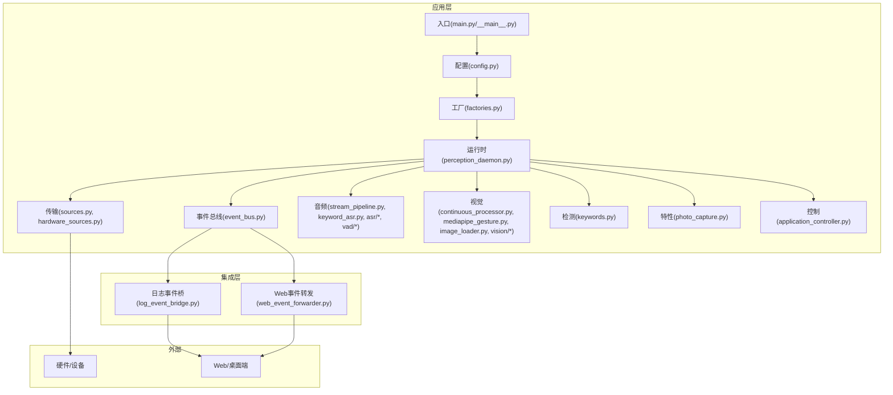

图表来源
- [app/main.py:1-200](file://app/main.py#L1-L200)
- [app/hardware_main.py:1-200](file://app/hardware_main.py#L1-L200)
- [app/runtime/perception_daemon.py:1-200](file://app/runtime/perception_daemon.py#L1-L200)
- [app/events/event_bus.py:1-200](file://app/events/event_bus.py#L1-L200)
- [app/transport/sources.py:1-200](file://app/transport/sources.py#L1-L200)
- [app/transport/hardware_sources.py:1-200](file://app/transport/hardware_sources.py#L1-L200)
- [app/audio/stream_pipeline.py:1-200](file://app/audio/stream_pipeline.py#L1-L200)
- [app/vision/continuous_processor.py:1-200](file://app/vision/continuous_processor.py#L1-L200)
- [integrations/desktop_bot/log_event_bridge.py:1-200](file://integrations/desktop_bot/log_event_bridge.py#L1-L200)
- [integrations/desktop_bot/web_event_forwarder.py:1-200](file://integrations/desktop_bot/web_event_forwarder.py#L1-L200)

章节来源
- [app/main.py:1-200](file://app/main.py#L1-L200)
- [app/hardware_main.py:1-200](file://app/hardware_main.py#L1-L200)
- [app/config.py:1-200](file://app/config.py#L1-L200)
- [app/factories.py:1-200](file://app/factories.py#L1-L200)
- [config.yaml:1-200](file://config.yaml#L1-L200)

## 核心组件
- 感知运行时（Perception Runtime）
  - 负责生命周期管理、资源调度、任务编排与事件分发
  - 通过工厂装配各感知后端与处理器
  - 将输入源（音频/视频/硬件）统一为事件流，经事件总线分发给订阅者
- 事件总线（Event Bus）
  - 提供发布/订阅模型，解耦生产者与消费者
  - 支持事件缓存与重试策略，保障可靠性
- 传输层（Transport）
  - 抽象硬件与模拟源，屏蔽底层差异
  - 提供统一的帧/样本读取接口
- 音频子系统（Audio）
  - 语音活动检测（VAD）、关键词识别（Keyword ASR）、ASR后端（Whisper/Mock）
- 视觉子系统（Vision）
  - 连续图像处理、手势稳定器、图像加载器、MediaPipe手势识别与Mock后端
- 检测与特性（Detection & Features）
  - 关键词检测、拍照特性等可插拔能力
- 控制与应用控制器（Control）
  - 应用级流程编排、状态机与对外API暴露

章节来源
- [app/runtime/perception_daemon.py:1-200](file://app/runtime/perception_daemon.py#L1-L200)
- [app/events/event_bus.py:1-200](file://app/events/event_bus.py#L1-L200)
- [app/transport/sources.py:1-200](file://app/transport/sources.py#L1-L200)
- [app/transport/hardware_sources.py:1-200](file://app/transport/hardware_sources.py#L1-L200)
- [app/audio/stream_pipeline.py:1-200](file://app/audio/stream_pipeline.py#L1-L200)
- [app/audio/keyword_asr.py:1-200](file://app/audio/keyword_asr.py#L1-L200)
- [app/asr/base.py:1-200](file://app/asr/base.py#L1-L200)
- [app/asr/faster_whisper_backend.py:1-200](file://app/asr/faster_whisper_backend.py#L1-L200)
- [app/asr/mock_backend.py:1-200](file://app/asr/mock_backend.py#L1-L200)
- [app/audio/vad/silero_backend.py:1-200](file://app/audio/vad/silero_backend.py#L1-L200)
- [app/audio/vad/base.py:1-200](file://app/audio/vad/base.py#L1-L200)
- [app/vision/continuous_processor.py:1-200](file://app/vision/continuous_processor.py#L1-L200)
- [app/vision/gesture_stabilizer.py:1-200](file://app/vision/gesture_stabilizer.py#L1-L200)
- [app/vision/image_loader.py:1-200](file://app/vision/image_loader.py#L1-L200)
- [app/vision/mediapipe_gesture.py:1-200](file://app/vision/mediapipe_gesture.py#L1-L200)
- [app/vision/mock_backend.py:1-200](file://app/vision/mock_backend.py#L1-L200)
- [app/detection/keywords.py:1-200](file://app/detection/keywords.py#L1-L200)
- [app/features/photo_capture.py:1-200](file://app/features/photo_capture.py#L1-L200)
- [app/control/application_controller.py:1-200](file://app/control/application_controller.py#L1-L200)

## 架构总览
系统采用“运行时编排 + 事件驱动 + 插件化”的架构模式：
- 运行时作为中枢，协调输入源、感知后端与业务处理器
- 事件总线贯穿全链路，实现松耦合与高内聚
- 传输层抽象硬件差异，便于多设备接入
- 插件化设计使新增感知模块与处理逻辑具备最小侵入性

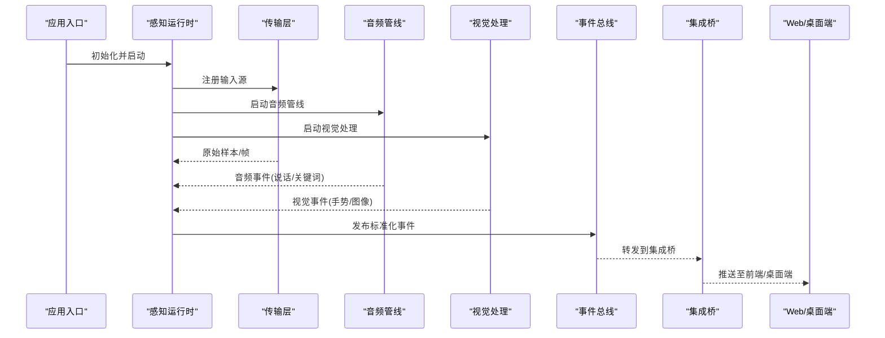

图表来源
- [app/main.py:1-200](file://app/main.py#L1-L200)
- [app/runtime/perception_daemon.py:1-200](file://app/runtime/perception_daemon.py#L1-L200)
- [app/transport/sources.py:1-200](file://app/transport/sources.py#L1-L200)
- [app/audio/stream_pipeline.py:1-200](file://app/audio/stream_pipeline.py#L1-L200)
- [app/vision/continuous_processor.py:1-200](file://app/vision/continuous_processor.py#L1-L200)
- [app/events/event_bus.py:1-200](file://app/events/event_bus.py#L1-L200)
- [integrations/desktop_bot/log_event_bridge.py:1-200](file://integrations/desktop_bot/log_event_bridge.py#L1-L200)
- [integrations/desktop_bot/web_event_forwarder.py:1-200](file://integrations/desktop_bot/web_event_forwarder.py#L1-L200)

## 详细组件分析

### 感知运行时（Perception Runtime）
- 职责
  - 生命周期管理：启动、停止、重启
  - 资源编排：按需创建/销毁输入源、感知后端与处理器
  - 事件路由：将标准化事件分发到订阅者
  - 错误恢复：异常捕获、降级与重试
- 关键设计
  - 基于工厂模式动态装配后端
  - 使用事件总线进行跨模块通信
  - 支持热插拔式扩展点（新增模块仅需注册）

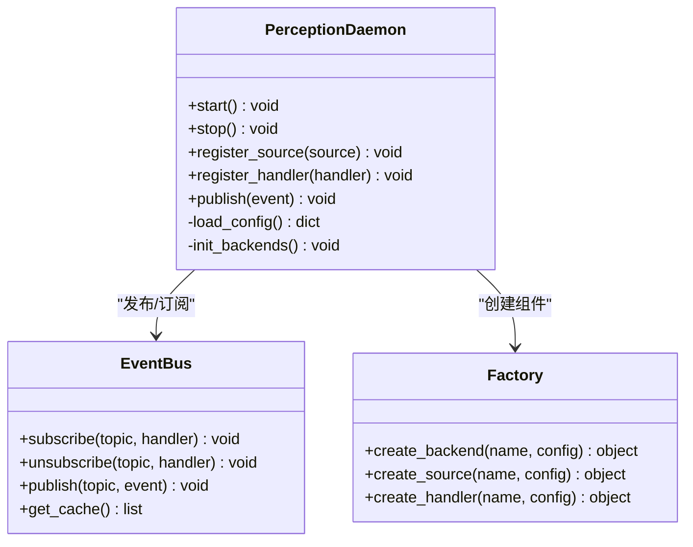

图表来源
- [app/runtime/perception_daemon.py:1-200](file://app/runtime/perception_daemon.py#L1-L200)
- [app/events/event_bus.py:1-200](file://app/events/event_bus.py#L1-L200)
- [app/factories.py:1-200](file://app/factories.py#L1-L200)

章节来源
- [app/runtime/perception_daemon.py:1-200](file://app/runtime/perception_daemon.py#L1-L200)
- [app/factories.py:1-200](file://app/factories.py#L1-L200)
- [app/config.py:1-200](file://app/config.py#L1-L200)

### 事件总线与消息传递
- 设计要点
  - 主题化事件通道，支持多订阅者
  - 事件缓存用于断线重连与回放
  - 可选的消息队列（可扩展为持久化队列）
- 通信机制
  - 进程内事件总线为主，跨进程可通过IPC或HTTP/WebSocket扩展
  - 集成桥将事件转发至Web/桌面端

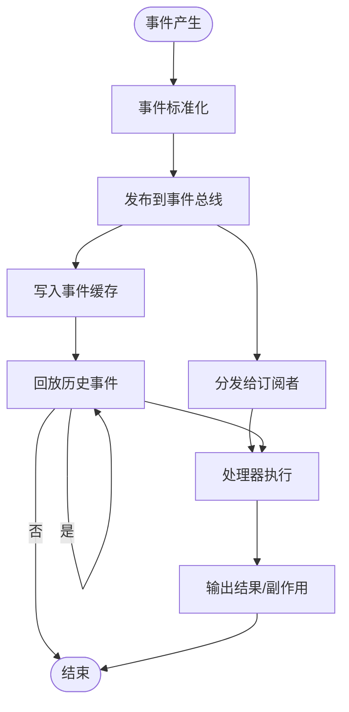

图表来源
- [app/events/event_bus.py:1-200](file://app/events/event_bus.py#L1-L200)
- [app/event_cache.py:1-200](file://app/event_cache.py#L1-L200)
- [integrations/desktop_bot/log_event_bridge.py:1-200](file://integrations/desktop_bot/log_event_bridge.py#L1-L200)
- [integrations/desktop_bot/web_event_forwarder.py:1-200](file://integrations/desktop_bot/web_event_forwarder.py#L1-L200)

章节来源
- [app/events/event_bus.py:1-200](file://app/events/event_bus.py#L1-L200)
- [app/event_cache.py:1-200](file://app/event_cache.py#L1-L200)

### 传输层（输入源抽象）
- 目标
  - 统一音频/视频/硬件输入接口
  - 支持模拟与真实硬件切换
- 关键点
  - 基类定义读取/关闭/元数据接口
  - 具体实现封装设备细节（如摄像头、麦克风、ESP32）

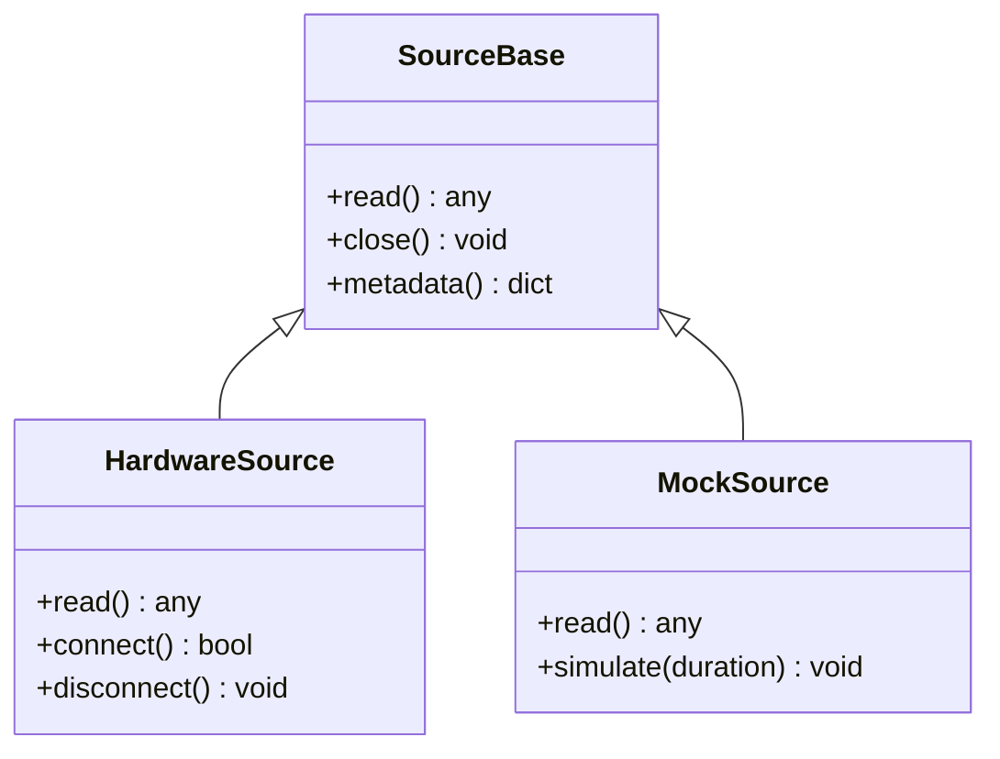

图表来源
- [app/transport/sources.py:1-200](file://app/transport/sources.py#L1-L200)
- [app/transport/hardware_sources.py:1-200](file://app/transport/hardware_sources.py#L1-L200)

章节来源
- [app/transport/sources.py:1-200](file://app/transport/sources.py#L1-L200)
- [app/transport/hardware_sources.py:1-200](file://app/transport/hardware_sources.py#L1-L200)

### 音频子系统
- 组件
  - 音频流管道：缓冲、分片、降噪
  - VAD后端：Silero等
  - Keyword ASR：关键词检测
  - ASR后端：Faster Whisper/Mock
- 数据流
  - 原始音频 -> VAD -> 关键词检测 -> ASR -> 文本事件

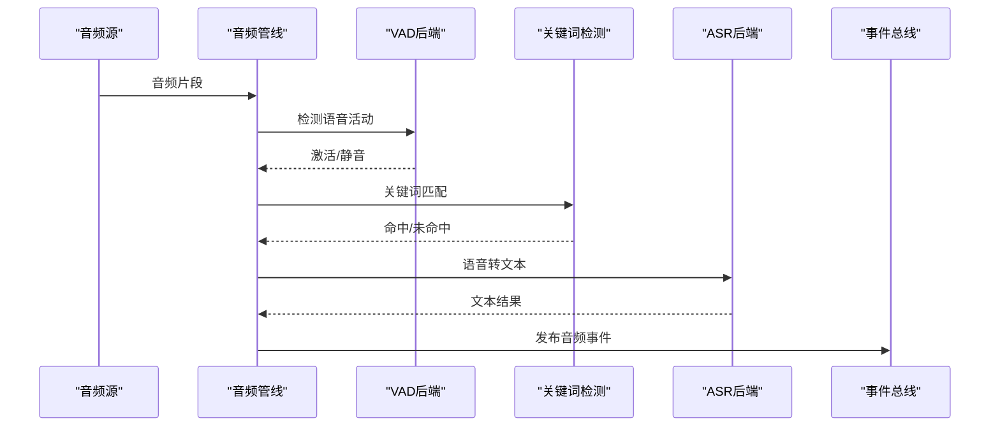

图表来源
- [app/audio/stream_pipeline.py:1-200](file://app/audio/stream_pipeline.py#L1-L200)
- [app/audio/vad/silero_backend.py:1-200](file://app/audio/vad/silero_backend.py#L1-L200)
- [app/audio/vad/base.py:1-200](file://app/audio/vad/base.py#L1-L200)
- [app/audio/keyword_asr.py:1-200](file://app/audio/keyword_asr.py#L1-L200)
- [app/asr/base.py:1-200](file://app/asr/base.py#L1-L200)
- [app/asr/faster_whisper_backend.py:1-200](file://app/asr/faster_whisper_backend.py#L1-L200)
- [app/asr/mock_backend.py:1-200](file://app/asr/mock_backend.py#L1-L200)

章节来源
- [app/audio/stream_pipeline.py:1-200](file://app/audio/stream_pipeline.py#L1-L200)
- [app/audio/keyword_asr.py:1-200](file://app/audio/keyword_asr.py#L1-L200)
- [app/asr/base.py:1-200](file://app/asr/base.py#L1-L200)
- [app/asr/faster_whisper_backend.py:1-200](file://app/asr/faster_whisper_backend.py#L1-L200)
- [app/asr/mock_backend.py:1-200](file://app/asr/mock_backend.py#L1-L200)
- [app/audio/vad/silero_backend.py:1-200](file://app/audio/vad/silero_backend.py#L1-L200)
- [app/audio/vad/base.py:1-200](file://app/audio/vad/base.py#L1-L200)

### 视觉子系统
- 组件
  - 连续处理器：帧循环、去抖、批处理
  - 手势稳定器：时序平滑、噪声抑制
  - 图像加载器：解码、缩放、格式转换
  - MediaPipe手势识别：关键点提取、动作分类
  - Mock后端：开发调试用
- 数据流
  - 原始帧 -> 加载/预处理 -> 手势识别 -> 稳定化 -> 视觉事件

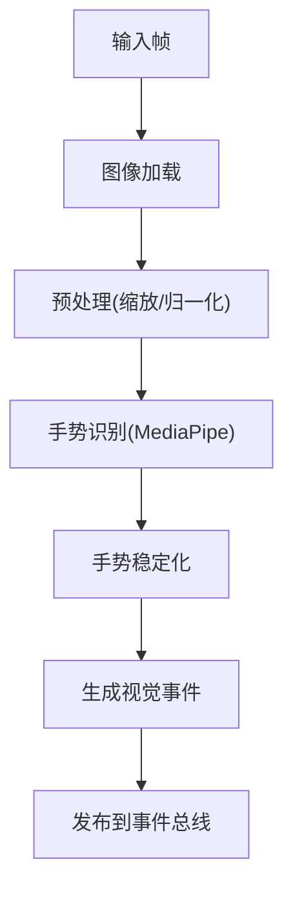

图表来源
- [app/vision/continuous_processor.py:1-200](file://app/vision/continuous_processor.py#L1-L200)
- [app/vision/gesture_stabilizer.py:1-200](file://app/vision/gesture_stabilizer.py#L1-L200)
- [app/vision/image_loader.py:1-200](file://app/vision/image_loader.py#L1-L200)
- [app/vision/mediapipe_gesture.py:1-200](file://app/vision/mediapipe_gesture.py#L1-L200)
- [app/vision/mock_backend.py:1-200](file://app/vision/mock_backend.py#L1-L200)

章节来源
- [app/vision/continuous_processor.py:1-200](file://app/vision/continuous_processor.py#L1-L200)
- [app/vision/gesture_stabilizer.py:1-200](file://app/vision/gesture_stabilizer.py#L1-L200)
- [app/vision/image_loader.py:1-200](file://app/vision/image_loader.py#L1-L200)
- [app/vision/mediapipe_gesture.py:1-200](file://app/vision/mediapipe_gesture.py#L1-L200)
- [app/vision/mock_backend.py:1-200](file://app/vision/mock_backend.py#L1-L200)

### 检测与特性
- 关键词检测：在音频流中快速匹配唤醒词
- 拍照特性：触发相机采集并生成图像事件

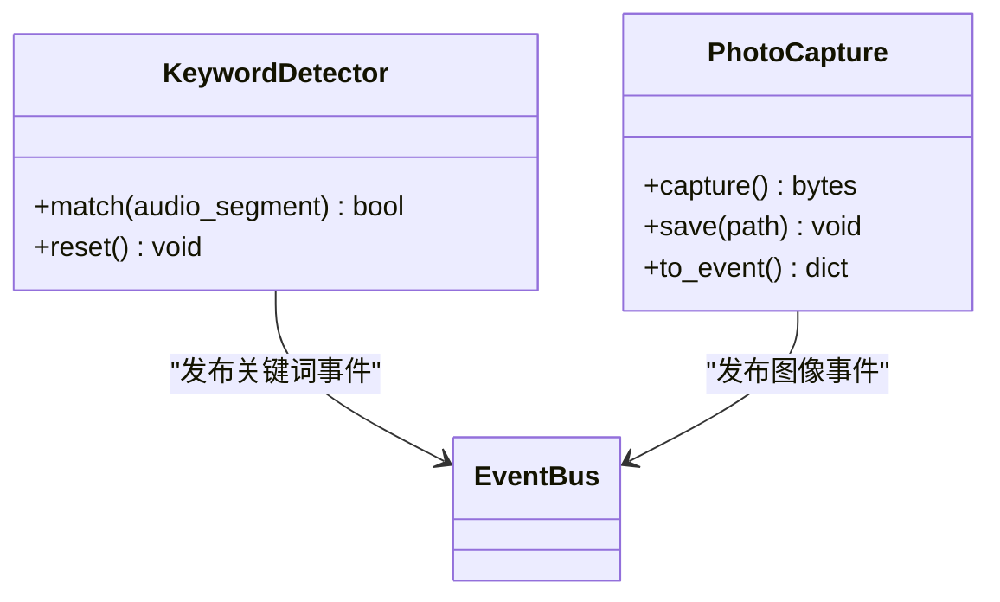

图表来源
- [app/detection/keywords.py:1-200](file://app/detection/keywords.py#L1-L200)
- [app/features/photo_capture.py:1-200](file://app/features/photo_capture.py#L1-L200)

章节来源
- [app/detection/keywords.py:1-200](file://app/detection/keywords.py#L1-L200)
- [app/features/photo_capture.py:1-200](file://app/features/photo_capture.py#L1-L200)

### 控制与应用控制器
- 职责
  - 应用级流程编排（如唤醒->对话->拍照）
  - 状态机管理（空闲、监听、处理、响应）
  - 对外API暴露（REST/WS）
- 状态转换

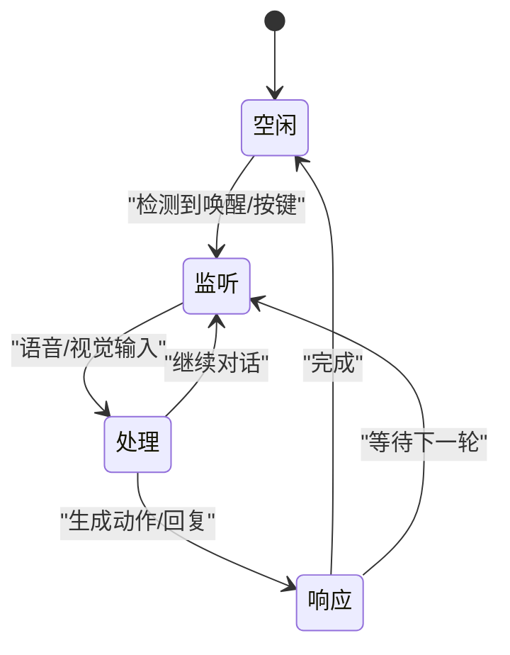

图表来源
- [app/control/application_controller.py:1-200](file://app/control/application_controller.py#L1-L200)

章节来源
- [app/control/application_controller.py:1-200](file://app/control/application_controller.py#L1-L200)

### 集成桥（与Web/桌面端通信）
- 日志事件桥：将内部事件转为结构化日志
- Web事件转发：通过WebSocket/HTTP推送事件到前端

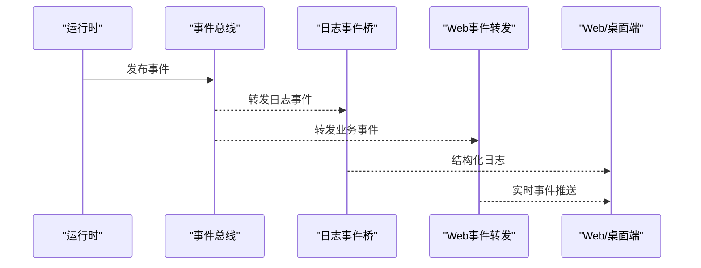

图表来源
- [integrations/desktop_bot/log_event_bridge.py:1-200](file://integrations/desktop_bot/log_event_bridge.py#L1-L200)
- [integrations/desktop_bot/web_event_forwarder.py:1-200](file://integrations/desktop_bot/web_event_forwarder.py#L1-L200)

章节来源
- [integrations/desktop_bot/log_event_bridge.py:1-200](file://integrations/desktop_bot/log_event_bridge.py#L1-L200)
- [integrations/desktop_bot/web_event_forwarder.py:1-200](file://integrations/desktop_bot/web_event_forwarder.py#L1-L200)

## 依赖关系分析
- 运行时依赖工厂创建组件，依赖事件总线进行通信
- 传输层被运行时与音频/视觉子系统共同依赖
- 集成桥依赖事件总线，向外部系统推送事件
- 配置集中管理，影响运行时与各后端行为

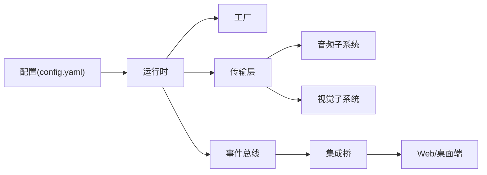

图表来源
- [config.yaml:1-200](file://config.yaml#L1-L200)
- [app/runtime/perception_daemon.py:1-200](file://app/runtime/perception_daemon.py#L1-L200)
- [app/factories.py:1-200](file://app/factories.py#L1-L200)
- [app/events/event_bus.py:1-200](file://app/events/event_bus.py#L1-L200)
- [app/transport/sources.py:1-200](file://app/transport/sources.py#L1-L200)
- [app/audio/stream_pipeline.py:1-200](file://app/audio/stream_pipeline.py#L1-L200)
- [app/vision/continuous_processor.py:1-200](file://app/vision/continuous_processor.py#L1-L200)
- [integrations/desktop_bot/log_event_bridge.py:1-200](file://integrations/desktop_bot/log_event_bridge.py#L1-L200)
- [integrations/desktop_bot/web_event_forwarder.py:1-200](file://integrations/desktop_bot/web_event_forwarder.py#L1-L200)

章节来源
- [app/runtime/perception_daemon.py:1-200](file://app/runtime/perception_daemon.py#L1-L200)
- [app/factories.py:1-200](file://app/factories.py#L1-L200)
- [app/events/event_bus.py:1-200](file://app/events/event_bus.py#L1-L200)
- [app/transport/sources.py:1-200](file://app/transport/sources.py#L1-L200)
- [config.yaml:1-200](file://config.yaml#L1-L200)

## 性能考量
- 异步与并发
  - 音频/视觉处理建议采用异步IO与线程池，避免阻塞事件总线
- 内存与带宽
  - 音频分片大小与帧率需平衡延迟与CPU占用
  - 图像预处理（缩放/裁剪）降低推理负载
- 缓存与回放
  - 事件缓存容量与过期策略需根据业务调整
- 后端选择
  - Whisper精度与延迟权衡；Mock后端用于开发与压测
- 资源隔离
  - 不同感知模块可独立进程/容器部署，提升稳定性

[本节为通用指导，不直接分析具体文件]

## 故障排查指南
- 常见问题
  - 事件丢失：检查事件缓存与订阅者消费速度
  - 音频卡顿：检查VAD阈值与分片大小
  - 视觉延迟：检查图像加载与推理后端性能
  - 集成失败：检查Web事件转发连接与协议
- 定位方法
  - 启用运行时日志与事件追踪
  - 使用Mock源进行端到端回归测试
  - 监控CPU/内存/IO指标

章节来源
- [app/runtime/perception_daemon.py:1-200](file://app/runtime/perception_daemon.py#L1-L200)
- [app/events/event_bus.py:1-200](file://app/events/event_bus.py#L1-L200)
- [app/event_cache.py:1-200](file://app/event_cache.py#L1-L200)
- [integrations/desktop_bot/web_event_forwarder.py:1-200](file://integrations/desktop_bot/web_event_forwarder.py#L1-L200)

## 结论
本架构以感知运行时为核心，结合事件驱动与插件化设计，实现了高内聚、低耦合的模块化体系。通过传输层抽象、统一事件总线与集成桥，系统具备良好的扩展性与可维护性。未来可在以下方向演进：
- 引入持久化消息队列增强可靠性
- 增加更多感知后端（如触觉、环境传感器）
- 优化推理流水线与资源调度策略

[本节为总结，不直接分析具体文件]

## 附录
- 扩展点设计
  - 新增感知模块：实现对应基类接口，通过工厂注册
  - 新增处理逻辑：订阅事件总线主题，实现处理器
  - 新增传输源：继承SourceBase，实现读取与元数据
- 技术选型背景与权衡
  - Whisper vs Mock：精度与延迟的权衡
  - 事件总线 vs 直接调用：解耦与性能的取舍
  - 进程内 vs 进程间通信：复杂度与可靠性的平衡

章节来源
- [app/factories.py:1-200](file://app/factories.py#L1-L200)
- [app/transport/sources.py:1-200](file://app/transport/sources.py#L1-L200)
- [app/events/event_bus.py:1-200](file://app/events/event_bus.py#L1-L200)
- [docs/perception-runtime.md:1-200](file://docs/perception-runtime.md#L1-L200)