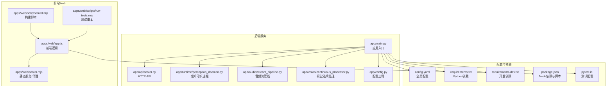
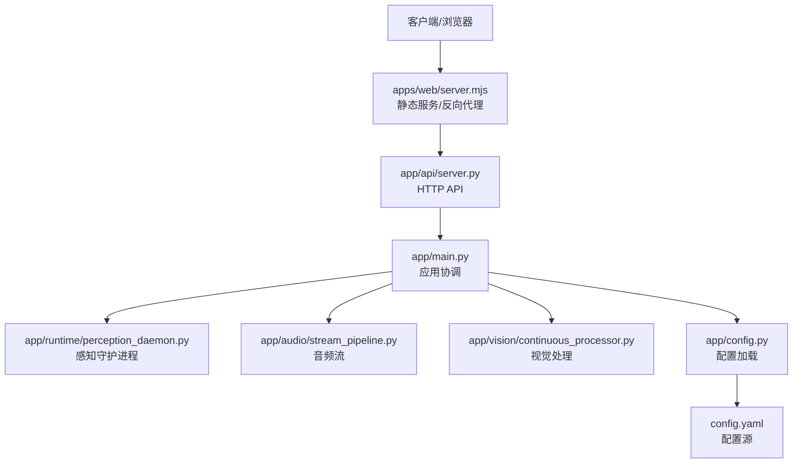
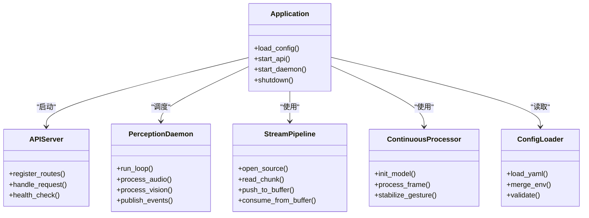
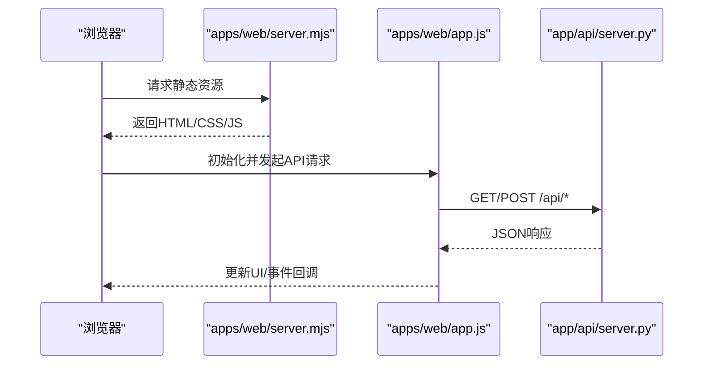
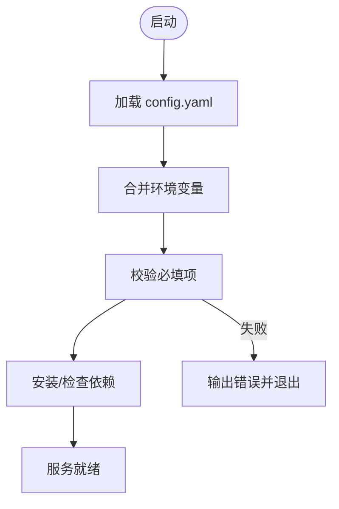
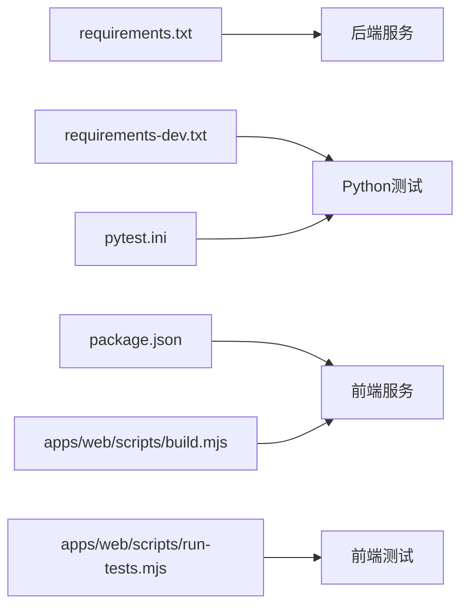

# 部署指南

<cite>
**本文引用的文件**   
- [README.md](file://README.md)
- [config.yaml](file://config.yaml)
- [requirements.txt](file://requirements.txt)
- [requirements-dev.txt](file://requirements-dev.txt)
- [pytest.ini](file://pytest.ini)
- [package.json](file://package.json)
- [app/main.py](file://app/main.py)
- [app/config.py](file://app/config.py)
- [app/__main__.py](file://app/__main__.py)
- [app/api/server.py](file://app/api/server.py)
- [app/runtime/perception_daemon.py](file://app/runtime/perception_daemon.py)
- [app/audio/stream_pipeline.py](file://app/audio/stream_pipeline.py)
- [app/vision/continuous_processor.py](file://app/vision/continuous_processor.py)
- [apps/web/app.js](file://apps/web/app.js)
- [apps/web/server.mjs](file://apps/web/server.mjs)
- [apps/web/scripts/build.mjs](file://apps/web/scripts/build.mjs)
- [apps/web/scripts/run-tests.mjs](file://apps/web/scripts/run-tests.mjs)
- [apps/web/tests/api.test.mjs](file://apps/web/tests/api.test.mjs)
- [AI_Hardware_Community_Project/08_Server/生产部署与DevOps.md](file://AI_Hardware_Community_Project/08_Server/生产部署与DevOps.md)
</cite>

## 目录
1. [简介](#简介)
2. [项目结构](#项目结构)
3. [核心组件](#核心组件)
4. [架构总览](#架构总览)
5. [详细组件分析](#详细组件分析)
6. [依赖关系分析](#依赖关系分析)
7. [性能考虑](#性能考虑)
8. [故障排查指南](#故障排查指南)
9. [结论](#结论)
10. [附录](#附录)

## 简介
本指南面向开发、测试与生产环境，提供端到端的部署说明。内容涵盖操作系统与依赖要求、服务配置与进程管理、容器化与编排、CI/CD流水线、监控告警、日志收集与性能监控、以及故障恢复与灾难恢复策略。文档基于仓库中的配置文件、应用入口与脚本进行梳理，确保可操作性和一致性。

## 项目结构
本项目包含后端Python服务、前端Web应用、硬件集成脚本与文档规范等模块。关键目录与职责：
- app: 后端主程序、API、感知运行时、音频与视觉处理管线
- apps/web: 前端Web应用、服务端渲染与测试脚本
- scripts: 硬件交互与调试脚本
- tests: Python单元测试
- AI_Hardware_Community_Project: 架构与设计文档，含生产部署与DevOps指导

**图表来源** 
- [app/main.py](file://app/main.py)
- [app/api/server.py](file://app/api/server.py)
- [app/runtime/perception_daemon.py](file://app/runtime/perception_daemon.py)
- [app/audio/stream_pipeline.py](file://app/audio/stream_pipeline.py)
- [app/vision/continuous_processor.py](file://app/vision/continuous_processor.py)
- [app/config.py](file://app/config.py)
- [apps/web/app.js](file://apps/web/app.js)
- [apps/web/server.mjs](file://apps/web/server.mjs)
- [apps/web/scripts/build.mjs](file://apps/web/scripts/build.mjs)
- [apps/web/scripts/run-tests.mjs](file://apps/web/scripts/run-tests.mjs)
- [config.yaml](file://config.yaml)
- [requirements.txt](file://requirements.txt)
- [requirements-dev.txt](file://requirements-dev.txt)
- [package.json](file://package.json)
- [pytest.ini](file://pytest.ini)

**章节来源**
- [README.md](file://README.md)
- [AI_Hardware_Community_Project/08_Server/生产部署与DevOps.md](file://AI_Hardware_Community_Project/08_Server/生产部署与DevOps.md)

## 核心组件
- 应用入口与生命周期管理：负责初始化配置、启动API服务、调度感知守护进程与音视频管线
- HTTP API层：对外暴露REST接口，供前端或设备调用
- 感知守护进程：后台运行语音识别、关键词检测、视觉处理等任务
- 音频与视觉管线：实现数据流处理、模型推理与事件总线通信
- 前端Web：提供可视化界面、设备状态展示与交互控制
- 配置中心：集中化管理环境变量与业务参数

**章节来源**
- [app/main.py](file://app/main.py)
- [app/api/server.py](file://app/api/server.py)
- [app/runtime/perception_daemon.py](file://app/runtime/perception_daemon.py)
- [app/audio/stream_pipeline.py](file://app/audio/stream_pipeline.py)
- [app/vision/continuous_processor.py](file://app/vision/continuous_processor.py)
- [app/config.py](file://app/config.py)

## 架构总览
系统采用前后端分离与模块化设计，后端以Python为主，前端使用Node.js提供服务与静态资源。感知与音视频处理通过守护进程与流式管线解耦，便于扩展与水平扩容。

**图表来源** 
- [apps/web/server.mjs](file://apps/web/server.mjs)
- [app/api/server.py](file://app/api/server.py)
- [app/main.py](file://app/main.py)
- [app/runtime/perception_daemon.py](file://app/runtime/perception_daemon.py)
- [app/audio/stream_pipeline.py](file://app/audio/stream_pipeline.py)
- [app/vision/continuous_processor.py](file://app/vision/continuous_processor.py)
- [app/config.py](file://app/config.py)
- [config.yaml](file://config.yaml)

## 详细组件分析

### 后端服务（Python）
- 应用入口：加载配置、初始化依赖、启动API与守护进程
- API服务：定义路由、鉴权、请求校验与响应格式化
- 感知守护进程：后台线程/进程执行ASR、VAD、关键词检测与视觉推理
- 音频与视觉管线：流式处理、缓冲与事件分发

**图表来源** 
- [app/main.py](file://app/main.py)
- [app/api/server.py](file://app/api/server.py)
- [app/runtime/perception_daemon.py](file://app/runtime/perception_daemon.py)
- [app/audio/stream_pipeline.py](file://app/audio/stream_pipeline.py)
- [app/vision/continuous_processor.py](file://app/vision/continuous_processor.py)
- [app/config.py](file://app/config.py)

**章节来源**
- [app/main.py](file://app/main.py)
- [app/api/server.py](file://app/api/server.py)
- [app/runtime/perception_daemon.py](file://app/runtime/perception_daemon.py)
- [app/audio/stream_pipeline.py](file://app/audio/stream_pipeline.py)
- [app/vision/continuous_processor.py](file://app/vision/continuous_processor.py)
- [app/config.py](file://app/config.py)

### 前端Web（Node.js）
- 应用逻辑：页面交互、设备状态同步、API调用封装
- 服务端：提供静态资源、反向代理到后端API
- 构建与测试：构建脚本打包资源，测试脚本执行单元与集成测试

**图表来源** 
- [apps/web/server.mjs](file://apps/web/server.mjs)
- [apps/web/app.js](file://apps/web/app.js)
- [app/api/server.py](file://app/api/server.py)

**章节来源**
- [apps/web/server.mjs](file://apps/web/server.mjs)
- [apps/web/app.js](file://apps/web/app.js)
- [apps/web/scripts/build.mjs](file://apps/web/scripts/build.mjs)
- [apps/web/scripts/run-tests.mjs](file://apps/web/scripts/run-tests.mjs)
- [apps/web/tests/api.test.mjs](file://apps/web/tests/api.test.mjs)

### 配置与依赖
- 全局配置：YAML文件集中管理服务端口、模型路径、日志级别等
- Python依赖：requirements.txt与requirements-dev.txt区分运行与开发依赖
- Node依赖：package.json定义脚本与依赖版本
- 测试配置：pytest.ini统一测试行为

**图表来源** 
- [config.yaml](file://config.yaml)
- [app/config.py](file://app/config.py)
- [requirements.txt](file://requirements.txt)
- [requirements-dev.txt](file://requirements-dev.txt)
- [package.json](file://package.json)
- [pytest.ini](file://pytest.ini)

**章节来源**
- [config.yaml](file://config.yaml)
- [app/config.py](file://app/config.py)
- [requirements.txt](file://requirements.txt)
- [requirements-dev.txt](file://requirements-dev.txt)
- [package.json](file://package.json)
- [pytest.ini](file://pytest.ini)

## 依赖关系分析
- 后端依赖：Python标准库与第三方包（如异步框架、音频/视觉库），由requirements.txt管理
- 前端依赖：Node.js运行时与构建工具，由package.json管理
- 测试依赖：pytest与前端测试框架，分别由pytest.ini与npm脚本驱动

**图表来源** 
- [requirements.txt](file://requirements.txt)
- [requirements-dev.txt](file://requirements-dev.txt)
- [package.json](file://package.json)
- [apps/web/scripts/build.mjs](file://apps/web/scripts/build.mjs)
- [apps/web/scripts/run-tests.mjs](file://apps/web/scripts/run-tests.mjs)
- [pytest.ini](file://pytest.ini)

**章节来源**
- [requirements.txt](file://requirements.txt)
- [requirements-dev.txt](file://requirements-dev.txt)
- [package.json](file://package.json)
- [pytest.ini](file://pytest.ini)

## 性能考虑
- 并发模型：后端建议启用异步IO与多进程/线程池，提升API吞吐与感知任务并行度
- 资源限制：为音频与视觉处理设置合理的缓冲区大小与帧率，避免内存峰值
- 缓存策略：对模型权重与热点数据进行本地缓存，减少I/O延迟
- 水平扩展：无状态API服务支持多实例部署，配合负载均衡器分摊流量
- 监控指标：CPU、内存、GPU利用率、请求延迟与错误率需纳入监控

[本节为通用指导，不直接分析具体文件]

## 故障排查指南
- 启动失败：检查config.yaml必填项与环境变量；查看应用日志定位初始化错误
- API异常：验证路由注册与鉴权逻辑；检查数据库或外部服务连接状态
- 感知任务停滞：确认音频/视频源可用性与权限；检查模型加载与推理耗时
- 前端无法访问：确认静态资源路径与反向代理规则；检查跨域与端口冲突
- 测试失败：核对pytest.ini与测试数据；逐步缩小范围定位断言失败点

**章节来源**
- [app/config.py](file://app/config.py)
- [app/api/server.py](file://app/api/server.py)
- [app/runtime/perception_daemon.py](file://app/runtime/perception_daemon.py)
- [apps/web/server.mjs](file://apps/web/server.mjs)
- [pytest.ini](file://pytest.ini)

## 结论
本指南提供了从开发到生产的完整部署路径，覆盖服务配置、进程管理、容器化、CI/CD、监控与故障恢复。建议在生产环境严格遵循最小权限原则、安全加固与容量规划，并通过自动化流水线保障质量与一致性。

[本节为总结性内容，不直接分析具体文件]

## 附录

### 环境与依赖要求
- 操作系统：Linux发行版（推荐Ubuntu LTS）或Windows Server
- Python：3.9+（依据requirements.txt）
- Node.js：18+（依据package.json）
- 硬件：具备麦克风与摄像头权限的设备用于音频与视觉处理

**章节来源**
- [requirements.txt](file://requirements.txt)
- [package.json](file://package.json)

### 服务器部署步骤
- 安装依赖：使用pip与npm安装运行与开发依赖
- 配置服务：编辑config.yaml与系统环境变量
- 启动服务：运行后端主程序与前端服务
- 进程管理：使用systemd或PM2管理服务生命周期与自动重启

**章节来源**
- [app/main.py](file://app/main.py)
- [apps/web/server.mjs](file://apps/web/server.mjs)
- [config.yaml](file://config.yaml)

### 容器化部署方案
- Docker镜像构建：基于官方基础镜像，复制依赖与代码，暴露端口
- 容器编排：使用docker-compose或Kubernetes编排后端、前端与依赖服务
- 服务发现：在Kubernetes中使用Service与Ingress暴露API，内部通过DNS解析

[本节为概念性说明，不直接映射具体文件]

### CI/CD流水线配置
- 自动化测试：在构建阶段执行pytest与前端测试脚本
- 代码质量：集成lint与类型检查，阻断不合格提交
- 发布流程：构建镜像并推送到镜像仓库，触发部署流水线

**章节来源**
- [pytest.ini](file://pytest.ini)
- [apps/web/scripts/run-tests.mjs](file://apps/web/scripts/run-tests.mjs)
- [apps/web/scripts/build.mjs](file://apps/web/scripts/build.mjs)

### 监控告警与日志收集
- 监控指标：采集CPU、内存、GPU、请求延迟与错误率
- 告警规则：设定阈值触发通知（邮件、短信、IM）
- 日志收集：集中化存储与应用结构化日志，便于检索与分析

[本节为通用指导，不直接分析具体文件]

### 故障恢复与灾难恢复
- 备份策略：定期备份配置与数据，保留多版本快照
- 回滚机制：CI/CD支持快速回滚至稳定版本
- 灾难恢复：跨区域冗余部署与数据同步，确保高可用

[本节为通用指导，不直接分析具体文件]