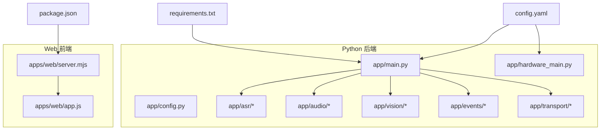
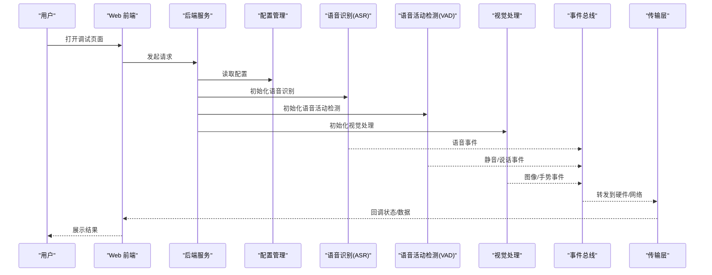
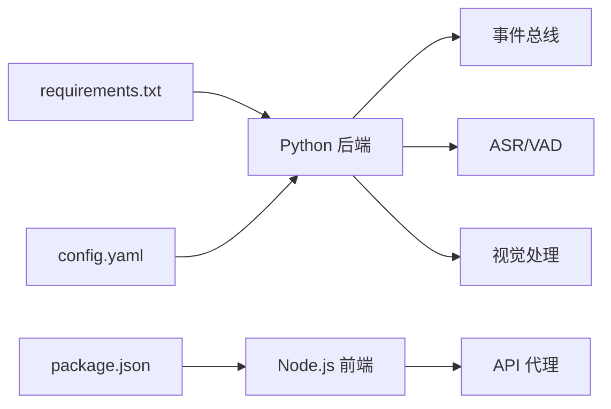

# 快速开始

<cite>
**本文引用的文件**   
- [README.md](file://README.md)
- [config.yaml](file://config.yaml)
- [requirements.txt](file://requirements.txt)
- [package.json](file://package.json)
- [app/main.py](file://app/main.py)
- [app/hardware_main.py](file://app/hardware_main.py)
- [app/config.py](file://app/config.py)
- [apps/web/server.mjs](file://apps/web/server.mjs)
- [apps/web/app.js](file://apps/web/app.js)
- [scripts/record.py](file://scripts/record.py)
- [scripts/vision_live.py](file://scripts/vision_live.py)
</cite>

## 目录
1. [简介](#简介)
2. [项目结构](#项目结构)
3. [核心组件](#核心组件)
4. [架构总览](#架构总览)
5. [详细组件分析](#详细组件分析)
6. [依赖关系分析](#依赖关系分析)
7. [性能注意事项](#性能注意事项)
8. [故障排除指南](#故障排除指南)
9. [结论](#结论)
10. [附录](#附录) 

## 简介
本快速开始指南面向首次接触 AI 智能桌面设备项目的开发者与使用者，目标是帮助你在最短时间内完成环境准备、依赖安装、配置设置，并成功启动后端服务与 Web 前端，体验语音识别、视觉感知、事件总线等核心能力。文档提供清晰的运行命令、验证方法以及常见问题排查步骤，确保你能够顺利跑通 MVP 流程。

## 项目结构
本项目采用前后端分离的模块化设计：
- Python 后端位于 app 目录，包含 ASR（语音识别）、VAD（语音活动检测）、视觉处理、事件总线、硬件通信等模块。
- Web 前端位于 apps/web 目录，提供本地模拟与调试界面，支持与服务端交互。
- 配置文件集中在根目录 config.yaml，用于统一控制各模块行为。
- 脚本位于 scripts 目录，提供录音、视觉演示等实用工具。

图表来源 
- [app/main.py:1-200](file://app/main.py#L1-L200)
- [app/hardware_main.py:1-200](file://app/hardware_main.py#L1-L200)
- [app/config.py:1-200](file://app/config.py#L1-L200)
- [apps/web/server.mjs:1-200](file://apps/web/server.mjs#L1-L200)
- [apps/web/app.js:1-200](file://apps/web/app.js#L1-L200)
- [config.yaml:1-200](file://config.yaml#L1-L200)
- [requirements.txt:1-200](file://requirements.txt#L1-L200)
- [package.json:1-200](file://package.json#L1-L200)

章节来源
- [README.md:1-200](file://README.md#L1-L200)
- [config.yaml:1-200](file://config.yaml#L1-L200)
- [requirements.txt:1-200](file://requirements.txt#L1-L200)
- [package.json:1-200](file://package.json#L1-L200)

## 核心组件
- 后端主入口：负责初始化配置、加载模块、启动服务与事件循环。
- 硬件主入口：面向嵌入式或模拟硬件场景的启动入口，便于在资源受限环境下运行。
- 配置管理：集中读取 config.yaml，为各模块提供运行时参数。
- Web 服务器：提供本地调试页面与 API 代理，便于前端与后端联调。
- 辅助脚本：录音、视觉演示等工具，帮助快速验证功能。

章节来源
- [app/main.py:1-200](file://app/main.py#L1-L200)
- [app/hardware_main.py:1-200](file://app/hardware_main.py#L1-L200)
- [app/config.py:1-200](file://app/config.py#L1-L200)
- [apps/web/server.mjs:1-200](file://apps/web/server.mjs#L1-L200)
- [scripts/record.py:1-200](file://scripts/record.py#L1-L200)
- [scripts/vision_live.py:1-200](file://scripts/vision_live.py#L1-L200)

## 架构总览
系统由“感知层（ASR/VAD/视觉）—事件总线—应用控制器—传输层（硬件/网络）—Web 前端”构成。配置中心驱动各模块行为，脚本与测试用例辅助验证。

图表来源 
- [app/main.py:1-200](file://app/main.py#L1-L200)
- [app/config.py:1-200](file://app/config.py#L1-L200)
- [apps/web/server.mjs:1-200](file://apps/web/server.mjs#L1-L200)

## 详细组件分析

### 后端主入口（app/main.py）
- 职责：加载配置、初始化感知模块（ASR/VAD/视觉）、启动事件总线与传输层、暴露必要的接口供 Web 调用。
- 关键点：
  - 配置读取：从 config.yaml 获取端口、模型路径、日志级别等。
  - 模块初始化：按需启用 Mock 或真实后端，便于开发与部署切换。
  - 事件驱动：通过事件总线解耦各模块，提升可维护性与扩展性。
- 运行方式：直接执行 python -m app 或 python app/main.py。

章节来源
- [app/main.py:1-200](file://app/main.py#L1-L200)
- [app/config.py:1-200](file://app/config.py#L1-L200)

### 硬件主入口（app/hardware_main.py）
- 职责：面向嵌入式或模拟硬件的运行模式，精简依赖与资源占用。
- 关键点：
  - 轻量启动：仅加载必要模块，避免重型依赖。
  - 传输适配：优先使用本地串口/USB 或模拟源进行数据收发。
- 运行方式：python app/hardware_main.py。

章节来源
- [app/hardware_main.py:1-200](file://app/hardware_main.py#L1-L200)

### 配置管理（app/config.py）
- 职责：统一解析 config.yaml，提供类型安全的配置访问。
- 关键点：
  - 默认值：为关键参数提供合理默认值，降低配置复杂度。
  - 校验：对必填项进行基础校验，提前发现配置错误。
- 常用键：服务端口、ASR/VAD 后端选择、模型路径、日志级别、Web 代理地址等。

章节来源
- [app/config.py:1-200](file://app/config.py#L1-L200)
- [config.yaml:1-200](file://config.yaml#L1-L200)

### Web 前端（apps/web/server.mjs 与 apps/web/app.js）
- 职责：提供本地调试页面、API 代理、模拟器与可视化展示。
- 关键点：
  - 静态资源：托管 index.html、styles.css、manifest.webmanifest。
  - API 代理：将前端请求转发至后端服务，解决跨域问题。
  - 模拟器：内置 sleep-simulator、thermal-content 等，便于离线调试。
- 运行方式：node apps/web/server.mjs，浏览器访问 http://localhost:端口。

章节来源
- [apps/web/server.mjs:1-200](file://apps/web/server.mjs#L1-L200)
- [apps/web/app.js:1-200](file://apps/web/app.js#L1-L200)
- [package.json:1-200](file://package.json#L1-L200)

### 辅助脚本（scripts/record.py 与 scripts/vision_live.py）
- 录音脚本：采集麦克风音频，输出 WAV/PCM，便于 ASR 测试。
- 视觉脚本：实时捕获摄像头画面，进行简单处理与展示。
- 运行方式：python scripts/record.py、python scripts/vision_live.py。

章节来源
- [scripts/record.py:1-200](file://scripts/record.py#L1-L200)
- [scripts/vision_live.py:1-200](file://scripts/vision_live.py#L1-L200)

## 依赖关系分析
- Python 依赖：通过 requirements.txt 管理，包含 ASR、VAD、视觉库与 Web 框架。
- Node.js 依赖：通过 package.json 管理，提供 Web 服务器与调试工具。
- 配置依赖：config.yaml 决定后端行为，如后端选择、模型路径、端口等。

图表来源 
- [requirements.txt:1-200](file://requirements.txt#L1-L200)
- [package.json:1-200](file://package.json#L1-L200)
- [config.yaml:1-200](file://config.yaml#L1-L200)
- [app/main.py:1-200](file://app/main.py#L1-L200)
- [apps/web/server.mjs:1-200](file://apps/web/server.mjs#L1-L200)

章节来源
- [requirements.txt:1-200](file://requirements.txt#L1-L200)
- [package.json:1-200](file://package.json#L1-L200)
- [config.yaml:1-200](file://config.yaml#L1-L200)

## 性能注意事项
- 模型加载：ASR 与视觉模型体积较大，建议在 SSD 上运行并预热缓存。
- 并发与线程：事件总线与传输层建议合理设置线程池大小，避免阻塞。
- 资源限制：在嵌入式模式下关闭非必要模块，减少内存与 CPU 占用。
- 日志级别：生产环境降低日志级别，避免 I/O 瓶颈。

[本节为通用指导，不直接分析具体文件]

## 故障排除指南
- 无法启动后端：
  - 检查 config.yaml 中的端口是否被占用。
  - 确认 Python 依赖已正确安装（pip install -r requirements.txt）。
  - 查看日志输出，定位模块初始化失败原因。
- Web 前端无法连接后端：
  - 确认后端服务已启动且端口一致。
  - 检查 server.mjs 中的代理地址是否正确。
  - 浏览器控制台查看 CORS 或网络错误。
- 语音识别无输出：
  - 确认麦克风权限与设备选择。
  - 尝试使用 scripts/record.py 验证音频采集。
  - 检查 ASR 后端配置（Mock 或真实模型）。
- 视觉处理无画面：
  - 确认摄像头可用，尝试 scripts/vision_live.py。
  - 检查视觉后端配置与模型路径。

章节来源
- [app/config.py:1-200](file://app/config.py#L1-L200)
- [apps/web/server.mjs:1-200](file://apps/web/server.mjs#L1-L200)
- [scripts/record.py:1-200](file://scripts/record.py#L1-L200)
- [scripts/vision_live.py:1-200](file://scripts/vision_live.py#L1-L200)

## 结论
通过本快速开始指南，你可以在短时间内完成环境搭建、依赖安装与配置设置，并成功启动后端与 Web 前端，体验语音识别、视觉感知与事件驱动的核心能力。遇到问题时，参考故障排除指南逐步定位与解决。

[本节为总结性内容，不直接分析具体文件]

## 附录

### 环境准备
- Python 3.9+ 与 pip
- Node.js 18+ 与 npm
- 可选：摄像头、麦克风、ESP32-S3 开发板（用于硬件联调）

### 依赖安装
- Python 依赖：pip install -r requirements.txt
- Node.js 依赖：cd apps/web && npm install

### 配置文件设置
- 编辑 config.yaml，设置服务端口、ASR/VAD 后端、模型路径、日志级别等。
- 如需使用 Mock 后端，可在配置中切换为 mock_backend。

### 基本运行命令
- 启动后端：python -m app 或 python app/main.py
- 启动硬件模式：python app/hardware_main.py
- 启动 Web 前端：cd apps/web && node server.mjs
- 访问调试页面：浏览器打开 http://localhost:端口

### 验证方法
- 后端健康检查：curl http://localhost:端口/api/health
- 前端联调：打开 http://localhost:端口，观察控制台输出与页面反馈
- 录音测试：python scripts/record.py，播放音频后检查 ASR 输出
- 视觉测试：python scripts/vision_live.py，观察摄像头画面

章节来源
- [config.yaml:1-200](file://config.yaml#L1-L200)
- [requirements.txt:1-200](file://requirements.txt#L1-L200)
- [package.json:1-200](file://package.json#L1-L200)
- [app/main.py:1-200](file://app/main.py#L1-L200)
- [app/hardware_main.py:1-200](file://app/hardware_main.py#L1-L200)
- [apps/web/server.mjs:1-200](file://apps/web/server.mjs#L1-L200)
- [scripts/record.py:1-200](file://scripts/record.py#L1-L200)
- [scripts/vision_live.py:1-200](file://scripts/vision_live.py#L1-L200)