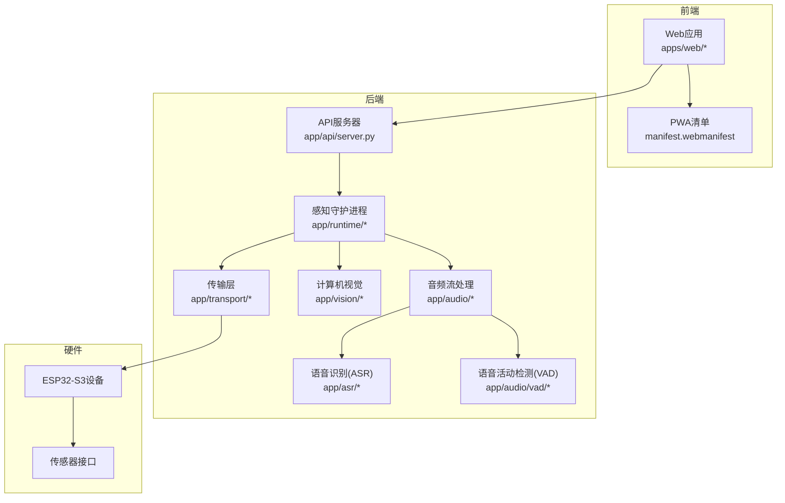
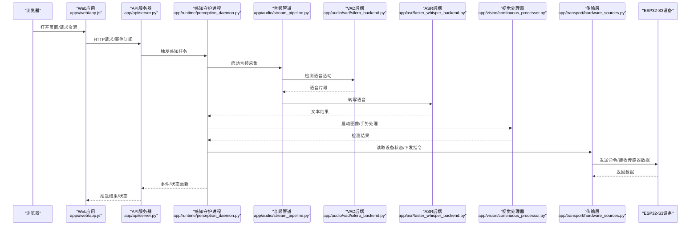
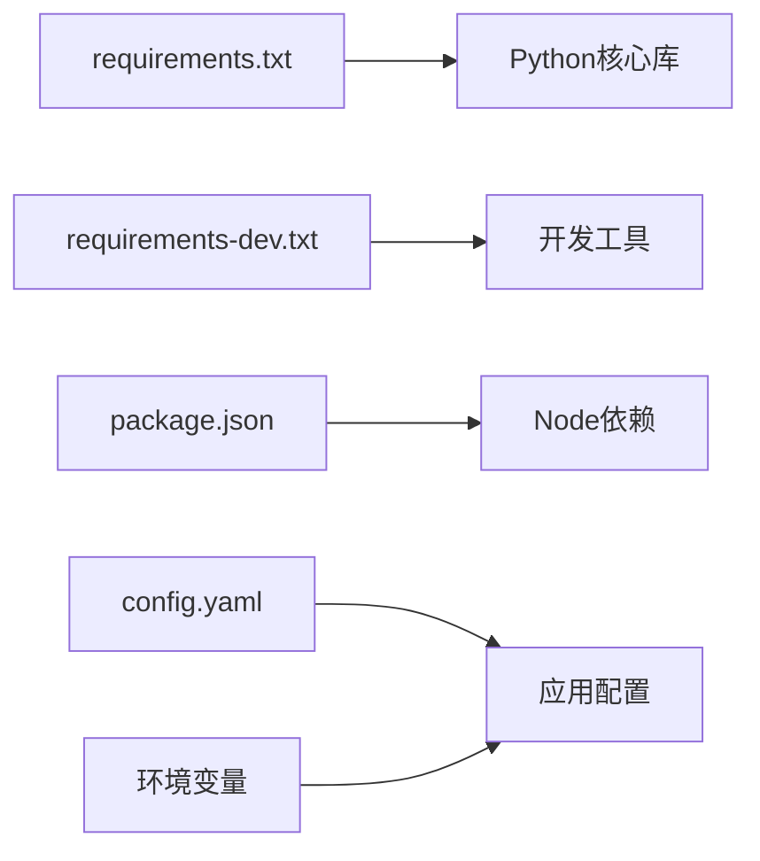

# 技术栈

<cite>
**本文引用的文件**   
- [README.md](file://README.md)
- [requirements.txt](file://requirements.txt)
- [requirements-dev.txt](file://requirements-dev.txt)
- [config.yaml](file://config.yaml)
- [package.json](file://package.json)
- [app/main.py](file://app/main.py)
- [app/hardware_main.py](file://app/hardware_main.py)
- [app/config.py](file://app/config.py)
- [app/factories.py](file://app/factories.py)
- [app/api/server.py](file://app/api/server.py)
- [app/asr/base.py](file://app/asr/base.py)
- [app/asr/faster_whisper_backend.py](file://app/asr/faster_whisper_backend.py)
- [app/asr/mock_backend.py](file://app/asr/mock_backend.py)
- [app/audio/stream_pipeline.py](file://app/audio/stream_pipeline.py)
- [app/audio/keyword_asr.py](file://app/audio/keyword_asr.py)
- [app/audio/vad/base.py](file://app/audio/vad/base.py)
- [app/audio/vad/silero_backend.py](file://app/audio/vad/silero_backend.py)
- [app/audio/vad/mock_backend.py](file://app/audio/vad/mock_backend.py)
- [app/vision/base.py](file://app/vision/base.py)
- [app/vision/continuous_processor.py](file://app/vision/continuous_processor.py)
- [app/vision/mediapipe_gesture.py](file://app/vision/mediapipe_gesture.py)
- [app/vision/image_loader.py](file://app/vision/image_loader.py)
- [app/vision/gesture_stabilizer.py](file://app/vision/gesture_stabilizer.py)
- [app/vision/mock_backend.py](file://app/vision/mock_backend.py)
- [app/transport/sources.py](file://app/transport/sources.py)
- [app/transport/hardware_sources.py](file://app/transport/hardware_sources.py)
- [apps/web/app.js](file://apps/web/app.js)
- [apps/web/server.mjs](file://apps/web/server.mjs)
- [apps/web/services/device-bus.js](file://apps/web/services/device-bus.js)
- [apps/web/services/api-client.js](file://apps/web/services/api-client.js)
- [apps/web/manifest.webmanifest](file://apps/web/manifest.webmanifest)
- [AI_Hardware_Community_Project/07_Hardware/ESP32-S3接入设计.md](file://AI_Hardware_Community_Project/07_Hardware/ESP32-S3接入设计.md)
- [AI_Hardware_Community_Project/07_Hardware/MVP设备模拟协议.md](file://AI_Hardware_Community_Project/07_Hardware/MVP设备模拟协议.md)
- [AI_Hardware_Community_Project/07_Hardware/Web与ESP32通信方案.md](file://AI_Hardware_Community_Project/07_Hardware/Web与ESP32通信方案.md)
- [AI_Hardware_Community_Project/09_API/openapi.yaml](file://AI_Hardware_Community_Project/09_API/openapi.yaml)
- [AI_Hardware_Community_Project/09_API/API设计规范.md](file://AI_Hardware_Community_Project/09_API/API设计规范.md)
- [AI_Hardware_Community_Project/08_Server/生产部署与DevOps.md](file://AI_Hardware_Community_Project/08_Server/生产部署与DevOps.md)
</cite>

## 目录
1. [简介](#简介)
2. [项目结构](#项目结构)
3. [核心组件](#核心组件)
4. [架构总览](#架构总览)
5. [详细组件分析](#详细组件分析)
6. [依赖关系分析](#依赖关系分析)
7. [性能考量](#性能考量)
8. [故障排查指南](#故障排查指南)
9. [结论](#结论)
10. [附录](#附录)

## 简介
本技术栈文档面向“AI智能桌面设备”项目，覆盖后端技术选型（Python框架、ASR引擎、VAD算法、计算机视觉库）、前端技术栈（JavaScript、Web API、PWA支持）、硬件集成方案（ESP32-S3、传感器接口、通信协议），并给出各组件的选择理由、版本兼容性与依赖关系。同时提供开发环境要求、系统依赖与第三方服务配置说明，以及技术栈架构图与组件交互说明，帮助开发者快速理解并上手。

## 项目结构
项目采用前后端分离与模块化组织：
- 后端核心位于 app/ 目录，按功能域划分模块（asr、audio、vision、transport、api、runtime等）。
- 前端位于 apps/web/，包含服务端渲染入口、静态资源、PWA清单与服务端脚本。
- 硬件相关设计与协议定义在 AI_Hardware_Community_Project/07_Hardware 中。
- API 规范与OpenAPI定义在 AI_Hardware_Community_Project/09_API 中。
- 部署与运维指南在 AI_Hardware_Community_Project/08_Server 中。

图表来源
- [app/api/server.py](file://app/api/server.py)
- [app/runtime/perception_daemon.py](file://app/runtime/perception_daemon.py)
- [app/audio/stream_pipeline.py](file://app/audio/stream_pipeline.py)
- [app/asr/base.py](file://app/asr/base.py)
- [app/audio/vad/base.py](file://app/audio/vad/base.py)
- [app/vision/base.py](file://app/vision/base.py)
- [app/transport/sources.py](file://app/transport/sources.py)
- [apps/web/app.js](file://apps/web/app.js)
- [apps/web/manifest.webmanifest](file://apps/web/manifest.webmanifest)

章节来源
- [README.md](file://README.md)
- [package.json](file://package.json)
- [requirements.txt](file://requirements.txt)
- [requirements-dev.txt](file://requirements-dev.txt)

## 核心组件
- 后端框架与运行时
  - Python应用主入口与硬件入口分别位于 app/main.py 与 app/hardware_main.py，负责初始化配置、启动感知守护进程与API服务。
  - 配置管理由 app/config.py 与 config.yaml 驱动，统一加载环境变量与配置文件。
  - 工厂模式用于按需创建ASR、VAD、Vision等后端实现，便于Mock与真实实现切换。
- 语音处理
  - ASR后端抽象在 app/asr/base.py，具体实现包括 faster_whisper_backend.py 与 mock_backend.py。
  - VAD抽象在 app/audio/vad/base.py，具体实现包括 silero_backend.py 与 mock_backend.py。
  - 音频流管道与关键词唤醒逻辑在 app/audio/stream_pipeline.py 与 app/audio/keyword_asr.py。
- 计算机视觉
  - Vision抽象在 app/vision/base.py，具体实现包括 mediapipe_gesture.py、image_loader.py、gesture_stabilizer.py 与 mock_backend.py。
  - 连续处理器 continuous_processor.py 负责帧级处理流水线。
- 传输与硬件集成
  - 传输抽象在 app/transport/sources.py，硬件源在 app/transport/hardware_sources.py，对接ESP32-S3设备与传感器数据。
- 前端与PWA
  - Web应用入口为 apps/web/app.js，服务端脚本为 apps/web/server.mjs，PWA清单为 apps/web/manifest.webmanifest。
  - 设备总线与API客户端在 apps/web/services/device-bus.js 与 apps/web/services/api-client.js。

章节来源
- [app/main.py](file://app/main.py)
- [app/hardware_main.py](file://app/hardware_main.py)
- [app/config.py](file://app/config.py)
- [config.yaml](file://config.yaml)
- [app/factories.py](file://app/factories.py)
- [app/asr/base.py](file://app/asr/base.py)
- [app/asr/faster_whisper_backend.py](file://app/asr/faster_whisper_backend.py)
- [app/asr/mock_backend.py](file://app/asr/mock_backend.py)
- [app/audio/stream_pipeline.py](file://app/audio/stream_pipeline.py)
- [app/audio/keyword_asr.py](file://app/audio/keyword_asr.py)
- [app/audio/vad/base.py](file://app/audio/vad/base.py)
- [app/audio/vad/silero_backend.py](file://app/audio/vad/silero_backend.py)
- [app/audio/vad/mock_backend.py](file://app/audio/vad/mock_backend.py)
- [app/vision/base.py](file://app/vision/base.py)
- [app/vision/continuous_processor.py](file://app/vision/continuous_processor.py)
- [app/vision/mediapipe_gesture.py](file://app/vision/mediapipe_gesture.py)
- [app/vision/image_loader.py](file://app/vision/image_loader.py)
- [app/vision/gesture_stabilizer.py](file://app/vision/gesture_stabilizer.py)
- [app/vision/mock_backend.py](file://app/vision/mock_backend.py)
- [app/transport/sources.py](file://app/transport/sources.py)
- [app/transport/hardware_sources.py](file://app/transport/hardware_sources.py)
- [apps/web/app.js](file://apps/web/app.js)
- [apps/web/server.mjs](file://apps/web/server.mjs)
- [apps/web/manifest.webmanifest](file://apps/web/manifest.webmanifest)
- [apps/web/services/device-bus.js](file://apps/web/services/device-bus.js)
- [apps/web/services/api-client.js](file://apps/web/services/api-client.js)

## 架构总览
整体架构分为三层：前端Web/PWA、后端服务与感知运行时、硬件设备层。前端通过REST或WebSocket与后端API交互；后端通过感知守护进程调度音频、视觉与传输子系统；硬件层通过ESP32-S3采集传感器数据并以协议格式上报。

图表来源
- [app/api/server.py](file://app/api/server.py)
- [app/runtime/perception_daemon.py](file://app/runtime/perception_daemon.py)
- [app/audio/stream_pipeline.py](file://app/audio/stream_pipeline.py)
- [app/audio/vad/silero_backend.py](file://app/audio/vad/silero_backend.py)
- [app/asr/faster_whisper_backend.py](file://app/asr/faster_whisper_backend.py)
- [app/vision/continuous_processor.py](file://app/vision/continuous_processor.py)
- [app/transport/hardware_sources.py](file://app/transport/hardware_sources.py)
- [apps/web/app.js](file://apps/web/app.js)

## 详细组件分析

### 后端框架与运行时
- 主入口与硬件入口
  - app/main.py：常规运行模式，启动API服务与感知守护进程。
  - app/hardware_main.py：硬件模式，侧重设备采集与低延迟处理。
- 配置与工厂
  - app/config.py：集中加载配置，支持环境变量与yaml。
  - app/factories.py：根据配置动态选择ASR/VAD/Vision后端实现。

章节来源
- [app/main.py](file://app/main.py)
- [app/hardware_main.py](file://app/hardware_main.py)
- [app/config.py](file://app/config.py)
- [config.yaml](file://config.yaml)
- [app/factories.py](file://app/factories.py)

### 语音识别（ASR）
- 抽象与实现
  - app/asr/base.py：定义统一的ASR接口。
  - app/asr/faster_whisper_backend.py：基于Whisper的高效本地推理实现。
  - app/asr/mock_backend.py：开发调试用的Mock实现。
- 选择理由
  - Faster Whisper具备高准确率与较低延迟，适合桌面设备本地部署；Mock用于快速验证流程。

章节来源
- [app/asr/base.py](file://app/asr/base.py)
- [app/asr/faster_whisper_backend.py](file://app/asr/faster_whisper_backend.py)
- [app/asr/mock_backend.py](file://app/asr/mock_backend.py)

### 语音活动检测（VAD）
- 抽象与实现
  - app/audio/vad/base.py：定义VAD接口。
  - app/audio/vad/silero_backend.py：使用Silero VAD进行实时语音活动检测。
  - app/audio/vad/mock_backend.py：Mock实现用于测试。
- 选择理由
  - Silero VAD轻量高效，适合嵌入式与桌面场景；Mock便于单元测试与端到端联调。

章节来源
- [app/audio/vad/base.py](file://app/audio/vad/base.py)
- [app/audio/vad/silero_backend.py](file://app/audio/vad/silero_backend.py)
- [app/audio/vad/mock_backend.py](file://app/audio/vad/mock_backend.py)

### 音频流处理与关键词唤醒
- 音频管道
  - app/audio/stream_pipeline.py：构建音频采集、VAD切分、ASR转写的流水线。
- 关键词唤醒
  - app/audio/keyword_asr.py：结合关键词检测与ASR，降低误唤醒率。

章节来源
- [app/audio/stream_pipeline.py](file://app/audio/stream_pipeline.py)
- [app/audio/keyword_asr.py](file://app/audio/keyword_asr.py)

### 计算机视觉（手势与图像）
- 抽象与实现
  - app/vision/base.py：定义视觉处理接口。
  - app/vision/continuous_processor.py：帧级连续处理，支持批处理与状态保持。
  - app/vision/mediapipe_gesture.py：基于MediaPipe的手势识别。
  - app/vision/image_loader.py：图像加载与预处理。
  - app/vision/gesture_stabilizer.py：手势稳定性优化，减少抖动。
  - app/vision/mock_backend.py：Mock实现用于测试。
- 选择理由
  - MediaPipe提供跨平台、高性能的媒体处理模型；稳定器提升用户体验。

章节来源
- [app/vision/base.py](file://app/vision/base.py)
- [app/vision/continuous_processor.py](file://app/vision/continuous_processor.py)
- [app/vision/mediapipe_gesture.py](file://app/vision/mediapipe_gesture.py)
- [app/vision/image_loader.py](file://app/vision/image_loader.py)
- [app/vision/gesture_stabilizer.py](file://app/vision/gesture_stabilizer.py)
- [app/vision/mock_backend.py](file://app/vision/mock_backend.py)

### 传输层与硬件集成（ESP32-S3）
- 传输抽象与硬件源
  - app/transport/sources.py：定义传输抽象，统一数据源接口。
  - app/transport/hardware_sources.py：对接ESP32-S3设备，处理传感器数据与指令下发。
- 硬件设计与协议
  - AI_Hardware_Community_Project/07_Hardware/ESP32-S3接入设计.md：设备接入与引脚映射。
  - AI_Hardware_Community_Project/07_Hardware/MVP设备模拟协议.md：MVP阶段模拟协议。
  - AI_Hardware_Community_Project/07_Hardware/Web与ESP32通信方案.md：Web与设备的通信路径。

章节来源
- [app/transport/sources.py](file://app/transport/sources.py)
- [app/transport/hardware_sources.py](file://app/transport/hardware_sources.py)
- [AI_Hardware_Community_Project/07_Hardware/ESP32-S3接入设计.md](file://AI_Hardware_Community_Project/07_Hardware/ESP32-S3接入设计.md)
- [AI_Hardware_Community_Project/07_Hardware/MVP设备模拟协议.md](file://AI_Hardware_Community_Project/07_Hardware/MVP设备模拟协议.md)
- [AI_Hardware_Community_Project/07_Hardware/Web与ESP32通信方案.md](file://AI_Hardware_Community_Project/07_Hardware/Web与ESP32通信方案.md)

### 前端与PWA
- Web应用与服务端
  - apps/web/app.js：前端应用逻辑，设备总线与API调用。
  - apps/web/server.mjs：Node服务端，提供静态资源与代理转发。
- PWA支持
  - apps/web/manifest.webmanifest：PWA清单，定义名称、图标、启动页等。
- 服务与工具
  - apps/web/services/device-bus.js：设备事件总线，统一设备消息路由。
  - apps/web/services/api-client.js：API客户端封装，简化HTTP调用。

章节来源
- [apps/web/app.js](file://apps/web/app.js)
- [apps/web/server.mjs](file://apps/web/server.mjs)
- [apps/web/manifest.webmanifest](file://apps/web/manifest.webmanifest)
- [apps/web/services/device-bus.js](file://apps/web/services/device-bus.js)
- [apps/web/services/api-client.js](file://apps/web/services/api-client.js)

## 依赖关系分析
- Python依赖
  - requirements.txt：列出运行时依赖（如ASR、VAD、Vision库）。
  - requirements-dev.txt：开发期依赖（测试、Lint、打包工具）。
- Node依赖
  - package.json：前端与Node服务依赖，含构建脚本与测试脚本。
- 配置与环境
  - config.yaml：全局配置（模型路径、端口、设备参数等）。
  - 环境变量：由 app/config.py 加载，覆盖yaml默认值。

图表来源
- [requirements.txt](file://requirements.txt)
- [requirements-dev.txt](file://requirements-dev.txt)
- [package.json](file://package.json)
- [config.yaml](file://config.yaml)
- [app/config.py](file://app/config.py)

章节来源
- [requirements.txt](file://requirements.txt)
- [requirements-dev.txt](file://requirements-dev.txt)
- [package.json](file://package.json)
- [config.yaml](file://config.yaml)
- [app/config.py](file://app/config.py)

## 性能考量
- ASR与VAD
  - 使用本地推理（Faster Whisper、Silero VAD）以降低网络延迟与带宽占用；合理设置采样率与窗口大小以平衡精度与性能。
- 视觉处理
  - 帧率控制与批处理策略；手势稳定器减少抖动带来的重复计算。
- 传输层
  - 设备通信采用轻量协议与批量上报，避免频繁小包导致CPU与网络开销。
- 前端
  - PWA缓存静态资源与关键API响应，提升首屏加载与离线可用性。

[本节为通用指导，不直接分析具体文件]

## 故障排查指南
- 配置问题
  - 检查 config.yaml 与变量覆盖是否正确；确认模型路径与设备参数。
- ASR/VAD异常
  - 切换至Mock后端验证流程；查看日志定位输入格式与超时问题。
- 视觉处理卡顿
  - 调整帧率与批大小；检查图像加载与预处理是否阻塞。
- 设备通信失败
  - 核对ESP32-S3协议与端口；使用MVP模拟协议进行断点测试。
- 前端PWA失效
  - 检查 manifest.webmanifest 与Service Worker注册；确保HTTPS与正确路径。

章节来源
- [config.yaml](file://config.yaml)
- [app/config.py](file://app/config.py)
- [app/asr/mock_backend.py](file://app/asr/mock_backend.py)
- [app/audio/vad/mock_backend.py](file://app/audio/vad/mock_backend.py)
- [app/vision/mock_backend.py](file://app/vision/mock_backend.py)
- [AI_Hardware_Community_Project/07_Hardware/MVP设备模拟协议.md](file://AI_Hardware_Community_Project/07_Hardware/MVP设备模拟协议.md)
- [apps/web/manifest.webmanifest](file://apps/web/manifest.webmanifest)

## 结论
本项目采用模块化与抽象化的技术栈设计，后端以Python为核心，结合Faster Whisper与Silero VAD实现高效语音处理，MediaPipe支撑手势识别；前端基于Node与JavaScript，提供PWA能力；硬件层通过ESP32-S3与传感器接口完成数据采集与指令执行。清晰的抽象与工厂模式使得Mock与真实实现可无缝切换，便于开发与测试。建议在生产环境中关注模型加载、内存占用与设备通信稳定性，持续优化流水线与缓存策略。

[本节为总结性内容，不直接分析具体文件]

## 附录
- 开发环境要求
  - Python版本与依赖安装参考 requirements.txt 与 requirements-dev.txt。
  - Node.js与npm/yarn安装参考 package.json 脚本。
- 系统依赖
  - 操作系统：Linux/macOS/Windows（注意CUDA/GPU可选依赖）。
  - 硬件：ESP32-S3开发板、麦克风、摄像头。
- 第三方服务配置
  - ASR/VAD模型下载与路径配置见 config.yaml。
  - API规范与OpenAPI定义见 AI_Hardware_Community_Project/09_API/openapi.yaml 与 API设计规范.md。
- 部署与运维
  - 生产部署与容器化参考 AI_Hardware_Community_Project/08_Server/生产部署与DevOps.md。

章节来源
- [requirements.txt](file://requirements.txt)
- [requirements-dev.txt](file://requirements-dev.txt)
- [package.json](file://package.json)
- [config.yaml](file://config.yaml)
- [AI_Hardware_Community_Project/09_API/openapi.yaml](file://AI_Hardware_Community_Project/09_API/openapi.yaml)
- [AI_Hardware_Community_Project/09_API/API设计规范.md](file://AI_Hardware_Community_Project/09_API/API设计规范.md)
- [AI_Hardware_Community_Project/08_Server/生产部署与DevOps.md](file://AI_Hardware_Community_Project/08_Server/生产部署与DevOps.md)