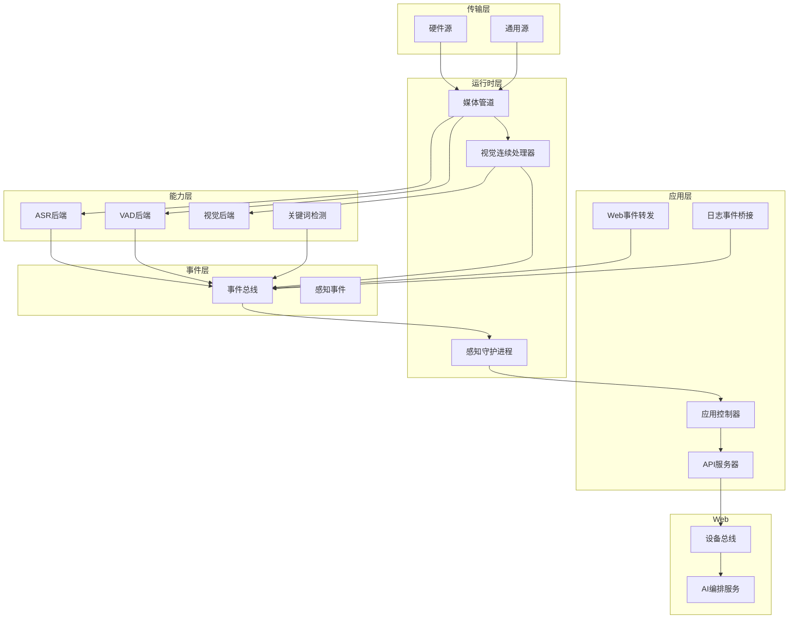
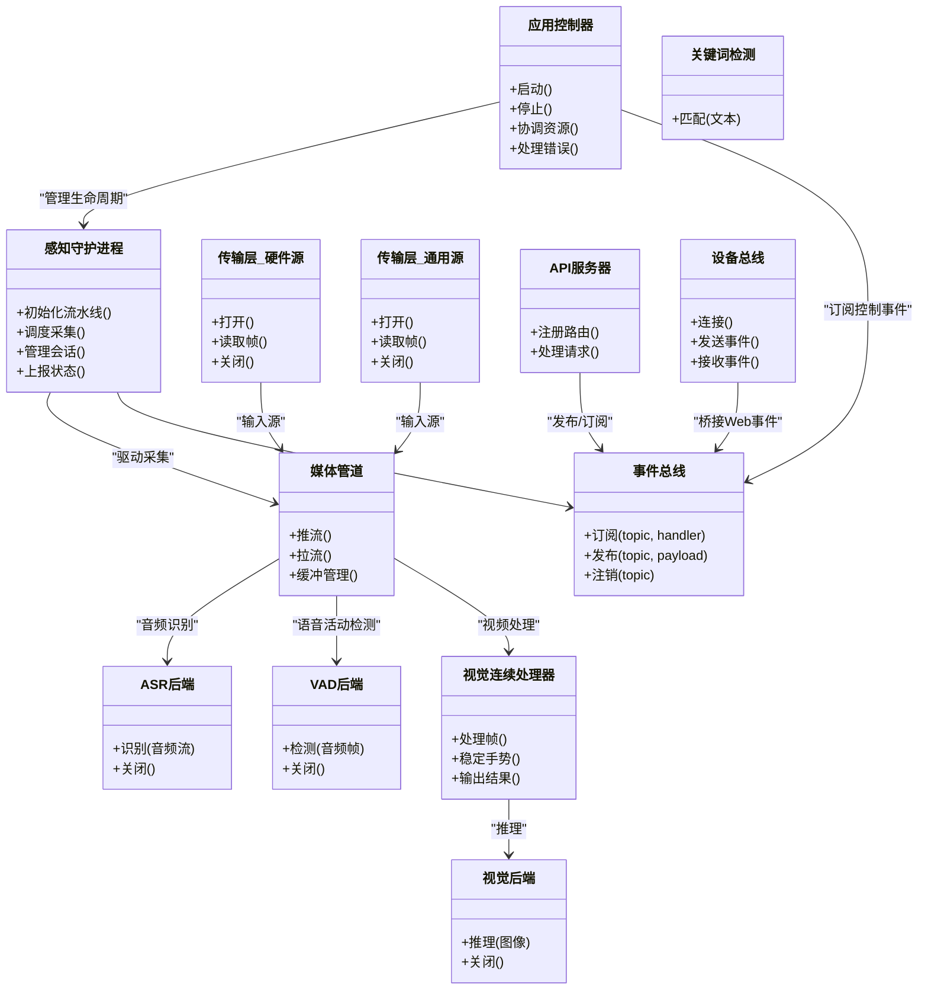

# 架构概览

<cite>
**本文引用的文件**   
- [应用控制器](file://app/control/application_controller.py)
- [感知守护进程](file://app/runtime/perception_daemon.py)
- [事件总线](file://app/events/event_bus.py)
- [传输层-硬件源](file://app/transport/hardware_sources.py)
- [传输层-通用源](file://app/transport/sources.py)
- [ASR基类与后端](file://app/asr/base.py)
- [ASR-Mock后端](file://app/asr/mock_backend.py)
- [VAD基类与Silero后端](file://app/audio/vad/base.py)
- [VAD-Mock后端](file://app/audio/vad/mock_backend.py)
- [视觉处理流水线](file://app/vision/continuous_processor.py)
- [手势稳定器](file://app/vision/gesture_stabilizer.py)
- [媒体管道](file://app/audio/stream_pipeline.py)
- [关键词检测](file://app/detection/keywords.py)
- [相机功能插件](file://app/features/photo_capture.py)
- [配置模块](file://app/config.py)
- [工厂模块](file://app/factories.py)
- [主入口](file://app/main.py)
- [硬件主入口](file://app/hardware_main.py)
- [模型定义](file://app/models.py)
- [感知事件定义](file://app/perception_events.py)
- [API服务器](file://app/api/server.py)
- [设备总线(Web)](file://apps/web/services/device-bus.js)
- [AI编排服务(Web)](file://apps/web/services/ai-orchestrator.mjs)
- [桌面集成日志桥接](file://integrations/desktop_bot/log_event_bridge.py)
- [桌面集成Web事件转发](file://integrations/desktop_bot/web_event_forwarder.py)
- [系统架构设计文档](file://AI_Hardware_Community_Project/02_Architecture/系统架构设计.md)
</cite>

## 目录
1. [简介](#简介)
2. [项目结构](#项目结构)
3. [核心组件](#核心组件)
4. [架构总览](#架构总览)
5. [详细组件分析](#详细组件分析)
6. [依赖关系分析](#依赖关系分析)
7. [性能考量](#性能考量)
8. [故障排查指南](#故障排查指南)
9. [结论](#结论)
10. [附录](#附录)

## 简介
本文件为AI智能桌面设备的系统架构概览，面向开发者快速理解整体架构、职责划分与交互关系。系统采用模块化、事件驱动与插件化设计，围绕“感知运行时”统一调度音频、语音识别（ASR）、语音活动检测（VAD）、视觉处理等能力，通过“事件总线”解耦各子系统，并以“传输层”对接硬件或模拟源。应用控制器负责生命周期管理与跨域协调，API服务器对外暴露控制与数据接口，Web端通过设备总线与后端协同。

## 项目结构
- 应用层：应用控制器、API服务器、Web集成桥接
- 运行时层：感知守护进程、媒体管道、视觉连续处理器
- 能力层：ASR/VAD/视觉/关键词检测等可插拔后端
- 传输层：硬件源与通用源抽象
- 事件层：事件总线与事件定义
- 配置与工厂：集中式配置与对象工厂
- Web前端：设备总线、AI编排、Mock API与服务端脚本



图表来源 
- [应用控制器](file://app/control/application_controller.py)
- [感知守护进程](file://app/runtime/perception_daemon.py)
- [事件总线](file://app/events/event_bus.py)
- [传输层-硬件源](file://app/transport/hardware_sources.py)
- [传输层-通用源](file://app/transport/sources.py)
- [媒体管道](file://app/audio/stream_pipeline.py)
- [视觉连续处理器](file://app/vision/continuous_processor.py)
- [ASR基类与后端](file://app/asr/base.py)
- [ASR-Mock后端](file://app/asr/mock_backend.py)
- [VAD基类与Silero后端](file://app/audio/vad/base.py)
- [VAD-Mock后端](file://app/audio/vad/mock_backend.py)
- [关键词检测](file://app/detection/keywords.py)
- [感知事件定义](file://app/perception_events.py)
- [设备总线(Web)](file://apps/web/services/device-bus.js)
- [AI编排服务(Web)](file://apps/web/services/ai-orchestrator.mjs)
- [桌面集成日志桥接](file://integrations/desktop_bot/log_event_bridge.py)
- [桌面集成Web事件转发](file://integrations/desktop_bot/web_event_forwarder.py)

章节来源
- [系统架构设计文档](file://AI_Hardware_Community_Project/02_Architecture/系统架构设计.md)

## 核心组件
- 应用控制器：管理感知运行时的启动/停止、资源协调、状态同步与错误恢复
- 感知守护进程：统一调度媒体采集、VAD/ASR/视觉处理流水线，维护会话与上下文
- 事件总线：发布/订阅机制，承载感知事件、控制指令与状态变更
- 传输层：抽象硬件与通用数据源，提供统一的帧/流接入
- 能力后端：ASR、VAD、视觉、关键词检测等以插件形式注册与切换
- API服务器：对外REST/WebSocket接口，供Web端与外部系统集成
- Web设备总线：浏览器侧事件通道，连接AI编排与后端事件总线

章节来源
- [应用控制器](file://app/control/application_controller.py)
- [感知守护进程](file://app/runtime/perception_daemon.py)
- [事件总线](file://app/events/event_bus.py)
- [传输层-硬件源](file://app/transport/hardware_sources.py)
- [传输层-通用源](file://app/transport/sources.py)
- [媒体管道](file://app/audio/stream_pipeline.py)
- [视觉连续处理器](file://app/vision/continuous_processor.py)
- [ASR基类与后端](file://app/asr/base.py)
- [ASR-Mock后端](file://app/asr/mock_backend.py)
- [VAD基类与Silero后端](file://app/audio/vad/base.py)
- [VAD-Mock后端](file://app/audio/vad/mock_backend.py)
- [关键词检测](file://app/detection/keywords.py)
- [API服务器](file://app/api/server.py)
- [设备总线(Web)](file://apps/web/services/device-bus.js)
- [AI编排服务(Web)](file://apps/web/services/ai-orchestrator.mjs)

## 架构总览
系统遵循“模块化+事件驱动+插件化”的设计原则：
- 模块化：按能力拆分（音频、视觉、传输、事件、控制），降低耦合
- 事件驱动：以事件总线为核心，异步解耦生产与消费
- 插件化：ASR/VAD/视觉等后端通过工厂与基类实现热插拔



图表来源 
- [应用控制器](file://app/control/application_controller.py)
- [感知守护进程](file://app/runtime/perception_daemon.py)
- [事件总线](file://app/events/event_bus.py)
- [传输层-硬件源](file://app/transport/hardware_sources.py)
- [传输层-通用源](file://app/transport/sources.py)
- [媒体管道](file://app/audio/stream_pipeline.py)
- [视觉连续处理器](file://app/vision/continuous_processor.py)
- [ASR基类与后端](file://app/asr/base.py)
- [ASR-Mock后端](file://app/asr/mock_backend.py)
- [VAD基类与Silero后端](file://app/audio/vad/base.py)
- [VAD-Mock后端](file://app/audio/vad/mock_backend.py)
- [视觉后端](file://app/vision/mediapipe_gesture.py)
- [API服务器](file://app/api/server.py)
- [设备总线(Web)](file://apps/web/services/device-bus.js)

## 详细组件分析

### 应用控制器
- 职责：启动/停止感知运行时，协调资源分配，监听关键事件并触发恢复策略
- 交互：与感知守护进程、事件总线、API服务器协作
- 错误处理：捕获异常、降级到Mock后端、重启子任务

章节来源
- [应用控制器](file://app/control/application_controller.py)
- [事件总线](file://app/events/event_bus.py)
- [API服务器](file://app/api/server.py)

### 感知守护进程
- 职责：统一调度媒体管道、VAD/ASR/视觉处理，维护会话上下文与状态
- 数据流：从传输层获取帧，经VAD/ASR/视觉处理后，发布感知事件
- 扩展点：新增处理能力时，通过事件总线注册处理器即可

章节来源
- [感知守护进程](file://app/runtime/perception_daemon.py)
- [媒体管道](file://app/audio/stream_pipeline.py)
- [感知事件定义](file://app/perception_events.py)

### 事件总线
- 职责：提供主题化的发布/订阅机制，支持多消费者与顺序保证
- 使用场景：感知事件、控制指令、状态更新、错误告警
- 可靠性：支持重试、去重、持久化缓存（可选）

章节来源
- [事件总线](file://app/events/event_bus.py)
- [感知事件定义](file://app/perception_events.py)

### 传输层
- 硬件源：对接摄像头、麦克风等硬件设备，提供帧/流读取接口
- 通用源：支持文件回放、网络流、模拟数据等
- 抽象设计：统一打开/读取/关闭生命周期，便于替换与测试

章节来源
- [传输层-硬件源](file://app/transport/hardware_sources.py)
- [传输层-通用源](file://app/transport/sources.py)

### 能力后端（ASR/VAD/视觉）
- ASR：支持多种后端（如Whisper、Mock），通过基类统一接口
- VAD：Silero或Mock，用于语音活动检测，减少无效处理
- 视觉：连续处理器整合手势稳定与推理后端，输出结构化结果
- 插件化：通过工厂模块动态加载与切换后端

章节来源
- [ASR基类与后端](file://app/asr/base.py)
- [ASR-Mock后端](file://app/asr/mock_backend.py)
- [VAD基类与Silero后端](file://app/audio/vad/base.py)
- [VAD-Mock后端](file://app/audio/vad/mock_backend.py)
- [视觉连续处理器](file://app/vision/continuous_processor.py)
- [手势稳定器](file://app/vision/gesture_stabilizer.py)
- [工厂模块](file://app/factories.py)

### 媒体管道
- 职责：缓冲、分片、分发音频/视频流至各处理器
- 特性：背压控制、丢帧策略、时间戳对齐
- 扩展：新增处理器只需订阅对应主题

章节来源
- [媒体管道](file://app/audio/stream_pipeline.py)

### 关键词检测
- 职责：对ASR输出进行关键词匹配，触发特定动作
- 集成：作为事件处理器订阅ASR结果主题

章节来源
- [关键词检测](file://app/detection/keywords.py)

### 相机功能插件
- 职责：在合适时机触发拍照，将图片事件发布到总线
- 触发条件：手势识别、定时任务或外部指令

章节来源
- [相机功能插件](file://app/features/photo_capture.py)

### API服务器
- 职责：暴露REST/WebSocket接口，供Web端与外部系统集成
- 事件桥接：将HTTP请求转换为事件总线消息，响应事件回调

章节来源
- [API服务器](file://app/api/server.py)
- [事件总线](file://app/events/event_bus.py)

### Web设备总线与AI编排
- 设备总线：浏览器侧事件通道，连接后端事件总线
- AI编排：协调多个AI服务调用，管理会话与状态

章节来源
- [设备总线(Web)](file://apps/web/services/device-bus.js)
- [AI编排服务(Web)](file://apps/web/services/ai-orchestrator.mjs)

### 桌面集成桥接
- 日志事件桥接：将桌面端日志转发至事件总线
- Web事件转发：将Web端事件转发至后端

章节来源
- [桌面集成日志桥接](file://integrations/desktop_bot/log_event_bridge.py)
- [桌面集成Web事件转发](file://integrations/desktop_bot/web_event_forwarder.py)

## 依赖关系分析
- 松耦合：通过事件总线解耦生产者与消费者
- 高内聚：每个能力模块封装完整逻辑
- 可扩展：新增能力仅需实现接口并注册到工厂

```mermaid
graph LR
AC["应用控制器"] --> PD["感知守护进程"]
PD --> EB["事件总线"]
PD --> SP["媒体管道"]
SP --> ASR["ASR后端"]
SP --> VAD["VAD后端"]
SP --> VP["视觉连续处理器"]
VP --> VIS["视觉后端"]
API["API服务器"] --> EB
DB["设备总线(Web)] --> EB
HS["硬件源"] --> SP
SRC["通用源"] --> SP
```

图表来源 
- [应用控制器](file://app/control/application_controller.py)
- [感知守护进程](file://app/runtime/perception_daemon.py)
- [事件总线](file://app/events/event_bus.py)
- [媒体管道](file://app/audio/stream_pipeline.py)
- [ASR基类与后端](file://app/asr/base.py)
- [VAD基类与Silero后端](file://app/audio/vad/base.py)
- [视觉连续处理器](file://app/vision/continuous_processor.py)
- [传输层-硬件源](file://app/transport/hardware_sources.py)
- [传输层-通用源](file://app/transport/sources.py)
- [API服务器](file://app/api/server.py)
- [设备总线(Web)](file://apps/web/services/device-bus.js)

章节来源
- [工厂模块](file://app/factories.py)
- [配置模块](file://app/config.py)

## 性能考量
- 背压与缓冲：媒体管道需合理设置缓冲区大小，避免内存溢出
- 异步处理：事件总线应支持异步发布/订阅，提升吞吐
- 资源复用：ASR/VAD/视觉后端应复用模型实例，减少加载开销
- 降级策略：硬件不可用时自动切换到Mock后端，保障可用性
- 监控指标：CPU/内存占用、延迟、丢帧率、错误率

[本节为通用指导，无需具体文件引用]

## 故障排查指南
- 常见问题：
  - 硬件源无法打开：检查设备权限与路径
  - ASR/VAD超时：确认后端服务状态与资源占用
  - 事件丢失：检查事件总线队列与消费者状态
  - 内存泄漏：监控媒体管道缓冲区增长
- 调试工具：
  - 启用详细日志
  - 使用Mock后端隔离问题
  - 通过API服务器查询实时状态

章节来源
- [感知守护进程](file://app/runtime/perception_daemon.py)
- [事件总线](file://app/events/event_bus.py)
- [媒体管道](file://app/audio/stream_pipeline.py)
- [ASR-Mock后端](file://app/asr/mock_backend.py)
- [VAD-Mock后端](file://app/audio/vad/mock_backend.py)

## 结论
本架构通过模块化、事件驱动与插件化设计，实现了高内聚、低耦合的AI智能桌面设备系统。感知运行时统一调度多模态能力，事件总线确保松耦合通信，传输层抽象硬件差异，API与Web集成提供灵活扩展点。该设计便于迭代优化与功能扩展，适合复杂AI应用的持续演进。

[本节为总结性内容，无需具体文件引用]

## 附录
- 部署拓扑：建议将感知运行时与API服务器分离部署，通过事件总线或消息队列通信
- 进程间通信：推荐使用本地事件总线或轻量级消息队列（如Redis Pub/Sub）
- 扩展点设计：新增能力需实现基类接口，并通过工厂注册；事件处理器通过主题订阅

[本节为补充说明，无需具体文件引用]